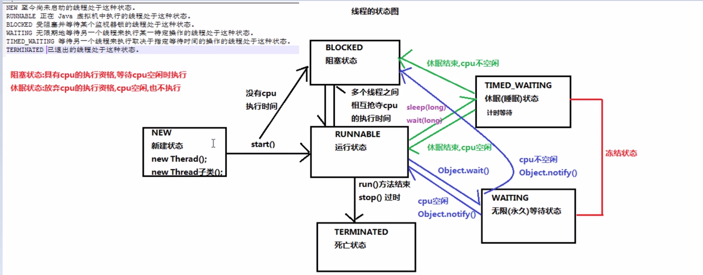
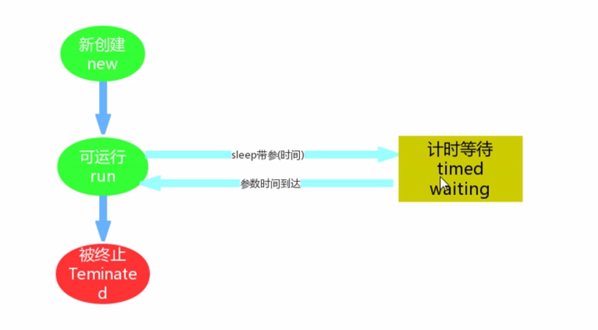
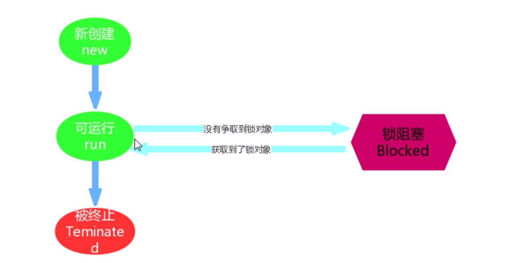

# 多线程

## 基本概念

1.  并发与并行

    -   并发：多个事件在同一时间段内发生（交替执行）
    -   并行：多个事件在同一时刻发生（同时执行）

2.  进程与线程

    -   进程：内存中运行着的应用程序
    -   线程：进程中的一个执行单元，负责当前进程中程序的执行

3.  线程调度

    -   分时调度：所有线程轮流使用CPU，平均分配每个线程占用CPU的时间
    -   抢占式调度：优先让优先级高的线程使用CPU，如果优先级相同则随机选择一个

4.  主线程：执行主方法的线程

    单线程程序：程序中只有一个线程

## Java中的多线程

java.lang.Thread是Java中是描述线程的类

-   实现步骤：

1.  创建一个Thread类的子类
2.  在Thread类的子类中重写Thread类中的run方法，设置线程任务
3.  创建Thread类的子类对象
4.  调用Thread类中的start方法，开启新的线程，执行run方法

-   注意：多次启动一个线程是非法的，特别是当前线程已经执行结束后，不能再重新启动

-   常用方法

    1.  `String getName()`:返回该线程的名称
    2.  `static Thread currentThread()`:返回当前正在执行的线程的引用
    3.  `void SetName(String name)`：改变线程名称
    4.  `Thread(String name)`：构造方法，分配新的线程对象
    5.  `static void sleep(long millis)`:使当前正在执行的线程以指定的毫秒值暂停

-   创建线程方法二

    实现Runnable接口

    1.  创建Runnable接口实现类
    2.  在实现类中重写run方法，设置线程任务
    3.  创建一个实现类对象
    4.  创建Thread实现类对象，构造方法中传递Runnable接口的实现类对象
    5.  调用Thread类中的start方法，开启新的线程，执行run方法

-   实现Runnable接口创建多线程的好处

    1.  避免了单继承的局限性
    2.  增强了程序的扩展性，降低了程序的耦合性（设置线程任务与开启线程）

-   匿名内部类实现线程创建

    1.  Thread方式

    ```java
    new Thread(){
        @Override
        public void run(){
            //......
        }
    }.start();
    ```

    2.  Runnable方式

    ```java
    new Thread(new Runnable(){
        @Override
        public void run(){
            //......
        }
    }).start();
    ```

 ## 线程安全

多线程访问了共享的数据，会产生线程安全问题

### 线程同步

通过线程同步技术可以解决线程安全问题

1.  同步代码块
2.  同步方法
3.  锁机制

### 同步代码块

`synchronized`关键字可以用于方法中的某个区块中，表示只对这个区块的资源进行互斥访问

```java
synchronized(同步锁){
    需要同步操作的代码
}
```

### 同步方法

同步方法保证只有一个线程能够同时执行该方法

```java
public synchronized void method(){
    需要同步操作的代码
}
```

同步方法的锁对象是`this`

注：静态同步方法

```java
public static synchronized void method(){
    需要同步操作的代码
}
```

​    静态同步方法的锁对象是本类的class属性->class文件对象

### Lock锁

java.util.concurrent.Locks.Lock接口

Lock实现提供了比使用synchronized方法和语句可获得更广泛的锁定操作

-   Lock接口中的方法
    1.  `void lock()`:获取锁
    2.  `void unlock()`:释放锁

java.util.concurrent.Locks.ReentrantLock实现了Lock接口

使用步骤：

1.  在成员位置创建一个ReentrantLock 对象
2.  在可能会出现线程安全问题的代码前调用lock获取锁
3.  在可能会出现线程安全问题的代码后调用unlock释放锁

## 线程状态

### 概述



### TIME WAITING



### BLOCKED



### WAITING

-   `wait()`：当前线程等待
-   `notify()`：唤醒对象监视器上的单个线程
-   `wait(long m)`：wait方法如果在毫秒值结束后没有被notify唤醒，则自动醒来，线程进入Runnable/Block状态
-   `notifyAll()`：唤醒对象监视器上的所有线程

## 等待唤醒机制

### 线程间通信

概念：多个线程在处理同一个资源，但是处理的动作却不相同

多个线程操作同一份数据时，需要避免对同一共享变量的争夺

### 等待与唤醒机制

-   方法：

1.  `wait()`：线程不再活动，进入wait set中，不会浪费CPU资源，这时线程状态为WAITING。
2.  `notify()`：选取所通知对象的wait set中的一个线程释放
3.  `notifyAll()`：选取所通知对象的wait set中的所有线程释放

-   注意：
    1.  哪怕只通知一个等待的线程，被通知的线程也不能立刻恢复执行（需要再次尝试去获取锁）
    2.  如果能获得锁，线程就从WAITING状态变成RUNNABLE状态
    3.  否则，从wait set出来，又进入entry set，线程就从WAITING状态变成BLOCKED状态
    4.  wait与notify方法必须由同一个锁对象调用
    5.  wait与notify方法是属于Object类的方法，任何一个类的对象都可以使用
    6.  wait与notify方法必须在同步代码块或同步函数中使用

### 生产者与消费者问题

等待与唤醒机制处理的是生产者与消费者问题

我们就自己做一个缓冲区，生产者和消费者的通信都是通过这个缓冲区的。value为""表示缓冲区空，value不为""表示缓冲区满：

```java
public class ValueObject
{
    public static String value = "";
}
```

接下来就是一个生产者了，如果缓冲区满了的，那么就wait()，不再生产了，等待消费者消费完通知；如果缓冲区是空的，那么就生产数据到缓冲区中

```java
public class Producer
{
    private Object lock;
    
    public Producer(Object lock)
    {
        this.lock = lock;
    }
    
    public void setValue()
    {
        try
        {
            synchronized (lock)
            {
                if (!ValueObject.value.equals(""))
                    lock.wait();
                String value = System.currentTimeMillis() + "_" + System.nanoTime();
                System.out.println("Set的值是：" + value);
                ValueObject.value = value;
                lock.notify();
            }
        }
        catch (InterruptedException e)
        {
            e.printStackTrace();
        }
    }
}
```

消费者类似，如果缓冲区是空的，那么就不再消费，wait()等待，等待生产者生产完通知；如果缓冲区不是空的，那么就去拿数据：

```java
public class Customer
{
    private Object lock;
    
    public Customer(Object lock)
    {
        this.lock = lock;
    }
    
    public void getValue()
    {
        try
        {
            synchronized (lock)
            {
                if (ValueObject.value.equals(""))
                    lock.wait();
                System.out.println("Get的值是：" + ValueObject.value);
                ValueObject.value = "";
                lock.notify();
            }
        } 
        catch (InterruptedException e)
        {
            e.printStackTrace();
        }
    }
}
```

写个主函数，开两个线程调用Producer里面的getValue()方法和Customer()里面的setValue()方法：

```java
public static void main(String[] args)
{
    Object lock = new Object();
    final Producer producer = new Producer(lock);
    final Customer customer = new Customer(lock);
    Runnable producerRunnable = new Runnable()
    {
        public void run()
        {
            while (true)
            {
                producer.setValue();
            }
        }
    };
    Runnable customerRunnable = new Runnable()
    {
        public void run()
        {
            while (true)
            {
                customer.getValue();
            }
        }
    };
    Thread producerThread = new Thread(producerRunnable);
    Thread CustomerThread = new Thread(customerRunnable);
    producerThread.start();
    CustomerThread.start();
}
```

## 线程池

### 原理

线程池->集合（`LinkedList<Thread>`）

1.  当程序第一次启动的时候，创建多个线程，保存到一个集合中

2.  想要使用线程的时候，就可以从集合中取出线程使用

3.  使用完毕后，把线程规划给线程池


 JDK1.5+之后，内置了线程池，可以直接使用

### 使用

-   java.util.concurrent.Executors线程池的工厂类，有创建线程池的静态方法

    `static ExecutorService newFixedThreadPool(int nThread)`:创建一个可重用固定线程的线程池

-   java.util.concurrent.ExecutorService线程池接口

	1.  `submit(Runnable task)`：提交一个Runnable任务用于执行，从线程池中获取线程，执行线程任务
	2.  `shutdown()`：关闭、销毁线程池
	
-   线程池的使用

    1.  使用Executors线程池的工厂类中的静态方法newFixedThreadPool生产一个指定线程数量的线程池
    2.  创建一个类，实现Runnable接口，重写run方法，设置线程任务
    3.  调用ExecutorService中的submit方法，开启线程，执行run方法
    4.  调用ExecutorService中的shutdown方法，销毁线程池（不建议使用）


