# 设计模式

软件工程中，设计模式是对软件设计中普遍存在的各种问题所提出的解决方案。

## 设计模式七大原则

### 设计模式目的

编写软件过程中，程序员面临着耦合性、内聚性以及可维护性、可扩展性、重用性、灵活性等多方面的挑战，设计模式是为了让软件具有更好的*代码重用性*、*可读性*、*可扩展性*、*可靠性*，使程序呈现**高内聚**、**低耦合**的特性。

-   代码重用性：相同功能的代码不用多次编写
-   可读性：编程的规范性，便于其他程序员的阅读和理解
-   可扩展性：当需要增加新功能时非常方便，也成为可维护性
-   可靠性：当增加新功能后对原功能没有影响

设计模式包含了面向对象的精髓。

### 七大原则

设计模式设计的基础

1.  **单一职责原则**

    一个类应该只负责一个职责。如果类A负责两个不同职责（职责1、职责2），当职责1需求变更而改变A时，可能造成职责2执行错误，需要将A的粒度分解为A1、A2。

    （1）降低类的复杂度，一个类只负责一项职责

    （2）提高类的可读性、可维护性

    （3）降低变更引起的风险

    （4）通常情况下，我们应当遵守单一职责原则。只有逻辑足够简单，才可以在代码级违反单一职责原则；只有类中方法数量足够少，才可以在方法级别保持单一职责原则

2.  **接口隔离原则**

    客户端不应该依赖它不需要的接口，即一个类对另一个类的依赖应该建立在最小的接口上

    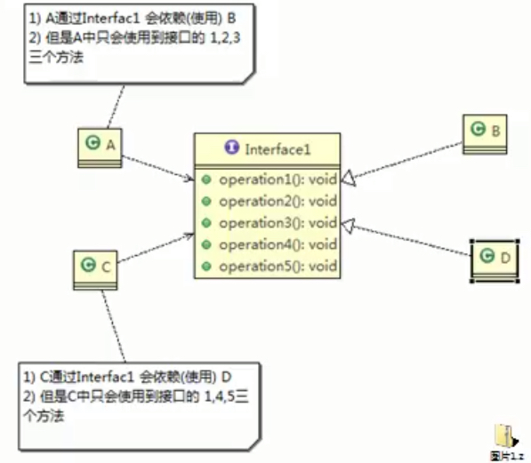

    按照隔离原则，将接口拆分为独立的几个接口，类A、C分别与他们需要的接口建立依赖关系，即接口隔离原则。

3.  **依赖倒转（倒置）原则**

    （1）高层模块不应该依赖底层模块，二者都应该依赖其抽象

    （2）抽象不应该依赖细节，细节应该依赖抽象

    （3）依赖倒转的中心思想是面向接口编程

    （4）设计理念：相对于细节的多变性，抽象的东西要稳定的多，以抽象为基础的架构比以细节为基础的架构要稳定的多。在Java中，抽象指的是接口或抽象类，细节就是具体的实现类。

    依赖关系的三种传递方式：

    -   接口传递

        ```java
        interface IOpenAndClose{
            public void open(ITV tv);
        }
        interface ITV{
            public void play();
        }
        class OpenAndClose implements IOpenAndClose{
            public void open(ITV tv){
                tv.play();
            }
        }
        ```

    -   构造方法传递

        ```java
        interface IOpenAndClose{
            public void open();
        }
        interface ITV{
            public void play();
        }
        class OpenAndClose implements IOpenAndClose{
            private ITV tv;
            public OpenAndClose(ITV tv){
                this.tv=tv;
            }
            public void open(){
                this.tv.play();
            }
        }
        ```

    -   setter方式传递

        ```java
        interface IOpenAndClose{
            public void open();
            public void setTv(ITV tv);
        }
        interface ITV{
            public void play();
        }
        class OpenAndClose implements IOpenAndClose{
            private ITV tv;
            public void open(){
                this.tv.play();
            }
            public void setTv(ITV tv){
                this.tv=tv;
            }
        }
        ```

    注意事项：

    （1）低层模块尽量都要有抽象类或接口，或者两个都有，程序稳定性更好

    （2）变量的声明类型尽量是抽象类或接口，利于程序扩展和优化

    （3）继承时遵循里氏替换原则

4.  **里氏替换原则**

    如果对每个类型为T1的对象o1，都有类型为T2的对象o2，使得以T1定义的所有程序P在所有的对象o1都代换为o2时，程序P的行为没有发生变化，那么类型T2是类型T1的子类型，即所有引用基类的地方必须能透明地使用其子类的对象。

    （1）在使用继承时，遵循里氏替换原则，在子类中尽量不要重写父类的方法

    （2）继承实际上让两个类耦合性增强了，在适当的情况下，可以通过聚合、组合、依赖来解决问题

5.  **开闭原则**

    编程中最基础、最重要的设计原则

    （1）一个软件实体如类、模块和函数应该对扩展开放（对提供方），对修改关闭（对使用方）。用抽象构建框架，用实现扩展细节。

    （2）当软件需要变化时，尽量通过扩展软件实体的行为来实现变化，而不是通过修改已有的代码来实现变化。

    （3）编程中遵循其他原则，以及使用设计模式的目的就是遵循开闭原则。

6.  **迪米特法则**

    （1）一个对象应该对其他对象保持最少的了解

    （2）类与类关系越密切，耦合度越大

    一个类对自己依赖的类知道的越少越好，即对于依赖的类不管多么复杂，都尽量将逻辑封装在类的内部。对外除了提供public方法，不对外泄露任何信息。只与类的直接朋友（成员变量、方法参数、方法返回值中的类）通信，陌生类不要以局部变量的方式出现。

    -   核心是降低类之间的耦合
    -   减少了不必要的依赖，只要求降低类间的耦合，并不是要求完全没有依赖关系

7.  **合成复用原则**

    尽量使用合成/聚合的方式，而不是使用继承

## 类的关系

### 依赖关系

（1）类中用到了对方

（2）类的成员属性、方法返回类型、方法接收的参数类型、方法中使用的是另一个类

### 泛化关系

（1）泛化关系实际上就是继承关系

（2）是依赖关系的特例

### 实现关系

实际上就是A类实现B接口，是依赖关系的特例

### 关联关系

（1）实际上是类与类之间的关系，是依赖关系的特例

（2）关联具有导航性，即单向关系或双向关系

-   单向关系

    ```java
    public class Person{
        private IDcard card;
    }
    public class IDCard{
    }
    ```

-   双向关系

    ```java
    public class Person{
        private IDcard card;
    }
    public class IDCard{
        private Person person;
    }
    ```

### 聚合关系

聚合关系表示的是整体和部分的关系，整体与部分可以拆开。聚合关系是关联关系的特例，具有导航性与多重性。

```java
public class Computer{
    Mouse mouse;
    Monitor monitor;
}
public class Mouse{}
public class Monitor{}
```

### 组合关系

组合关系也是整体和部分的关系，但整体和部分不可以分开。

```java
public class Person{
    private IDCard card;
    private Head head=new Head();
}
public class IDCard{}
public class Head{}
//Person与Head之间是组合关系，不可分离
//Person与IDCard之间是聚合关系，但是如果在删除或者创建时是级联的，也会构成组合关系
```

## 设计模式

### 设计模式分类

设计模式分为三类，一共23种

-   创建型模式：单例模式、抽象工厂模式、原型模式、建造者模式、工厂模式
-   结构型模式：适配器模式、桥接模式、装饰模式、组合模式、外观模式、享元模式、代理模式
-   行为型模式：模板方法模式、命令模式、访问者模式、迭代器模式、观察者模式、中介者模式、备忘录模式、解释器模式、状态模式、策略模式、职责链模式

### 单例模式

类的单例模式，就是采取一定的方法保证在整个软件系统中，对某个类只能存在一个类的对象实例，并且该类只提供一个取得其对象实例的方法（静态方法）。

-   实现方式

    1.  饿汉式（静态常量）

        （1）构造器私有化（防止new）

        （2）类的内部创建对象

        （3）对外暴露一个公共的静态方法：getInstance

        ```java
        class Singleton{
            private Singleton(){
            }
            private final static Singleton instance = new Singleton();
            public static Singleton getInstance(){
                return instance;
            } 
        }
        ```

        优点：在类装载的时候就完成实例化，避免了线程同步问题

        缺点：在类装载的时候就完成了实例化，没有达到Lazy Loading的效果，如果从始至终从未使用这个实例，则会造成内存的浪费（不能确定有没有其他的方式导致类装载）

    2.  饿汉式（静态代码块）

        ```java
        class Singleton{
            private Singleton(){
            }
            private static Singleton instance;
            static{
                instance = new Singleton();
            }
            public static Singleton getInstance(){
                return instance;
            } 
        }
        ```

        在类装载时，就执行静态代码块中的代码，初始化类的实例。

    3.  懒汉式（线程不安全）

        提供一个静态的公有方法，当使用到该方法时才去创建instance

        ```java
        class Singleton{
            private static Singleton instance;
            private Singleton(){
             }
            public static Singleton getInstance(){
                if(instance==null) instance=new Singleton();
                return instance;
            }
        }
        ```

        优点：起到了Lazy Loading的效果

        缺点：只能在单线程下使用，在多线程环境下不可使用这种方式

    4.  懒汉式（线程安全，同步方法）

        ```java
        class Singleton{
            private static Singleton instance;
            private Singleton(){
             }
            public static synchronized Singleton getInstance(){//解决线程不安全问题
                if(instance==null) instance=new Singleton();
                return instance;
            }
        }
        ```

        优点：解决了线程不安全的问题

        缺点：效率太低了

    5.  懒汉式（线程安全，同步代码块）

        ```java
        class Singleton{
            private static Singleton instance;
            private Singleton(){
             }
            public static Singleton getInstance(){
                if(instance==null) {
                    synchronized (Singleton.class){
                        instance=new Singleton();
                    }
                }
                return instance;
            }
        }
        ```

        并不能起到线程同步的作用，假如一个线程进入if判断语句块还没有来得及往下执行，另一个线程也通过了这个判断语句，这时便会产生多个实例。

    6.  双重检查

        ```java
        class Singleton{
            private static volatile Singleton instance;//让修改值立即更新到主存
            private Singleton(){
             }
            public static Singleton getInstance(){
                if(instance==null) {
                    synchronized (Singleton.class){
                        if(instance==null)
                        	instance=new Singleton();
                    }
                }
                return instance;
            }
        }
        ```

        解决了线程安全问题，同时解决懒加载的问题，保证了效率

    7.  静态内部类

        ```java
        class Singleton{
            
            private Singleton(){
             }
            private static class SingletonInstance{
                private static final Singleton INSTANCE = new Singleton();
            }
            public static Singleton getInstance(){
                return SingletonInstance.INSTANCE;
            }
        }
        ```

        避免了线程不安全的问题，利用静态内部类的类装载机制实现延迟加载，效率高

    8.  枚举

        ```java
        enum Singleton{
            INSTANCE;
            public void method(){
                //do something
            }
        }
        //使用：Singleton.INSTANCE
        ```

        避免了多线程同步问题，并且防止反序列化来创建新的对象。

    -   注意事项：

        1.  单例模式保证了系统内存中该类只存在一个对象，节省了系统资源。对于一些需要频繁创建销毁的对象，使用单例模式可以提高系统性能

        2.  想要实例化一个单例类的时候，需要记住使用相应的获取对象的方法，而不是使用new

        3.  使用场景：

            （1）需要频繁进行创建和销毁的对象

            （2）创建对象时耗时过多或资源耗费过多

            （3）经常用到的对象、工具类对象、频繁访问数据库或文件的对象

### 工厂模式

-   简单工厂模式

    简单工厂模式属于创建型模式，是工厂模式的一种，由一个工厂对象决定创建出哪一种产品类的实例。简单工厂模式是工厂模式家族最简单实用的模式。

    定义一个创建对象的类（工厂类），封装了实例化对象的行为。

    ```java
    public class SimpleFactory{
        public Pizza createPizza(String ordertype){
            Pizza pizza=null;
            if(ordertype.equals("greek")){
                pizza=new GreekPizza();
                pizza.setName("希腊披萨");
            }
            else if(ordertype.equals("cheese")){
                pizza=new CheesePizza();
                pizza.setName("奶酪披萨");
            }
            return pizza;
        }
    }
    ```

    ```java
    public class OrderPizza{
        SimpleFactory simpleFactory;
        Pizza pizza=null;
        
        public OrderPizza(SimpleFactory simpleFactory){
            setFactory(simpleFactory);
        }
        
        public void setFactory(SimpleFactory simpleFactory){
            String orderType="";
            this.simpleFactory=simpleFactory;
            do{
                orderType=getType();//输入pizza类型
                pizza=this.simpleFactory.createPizza(orderType);
                if(pizza!=null){
                    //输出pizza信息
                }
                else{
                    //订购失败
                    break;
                }
            }while(true);
        }
    }
    ```

    简单工厂模式也称为静态工厂模式，可以将方法设置为静态的。

    -   工厂方法模式

        将实例化功能抽象成抽象方法，在子类中进行具体实现。

        工厂方法模式定义一个创建对象的抽象方法，由子类决定要实例化的类。工厂方法模式将对象的实例化推迟到子类。

        ```java
        public abstract class OrderPizza{
            public OrderPizza(){
                Pizza pizza=null;
                String orderType="";
                do{
                    orderType=getType();
                    pizza=createPizza(orderType);
                    //制作pizza
                }while(true);
            }
            public abstract Pizza createPizza(String orderType);
        }
        ```

    -   抽象工厂模式

        定义一个接口用于创建相关或有依赖关系的对象簇，而无需指明具体的类。

        抽象工厂模式可以视为简单工厂模式和工厂方法模式的整合，将工厂抽象为两层：抽象工厂和具体实现的工厂子类，根据创建对象类型使用对应的工厂子类。

        ```java
        public interface AbsFactory{
            public Pizza createPizza(String orderType);
        }
        class BJFactory implements AbsFactory{
            public Pizza createPizza(String orderType){
                Pizza pizza=null;
                if(ordertype.equals("greek")){
                    pizza=new GreekPizza();
                    pizza.setName("希腊披萨");
                }
                else if(ordertype.equals("cheese")){
                    pizza=new CheesePizza();
                    pizza.setName("奶酪披萨");
                }
                return pizza;
            }
        }
        ```

    -   注意事项

        1.  工厂模式将实例化的代码抽象出来，放到一个类中统一管理和维护，达到和主项目的依赖关系的解耦，从而提高项目的扩展和维护性。
        2.  创建对象实例时，不要直接new类，而是把这个动作放在一个工厂的方法中，并返回。
        3.  不要让类继承具体类，而是继承抽象类或者实现接口
        4.  不要覆盖基类中已经实现的方法

### 原型模式

java中Object类提供了一个clone()方法，可以将对象复制一份，但需要实现克隆的java类必须实现Cloneable接口，该接口表示能够复制且具有复制的能力。

原型模式是指用原型实例指定创建对象的种类，并且通过拷贝这些原型创建新的对象。原型模式是一种创建型设计模式，允许一个对象再创建一个可定制的对象，无需知道如何创建的细节。通过将一个原型对象传给一个要发动创建的对象，这个要发动创建的对象通过请求原型对象拷贝它们自己来实施创建。

```java
public class Sheep implements Cloneable{
    private String name;
    private int age;
    private String color;
    //......
    protected Object clone() throws CloneNotSupportedException{
        Sheep sheep=null;
        sheep=(Sheep)super.clone();
        return sheep;
    }
}
```

-   浅拷贝与深拷贝

    1.  浅拷贝

        对于基本数据类型的成员变量，浅拷贝会进行值传递，即将属性值复制一份给新的对象

        对于数据类型是引用数据类型的成员变量，浅拷贝只将该成员变量的地址值复制给新的对象，实际上两个对象的该成员变量都指向同一个实例

        浅拷贝用默认的clone方法实现`super.clone()`

    2.  深拷贝

        复制对象的所有基本数据类型的成员变量值

        为所有引用数据类型的成员变量申请存储空间，并复制每个引用数据类型成员变量所引用的对象，直到该对象可达的所有对象，即对整个对象进行拷贝。

        深拷贝可通过重写clone方法来实现或通过对象序列化来实现

```java
public class DeepCloneableTarget implements Serializable, Cloneable{
    private static final long serialVersionUID=1L;
    private String cloneName;
    private String cloneClass;
    public DeepCloneableTarget(String cloneName, String cloneClass){
        this.cloneName=cloneName;
        this.cloneClass=cloneClass;
    }
    protected Object clone() throws CloneNotSupportedException{
        return super.clone();
    }
}

public class DeepProtoType implements Serializable, Cloneable{
    public String name;
    public DeepCloneableTarget deepCloneableTarget;
    //...
    
    //深拷贝1 clone方法
    protected Object clone() throws CloneNotSupportedException{
        Object deep=null;
        deep=super.clone();//完成对基本数据类型和字符串的克隆
        //单独处理引用数据类型
        DeepProtoType deepProtoType=(DeepProtoType)deep;
        deepProtoType.deepCloneableTarget=(DeepCloneableTarget)deepCloneableTarget.clone();
        return deepProtoType;
    }
    //深拷贝2 序列化
    public Object deepClone(){
        ByteArrayOutputStream bos=null;
        ObjectOutputStream oos=null;
        ByteArrayInputStream bos=null;
        ObjectInputStream oos=null;
        try{
            bos=new ByteArrayOutputStream();
            oos=new ObjectOutputStream(bos);
            oos.write(this);//序列化
            bis=new ByteArrayInputStream(bos.toByteArray());
            ois=new ObjectInputStream(bis);
            DeepProtoType deep=(DeepProtoType)ois.readObject();//反序列化
            return deep;
        }
        catch(Exception e){
            return null;
        }
        finally{
            bos.close();
            oos.close();
            bis.close();
            ois.close();
        }
    }
}
```

注意事项：

1.  创建新的对象比较复杂时，可以用原型模式简化创建过程，同时也能提高效率
2.  不用重新初始化对象，而是动态获取对象运行状态
3.  如果原始对象发生变化，其它克隆对象也会发生相应的变化，无需修改代码
4.  在实现深克隆的时候可能需要比较复杂的代码
5.  缺点：需要给每个类配备一个克隆方法，如果对已有的类进行改造时违背了ocp原则

### 建造者模式

在建造者模式中，把产品和产品建造过程解耦。

建造者模式也叫生成器模式，是一种对象构建模式，可以将复杂对象的建造过程抽象出来，使这个抽象过程的不同实现方法可以构造出不同表现的对象。

建造者模式是一步一步创建一个复杂的对象，它允许用户只通过指定复杂对象的类型和内容就可以构建它们，用户不需要知道内部的具体构建细节。

-   建造者模式的核心角色
    1.  Product（产品角色）：一个具体的产品对象
    2.  Builder（抽象建造者）：创建一个Product对象的各个部件指定的接口/抽象类
    3.  ConcreteBuilder（具体建造者）：实现接口、构建和装配各个部件
    4.  Director（指挥者）：构建一个使用Builder接口的对象，它主要用于创建一个复杂的对象。作用：（1）隔离了客户与对象的生产过程；（2）负责控制产品对象的生产过程

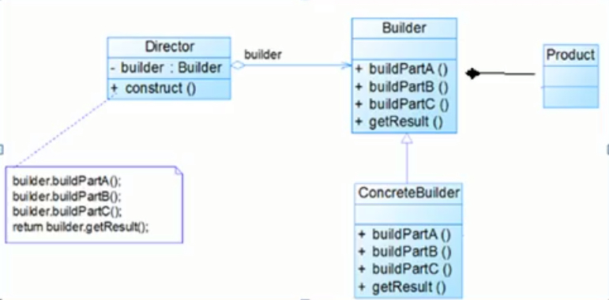

```java
//Product
public class House{
    private String base;
    private String wall;
    private String roofed;
    //...
}
//抽象的建造者
public abstract class HouseBuilder{
    protected House house=new House();
    //抽象建造方法
    public abstract void buildBasic();
    public abstract void buildWalls();
    public abstract void roofed();
    //getResult
    public House buildHouse(){
        return house;
    }
}
//具体的建造者
public class CommonHouse extends HouseBuilder{
    public void buildBasic(){
        System.out.println("打地基");
    }
    public void buildWalls(){
        System.out.println("砌墙");
    }
    public void roofed(){
        System.out.println("盖屋顶");
    }
}
//指挥者
//动态指挥建造流程
public class HouseDirector{
    HouseBuilder houseBuilder = null;
    //构造器传入或setter传入
    public HouseDirector(HouseBuilder houseBuilder){
        this.houseBuilder=houseBuilder;
    }
    public void setHouseBuilder(HouseBuilder houseBuilder){
        this.houseBuilder=houseBuilder;
    }
    //处理流程，交给指挥者
    public House constructHouse(){
        houseBuilder.buildBasic();
        houseBuilder.buildWalls();
        houseBuilder.roofed();
        return houseBuilder.buildHouse();
    }
}
//Client
public class Client{
    public static void main(String[] args){
        CommonHouse commonHouse=new CommonHouse();
        HouseDirector houseDirector=new HouseDirector(commonHouse);
        House house=houseDirector.constructHouse();
    }
}
```

-   注意事项

    1.  客户端不必知道产品内部组成的细节，将产品本身和产品的创建过程解耦，使得相同的创建过程可以创建不同的产品对象
    2.  每一个具体建造者都相对独立，而与其他的具体建造者无关，因此可以很方便地替换具体建造者或增加新的具体建造者，用户使用不同的具体建造者即可得到不同的产品对象
    3.  可以更加精细地控制产品的创建过程。将复杂产品的创建步骤分解在不同的方法中，使得创建过程更加清晰，也更方便使用程序来控制创建流程
    4.  增加新的具体建造者无需修改原有类库的代码，指挥者类针对抽象建造者类编程，系统扩展方便，符合“开闭原则”
    5.  建造者模式所建造的产品一般具有较多的共同点，其组成部分相似
    6.  如果产品内部变化复杂，可能会导致需要定义很多具体建造者类来实现这种变化，导致系统变得很庞大，因此在这种情况下，要考虑是否选择建造者模式

-   抽象工厂模式 vs 建造者模式

    抽象工厂模式实现对产品家族的创建，不需要关心构建过程，只关心什么产品是什么工厂生产的即可；

    建造者模式要求按照指定的蓝图建造产品，目的是通过组装零配件而产生一个新产品。

### 适配器模式

适配器模式将某个类的接口转换成客户端期望的另一个接口表示，主要目的是兼容性，让原本因接口不匹配不能一起工作的两个类可以协同工作，其别名为包装器。

适配器模式属于结构型模式，主要分为三类：类适配器模式、对象适配器模式、接口适配器模式。

适配器模式将一个接口转换成另一个接口，让原本不兼容的类可以兼容，从用户的角度看不到被适配者，是解耦的。用户调用适配器转化出来的目标接口方法，适配器再调用被适配者的相关接口方法，用户收到反馈结果感觉只是与目标接口交互。

-   类适配器模式

    Adapter类通过继承src类，实现dst类接口，完成src->dst的适配。

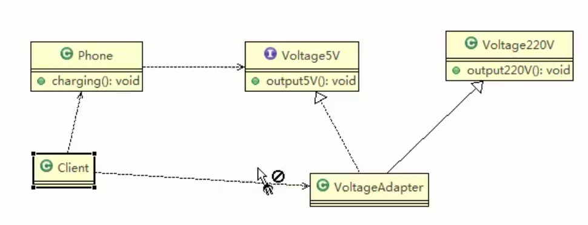

```java
//被适配类
public class Voltage220V{
    public int output220V{
        int src=220;
        return src;
    }
}
//适配接口
public interface IVoltage5V{
    public int output5V();
}

public class VoltageAdapter extends Voltage220V implements IVoltage5V{
    public int output5V(){
        int srcV=output220V();
        int dstV=srcV/44;
        return dstV;
    }
}

public class Phone{
    public void charging(IVoltage5V iVoltage5V){
        if(iVoltage5V.output5V()==5){
            //充电
        }
        else{
            //不充电
        }
    }
}

public class Client{
    public static void main(String[] args){
        Phone phone=new Phone();
        phone.charging(new VoltageAdapter());
    }
}
```

注意事项：

1.  Java是单继承机制，所以类适配器要求dst必须是接口，有一定局限性
2.  src类的方法在Adapter中都会暴露出来，也增加了使用成本
3.  由于其继承了src类，所以它可以根据要求重写src类的方法，使得Adapter类的灵活性增强了

-   对象适配器

    将Adapter类作修改，不是继承src类，而是持有src类的实例，以解决兼容问题，即持有src类并实现dst类接口来完成src->dst的适配

    ```java
    //接口、被适配的类不变
    public class VoltageAdapter implements IVoltage5V{
        private Voltage220V voltage220V;
        //构造器传入
        public VoltageAdapter(Voltage220V voltage220V){
            this.voltage220V=voltage220V;
        }
        public int output5V(){
            int dst=0;
            if(voltage220V!=null){
                int src=voltage220V.output220V();
                dst=src/44;
            }
            return dst;
        }
    }
    
    public class Client{
        public static void main(String[] args){
            Phone phone=new Phone();
            phone.charging(new VoltageAdapter(new Voltage220V()));
        }
    }
    ```
    
    注意事项：
    
    1.  对象适配器和类适配器是同一种思想，只不过实现方式不同，用组合替代继承，解决了类适配器必须继承src的局限性问题，也不再要求dst必须是接口
    2.  使用成本更低，更灵活
    
-   接口适配器

    当不需要全部实现接口提供的方法时，可先设计一个抽象类实现接口，并为该接口中每个方法提供一个默认实现（空方法），那么该抽象类的子类可有选择地覆盖父类的某些方法来实现需求

    适用于一个接口不想使用其所有方法的情况    

    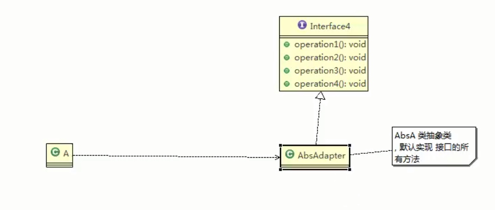

    ```java
    public interface Interface{
        public void m1();
        public void m2();
        public void m3();
        public void m4();
    }
    
    public abstract class AbsAdapter implements Interface{
        public void m1(){
            
        }
        public void m2(){
            
        }
        public void m3(){
            
        }
        public void m4(){
            
        }
    }
    
    public class Client{
        public static void main(String[] args){
            AbsAdapter a= new AbsAdapter(){
                public void m1(){
                    //重写m1方法
                }
            };
            a.m1();
        }
    }
    ```

-   注意事项
    1.  三种命名方式：根据src是怎样的形式给到Adapter
    2.  Adapter模式最大的作用是将原来不兼容的接口融合在一起工作

### 桥接模式

将实现与抽象放在两个不同的类层次中，使两个层次可以独立改变，是一种结构型设计模式，基于类的最小设计原则，通过使用封装、聚合及继承等行为让不同的类承担不同的职责。它的主要特点是把抽象与行为实现分离开来，从而可以保持各部分的独立性以及应对他们的功能扩展。

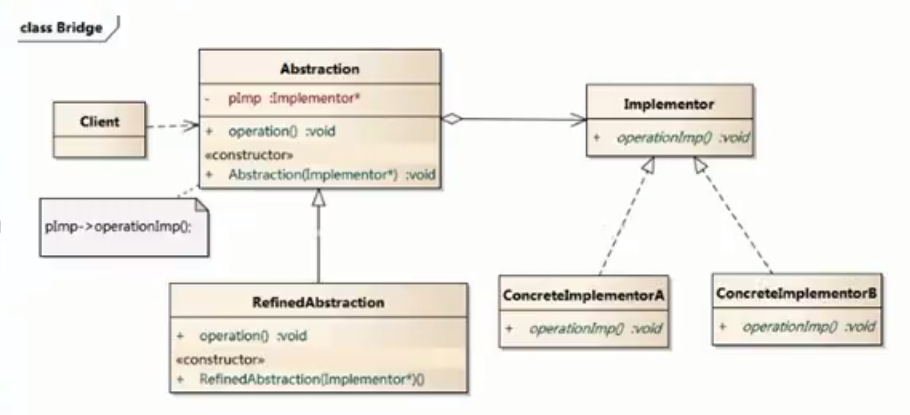

-   Client类：桥接模式的调用者
-   抽象类：维护了Implementor（即它的实现类），聚合关系，Abstraction充当了桥接类
-   RefinedAbstraction：是Abstraction抽象类的子类
-   Implementor：行为实现类的接口
-   ConcreteImplementorA/B：行为的具体实现类
-   这里的抽象类和接口是聚合关系，调用和被调用的关系

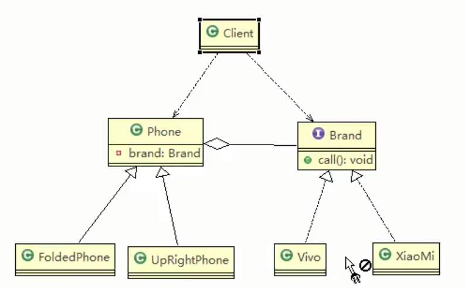

```java
public interface Brand{
    void open();
    void close();
    void call();
}

public class Xiaomi implements Brand{
    void open(){
        System.out.println("小米手机开机");
    }
    void close(){
        System.out.println("小米手机关机");
    }
    void call(){
        System.out.println("小米手机打电话");
    }
}

public class Vivo implements Brand{
    void open(){
        System.out.println("Vivo手机开机");
    }
    void close(){
        System.out.println("Vivo手机关机");
    }
    void call(){
        System.out.println("Vivo手机打电话");
    }
}

public abstract class Phone{
    private Brand brand;
    public Phone(Brand brand){
        this.brand=brand;
    }
    protected void open(){
        this.brand.open();
    }
    protected void close(){
        this.brand.close();
    }
    protected void call(){
        this.brand.call();
    }
}

public class FoldedPhone extends Phone{
    public FoldedPhone(Brand brand){
        super(brand);
    }
    public void open(){
        System.out.println("折叠手机");
        super.open();
    }
    public void close(){
        System.out.println("折叠手机");
        super.close();
    }
    public void call(){
        System.out.println("折叠手机");
        super.call();
    }
}

public class Client{
    public static void main(String[] args){
        Phone phone=new FoldedPhone(new Xiaomi());
        phone.open();
        phone.call();
        phone.close();
    }
}
```

-   注意事项：
    1.  实现了抽象和实现部分的分离，提高了系统的灵活性，有助于系统进行分层设计，从而产生更好的结构化系统
    2.  对于系统的高层部分，只需要知道抽象部分和实现部分的接口就可以了，其他的部分由具体业务来完成
    3.  桥接模式替代多层继承方案，可以减少子类的个数，降低系统的管理和维护成本
    4.  桥接模式的引入增加了系统的理解和设计难度，由于聚合关联关系建立在抽象层，要求开发者针对抽象进行设计和编程
    5.  桥接模式要求正确识别出系统中两个独立变化的维度，因此其使用范围有一定的局限性，即需要有这样的应用场景

### 装饰者模式

装饰者模式动态地将新功能附加到对象上，在对象功能扩展方面比继承更有弹性，体现了开闭原则。

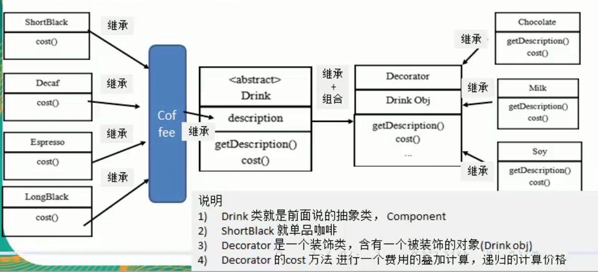

```java
public abstract class Drink{
    public String des;
    private float price=0.0f;
    //...
    public abstract float  cost();
}

public class Coffee extends Drink{
    public float  cost(){
        return super.getPrice();
    }
}

public class Espresso extends Coffee{
    public Espresso(){
        setDes("意大利咖啡");
        setPrice(6.0f);
    }
}

public class Decorator extends Drink{
    private Drink obj;
    public Decorator(Drink obj){
        this.obj=obj;
    }
    public String getDes(){
        return super.des+" "+super.getPrice()+" && "+obj.getDes();
    }
    public float  cost(){
        return super.getPrice()+obj.cost();
    }
}

public class Chocolate extends Decorator{
    public Chocolate(Drink obj){
        super(obj);
        setDes("巧克力");
        setPrice(3.0f);
    }
}

public class CoffeeBar{
    public static void main(String[] args){
        Drink order=new LongBlack();
        float price1=order.cost();
        String des1=order.getDes();
        order = new Milk(order);
        float price2=order.cost();
        String des2=order.getDes();
    }
}
```

### 组合模式

组合模式也叫部分整体模式，它创建了对象组的树形结构，将对象组合成树形结构以表示整体-部分的层次关系，属于结构型模式。组合模式的使用使得用户对单个对象和组合对象的访问具有一致性，即组合能让客户以一致的方式处理个别对象与组合对象。

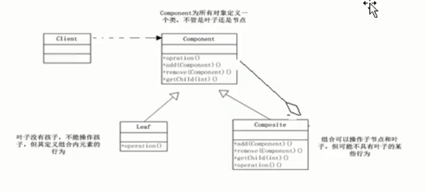

-   Component：组合中的对象声明接口，在适当的情况下实现所有类共有的接口默认行为，用于访问和管理Component子部件，可以是抽象类或接口。
-   Leaf：表示叶子结点，没有子节点。
-   Composite：非叶子结点，用于存储子部件，在Component接口中实现子部件的相关操作。

当我们要处理的对象可以生成一棵树形结构，而我们要对树上的结点和叶子进行操作时，组合模式能够提供一致的方式，而不用考虑它是节点还是叶子。

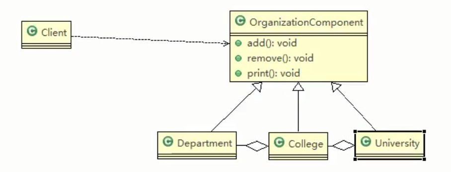

```java
public abstract class OrganizationComponent{
    private String name;
    private String des;
    protected void add(OrganizationComponent organizationComponent){
        throw new UnsupportedOperationException();
    }
    protected void remove(OrganizationComponent organizationComponent){
        throw new UnsupportedOperationException();
    }
    public OrganizationComponent(String name, String des){
        this.name=name;
        this.des=des;
    }
    //...
    protected abstract void print();
}

public class University extends OrganizationComponent{
    List<OrganizationComponent> organizationComponents = new ArrayList<>();
    public University(String name, String des){
        super(name,des);
    }
    protected void add(OrganizationComponent organizationComponent){
        organizationComponents.add(organizationComponent)
    }
    protected void remove(OrganizationComponent organizationComponent){
        organizationComponents.remove(organizationComponent)
    }
    //...
    protected void print(){
        System.out.println(getName());
        for(OrganizationComponent organizationComponent:organizationComponents){
            organizationComponent.print();
        }
    }
}

//....

public class Client{
    public static void main(String[] args){
        University u=new University("u","des1");
        College c1=new College("c1","c1");
        College c2=new College("c2","c2");
        c1.add(new Department("d1","d1"));
        c1.add(new Department("d2","d2"));
        c1.add(new Department("d3","d3"));
        c2.add(new Department("d4","d4"));
        c2.add(new Department("d5","d5"));
        u.add(c1);
        u.add(c2);
        u.print();
    }
}
```

-   注意事项：
    1.  简化客户端操作
    2.  具有较强扩展性
    3.  方便创建出复杂的层次结构，客户端不会理会组合里面的组成细节
    4.  需要遍历组织结构或者需要处理的对象具有树形结构时，非常适合使用组合模式
    5.  要求较高的抽象性，如果节点和叶子有很多差异性，不适合使用组合模式

### 外观模式

外观模式也叫过程模式，为子系统中的一组接口提供一个一致的界面。此模式定义了一个高层接口，这个接口使得这一子系统更加容易使用。外观模式通过定义一个一致的接口，用以屏蔽内部子系统的细节，使得调用端只需跟这个接口发生调用，而无需关心这个子系统的内部细节。

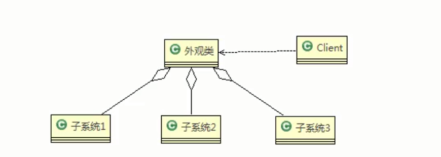

-   外观类（Facade）：为调用端提供统一的调用接口，知道哪些子系统负责处理请求，从而将调用端的请求代理给适当的子系统对象
-   调用者（Client）：外观接口的调用者
-   子系统的集合：模块或者子系统，处理Facade对象指派的任务，他是功能的提供者

```java
public class DVDPlayer{
    private static DVDPlayer instance = new DVDPlayer();
    public static DVDPlayer getInstance(){
        return instance;
    }
    public void on(){
        System.out.println("DVD on");
    }
    public void off(){
        System.out.println("DVD off");
    }
    public void play(){
        System.out.println("DVD play");
    }
    public void pause(){
        System.out.println("DVD pause");
    }
}

public class Popcorn{
    private static Popcorn instance = new Popcorn();
    public static Popcorn getInstance(){
        return instance;
    }
    public void on(){
        System.out.println("Popcorn on");
    }
    public void off(){
        System.out.println("Popcorn off");
    }
    public void pop(){
        System.out.println("Popcorn pop");
    }
}

public class HomeTheaterFacade{
    private TheaterLight theaterLight;
    private Popcorn popcorn;
    private Stereo stereo;
    private Projector projector;
    private Screen screen;
    private DVDPlayer dVDPlayer;
    public HomeTheaterFacade(TheaterLight theaterLight, Popcorn popcorn, Stereo stereo, Projector projector, Screen screen, DVDPlayer dVDPlayer){
        this.theaterLight=TheaterLight.getInstance();
        this.popcorn=Popcorn.getInstance();
        this.stereo=Stereo.getInstance();
        this.projector=Projector.getInstance();
        this.screen=Screen.getInstance();
        this.dVDPlayer=DVDPlayer.getInstance();
    }
    
    public void ready(){
        popcorn.on();
        popcorn.ready();
        screen.down();
        projector.on();
        stereo.on();
        dvDPlayer.on();
        theaterLight.dim();
    }
    
    public void play(){
        dVDPlayer.play();
    }
    
    public void pause(){
        dVDPlayer.pause();
    }
    
    public void end(){
        popcorn.off();
        theaterLight.light();
        screen.up();
        projector.off();
        stereo.off();
        dvDPlayer.off();
        
    }
    
    
}

public class Client{
    public static void main(String[] args){
        HomeTheaterFacade h=new HomeTheaterFacade();
        h.ready();
        h.play();
    }
}
```

-   注意事项：
    1.  对外屏蔽了子系统的细节，降低了客户端对子系统使用的复杂性
    2.  外观模式对客户端与子系统进行了解耦，让子系统内部模块更易维护和扩展
    3.  通过合理地使用外观模式，可以帮我们更好地划分访问的层次
    4.  当系统需要分层设计时，可以考虑使用外观模式
    5.  在维护一个遗留的大型系统时，可能这个系统已经变得非常难以维护和扩展，可以考虑为新系统开发一个Facade类，来提供遗留系统的比较清晰简单的接口，让新系统与Facade类交互，提高复用性
    6.  不能过多地或者不合理地使用外观模式，要让系统以有层次、利于维护为目的

### 享元模式

享元模式也叫蝇量模式，运用共享技术有效地支持大量细粒度的对象，常用于系统底层开发，解决系统的性能问题。

享元模式能够解决重复对象的内存浪费问题，当系统中有大量相似对象需要缓冲池时，不需总是创建新对象，可以从缓存池里拿，这样可以降低系统内存，同时提高效率。

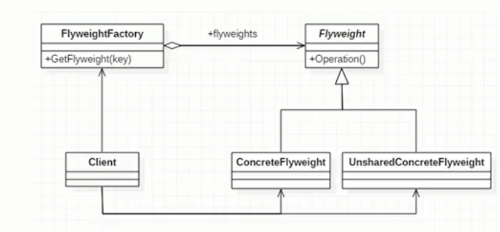

-   Flightweight：抽象的享元角色，产品的抽象类，同时定义出对象的外部状态和内部状态的接口或实现
-   ConcreteFlyWeight：具体的享元角色，具体的产品类，实现抽象角色定义相关业务
-   UnSharedConcreteFlyWeight：不可共享的角色，一般不会出现在享元工厂中
-   FlyWeightFactory：享元工厂类，用于构造一个池的容器（集合），同时还要提供从池中获取对象方法

享元模式的两个要求：细粒度和共享对象，需要将对象的信息分为两部分（内部状态和外部状态）。内部状态指对象共享出来的信息，存储在享元对象内部且不会随环境的改变而改变；外部状态指对象得以依赖的一个标记，是随环境改变而改变的、不可共享的状态。

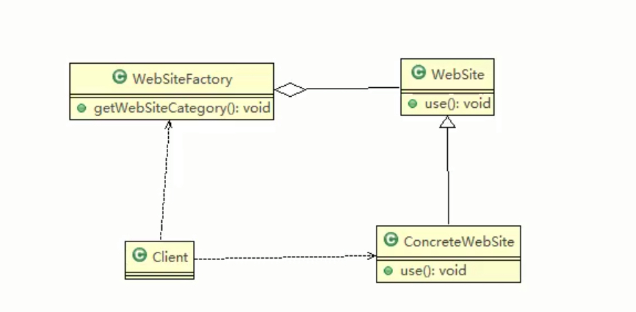

```java
public abstract class WebSite{
    public abstract void use(User user);
}

public class ConcreteWebSite extends WebSite{
    private String type="";//网站发布类型
    public ConcreteWebSite(String type){
        this.type=type;
    }
    public void use(User user){
        System.out.println("网站发布类型："+type);
        System.out.println("使用者："+user.getName());
    }
}
//网站工厂类
public class WebSiteFactory{
    //池
    private HashMap<String , ConcreteWebSite> pool=new HashMap<>();
    //根据网站类型返回网站，如果没有就创建
    public WebSite getWebSiteCategory(String type){
        if(!pool.containsKey(type)){
            pool.put(type, new ConcreteWebSite(type));
        }
        return (WebSite)pool.get(type);
    }
    //获取网站分类的总数
    public int getWebSiteCount(){
        return pool.size();
    }
}

public class Client{
    public static void main(String[] args){
        WebSiteFactory factory=new WebSiteFactory();
        WebSite website1=factory.getWebSiteCategory("新闻");
        User u1=new User("abc");
        website1.use(u1);
    }
}

public class User{
    private String name;
    //...
}
```

-   注意事项
    1.  如果系统中有大量对象消耗大量内存，并且对象的状态大部分可以外部化时，可以考虑使用享元模式
    2.  用唯一标识码判断，如果在内存中有则返回唯一标识吗所标识的对象，用HashMap/HashTable存储
    3.  享元模式大大减少了对象的创建，降低了程序内存的占用，提高效率
    4.  享元模式提高了系统的复杂度，需要分离出内部状态和外部状态，外部状态具有固话特性，不应该随着内部状态的改变而改变

### 代理模式

为一个对象提供一个替身，以控制对这个对象的访问，即通过代理对象访问目标对象。可以在目标对象实现的基础上，增强额外的功能操作，即扩展目标对象的功能。被代理的对象可以是远程对象、创建开销大的对象或需要安全控制的对象。

-   静态代理
-   动态代理（JDK代理、接口代理）
-   Cglib代理：可以在内存中动态地创建对象，而不需要实现接口，属于动态代理的范畴

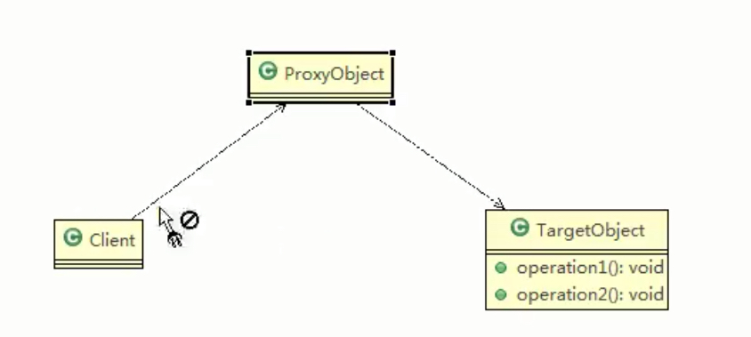

1.  静态代理

    使用中需要定义接口或者父类，被代理对象与代理对象一起实现相同的接口或者是继承相同父类

    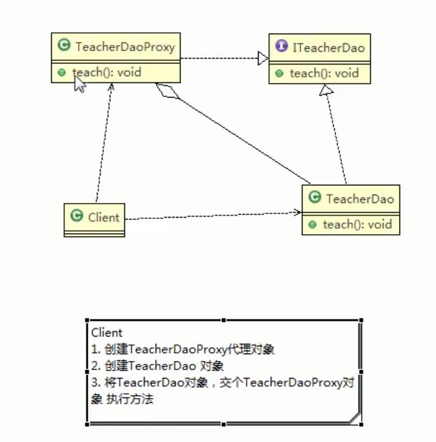

    ```java
    public interface ITeacherDao{
        void teach();
    }
    
    public class TeacherDao implements ITeacherDao{
        void teach(){
            System.out.println("授课");
        }
    }
    
    public class TeacherDaoProxy implements ITeacherDao{
        private ITeacherDao target;//目标对象
        public TeacherDaoProxy(ITeacherDao target){
            this.target=target;
        }
        void teach(){
            System.out.println("代理");
            target.teach();
        }
    }
    
    public class Client{
        public static void main(String[] args){
            TeacherDao t=new TeacherDao();
            TeacherDaoProxy p=new TeacherDaoProxy(t);
            p.teach();
        }
    }
    ```

    -   优点：在不修改目标对象功能的前提下，能通过代理对象对目标功能扩展
    -   缺点：因为代理对象与目标对象实现一样的接口，所以会有很多代理类；一旦接口增加方法，目标对象与代理对象都要维护

2.  动态代理

    代理对象不需要实现接口，但是目标对象要实现接口，否则不能用动态代理；代理对象的生成是用到JDK的API，动态的在内存中构建代理对象。

    代理类所在的包：java.lang.reflect.Proxy

    JDK实现代理只需要用newProxyInstance方法，该方法需要接收三个参数：ClassLoader, interfaces, InvocationHandler

    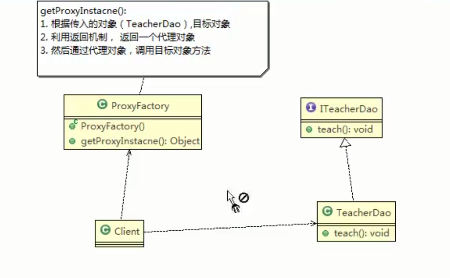

    ```java
    public interface ITeacherDao{
        void teach();
    }
    
    public class TeacherDao implements ITeacherDao{
        void teach(){
            System.out.println("授课");
        }
    }
    
    public class ProxyFactory{
        private Object target;//目标对象
        public ProxyFactory(Object target){
            this.target=target;
        }
        //生成代理对象
        /*
        1. ClassLoader loader : 指定当前目标对象使用的类加载器
        2. Class<?> [] interfaces : 目标对象实现的接口类型，使用泛型方式确认类型
        3. InvocationHandler h : 事件处理，执行目标对象的方法时，会触发事件处理器方法，把当前执行的目标对象方法作为参数传入
        */
        public Object getProxyInstance(){
            
            return Proxy.newProxyInstance(target.getClass().getClassLoader(), target.getClass().getInterfaces(), new InvocatonHandler(){
                @Override
                public Object invoke(Object proxy, Method method, Object[] args){
                    System.out.println("代理");
                    Object ret=method.invoke(target,args);
                    return ret;
                }
            });
        }
    }
    
    public class Client{
        public static void main(String[] args){
            ITeacherDao target=new TeacherDao();
            ITeacherDao proxy=(ITeacherDao)new ProxyFactory(target).getProxyInstance();
            proxy.teach();
        }
    }
    ```

3.  Cglib代理

    Cglib代理也叫作子类代理，它是在内存中构建一个子类对象从而实现对目标对象功能扩展；Cglib是一个强大的高性能代码生成包，可以在运行期扩展java类与实现java接口。如果目标对象不需要实现接口，可以用Cglib代理。

    注意：

    1.  需要引入cglib的jar包

    -   asm.jar
    -   asm-commons.jar
    -   asm-tree.jar
    -   cglib-2.2.jar

    2.  在内存中动态构建子类，代理的类不能是final类
    3.  目标对象的方法如果是final/static就不会被拦截，即不会执行目标对象额外的业务方法

    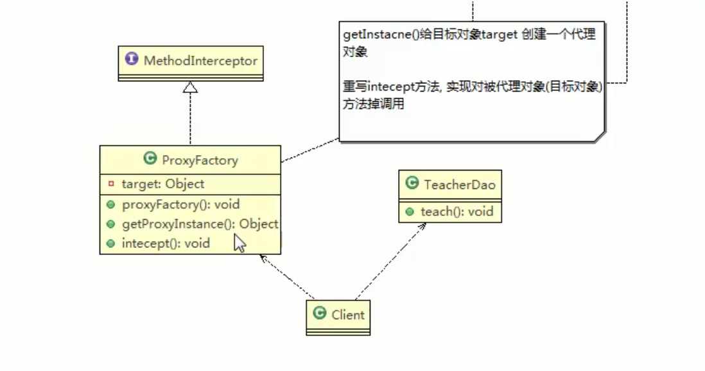

    ```java
    public class TeacherDao{
        void teach(){
            System.out.println("授课");
        }
    }
    
    public class ProxyFactory implements MethodInterceptor{
        private Object target;
        public ProxyFactory(Object target){
            this.target=target;
        }
        //返回一个target的代理对象
        public Object getProxyInstance(){
        //1. 创建工具类
        //2. 设置父类
        //3. 设置回调函数
        //4. 设置子类对象，即代理对象
            Enhancer enhancer=new Enhancer();
            enhancer.setSuperclass(target.getClass());
            enhancer.setCallback(this);
            return enhancer.create();
        }
        
        public Object intercept(Object arg0, Method arg1, Object[] arg2, MethodProxy arg3) throws Throwable{
            System.out.println("代理");
            Object ret=arg1.invoke(target,arg2);
            return ret;
        }
    }
    
    public class Client{
        public static void main(String[] args){
            TeacherDao target=new TeacherDao();
            TeacherDao proxy=(TeacherDao)new ProxyFactory(target).getProxyInstance();
            proxy.teach();
        }
    }
    ```

4.  几种变体

    -   防火墙代理：内网通过代理穿透防火墙，实现对公网的访问
    -   缓存代理
    -   远程代理：把远程对象当本地对象来调用
    -   同步代理：完成多线程间同步工作

### 模板方法模式

模板方法模式又叫模板模式，在一个抽象类公开定义了执行它的方法的模板。它的子类可以按需要重写方法实现，但调用将以抽象类中定义的方式进行。

模板方法模式定义了一个操作中算法的框架，而将一些步骤延迟到子类中，使得子类可以不改变一个算法的结构，就可以重定义该算法的某些特定步骤。模板方法模式属于行为型模式。

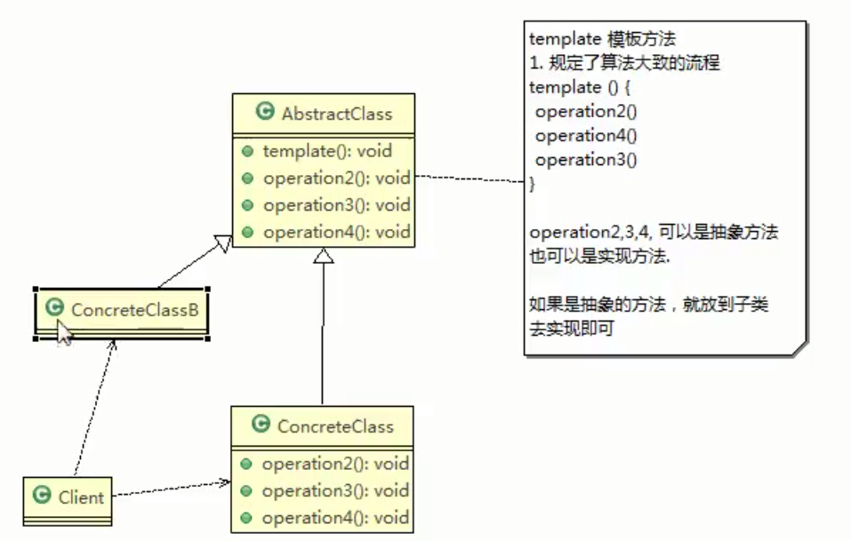

-   AbstractClass：抽象类，类中实现了模板方法，定义了算法的骨架，具体子类需要去实现其它的抽象方法
-   ConcreteClass：实现了抽象方法，完成了算法中特定子类的相关步骤

```java
public abstract class SoyaMilk{
    final void make(){
        select();
        addCondiments();
        soak();
        beat();
    }
    void select(){
        System.out.println("选择");
    }
    abstract void addCondiments();
    void soak(){
        System.out.println("浸泡");
    }
    void beat(){
        System.out.println("打碎");
    }
}

public class RedBeanSoyaMilk extends SoyaMilk{
    void addCondiments(){
        System.out.println("加入红豆");
    }
}
public class PeanoutSoyaMilk extends SoyaMilk{
    void addCondiments(){
        System.out.println("加入花生");
    }
}

public class Client{
    public static void main(String[] args){
        SoyaMilk r=new RedBeanSoyaMilk();
        r.make();
        SoyaMilk p=new PeanoutSoyaMilk();
        p.make();
    }
}
```

-   钩子方法

    在模板方法模式的父类中，可以定义一个方法，它默认不做任何事，子类可以视情况要不要覆盖它，该方法称为钩子。

    ```java
    public abstract class SoyaMilk{
        final void make(){
            select();
            if(customerWantCondiments())
            	addCondiments();
            soak();
            beat();
        }
        void select(){
            System.out.println("选择");
        }
        abstract void addCondiments();
        void soak(){
            System.out.println("浸泡");
        }
        void beat(){
            System.out.println("打碎");
        }
        boolean customerWantCondiments(){
            return true;
        }
    }
    
    public class PureSoyaMilk extends SoyaMilk{
        void addCondiments(){
            
        }
        boolean customerWantCondiments(){
            return false;
        }
    }
    ```

注意事项：

1.  基本思想是：算法只存在于一个地方，也就是在父类中，容易修改。需要修改算法时，只要修改父类的模板方法或者已经实现的某些步骤，子类就会继承这些修改
2.  实现了最大化代码复用：父类的模板方法和已实现的某些步骤会被子类继承而直接使用
3.  既统一了算法也提供了很大的灵活性
4.  每一个不同的实现都需要一个子类实现，导致类的个数增加，使得系统更加庞大
5.  一般模板方法都加上final关键字，防止子类重写模板方法
6.  当要完成某个过程，该过程要执行一系列步骤，这一系列的步骤基本相同，但其个别步骤在实现时可能不同，通常考虑用模板方法模式来处理

### 命令模式

在软件设计中经常需要向某个对象发送请求但不知道请求的接受者，也不知道被请求的操作，我们只需在程序运行时指定具体的请求接受者即可。命令模式使得请求发送者与请求接受者消除彼此之间的耦合，让对象之间的调用关系更加灵活，实现解耦。

在命令模式中，会将一个请求封装为一个对象，以便使用不同参数来表示不同的请求（命名），同时命令模式也支持可撤销的参数。

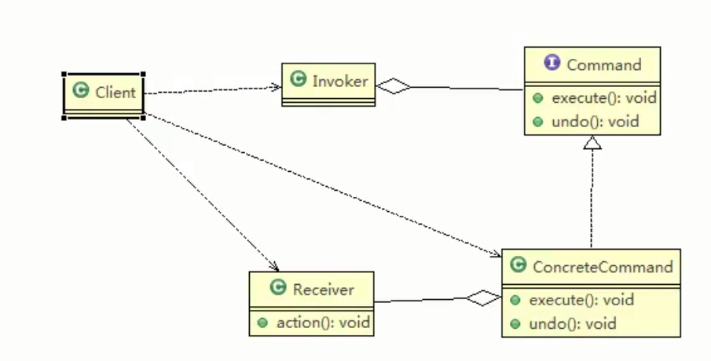

-   Invoker：调用者角色
-   Command：命令角色，需要执行的所有命令，可以是接口或抽象类
-   Receiver：接收者角色，知道如何实施和执行一个请求相关的操作
-   ConcreteCommand：将一个接收者对象与一个动作绑定，调用接收者相应的操作，实现execute

```java
//创建命令接口
public interface Command{
    public void execute();
    public void undo();
}

public class LightReceiver{
    public void on(){
        System.out.println("打开");
    }
    public void off(){
        System.out.println("关闭");
    }
}

public class LightOnCommand implements Command{
    LightReceiver light;
    LightOnCommand(LightReceriver light){
        this.light=light;
    }
    public void execute(){
        light.on();
    }
    public void undo(){
        light.off();
    }
}

public class LightOffCommand implements Command{
    LightReceiver light;
    LightOffCommand(LightReceriver light){
        this.light=light;
    }
    public void execute(){
        light.off();
    }
    public void undo(){
        light.on();
    }
}
//空执行，用于初始化每个按钮
public class NoCommand implements Command{
    public void execute(){
        
    }
    public void undo(){
        
    }
}

public class RemoteController{
    Command[] onCommands;
    Command[] offCommands;
    Command undoCommand;
    //构造器
    public RemoteController(){
        onCommands=new Command[5];
        offCommands=new Command[5];
        for(int i=0;i<5;i++){
            onCommands[i]=new NoCommand();
            offCommands[i]=new NoCommand();
        }
    }
    //设置命令
    public void setCommand(int no, Command onCommand, Command offCommand){
        onCommands[no]=onCommand;
        offCommands[no]=offCommand;
    }
    public void onButtonPushed(int no){
        onCommand[no].execute();
        undoCommand=onCommand[no];
    }
    public void offButtonPushed(int no){
        offCommand[no].execute();
        undoCommand=offCommand[no];
    }
    public void undoButtonPushed(){
        undoCommand.undo();
    }
}

public class Client{
    public static void main(String[] args){
        LightReciver lr=new LightReceiver();
        LightOnCommand lon=new LightOnCommand(lr);
        LightOffCommand lof=new LightOffCommand(lr);
        RemoteController r=new RecmoteController();
        r.setCommand(0,lon,lof);
        r.onButtonPushed(0);
        r.offButtonPushed(0);
        r.undoButtonPushed();
    }
}
```

-   注意事项
    1.  把发起请求的对象与执行请求的对象解耦
    2.  容易设计一个命令队列，只要把命令对象放到队列，就可以多线程地执行命令
    3.  容易实现对请求的撤销和重做
    4.  可能会导致某些系统有过多的具体命令类，增加了系统的复杂度
    5.  空命令也是一种设计模式，省去了判空的操作

### 访问者模式

封装一些作用于某种数据结构的各元素的操作，可以在不改变数据结构的前提下定义作用于这些元素的新的操作。主要将数据结构与数据操作分离，解决数据结构和操作耦合性问题。

访问者模式在被访问的类里面加一个对外提供接待访问者的接口，当需要对一个对象结构中的对象进行很多不同操作同时需要避免让这些操作污染这些对象的类，可以选用访问者模式。

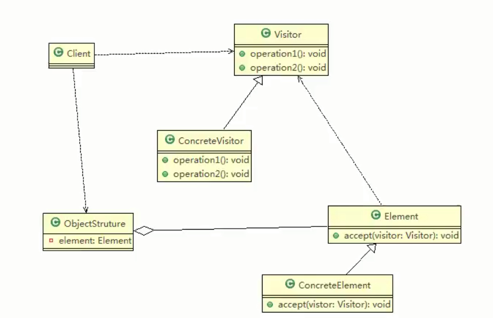

-   Visitor：抽象访问者，为该对象结构中的ConcreteElement的每一个类声明一个visit操作
-   ConcreteVisitor：一个具体的访问值，实现每个Visitor声明的操作
-   ObjectStructure：枚举元素，可以提供高层的接口，用来允许访问值访问元素
-   Element：定义了accept方法，可以接收访问者对象
-   ConcreteElement：具体的元素，实现了accept方法

```java
public abstract class Action{
    public abstract void getManResult(Man man);
    public abstract void getWomanResult(Woman woman);
}

public class Success extends Action{
    public void getManResult(Man man){
        System.out.println("Man Success");
    }
    public void getWomanResult(Woman woman){
        System.out.println("Woman Success");
    }
}

public class Fail extends Action{
    public void getManResult(Man man){
        System.out.println("Man Fail");
    }
    public void getWomanResult(Woman woman){
        System.out.println("Woman Fail");
    }
}

public abstract class Person{
    public abstract void accept(Action action);
}

//双分派
//1.首先在客户端程序中将具体状态作为参数传递Man中
//2.然后Man类调用作为参数的具体方法getManResult，同时将自己作为参数
public class Man extends Person{
    public void accept(Action action){
        action.getManResult(this);
    }
}

public class Woman extends Person{
    public void accept(Action action){
        action.getWomanResult(this);
    }
}

public class ObjectStructure{
    private List<Person> persons=new LinkedList<>();
    public void attach(Person p){
        persons.add(p);
    }
    public void detach(Person p){
        persons.remove(p);
    }
    public void display(Action action){
        for(Person p:persons){
            p.accept(action);
        }
    }
}

public class Client{
    public static void main(String[] args){
        ObjectStructure o=new ObjectStructure();
        o.attach(new Man());
        o.attach(new Woman());
        o.attach(new Man());
        Success s=new Success();
        o.display(s);
        Fail f=new Fail();
        o.display(f);
    }
}
```

-   注意事项
    1.  访问者模式符合单一职责原则，让程序具有优秀的扩展性，灵活性比较高
    2.  访问者模式可以对功能进行统一，适用于数据结构相对稳定的系统
    3.  具体元素对访问值公布细节，违反迪米特法则，造成了具体元素变更比较困难
    4.  违背了依赖倒转原则，访问值依赖的是具体元素而非抽象元素

### 迭代器模式

迭代器模式属于行为型模式，如果集合元素是用不同的方式实现的（数组、集合类或其他方式），当客户端要遍历这些集合元素的时候就要使用多种遍历方式，而且还会暴露元素的内部结构。迭代器模式提供一种遍历集合元素的统一接口，用一致的方法遍历集合元素，不需要知道集合对象的底层表示。

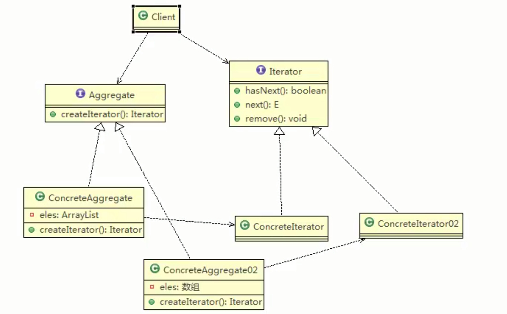

-   Iterator：迭代器接口，系统提供
-   ConcreteIterator：具体迭代器类，管理迭代
-   Aggregate：一个统一的聚合接口，将客户端和具体聚合解耦
-   ConcreteAggregate：具体的聚合类，持有对象集合，并提供一个返回迭代器的方法
-   Client：客户端，通过Iterator和Aggregate依赖子类

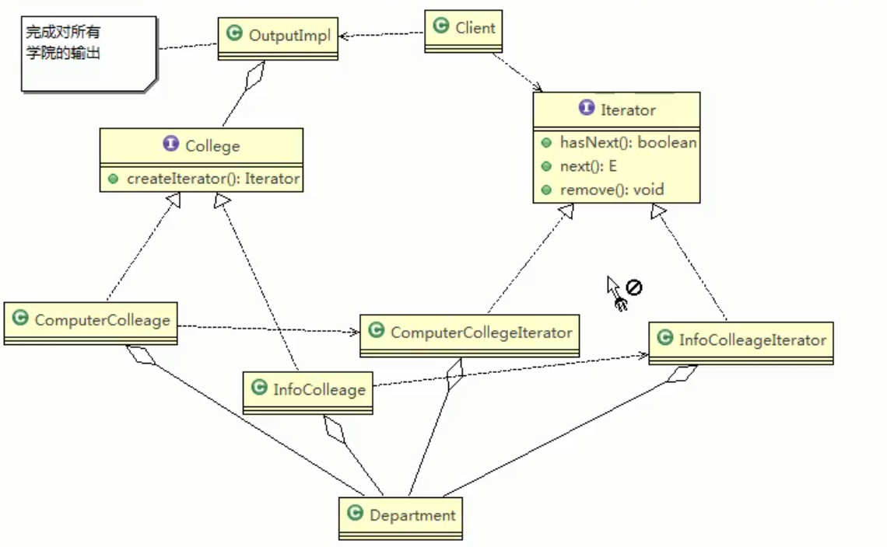

```java
public class Department{
    private String name;
    private String desc;
    //...
}

public class ComputerCollegeIterator implements Iterator{
    Department[] departments;
    int position=0;
    public ComputerCollegeIterator(Department[] departments){
        this.departments=departments;
    }
    public boolean hasNext(){
        if(position>=departments.length||departments[position]==null) return false;
        else return true;
    }
    public Object next(){
        Department department=departments[position];
        position++;
        return department;
    }
    public void remove(){
        
    }
}

public class InfoCollegeIterator implements Iterator{
    List<Department> departmentList;
    int index=1;
    public InfoCollegeIterator(List<Department> departmentList){
        this.departmentList=departmentList;
    }
    public boolean hasNext(){
        if(index>=departmentList.size()-1) return false;
        else {
        	index++;
            return true;
        }
    }
    public Object next(){
        
        return departmentList.get(index);
    }
    public void remove(){
        
    }
}

public interface College{
    public String getName();
    public void addDepartment(String name, String desc);
    public Iterator createIterator();
}

public class ComputerCollege implements College{
    Department[] departments;
    int numOfDepartment=0;
    public ComputerCollege(){
        departments=new Department[5];
        addDepartment("aaa","des1");
        addDepartment("bbb","des2");
        addDepartment("ccc","des3");
        
    }
    
    public String getName(){
        return "计算机学院";
    }
    public void addDepartment(String name, String desc){
        Department department = new Department(name,desc);
        departments[numOfDepartment]=department;
        numOfDepartment++;
    }
    public Iterator createIterator(){
        return new ComputerCollegeIterator(departments);
    }
}

public class InfoCollege implements College{
    List<Department> departmentList;
    int numOfDepartment=0;
    public InfoCollege(){
        departmentList=new ArrayList<>();
        addDepartment("aaaa","des1");
        addDepartment("bbbb","des2");
        addDepartment("cccc","des3");
        
    }
    
    public String getName(){
        return "信息工程学院";
    }
    public void addDepartment(String name, String desc){
        Department department = new Department(name,desc);
        departmentList.add(department);
    }
    public Iterator createIterator(){
        return new InfoCollegeIterator(departmentList);
    }
}

public class OutputImpl{
    List<College> collegeList;
    public OutputImpl(List<College> collegeList){
        this.collegeList=collegeList;
    }
    public void printCollege(){
      	Iterator<College> iterator=collegeList.iterator();
        while(iterator.hasNext()){
            College c=iterator.next();
            System.out.println(c.getName());
            printDepartment(c.createIterator());
        }
    }
    public void printDepartment(Iterator iterator){
        while(iterator.hasNext()){
            Department d=(Department) iterator.next();
            System.out.println(d.getName());
        }
    }
}

public class Client{
    public static void main(String[] args){
        List<College> collegeList=new ArrayList<>();
        ComputerCollege c=new ComputerCollege();
        InfoCollege i=new InfoCollege();
        collegeList.add(c);
        collegeList.add(i);
        OutputImpl o=new OutputImpl(collegeList);
        o.printCollege();
    }
}
```

-   注意事项
    1.  提供一个统一的方法遍历对象
    2.  隐藏了聚合的内部结构
    3.  符合单一职责原则，一个类只有一个引起变化的原因
    4.  当要展示一组相似对象，或者遍历一组相同对象时使用，适合使用迭代器模式
    5.  每个聚合对象都要一个迭代器，会生成多个迭代器不好管理类

### 观察者模式

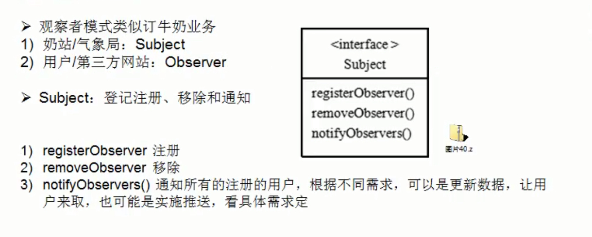

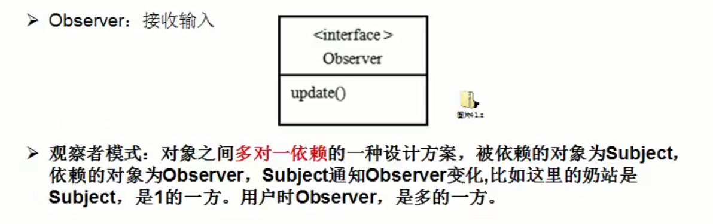

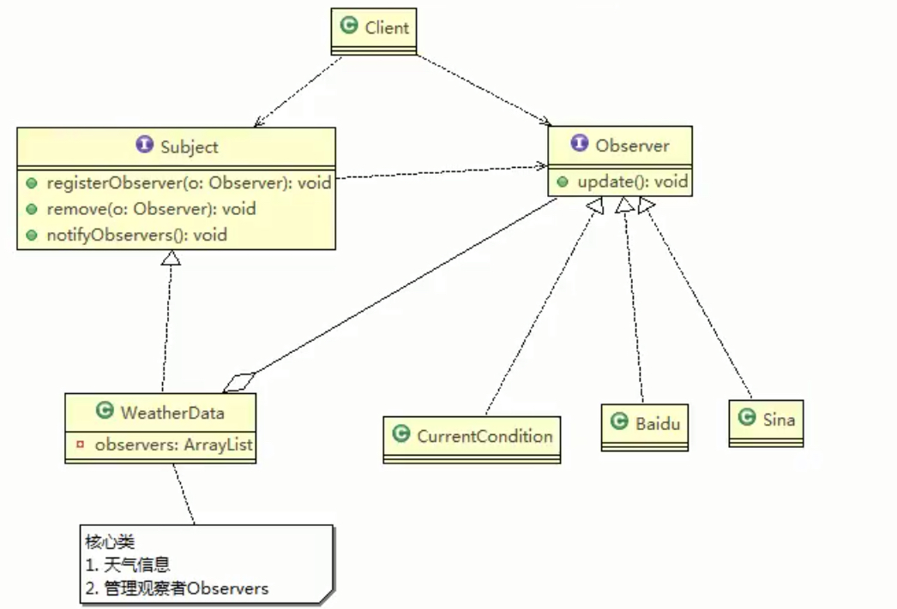

```java
public interface Subject{
    public void registerObserver(Observer o);
    public void removeObserver(Observer o);
    public void notifyObservers();
}

public interface Observer{
    public void update(float temperature, float pressure, float humidity);
}

public class CurrentConditions implements Observer{
    private float temperature;
    private float pressure;
    private float humidity;
    public void update(float temperature, float pressure, float humidity){
        this.temperature=temperature;
        this.pressure=pressure;
        this.humidity=humidity;
        display();
    }
    public void display(){
        System.out.println(temperature);
        System.out.println(pressure);
        System.out.println(humidity);
    }
}

public class WeatherData implements Subject{
    private float temperature;
    private float pressure;
    private float humidity;
    private ArrayList<Observer> observers;
    public WeatherData(){
        observers=new ArrayList<>();
    }
    public void setData(float temperature, float pressure, float humidity){
        this.temperature=temperature;
        this.pressure=pressure;
        this.humidity=humidity;
        dataChange();
    }
    public void dataChange(){
        notifyObservers();
    }
    public void registerObserver(Observer o){
        observers.add(o);
    }
    public void removeObserver(Observer o){
        if(observers.contains(o))
        observers.remove(o);
    }
    public void notifyObservers(){
        for(int i=0;i<observers.size();i++){
            observers.get(i).update(this.temperature,this.pressure,this.humidity);
        }
    }
}

public class Client{
    public static void main(String[] args){
        WeatherData w=new WeatherData();
        CurrentConditions c=new CurrentConditions();
        w.registerObserver(c);
        w.setData(10f,100f,30.3f);
        
    }
}
```

-   注意事项
    1.  观察者模式以集合的方式管理用户
    2.  增加观察者时不需要修改核心类，遵守了ocp原则

### 中介者模式

中介者模式用一个中介对象来封装一系列的对象交互。中介者使各个对象不需要显式的相互调用，从而使其耦合松散，而且可以独立地改变它们之间的交互。中介者模式属于行为型模式，使代码易于维护。

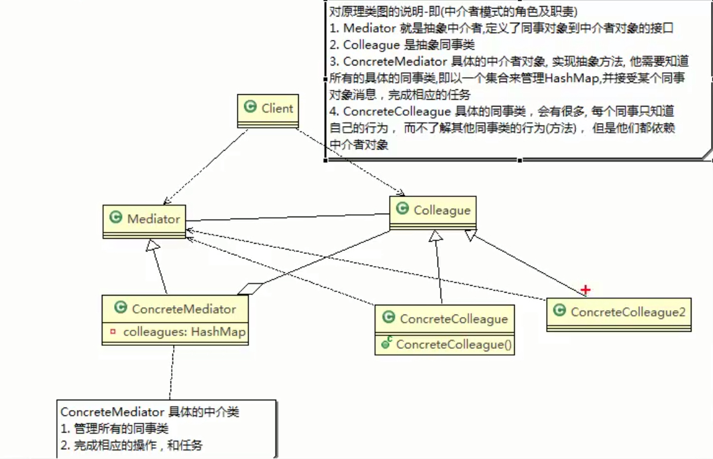

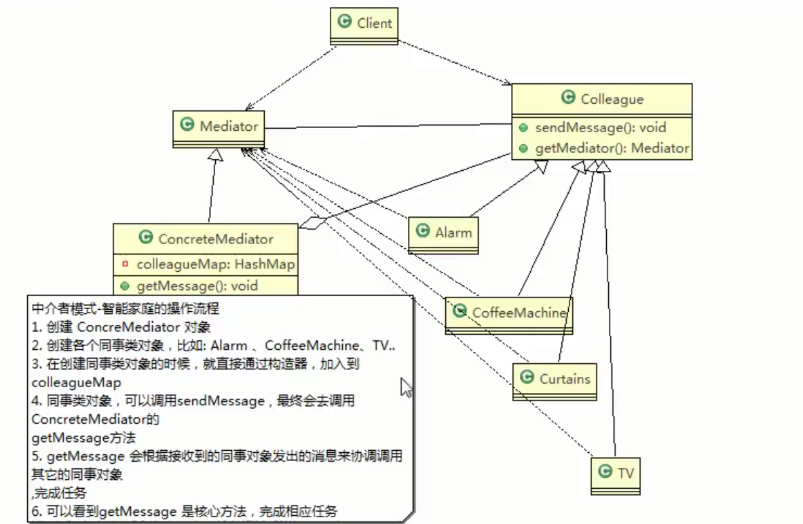

```java
public abstract class Colleague{
    private Mediator mediator;
    public String name;
    public Colleague(Mediator mediator, String name){
        this.mediator=mediator;
        this.name=name;
    }
    public Mediator getMediator(){
        return this.mediator;
    }
    public abstract void sendMessage(int stateChange);
}

public class Alarm extends Colleague{
    public Alarm(Mediator mediator, String name){
        super(mediator,name);
        mediator.register(name,this);
    }
    public void sendAlarm(int stateChange){
        sendMessage(stateChange);
    }
    public void sendMessage(int stateChange){
        this.getMediator().getMessage(stateChange,this.name);
    }
}

public abstract class Mediator{
    //将中介者对象加入到集合中
    public abstract void register(String colleagueName, Colleague colleague);
    //接收消息，具体的同事对象发出的
    public abstract void getMessage(int stateChange, String colleagueName);
    public abstract void sendMessage();
}

public class ConcreteMediator extends Mediator{
    private HashMap<String, Colleague> colleagueMap;//同事对象集合
    private HashMap<String, String> interMap;//
    public ConcreteMediator(){
        colleagueMap=new HashMap<>();
        interMap=new HashMap<>();
    }
    public void register(String colleagueName, Colleague colleague){
        colleagueMap.put(colleagueName, colleague);
        if(colleague instanceof Alarm){
            interMap.put("Alarm",colleagueName);
        }
        else if(colleague instanceof CoffeeMachine){
            interMap.put("CoffeeMachine",colleagueName);
        }
        else if(colleague instanceof TV){
            interMap.put("TV",colleagueName);
        }
        else if(colleague instanceof Curtains){
            interMap.put("Curtains",colleagueName);
        }
    }
    //根据得到消息完成具体任务
    //中介者在这个方法协调各个具体的同事对象，完成任务
    public void getMessage(int stateChange, String colleagueName){
        if(colleagueMap.get(colleagueName) instanceof Alarm){
            if(stateChange==0){
                ((CoffeeMachine)(colleagueMap.get(interMap.get("CoffeeMachine")))).startCoffee();
                ((TV)(colleagueMap.get(interMap.get("TV")))).startTV();
            }
            else if(stateChange==1){
                ((TV)(colleagueMap.get(interMap.get("TV")))).stopTV();
            }
        }
        else if(colleagueMap.get(colleagueName) instanceof CoffeeMachine){
            ((Curtains)(colleagueMap.get(interMap.get("Curtains")))).upCurtains();
        }
         else if(colleagueMap.get(colleagueName) instanceof TV){
            
        }
        else if(colleagueMap.get(colleagueName) instanceof Curtains){
            
        }
    }
}

public class ClientTest{
    public static void main(String[] args){
        Mediator mediator=new ConcreteMediator();
        Alarm alarm=new Alarm(mediator, "alarm");
        CoffeeMachine coffeeMachine=new CoffeeMachine(mediator, "coffeeMachine");
        Curtains curtains=new Curtains(mediator, "curtains");
        TV tv=new TV(mediator, "TV");
        alarm.sendAlarm(0);
        coffeeMachine.finishCoffee();
        alarm.sendAlarm(1);
    }
}
```

-   注意事项
    1.  将网状结构分离为星型结构，进行解耦
    2.  减少类间依赖，降低了耦合，符合迪米特原则
    3.  中介者承担了较多的责任，一旦中介者出现了问题，整个系统就会受到影响
    4.  如果设计不当，中介者对象本身会变得过于复杂

### 备忘录模式

备忘录模式在不破坏封装性的前提下捕获一个对象的内部状态，并在该对象之外保存这个状态，这样以后就可将该对象恢复到原先保存的状态。备忘录模式属于行为型模式。

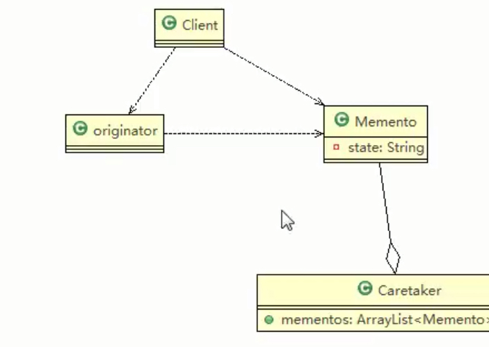

-   originator：需要保存状态的对象
-   Memento：备忘录对象，负责保存记录
-   Caretaker：守护者对象，负责保存多个备忘录对象，使用集合管理
-   如果需要保存多个originator对象的不同时间的状态，只需要HashMap<String，集合>

```java
public class Originator{
    private String state;
    public Memento saveStateMemento(){
        return new Memento(state);
    }
    public void getStateFromMemento(Memento memento){
        state=memento.getState();
    }
    //...
}

public class Memento{
    private String state;
    //...
    
}

public class Caretaker{
    private List<Memento> mementoList=new ArrayList<>();
    public void add(Memento memento){
        mementoList.add(memento);
    }
    public Memento get(int index){
        return mementoList.get(index);
    }
}

public class Client{
    public static void main(String[] args){
        Originator originator = new Originator();
        Caretaker caretaker = new Caretaker();
        originator.setState("state 1");
        caretaker.add(originator.saveStateMemento());//保存状态1
        originator.setState("state 2");
        caretaker.add(originator.saveStateMemento());//保存状态2
        originator.setState("state 3");
        caretaker.add(originator.saveStateMemento());//保存状态3
        System.out.println(originator.getState());
        //恢复到状态1
        originator.getStateFromMemento(caretaker.get(0));
        System.out.println(originator.getState());
    }
}
```

-   注意事项
    1.  提供了可以恢复状态的机制
    2.  实现了信息的封装，用户不需要关心状态的保存细节
    3.  如果类的成员变量过多，会占用比较大的资源
    4.  为了节约内存，可以和原型模式配合使用

### 解释器模式

给定一个语言（表达式），定义它的文法的一种表示，并定义一个解释器，使用该解释器来解释语言中的句子（表达式）。

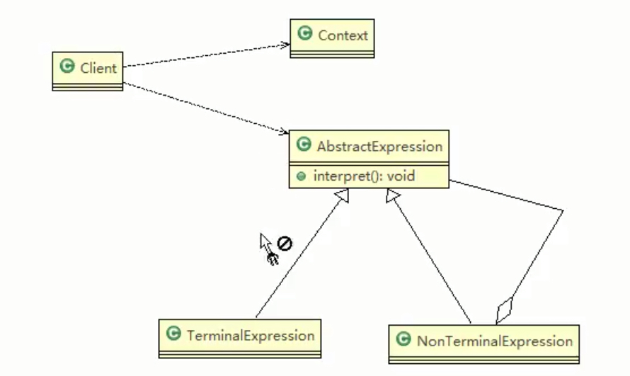

-   Context：环境角色，含有解释器之外的全局信息
-   AbstractExpression：抽象表达式，声明一个抽象的解释操作，这个方法为抽象语法树中所有结点所共享
-   TerminalExpression：终结符表达式，实现与文法中终结符相关的解释操作
-   NonTerminalExpression：非终结表达式，为文法中的非终结符实现解释操作
-   输入Contect与TerminalExpression信息通过Client输入即可

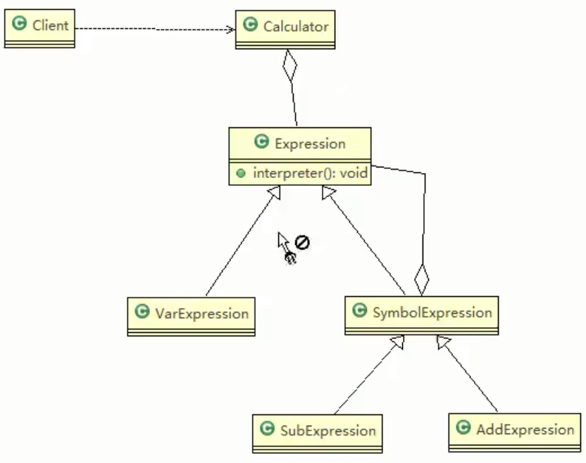

```java
public abstract class Expression{
    public abstract int interpreter(HashMap<String, Integer> var);
}

public class VarExpression extends Expression{
    private String key;
    public VarExpression(String key){
        this.key=key;
    }
    public int interpreter(HashMap<String, Integer> var){
        return var.get(this.key);
    }
}

public class SymbolExpression extends Expression{
    protected Expression left;
    protected Expression right;
    public SymbolExpression(Expression left, Expression right){
        this.left=left;
        this.right=right;
    }
    //默认实现
    public int interpreter(HashMap<String, Integer> var){
        return 0;
    }
}

public class AddExpression extends SymbolExpression{
    public AddExpression(Expression left, Expression right){
        super(left,right);
    }
    public int interpreter(HashMap<String, Integer> var){
        return super.left.interpreter(var)+super.right.interpreter(var);//left, right表达式对应的值
    }
}

public class SubExpression extends SymbolExpression{
    public SubExpression(Expression left, Expression right){
        super(left,right);
    }
    public int interpreter(HashMap<String, Integer> var){
        return super.left.interpreter(var)-super.right.interpreter(var);//left, right表达式对应的值
    }
}

public class Calculator{
    private Expression expression;//表达式
    public Calculator(String expStr){
        Stack<Expression> stack=new Stack<>();
        char[] charArray=expStr.toCharArray();
        Expression left=null;
        Expression right=null;
        for(int i=0;i<charArray.length;i++){
            switch(charArray[i]){
                case "+":
                    left=stack.pop();
                    right=new VarExpression(String.valueOf(charArray[++i]));
                    stack.push(new AddExpression(left,right));
                    break;
                case "-":
                    left=stack.pop();
                    right=new VarExpression(String.valueOf(charArray[++i]));
                    stack.push(new SubExpression(left,right));
                    break;
                default:
                    stack.push(new VarExpression(String.valueOf(charArray[i])));
                    break;
            }
        }
        this.expression=stack.pop();
    }
    
    public int run(HashMap<String, Integer> var){
        return this.expression.intepreter(var);
    }
}

public class ClientTest{
    public static void main(String[] args){
        String expStr=getExpStr();
        HashMap<String, Integer> var=getValue(expStr);
        Calculator c=new Calculator(expStr);
        System.out.println(c.run(var));
    }
}
```

-   注意事项
    1.  当一个语言需要解释执行，可将该语言中的句子表示为一个抽象语法树，就可以考虑使用解释器模式，让程序具有良好的扩展性
    2.  解释器模式会引起类膨胀，使用递归调用方法将会使调试非常复杂，效率可能降低

### 状态模式

主要用来解决对象在多种状态转换时需要对外输出不同行为的问题，状态和行为是一一对应的，状态之间可以相互转换。

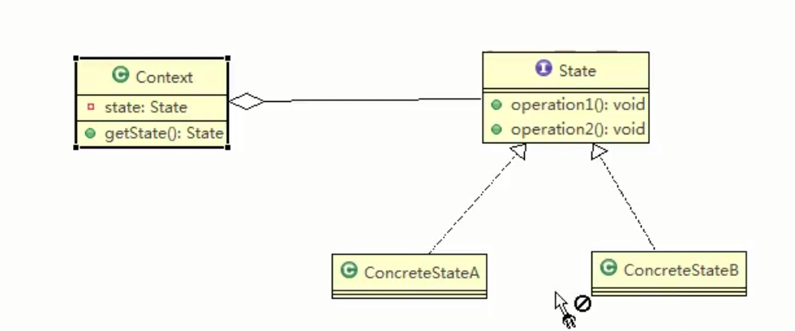

-   Context：环境角色，用于维护State实例，定义当前状态
-   State：抽象状态角色，定义一个接口封装与Context的一个特定接口相关行为
-   ConcreteState：具体状态角色，每个子类实现与Context的一个状态相关行为

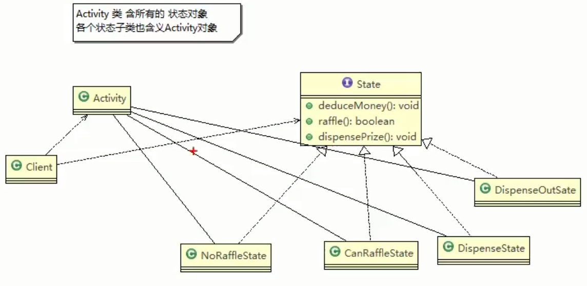

```java
public interface State{
    public void deductMoney();//扣除积分
    public boolean raffle();//是否抽中奖品
    public void dispensePrize();//发放奖品
}

public class NoRaffleState implements State{
    RaffleActivity activity;
    //...
    public void deductMoney(){
        System.out.println("扣除积分，可以抽奖了");
        activity.setState(activity.getCanRaffleState());
    }
    public boolean raffle(){
        System.out.println("不能抽奖");
        return false;
    }
    public void dispensePrize(){
       System.out.println("不能发放奖品");
    }
}

public class CanRaffleState implements State{
    RaffleActivity activity;
    //...
    public void deductMoney(){
        System.out.println("已经扣除积分了");
    }
    public boolean raffle(){
        System.out.println("正在抽奖");
        Random r=new Random();
        int num=r.nextInt(10);
        if(num==0){
            activity.setState(activity.getDispenseState());
            return true;
        }
        else{
            System.out.println("没有抽中");
            activity.setState(activity.getNoRaffleState());
            return false;
        }
    }
    public void dispensePrize(){
       System.out.println("不能发放奖品");
    }
}

public class DispenseState implements State{
    RaffleActivity activity;
    //...
    public void deductMoney(){
        System.out.println("不能扣除积分");
    }
    public boolean raffle(){
        System.out.println("不能抽奖");
        return false;
    }
    public void dispensePrize(){
       if(activity.getCount()>0){
           System.out.println("发放奖品");
           activity.setState(activity.getNoRaffleState());
       }
        else{
            System.out.println("奖品发放完了");
            activity.setState(activity.getDispenseOutState());
        }
    }
}

public class DispenseOutState implements State{
    RaffleActivity activity;
    //...
    public void deductMoney(){
        System.out.println("奖品发放完了");
    }
    public boolean raffle(){
        System.out.println("奖品发放完了");
        return false;
    }
    public void dispensePrize(){
       System.out.println("奖品发放完了");
    }
}

public class RaffleActivity{
    State state=null;//当前状态
    int count=0;//奖品数量
    //四种状态
    State noRaffleState=new NoRaffleState(this);
    State canRaffleState=new CanRaffleState(this);
    State dispenseState=new DispenseState(this);
    State dispenseOutState=new DispenseOutState(this);
    public RaffleActivity(int count){
        this.state=getNoRaffleState();
        this.count=count;
    }
    public void deductMoney(){
        state.deductMoney();
    }
    public void raffle(){
        if(state.raffle()){
            state.dispensePrize();
        }
    }
    //getter、setter
    public int getCount(){
        int curCount=count;
        count--;
        return curCount;
    }
    //...
}

public class Client{
    public static void main(String[] args){
        RaffleActivity a=new RaffleActivity(1);
        for(int i=0;i<300;i++)
        {
            System.out.println("第"+(i+1)+"次抽奖");
            activity.deductMoney();
            activity.raffle();
        }
    }
}
```

-   注意事项
    1.  代码具有很强的可读性
    2.  方便维护
    3.  符合开闭原则，容易增删状态
    4.  会产生很多类，每个状态都会产生一个类

### 策略模式

策略模式定义算法族，分别封装起来，让他们之间可以相互替换，此模式让算法的变化独立于使用算法的客户

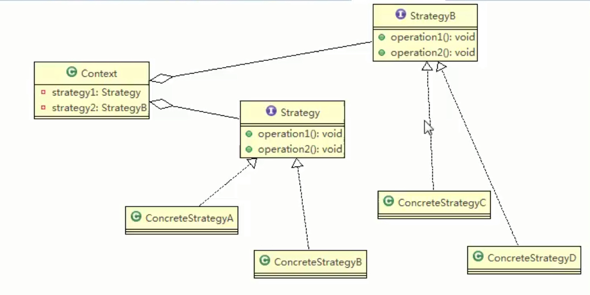

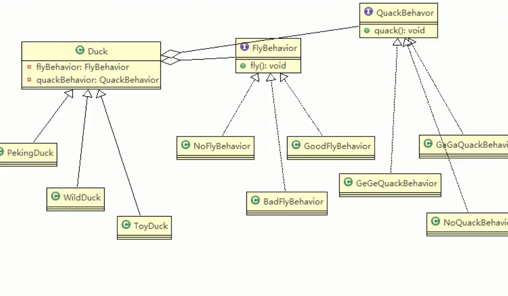

```java
public interface FlyBehavior{
    void fly();
}

public class GoodFlyBehavior{
    public void fly(){
        System.out.println("Good fly");
    }
}

public class BadFlyBehavior{
    public void fly(){
        System.out.println("Bad fly");
    }
}

public class NoFlyBehavior{
    public void fly(){
        System.out.println("No fly");
    }
}

public abstract class Duck{
    FlyBehavior flyBehavior;
    public Duck(){
        
    }
    public void fly(){
        if(flyBehavior!=null)
            flyBehavior.fly();
    }
    public abstract void display();//显示信息
}

public class WildDuck extends Duck{
    public WildDuck(){
        flyBehavior=new GoodFlyBehavior();
    }
    public void display(){
        System.out.println("WildDuck");
    }
}

public class PekingDuck extends Duck{
    public PekingDuck(){
        flyBehavior=new NoFlyBehavior();
    }
    public void display(){
        System.out.println("PekingDuck");
    }
}

public class Client{
    public static void main(String[] args){
        WildDuck w=new WildDuck();
        w.fly();
        ToyDuck t=new ToyDuck();
        t.fly();
    }
}
```

-   注意事项
    1.  需要分析出项目中的变化部分与不变部分
    2.  核心思想：多用组合、聚合，少用继承
    3.  体现了开闭原则
    4.  每添加一个策略就要增加一个类，当策略过多会导致类数目庞大

### 职责链模式

职责链模式又叫责任链模式，为请求创建了一个接收者对象的链，对请求的发送者和接收者进行了解耦，通常每个接收者都包含对另一个接收者的引用。

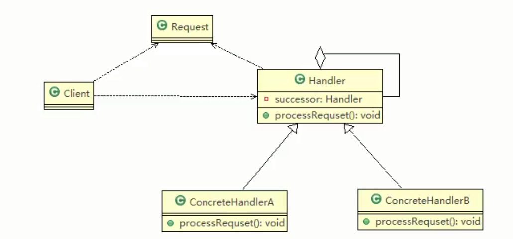

-   Handler：抽象的处理者，定义了一个处理请求的接口，同时含有另外的Handler
-   ConcreteHandler：具体的处理者，处理自己负责的请求，可以访问它的后继者，可以处理的请求自己处理，否则交给后继者处理
-   Request：含有很多属性，表示一个请求


```java
public class PurchaseRequest{
    private int type=0;
    private float price=0.0f;
    private int id=0;
    //...
}

public abstract Approver{
    Approver approver;
    String name;
    public Approver(String name){
        this.name=name;
    }
    public setApprover(Approver approver){
        this.approver=approver;
    }
    public abstract void processRequest(PurchaseRequest purchaseRequest);
}

public class DepartmentApprover extends Approver{
    //....
    public void processRequest(PurchaseRequest purchaseRequest){
        if(purchaseRequest.getPrice<=5000){
            System.out.println(this.name+"处理");
        }
        else{
            approver.processRequest(purchaseRequest);//后继者处理
        }
    }
}

public class CollegeApprover extends Approver{
    //....
    public void processRequest(PurchaseRequest purchaseRequest){
        if(purchaseRequest.getPrice>5000&&purchaseRequest.getPrice<=10000){
            System.out.println(this.name+"处理");
        }
        else{
            approver.processRequest(purchaseRequest);//后继者处理
        }
    }
}

public class Client{
    public static void main(String[] args){
        PurchaseRequest r=new PurchaseRequest(1,31000,1);
        DepartmentApprover d=new DepartmentApprover("department");
        CollegeApprover c=new  CollegeApprover("college");
        //职责链要形成环状
        d.setApprover(c);
        c.setApprover(d);
        d.processRequest(r);
    }
}
```

-   注意事项
    1.  将请求和处理分开，实现解耦，提高系统灵活性
    2.  简化了对象，对象不需要知道链的结构
    3.  性能会受到影响，特别是链比较长的时候
    4.  调试不方便，采用了类似递归的方式


