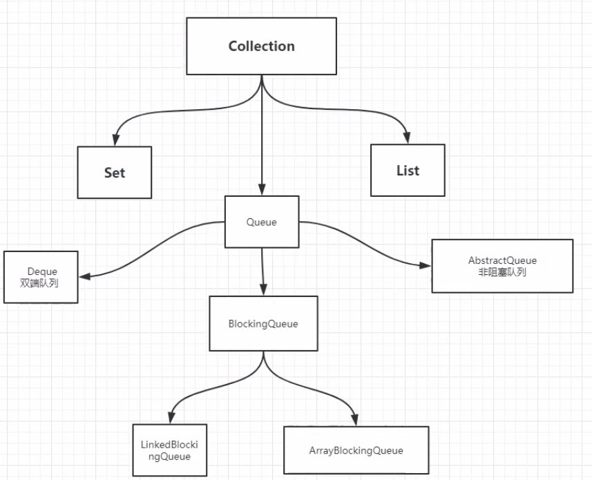
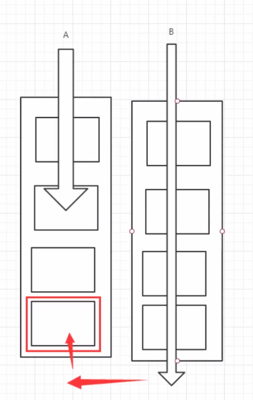

# Java 并发编程

## Maven 自动化管理工具

### Maven 简介

Maven是一个项目自动化构建工具。

1.  完成项目的工作：

	-   分析项目要做什么，知道项目的组成部分
	-   设计项目，通过哪些步骤，使用哪些步骤，需要多少人，多长的时间
	-   组建团队与设备
	-   开发人员写代码，测试代码，重复多次的工作
	-   测试人员，测试项目功能是否符合要求，直到测试代码通过

2.  传统开发项目的问题

    -   很多模块，模块之间有关系，手工管理较为繁琐
    -   需要很多第三方功能，需要很多jar包，手动获取
    -   需要管理jar包版本
    -   管理jar文件之间的依赖
    
3.  需要改进项目的开发和管理，可以使用maven

    -   管理jar文件
    -   自动下载jar及其文档、源代码
    -   管理jar包之间的依赖
    -   管理jar包的版本
    -   编译程序，把java编译为class
    -   测试代码是否正确
    -   打包文件，形成jar文件或war文件
    -   部署项目

4.  构建：项目的构建

    -   构建是面向过程的，就是一些步骤，完成项目代码的编译、测试、运行、打包、部署等

    -   maven支持的构建：

        1）清理：把之前项目编译的东西删掉，为新的编译代码做准备

        2）编译：把程序源代码编译为可执行代码，批量操作

        3）测试：maven可以执行测试程序代码，验证功能是否正确，批量操作

        4）报告：生成测试结果的文件

        5）打包：把项目中所有资源打包成项目的结果文件（jar包或者war包）

        6）安装：把jar文件或war文件安装到本地仓库

        7）部署：把程序安装好可以执行

5.  maven的核心概念

    -   POM：一个文件pom.xml，项目对象模型，maven把一个项目当做一个模型使用，可以控制maven构建项目的过程，管理jar依赖。
    -   约定的目录结构：maven项目的目录和文件的位置是有规定的。
    -   坐标：是一个唯一的字符串，用来表示资源的。
    -   依赖管理：管理项目中可以使用的jar文件。
    -   仓库管理：资源存放的位置
    -   生命周期：maven构建项目的过程
    -   插件和目标：执行maven构建的时候用的工具是插件
    -   继承
    -   聚合

6.  maven工具的安装和配置

### Maven的核心概念

1.  maven的约定目录结构
```
    Hello（项目名）
		|---src
		|---|---main（主程序）
		|---|---|---java（主程序中的包和包中java文件）
		|---|---|---resources（主程序中要使用的配置文件）
		|---|---test（测试代码和文件，可以没有）
		|---|---|---java（测试程序中的包和包中java文件）
		|---|---|---resources（测试程序中要使用的配置文件）
		|---pom.xml（核心文件）
```

每一个maven项目在磁盘中都是一个文件夹

2.  `mvn compile`编译src/main目录下的所有java文件

    在项目的根目录下会生成target目录（结果目录）

3.  仓库

    -   仓库是存放maven使用的jar包和项目所使用的jar包

    -   分类

        1）本地仓库：个人计算机上的文件夹

        2）远程仓库：互联网上，需要网络才能使用的仓库

        -   中央仓库：最权威的，所有的开发人员共享使用的集中仓库
        -   中央仓库镜像：在各大洲重要的城市都有镜像
        -   私服：内部局域网中使用

    -   使用：不需要人为参与

        开发人员需要使用->maven查本地仓库->私服->镜像->中央仓库

4.  pom：项目对象模型

    pom.xml

    https://mvnrepository.com/ 中央仓库

    | **基本信息**             |                                                              |                                                              |
    | ------------------------ | ------------------------------------------------------------ | ------------------------------------------------------------ |
    | modelVersion             | Maven模型的版本，对于Maven2和Maven3而言只能是4.0.0           |                                                              |
    | groupId                  | 组织id，一般是公司域名的缩写，格式可以为：1. 域名倒写 2.域名倒写+项目名 | groupId、artifactId、version三个元素生成了一个Maven项目的基本坐标，在众多的maven项目中可以唯一定位到某一个项目，坐标也决定将来项目在仓库中的路径及名称 |
    | artifactId               | 项目名称，也是模块名称，对应groupId中项目的子项目            |                                                              |
    | version                  | 项目的版本号，如果项目还在开发中是不稳定版本，通常在版本后带-SNAPSHOT， version使用三位数字标识，如1.0.0 |                                                              |
    | packaging                | 项目打包的类型，可以是jar、war、rar、ear、pom，默认是jar     |                                                              |
    | **依赖**                 |                                                              |                                                              |
    | dependencies和dependency | maven的一个重要作用就是管理jar包，为了一个项目可以构建或运行，项目中不可避免地会依赖很多其他的jar包，在maven中这些jar就称为依赖，使用标签dependency来配置 |                                                              |
    | **配置属性**             |                                                              |                                                              |
    | properties               | properties用来定义一些配置属性，例如project.build.sourceEncoding，可以设置为UTF-8，防止中文乱码，也可定义相关构建版本号，便于日后统一升级 |                                                              |
    | **构建**                 |                                                              |                                                              |
    | build                    | 表示与构建相关的配置，例如设置编译插件的jdk版本              |                                                              |
    | **继承**                 |                                                              |                                                              |
    | parent                   | 在maven中，如果多个模块都需要声明相同的配置，例如groupid、version、有相同的依赖、或者相同的组件配置等，也有类似Java的继承机制，用parent声明要继承的父工程的pom配置 |                                                              |
    | **聚合**                 |                                                              |                                                              |
    | modules                  | 在maven的多模块开发中，为了同一构建整个项目的所有模块，可以提供一个额外的模块，该模块打包方式为pom，并且在其中使用modules聚合的其他模块，这样通过本模块就可以一键自动识别模块间的依赖关系来构建所有模块，叫maven的聚合。 |                                                              |

5.  maven的常用命令

    -   `mvn clean`：清理
    -   `mvn compile`：编译主程序
    -   `mvn test-compile`：编译测试程序
    -   `mvn test`：测试
    -   `mvn package`：打包主程序
    -   `mvn install`：安装主程序
	-   `mvn deploy`：部署主程序
    

注意：必须在命令行进入pom.xml所在目录
-   maven的生命周期：maven构建项目的过程（清理、编译、测试、报告、打包、安装、部署）
-   maven的插件：maven命令执行时真正完成功能的是插件，插件是一些jar文件

### 依赖管理

`scope`指依赖范围，值有compile（默认）、test、provided，在maven构建项目的哪些阶段起作用。

|                    | compile | test | provided |
| ------------------ | ------- | ---- | -------- |
| 对主程序是否有效   | YES     | NO   | YES      |
| 对测试程序是否有效 | YES     | YES  | YES      |
| 是否参与打包       | YES     | NO   | NO       |
| 是否参与部署       | YES     | NO   | NO       |

### Maven常用设置

-   全局变量

Maven的pom.xml文件中，`<properties>`用于定义全局变量，POM中通过`${property_name}`的形式引用变量的值。

定义全局变量：

```xml
<properties>
    <spring.version>4.3.10.RELEASE</spring.version>
</properties>
```

引用全局变量

```xml
<dependency>
    <groupId>org.springframework</groupId>
    <artifactId>spring-context</artifactId>
    <version>${spring.version}</version>
</dependency>
```

Maven系统采用的变量

```xml
<properties>
    <project.build.sourceEncoding>UTF-8</project.build.sourceEncoding>
    <maven.compiler.source>1.8</maven.compiler.source>
    <maven.compiler.target>1.8</maven.compiler.target>
</properties>
```

-   指定资源位置

```xml
<build>
	<resources>
    	<directory>src/main/java</directory><!--所在的目录-->
        <includes><!--包括目录下的.properties，.xml文件都会扫描到-->
        	<include>**/*.properties</include>
            <include>**/*.xml</include>
        </includes>
        <filtering>false</filtering>
    </resources>
</build>
```

作用：

1.  默认没有使用resources，maven执行编译代码时会把src/main/resource目录中的文件拷贝到target/classes目录中，对于src/main/java目录下的非java文件不处理，不拷贝到target/classes目录中
2.  程序把一些文件放在src/main/java目录中，当执行java程序时需要用到src/main/java目录中的文件，要告诉maven在`mvn compile src/main/java`目录下的程序时，需要把文件一同拷贝到target/classes目录中，此时就需要在`<build>`中加入`<resources>`

## 进程和线程

-   JUC简介

    java.util工具包

    业务：普通的线程代码 Thread

    Runnable：没有返回值，效率相比Callable低

进程：一个程序，程序的集合

一个进程可以包含多个线程，至少包含一个线程

java默认有两个线程（main、gc）

Thread、Runnable、Callable可以开启线程

**java真的可以开启线程吗？开不了**

```java
    public synchronized void start() {
        if (this.threadStatus != 0) {
            throw new IllegalThreadStateException();
        } else {
            this.group.add(this);
            boolean started = false;

            try {
                this.start0();
                started = true;
            } finally {
                try {
                    if (!started) {
                        this.group.threadStartFailed(this);
                    }
                } catch (Throwable var8) {
                }

            }

        }
    }

    private native void start0();
```

start0是本地方法，调用底层C++，Java无法直接操作硬件。

-   并发和并行

    并发：多线程操作同一个资源，CPU单核交替运行

    并行：CPU多核，多个线程可以同时执行

    ```java
    public static void main(String[] args) {
        System.out.println(Runtime.getRuntime().availableProcessors());//获取CPU核数
    }
    ```

    并发编程的本质：充分利用CPU的资源

-   线程的状态

    ```java
    public static enum State {
            NEW,//新生
            RUNNABLE,//运行
            BLOCKED,//阻塞
            WAITING,//等待
            TIMED_WAITING,//超时等待
            TERMINATED;//终止
    
            private State() {
            }
        }
    ```

-   wait、sleep区别

    1.  来自不同的类：wait来自Object类，sleep来自Thread类
    2.  wait会释放锁，sleep不会释放锁
    3.  使用范围不同：wait必须在同步代码块中，sleep可以在任何地方
    4.  是否要捕获异常：wait不需要捕获异常，sleep必须要捕获异常

## Lock锁

-   传统Synchronized锁

    ```java
    public class CMain {
        public static void main(String[] args) {
            Ticket ticket=new Ticket();
            new Thread(() -> {
                for(int i=1;i<40;i++) ticket.sell();},"A").start();
            new Thread(() -> {
                for(int i=1;i<40;i++) ticket.sell();},"B").start();
            new Thread(() -> {
                for(int i=1;i<40;i++) ticket.sell();},"C").start();
        }
    }
    class Ticket{
        private int number=50;
        public synchronized void sell(){
            if(number>0) {
                System.out.print(Thread.currentThread().getName());
                System.out.println("卖出了"+number+"张票，剩余"+(number--)+"张");
            }
        }
    }
    ```

-   Lock 锁

    Lock接口

    实现类：

    1.  ReentrantLock（可重入锁）
    2.  ReentrantReadWriteLock.ReadLock（读锁）
    3.  ReentrantReadWriteLock.WriteLock（写锁）

    ReentrantLock部分源码：

    ```java
    public ReentrantLock() {
            this.sync = new ReentrantLock.NonfairSync();//非公平锁
        }
    
        public ReentrantLock(boolean fair) {
            this.sync = (ReentrantLock.Sync)(fair ? new ReentrantLock.FairSync() : new ReentrantLock.NonfairSync());//公平锁 or 非公平锁
        }
    ```

    -   公平锁：十分公平，先来后到
    -   **非公平锁：十分不公平，可以插队（默认）**

    使用锁：

    ```java
    Lock l=...;
    l.lock();//加锁
    //or
    l.tryLock();//尝试获取锁
    try{
        //业务代码
    }
    catch(Exception e){
        
    }
    finally{
        l.unlock();//解锁
    }
    ```

    示例代码：

    ```java
    public void sell(){
            lock.lock();
            try{
                if(number>0) {
                    System.out.print(Thread.currentThread().getName());
                    System.out.println("卖出了"+number+"张票，剩余"+(number--)+"张");
    
                }
            }
            catch (Exception e){
                e.printStackTrace();
            }
            finally {
                lock.unlock();
            }
    
        }
    ```

    -   Synchronized与Lock区别

        1.  Synchronized是内置Java关键字，Lock是一个Java接口
        2.  Synchronized无法判断获取锁的状态，Lock可以判断是否获取到了锁
        3.  Synchronized会自动释放锁，Lock必须要手动释放锁，如果不释放锁会死锁
        4.  Synchronized线程1获得锁，线程2等待；Lock不一定会一直等待
        5.  Synchronized是可重入锁，不可以中断，非公平；Lock是可重入锁，可以判断，可以判断锁，可以设置是否公平
        6.  Synchronized适合锁少量的代码问题，Lock适合锁大量的同步代码

### 注意事项

1.  synchronized锁的对象是方法的调用者（this），谁先拿到谁执行
2.  普通方法不受锁的影响
3.  两个对象，两个同步方法不会相互影响
4.  静态synchronized方法锁的是class类模板，全局唯一
5.  静态同步方法锁的是class类模板，普通同步方法锁的是方法调用者（this）

## 生产者与消费者问题

```java
public class CMain {
    public static void main(String[] args) {
        Data d=new Data();
        new Thread(()->{
            for (int i = 0; i < 10; i++) {
                try {
                    d.increment();
                } catch (InterruptedException e) {
                    e.printStackTrace();
                }
            }
        },"A").start();
        new Thread(()->{
            for (int i = 0; i < 10; i++) {
                try {
                    d.decrement();
                } catch (InterruptedException e) {
                    e.printStackTrace();
                }
            }
        },"B").start();
    }
}
class Data{
    private int number=0;
    public synchronized void increment() throws InterruptedException {
        while(number!=0){
            //等待
            this.wait();
        }
        number++;//业务
        System.out.println(Thread.currentThread().getName()+"->"+number);
        this.notifyAll();//通知
    }
    public synchronized void decrement() throws InterruptedException {
        while(number==0){
            //等待
            this.wait();
        }
        number--;//业务
        System.out.println(Thread.currentThread().getName()+"->"+number);
        this.notifyAll();//通知
    }
}
```

注意：防止虚假唤醒，wait一般放在循环中

JUC的生产者消费者问题

通过Lock可以找到Condition接口，await相当于synchronized中的wait，signal相当于synchronized中的notify

```java
class BoundedBuffer<E> {
   final Lock lock = new ReentrantLock();
   final Condition notFull  = lock.newCondition(); 
   final Condition notEmpty = lock.newCondition(); 

   final Object[] items = new Object[100];
   int putptr, takeptr, count;

   public void put(E x) throws InterruptedException {
     lock.lock();
     try {
       while (count == items.length)
         notFull.await();
       items[putptr] = x;
       if (++putptr == items.length) putptr = 0;
       ++count;
       notEmpty.signal();
     } finally {
       lock.unlock();
     }
   }

   public E take() throws InterruptedException {
     lock.lock();
     try {
       while (count == 0)
         notEmpty.await();
       E x = (E) items[takeptr];
       if (++takeptr == items.length) takeptr = 0;
       --count;
       notFull.signal();
       return x;
     } finally {
       lock.unlock();
     }
   }
 }
```

代码实现：

```java
public class CMain {
    public static void main(String[] args) {
        Data d=new Data();
        new Thread(()->{
            for (int i = 0; i < 10; i++) {
                d.printA();
            }
        },"A").start();
        new Thread(()->{
            for (int i = 0; i < 10; i++) {
                d.printB();
            }
        },"B").start();
        new Thread(()->{
            for (int i = 0; i < 10; i++) {
                d.printC();
            }
        },"C").start();
    }
}
class Data{
    private Lock lock=new ReentrantLock();
    private Condition condition1 = lock.newCondition();
    private Condition condition2 = lock.newCondition();
    private Condition condition3 = lock.newCondition();
    private int number=1;//1 A 2 B 3 C
    public void printA(){
        lock.lock();
        try {
            while(number!=1){
                condition1.await();
            }
            System.out.println(Thread.currentThread().getName()+"->AAA");
            number=2;
            condition2.signal();
        } catch (Exception e) {
            e.printStackTrace();
        } finally {
            lock.unlock();
        }
    }
    public void printB(){
        lock.lock();
        try {
            while (number!=2){
                condition2.await();
            }
            System.out.println(Thread.currentThread().getName()+"->BBB");
            number=3;
            condition3.signal();
        } catch (Exception e) {
            e.printStackTrace();
        } finally {
            lock.unlock();
        }
    }
    public void printC(){
        lock.lock();
        try {
            while (number!=3){
                condition3.await();
            }
            System.out.println(Thread.currentThread().getName()+"->CCC");
            number=1;
            condition1.signal();
        } catch (Exception e) {
            e.printStackTrace();
        } finally {
            lock.unlock();
        }
    }
}
```

Condition可以精准地通知和唤醒线程

## 集合类不安全

ConcurrentModificationException并发修改异常

### List不安全

ArrayList不安全，解决方案：


```java
   List<String> list = new Vector<>();
   List<String> list = Collections.synchronizedList(new ArrayList<>());
   List<String> list = new CopyOnWriteArrayList<>();
```

CopyOnWrite写入时复制，一种优化策略，在写入的时候避免覆盖造成数据问题。

Vector使用synchronized效率较低，CopyOnWrite使用Lock锁。

### Set不安全

HashSet不安全，解决方案：

```java
        Set<String> set=Collections.synchronizedSet(new HashSet<>());
        Set<String> set=new CopyOnWriteArraySet<>();
```

HashSet底层就是HashMap

```java
private static final Object PRESENT = new Object();
public HashSet() {
        this.map = new HashMap();
    }
public boolean add(E e) {
        return this.map.put(e, PRESENT) == null;
    }
```

### Map不安全

HashMap加载因子为0.75，初始化容量为16，扩容方式为2N。

>   https://zhuanlan.zhihu.com/p/149687607

HashMap不安全，解决方案：

```java
        Map<String,String> map=Collections.synchronizedMap(new HashMap<>());
        Map<String,String> map=new ConcurrentHashMap<>();
```

## Callable

多线程的第三种创建方式-Callable

-   可以有返回值
-   可以抛出异常
-   方法不同 call方法

代码测试：

```java
public class CMain {
    public static void main(String[] args) throws ExecutionException, InterruptedException {
        MyThread myThread = new MyThread();
        //适配类
        FutureTask futureTask = new FutureTask(myThread);
        new Thread(futureTask,"A").start();
        new Thread(futureTask,"B").start();//有缓存
        Integer i=(Integer)futureTask.get();//返回结果
        System.out.println(i);
    }
}
class MyThread implements Callable<Integer>{
    @Override
    public Integer call() throws Exception {
        System.out.println("call");
        return 111;
    }
}
```

注意：

1.  FutureTask是Runnable的实现类
2.  get方法可能会产生阻塞，把它放到最后或者使用异步通信
3.  有缓存，效率高

## 常用辅助类

### CountDownLatch

CountDownLatch是一个辅助工具类，允许一个或多个线程等待直到在其它线程中执行的一组操作完成。

减法计数器，常用方法：

1.  `countDown()`：数量减一
2.  `await()`：等待计数器归零

示例代码：

```java
public static void main(String[] args) throws ExecutionException, InterruptedException {
    CountDownLatch countDownLatch = new CountDownLatch(6);
    for (int i = 0; i < 6; i++) {
        new Thread(()->{
            System.out.println(Thread.currentThread().getName()+" go out");
            countDownLatch.countDown();//数量-1
        },String.valueOf(i)).start();
    }
    countDownLatch.await();//等待计数器归零再向下执行
    System.out.println("close door");
}
```

每次有线程调用CountDown方法数量-1，假设计数器变为0，await方法就会被唤醒，继续执行。

### CyclicBarrier

CyclicBarrier是一个辅助工具类，允许一组线程全部等待彼此到达共同屏障。

加法计数器

`await()`：等待计数器到达设定的值，内部会加一

```java
public static void main(String[] args)  {
    //设定值，到达设定值后执行的线程
    CyclicBarrier cyclicBarrier = new CyclicBarrier(7,()->{
        System.out.println("Success!");
    });
    for (int i = 1; i <= 7; i++) {
        final int temp=i;
        new Thread(()->{
            System.out.println(Thread.currentThread().getName()+"->"+temp);
            try {
                cyclicBarrier.await();//等待
            } catch (InterruptedException e) {
                e.printStackTrace();
            } catch (BrokenBarrierException e) {
                e.printStackTrace();
            }
        }, String.valueOf(i)).start();
    }
}
```

### Semaphore

Semaphore是一个计数器信号量，维持一组许可证。

常用方法：

1.  `acquire()`：获得（减一），假设如果已经满了，等待直到释放为止
2.  `release()`：释放，会将当前信号量释放（加一），然后唤醒等待的线程

示例代码：

```java
public static void main(String[] args)  {
    //线程数量
    Semaphore semaphore = new Semaphore(3);
    for (int i = 1; i <= 6; i++) {
        new Thread(()->{
            try {
                semaphore.acquire();
                System.out.println(Thread.currentThread().getName()+" gets resource");
                TimeUnit.SECONDS.sleep(2);
                System.out.println(Thread.currentThread().getName()+" releases resource");

            } catch (InterruptedException e) {
                e.printStackTrace();
            } finally {
                semaphore.release();
            }
        },String.valueOf(i)).start();
    }
}
```

作用：

1.  多个共享资源互斥的使用
2.  并发限流，控制最大的线程数，保证服务器的安全和高可用

## 读写锁

ReadWriteLock接口，有一个实现类ReentrantReadWriteLock。

读写锁维护一对关联的lock，一个用于读操作一个用于写操作；readlock可以被多个线程共享，writelock是独占的。

```java
public class CMain {
    public static void main(String[] args)  {
        Mycashed mycashed = new Mycashed();
        for (int i = 1; i <= 5; i++) {
            final int temp=i;
            new Thread(()->{
                mycashed.put(temp+"",temp+"");
            },String.valueOf(i)).start();
        }
        for (int i = 1; i <= 5; i++) {
            final int temp=i;
            new Thread(()->{
                mycashed.get(temp+"");
            },String.valueOf(i)).start();
        }
    }
}
class Mycashed{
    private volatile Map<String, Object> map = new HashMap<>();
    private ReadWriteLock lock=new ReentrantReadWriteLock();//读写锁，更加细粒度控制
    public void put(String key, Object value){
        lock.writeLock().lock();
        try {
            System.out.println(Thread.currentThread().getName()+" write "+key);
            map.put(key,value);
            System.out.println(Thread.currentThread().getName()+" write completed");
        } catch (Exception e) {
            e.printStackTrace();
        } finally {
            lock.writeLock().unlock();
        }
    }
    public Object get(String key){
        lock.readLock().lock();
        try {
            System.out.println(Thread.currentThread().getName()+" read "+key);
            Object o = map.get(key);
            System.out.println(Thread.currentThread().getName()+" read completed");
            return o;
        } catch (Exception e) {
            e.printStackTrace();
            return null;
        } finally {
            lock.readLock().unlock();
        }
    }
}
```

**注意：共存问题**

ReadWriteLock

读-读 可以

读-写 不能

写-写 不能

独占锁（写锁）：一次只能被一个线程占有

共享锁（读锁）：多个线程可以同时占有

## 阻塞队列

队列（FIFO）

-   写入：如果队列满了，就必须阻塞等待
-   取出：如果队列是空的，就必须阻塞等待生产

### BlockingQueue

BlockingQueue是一个接口，实现类有：ArrayBlockingQueue, DelayQueue, LinkedBlockingDeque, LinkedBlockingQueue, LinkedTransferQueue, PriorityBlockingQueue, SynchronousQueue

使用场景：多线程并发处理、线程池



队列的使用：

添加、删除

*四组API：*

| 方式         | 抛出异常 | 不会抛出异常，有返回值 | 阻塞 等待 | 超时等待    |
| ------------ | -------- | ---------------------- | --------- | ----------- |
| 添加         | add      | offer()                | put       | offer(参数) |
| 移除         | remove   | poll()                 | take      | poll(参数)  |
| 判断队列首部 | element  | peek                   | -         | -           |

抛出异常API：

```java
public static void test1(){
        ArrayBlockingQueue arrayBlockingQueue = new ArrayBlockingQueue<>(3);
        System.out.println(arrayBlockingQueue.add("a"));
        System.out.println(arrayBlockingQueue.add("b"));
        System.out.println(arrayBlockingQueue.add("c"));
//        System.out.println(arrayBlockingQueue.add("d"));//抛出异常：java.lang.IllegalStateException: Queue full
        System.out.println(arrayBlockingQueue.remove());
        System.out.println(arrayBlockingQueue.element());//查看队首元素
        System.out.println(arrayBlockingQueue.remove());
        System.out.println(arrayBlockingQueue.remove());
//        System.out.println(arrayBlockingQueue.remove());//抛出异常：java.util.NoSuchElementException
    }
```

不抛出异常，有返回值API：

```java
public static void test2(){
        ArrayBlockingQueue arrayBlockingQueue = new ArrayBlockingQueue<>(3);
        System.out.println(arrayBlockingQueue.offer("a"));
        System.out.println(arrayBlockingQueue.offer("b"));
        System.out.println(arrayBlockingQueue.offer("c"));
        System.out.println(arrayBlockingQueue.offer("d"));//false, 不抛出异常
        System.out.println(arrayBlockingQueue.poll());
        System.out.println(arrayBlockingQueue.peek());//获取队首元素
        System.out.println(arrayBlockingQueue.poll());
        System.out.println(arrayBlockingQueue.poll());
        System.out.println(arrayBlockingQueue.poll());//null, 不抛出异常
    }
```

阻塞等待API：

```java
public static void test3() throws InterruptedException {
        ArrayBlockingQueue arrayBlockingQueue = new ArrayBlockingQueue<>(3);
        arrayBlockingQueue.put("a");
        arrayBlockingQueue.put("b");
        arrayBlockingQueue.put("c");
//        arrayBlockingQueue.put("d");//一直阻塞
        System.out.println(arrayBlockingQueue.take());
        System.out.println(arrayBlockingQueue.take());
        System.out.println(arrayBlockingQueue.take());
//        System.out.println(arrayBlockingQueue.take());//一直阻塞
    }
```

超时等待API：

```java
public static void test4() throws InterruptedException {
    ArrayBlockingQueue arrayBlockingQueue = new ArrayBlockingQueue<>(3);
    arrayBlockingQueue.offer("a");
    arrayBlockingQueue.offer("b");
    arrayBlockingQueue.offer("c");
    arrayBlockingQueue.offer("d",2,TimeUnit.SECONDS);//超时等待
    System.out.println(arrayBlockingQueue.poll());
    System.out.println(arrayBlockingQueue.poll());
    System.out.println(arrayBlockingQueue.poll());
    arrayBlockingQueue.poll(2, TimeUnit.SECONDS);//超时等待
}
```

### SynchronizedQueue

容量为1，进去一个元素必须等待取出来之后才能再往里面放元素

put、take操作

```java
public static void main(String[] args) throws InterruptedException {
    BlockingQueue<String> blockingQueue =  new SynchronousQueue<String>();//同步队列
    new Thread(()->{
        try {
            System.out.println(Thread.currentThread().getName()+" put 1");
            blockingQueue.put("1");
            System.out.println(Thread.currentThread().getName()+" put 2");
            blockingQueue.put("2");
            System.out.println(Thread.currentThread().getName()+" put 3");
            blockingQueue.put("3");
        } catch (InterruptedException e) {
            e.printStackTrace();
        }
    },"T1").start();
    new Thread(()->{
        try {
            TimeUnit.SECONDS.sleep(3);
            System.out.println(Thread.currentThread().getName()+blockingQueue.take());
            TimeUnit.SECONDS.sleep(3);
            System.out.println(Thread.currentThread().getName()+blockingQueue.take());
            TimeUnit.SECONDS.sleep(3);
            System.out.println(Thread.currentThread().getName()+blockingQueue.take());
        } catch (InterruptedException e) {
            e.printStackTrace();
        }
    },"T2").start();
}
```

put了一个元素必须从里面take取出来，否则不能再put进去值

## 线程池

### 池化技术

程序的运行本质是占用系统资源，优化资源使用=>池化技术

线程池、连接池、内存池、对象池......创建、销毁十分浪费资源

池化技术：事先转备好一些资源，要用就来拿，用完之后归还

线程池的好处：

-   降低资源消耗
-   提高响应速度
-   方便管理

线程复用、可以控制最大并发数

线程池的使用：

```java
public static void main(String[] args) throws InterruptedException {
//        ExecutorService threadPool = Executors.newSingleThreadExecutor();//单个线程
//        ExecutorService threadPool = Executors.newFixedThreadPool(5);//固定线程池大小
        ExecutorService threadPool = Executors.newCachedThreadPool();//可伸缩的
        try {
            for (int i = 0; i < 100; i++) {
                //使用线程池来创建线程
                threadPool.execute(()->{
                    System.out.println(Thread.currentThread().getName()+" ok");
                });
            }
        } catch (Exception e) {
            e.printStackTrace();
        } finally {
            threadPool.shutdown();//关闭线程池
        }


    }
```

### 三大方法

```java
Executors.newSingleThreadExecutor();//单个线程
Executors.newFixedThreadPool(5);//固定线程池大小
Executors.newCachedThreadPool();//可伸缩的
```

源码分析

```java
public static ExecutorService newSingleThreadExecutor() {
    return new Executors.FinalizableDelegatedExecutorService(new ThreadPoolExecutor(1, 1, 0L, TimeUnit.MILLISECONDS, new LinkedBlockingQueue()));
}

public static ExecutorService newFixedThreadPool(int nThreads) {
        return new ThreadPoolExecutor(nThreads, nThreads, 0L, TimeUnit.MILLISECONDS, new LinkedBlockingQueue());
    }
public static ExecutorService newCachedThreadPool() {
        return new ThreadPoolExecutor(0, 2147483647, 60L, TimeUnit.SECONDS, new SynchronousQueue());
    }
```

本质上是调用ThreadPoolExecutor

### 七大参数

```java
public ThreadPoolExecutor(int corePoolSize, int maximumPoolSize, long keepAliveTime, TimeUnit unit, BlockingQueue<Runnable> workQueue, ThreadFactory threadFactory, RejectedExecutionHandler handler) {
    this.ctl = new AtomicInteger(ctlOf(-536870912, 0));
    this.mainLock = new ReentrantLock();
    this.workers = new HashSet();
    this.termination = this.mainLock.newCondition();
    if (corePoolSize >= 0 && maximumPoolSize > 0 && maximumPoolSize >= corePoolSize && keepAliveTime >= 0L) {
        if (workQueue != null && threadFactory != null && handler != null) {
            this.corePoolSize = corePoolSize;
            this.maximumPoolSize = maximumPoolSize;
            this.workQueue = workQueue;
            this.keepAliveTime = unit.toNanos(keepAliveTime);
            this.threadFactory = threadFactory;
            this.handler = handler;
        } else {
            throw new NullPointerException();
        }
    } else {
        throw new IllegalArgumentException();
    }
}
```

-   corePoolSize：核心线程池大小
-   maximumPoolSize：最大线程池大小
-   keepAliveTime：存活时间，超时了没有人调用就会释放
-   unit：时间单位
-   workQueue：阻塞队列
-   threadFactory：线程工厂，创建线程的，一般不用动
-   handler：拒绝策略


**线程池不允许使用 Executors 去创建，而是通过 ThreadPoolExecutor 的方式，这样的处理方式让写的同学更加明确线程池的运行规则，规避资源耗尽的风险。**

```java
public static void main(String[] args) throws InterruptedException {
//        ExecutorService threadPool = Executors.newSingleThreadExecutor();//单个线程
//        ExecutorService threadPool = Executors.newFixedThreadPool(5);//固定线程池大小
//        ExecutorService threadPool = Executors.newCachedThreadPool();//可伸缩的
        ExecutorService threadPool = new ThreadPoolExecutor(2,5,3,TimeUnit.SECONDS,new LinkedBlockingDeque<>(3), Executors.defaultThreadFactory(), new ThreadPoolExecutor.AbortPolicy());
        try {
            for (int i = 0; i < 100; i++) {
                //使用线程池来创建线程
                threadPool.execute(()->{
                    System.out.println(Thread.currentThread().getName()+" ok");
                });
            }
        } catch (Exception e) {
            e.printStackTrace();
        } finally {
            threadPool.shutdown();//关闭线程池
        }
    }
```

最大承载数=Deque+max

超出最大承载会抛出异常`java.util.concurrent.RejectedExecutionException`

### 四种拒绝策略

-   AbortPolicy：不处理多出的线程，抛出异常
-   CallerRunsPolicy：哪来的去哪里，让caller去执行这条线程
-   DiscardPolicy：队列满了，丢弃任务，不会抛出异常
-   DiscardOldestPolicy：队列满了，尝试和最早的竞争，不会抛出异常

### 注意事项

最大线程数该如何定义：

1.  CPU密集型，定义为CPU核心数，可以保证CPU效率最高
2.  IO密集型，判断程序中十分耗IO的线程数，定义为大于该线程数即可，一般设置为2倍

## ForkJoin

JDK1.7+出现，并行执行任务，提高效率

大数据：MapReduce，把大任务拆分为小任务

特点：工作窃取



维护的是双端队列。

### 操作

forkjoin使用：

1.  ForkJoinPool通过它来执行
2.  计算任务`ForkJoinPool.execute(ForkJoinTask<?> task)`
3.  计算类继承ForkJoinTask

```java
public class CMain extends RecursiveTask<Long>{
    private Long start;
    private Long end;
    private Long temp=10000L;
    public CMain(Long start, Long end) {
        this.start = start;
        this.end = end;
    }
    public static void main(String[] args) throws ExecutionException, InterruptedException {
        ForkJoinPool forkJoinPool = new ForkJoinPool();
        ForkJoinTask<Long> cMain = new CMain(0L, 10_0000_0000L);
        ForkJoinTask<Long> submit = forkJoinPool.submit(cMain);
        Long sum = submit.get();
        System.out.println(sum);
    }
    @Override
    protected Long compute() {
        if(end-start<temp){
            Long sum=0L;
            for (Long i = start; i <= end; i++) {
                sum+=i;
            }
            return sum;
        }
        else{
            long middle = (start + end) / 2;
            CMain f1 = new CMain(start, middle);
            f1.fork();//拆分任务，把任务压入线程队列
            CMain f2 = new CMain(middle + 1, end);
            f2.fork();
            long l = f1.join() + f2.join();
            return l;
        }
    }
}
```

使用Stream流计算：

```java
public static void main(String[] args) {
    long sum = LongStream.rangeClosed(0L, 10_0000_0000L).parallel().reduce(0, Long::sum);
    System.out.println(sum);
}
```