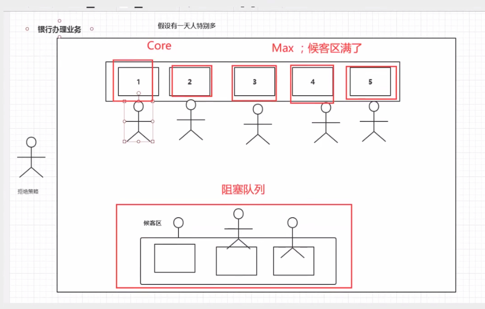

# Java 并发编程

## Maven 自动化管理工具

### Maven 简介

Maven是一个项目自动化构建工具。

1.  完成项目的工作：

	-   分析项目要做什么，知道项目的组成部分
	-   设计项目，通过哪些步骤，使用哪些步骤，需要多少人，多长的时间
	-   组建团队与设备
	-   开发人员写代码，测试代码，重复多次的工作
	-   测试人员，测试项目功能是否符合要求，直到测试代码通过

2.  传统开发项目的问题

    -   很多模块，模块之间有关系，手工管理较为繁琐
    -   需要很多第三方功能，需要很多jar包，手动获取
    -   需要管理jar包版本
    -   管理jar文件之间的依赖
    
3.  需要改进项目的开发和管理，可以使用maven

    -   管理jar文件
    -   自动下载jar及其文档、源代码
    -   管理jar包之间的依赖
    -   管理jar包的版本
    -   编译程序，把java编译为class
    -   测试代码是否正确
    -   打包文件，形成jar文件或war文件
    -   部署项目

4.  构建：项目的构建

    -   构建是面向过程的，就是一些步骤，完成项目代码的编译、测试、运行、打包、部署等

    -   maven支持的构建：

        1）清理：把之前项目编译的东西删掉，为新的编译代码做准备

        2）编译：把程序源代码编译为可执行代码，批量操作

        3）测试：maven可以执行测试程序代码，验证功能是否正确，批量操作

        4）报告：生成测试结果的文件

        5）打包：把项目中所有资源打包成项目的结果文件（jar包或者war包）

        6）安装：把jar文件或war文件安装到本地仓库

        7）部署：把程序安装好可以执行

5.  maven的核心概念

    -   POM：一个文件pom.xml，项目对象模型，maven把一个项目当做一个模型使用，可以控制maven构建项目的过程，管理jar依赖。
    -   约定的目录结构：maven项目的目录和文件的位置是有规定的。
    -   坐标：是一个唯一的字符串，用来表示资源的。
    -   依赖管理：管理项目中可以使用的jar文件。
    -   仓库管理：资源存放的位置
    -   生命周期：maven构建项目的过程
    -   插件和目标：执行maven构建的时候用的工具是插件
    -   继承
    -   聚合

6.  maven工具的安装和配置

### Maven的核心概念

1.  maven的约定目录结构
```
    Hello（项目名）
		|---src
		|---|---main（主程序）
		|---|---|---java（主程序中的包和包中java文件）
		|---|---|---resources（主程序中要使用的配置文件）
		|---|---test（测试代码和文件，可以没有）
		|---|---|---java（测试程序中的包和包中java文件）
		|---|---|---resources（测试程序中要使用的配置文件）
		|---pom.xml（核心文件）
```

每一个maven项目在磁盘中都是一个文件夹

2.  `mvn compile`编译src/main目录下的所有java文件

    在项目的根目录下会生成target目录（结果目录）

3.  仓库

    -   仓库是存放maven使用的jar包和项目所使用的jar包

    -   分类

        1）本地仓库：个人计算机上的文件夹

        2）远程仓库：互联网上，需要网络才能使用的仓库

        -   中央仓库：最权威的，所有的开发人员共享使用的集中仓库
        -   中央仓库镜像：在各大洲重要的城市都有镜像
        -   私服：内部局域网中使用

    -   使用：不需要人为参与

        开发人员需要使用->maven查本地仓库->私服->镜像->中央仓库

4.  pom：项目对象模型

    pom.xml

    https://mvnrepository.com/ 中央仓库

    | **基本信息**             |                                                              |                                                              |
    | ------------------------ | ------------------------------------------------------------ | ------------------------------------------------------------ |
    | modelVersion             | Maven模型的版本，对于Maven2和Maven3而言只能是4.0.0           |                                                              |
    | groupId                  | 组织id，一般是公司域名的缩写，格式可以为：1. 域名倒写 2.域名倒写+项目名 | groupId、artifactId、version三个元素生成了一个Maven项目的基本坐标，在众多的maven项目中可以唯一定位到某一个项目，坐标也决定将来项目在仓库中的路径及名称 |
    | artifactId               | 项目名称，也是模块名称，对应groupId中项目的子项目            |                                                              |
    | version                  | 项目的版本号，如果项目还在开发中是不稳定版本，通常在版本后带-SNAPSHOT， version使用三位数字标识，如1.0.0 |                                                              |
    | packaging                | 项目打包的类型，可以是jar、war、rar、ear、pom，默认是jar     |                                                              |
    | **依赖**                 |                                                              |                                                              |
    | dependencies和dependency | maven的一个重要作用就是管理jar包，为了一个项目可以构建或运行，项目中不可避免地会依赖很多其他的jar包，在maven中这些jar就称为依赖，使用标签dependency来配置 |                                                              |
    | **配置属性**             |                                                              |                                                              |
    | properties               | properties用来定义一些配置属性，例如project.build.sourceEncoding，可以设置为UTF-8，防止中文乱码，也可定义相关构建版本号，便于日后统一升级 |                                                              |
    | **构建**                 |                                                              |                                                              |
    | build                    | 表示与构建相关的配置，例如设置编译插件的jdk版本              |                                                              |
    | **继承**                 |                                                              |                                                              |
    | parent                   | 在maven中，如果多个模块都需要声明相同的配置，例如groupid、version、有相同的依赖、或者相同的组件配置等，也有类似Java的继承机制，用parent声明要继承的父工程的pom配置 |                                                              |
    | **聚合**                 |                                                              |                                                              |
    | modules                  | 在maven的多模块开发中，为了同一构建整个项目的所有模块，可以提供一个额外的模块，该模块打包方式为pom，并且在其中使用modules聚合的其他模块，这样通过本模块就可以一键自动识别模块间的依赖关系来构建所有模块，叫maven的聚合。 |                                                              |

5.  maven的常用命令

    -   `mvn clean`：清理
    -   `mvn compile`：编译主程序
    -   `mvn test-compile`：编译测试程序
    -   `mvn test`：测试
    -   `mvn package`：打包主程序
    -   `mvn install`：安装主程序
	-   `mvn deploy`：部署主程序
    

注意：必须在命令行进入pom.xml所在目录
-   maven的生命周期：maven构建项目的过程（清理、编译、测试、报告、打包、安装、部署）
-   maven的插件：maven命令执行时真正完成功能的是插件，插件是一些jar文件

### 依赖管理

`scope`指依赖范围，值有compile（默认）、test、provided，在maven构建项目的哪些阶段起作用。

|                    | compile | test | provided |
| ------------------ | ------- | ---- | -------- |
| 对主程序是否有效   | YES     | NO   | YES      |
| 对测试程序是否有效 | YES     | YES  | YES      |
| 是否参与打包       | YES     | NO   | NO       |
| 是否参与部署       | YES     | NO   | NO       |

### Maven常用设置

-   全局变量

Maven的pom.xml文件中，`<properties>`用于定义全局变量，POM中通过`${property_name}`的形式引用变量的值。

定义全局变量：

```xml
<properties>
    <spring.version>4.3.10.RELEASE</spring.version>
</properties>
```

引用全局变量

```xml
<dependency>
    <groupId>org.springframework</groupId>
    <artifactId>spring-context</artifactId>
    <version>${spring.version}</version>
</dependency>
```

Maven系统采用的变量

```xml
<properties>
    <project.build.sourceEncoding>UTF-8</project.build.sourceEncoding>
    <maven.compiler.source>1.8</maven.compiler.source>
    <maven.compiler.target>1.8</maven.compiler.target>
</properties>
```

-   指定资源位置

```xml
<build>
	<resources>
    	<directory>src/main/java</directory><!--所在的目录-->
        <includes><!--包括目录下的.properties，.xml文件都会扫描到-->
        	<include>**/*.properties</include>
            <include>**/*.xml</include>
        </includes>
        <filtering>false</filtering>
    </resources>
</build>
```

作用：

1.  默认没有使用resources，maven执行编译代码时会把src/main/resource目录中的文件拷贝到target/classes目录中，对于src/main/java目录下的非java文件不处理，不拷贝到target/classes目录中
2.  程序把一些文件放在src/main/java目录中，当执行java程序时需要用到src/main/java目录中的文件，要告诉maven在`mvn compile src/main/java`目录下的程序时，需要把文件一同拷贝到target/classes目录中，此时就需要在`<build>`中加入`<resources>`

## 进程和线程

-   JUC简介

    java.util工具包

    业务：普通的线程代码 Thread

    Runnable：没有返回值，效率相比Callable低

进程：一个程序，程序的集合

一个进程可以包含多个线程，至少包含一个线程

java默认有两个线程（main、gc）

Thread、Runnable、Callable可以开启线程

**java真的可以开启线程吗？开不了**

```java
    public synchronized void start() {
        if (this.threadStatus != 0) {
            throw new IllegalThreadStateException();
        } else {
            this.group.add(this);
            boolean started = false;

            try {
                this.start0();
                started = true;
            } finally {
                try {
                    if (!started) {
                        this.group.threadStartFailed(this);
                    }
                } catch (Throwable var8) {
                }

            }

        }
    }

    private native void start0();
```

start0是本地方法，调用底层C++，Java无法直接操作硬件。

-   并发和并行

    并发：多线程操作同一个资源，CPU单核交替运行

    并行：CPU多核，多个线程可以同时执行

    ```java
    public static void main(String[] args) {
        System.out.println(Runtime.getRuntime().availableProcessors());//获取CPU核数
    }
    ```

    并发编程的本质：充分利用CPU的资源

-   线程的状态

    ```java
    public static enum State {
            NEW,//新生
            RUNNABLE,//运行
            BLOCKED,//阻塞
            WAITING,//等待
            TIMED_WAITING,//超时等待
            TERMINATED;//终止
    
            private State() {
            }
        }
    ```

-   wait、sleep区别

    1.  来自不同的类：wait来自Object类，sleep来自Thread类
    2.  wait会释放锁，sleep不会释放锁
    3.  使用范围不同：wait必须在同步代码块中，sleep可以在任何地方
    4.  是否要捕获异常：wait不需要捕获异常，sleep必须要捕获异常

## Lock锁

-   传统Synchronized锁

    ```java
    public class CMain {
        public static void main(String[] args) {
            Ticket ticket=new Ticket();
            new Thread(() -> {
                for(int i=1;i<40;i++) ticket.sell();},"A").start();
            new Thread(() -> {
                for(int i=1;i<40;i++) ticket.sell();},"B").start();
            new Thread(() -> {
                for(int i=1;i<40;i++) ticket.sell();},"C").start();
        }
    }
    class Ticket{
        private int number=50;
        public synchronized void sell(){
            if(number>0) {
                System.out.print(Thread.currentThread().getName());
                System.out.println("卖出了"+number+"张票，剩余"+(number--)+"张");
            }
        }
    }
    ```

-   Lock 锁

    Lock接口

    实现类：

    1.  ReentrantLock（可重入锁）
    2.  ReentrantReadWriteLock.ReadLock（读锁）
    3.  ReentrantReadWriteLock.WriteLock（写锁）

    ReentrantLock部分源码：

    ```java
    public ReentrantLock() {
            this.sync = new ReentrantLock.NonfairSync();//非公平锁
        }
    
        public ReentrantLock(boolean fair) {
            this.sync = (ReentrantLock.Sync)(fair ? new ReentrantLock.FairSync() : new ReentrantLock.NonfairSync());//公平锁 or 非公平锁
        }
    ```

    -   公平锁：十分公平，先来后到
    -   **非公平锁：十分不公平，可以插队（默认）**

    使用锁：

    ```java
    Lock l=...;
    l.lock();//加锁
    //or
    l.tryLock();//尝试获取锁
    try{
        //业务代码
    }
    catch(Exception e){
        
    }
    finally{
        l.unlock();//解锁
    }
    ```

    示例代码：

    ```java
    public void sell(){
            lock.lock();
            try{
                if(number>0) {
                    System.out.print(Thread.currentThread().getName());
                    System.out.println("卖出了"+number+"张票，剩余"+(number--)+"张");
    
                }
            }
            catch (Exception e){
                e.printStackTrace();
            }
            finally {
                lock.unlock();
            }
    
        }
    ```

    -   Synchronized与Lock区别

        1.  Synchronized是内置Java关键字，Lock是一个Java接口
        2.  Synchronized无法判断获取锁的状态，Lock可以判断是否获取到了锁
        3.  Synchronized会自动释放锁，Lock必须要手动释放锁，如果不释放锁会死锁
        4.  Synchronized线程1获得锁，线程2等待；Lock不一定会一直等待
        5.  Synchronized是可重入锁，不可以中断，非公平；Lock是可重入锁，可以判断，可以判断锁，可以设置是否公平
        6.  Synchronized适合锁少量的代码问题，Lock适合锁大量的同步代码

### 注意事项

1.  synchronized锁的对象是方法的调用者（this），谁先拿到谁执行
2.  普通方法不受锁的影响
3.  两个对象，两个同步方法不会相互影响
4.  静态synchronized方法锁的是class类模板，全局唯一
5.  静态同步方法锁的是class类模板，普通同步方法锁的是方法调用者（this）

## 生产者与消费者问题

```java
public class CMain {
    public static void main(String[] args) {
        Data d=new Data();
        new Thread(()->{
            for (int i = 0; i < 10; i++) {
                try {
                    d.increment();
                } catch (InterruptedException e) {
                    e.printStackTrace();
                }
            }
        },"A").start();
        new Thread(()->{
            for (int i = 0; i < 10; i++) {
                try {
                    d.decrement();
                } catch (InterruptedException e) {
                    e.printStackTrace();
                }
            }
        },"B").start();
    }
}
class Data{
    private int number=0;
    public synchronized void increment() throws InterruptedException {
        while(number!=0){
            //等待
            this.wait();
        }
        number++;//业务
        System.out.println(Thread.currentThread().getName()+"->"+number);
        this.notifyAll();//通知
    }
    public synchronized void decrement() throws InterruptedException {
        while(number==0){
            //等待
            this.wait();
        }
        number--;//业务
        System.out.println(Thread.currentThread().getName()+"->"+number);
        this.notifyAll();//通知
    }
}
```

注意：防止虚假唤醒，wait一般放在循环中

JUC的生产者消费者问题

通过Lock可以找到Condition接口，await相当于synchronized中的wait，signal相当于synchronized中的notify

```java
class BoundedBuffer<E> {
   final Lock lock = new ReentrantLock();
   final Condition notFull  = lock.newCondition(); 
   final Condition notEmpty = lock.newCondition(); 

   final Object[] items = new Object[100];
   int putptr, takeptr, count;

   public void put(E x) throws InterruptedException {
     lock.lock();
     try {
       while (count == items.length)
         notFull.await();
       items[putptr] = x;
       if (++putptr == items.length) putptr = 0;
       ++count;
       notEmpty.signal();
     } finally {
       lock.unlock();
     }
   }

   public E take() throws InterruptedException {
     lock.lock();
     try {
       while (count == 0)
         notEmpty.await();
       E x = (E) items[takeptr];
       if (++takeptr == items.length) takeptr = 0;
       --count;
       notFull.signal();
       return x;
     } finally {
       lock.unlock();
     }
   }
 }
```

代码实现：

```java
public class CMain {
    public static void main(String[] args) {
        Data d=new Data();
        new Thread(()->{
            for (int i = 0; i < 10; i++) {
                d.printA();
            }
        },"A").start();
        new Thread(()->{
            for (int i = 0; i < 10; i++) {
                d.printB();
            }
        },"B").start();
        new Thread(()->{
            for (int i = 0; i < 10; i++) {
                d.printC();
            }
        },"C").start();
    }
}
class Data{
    private Lock lock=new ReentrantLock();
    private Condition condition1 = lock.newCondition();
    private Condition condition2 = lock.newCondition();
    private Condition condition3 = lock.newCondition();
    private int number=1;//1 A 2 B 3 C
    public void printA(){
        lock.lock();
        try {
            while(number!=1){
                condition1.await();
            }
            System.out.println(Thread.currentThread().getName()+"->AAA");
            number=2;
            condition2.signal();
        } catch (Exception e) {
            e.printStackTrace();
        } finally {
            lock.unlock();
        }
    }
    public void printB(){
        lock.lock();
        try {
            while (number!=2){
                condition2.await();
            }
            System.out.println(Thread.currentThread().getName()+"->BBB");
            number=3;
            condition3.signal();
        } catch (Exception e) {
            e.printStackTrace();
        } finally {
            lock.unlock();
        }
    }
    public void printC(){
        lock.lock();
        try {
            while (number!=3){
                condition3.await();
            }
            System.out.println(Thread.currentThread().getName()+"->CCC");
            number=1;
            condition1.signal();
        } catch (Exception e) {
            e.printStackTrace();
        } finally {
            lock.unlock();
        }
    }
}
```

Condition可以精准地通知和唤醒线程

## 集合类不安全

ConcurrentModificationException并发修改异常

### List不安全

ArrayList不安全，解决方案：


```java
   List<String> list = new Vector<>();
   List<String> list = Collections.synchronizedList(new ArrayList<>());
   List<String> list = new CopyOnWriteArrayList<>();
```

CopyOnWrite写入时复制，一种优化策略，在写入的时候避免覆盖造成数据问题。

Vector使用synchronized效率较低，CopyOnWrite使用Lock锁。

### Set不安全

HashSet不安全，解决方案：

```java
        Set<String> set=Collections.synchronizedSet(new HashSet<>());
        Set<String> set=new CopyOnWriteArraySet<>();
```

HashSet底层就是HashMap

```java
private static final Object PRESENT = new Object();
public HashSet() {
        this.map = new HashMap();
    }
public boolean add(E e) {
        return this.map.put(e, PRESENT) == null;
    }
```

### Map不安全

HashMap加载因子为0.75，初始化容量为16，扩容方式为2N。

>   https://zhuanlan.zhihu.com/p/149687607

HashMap不安全，解决方案：

```java
        Map<String,String> map=Collections.synchronizedMap(new HashMap<>());
        Map<String,String> map=new ConcurrentHashMap<>();
```

## Callable

多线程的第三种创建方式-Callable

-   可以有返回值
-   可以抛出异常
-   方法不同 call方法

代码测试：

```java
public class CMain {
    public static void main(String[] args) throws ExecutionException, InterruptedException {
        MyThread myThread = new MyThread();
        //适配类
        FutureTask futureTask = new FutureTask(myThread);
        new Thread(futureTask,"A").start();
        new Thread(futureTask,"B").start();//有缓存
        Integer i=(Integer)futureTask.get();//返回结果
        System.out.println(i);
    }
}
class MyThread implements Callable<Integer>{
    @Override
    public Integer call() throws Exception {
        System.out.println("call");
        return 111;
    }
}
```

注意：

1.  FutureTask是Runnable的实现类
2.  get方法可能会产生阻塞，把它放到最后或者使用异步通信
3.  有缓存，效率高

## 常用辅助类

### CountDownLatch

CountDownLatch是一个辅助工具类，允许一个或多个线程等待直到在其它线程中执行的一组操作完成。

减法计数器，常用方法：

1.  `countDown()`：数量减一
2.  `await()`：等待计数器归零

示例代码：

```java
public static void main(String[] args) throws ExecutionException, InterruptedException {
    CountDownLatch countDownLatch = new CountDownLatch(6);
    for (int i = 0; i < 6; i++) {
        new Thread(()->{
            System.out.println(Thread.currentThread().getName()+" go out");
            countDownLatch.countDown();//数量-1
        },String.valueOf(i)).start();
    }
    countDownLatch.await();//等待计数器归零再向下执行
    System.out.println("close door");
}
```

每次有线程调用CountDown方法数量-1，假设计数器变为0，await方法就会被唤醒，继续执行。

### CyclicBarrier

CyclicBarrier是一个辅助工具类，允许一组线程全部等待彼此到达共同屏障。

加法计数器

`await()`：等待计数器到达设定的值，内部会加一

```java
public static void main(String[] args)  {
    //设定值，到达设定值后执行的线程
    CyclicBarrier cyclicBarrier = new CyclicBarrier(7,()->{
        System.out.println("Success!");
    });
    for (int i = 1; i <= 7; i++) {
        final int temp=i;
        new Thread(()->{
            System.out.println(Thread.currentThread().getName()+"->"+temp);
            try {
                cyclicBarrier.await();//等待
            } catch (InterruptedException e) {
                e.printStackTrace();
            } catch (BrokenBarrierException e) {
                e.printStackTrace();
            }
        }, String.valueOf(i)).start();
    }
}
```

### Semaphore

Semaphore是一个计数器信号量，维持一组许可证。

常用方法：

1.  `acquire()`：获得（减一），假设如果已经满了，等待直到释放为止
2.  `release()`：释放，会将当前信号量释放（加一），然后唤醒等待的线程

示例代码：

```java
public static void main(String[] args)  {
    //线程数量
    Semaphore semaphore = new Semaphore(3);
    for (int i = 1; i <= 6; i++) {
        new Thread(()->{
            try {
                semaphore.acquire();
                System.out.println(Thread.currentThread().getName()+" gets resource");
                TimeUnit.SECONDS.sleep(2);
                System.out.println(Thread.currentThread().getName()+" releases resource");

            } catch (InterruptedException e) {
                e.printStackTrace();
            } finally {
                semaphore.release();
            }
        },String.valueOf(i)).start();
    }
}
```

作用：

1.  多个共享资源互斥的使用
2.  并发限流，控制最大的线程数，保证服务器的安全和高可用

## 读写锁

ReadWriteLock接口，有一个实现类ReentrantReadWriteLock。

读写锁维护一对关联的lock，一个用于读操作一个用于写操作；readlock可以被多个线程共享，writelock是独占的。

```java
public class CMain {
    public static void main(String[] args)  {
        Mycashed mycashed = new Mycashed();
        for (int i = 1; i <= 5; i++) {
            final int temp=i;
            new Thread(()->{
                mycashed.put(temp+"",temp+"");
            },String.valueOf(i)).start();
        }
        for (int i = 1; i <= 5; i++) {
            final int temp=i;
            new Thread(()->{
                mycashed.get(temp+"");
            },String.valueOf(i)).start();
        }
    }
}
class Mycashed{
    private volatile Map<String, Object> map = new HashMap<>();
    private ReadWriteLock lock=new ReentrantReadWriteLock();//读写锁，更加细粒度控制
    public void put(String key, Object value){
        lock.writeLock().lock();
        try {
            System.out.println(Thread.currentThread().getName()+" write "+key);
            map.put(key,value);
            System.out.println(Thread.currentThread().getName()+" write completed");
        } catch (Exception e) {
            e.printStackTrace();
        } finally {
            lock.writeLock().unlock();
        }
    }
    public Object get(String key){
        lock.readLock().lock();
        try {
            System.out.println(Thread.currentThread().getName()+" read "+key);
            Object o = map.get(key);
            System.out.println(Thread.currentThread().getName()+" read completed");
            return o;
        } catch (Exception e) {
            e.printStackTrace();
            return null;
        } finally {
            lock.readLock().unlock();
        }
    }
}
```

**注意：共存问题**

ReadWriteLock

读-读 可以

读-写 不能

写-写 不能

独占锁（写锁）：一次只能被一个线程占有

共享锁（读锁）：多个线程可以同时占有

## 阻塞队列

队列（FIFO）

-   写入：如果队列满了，就必须阻塞等待
-   取出：如果队列是空的，就必须阻塞等待生产

### BlockingQueue

BlockingQueue是一个接口，实现类有：ArrayBlockingQueue, DelayQueue, LinkedBlockingDeque, LinkedBlockingQueue, LinkedTransferQueue, PriorityBlockingQueue, SynchronousQueue

使用场景：多线程并发处理、线程池


队列的使用：

添加、删除

*四组API：*

| 方式         | 抛出异常 | 不会抛出异常，有返回值 | 阻塞 等待 | 超时等待    |
| ------------ | -------- | ---------------------- | --------- | ----------- |
| 添加         | add      | offer()                | put       | offer(参数) |
| 移除         | remove   | poll()                 | take      | poll(参数)  |
| 判断队列首部 | element  | peek                   | -         | -           |

抛出异常API：

```java
public static void test1(){
        ArrayBlockingQueue arrayBlockingQueue = new ArrayBlockingQueue<>(3);
        System.out.println(arrayBlockingQueue.add("a"));
        System.out.println(arrayBlockingQueue.add("b"));
        System.out.println(arrayBlockingQueue.add("c"));
//        System.out.println(arrayBlockingQueue.add("d"));//抛出异常：java.lang.IllegalStateException: Queue full
        System.out.println(arrayBlockingQueue.remove());
        System.out.println(arrayBlockingQueue.element());//查看队首元素
        System.out.println(arrayBlockingQueue.remove());
        System.out.println(arrayBlockingQueue.remove());
//        System.out.println(arrayBlockingQueue.remove());//抛出异常：java.util.NoSuchElementException
    }
```

不抛出异常，有返回值API：

```java
public static void test2(){
        ArrayBlockingQueue arrayBlockingQueue = new ArrayBlockingQueue<>(3);
        System.out.println(arrayBlockingQueue.offer("a"));
        System.out.println(arrayBlockingQueue.offer("b"));
        System.out.println(arrayBlockingQueue.offer("c"));
        System.out.println(arrayBlockingQueue.offer("d"));//false, 不抛出异常
        System.out.println(arrayBlockingQueue.poll());
        System.out.println(arrayBlockingQueue.peek());//获取队首元素
        System.out.println(arrayBlockingQueue.poll());
        System.out.println(arrayBlockingQueue.poll());
        System.out.println(arrayBlockingQueue.poll());//null, 不抛出异常
    }
```

阻塞等待API：

```java
public static void test3() throws InterruptedException {
        ArrayBlockingQueue arrayBlockingQueue = new ArrayBlockingQueue<>(3);
        arrayBlockingQueue.put("a");
        arrayBlockingQueue.put("b");
        arrayBlockingQueue.put("c");
//        arrayBlockingQueue.put("d");//一直阻塞
        System.out.println(arrayBlockingQueue.take());
        System.out.println(arrayBlockingQueue.take());
        System.out.println(arrayBlockingQueue.take());
//        System.out.println(arrayBlockingQueue.take());//一直阻塞
    }
```

超时等待API：

```java
public static void test4() throws InterruptedException {
    ArrayBlockingQueue arrayBlockingQueue = new ArrayBlockingQueue<>(3);
    arrayBlockingQueue.offer("a");
    arrayBlockingQueue.offer("b");
    arrayBlockingQueue.offer("c");
    arrayBlockingQueue.offer("d",2,TimeUnit.SECONDS);//超时等待
    System.out.println(arrayBlockingQueue.poll());
    System.out.println(arrayBlockingQueue.poll());
    System.out.println(arrayBlockingQueue.poll());
    arrayBlockingQueue.poll(2, TimeUnit.SECONDS);//超时等待
}
```

### SynchronizedQueue

容量为1，进去一个元素必须等待取出来之后才能再往里面放元素

put、take操作

```java
public static void main(String[] args) throws InterruptedException {
    BlockingQueue<String> blockingQueue =  new SynchronousQueue<String>();//同步队列
    new Thread(()->{
        try {
            System.out.println(Thread.currentThread().getName()+" put 1");
            blockingQueue.put("1");
            System.out.println(Thread.currentThread().getName()+" put 2");
            blockingQueue.put("2");
            System.out.println(Thread.currentThread().getName()+" put 3");
            blockingQueue.put("3");
        } catch (InterruptedException e) {
            e.printStackTrace();
        }
    },"T1").start();
    new Thread(()->{
        try {
            TimeUnit.SECONDS.sleep(3);
            System.out.println(Thread.currentThread().getName()+blockingQueue.take());
            TimeUnit.SECONDS.sleep(3);
            System.out.println(Thread.currentThread().getName()+blockingQueue.take());
            TimeUnit.SECONDS.sleep(3);
            System.out.println(Thread.currentThread().getName()+blockingQueue.take());
        } catch (InterruptedException e) {
            e.printStackTrace();
        }
    },"T2").start();
}
```

put了一个元素必须从里面take取出来，否则不能再put进去值

## 线程池

### 池化技术

程序的运行本质是占用系统资源，优化资源使用=>池化技术

线程池、连接池、内存池、对象池......创建、销毁十分浪费资源

池化技术：事先转备好一些资源，要用就来拿，用完之后归还

线程池的好处：

-   降低资源消耗
-   提高响应速度
-   方便管理

线程复用、可以控制最大并发数

线程池的使用：

```java
public static void main(String[] args) throws InterruptedException {
//        ExecutorService threadPool = Executors.newSingleThreadExecutor();//单个线程
//        ExecutorService threadPool = Executors.newFixedThreadPool(5);//固定线程池大小
        ExecutorService threadPool = Executors.newCachedThreadPool();//可伸缩的
        try {
            for (int i = 0; i < 100; i++) {
                //使用线程池来创建线程
                threadPool.execute(()->{
                    System.out.println(Thread.currentThread().getName()+" ok");
                });
            }
        } catch (Exception e) {
            e.printStackTrace();
        } finally {
            threadPool.shutdown();//关闭线程池
        }


    }
```

### 三大方法

```java
Executors.newSingleThreadExecutor();//单个线程
Executors.newFixedThreadPool(5);//固定线程池大小
Executors.newCachedThreadPool();//可伸缩的
```

源码分析

```java
public static ExecutorService newSingleThreadExecutor() {
    return new Executors.FinalizableDelegatedExecutorService(new ThreadPoolExecutor(1, 1, 0L, TimeUnit.MILLISECONDS, new LinkedBlockingQueue()));
}

public static ExecutorService newFixedThreadPool(int nThreads) {
        return new ThreadPoolExecutor(nThreads, nThreads, 0L, TimeUnit.MILLISECONDS, new LinkedBlockingQueue());
    }
public static ExecutorService newCachedThreadPool() {
        return new ThreadPoolExecutor(0, 2147483647, 60L, TimeUnit.SECONDS, new SynchronousQueue());
    }
```

本质上是调用ThreadPoolExecutor

### 七大参数

```java
public ThreadPoolExecutor(int corePoolSize, int maximumPoolSize, long keepAliveTime, TimeUnit unit, BlockingQueue<Runnable> workQueue, ThreadFactory threadFactory, RejectedExecutionHandler handler) {
    this.ctl = new AtomicInteger(ctlOf(-536870912, 0));
    this.mainLock = new ReentrantLock();
    this.workers = new HashSet();
    this.termination = this.mainLock.newCondition();
    if (corePoolSize >= 0 && maximumPoolSize > 0 && maximumPoolSize >= corePoolSize && keepAliveTime >= 0L) {
        if (workQueue != null && threadFactory != null && handler != null) {
            this.corePoolSize = corePoolSize;
            this.maximumPoolSize = maximumPoolSize;
            this.workQueue = workQueue;
            this.keepAliveTime = unit.toNanos(keepAliveTime);
            this.threadFactory = threadFactory;
            this.handler = handler;
        } else {
            throw new NullPointerException();
        }
    } else {
        throw new IllegalArgumentException();
    }
}
```

-   corePoolSize：核心线程池大小
-   maximumPoolSize：最大线程池大小
-   keepAliveTime：存活时间，超时了没有人调用就会释放
-   unit：时间单位
-   workQueue：阻塞队列
-   threadFactory：线程工厂，创建线程的，一般不用动
-   handler：拒绝策略



**线程池不允许使用 Executors 去创建，而是通过 ThreadPoolExecutor 的方式，这样的处理方式让写的同学更加明确线程池的运行规则，规避资源耗尽的风险。**

```java
public static void main(String[] args) throws InterruptedException {
//        ExecutorService threadPool = Executors.newSingleThreadExecutor();//单个线程
//        ExecutorService threadPool = Executors.newFixedThreadPool(5);//固定线程池大小
//        ExecutorService threadPool = Executors.newCachedThreadPool();//可伸缩的
        ExecutorService threadPool = new ThreadPoolExecutor(2,5,3,TimeUnit.SECONDS,new LinkedBlockingDeque<>(3), Executors.defaultThreadFactory(), new ThreadPoolExecutor.AbortPolicy());
        try {
            for (int i = 0; i < 100; i++) {
                //使用线程池来创建线程
                threadPool.execute(()->{
                    System.out.println(Thread.currentThread().getName()+" ok");
                });
            }
        } catch (Exception e) {
            e.printStackTrace();
        } finally {
            threadPool.shutdown();//关闭线程池
        }
    }
```

最大承载数=Deque+max

超出最大承载会抛出异常`java.util.concurrent.RejectedExecutionException`

### 四种拒绝策略

-   AbortPolicy：不处理多出的线程，抛出异常
-   CallerRunsPolicy：哪来的去哪里，让caller去执行这条线程
-   DiscardPolicy：队列满了，丢弃任务，不会抛出异常
-   DiscardOldestPolicy：队列满了，尝试和最早的竞争，不会抛出异常

### 注意事项

最大线程数该如何定义：

1.  CPU密集型，定义为CPU核心数，可以保证CPU效率最高
2.  IO密集型，判断程序中十分耗IO的线程数，定义为大于该线程数即可，一般设置为2倍

## ForkJoin

JDK1.7+出现，并行执行任务，提高效率

大数据：MapReduce，把大任务拆分为小任务

特点：工作窃取


维护的是双端队列。

### 操作

forkjoin使用：

1.  ForkJoinPool通过它来执行
2.  计算任务`ForkJoinPool.execute(ForkJoinTask<?> task)`
3.  计算类继承ForkJoinTask

```java
public class CMain extends RecursiveTask<Long>{
    private Long start;
    private Long end;
    private Long temp=10000L;
    public CMain(Long start, Long end) {
        this.start = start;
        this.end = end;
    }
    public static void main(String[] args) throws ExecutionException, InterruptedException {
        ForkJoinPool forkJoinPool = new ForkJoinPool();
        ForkJoinTask<Long> cMain = new CMain(0L, 10_0000_0000L);
        ForkJoinTask<Long> submit = forkJoinPool.submit(cMain);
        Long sum = submit.get();
        System.out.println(sum);
    }
    @Override
    protected Long compute() {
        if(end-start<temp){
            Long sum=0L;
            for (Long i = start; i <= end; i++) {
                sum+=i;
            }
            return sum;
        }
        else{
            long middle = (start + end) / 2;
            CMain f1 = new CMain(start, middle);
            f1.fork();//拆分任务，把任务压入线程队列
            CMain f2 = new CMain(middle + 1, end);
            f2.fork();
            long l = f1.join() + f2.join();
            return l;
        }
    }
}
```

使用Stream流计算：

```java
public static void main(String[] args) {
    long sum = LongStream.rangeClosed(0L, 10_0000_0000L).parallel().reduce(0, Long::sum);
    System.out.println(sum);
}
```

## 异步回调

Future对将来的某个事件的结果进行建模，CompletableFuture是Future的实现类

-   异步执行
-   成功回调
-   失败回调

1.  没有返回值的异步回调

    ```java
    public static void main(String[] args) throws ExecutionException, InterruptedException {
        CompletableFuture<Void> completableFuture = CompletableFuture.runAsync(()->{
            try {
                TimeUnit.SECONDS.sleep(2);
            } catch (InterruptedException e) {
                e.printStackTrace();
            }
            System.out.println(Thread.currentThread().getName()+" RunAsync=>Void");
        });//异步回调
        System.out.println("1111");
        completableFuture.get();//获取执行结果
    }
    ```

2.  有返回值的异步回调

    ```java
    public static void main(String[] args) throws ExecutionException, InterruptedException {
        CompletableFuture<Integer> completableFuture = CompletableFuture.supplyAsync(()->{
            System.out.println("CompleteFuture");
            int i=10/0;
            return 1024;
        });
        System.out.println(completableFuture.whenComplete((t, u) -> {
            System.out.println("t=" + t + ",u=" + u);//t:正常的返回结果，u:错误信息
        }).exceptionally((e) -> {
            System.out.println(e.getMessage());//可以获取到错误的返回结果
            return 233;//可以获取到错误的返回结果
        }).get());
    }
    ```

## JMM

Volatile是Java虚拟机提供的**轻量级同步机制**

1.  保证可见性
2.  **不保证原子性**
3.  禁止指令重排

JMM：Java内存模型，是一种概念、约定，不存在的东西。

-   关于JMM同步的约定：

    1.  线程解锁前，必须把共享变量**立刻**刷回主存（原因：线程工作内存与主存中有一条总线，加入volatile关键字后开启协议，监听线程中的共享变量）
    2.  线程加锁前，必须主存中的最新值到线程工作内存中
    3.  加锁和解锁必须是同一把锁

-   线程 **工作内存** **主内存**

    >   https://www.cnblogs.com/null-qige/p/9481900.html

    内存交互操作有8种，虚拟机实现必须保证每一个操作都是原子的，不可在分的（对于double和long类型的变量来说，load、store、read和write操作在某些平台上允许例外）
    
    -   lock   （锁定）：作用于主内存的变量，把一个变量标识为线程独占状态
    -   unlock （解锁）：作用于主内存的变量，它把一个处于锁定状态的变量释放出来，释放后的变量才可以被其他线程锁定
    -   read  （读取）：作用于主内存变量，它把一个变量的值从主内存传输到线程的工作内存中，以便随后的load动作使用
    -   load   （载入）：作用于工作内存的变量，它把read操作从主存中变量放入工作内存中
    -   use   （使用）：作用于工作内存中的变量，它把工作内存中的变量传输给执行引擎，每当虚拟机遇到一个需要使用到变量的值，就会使用到这个指令
    -   assign （赋值）：作用于工作内存中的变量，它把一个从执行引擎中接受到的值放入工作内存的变量副本中
-   store  （存储）：作用于主内存中的变量，它把一个从工作内存中一个变量的值传送到主内存中，以便后续的write使用
    -   write 　（写入）：作用于主内存中的变量，它把store操作从工作内存中得到的变量的值放入主内存的变量中

    　　
    
    JMM对这八种指令的使用，制定了如下规则：
    
    -   不允许read和load、store和write操作之一单独出现。即使用了read必须load，使用了store必须write
    -   不允许线程丢弃他最近的assign操作，即工作变量的数据改变了之后，必须告知主存
    -   不允许一个线程将没有assign的数据从工作内存同步回主内存
    -   一个新的变量必须在主内存中诞生，不允许工作内存直接使用一个未被初始化的变量。就是怼变量实施use、store操作之前，必须经过assign和load操作
-   一个变量同一时间只有一个线程能对其进行lock。多次lock后，必须执行相同次数的unlock才能解锁
    -   如果对一个变量进行lock操作，会清空所有工作内存中此变量的值，在执行引擎使用这个变量前，必须重新load或assign操作初始化变量的值
    -   如果一个变量没有被lock，就不能对其进行unlock操作。也不能unlock一个被其他线程锁住的变量
    -   对一个变量进行unlock操作之前，必须把此变量同步回主内存

问题：程序不知道主内存中的值已经被修改过了

```java
public class CMain {
    private static int num=0;
    public static void main(String[] args) throws InterruptedException {
        new Thread(()->{
            while(num==0){
            }
        }).start();
        TimeUnit.SECONDS.sleep(1);
        num=1;
        System.out.println(num);
    }
}
```

## Volatile

三大特性：

1.  保证可见性
2.  **不保证原子性**
3.  禁止指令重排

```java
public class CMain {
    private volatile static int num=0;//可以保证可见性
    public static void main(String[] args) throws InterruptedException {
        new Thread(()->{
            while(num==0){
            }
        }).start();
        TimeUnit.SECONDS.sleep(1);
        num=1;
        System.out.println(num);
    }
}
```

原子性：不可分割

线程在执行任务的时候不能被打扰，要么同时成功要么同时失败

volatile不能保证原子性

```java
public class CMain {
    private volatile static int num=0;//不能保证原子性
    public static void main(String[] args) throws InterruptedException {
        for (int i = 1; i <= 20; i++) {
            new Thread(()->{
                for (int j = 1; j <= 1000; j++) {
                    add();
                }
            }).start();
        }
        while (Thread.activeCount()>2){
            Thread.yield();
        }
        System.out.println(Thread.currentThread().getName()+"->"+num);//不是20000
    }
    public static void add(){
        num++;//不是原子性操作
    }

}
```


问题：如果不加synchronized或lock，如何保证原子性---使用原子类解决原子问题

```java
public class CMain {
    private volatile static AtomicInteger num = new AtomicInteger();//原子类int
    public static void main(String[] args) throws InterruptedException {
        for (int i = 1; i <= 20; i++) {
            new Thread(()->{
                for (int j = 1; j <= 1000; j++) {
                    add();
                }
            }).start();
        }
        while (Thread.activeCount()>2){
            Thread.yield();
        }
        System.out.println(Thread.currentThread().getName()+"->"+num);
    }
    public static void add(){
        num.getAndIncrement();//CAS
    }
}
```

这些类的底层都与操作系统挂钩，直接在内存中修改值，Unsafe类是一个很特殊的存在。

指令重排：计算机并不是按照写的程序那样执行的

源代码->编译器优化的重排->指令并行的重排->内存系统也会重排->执行

**指令重排前提：会考虑数据依赖性问题**

默认a,b,x,y=0

| 线程A | 线程B |
| ----- | ----- |
| x=a   | y=b   |
| b=1   | a=2   |

正常结果：x=0, y=0，但是由于指令重排，会导致异常结果

| 线程A | 线程B |
| ----- | ----- |
| b=1   | a=2   |
| x=a   | y=b   |

异常结果：x=2,y=1

volatile关键字可以避免指令重排：

内存屏障，CPU指令，作用：

1.  保证特定的操作的执行顺序
2.  可以保存某些变量的内存可见性（利用这些特性volatile实现了可见性）

## CAS

Compare And Swap比较并交换

```java
public static void main(String[] args) throws Exception {
        AtomicInteger atomicInteger = new AtomicInteger(2020);
        System.out.println(atomicInteger.compareAndSet(2020, 2021));//如果期望值达到了就更新，否则不更新
        System.out.println(atomicInteger.get());
        System.out.println(atomicInteger.compareAndSet(2020, 2022));//如果期望值达到了就更新，否则不更新
        System.out.println(atomicInteger.get());
    }
```

源码调用Unsafe类：


Unsafe类需要调用底层，getAndAdd使用了自旋锁


-   CAS
    1.  比较当前工作内存中的值和主内存中的值，如果这个值是期望的就执行操作，否则不执行一直循环（底层是自旋锁）->自带原子性
    2.  缺点：循环会耗时，一次性只能保证一个共享变量的原子性，会存在ABA问题

### ABA问题

```java
public static void main(String[] args) throws Exception {
    AtomicInteger atomicInteger = new AtomicInteger(2020);
    //---------------------------捣乱的----------------------------
    System.out.println(atomicInteger.compareAndSet(2020, 2021));
    System.out.println(atomicInteger.get());
    System.out.println(atomicInteger.compareAndSet(2021, 2020));
    System.out.println(atomicInteger.get());
    //--------------------------期望的-----------------------------
    System.out.println(atomicInteger.compareAndSet(2020, 2022));
    System.out.println(atomicInteger.get());
}
```


### 原子引用

原子引用可以解决ABA问题，即带版本号的原子操作。

AtomicReference类可以控制原子更新的对象引用

**Integer采用了对象缓存机制，默认范围是-128~127，推荐使用静态工厂方法valueOf获取对象实例而不是new，因为valueOf使用缓存，new一定会创建新的对象分配新的内存空间**


```java
public static void main(String[] args) throws Exception {
    //注意如果泛型是包装类，注意对象的引用问题
    AtomicStampedReference<Integer> atomicReference = new AtomicStampedReference<>(123, 1);
    new Thread(()->{
        int stamp=atomicReference.getStamp();//获得版本号
        System.out.println("a1=>"+stamp);
        try {
            TimeUnit.SECONDS.sleep(1);
        } catch (InterruptedException e) {
            e.printStackTrace();
        }
        System.out.println(atomicReference.compareAndSet(123, 124, atomicReference.getStamp(), atomicReference.getStamp() + 1));
        System.out.println("a2=>"+atomicReference.getStamp());
        System.out.println(atomicReference.compareAndSet(124, 123, atomicReference.getStamp(), atomicReference.getStamp() + 1));
        System.out.println("a3=>"+atomicReference.getStamp());
    },"A").start();
    new Thread(()->{
        int stamp=atomicReference.getStamp();//获得版本号
        System.out.println("b1=>"+stamp);
        try {
            TimeUnit.SECONDS.sleep(2);
        } catch (InterruptedException e) {
            e.printStackTrace();
        }
        System.out.println(atomicReference.compareAndSet(123, 111, stamp, stamp + 1));
        System.out.println("b2=>"+atomicReference.getStamp());
    },"B").start();
}
```

对应思想：乐观锁

## 锁的理解

### 公平锁、非公平锁

公平锁：非常公平，不能插队，必须先来后到

非公平锁：可以插队（默认）

源码实现：

```java
public ReentrantLock() {
        this.sync = new ReentrantLock.NonfairSync();//默认非公平锁
    }
public ReentrantLock(boolean fair) {
        this.sync = (ReentrantLock.Sync)(fair ? new ReentrantLock.FairSync() : new ReentrantLock.NonfairSync());//重载方法可设置是否公平
    }
```

### 可重入锁

可重入锁（递归锁）


synchronized版：


```java
public class CMain {
    public static void main(String[] args) throws Exception {
        Phone phone = new Phone();
        new Thread(()->{phone.sms();},"A").start();
        new Thread(()->{phone.sms();},"B").start();
    }
}
class Phone{
    public synchronized void sms(){
        System.out.println(Thread.currentThread().getName()+" sms");
        call();//这里也有锁，不释放锁
    }
    public synchronized void call(){
        System.out.println(Thread.currentThread().getName()+" call");
    }
}
```

lock版：

```java
public class CMain {
    public static void main(String[] args) throws Exception {
        Phone phone = new Phone();
        new Thread(()->{phone.sms();},"A").start();
        new Thread(()->{phone.sms();},"B").start();
    }
}
class Phone{
    Lock lock= new ReentrantLock();
    public void sms(){
        lock.lock();
        try {
            System.out.println(Thread.currentThread().getName()+" sms");
            call();//两把锁
        } catch (Exception e) {
            e.printStackTrace();
        } finally {
            lock.unlock();//注意锁必须配对，否则会死锁
        }
    }
    public void call(){
        lock.lock();
        try {
            System.out.println(Thread.currentThread().getName()+" call");
        } catch (Exception e) {
            e.printStackTrace();
        } finally {
            lock.unlock();
        }
    }
}
```

### 自旋锁

CAS源码中的自旋锁：


spin lock不断循环尝试，直到成功为止

自定义自旋锁：

```java
public class CMain {
    public static void main(String[] args) throws Exception {
        SpinLock lock = new SpinLock();
        new Thread(()->{
            lock.myLock();
            try {
                TimeUnit.SECONDS.sleep(3);
            } catch (Exception e) {
                e.printStackTrace();
            } finally {
                lock.myunlock();
            }
        },"T1").start();
        new Thread(()->{
            lock.myLock();
            try {
                TimeUnit.SECONDS.sleep(1);
            } catch (Exception e) {
                e.printStackTrace();
            } finally {
                lock.myunlock();
            }
        },"T2").start();
    }
}
class SpinLock{
    AtomicReference<Thread> atomicReference = new AtomicReference<>();
    public void myLock(){
        Thread thread = Thread.currentThread();
        System.out.println(Thread.currentThread().getName()+"->mylock");
        while (!atomicReference.compareAndSet(null,thread))//自旋锁
        {
        }
    }
    public void myunlock(){
        Thread thread = Thread.currentThread();
        System.out.println(Thread.currentThread().getName()+"->myunlock");
        atomicReference.compareAndSet(thread,null);
    }
}
```

### 死锁

死锁：两个线程互相抢夺资源


死锁测试

```java
public class CMain {
    public static void main(String[] args) throws Exception {
        String lockA="lockA";
        String lockB="lockB";
        new Thread(new MyThread(lockA,lockB),"T1").start();
        new Thread(new MyThread(lockB,lockA),"T2").start();
    }
}
class MyThread implements Runnable{
    private String lockA;
    private String lockB;
    public MyThread(String lockA, String lockB) {
        this.lockA = lockA;
        this.lockB = lockB;
    }
    @Override
    public void run() {
        synchronized (lockA){
            System.out.println(Thread.currentThread().getName()+" lock:"+lockA+" acquire:"+lockB);
            try {
                TimeUnit.SECONDS.sleep(2);
            } catch (InterruptedException e) {
                e.printStackTrace();
            }
            synchronized (lockB){
                System.out.println(Thread.currentThread().getName()+" lock:"+lockB+" acquire:"+lockA);
            }
        }
    }
}
```

解决方案：

1.  使用`jps -l`定位进程号
2.  使用`jstack 进程号`找到死锁信息


## AQS

>   作者：安中古天乐
>   链接：https://www.jianshu.com/p/0f876ead2846
>   来源：简书
>   著作权归作者所有。商业转载请联系作者获得授权，非商业转载请注明出处。

所谓AQS，指的是AbstractQueuedSynchronizer，它提供了一种实现阻塞锁和一系列依赖FIFO等待队列的同步器的框架，ReentrantLock、Semaphore、CountDownLatch、CyclicBarrier等并发类均是基于AQS来实现的，具体用法是通过继承AQS实现其模板方法，然后将子类作为同步组件的内部类。

### 基本框架

AQS基本框架如下图所示：


AQS维护了一个volatile语义(支持多线程下的可见性)的共享资源变量state和一个FIFO线程等待队列(多线程竞争state被阻塞时会进入此队列)。

#### State

首先说一下共享资源变量state，它是int数据类型的，其访问方式有3种：

-   getState()
-   setState(int newState)
-   compareAndSetState(int expect, int update)

上述3种方式均是原子操作，其中compareAndSetState()的实现依赖于Unsafe的compareAndSwapInt()方法。

```java
private volatile int state;

// 具有内存读可见性语义
protected final int getState() {
    return state;
}

// 具有内存写可见性语义
protected final void setState(int newState) {
    state = newState;
}

// 具有内存读/写可见性语义
protected final boolean compareAndSetState(int expect, int update) {
    // See below for intrinsics setup to support this
    return unsafe.compareAndSwapInt(this, stateOffset, expect, update);
}
```

资源的共享方式分为2种：

-   独占式(Exclusive)

只有单个线程能够成功获取资源并执行，如ReentrantLock。

-   共享式(Shared)

多个线程可成功获取资源并执行，如Semaphore/CountDownLatch等。

AQS将大部分的同步逻辑均已经实现好，继承的自定义同步器只需要实现state的获取(acquire)和释放(release)的逻辑代码就可以，主要包括下面方法：

-   tryAcquire(int)：独占方式。尝试获取资源，成功则返回true，失败则返回false。
-   tryRelease(int)：独占方式。尝试释放资源，成功则返回true，失败则返回false。
-   tryAcquireShared(int)：共享方式。尝试获取资源。负数表示失败；0表示成功，但没有剩余可用资源；正数表示成功，且有剩余资源。
-   tryReleaseShared(int)：共享方式。尝试释放资源，如果释放后允许唤醒后续等待结点返回true，否则返回false。
-   isHeldExclusively()：该线程是否正在独占资源。只有用到condition才需要去实现它。

AQS需要子类复写的方法均没有声明为abstract，目的是避免子类需要强制性覆写多个方法，因为一般自定义同步器要么是独占方法，要么是共享方法，只需实现tryAcquire-tryRelease、tryAcquireShared-tryReleaseShared中的一种即可。

当然，AQS也支持子类同时实现独占和共享两种模式，如ReentrantReadWriteLock。

#### CLH队列(FIFO)

AQS是通过内部类Node来实现FIFO队列的，源代码解析如下：

```java
static final class Node {
    
    // 表明节点在共享模式下等待的标记
    static final Node SHARED = new Node();
    // 表明节点在独占模式下等待的标记
    static final Node EXCLUSIVE = null;

    // 表征等待线程已取消的
    static final int CANCELLED =  1;
    // 表征需要唤醒后续线程
    static final int SIGNAL    = -1;
    // 表征线程正在等待触发条件(condition)
    static final int CONDITION = -2;
    // 表征下一个acquireShared应无条件传播
    static final int PROPAGATE = -3;

    /**
     *   SIGNAL: 当前节点释放state或者取消后，将通知后续节点竞争state。
     *   CANCELLED: 线程因timeout和interrupt而放弃竞争state，当前节点将与state彻底拜拜
     *   CONDITION: 表征当前节点处于条件队列中，它将不能用作同步队列节点，直到其waitStatus被重置为0
     *   PROPAGATE: 表征下一个acquireShared应无条件传播
     *   0: None of the above
     */
    volatile int waitStatus;
    
    // 前继节点
    volatile Node prev;
    // 后继节点
    volatile Node next;
    // 持有的线程
    volatile Thread thread;
    // 链接下一个等待条件触发的节点
    Node nextWaiter;

    // 返回节点是否处于Shared状态下
    final boolean isShared() {
        return nextWaiter == SHARED;
    }

    // 返回前继节点
    final Node predecessor() throws NullPointerException {
        Node p = prev;
        if (p == null)
            throw new NullPointerException();
        else
            return p;
    }
    
    // Shared模式下的Node构造函数
    Node() {  
    }

    // 用于addWaiter
    Node(Thread thread, Node mode) {  
        this.nextWaiter = mode;
        this.thread = thread;
    }
    
    // 用于Condition
    Node(Thread thread, int waitStatus) {
        this.waitStatus = waitStatus;
        this.thread = thread;
    }
}
```

可以看到，waitStatus非负的时候，表征不可用，正数代表处于等待状态，所以waitStatus只需要检查其正负符号即可，不用太多关注特定值。

### 获取资源(独占模式)

#### acquire(int)

首先讲解独占模式(Exclusive)下的获取/释放资源过程，其入口方法为:

```java
public final void acquire(int arg) {
    if (!tryAcquire(arg) &&
        acquireQueued(addWaiter(Node.EXCLUSIVE), arg))
        selfInterrupt();
}
```

tryAcquire(arg)为线程获取资源的方法函数，在AQS中定义如下：

```java
protected boolean tryAcquire(int arg) {
    throw new UnsupportedOperationException();
}
```

很明显，该方法是空方法，且由protected修饰，说明该方法需要由子类即自定义同步器来实现。

acquire()方法至少执行一次tryAcquire(arg)，若返回true，则acquire直接返回，否则进入acquireQueued(addWaiter(Node.EXCLUSIVE), arg)方法。

acquireQueued方法分为3个步骤：

1.  addWriter()将当前线程加入到等待队列的尾部，并标记为独占模式；
2.  acquireQueued()使线程在等待队列中获取资源，直到获取到资源返回，若整个等待过程被中断过，则返回True，否则返回False。
3.  如果线程在等待过程中被中断过，则先标记上，待获取到资源后再进行自我中断selfInterrupt()，将中断响应掉。

下面具体看看过程中涉及到的各函数：

#### tryAcquire(int)

tryAcquire尝试以独占的模式获取资源，如果获取成功则返回True，否则直接返回False，默认实现是抛出UnsupportedOperationException，具体实现由自定义扩展了AQS的同步器来完成。

#### addWaiter(Node)

addWaiter为当前线程以指定模式创建节点，并将其添加到等待队列的尾部，其源码为：

```csharp
private Node addWaiter(Node mode) {
    Node node = new Node(Thread.currentThread(), mode);
    // 尝试将节点快速插入等待队列，若失败则执行常规插入(enq方法)
    Node pred = tail;
    if (pred != null) {
        node.prev = pred;
        if (compareAndSetTail(pred, node)) {
            pred.next = node;
            return node;
        }
    }
    // 常规插入
    enq(node);
    return node;
}
```

再看enq(node)方法：

```java
private Node enq(final Node node) {
    for (;;) {
        Node t = tail;
        if (t == null) { // Must initialize
            if (compareAndSetHead(new Node()))
                tail = head;
        } else {
            node.prev = t;
            if (compareAndSetTail(t, node)) {
                t.next = node;
                return t;
            }
        }
    }
}
```

可以看到，常规插入与快速插入相比，有2点不同：

1.  常规插入是自旋过程(for(;;))，能够保证节点插入成功；
2.  比快速插入多包含了1种情况，即当前等待队列为空时，需要初始化队列，即将待插入节点设置为头结点，同时为尾节点(因为只有一个嘛)。

常规插入与快速插入均依赖于CAS，其实现依赖于unsafe类，具体代码如下：

```kotlin
private final boolean compareAndSetHead(Node update) {
    return unsafe.compareAndSwapObject(this, headOffset, null, update);
}

private final boolean compareAndSetTail(Node expect, Node update) {
    return unsafe.compareAndSwapObject(this, tailOffset, expect, update);
}
```

unsafe中的cas操作均是native方法，由计算机CPU的cmpxchg指令来保证其原子性。

接着看acquireQueued()方法：

#### acquireQueued(Node, int)

相关说明已在代码中注释：

```java
final boolean acquireQueued(final Node node, int arg) {
    // 标识是否获取资源失败
    boolean failed = true;
    try {
        // 标识当前线程是否被中断过
        boolean interrupted = false;
        // 自旋操作
        for (;;) {
            // 获取当前节点的前继节点
            final Node p = node.predecessor();
            // 如果前继节点为头结点，说明排队马上排到自己了，可以尝试获取资源，若获取资源成功，则执行下述操作
            if (p == head && tryAcquire(arg)) {
                // 将当前节点设置为头结点
                setHead(node);
                // 说明前继节点已经释放掉资源了，将其next置空，以方便虚拟机回收掉该前继节点
                p.next = null; // help GC
                // 标识获取资源成功
                failed = false;
                // 返回中断标记
                return interrupted;
            }
            // 若前继节点不是头结点，或者获取资源失败，
            // 则需要通过shouldParkAfterFailedAcquire函数
            // 判断是否需要阻塞该节点持有的线程
            // 若shouldParkAfterFailedAcquire函数返回true，
            // 则继续执行parkAndCheckInterrupt()函数，
            // 将该线程阻塞并检查是否可以被中断，若返回true，则将interrupted标志置于true
            if (shouldParkAfterFailedAcquire(p, node) &&
                parkAndCheckInterrupt())
                interrupted = true;
        }
    } finally {
        // 最终获取资源失败，则当前节点放弃获取资源
        if (failed)
            cancelAcquire(node);
    }
}
```

具体看一下shouldParkAfterFailedAcquire函数：

```java
// shouldParkAfterFailedAcquire是通过前继节点的waitStatus值来判断是否阻塞当前节点的线程的
private static boolean shouldParkAfterFailedAcquire(Node pred, Node node) {
    // 获取前继节点的waitStatus值ws
    int ws = pred.waitStatus;
    // 如果ws的值为Node.SIGNAL(-1)，则直接返回true
    // 说明前继节点完成资源的释放或者中断后，会通知当前节点的，回家等通知就好了，不用自旋频繁地来打听消息
    if (ws == Node.SIGNAL)
        return true;
    // 如果前继节点的ws值大于0,即为1,说明前继节点处于放弃状态(Cancelled)
    // 那就继续往前遍历，直到当前节点的前继节点的ws值为0或负数
    // 此处代码很关键，节点往前移动就是通过这里来实现的，直到节点的前继节点满足
    // if (p == head && tryAcquire(arg))条件，acquireQueued方法才能够跳出自旋过程
    if (ws > 0) {
        do {
            node.prev = pred = pred.prev;
        } while (pred.waitStatus > 0);
        pred.next = node;
    } else {
        // 将前继节点的ws值设置为Node.SIGNAL，以保证下次自旋时，shouldParkAfterFailedAcquire直接返回true
        compareAndSetWaitStatus(pred, ws, Node.SIGNAL);
    }
    return false;
}
```

parkAndCheckInterrupt()函数则简单很多，主要调用LockSupport类的park()方法阻塞当前线程，并返回线程是否被中断过。

```java
private final boolean parkAndCheckInterrupt() {
    LockSupport.park(this);
    return Thread.interrupted();
}
```

独占模式下，线程获取资源acquire的过程：

1.  首先线程通过tryAcquire(arg)尝试获取共享资源，若获取成功则直接返回，若不成功，则将该线程以独占模式添加到等待队列尾部，tryAcquire(arg)由继承AQS的自定义同步器来具体实现；
2.  当前线程加入等待队列后，会通过acquireQueued方法基于CAS自旋不断尝试获取资源，直至获取到资源；
3.  若在自旋过程中，线程被中断过，acquireQueued方法会标记此次中断，并返回true。
4.  若acquireQueued方法获取到资源后，返回true，则执行线程自我中断操作selfInterrupt()。

```cpp
static void selfInterrupt() {
    Thread.currentThread().interrupt();
}
```

### 释放资源(独占模式)

对于AQS的释放资源过程，其入口函数为：

```java
public final boolean release(int arg) {
    if (tryRelease(arg)) {
        // 获取到等待队列的头结点h
        Node h = head;
        // 若头结点不为空且其ws值非0，则唤醒h的后继节点
        if (h != null && h.waitStatus != 0)
            unparkSuccessor(h);
        return true;
    }
    return false;
}
```

逻辑并不复杂，通过tryRelease(arg)来释放资源，和tryAcquire类似，**tryRelease也是有继承AQS的自定义同步器来具体实现**。

#### tryRelease(int)

该方法尝试释放指定量的资源。

```java
protected boolean tryRelease(int arg) {
    throw new UnsupportedOperationException();
}
```

#### unparkSuccessor(Node)

该方法主要用于唤醒等待队列中的下一个阻塞线程。

```csharp
private void unparkSuccessor(Node node) {
    // 获取当前节点的ws值
    int ws = node.waitStatus;
    // 将当前节点的ws值置0
    if (ws < 0)
        compareAndSetWaitStatus(node, ws, 0);

    Node s = node.next;
    // 若后继节点为null或者其ws值大于0(放弃状态)，则从等待队列的尾节点从后往前搜索，
    // 搜索到等待队列中最靠前的ws值非正且非null的节点
    if (s == null || s.waitStatus > 0) {
        s = null;
        for (Node t = tail; t != null && t != node; t = t.prev)
            if (t.waitStatus <= 0)
                s = t;
    }
    // 如果后继节点非null，则唤醒该后继节点持有的线程
    if (s != null)
        LockSupport.unpark(s.thread);
}
```

后继节点的阻塞线程被唤醒后，就进入到acquireQueued()的if (p == head && tryAcquire(arg))的判断中，此时被唤醒的线程将尝试获取资源。

当然，如果被唤醒的线程所在节点的前继节点不是头结点，经过shouldParkAfterFailedAcquire的调整，也会移动到等待队列的前面，直到其前继节点为头结点。

### 获取资源(共享模式)

理解了独占模式下，资源的获取和释放过程，则共享模式下也就so easy了，首先看一下方法入口：

```java
public final void acquireShared(int arg) {
    if (tryAcquireShared(arg) < 0)
        doAcquireShared(arg);
}
```

执行tryAcquireShared方法获取资源，若获取成功则直接返回，若失败，则进入等待队列，执行自旋获取资源，具体由doAcquireShared方法来实现。

#### tryAcquireShared(int)

同样的，tryAcquireShared(int)由继承AQS的自定义同步器来具体实现。

```cpp
protected int tryAcquireShared(int arg) {
    throw new UnsupportedOperationException();
}
```

其返回值为负值代表失败；0代表获取成功，但无剩余资源；正值代表获取成功且有剩余资源，其他线程可去获取。

#### doAcquireShared(int)

```java
private void doAcquireShared(int arg) {
    // 将线程以共享模式添加到等待队列的尾部
    final Node node = addWaiter(Node.SHARED);
    // 初始化失败标志
    boolean failed = true;
    try {
        // 初始化线程中断标志
        boolean interrupted = false;
        for (;;) {
            // 获取当前节点的前继节点
            final Node p = node.predecessor();
            // 若前继节点为头结点，则执行tryAcquireShared获取资源
            if (p == head) {
                int r = tryAcquireShared(arg);
                // 若获取资源成功，且有剩余资源，将自己设为头结点并唤醒后续的阻塞线程
                if (r >= 0) {
                    setHeadAndPropagate(node, r);
                    p.next = null; // help GC
                    // 如果中断标志位为真，则线程执行自我了断
                    if (interrupted)
                        selfInterrupt();
                    // 表征获取资源成功
                    failed = false;
                    return;
                }
            }
            // houldParkAfterFailedAcquire(p, node)根据前继节点判断是否阻塞当前节点的线程
            // parkAndCheckInterrupt()阻塞当前线程并检查线程是否被中断过，若被中断过，将interrupted置为true
            if (shouldParkAfterFailedAcquire(p, node) &&
                parkAndCheckInterrupt())
                interrupted = true;
        }
    } finally {
        if (failed)
            // 放弃获取资源
            cancelAcquire(node);
    }
}
```

可以发现，doAcquireShared与独占模式下的acquireQueued大同小异，主要有2点不同：

1.  doAcquireShared将线程的自我中断操作放在了方法体内部；
2.  当线程获取到资源后，doAcquireShared会将当前线程所在的节点设为头结点，若资源有剩余则唤醒后续节点，比acquireQueued多了个唤醒后续节点的操作。

上述方法体现了共享的本质，即当前线程吃饱了后，若资源有剩余，会招呼后面排队的来一起吃。

下面具体看一下setHeadAndPropagate(Node, int)函数：

```csharp
private void setHeadAndPropagate(Node node, int propagate) {
    // 记录原来的头结点，下面过程会用到
    Node h = head; 
    // 设置新的头结点
    setHead(node);
    
    // 如果资源还有剩余，则唤醒后继节点
    if (propagate > 0 || h == null || h.waitStatus < 0 ||
        (h = head) == null || h.waitStatus < 0) {
        Node s = node.next;
        if (s == null || s.isShared())
            doReleaseShared();
    }
}
```

可以看到，实际执行唤醒后继节点的方法是doReleaseShared()，继续追踪：

```csharp
private void doReleaseShared() {
    // 自旋操作
    for (;;) {
        // 获取等待队列的头结点
        Node h = head;
        if (h != null && h != tail) {
            int ws = h.waitStatus;
            if (ws == Node.SIGNAL) {
                if (!compareAndSetWaitStatus(h, Node.SIGNAL, 0))
                    continue; 
                // 唤醒后继节点的线程
                unparkSuccessor(h);
            }
            else if (ws == 0 &&
                     !compareAndSetWaitStatus(h, 0, Node.PROPAGATE))
                continue;                // loop on failed CAS
        }
        if (h == head)                   // loop if head changed
            break;
    }
}
```
### 释放资源(共享模式)

首先进入到方法入口：

```java
public final boolean releaseShared(int arg) {
    // 尝试释放资源
    if (tryReleaseShared(arg)) {
        // 唤醒后继节点的线程
        doReleaseShared();
        return true;
    }
    return false;
}
```

同样的，tryReleaseShared(int)由继承AQS的自定义同步器来具体实现。

doReleaseShared()上节讲解setHeadAndPropagate已说明过，不再赘述。

至此，共享模式下的资源获取/释放就讲解完了，下面以一个具体场景来概括一下：

整个获取/释放资源的过程是通过传播完成的，如最开始有10个资源，线程A、B、C分别需要5、4、3个资源。

-   A线程获取到5个资源，其发现资源还剩余5个，则唤醒B线程；
-   B线程获取到4个资源，其发现资源还剩余1个，唤醒C线程；
-   C线程尝试取3个资源，但发现只有1个资源，继续阻塞；
-   A线程释放1个资源，其发现资源还剩余2个，故唤醒C线程；
-   C线程尝试取3个资源，但发现只有2个资源，继续阻塞；
-   B线程释放2个资源，其发现资源还剩余4个，唤醒C线程；
-   C线程获取3个资源，其发现资源还剩1个，继续唤醒后续等待的D线程；
-   ......


