# Java 虚拟机

## JVM体系结构

### JVM的位置

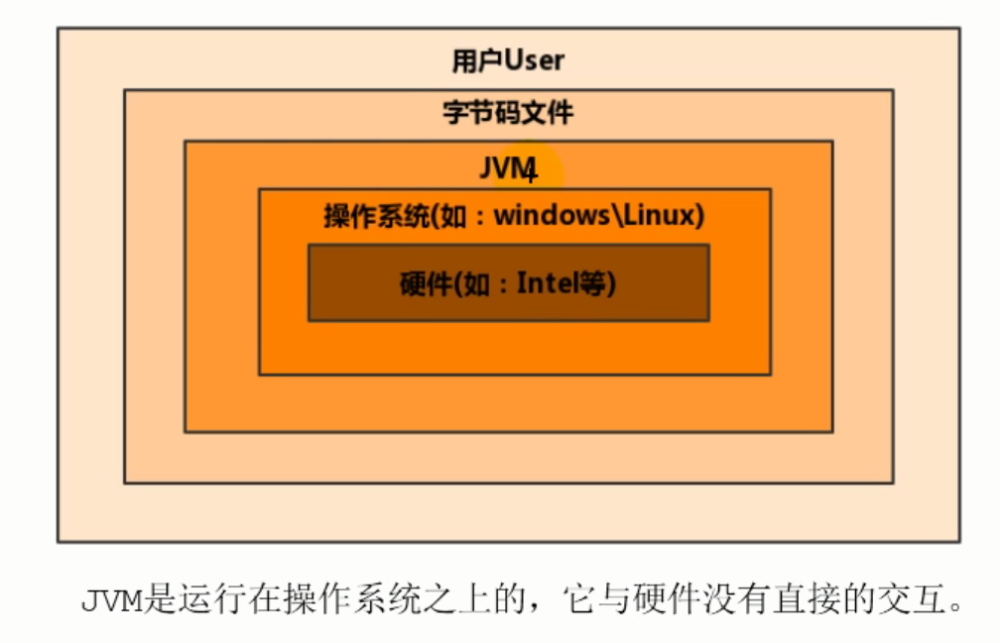

### JVM整体结构

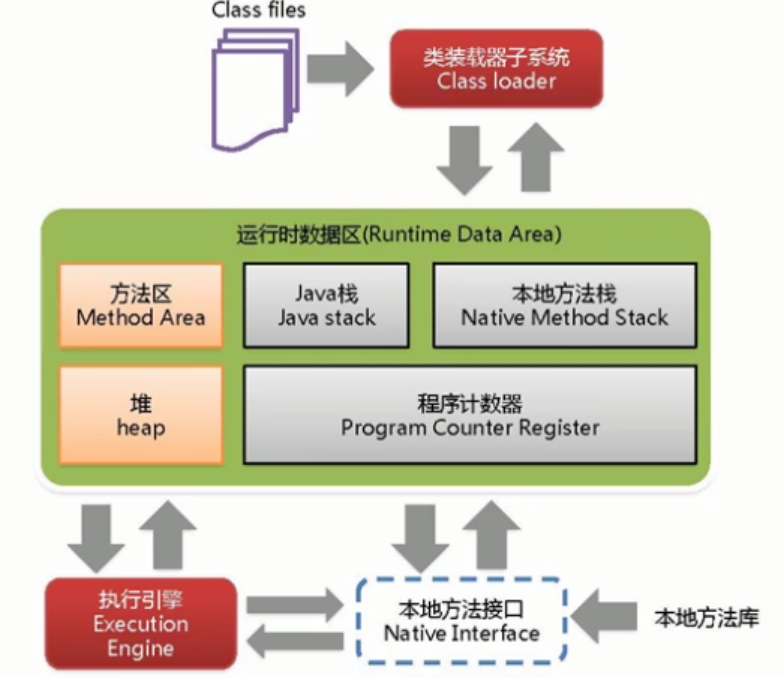

-   Java栈、本地方法栈、程序计数器中不会有垃圾
-   JVM调优基本上是在调方法区和堆

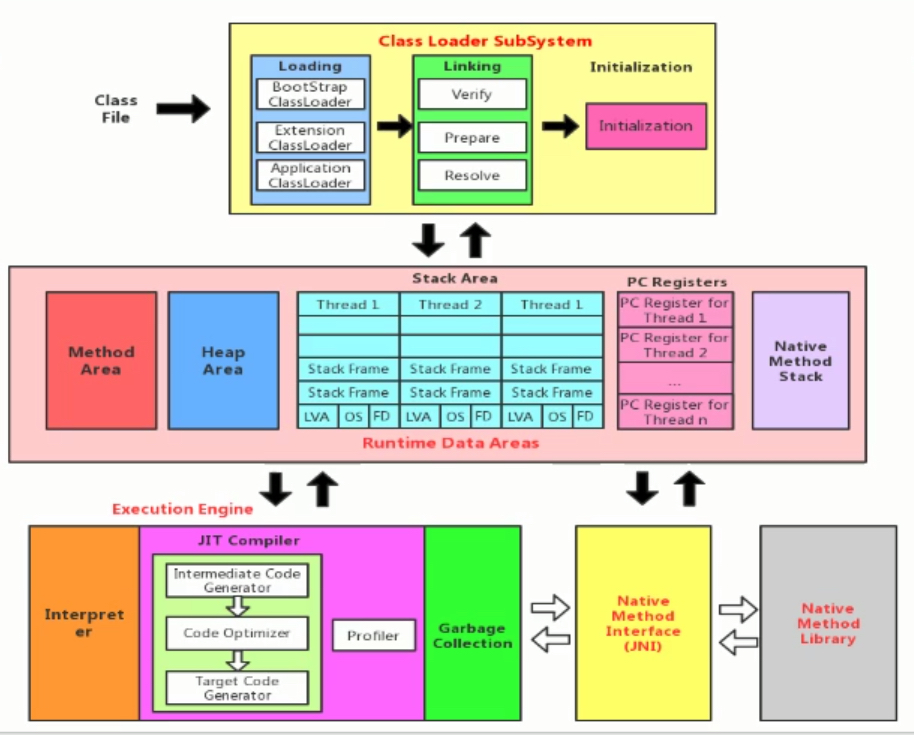

-   注意：
    1.  多线程共享方法区和堆
    2.  对于Java栈、本地方法栈和程序计数器，每个线程独有一份
    3.  执行引擎分为解释器、JIT即时编译器（后端编译器）和垃圾回收器

### Java代码执行流程

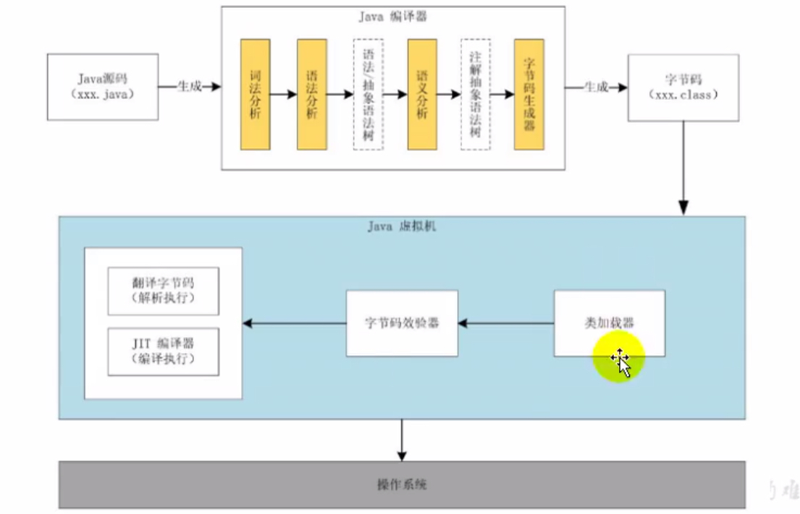

Java编译（前端编译）分为词法分析、语法分析、语义分析、字节码生成等步骤。

### JVM架构模型

Java编译器输出的指令流分为两种：基于栈的指令集架构和基于寄存器的指令集架构

-   基于栈的指令集架构
    -   设计和实现更简单，适用于资源受限的系统
    -   避开了寄存器的分配难题：使用零地址指令方式分配
    -   指令流中的指令大部分是零地址指令，其执行过程依赖于操作栈。指令集更小，编译器容易实现
    -   不需要硬件支持，可移植性更好，更好实现跨平台
-   基于寄存器的指令集架构
    -   典型的应用是x86的二进制指令集：比如传统的PC以及Android的Davlik虚拟机
    -   指令集架构完全依赖于硬件，可移植性差
    -   性能优秀，执行更高效
    -   花费更少的指令去完成一项操作
    -   在大部分情况下，基于寄存器架构的指令集往往都以一地址指令、二地址指令和三地址指令为主，而基于栈式架构的指令集却是以零地址指令为主

由于跨平台的特性，Java的指令都是根据栈来设计的。

### JVM的生命周期

-   虚拟机的启动

    Java虚拟机的启动是通过引导类加载器（bootstrap class loader）创建一个初始类来完成的，这个类是由虚拟机的具体实现指定的。

-   虚拟机的执行

    -   一个运行中的Java虚拟机有着一个清晰的任务：执行Java程序
    -   程序开始执行才运行，程序结束时就停止
    -   执行一个Java程序时，真正在执行的是Java虚拟机的进程

-   虚拟机的退出

    -   程序正常执行结束
    -   程序在执行过程中遇到了异常或错误而终止
    -   由于操作系统出现错误而导致Java虚拟机进程终止
    -   某线程调用Runtime类或System类的exit方法，或Runtime类的halt方法，并且Java安全管理器也允许这次exit或halt操作
    -   除此之外，JNI规范描述了用JNI Innovation API来加载或卸载Java虚拟机时，Java虚拟机的退出情况

## 类加载子系统

### 类加载器与类的加载过程

类是模板，对象是具体的

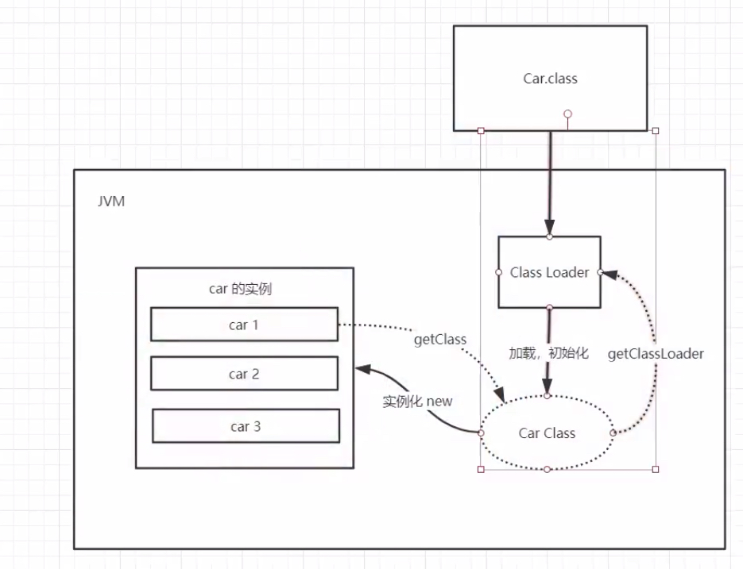


-   类加载子系统作用
    1.  负责从文件系统或网络中加载class文件，class文件在文件开头有特定的文件标识
    2.  ClassLoader只负责class文件的加载，至于它是否可以运行，则由执行引擎决定
    3.  加载的类信息存放于一块称为方法区的内存空间，除了类信息之外方法区还会存放运行时的常量池信息，可能还包括字符串字面量和数字常量（这部分常量信息是Class文件常量池部分的内存映射）
-   类加载器ClassLoader角色
    1.  class file存放于本地磁盘中，最终执行的时候要加载到JVM中来根据这个文件实例化出多个一模一样的实例
    2.  class file加载到JVM中，被称为DNA元数据模板，放在方法区
    3.  在class文件->JVM->最终称为元数据模板，此过程需要一个运输工具（类装载器ClassLoader）
-   类的加载过程

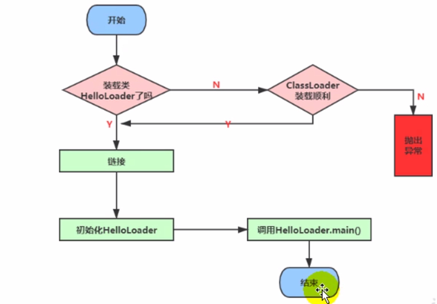

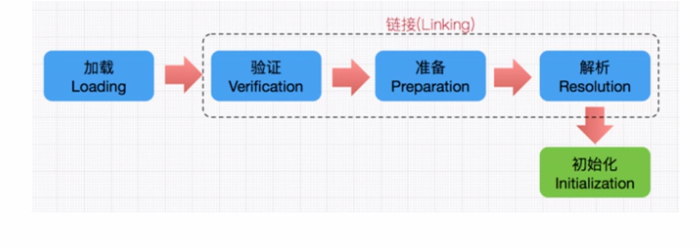

1.  Loading（加载）

	-   通过一个类的全限定名获取此类的二进制字节流

	-   将这个字节流所代表的静态存储结构转化为方法区的运行时数据结构

	-   在内存中生成一个代表这个类的java.lang.Class对象，作为方法区这个类的各种数据的访问入口

	-   注意：加载Class文件的方式：

    	1）从本地系统中直接加载

    	2）通过网络获取，典型场景：Web Applet

    	3）从zip压缩包中读取，成为日后jar、war文件的基础

    	4）运行时计算生成，使用最多的是动态代理技术

    	5）由其它文件生成，典型场景：JSP应用

        6）从专有数据库中提取Class文件

        7）从加密文件中获取

2.  Linking（链接）

	-   Verify（验证）
    	-   目的在于确保Class文件中的字节流包含信息符合当前虚拟机要求，保证被加载类的正确性，不会危害虚拟机自身安全
    	-   主要包括四种验证：文件格式验证、元数据验证、字节码验证、符号引用验证
	-   Prepare（准备）
    	-   为类变量分配内存并设置该类变量的默认初始值，即零值
    	-   **这里不包含用final修饰的static，因为final在编译的时候就会分配了，准备阶段会显式初始化**
    	-   **这里不会为实例变量分配初始化，类变量会分配在方法区中，而实例变量会随着对象一起分配在Java堆中**
	-   Resolve（解析）
        -   将常量池中的符号引用转换为直接引用的过程
        -   事实上，解析操作会随着JVM执行完初始化后再执行
        -   符号引用是一组符号来描述所引用的目标，直接引用就是直接指向目标的指针、相对偏移量或一个间接定位到目标的句柄
        -   解析动作主要针对类或接口、字段、类方法、接口方法、方法类型等，对应常量池中的`CONSTANT_CLASS_info`、`CONSTANT_Fieldref_info`、`CONSTANT_Methodref_info`等

3.  Initialization（初始化）

	-   **初始化阶段就是执行类构造器方法`<clinit>()`的过程**
	-   此方法不需定义，是javac编译器自动收集类中所有类变量的赋值动作和静态代码块中语句合并而来
	-   构造器方法中指令按语句在源文件中出现的顺序执行
	-   **`<clinit>()`不同于类的构造器（类构造器是虚拟机视角下的`<init>()`）**
	-   若该类具有父类，JVM会保证子类的`<clinit>()`执行前，父类的`<clinit>()`已经执行完毕
	-   虚拟机必须保证一个类的`<clinit>()`方法在多线程下被同步加锁

-   类加载器的分类

    1.  虚拟机自带的加载器
    2.  启动类（根）加载器
    3.  扩展类加载器
    4.  应用程序（系统）加载器

    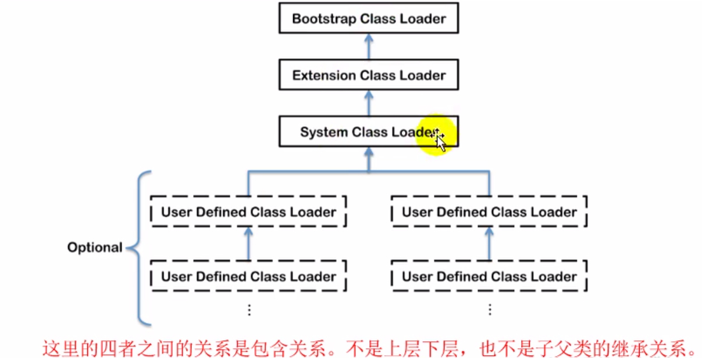

    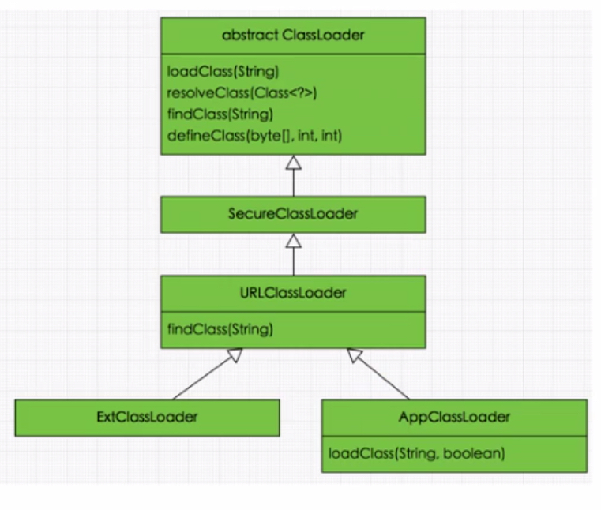

    ```java
    public static void main(String []args) throws Exception {
        ClassLoader systemClassLoader = ClassLoader.getSystemClassLoader();//系统类加载器
        System.out.println(systemClassLoader);//jdk.internal.loader.ClassLoaders$AppClassLoader@3d4eac69
        ClassLoader extClassLoader = systemClassLoader.getParent();//扩展类加载器
        System.out.println(extClassLoader);//jdk.internal.loader.ClassLoaders$ExtClassLoader@1be6f5c3
        ClassLoader bootstrapClassLoader = extClassLoader.getParent();//获取不到引导类加载器，不是Java写的
        System.out.println(bootstrapClassLoader);//null
    }
    ```

    注意：

    1.  对于用户自定义类而言，默认使用系统类加载器进行加载
    2.  Java的核心类库（lib文件夹下）都是使用引导类加载器进行加载的

### 双亲委派机制

为了保证安全

系统类加载器->扩展类加载器->根类加载器（最终执行）

1.  类加载器收到类加载的请求
2.  将这个请求向上委托给父类加载器去完成，一直向上委托，直到启动类加载器
3.  启动类加载器检查是否能够加载当前这个类，能加载就结束，使用当前的加载器，否则抛出异常，通知子加载器进行加载
4.  重复步骤3

### 沙箱安全机制

Java安全模型的核心就是Java沙箱，即一个限制程序运行的环境。沙箱机制就是将Java代码限定在JVM特定的运行范围内，并严格限制代码对本地资源的访问，来保证对代码的有效隔离，防止对本地系统造成破坏。沙箱主要限制系统资源访问，即CPU、内存、文件系统、网络。不同级别的沙箱对这些资源访问的限制也不一样。

所有的Java程序运行都可以指定沙箱，定制安全策略。

在Java中将执行程序分为本地代码和远程代码两种，本地代码默认是可信的，而远程代码则被看做是不可信的。对于授信的本地代码，可以访问一切本地资源；对于非授信的远程代码在早期的Java实现中，安全依赖于沙箱机制。JDK1.0安全模型：

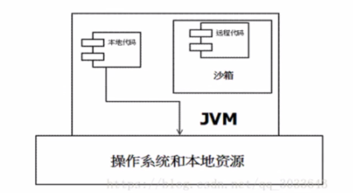

但如此严格的安全机制也给程序的功能扩展带来障碍，在后续的版本中，针对安全机制做了改进，增加了安全策略，允许用户指定代码对本地资源的访问权限。JDK1.1安全模型：

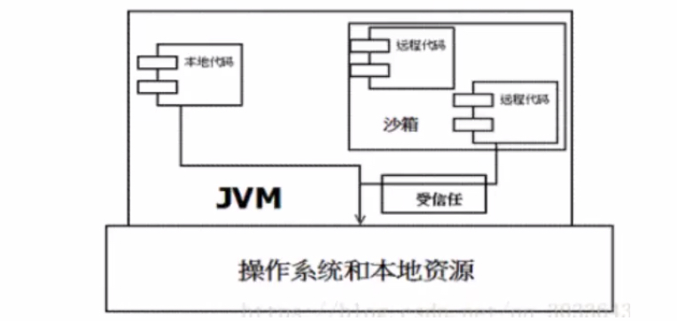

在Java1.2版本中，再次改进了安全机制，增加了代码签名。不论本地代码或是远程代码，都会按照用户的安全策略设定，由类加载器加载到虚拟机中权限不同的运行空间，来实现差异化的代码权限控制。

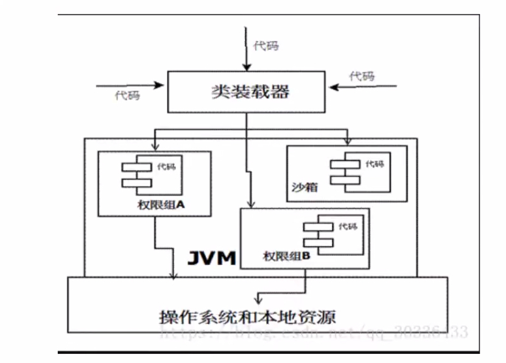

当前最新的安全机制实现，则引入了域的概念。虚拟机会把所有代码加载到不同的系统域和应用域，系统域部分专门负责与关键资源进行交互，而各个应用域部分则通过系统域的部分代理来对各种需要的资源进行访问。虚拟机中不同的受保护域对应不一样的权限。存在于不同域中的类文件就具有了当前域的全部权限。

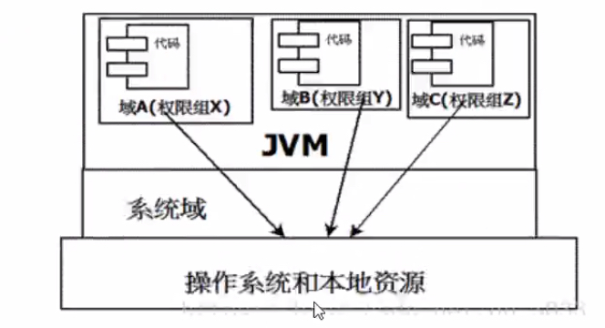

组成沙箱的基本组件：

-   字节码校验器(bytecode verifier)：确保Java类文件遵循Java语言规范，这样可以帮助Java程序实现内存保护，但并不是所有类文件都会经过字节码校验，比如核心类。

-   类加载器(class loader)：其中类加载器在3个方面对Java沙箱起作用

    -   防止恶意代码干涉善意代码
    -   守护被信任的类库边界
    -   将代码归入保护域，确定了代码可以进行哪些操作

    虚拟机为不同的类加载器载入的类提供了不同的命名空间，它由一系列唯一的名称组成，每一个被装载的类将有一个名字，这个命名空间是由Java虚拟机为每一个类装载器维护的，它们互相之间甚至不可见。

    类加载器采用的是双亲委派机制。

-   存取控制器(access controller)：控制核心API对操作系统的存取权限，而这个控制的策略可以由用户指定

-   安全管理器(security manager)：核心API和操作系统之间主要的接口，实现权限控制，比存取控制器优先级高

-   安全软件包(security package)：java.security下的类和扩展包下的类，运行用户为自己的应用增加新的安全特性，包括：

    -   安全提供者
    -   消息摘要
    -   数字签名
    -   加密
    -   鉴别

## Native、方法区

### Native关键字

-   凡是带了native关键字的，说明Java的作用范围达不到了，要去调用底层C/C++的库

-   带了native关键字的会进入本地方法栈，会调用本地方法接口（JNI），作用：为了扩展Java的使用，融合不同的编程语言为Java所用
-   Java内存区域中专门开辟了一块内存区域：本地方法栈，用于登记native方法，在最终执行的时候，加载本地方法库中的方法通过JNI
-   native方法一般用于驱动硬件、管理系统

### PC寄存器

程序计数器：Program Counter Register

每一个线程都有一个程序计数器，是线程私有的，就是一个指针，指向方法区的方法字节码（用来存储指向像一条指令的地址，也即将要执行的指令代码），在执行引擎读取下一条指令，是一个非常小的内存空间，几乎可以忽略不计

### 方法区

Method Area方法区

方法区是被所有线程共享的，所有字段和方法字节码，以及一些特殊方法，如构造函数、接口代码也在此定义，简单说，所有定义的方法的信息都保存在该区域，此区域属于共享区间。

**静态变量、常量、类信息（构造方法、接口定义）、运行时常量池存在方法区中，但实例变量存在堆内存中，与方法区无关。**