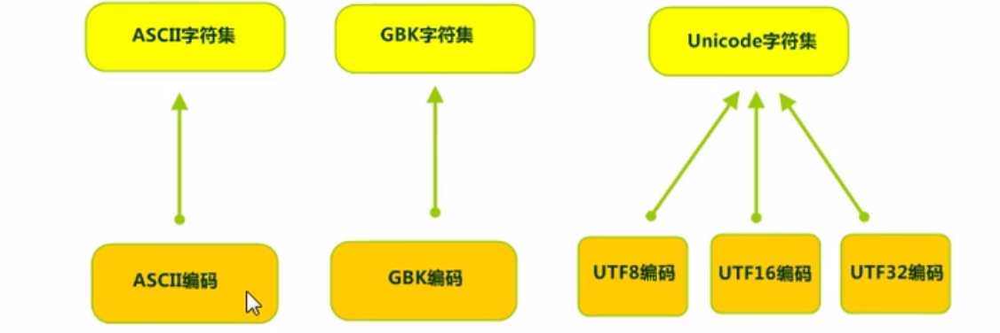

# Java IO流

## File类

java.io.File类是文件和目录路径名的抽象表示，主要用于文件和目录的创建、查找和删除等操作

File类与操作系统无关

### 静态成员变量

-   `static String pathSeparator`：与系统有关的路径分隔符字符串

-   `static char pathSeparatorChar`：与系统有关的路径分隔符

    路径分隔符：windows(;)，Linux(:)

-   `static String separator`：与系统有关的名称分隔符字符串

-   `static char separatorChar`：与系统有关的名称分隔符

    名称分隔符：windows(\\)，Linux(/)

注意：

-   绝对路径：完整的路径

-   相对路径：简化的路径（相对于当前项目的根目录）

### 构造方法

-   `File(String pathname)`：通过将给定路径名字符串转换为抽象路径名来创建一个新File实例

    字符串可以是文件也可以是文件夹

    路径可以是绝对路径或相对路径

    路径可以存在也可以不存在

-   `File(String parent, String child)`：根据parent路径名字符串和child路径名字符串创建一个新File实例

-   `File(File parent, String child)`：根据parent抽象路径名和child路径名字符串创建一个新File实例

### 常用方法

1.  获取功能的方法

    -   `public String getAbsolutePath()`：获取绝对路径

    -   `public String getPath()`：获取路径名（构造方法中传递的路径）

    -   `public String getName()`：获取文件或目录名（路径的结尾部分）

    -   `public Long length()`：获取文件长度

        不能获取文件夹的大小，返回0

        如果路径不存在，返回0

2.  判断功能的方法

    -   `public boolean exists()`：判断路径是否存在
    -   `public boolean isDirectory()`：判断路径是否为文件夹
    -   `public boolean isFile()`：判断路径是否为文件

3.  创建删除功能的方法

    -   `public boolean createNewFile()`：当文件不存在时，创建新文件（不能创建文件夹，文件路径必须存在）
    -   `public boolean delete()`：删除文件或目录（文件夹中有内容不会删除）
    -   `public boolean mkdir()`：创建目录（只能创建单级文件夹）
    -   `public boolean mkdirs()`：创建目录及不存在的父目录（单级或多级文件夹）

4.  目录的遍历

    -   `public String[] list()`：获取目录中所有的子文件或目录的字符串数组

    -   `public File[] listFiles()`：获取目录中所有的子文件或目录的File数组

        如果路径不存在或者不是一个目录，会抛出空指针异常

5.  文件的遍历

    -   `public File[] listFiles(FileFilter filter)`

        java.io.FileFilter接口：用于抽象路径名（File对象）的过滤器

        抽象方法：用于过滤文件的方法`boolean accept(File pathname)`，测试指定的抽象路径名是否包含在某个路径名列表中

    -   ` public File[] listFiles(FilenameFilter filter)`

        java.io.FilenameFilter接口：用于过滤文件名称

        抽象方法：用于过滤文件的方法`boolean accept(File dir, String name)`，测试指定文件是否包含在某个文件列表中

    注意：需要自己写实现类，重写accept方法

## IO流简介

|        | 输入流                      | 输出流                       |
| ------ | --------------------------- | ---------------------------- |
| 字节流 | 字节输入流<br />InputStream | 字节输出流<br />OutputStream |
| 字符流 | 字符输入流<br />Reader      | 字符输出流<br />Writer       |

## 字节流

### 字节输出流

java.io.OutputStream是一个抽象类，所有字节输出流的超类。

-   常用方法

    1.  `public void close()`：关闭输出流并释放系统资源
    2.  `public void flush()`：刷新输出流并强制任何缓冲的字节流被输出
    3.  `public void write(byte[] b)`：将字节数组写入输出流
    4.  `public void write(byte[] b, int off, int len)`：从指定的字节数组写入len字节，从偏移量off开始输出到输出流
    5.  `public abstract void write(int b)`：将指定的字节写入此输出流

-   文件字节输出流java.io.FileOutputStream继承了OutputStream，把内存中的数据写入到文件中

    构造方法：

    1.  `FileOutputStream(String name)`：创建一个向具有指定名称的文件中写入数据的文件输出流
    2.  `FileOutputStream(File file)`：创建一个向指定File对象表示的文件中写入数据的文件输出流

    使用步骤

    1.  创建一个FileOutputStream对象，构造方法中传递数据写入的目的地
    2.  调用write方法把数据写入到文件中
    3.  关闭流并释放资源
    
    追加写入：
    
     1.    `FileOutputStream(String name, boolean append)`
    
     2.    `FileOutputStream(File file, boolean append)`
    
           注意：append为true是追加模式，false是覆盖模式
    

### 字节输入流

​    java.io.InputStream是一个抽象类，所有字节输入流的超类。

-   常用方法

    1.  `int read()`：从输入流中读取数据的下一个字节
    2.  `int read(byte[] b)`：从输入流中读取一定数量的字节，并将其存在缓冲数组b中
    3.  `void close()`：关闭此输入流并释放与该流关联的所有系统资源

-   文件字节输入流java.io.FileInputStream继承了InputStream，把文件中的数据读入到内存中

    构造方法：

    1.  `FileInputStream(String name)`：创建一个从具有指定名称的文件中读数据的文件输入流
    2.  `FileInputStream(File file)`：创建一个从指定File对象表示的文件中读数据的文件输入流

    使用步骤：

    1.  创建一个FileInputStream对象，构造方法中传递读取的数据源
    2.  调用read方法读取文件
    3.  关闭流并释放资源

## 字符流

当使用字节流读取中文文件时，可能不会显示完整的字符，因为一个中文会占多个字节。

GBK：2字节

UTF-8：3字节

### 字符输入流

java.io.Reader是一个抽象类，是所有字符输入流的超类。

-   常用方法

    1.  `int read()`：读取单个字符
    2.  `int read(char[] cbuf)`：读取多个字符，存入字符数组
    3.  `void close()`：关闭此输入流并释放与该流关联的所有系统资源

-   java.io.FileReader继承了InputStreamReader继承了Reader，是文件字符输入流，将文件以字符方式读入内存

    构造方法：

    1.  `FileReader(String fileName)`：创建一个从具有指定名称的文件中读数据的文件字符输入流
    2.  `FileReader(File file)`：创建一个从指定File对象表示的文件中读数据的文件字符输入流

    使用步骤：

    1.  创建一个FileReader对象，构造方法中传递读取的数据源
    2.  调用read方法读取文件
    3.  关闭流并释放资源

### 字符输出流

java.io.Writer是一个抽象类，是所有字符输出流的超类。

-   常用方法

    1.  `void write(int c)`：写入单个字符
    2.  `void write(char[] cbuf)`：写入字符数组
    3.  `abstract void write(char[] buf, int off, int len)`：写入字符数组的一部分，写入len字节，从偏移量off开始写入
    4.  `void write(String str)`：写入字符串
    5.  `void write(String str, int off, int len)`：写入字符串的一部分，写入len字节，从偏移量off开始写入
    6.  `void flush()`：刷新该流的缓冲
    7.  `void close()`：关闭此流，但要先刷新

-   java.io.FileWriter继承了OutputStreamWriter继承了Writer，是文件字符输出流，将内存中字符数据写入文件

    构造方法：

    1.  `FileWriter(String fileName)`：创建一个向具有指定名称的文件中写数据的文件字符输出流
    2.  `FileWriter(File file)`：创建一个向指定File对象表示的文件中写数据的文件字符输出流

    使用步骤：

    1.  创建一个FileWriter对象，构造方法中传递数据写入的目的地
    2.  调用write方法把数据写入到内存缓冲区中（**字符转换成字节的过程**）
    3.  调用flush方法，把内存缓冲区中的数据刷新到文件中
    4.  释放资源（会先把内存缓冲区中的数据刷新到文件中）

    关闭（close）和刷新（flush）的区别：

    1.  flush：刷新缓冲区，流对象可以继续使用
    2.  close：先刷新缓冲区，再关闭资源，流对象不能继续使用

    追加写入：

     1.    `FileWriter(String fileName, boolean append)`

     2.    `FileWriter(File file, boolean append)`

           注意：append为true是追加模式，false是覆盖模式

    

## IO流异常处理

```java    
try{
    流操作
}
catch(IOException e){
    异常处理逻辑
}
finally{
    try
    {
        if(fw!=null)
    	fw.close();//关闭流对象
    }
    catch(IOException e){
        ......
    }
}
```

JDK1.7+后可以增加括号，定义变量，作用域在try中有效，try结束会自动释放资源，不用finally

```java
try(定义变量;定义变量;...){
    可能产生异常的代码
}
catch(IOException e){
    异常处理逻辑
}
```

JDK1.9+后try的前面可以定义变量，try后面括号可以直接引入变量名，try代码执行完毕后直接释放资源，不用finally

```java
A a=new A();
B b=new B();
try(a,b){
    可能产生异常的代码
}
catch(异常类型 变量名){
    异常处理逻辑
}
```

## 属性集

java.util.Properties类表示一个持久的属性集（继承了Hashtable），可以保存在流中或在流中加载，属性列表中的每个键及其值都是一个字符串，是唯一与IO流相结合的集合。

-   常用方法：

    1.  `store(OutputStream out, String comments)`,`store(Writer writer, String comments)`：将集合中的临时数据写入文件（注意：如果使用字节流不能写中文，第二个参数表示保存的文件是干什么用的，不能使用中文）

        （1）创建Property集合对象，添加数据

        （2）创建字节/字符输出流对象，构造方法中绑定要输出的目的地

        （3）使用store方法把集合中的临时数据存储到文件中

        （4）释放资源

    2.  `load(InputStream instream)`,`load(Reader reader)`：将文件中的数据读取到集合中（注意：如果使用字节流不能写中文）

        （1）创建Property集合对象

        （2）使用load方法读取文件中的数据

        （3）遍历Properties集合

        注意：

        （1）存储键值对的文件中，键与值默认的连接符可以是=，空格，（其他符号）

        （2）存储键值对的文件中，可以使用#进行注释，被注释的内容不会被读取

        （3）存储键值对的文件中，键与值默认都是字符串，不用再加引号

    注：Properties是一个双列集合，键和值默认是字符串

    3. `Object setProperty(String key, String value)`：将键值对存储到集合中，底层调用的是put
    4. `String getProperty(String key)`：通过键获取值，相当于get方法
    5. `Set<String> stringPropertyNames()`：返回此属性列表的键集，相当于keySet方法
    
 ## 缓冲流

缓冲流用于增强基本IO流

-   字节缓冲流：BufferedInputStream、BufferedOutputStream
-   字符缓冲流：BufferedReader、BufferedWriter

### 字节缓冲流

-   字节缓冲输出流BufferedOutputStream，继承了OutputStream

    构造方法：

    1.  `BufferedOutputStream(OutputStream out)`：创建一个新的字节缓冲输出流，以将数据写入指定的底层输出流
    2.  `BufferedOutputStream(OutputStream out, int size)`：创建一个新的字节缓冲输出流，以将具有指定缓冲区大小的数据写入指定的底层输出流

    使用步骤：

    1.  创建一个FileOutputStream对象，构造方法中绑定输出的目的地
    2.  创建BufferedOutputStream对象，构造方法中传递FileOutputStream对象
    3.  使用write方法将数据写入缓冲区
    4.  使用flush方法把缓冲区中的数据刷新到文件中
    5.  释放资源（会先调用flush）

-   字节缓冲输入流BufferedInputStream，继承了InputStream

    构造方法：

    1.  `BufferedInputStream(InputStream in)`：创建一个新的字节缓冲输入流
    2.  `BufferedInputStream(InputStream in, int size)`：创建一个新的具有指定缓冲区大小的字节缓冲输入流

    使用步骤：

    1.  创建一个FileInputStream对象，构造方法中绑定读取的数据源
    2.  创建BufferedInputStream对象，构造方法中传递FileInputStream对象
    3.  使用read方法读取文件
    4.  释放资源


### 字符缓冲流

-   字符缓冲输出流BufferedWriter，继承了Writer

    构造方法：

    1.  `BufferedWriter(Writer out)`：创建一个使用默认大小缓冲区的字符缓冲输出流
    2.  `BufferedWriter(Writer out, int size)`：创建一个使用给定大小缓冲区的字符缓冲输出流

    特有的成员方法：

    ​	`void newLine()`：写入一个行分隔符，会根据操作系统使用对应的行分隔符

    使用步骤：

    1.  创建一个FileWriter对象，构造方法中绑定输出的目的地
    2.  创建BufferedWriter对象，构造方法中传递FileWriter对象
    3.  使用write方法将数据写入缓冲区
    4.  使用flush方法把缓冲区中的数据刷新到文件中
    5.  释放资源（会先调用flush）

-   字符缓冲输入流BufferedReader，继承了Reader

    构造方法：

    1.  `BufferedReader(Reader in)`：创建一个使用默认大小缓冲区的字符缓冲输入流
    2.  `BufferedReader(Reader in, int size)`：创建一个使用给定大小缓冲区的字符缓冲输入流

    特有的成员方法：

    ​	`String readLine()`：读取一行数据，根据操作系统使用对应行的终止符号，返回包含该行内容的字符串，如果已经到达流末尾返回null

    使用步骤：

    1.  创建一个FileReader对象，构造方法中绑定读取的数据源
    2.  创建BufferedReader对象，构造方法中传递FileReader对象
    3.  使用read/readLine方法读取文件
    4.  释放资源

## 转换流

### 字符编码和字符集

1.  字符编码

-   编码：字符->字节
-   解码：字节->字符
-   字符编码：自然语言字符与二进制数之间的对应规则

2.  字符集（编码表）

    字符集：一个系统支持所有字符的集合

    一套字符集必然有一套字符编码

    

### 转换流

1.  OutputStreamWriter

    继承了Writer，编码

    构造方法：

    -   `OutputStreamWriter(OutputStream out)`：创建使用默认编码的OutputStreamWriter（UTF-8）
    -   `OutputStreamWriter(OutputStream out, String charsetName)`：创建使用指定编码的OutputStreamWriter（不区分大小写）

    使用步骤：

    -   创建OutputStreamWriter对象，构造方法中传递字节输出流和指定的编码表名称
    -   使用write方法将字符转换为字节存储到缓冲区中
    -   使用flush方法将缓冲区中的字节刷新到文件中
    -   释放资源

2.  InputStreamReader

    继承了Reader，解码

    构造方法：

    -   `InputStreamReader(InputStream in)`：创建使用默认编码的InputStreamReader（UTF-8）
    -   `InputStreamReader(InputStream in, String charsetName)`：创建使用指定编码的InputStreamReader（不区分大小写）

    使用步骤：

    -   创建InputStreamReader对象，构造方法中传递字节输入流和指定的编码表名称

    -   使用read方法读取文件

    -   释放资源

        注意：编码表名称要与实际文件的编码相同，否则会乱码

    

## 序列化

ObjectOutputStream：对象的序列化流（将对象以流的方式，写入到文件中保持）

ObjectInputStream：对象的反序列化流（将文件中存储的对象，以流的形式读取出来）

### 序列化流

ObjectOutputStream继承了OutputStream，是对象的序列化流

-   构造方法：

    `ObjectOutputStream(OutputStream out)`：创建写入指定字节输出流的序列化流

-   特有的成员方法：

    `void writeObject(Object obj)`：将指定的对象写入ObjectOutputStream

-   使用步骤：

    1.  创建ObjectOutputStream对象，构造方法中传递字节输出流
    2.  使用writeObject方法将对象写入到文件中
    3.  释放资源

-   注意：序列化与反序列化时可能抛出NotSerializableException异常，需要实现java.io.Serializable接口（标记型接口）以启用序列化功能

### 反序列化流

ObjectInputStream继承了InputStream，是对象的反序列化流

-   构造方法：

    `ObjectInputStream(InputStream in)`：创建写入指定字节输入流的反序列化流

-   特有的成员方法：

    `Object readObject()`：从ObjectInputStream中读取对象

-   使用步骤：

    1.  创建ObjectInputStream对象，构造方法中传递字节输入流
    2.  使用readObject方法读取保存对象的文件
    3.  释放资源
    4.  使用读取出来的对象

-   注意：

    1.  序列化与反序列化时可能抛出NotSerializableException异常，需要实现java.io.Serializable接口（标记型接口）以启用序列化功能
    2.  readObject方法可能抛出ClassNotFoundException，当不存在对象的class文件时抛出此异常
    3.  序列化之后如果对类进行了修改再反序列化会抛出InvalidClassException（序列号冲突），解决方案：类中定义`static final long serialVersionUID`字段

-   static关键字：静态关键字

    被static修饰的成员变量不能被序列化

    transient关键字：瞬态关键字

    被transient修饰的成员变量不能被序列化

## 打印流

java.io.PrintStream是打印流

-   特点：

    1.  只负责数据的输出，不负责数据的读取
    2.  永远不会抛出IOException
    3.  有特有方法：print、println，可以输出任何类型的值

-   构造方法：

    1.  `PrintStream(File file)`：输出目的地是一个文件
    2.  `PrintStream(OutputStream out)`：输出目的地是一个字节输出流
    3.  `PrintStream(String fileName)`：输出目的地是一个文件路径

-   注意：

    如果使用write方法写数据，查看数据的时候会查询编码表

    如果使用print、println方法写数据，数据原样输出

-   常用方法：

    `static void setOut(PrintStream out)`：可以改变打印流的流向，使用System.setOut方法改变输出语句目的地

