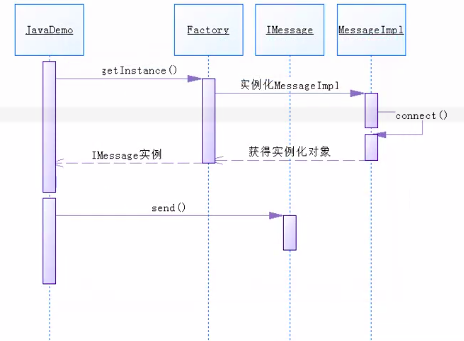

# 补充内容

## BIO&AIO&NIO

-   BIO：同步阻塞IO

    java.io包下的类

    InputStream

    OutputStream

    Reader

    Writer

    ServerSocket

    Socket

    read方法、accept方法阻塞

-   NIO：同步非阻塞

    java.nio包下的类

    Buffer

    ​	ByteBuffer

    ​	CharBuffer

    Channel

    ​	FileChannel

    ​	ServerSocketChannel

    ​	SocketChannel

    Selector

    read方法、accept方法可设置为非阻塞

-   AIO：异步非阻塞（只能用于网络编程中）

    java.nio.channels包下的类

    AsynchronousSocketChannel

    AsynchronousServerSocketChannel

    AsynchronousFileChannel

    AsynchronousDatagramChannel

### 使用NIO进行网络编程

-   服务端：

    ```java
    public class Server{
        public static void main(String[] args){
            try(ServerSocketChannel server=ServerSocketChannel.open()){
                server.bind(new InetSocketAddress(8888));
                server.configureBlocking(true);//默认阻塞
                //server.configureBlocking(false);//设置非阻塞
                SocketChannel client=server.accept();
                //后续代码
                //写数据
                ByteBuffer buf=ByteBuffer.allocate(100);
                buf.put("bbb".getBytes());
                buf.flip();//limit设置为position，position设置为0
                client.write(buf);
                //读数据
                ByteBuffer inb=ByteBuffer.allocate(100);
                client.read(inb);
                inb.flip();//limit设置为position，position设置为0
                String msg=new String(inb.array(),0,inb.limit());
                client.close();
            }
            catch(IOException e){
                //异常处理
            }
        }
    }
    ```

- 客户端：

   ```java
   public class Client{
       public static void main(String[] args){
           try(SocketChannel socket=SocketChannel.open()){
               socket.connect(new InetSocketAddress("localhost",8888));
               //后续代码
               //写数据
               ByteBuffer buf=ByteBuffer.allocate(100);
               buf.put("aaa".getBytes());
               buf.flip();//limit设置为position，position设置为0
               socket.write(buf);
               //读数据
               ByteBuffer inb=ByteBuffer.allocate(100);
               socket.read(inb);
                inb.flip();//limit设置为position，position设置为0
               String msg=new String(inb.array(),0,inb.limit());
               socket.close();
           }
           catch(IOException e){
               //异常处理
           }
       }
   }
   ```

### Selector选择器

   1.  多路复用

       服务器同时监听多个端口，每个端口都要监听多个客户端的连接

   2.  选择器Selector

       Selector可以注册到多个Channel上，监听各个Channel上发生的事件，并且能根据事件决定Channel读写。通过一个线程管理多个Channel，就可以处理大量网络连接。

       -   创建Selector

           ```java
           Selector selector=Selector.open();
           ```

       -   注册Channel到Selector

           ```java
           channel.configureBlocking(false);//必须设置成异步模式
           SelectionKey key=channel.register(selector,SelectionKey.OP_READ);
           ```

           register方法的第二个参数是一个int值，指通过Selector监听Channel时对什么事件感兴趣：

           （1）连接就绪：SelectionKey.OP_CONNECT

           （2）接受就绪：SelectionKey.OP_ACCEPT（ServerSocketChannel注册时只能使用此项）

           （3）读就绪：SelectionKey.OP_READ

           （4）写就绪：SelectionKey.OP_WRITE

   3. 多路连接

        -   Selector的key方法：返回一个Set集合，表示已注册通道的集合，每个已注册通道封装为一个SelectionKey对象
        -   Selector的selectedKeys方法：返回一个Set集合，表示已连接通道的集合，每个已注册通道封装为一个SelectionKey对象
        -   Selector的select方法：此方法会阻塞直到有至少一个客户端连接，返回一个int值表示有几个客户端连接了服务器

        客户端：

        ```java
        public class Client{
            public static void main(String[] args){
                new Thread(()->{
                    try(SocketChannel socket=SocketChannel.open()){
                        socket.connect(new InetSocketAddress("localhost",7777));
                        //后续代码
                        ByteBuffer buf=ByteBuffer.allocate(100);
                    	buf.put("aaa".getBytes());
                    	buf.flip();//limit设置为position，position设置为0
                    	socket.write(buf);
                    }
                    catch(IOException e){
                        //异常处理
                    }
                }
                ).start();
                
                 new Thread(()->{
                    try(SocketChannel socket=SocketChannel.open()){
                        socket.connect(new InetSocketAddress("localhost",8888));
                        //后续代码
                        ByteBuffer buf=ByteBuffer.allocate(100);
                    	buf.put("bbb".getBytes());
                    	buf.flip();//limit设置为position，position设置为0
                    	socket.write(buf);
                    }
            catch(IOException e){
                        //异常处理
            }
                }
                ).start();
            }
        }
        ```
        
        服务端：
        
        ```java
        public class Server{
            public static void main(String[] args) throws Exception{
                //创建3个通道，同时监听3个端口
                ServerSocketChannel channelA=ServerSocketChannel.open();
                channelA.configureBlocking(false);
                channelA.bind(new InetSocketAddress(7777));
                
                ServerSocketChannel channelB=ServerSocketChannel.open();
                channelB.configureBlocking(false);
                channelB.bind(new InetSocketAddress(8888));
                
                ServerSocketChannel channelC=ServerSocketChannel.open();
                channelC.configureBlocking(false);
                channelC.bind(new InetSocketAddress(9999));
                
                //获取选择器
        Selector selector=Selector.open();
                //注册三个通道
                channelA.register(selector,SelectionKey.OP_ACCEPT);
                channelB.register(selector,SelectionKey.OP_ACCEPT);
                channelC.register(selector,SelectionKey.OP_ACCEPT);
                
                while(true){
                            int selectedCount=selector.select();//此方法会阻塞
               				Set<SelectionKey> keys=selector.keys();//已注册通道的集合
                			Set<SelectionKey> selectionKeys=selector.selectedKeys();//已连接通道的集合
                    		//遍历已连接通道的集合
                    		Iterator<SelectionKey> it=selectionKeys.iterator();
                    		while(it.hasNext()){
                                //获取当前连接通道的selctionkey
                                SelectionKey key=it.next();
                                //获取通道对象
                                ServerSocketChannel channel=(ServerSocketChannel) key.channel();
                                //查看监听的端口
                                String addr=channel.getLocalAddress();
                                SocketChannel client=channel.accept();//处理accept（非阻塞）
                                
                   				//读数据
                    			ByteBuffer inb=ByteBuffer.allocate(100);
                    			client.read(inb);
                   				inb.flip();//limit设置为position，position设置为0
                    			String msg=new String(inb.array(),0,inb.limit());
                                
                    			it.remove();
                            }
                    		Thread.sleep(1000);
                    
                    		
                }
        
                
            }
        }
        ```
        

### 使用AIO进行网络编程

AIO：异步IO

服务端：

```java
public class Server{
    public static void main(String[] args) throws Exception{
        AsynchronousServerSocketChannel serverSocketChannel=
            AsynchronousServerSocketChannel.open().bind(new InetSocketAddress(8888));
        //非阻塞accept
        serverSocketChannel.accept(null, new CompletionHandler<AsynchronousServerSocketChannel, Void>(){
            //有客户端连接成功的回调函数
            @Override
            public void completed(AsynchronousServerSocketChannel result, Void attachment){
                System.out.println("connection received");
                /*
                ByteBuffer b=ByteBuffer.allocate(20);
                Future<Integer> readFuture=result.read(b);//同步读
                try{
                    String str=new String(b.array(),0,readFuture.get());
                	result.close();
                }
                catch(Exception e){
                    //异常处理
                }
                */
                serverSocketChannel.accept(null,this);
                ByteBuffer b=ByteBuffer.allocate(Integer.MAX_VALUE/300);
                result.read(b,10,TimeUnit.SECONDS,null,new CompletionHandler<Integer,Void>(){
                    @Override
                    public void completed(Integer r, Void attachment){
                        if(result==-1)
                            System.out.println("no data transmitted");
                        String str=new String(b.array(),0,r);
                        try{
                    		result.close();
                		}
                		catch(Exception e){
                   		//异常处理
                		}
                    }
                    @Override
                    public void failed(Throwable exc, Void attachment){
                        System.out.println("write failed");
                    }
                });
            }
            //IO操作失败的回调函数
            @Override
            public void failed(Throwable exec, Void attachment){
                System.out.println("IO Failed");
            }
        });
		//后续代码
        
    }
}
```

客户端：

```java
public class Client{
    public static void main(String[] args){
      	AsynchronousSocketChannel socketChannel=AsynchronousSocketChannel.open();
        //非阻塞connect
        socketChannel.connect(new InetSocketAddress("localhost",8888), null, new CompletionHandler<Void, Void>(){
            //连接成功的回调函数
            @Override
            public void completed(Void result, Void attachment){
                try{
                    Thread.sleep(1000);
                }
                catch(Exception e){
                    //处理异常
                }
                System.out.println("connection success");
                /*
                Future<Integer> writeFuture=socketChannel.write(ByteBuffer.wrap("xxx").getBytes());//同步写
                try{
                    int s=writeFuture.get();
                    socketChannel.close();
                }
                catch(Exception e){
                    //异常处理
                }
                */
                socketChannel.write(ByteBuffer.wrap("xxx").getBytes(),null,new CompletionHandler<Integer,Void>(){
                    @Override
                    public void completed(Integer r, Void attachment){
                        System.out.println("write succeeded");
                    }
                    @Override
                    public void failed(Throwable exc, Void attachment){
                        System.out.println("write failed");
                    }
                });
                try{
                    socketChannel.close();
                }
                catch(Exception e){
                    //异常处理
                }
            }
            //连接失败的回调函数
            @Override
            public void failed(Throwable exec, Void attachment){
                System.out.println("Client Failed");
            }
        });
        //后续代码
    }
}
```

## 动态代理

### 静态代理

让代理类替被代理类完成一些非业务代码，核心业务代码交给代理者自己完成

代理模式：

1.  主题接口

2.  被代理类

3.  代理类

    （1）和被代理类必须实现同样的主题接口

    （2）因为要把核心业务代码交还给代理者自己完成，因此需要在代理类中保存（持有）被代理者对象的引用

```java
//1.主题接口
interface UserDao{
    void insert();
    void delete();
    void update();
    void select();
}
//2.被代理类
class UserDaoImpl implements UserDao{
    @Override
    public void insert(){
        System.out.println("add user");
    }
    @Override
    public void delete(){
        System.out.println("del user");
    }
    @Override
    public void update(){
        System.out.println("modify user");
    }
    @Override
    public void select(){
        System.out.println("search user");
    }
}
//3.代理类
class UserDaoProxy implements UserDao{
    private UserDao target;
    public UserDaoProxy(UserDao target){
        super();
        this.target=target;
    }
    @Override
    public void insert(){
        long start=System.currentTimeMillis();
        //开始执行
        target.insert();
        long end=System.currentTimeMillis();
        //结束执行
        System.out.println("耗时："+(end-start));
    }
    @Override
    public void delete(){
        long start=System.currentTimeMillis();
        //开始执行
        target.delete();
        long end=System.currentTimeMillis();
        //结束执行
        System.out.println("耗时："+(end-start));
    }
    @Override
    public void update(){
        long start=System.currentTimeMillis();
        //开始执行
        target.update();
        long end=System.currentTimeMillis();
        //结束执行
        System.out.println("耗时："+(end-start));
    }
    @Override
    public void select(){
        long start=System.currentTimeMillis();
        //开始执行
        target.select();
        long end=System.currentTimeMillis();
        //结束执行
        System.out.println("耗时："+(end-start));
    }
}
public class Main{
    public static void main(String[] args){
        UserDao ud=new UserDaoProxy(new UserDaoImpl());
        ud.insert();
        ud.delete();
    }
}
```

### 动态代理

1.  不直接写代理类，而且写“代理工作处理器”的类（这个代理类要替代理者完成什么事，必须实现InvocationHandler）
2.  动态生成代理类及其对象（使用java.lang.reflect.Proxy）

```java
//1.主题接口
interface UserDao{
    void insert();
    void delete();
    void update();
    void select();
}
//2.被代理类
class UserDaoImpl implements UserDao{
    @Override
    public void insert(){
        System.out.println("add user");
    }
    @Override
    public void delete(){
        System.out.println("del user");
    }
    @Override
    public void update(){
        System.out.println("modify user");
    }
    @Override
    public void select(){
        System.out.println("search user");
    }
}
//3.代理工作处理器
class Handler implements InvocationHandler{
    private Object target;
    @Override
    public Object invoke(Object proxy, Method method, Object[] args) throws Throwable {
        long start=System.currentTimeMillis();
        System.out.println("begin :"+method.getName());
        //开始执行
        Object ret=method.invoke(target,args);
        long end=System.currentTimeMillis();
        //结束执行
        System.out.println("end :"+method.getName());
        System.out.println("耗时："+(end-start));
        return ret;
    }
}
public class Main {

    public static void main(String []args) throws Exception {
        //动态创建代理类及其对象
        UserDaoImpl u=new UserDaoImpl();
        ClassLoader loader=u.getClass().getClassLoader();
        Class<?>[] interfaces = u.getClass().getInterfaces();
        Handler h=new Handler(u);

        UserDao ud= (UserDao) Proxy.newProxyInstance(loader,interfaces,h);
        ud.insert();
        ud.delete();
    }

}
```

注意：

1.  invoke方法

    （1）invoke方法不是由程序员手动调用的，会被编译器自动生成到代理类的对应方法中（当调用代理类中的方法时，自动执行这个方法的代码）

    （2）proxy 代理类对象；method 代理类要执行的真正方法；args 给method方法的实参列表

    （3）需要编写代理类要替被代理者完成的工作，返回值就是method方法的返回值

2.  Proxy类

    newProxyInstance方法参数：loader 被代理者的类加载器；interfaces 被代理者实现的接口们；h 代理工作处理器对象

## UML

UML是统一建模语言，利用图形化的形式来实现程序类关系的描述。

### 类图

一般用三层结构来表示

|     类名称（普通类直接编写，抽象类用斜体再加{abstract}）     |
| :----------------------------------------------------------: |
| 属性（格式“访问权限 属性名称：属性类型”，public（+）、protected（#）、private（-）） |
|       方法（格式“访问权限 方法名称（）：返回值类型”）        |

### 时序图

描述的是代码的执行流程




### 用例图

描述的是程序的执行分配


一般出现在项目的设计过程中