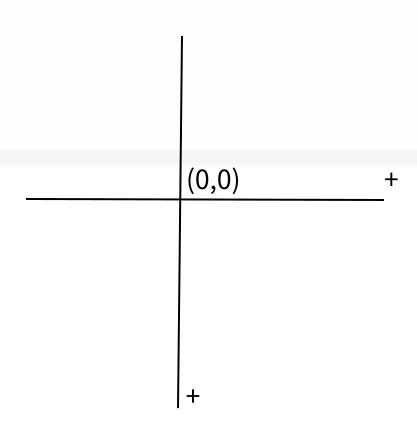
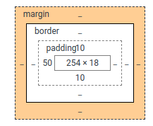

# CSS

## 初识CSS

Cascading Style Sheet 层叠级联样式表

CSS：表现（美化网页）

-   CSS发展史
    1.  CSS1.0
    2.  CSS2.0：DIV+CSS，提出了HTML与CSS结构分离的思想，网页变得很简单
    3.  CSS2.1：浮动，定位
    4.  CSS3.0：圆角边框，阴影，动画......浏览器兼容性

## 快速入门

语法：

```css
<!--
    style中可以编写css代码
    语法：
        选择器{
            声明1；
            声明2；
            声明3；
            ...
        }
-->
```

如：

```css
<style>
        h1{
            color: red;
        }
</style>
```

css定义在外部文件中：

```html
<link rel="stylesheet" href="css/style.css">
```

-   css的优势：
    1.  内容和表现分离
    2.  网页结构表现统一，可以实现复用
    3.  样式十分丰富
    4.  建议使用独立于html的css文件
    5.  利于SEO，容易被搜索引擎收录

## CSS导入方式

-   行内样式--style属性

    ```html
    <h2 style="color: red">标题</h2>
    ```

-   内部样式

    ```html
    <style>
            h1{
                color: red;
            }
    </style>
    ```

-   外部样式

    1.  链接式：html标签

    ```html
    <link rel="stylesheet" href="css/style.css">
    ```

    2.  导入式：css2.1

    ```html
    <style>
            @import "css/style.css";
    </style>
    ```

优先级：就近原则

## 选择器

作用：选择页面上的某一个或某一类元素

### 基本选择器

1.  标签选择器
2.  类选择器
3.  id选择器

```css
		/*标签选择器，会选择页面上所有的这个标签的元素 */
        h1{
            color: #3eac7c;
        }
        /*类选择器：.类名，可以复用*/
        .abc{
            color: aqua;
        }
        /*id选择器：#id，必须保证id全局唯一*/
        #def{
            color: blueviolet;
        }
```

注意：优先级不遵循就近原则，id选择器>class选择器>标签选择器

### 层次选择器

1.  后代选择器：在某个元素的后面
2.  子选择器：选中元素的向下一代
3.  相邻兄弟选择器：同辈，当前选中元素的一个相邻的向下兄弟元素
4.  通用选择器：当前选中元素的向下所有兄弟元素

```css
		/*后代选择器*/
        body p{
            background: red;
        }
        /*子选择器*/
        body>p{
            background: blue;
        }
        /*相邻兄弟选择器*/
        .active+p{
            background: aquamarine;
        }
        /*通用选择器*/
        .active~p{
            background: burlywood;
        }
```

### 结构伪类选择器

伪类：条件

```css
		/*ul第一个子元素*/
        ul li:first-child{
            background: burlywood;
        }
        /*ul最后一个子元素*/
        ul li:last-child{
            background: aquamarine;
        }
        /*选中p元素的父级元素的第1个子元素，并且是p元素才生效，按顺序*/
        p:nth-child(1){
            background: blueviolet;
        }
        /*选中p元素的父级下的子元素中的第2个p元素，按类型*/
        p:nth-of-type(2){
            background: yellowgreen;
        }
```

### 属性选择器

```css
		/*存在id属性的元素*/
        a[id]{
            background: yellow;
        }
        /*指定属性值（可以用正则）
        = 绝对等于
        *= 包含这个元素
        ^= 以这个开头
        $= 以这个结尾
        */
        a[id=first]{
            background: yellow;
        }
        a[class*="links"]{
            background: yellow;
        }
        a[href^="http"]{
            background: yellow;
        }
        a[href$="pdf"]{
            background: yellow;
        }
```

## 美化网页元素

span标签：重点要突出的字使用span标签套起来

### 字体样式

```css
body{
            font-family: "Times New Roman";/*字体*/
            font-size: 50px;/*字号*/
            font-weight: 500;/*字体粗细*/
            color: aqua;/*字体颜色*/
        }
```

可以合起来写：

```css
body{
            font: oblique bolder 16px "Times New Roman";
        }
```

### 文本样式

```css
/*
            行高和块高度一致就可以上下居中
*/
        body{
            color: rgba(22, 187, 154, 0.95);/*文本颜色*/
            text-align: center;/*文本排版*/
            text-indent: 2em;/*首行缩进*/
            line-height: 100px;/*行高*/
            text-decoration: underline;/*下划线*/
            text-decoration: line-through;/*中划线*/
            text-decoration: overline;/*上划线*/
            text-decoration: none;/*超链接去下划线*/
        }
```

### 超链接伪类

```css
		/*默认的状态*/
        a{
            text-decoration: none;
            color: black;
        }
        /*鼠标悬浮的状态*/
        a:hover{
            color: orange;
        }
        /*鼠标按住未释放的状态*/
        a:active{
            color: green;
        }
        /*点完之后的状态*/
        a:visited{
            color: burlywood;
        }
```

### 阴影

```css
		/*文本阴影：阴影颜色 水平偏移 垂直偏移 阴影半径*/
        #price{
            text-shadow: #66c4ff 10px 10px 10px;
        }
```



### 列表样式

```css
/*list-style:
    none去掉圆点
    circle空心圆点
    decimal数字
    square正方形*/
ul li{
    height: 30px;
    list-style: none;
    text-indent: 1em;
}
```


### 背景

```css
div{
    width: 1000px;
    height: 700px;
    border: 1px solid red;
    background-image: url("#");
    /*默认是全部平铺的repeat*/
}
.div1{
    background-repeat: repeat-x;/*水平平铺*/
    background-repeat: repeat-y;/*垂直平铺*/
    background-repeat: no-repeat;/*不平铺*/
}
```

`background: red url("#") 270px 10px no-repeat;/*背景颜色 背景图片 水平偏移 垂直偏移 平铺设置*/`

### 渐变

>   https://www.grabient.com/

```css
background-color: #4158D0;
background-image: linear-gradient(302deg, #4158D0 0%, #C850C0 46%, #FFCC70 100%);
```

## 盒子模型

### 盒子



-   margin：外边距
-   padding：内边距
-   border：边框

### 边框

-   粗细
-   样式
-   颜色

```css
		div:nth-of-type(1) input{
            border: 3px solid black;
        }
        div:nth-of-type(2) input{
            border: 3px dashed #4f30ff;
        }
        div:nth-of-type(2) input{
            border: 2px dashed #ffbe21;
        }
```

### 外边距

```css
margin: 0 auto 0 auto;
```

margin四个参数：上右下左，顺时针旋转

### 内边距

```css
div:nth-of-type(1){
            padding: 10px;
        }
```

注意：盒子的计算方式

margin+border+padding+内容的宽度

### 圆角边框与阴影

-   圆角边框

```css
div{
            width: 100px;
            height: 100px;
            border: 10px solid red;
            border-radius: 50px 20px 10px 5px;
            /*左上 右上 右下 左下, 顺时针
            圆圈：圆角=宽度/2
            */
 }
```

-   盒子阴影

```css
div{
            width: 100px;
            height: 100px;
            border: 10px solid red;
            box-shadow: 10px 10px 100px yellow;
            /*x轴坐标 y轴坐标 模糊半径 颜色*/
}
```

## 浮动

### 标准文档流

块级元素：独占一行

`h1-h6 p div 列表`

行内元素：不独占一行

`span a img strong`

**行内元素可以被包含在块级元素中，反之则不可以**

### display

```css
/*
        block块元素
        inline行内元素
        inline-block块元素，但可以内联
        none消失
 */
        div{
            width: 100px;
            height: 100px;
            border: 1px solid red;
            display: inline;
        }
        span{
            width: 100px;
            height: 100px;
            border: 1px solid red;
            display: inline;
        }
```

### float

-   左右浮动


```css
.news img {
  float: left;
  }

.news p {
  float: right;
  }
```

-   父级边框塌陷

clear：right，右侧不允许有浮动元素

clear：left，左侧不允许有浮动元素

clear：both，两侧都不允许有浮动元素

clear：none


解决方案：

1.  增加父级元素的高度

    ```css
    #father{
        border:1px #000 solid;
        height:800px;
    }
    ```

2.  增加一个空的div标签，清除浮动

    ```html
    <style>
        .clear{
            clear:both;
            margin:0;
            padding:0;
        }
    </style>
    <div class="clear"></div>
    ```

3.  overflow

    overflow: hidden 超出范围自动隐藏

    overflow: scroll 超出范围有滚动条

    在父级元素中增加overflow属性

    ```css
    #father{
        border:1px #000 solid;
        overflow: hidden
    }
    ```

4.  父类添加一个伪类`:after`

    ```css
    #father:after{
        content:'';
        display:block;
        clear:both;
    }
    ```

-   display与float
    1.  display方向不可控制，float方向可以控制
    2.  float有可能会脱离标准文档流，需要处理父级边框塌陷问题

## 定位

### 相对定位

```css
#first{
            background-color: #a13d30;
            border: 1px dashed #b27530;
            position: relative;/*相对定位，上下左右*/
            top: -20px;
            left: 20px;
 }
```

相对于原来的位置进行指定的偏移

top、left、buttom、right

相对定位后，元素仍然在标准文档流中，原来的位置会被保留

### 绝对定位

```css
#second{
            background-color: #255099;
            border: 1px dashed #255066;
            position: absolute;
            right: 20px;
    		top: -10px
}
```

1.  没有父级元素定位的前提下，相对于浏览器定位
2.  假设父级元素存在定位，则相对于父级元素进行偏移

绝对定位后，元素不在标准文档流中，原来的位置不会被保留

### 固定定位

```css
div:nth-of-type(1){
            width: 100px;
            height: 100px;
            background: red;
            position: absolute;
            right: 0;
            bottom: 0;
 }
```

元素定位在某个固定位置，不随滚动条滚动

### z-index

图层的概念

```css
		.tipText{
            color: white;
            z-index: 999;
        }
        .tipBg{
            background: black;
            opacity: 0.5;/*背景透明度*/
        }
```

## 动画

>   https://www.runoob.com/css3/css3-tutorial.html

CSS3 可以创建动画，它可以取代许多网页动画图像、Flash 动画和 JavaScript 实现的效果。

### CSS3 @keyframes 规则

要创建 CSS3 动画，你需要了解 @keyframes 规则。

@keyframes 规则是创建动画。

@keyframes 规则内指定一个 CSS 样式和动画将逐步从目前的样式更改为新的样式。

### 浏览器支持

表格中的数字表示支持该属性的第一个浏览器版本号。

紧跟在 -webkit-, -ms- 或 -moz- 前的数字为支持该前缀属性的第一个浏览器版本号。

| 属性       |  |  |  |  |  |
| :--------- | ------------------------------------------------------------ | ------------------------------------------------------------ | ------------------------------------------------------------ | ------------------------------------------------------------ | ------------------------------------------------------------ |
| @keyframes | 43.0 4.0 -webkit-                                            | 10.0                                                         | 16.0 5.0 -moz-                                               | 9.0 4.0 -webkit-                                             | 30.0 15.0 -webkit- 12.0 -o-                                  |
| animation  | 43.0 4.0 -webkit-                                            | 10.0                                                         | 16.0 5.0 -moz-                                               | 9.0 4.0 -webkit-                                             | 30.0 15.0 -webkit- 12.0 -o-                                  |

### 实例

```css
@keyframes myfirst
{
    from {background: red;}
    to {background: yellow;}
}
 
@-webkit-keyframes myfirst /* Safari 与 Chrome */
{
    from {background: red;}
    to {background: yellow;}
}
```

### CSS3 动画

当在 **@keyframes** 创建动画，把它绑定到一个选择器，否则动画不会有任何效果。

指定至少这两个CSS3的动画属性绑定向一个选择器：

-   规定动画的名称
-   规定动画的时长

-   实例

把 "myfirst" 动画捆绑到 div 元素，时长：5 秒：

```css
div
{
    animation: myfirst 5s;
    -webkit-animation: myfirst 5s; /* Safari 与 Chrome */
}
```

动画是使元素从一种样式逐渐变化为另一种样式的效果。

您可以改变任意多的样式任意多的次数。

请用百分比来规定变化发生的时间，或用关键词 "from" 和 "to"，等同于 0% 和 100%。

0% 是动画的开始，100% 是动画的完成。

为了得到最佳的浏览器支持，您应该始终定义 0% 和 100% 选择器。

-   实例

当动画为 25% 及 50% 时改变背景色，然后当动画 100% 完成时再次改变：

```css
@keyframes myfirst
{
    0%   {background: red;}
    25%  {background: yellow;}
    50%  {background: blue;}
    100% {background: green;}
}
 
@-webkit-keyframes myfirst /* Safari 与 Chrome */
{
    0%   {background: red;}
    25%  {background: yellow;}
    50%  {background: blue;}
    100% {background: green;}
}
```

-   实例

改变背景色和位置：

```css
@keyframes myfirst
{
    0%   {background: red; left:0px; top:0px;}
    25%  {background: yellow; left:200px; top:0px;}
    50%  {background: blue; left:200px; top:200px;}
    75%  {background: green; left:0px; top:200px;}
    100% {background: red; left:0px; top:0px;}
}
 
@-webkit-keyframes myfirst /* Safari 与 Chrome */
{
    0%   {background: red; left:0px; top:0px;}
    25%  {background: yellow; left:200px; top:0px;}
    50%  {background: blue; left:200px; top:200px;}
    75%  {background: green; left:0px; top:200px;}
    100% {background: red; left:0px; top:0px;}
}
```

### CSS3的动画属性

下面的表格列出了 @keyframes 规则和所有动画属性：

| 属性                      | 描述                                                         | CSS  |
| :------------------------ | :----------------------------------------------------------- | :--- |
| @keyframes                | 规定动画。                                                   | 3    |
| animation                 | 所有动画属性的简写属性。                                     | 3    |
| animation-name            | 规定 @keyframes 动画的名称。                                 | 3    |
| animation-duration        | 规定动画完成一个周期所花费的秒或毫秒。默认是 0。             | 3    |
| animation-timing-function | 规定动画的速度曲线。默认是 "ease"。                          | 3    |
| animation-fill-mode       | 规定当动画不播放时（当动画完成时，或当动画有一个延迟未开始播放时），要应用到元素的样式。 | 3    |
| animation-delay           | 规定动画何时开始。默认是 0。                                 | 3    |
| animation-iteration-count | 规定动画被播放的次数。默认是 1。                             | 3    |
| animation-direction       | 规定动画是否在下一周期逆向地播放。默认是 "normal"。          | 3    |
| animation-play-state      | 规定动画是否正在运行或暂停。默认是 "running"。               | 3    |

-   实例

运行myfirst动画，设置所有的属性：

```css
div
{
    animation-name: myfirst;
    animation-duration: 5s;
    animation-timing-function: linear;
    animation-delay: 2s;
    animation-iteration-count: infinite;
    animation-direction: alternate;
    animation-play-state: running;
    /* Safari 与 Chrome: */
    -webkit-animation-name: myfirst;
    -webkit-animation-duration: 5s;
    -webkit-animation-timing-function: linear;
    -webkit-animation-delay: 2s;
    -webkit-animation-iteration-count: infinite;
    -webkit-animation-direction: alternate;
    -webkit-animation-play-state: running;
}
```

-   实例

与上面的动画相同，但是使用了简写的动画 animation 属性：

```css
div
{
    animation: myfirst 5s linear 2s infinite alternate;
    /* Safari 与 Chrome: */
    -webkit-animation: myfirst 5s linear 2s infinite alternate;
}

```

