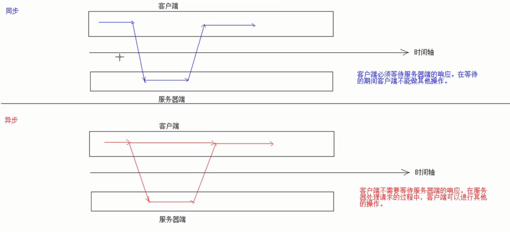

# Ajax

## Ajax入门

Asynchronized JavaScript and XML



>   https://baike.baidu.com/item/AJAX/8425

Ajax无需重新加载整个网页的情况下，能够更新部分网页。

通过在后台与服务器进行少量数据交换，Ajax 可以使网页实现异步更新。这意味着可以在不重新加载整个网页的情况下，对网页的某部分进行更新。

## 实现方式

### JS方式

```javascript
function fun() {
            var xmlhttp;
            if(window.XMLHttpRequest){
                //code for IE7+, Chrome, Firefox, ...
                xmlhttp = new XMLHttpRequest();
            }
            else {
                //code for IE6, IE5
                xmlhttp = new ActiveXObject("Microsoft.XMLHTTP");
            }
            //1.请求参数,get方式参数在url后拼接，send方法为空参；post方式请求参数在send方法中定义
            //2.请求的URL路径
            //3.同步或异步请求，true异步、false同步
            xmlhttp.open("GET","#?uname=aaa",true);
            xmlhttp.send();
            //接收并处理响应结果
            xmlhttp.onreadystatechange=function () {
                if(xmlhttp.readyState==4 && xmlhttp.status==200){
                    document.getElementById("mydiv").innerHTML=xmlhttp.responseText;
                }
            }
        }
```

### JQuery方式

1.  `$.ajax()`

    ```javascript
    function fun() {
                $.ajax({
                    url:"#",//请求路径
                    type:"POST",//请求方式
                    // data:"username=abc&&age=21"//请求参数方式1
                    data:{"username":"abc","age":21},//请求参数方式2
                    success:function (data) {
                        alert(data);
                    },//响应成功后的回调函数
                    error:function () {
                        alert("出错了");
                    },//响应失败后的回调函数
                    dataType:"text"//设置接收的响应数据的格式
                })
            }
    ```

2.  `$.get()`

    发送get请求

    `$.get(url,data,callback,type)`

    -   url：请求路径
    -   data：响应参数
    -   callback：回调函数
    -   type：响应结果的类型

3.  `$.post()`

    发送post请求

    `$.post(url,data,callback,type)`

    -   url：请求路径
    -   data：响应参数
    -   callback：回调函数
    -   type：响应结果的类型

