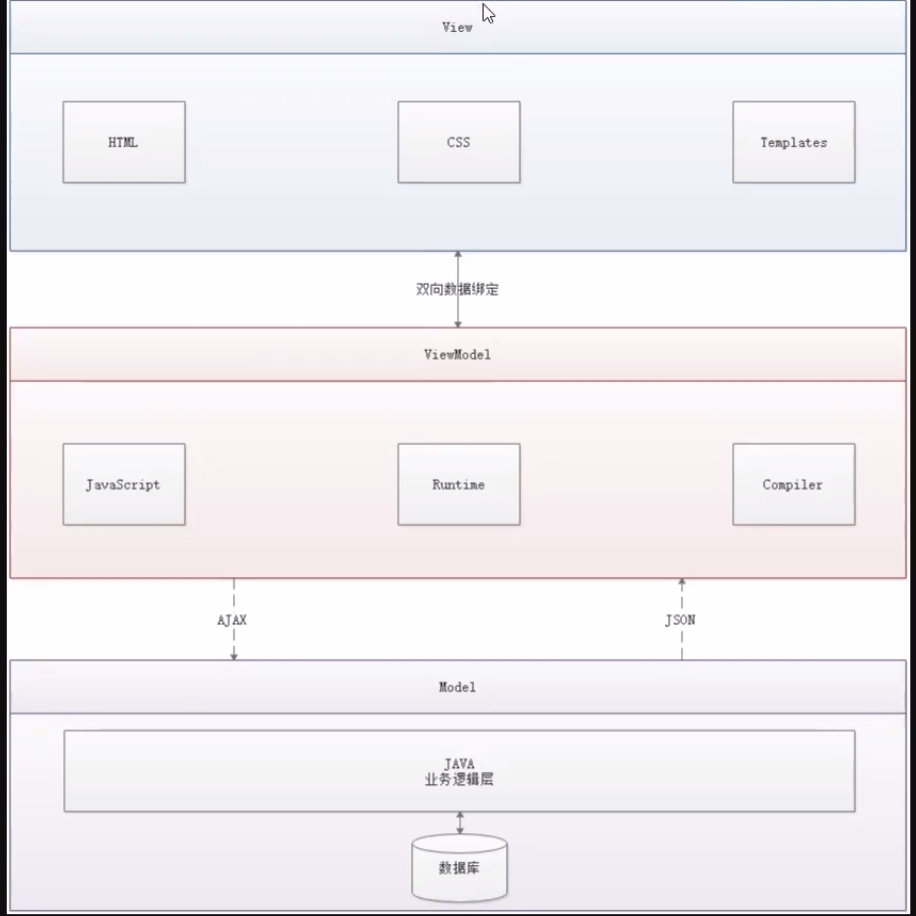

# Vue

## 概述

Vue是一套用于构建用户界面的渐进式框架

Soc原则：关注点分离原则

-   视图：html+css+js

-   网络通信：axios

-   页面跳转：vuex

-   UI：ICE

    >   https://ice.work/

CSS预处理器

用一种专门的编程语言，进行Web页面样式设计，再通过编译器转化为正常点CSS文件，以供项目使用

-   SASS：基于Ruby
-   LESS：基于NodeJS

## MVVM



Model的变化会导致View的变化，前后端双向绑定。

Vue是MVVM模式的实现者

-   Model：模型层，表示JavaScript对象
-   View：视图层，表示DOM
-   ViewModel：连接视图和数据的中间件

Vue.js就是MVVM中ViewModel层的实现者

-   ViewModel能够观察到数据的变化，并对视图相应的内容进行更新
-   ViewModel能够监听到视图的变化，并能够通知数据发生改变

```html
<body>
<!--view层 模板-->
<div id="app">
    {{message}}
</div>

<script src="https://cdn.jsdelivr.net/npm/vue/dist/vue.js"></script>
<script>
    var vm=new Vue({
        el:"#app",
        //model层：数据
        data:{
            message:"hello,vue"
        }
    });
</script>
</body>
```

>   https://baike.baidu.com/item/MVVM/96310?fr=aladdin

MVVM模式与MVC模式一样，主要目的是分离视图（View）和模型（Model）

-   低耦合：View可以独立于Model变化和修改，一个ViewModel可以绑定到不同的View上，当View变化的时候Model可以不变，当Model变化的时候View可以不变
-   可复用：可以把一些视图逻辑放在一个ViewModel里面，让很多View重用这段视图逻辑
-   独立开发：开发人员可以专注于视图逻辑和数据的开发（ViewModel），设计人员可以专注于页面的设计
-   可测试：测试可以针对ViewModel来写

模型

-   模型是指代表真实状态内容的领域模型（面向对象），或指代表内容的数据访问层（以数据为中心）。


视图

-   就像在MVC和MVP模式中一样，视图是用户在屏幕上看到的结构、布局和外观（UI）。

视图模型

-   *视图模型*是暴露公共属性和命令的视图的抽象。MVVM没有MVC模式的控制器，也没有MVP模式的presenter，有的是一个*绑定器*。在视图模型中，绑定器在视图和数据绑定器之间进行通信。

绑定器

-   声明性数据和命令绑定隐含在MVVM模式中。在Microsoft解决方案堆中，绑定器是一种名为XAML的标记语言。绑定器使开发人员免于被迫编写样板式逻辑来同步视图模型和视图。在微软的堆之外实现时，声明性数据绑定技术的出现是实现该模式的一个关键因素。

## Vue基本语法

鼠标悬浮提示：

```html
<span v-bind:title="message">
        hello
</span>
```

-   v-bind等为指令

### 判断

`v-if`-`v-else-if`-`v-else`

```html
<body>
<!--view层 模板-->
<div id="app">
    <h1 v-if="type==='A'">A</h1>
    <h1 v-else-if="type==='B'">B</h1>
    <h1 v-else-if="type==='C'">C</h1>
    <h1 v-else>X</h1>
</div>

<script src="https://cdn.jsdelivr.net/npm/vue/dist/vue.js"></script>
<script>
    var vm=new Vue({
        el:"#app",
        //model层：数据
        data:{
            type:'A'
        }
    });
</script>
</body>
```

### 循环

`v-for`

```html
<body>
<!--view层 模板-->
<div id="app">
    <li v-for="(item,index) in items">
        {{item.message}}---{{index}}
    </li>
</div>

<script src="https://cdn.jsdelivr.net/npm/vue/dist/vue.js"></script>
<script>
    var vm=new Vue({
        el:"#app",
        //model层：数据
        data:{
            items:[
                {message:'123'},
                {message: '456'}
            ]
        }
    });
</script>
</body>
```

## Vue基本事件

`v-on:事件`

```html
<body>
<!--view层 模板-->
<div id="app">
    <button v-on:click="sayHi">click me</button>
</div>

<script src="https://cdn.jsdelivr.net/npm/vue/dist/vue.js"></script>
<script>
    var vm=new Vue({
        el:"#app",
        //model层：数据
        data:{
            message:"123"
        },
        methods:{//方法必须定义在Vue的methods对象中
            sayHi:function (event) {
                alert(this.message)
            }
        }
    });
</script>
</body>
```

### Vue 7个属性

>   https://www.cnblogs.com/bgwhite/p/9297221.html

-   el属性

-   -   用来指示vue编译器从什么地方开始解析 vue的语法，可以说是一个占位符。

-   data属性

-   -   用来组织从view中抽象出来的属性，可以说将视图的数据抽象出来存放在data中。

-   template属性

-   -   用来设置模板，会替换页面元素，包括占位符。

-   methods属性

-   -   放置页面中的业务逻辑，js方法一般都放置在methods中

-   render属性

-   -   创建真正的Virtual Dom

-   computed属性

-   -   用来计算

-   watch属性

-   -   watch:function(new,old){}
    -   监听data中数据的变化
    -   两个参数，一个返回新值，一个返回旧值，

