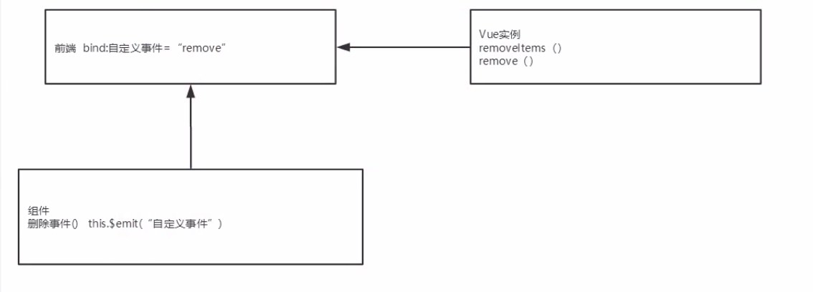

# Vue入门

## 概述

Vue是一套用于构建用户界面的渐进式框架

Soc原则：关注点分离原则

-   视图：html+css+js

-   网络通信：axios

-   页面跳转：vuex

-   UI：ICE

    >   https://ice.work/

CSS预处理器

用一种专门的编程语言，进行Web页面样式设计，再通过编译器转化为正常点CSS文件，以供项目使用

-   SASS：基于Ruby
-   LESS：基于NodeJS

## MVVM


Model的变化会导致View的变化，前后端双向绑定。

Vue是MVVM模式的实现者

-   Model：模型层，表示JavaScript对象
-   View：视图层，表示DOM
-   ViewModel：连接视图和数据的中间件

Vue.js就是MVVM中ViewModel层的实现者

-   ViewModel能够观察到数据的变化，并对视图相应的内容进行更新
-   ViewModel能够监听到视图的变化，并能够通知数据发生改变

```html
<body>
<!--view层 模板-->
<div id="app">
    {{message}}
</div>

<script src="https://cdn.jsdelivr.net/npm/vue/dist/vue.js"></script>
<script>
    var vm=new Vue({
        el:"#app",
        //model层：数据
        data:{
            message:"hello,vue"
        }
    });
</script>
</body>
```

>   https://baike.baidu.com/item/MVVM/96310?fr=aladdin

MVVM模式与MVC模式一样，主要目的是分离视图（View）和模型（Model）

-   低耦合：View可以独立于Model变化和修改，一个ViewModel可以绑定到不同的View上，当View变化的时候Model可以不变，当Model变化的时候View可以不变
-   可复用：可以把一些视图逻辑放在一个ViewModel里面，让很多View重用这段视图逻辑
-   独立开发：开发人员可以专注于视图逻辑和数据的开发（ViewModel），设计人员可以专注于页面的设计
-   可测试：测试可以针对ViewModel来写

模型

-   模型是指代表真实状态内容的领域模型（面向对象），或指代表内容的数据访问层（以数据为中心）。


视图

-   就像在MVC和MVP模式中一样，视图是用户在屏幕上看到的结构、布局和外观（UI）。

视图模型

-   *视图模型*是暴露公共属性和命令的视图的抽象。MVVM没有MVC模式的控制器，也没有MVP模式的presenter，有的是一个*绑定器*。在视图模型中，绑定器在视图和数据绑定器之间进行通信。

绑定器

-   声明性数据和命令绑定隐含在MVVM模式中。在Microsoft解决方案堆中，绑定器是一种名为XAML的标记语言。绑定器使开发人员免于被迫编写样板式逻辑来同步视图模型和视图。在微软的堆之外实现时，声明性数据绑定技术的出现是实现该模式的一个关键因素。

>   官方文档 https://cn.vuejs.org/v2/guide/

## Vue基本语法

鼠标悬浮提示：

```html
<span v-bind:title="message">
        hello
</span>
```

-   v-bind等为指令

### 判断

`v-if`-`v-else-if`-`v-else`

```html
<body>
<!--view层 模板-->
<div id="app">
    <h1 v-if="type==='A'">A</h1>
    <h1 v-else-if="type==='B'">B</h1>
    <h1 v-else-if="type==='C'">C</h1>
    <h1 v-else>X</h1>
</div>

<script src="https://cdn.jsdelivr.net/npm/vue/dist/vue.js"></script>
<script>
    var vm=new Vue({
        el:"#app",
        //model层：数据
        data:{
            type:'A'
        }
    });
</script>
</body>
```

### 循环

`v-for`

```html
<body>
<!--view层 模板-->
<div id="app">
    <li v-for="(item,index) in items">
        {{item.message}}---{{index}}
    </li>
</div>

<script src="https://cdn.jsdelivr.net/npm/vue/dist/vue.js"></script>
<script>
    var vm=new Vue({
        el:"#app",
        //model层：数据
        data:{
            items:[
                {message:'123'},
                {message: '456'}
            ]
        }
    });
</script>
</body>
```

## Vue基本事件

`v-on:事件`

```html
<body>
<!--view层 模板-->
<div id="app">
    <button v-on:click="sayHi">click me</button>
</div>

<script src="https://cdn.jsdelivr.net/npm/vue/dist/vue.js"></script>
<script>
    var vm=new Vue({
        el:"#app",
        //model层：数据
        data:{
            message:"123"
        },
        methods:{//方法必须定义在Vue的methods对象中
            sayHi:function (event) {
                alert(this.message)
            }
        }
    });
</script>
</body>
```

### Vue 7个属性

>   https://www.cnblogs.com/bgwhite/p/9297221.html

1.   el属性

    -   用来指示vue编译器从什么地方开始解析 vue的语法，可以说是一个占位符。

2.   data属性

    -   用来组织从view中抽象出来的属性，可以说将视图的数据抽象出来存放在data中。

3.   template属性

    -   用来设置模板，会替换页面元素，包括占位符。

4.   methods属性

    -   放置页面中的业务逻辑，js方法一般都放置在methods中

5.   render属性

    -   创建真正的Virtual Dom

6.   computed属性

    -   用来计算

7.   watch属性

    -   watch:function(new,old){}
    -   监听data中数据的变化
    -   两个参数，一个返回新值，一个返回旧值，

## Vue双向绑定

Vue.js是一个MVVM框架，即数据双向绑定，即当数据发生变化的时候视图也就发生变化，当视图发生变化的时候数据也会同步发生变化。

可以使用`v-model`指令在表单`<input>`、`<textarea>`、`<select>`元素上创建数据双向绑定，它会根据控件类型自动选取正确的方法来更新元素。

```html
<body>
<!--view层 模板-->
<div id="app">
    输入的文本：<input v-model="message">{{message}}
</div>

<script src="https://cdn.jsdelivr.net/npm/vue/dist/vue.js"></script>
<script>
    var vm=new Vue({
        el:"#app",
        //model层：数据
        data:{
            message:""
        },

    });
</script>
</body>
```

```html
<div id="app">
    性别：
    <input type="radio" name="gender" value="male" v-model="message">male
    <input type="radio" name="gender" value="female" v-model="message">female
    <p>
        checked:{{message}}
    </p>
</div>
```

```html
<div id="app">
    group：
    <select v-model="message">
        <option disabled value="">please select</option>
        <option>A</option>
        <option>B</option>
        <option>C</option>
    </select>
    <p>
        checked:{{message}}
    </p>
</div>
```

`v-model`会忽略所有表单元素的value、checked、selected特性的初始值而总是将Vue实例的数据作为数据来源

## Vue组件

-   `Vue.component()`：注册组件
-   `abc`：自定义组件的名字
-   `props`：接受的参数
-   `template`：组件的模板

```html
<body>
<!--view层 模板-->
<div id="app">
<!--    组件：传递给组件中的值：props-->
    <abc v-for="item in items" v-bind:ttt="item"></abc>
</div>

<script src="https://cdn.jsdelivr.net/npm/vue/dist/vue.js"></script>
<script>
    //定义一个Vue组件Component
    Vue.component("abc",{
        props:["ttt"],
        template:"<li>{{ttt}}</li>"
    });
    var vm=new Vue({
        el:"#app",
        data:{
            items:["123","456","789"]
        }
    });
</script>
</body>
```

-   `v-for="item in items"`：遍历Vue实例中定义的名为items的数组，并创建同等数量的组件
-   `v-bind:ttt="item"`：将遍历的item项绑定到组件中props定义的名为ttt属性上，ttt为props定义的属性名，item为遍历的项的值

## Axios异步通信

Axios是可以用在浏览器端和NodeJS的异步通信框架，主要作用就是实现AJAX异步通信。

功能特点：

-   从浏览器创建`XMLHttpRequests`
-   从node.js创建http请求
-   支持Promise API [JS中链式编程]
-   拦截请求和响应
-   转换请求数据和响应数据
-   取消请求
-   自动转换JSON数据
-   客户端支持防御XSRF（跨站请求伪造）

>   https://www.jianshu.com/p/410b6099be69

Vue生命周期：


```html
<!DOCTYPE html>
<html lang="en">
<head>
    <meta charset="UTF-8">
    <title>Title</title>
<!--    v-block解决闪烁问题-->
    <style>
        [v-block]{
            display: none;
        }
    </style>
</head>
<body>

<div id="app" v-block>
    <div>{{info.name}}</div>
    <div>{{info.address.street}}</div>
    <a v-bind:href="info.url">点击</a>
</div>

<script src="https://cdn.jsdelivr.net/npm/vue/dist/vue.js"></script>
<script src="https://unpkg.com/axios/dist/axios.min.js"></script>
<script>

    var vm=new Vue({
        el:"#app",
        data(){
          return{
              //请求的返回参数合适，必须和json字符串一样
              info:{
                  name:null,
                  address:{
                      street:null,
                      city:null,
                      country:null
                  },
                  url:null
              }
          }
        },
        mounted(){//钩子函数 链式编程
            axios.get('data.json').then(response=>(this.info=response.data));
        }
    });
</script>
</body>
</html>
```

## 计算属性

计算出来的结果保存在属性中->内存中运行，虚拟DOM

```html
<body>

<div id="app">
    <p>time1 {{currentTime1()}}</p>
    <p>time2 {{currentTime2}}</p>
</div>

<script src="https://cdn.jsdelivr.net/npm/vue/dist/vue.js"></script>
<script src="https://unpkg.com/axios/dist/axios.min.js"></script>
<script>

    var vm=new Vue({
        el:"#app",
        data: {
            message:"hello"
        },
        methods:{
            currentTime1:function () {
                return Date.now();
            }
        },
        computed:{//计算属性
            currentTime2:function () {
                this.message;//一旦改变message重新计算
                return Date.now();
            }
        }
    });
</script>
</body>
```

将不经常变化的属性缓存起来，节省系统开销

## slot

slot元素作为承载分发内容的出口，称为插槽，可以应用在组合组件的场景中

Vue 实现了一套内容分发的 API，这套 API 的设计灵感源自Web Components 规范草案，将 slot 元素作为承载分发内容的出口。

```html
<body>
<div id="app">
    <vt>
        <vtitle slot="vtitle" v-bind:title="title"></vtitle>
        <vitems slot="vitems" v-for="item in vitems" v-bind:item="item"></vitems>
    </vt>
</div>
<script src="https://cdn.jsdelivr.net/npm/vue/dist/vue.js"></script>
<script src="https://unpkg.com/axios/dist/axios.min.js"></script>
<script>
    //slot插槽
    Vue.component("vt",{
        template:
        '<div>' +
            '<slot name="vtitle"></slot>' +
            '<ul>' +
                '<slot name="vitems"></slot>' +
            '</ul>' +
        '</div>'

    });
    Vue.component("vtitle",{
        props:['title'],
        template: '<div>{{title}}</div>'
    })
    Vue.component("vitems",{
        props: ['item'],
        template: '<li>{{item}}</li>'
    })
    var vm=new Vue({
        el:"#app",
        data:{
            title:"list",
            vitems:['123','456','789']
        }
    });
</script>
</body>
</html>
```

## 自定义事件内容分发



```html
<!DOCTYPE html>
<html lang="en">
<head>
    <meta charset="UTF-8">
    <title>Title</title>

</head>
<body>

<div id="app">
    <vt>
        <vtitle slot="vtitle" v-bind:title="title"></vtitle>
        <vitems slot="vitems" v-for="(item,index) in vitems" v-bind:item="item" v-bind:index="index" v-on:remove="removeItems(index)"></vitems>
    </vt>
</div>

<script src="https://cdn.jsdelivr.net/npm/vue/dist/vue.js"></script>
<script src="https://unpkg.com/axios/dist/axios.min.js"></script>
<script>
    //slot插槽
    Vue.component("vt",{
        template:
        '<div>' +
            '<slot name="vtitle"></slot>' +
            '<ul>' +
                '<slot name="vitems"></slot>' +
            '</ul>' +
        '</div>'

    });
    Vue.component("vtitle",{
        props:['title'],
        template: '<div>{{title}}</div>'
    })
    Vue.component("vitems",{
        props: ['item','index'],
        //只能绑定当前组件的方法
        template: '<li>{{item}}<button @click="remove">del</button></li>',
        methods:{
            remove:function (index) {
                //this.$emit自定义事件分发
                this.$emit('remove',index);
            }
        }
    })
    var vm=new Vue({
        el:"#app",
        data:{
            title:"list",
            vitems:['123','456','789']
        },
        methods: {
            removeItems:function (index) {
                this.vitems.splice(index,1);//一次删除一个元素
            }
        }
    });
</script>
</body>
</html>
```

## vue-cli

vue-cli是官方提供的一个脚手架，用于快速生成一个vue的项目模板

主要功能：

-   统一的目录结构
-   本地调试
-   热部署
-   单元测试
-   集成打包上线

```html
<!DOCTYPE html>
<html lang="en">
<head>
    <meta charset="UTF-8">
    <title>Title</title>
</head>
<body>
<!--模块化开发-->
<script src="dist/js/bundle.js"></script>
</body>
</html>
```


