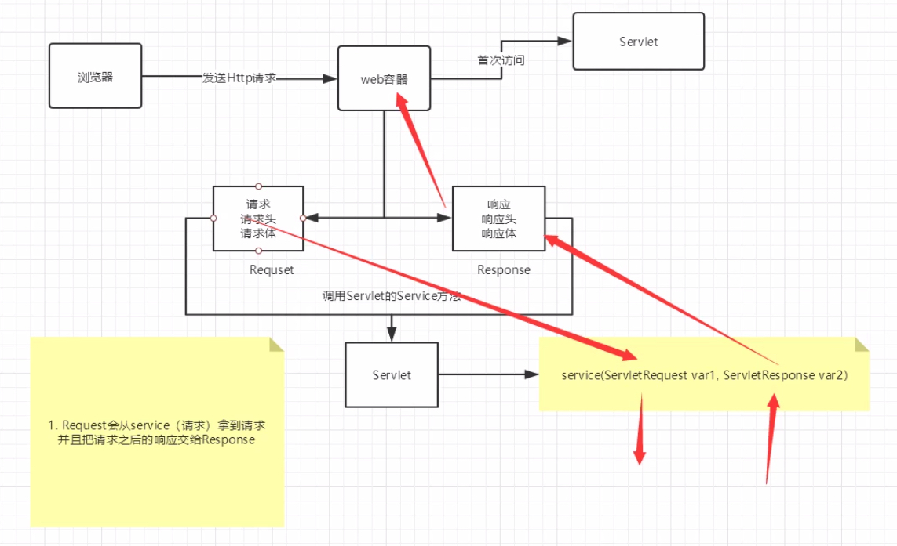
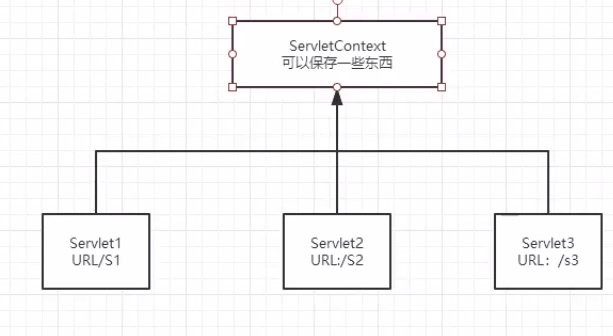

# Web基础知识

## HTTP

http（超文本传输协议）是一个简单的请求-响应协议，它通常运行在TCP之上

-   文本：html、字符串
-   超文本：图片、音乐、视频、定位、地图
-   HTTP：80端口
-   HTTPS：443端口

### 两个时代

-   HTTP/1.0：客户端可以与web服务器连接后，只能获得一个web资源，断开连接
-   HTTP/1.1：客户端可以与web服务器连接后，可以获得多个web资源

### 请求

客户端向服务端发送请求

```
Request URL: https://www.baidu.com/ （请求地址）
Request Method: GET （请求方法）
Status Code: 200 OK（状态码）
Remote Address: 104.193.88.123:443 （远程地址）
```

-   请求行

    请求行中的方式：GET，POST，DELETE，PUT

    -   GET：请求能携带的参数比较少，大小有限制，会在浏览器的url地址栏显示数据内容，不安全，但高效
    -   POST：请求能携带的参数没有限制，大小没有限制，不会在浏览器的url地址栏显示数据内容，安全，但不高效

-   消息头

    -   Accpet：告诉浏览器所支持的数据类型
    -   Accept-Encoding：支持哪种编码格式
        -   GBK
        -   UTF-8
        -   GB2312
        -   ISO8859-1
    -   Accept-Language：语言环境
    -   Cache-Control：缓存控制
    -   Connection：告诉浏览器请求完成是断开还是保持连接
    -   HOST：主机

### 响应

服务端向客户端发送响应

```
Cache-Control: private（缓存控制）
Connection: keep-alive（连接-保持连接）
Content-Encoding: gzip（编码）
Content-Type: text/html（类型）
```

```
Accept: text/html
Accept-Encoding: gzip, deflate, br
Accept-Language: zh-CN,zh;q=0.9,en;q=0.8
Cache-Control: max-age=0
Connection: keep-alive
```

-   响应体

    -   Accpet：告诉浏览器所支持的数据类型
    -   Accept-Encoding：支持哪种编码格式
        -   GBK
        -   UTF-8
        -   GB2312
        -   ISO8859-1
    -   Accept-Language：语言环境
    -   Cache-Control：缓存控制
    -   Connection：告诉浏览器请求完成是断开还是保持连接
    -   HOST：主机
    -   refresh：告诉客户端多久刷新
    -   Location：让网页重新定位

-   响应状态码

    -   200：请求响应成功

    -   3xx：请求重定向

    -   4xx：找不到资源

        404：资源不存在

    -   5xx：服务器代码错误

        502：网关错误

## Servlet

Servlet是一个接口，开发Servlet程序只需要：

-   编写一个类，实现Servlet接口
-   把开发好的java类部署到web服务器中

Servlet有两个实现类：HttpServlet、GenericServlet

依赖包：

```xml
<dependency>
            <groupId>javax.servlet</groupId>
            <artifactId>javax.servlet-api</artifactId>
            <version>4.0.1</version>
            <scope>provided</scope>
        </dependency>
        <!-- https://mvnrepository.com/artifact/javax.servlet.jsp/javax.servlet.jsp-api -->
        <dependency>
            <groupId>javax.servlet.jsp</groupId>
            <artifactId>javax.servlet.jsp-api</artifactId>
            <version>2.3.3</version>
            <scope>provided</scope>
        </dependency>
```

1.  编写一个普通类

2.  实现一个接口，直接继承HttpServlet

3.  重写方法

4.  编写Servlet映射

    ```xml
    <web-app>
      <display-name>Archetype Created Web Application</display-name>
      <servlet>
        <servlet-name>hello</servlet-name>
        <servlet-class>com.servlet.HelloServlet</servlet-class>
      </servlet>
      <servlet-mapping>
        <servlet-name>hello</servlet-name>
        <url-pattern>/hello</url-pattern>
      </servlet-mapping>
    </web-app>
    ```

    或者使用注解：

    >   https://www.cnblogs.com/xdp-gacl/p/4222902.html

     使用@WebServlet将一个继承于javax.servlet.http.HttpServlet的类定义为Servlet组件。

     　　@WebServlet有很多的属性：

    ​     　　1. asyncSupported：    声明Servlet是否支持异步操作模式。

    ​     　　2. description：　　    Servlet的描述。

    ​     　　3. displayName：       Servlet的显示名称。

    ​     　　4. initParams：        Servlet的init参数。

    ​     　　5. name：　　　　       Servlet的名称。

    ​     　　6. urlPatterns：　　   Servlet的访问URL。

    ​     　　7. value：　　　        Servlet的访问URL。

     　　Servlet的访问URL是Servlet的必选属性，可以选择使用urlPatterns或者value定义。

     　　像上面的Servlet3Demo可以描述成@WebServlet(name="Servlet3Demo",value="/Servlet3Demo")。

     　　也定义多个URL访问：

     　　如@WebServlet(name="Servlet3Demo",urlPatterns={"/Servlet3Demo","/Servlet3Demo2"})

     　　或者@WebServlet(name="AnnotationServlet",value={"/Servlet3Demo","/Servlet3Demo2"})

    

    ```java
    @WebServlet(name = "web", urlPatterns = "/web")
    public class HelloServlet extends HttpServlet {
    //...
    }
    ```

5.  配置tomcat

6.  启动测试

```java
public class HelloServlet extends HttpServlet {

    @Override
    protected void doGet(HttpServletRequest req, HttpServletResponse resp) throws ServletException, IOException {
        PrintWriter writer = resp.getWriter();
        writer.print("hello Servlet");
    }

    @Override
    protected void doPost(HttpServletRequest req, HttpServletResponse resp) throws ServletException, IOException {
        this.doGet(req, resp);
    }
}

```

### 运行原理



### Mapping问题

-   一个Servlet可以指定一个映射路径

    ```xml
    <servlet-mapping>
        <servlet-name>hello</servlet-name>
        <url-pattern>/hello</url-pattern>
      </servlet-mapping>
    ```

-   一个Servlet可以指定多个映射路径

    ```xml
    <servlet-mapping>
        <servlet-name>hello</servlet-name>
        <url-pattern>/hello1</url-pattern>
      </servlet-mapping>
    <servlet-mapping>
        <servlet-name>hello</servlet-name>
        <url-pattern>/hello2</url-pattern>
      </servlet-mapping>
    ```

-   一个Servlet可以指定通用映射路径

    ```xml
    <servlet-mapping>
        <servlet-name>hello</servlet-name>
        <url-pattern>/hello/*</url-pattern>
      </servlet-mapping>
    ```

-   一个Servlet可以指定后缀或者前缀路径等

    ```xml
    <servlet-mapping>
        <servlet-name>hello</servlet-name>
        <url-pattern>*.do</url-pattern>
      </servlet-mapping>
    ```

    注意：*前面不能加项目映射的路径

-   优先级问题

    指定了固有的映射路径优先级最高，如果找不到就会走默认的处理请求

### HttpServlet常用方法

```java
//        this.getInitParameter() 初始化配置
//        this.getServletConfig() Servlet配置
//        this.getServletContext() Servlet上下文
```

### ServletContext

web容器在启动的时候，它会为每个web程序都创建一个对应的ServletContext对象，它代表了当前的web应用

-   共享数据：在Servlet中保存的数据可以在另一个Servlet中拿到

    

    ```java
    //Servlet 1
    ServletContext servletContext = this.getServletContext();
    String username = "信息";
    servletContext.setAttribute("username",username);//将一个数据保存在ServletContext中
    //Servlet 2
    resp.setContentType("text/html");
    resp.setCharacterEncoding("utf-8");
    PrintWriter writer = resp.getWriter();
    ServletContext servletContext = this.getServletContext();
    String username =(String) servletContext.getAttribute("username");
    writer.print(username);
    ```

-   获取初始化参数

    1.  配置参数

        ```xml
        <context-param>
            <param-name>url</param-name>
            <param-value>jdbc:mysql//localhost:3306/aaa</param-value>
          </context-param>
        ```

    2.  获取参数

        ```java
        ServletContext servletContext = this.getServletContext();
        String url = servletContext.getInitParameter("url");
        writer.print(url);
        ```

-   请求转发

    ```java
    ServletContext context = this.getServletContext();
    RequestDispatcher requestDispatcher = context.getRequestDispatcher("/hello");//转发的请求路径
    requestDispatcher.forward(req,resp);//请求转发
    ```

-   读取资源文件

    Properties类

    ```java
    Properties properties = new Properties();
    properties.load(servletContext.getResourceAsStream("/WEB-INF/classes/db.properties"));
    String name = properties.getProperty("name");
    String password = properties.getProperty("password");
    writer.print(name);
    writer.print(password);
    ```

## Request与Response

web服务器接收到客户端的http请求，针对这个请求，分别创建一个代表请求的HttpServletRequest对象，代表响应的HttpServletResponse

-   如果要获取客户端请求过来的参数：HttpServletRequest
-   如果要给客户端响应一些信息：HttpServletResponse

### HttpServletResponse

1.  简单分类

    -   负责向浏览器发送数据的方法

    ```java
    public ServletOutputStream getOutputStream() throws IOException;
    public PrintWriter getWriter() throws IOException;
    ```

    -   负责向浏览器发送响应头的方法

    ```java
    public void setCharacterEncoding(String charset);
    public void setContentLength(int len);
    public void setContentLengthLong(long len);
    public void setContentType(String type);
    ```

    ```java
    public void setDateHeader(String name, long date);
    public void addDateHeader(String name, long date);
    public void setHeader(String name, String value);
    public void addHeader(String name, String value);
    public void setIntHeader(String name, int value);
    public void addIntHeader(String name, int value);
    ```

    响应的状态码常量

    ```java
     public static final int SC_CONTINUE = 100;
     public static final int SC_SWITCHING_PROTOCOLS = 101;
     public static final int SC_OK = 200;
     public static final int SC_CREATED = 201;
     public static final int SC_ACCEPTED = 202;
     public static final int SC_NON_AUTHORITATIVE_INFORMATION = 203;
     public static final int SC_NO_CONTENT = 204;
     public static final int SC_RESET_CONTENT = 205;
     public static final int SC_PARTIAL_CONTENT = 206;
     public static final int SC_MULTIPLE_CHOICES = 300;
     public static final int SC_MOVED_PERMANENTLY = 301;
     public static final int SC_MOVED_TEMPORARILY = 302;
     public static final int SC_FOUND = 302;
     public static final int SC_SEE_OTHER = 303;
     public static final int SC_NOT_MODIFIED = 304;
     public static final int SC_USE_PROXY = 305;
     public static final int SC_TEMPORARY_REDIRECT = 307;
     public static final int SC_BAD_REQUEST = 400;
     public static final int SC_UNAUTHORIZED = 401;
     public static final int SC_PAYMENT_REQUIRED = 402;
     public static final int SC_FORBIDDEN = 403;
     public static final int SC_NOT_FOUND = 404;
     public static final int SC_METHOD_NOT_ALLOWED = 405;
     public static final int SC_NOT_ACCEPTABLE = 406;
     public static final int SC_PROXY_AUTHENTICATION_REQUIRED = 407;
     public static final int SC_REQUEST_TIMEOUT = 408;
     public static final int SC_CONFLICT = 409;
     public static final int SC_GONE = 410;
     public static final int SC_LENGTH_REQUIRED = 411;
     public static final int SC_PRECONDITION_FAILED = 412;
     public static final int SC_REQUEST_ENTITY_TOO_LARGE = 413;
     public static final int SC_REQUEST_URI_TOO_LONG = 414;
     public static final int SC_UNSUPPORTED_MEDIA_TYPE = 415;
     public static final int SC_REQUESTED_RANGE_NOT_SATISFIABLE = 416;
     public static final int SC_EXPECTATION_FAILED = 417;
     public static final int SC_INTERNAL_SERVER_ERROR = 500;
     public static final int SC_NOT_IMPLEMENTED = 501;
     public static final int SC_BAD_GATEWAY = 502;
     public static final int SC_SERVICE_UNAVAILABLE = 503;
     public static final int SC_GATEWAY_TIMEOUT = 504;
     public static final int SC_HTTP_VERSION_NOT_SUPPORTED = 505;
    ```
    
2.  常见应用

    -   向浏览器输出消息
    -   下载文件
        1.  要获取下载文件的路径
        2.  下载的文件名
        3.  让浏览器支持能够下载我们需要的东西
        4.  获取下载文件的输入流
        5.  创建缓冲区
        6.  获取OutputStream对象
        7.  将流写入到buffer缓冲区
        8.  将缓冲区中的数据输出到客户端

    ```java
    String realPath = this.getServletContext().getRealPath("/1.jpg");
    String fileName = realPath.substring(realPath.lastIndexOf("\\") + 1);
    resp.setHeader("Content-Disposition","attachment; filename="+ URLEncoder.encode(fileName,"UTF-8"));
    FileInputStream fileInputStream = new FileInputStream(realPath);
    int len = 0;
    byte[] buffer = new byte[1024];
    ServletOutputStream outputStream = resp.getOutputStream();
    while((len=fileInputStream.read(buffer))>0){
          outputStream.write(buffer,0,len);
    }
    fileInputStream.close();
    outputStream.close();
    ```

    -   图片验证码
    
        ```java
        protected void doGet(HttpServletRequest req, HttpServletResponse resp) throws ServletException, IOException {
                resp.setHeader("refresh","3");
                BufferedImage bufferedImage = new BufferedImage(80,20,BufferedImage.TYPE_INT_RGB);
                Graphics2D graphics = (Graphics2D) bufferedImage.getGraphics();
                graphics.setColor(Color.white);
                graphics.fillRect(0,0,80,20);
                graphics.setColor(Color.BLUE);
                graphics.setFont(new Font(null,Font.BOLD,20));
                graphics.drawString(makeRandom(),0,20);
                resp.setContentType("image/jpeg");
                resp.setDateHeader("expires",-1);
                resp.setHeader("Cache-Control","no-Cache");
                resp.setHeader("Pragma","no-cache");
        
                ImageIO.write(bufferedImage, "jpg",resp.getOutputStream());
            }
        ```
    
    -   实现重定向
    
        一个web资源收到客户端请求，他会通知客户端去访问另一个web资源，这个过程叫重定向
    
        `resp.sendRedirect("/s1/error");//重定向`
    
        比较重定向与转发：
    
        -   页面都会跳转
        -   请求转发url不会变化 307
        -   重定向url会发生变化 302

### HttpServletRequest

request表示客户端的请求

-   获取前端传递的参数
-   请求转发

```java
public String getParameter(String name);
public String[] getParameterValues(String name);
```

示例代码：

```java
protected void doGet(HttpServletRequest req, HttpServletResponse resp) throws ServletException, IOException {
        req.setCharacterEncoding("utf-8");
    	String username=req.getParameter("username");
        String password=req.getParameter("password");
        System.out.println(username);
        System.out.println(password);
        String[] hobbies = req.getParameterValues("hobbies");
        System.out.println(Arrays.toString(hobbies));
    	req.getRequestDispatcher("/success.jsp").forward(req,resp);
    }
```


