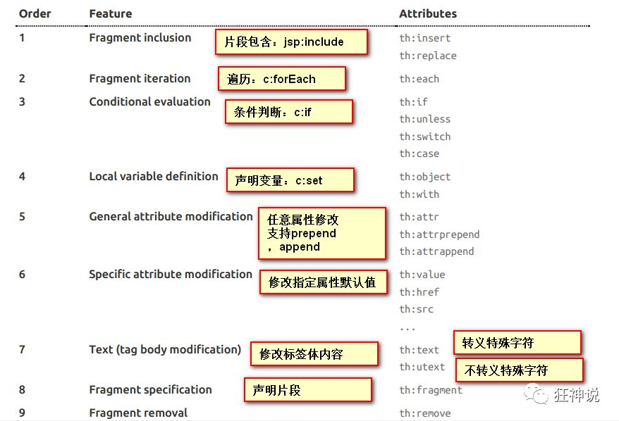

# SpringBoot

>   https://blog.csdn.net/qq_33369905/article/details/105828924

## 简介

**Spring Boot的主要优点：**

-   为所有Spring开发者更快的入门
-   开箱即用，提供各种默认配置来简化项目配置
-   内嵌式容器简化Web项目
-   没有冗余代码生成和XML配置的要求

## Hello SpringBoot

### 项目创建

Spring官方提供了非常方便的工具让我们快速构建应用

Spring Initializr：https://start.spring.io/

**项目创建方式一：**使用Spring Initializr 的 Web页面创建项目

1、打开  https://start.spring.io/

2、填写项目信息

3、点击”Generate Project“按钮生成项目；下载此项目

4、解压项目包，并用IDEA以Maven项目导入，一路下一步即可，直到项目导入完毕。

5、如果是第一次使用，可能速度会比较慢，包比较多、需要耐心等待一切就绪。

**项目创建方式二：**使用 IDEA 直接创建项目

1、创建一个新项目

2、选择spring initalizr ， 可以看到默认就是去官网的快速构建工具那里实现

3、填写项目信息

4、选择初始化的组件（初学勾选 Web 即可）

5、填写项目路径

6、等待项目构建成功


**项目结构分析：**

通过上面步骤完成了基础项目的创建。就会自动生成以下文件。

1、程序的主启动类

2、一个 application.properties 配置文件

3、一个 测试类

4、一个 pom.xml

```xml
<!-- 父依赖 -->
<parent>
    <groupId>org.springframework.boot</groupId>
    <artifactId>spring-boot-starter-parent</artifactId>
    <version>2.2.5.RELEASE</version>
    <relativePath/>
</parent>

<dependencies>
    <!-- web场景启动器 -->
    <dependency>
        <groupId>org.springframework.boot</groupId>
        <artifactId>spring-boot-starter-web</artifactId>
    </dependency>
    <!-- springboot单元测试 -->
    <dependency>
        <groupId>org.springframework.boot</groupId>
        <artifactId>spring-boot-starter-test</artifactId>
        <scope>test</scope>
        <!-- 剔除依赖 -->
        <exclusions>
            <exclusion>
                <groupId>org.junit.vintage</groupId>
                <artifactId>junit-vintage-engine</artifactId>
            </exclusion>
        </exclusions>
    </dependency>
</dependencies>

<build>
    <plugins>
        <!-- 打包插件 -->
        <plugin>
            <groupId>org.springframework.boot</groupId>
            <artifactId>spring-boot-maven-plugin</artifactId>
        </plugin>
    </plugins>
</build>
```

-   在主程序的同级目录下，新建一个controller包

-   在包中新建一个HelloController类

    ```java
    @RestController
    public class HelloController {
        @RequestMapping("/hello")
        public String hello(){
            return "hello,world";
        }
    }
    ```

-   相关配置

    1.  打包时跳过测试用例

        ```xml
        <plugin>
            <groupId>org.apache.maven.plugins</groupId>
            <artifactId>maven-surefire-plugin</artifactId>
            <configuration>
                <!--跳过项目运行测试用例-->
                <skipTests>true</skipTests>
            </configuration>
        </plugin>
        ```

    2.  配置端口号

        application.properties

        ```properties
        #更改端口号
        server.port=8081
        ```

    3.  修改启动图案

        到项目下的 resources 目录下新建一个banner.txt 即可

        在线生成图案：

        >   https://www.bootschool.net/ascii 

### 运行原理

-   pom.xml

    -   spring-boot-dependencies:核心依赖，在父工程中
    -   引入SpringBoot依赖的时候不需要指定版本，是由于版本仓库的存在

-   启动器

    -   **springboot-boot-starter-xxx**：就是spring-boot的场景启动器
    -   **spring-boot-starter-web**：帮我们导入了web模块正常运行所依赖的组件
    -   SpringBoot将所有的功能场景都抽取出来，做成一个个的启动器，只需要在项目中引入这些starter即可，所有相关的依赖都会导入进来 ， 我们要用什么功能就导入什么样的场景启动器即可 ，我们也可以自己自定义 starter

-   主启动类

    ```java
    //@SpringBootApplication 来标注一个主程序类
    //说明这是一个Spring Boot应用
    @SpringBootApplication
    public class SpringbootApplication {
       public static void main(String[] args) {
         //以为是启动了一个方法，没想到启动了一个服务
          SpringApplication.run(SpringbootApplication.class, args);
       }
    }
    ```

    -   注解

        ```java
        @SpringBootConfiguration//SpringBoot的配置
        	@Configuration//Spring的配置类
        	@Component//Spring的组件
        @EnableAutoConfiguration//自动配置
        	@AutoConfigurationPackage//自动配置包
        		@Import(AutoConfigurationPackage.Register.class)//自动配置包注册
        	@Import(AutoConfigurationImportSelector.class)//自动配置导入选择
        //获取所有的配置
        List<String> configurations = getCandidateConfigurations(annotationMetadata, attributes);
        ```

        /META-INF/spring.factories自动配置的核心文件

        分析：

        -   @SpringBootApplication

        作用：标注在某个类上说明这个类是SpringBoot的主配置类 ， SpringBoot就应该运行这个类的main方法来启动SpringBoot应用；

        进入这个注解：可以看到上面还有很多其他注解！

        ```java
        @SpringBootConfiguration
        @EnableAutoConfiguration
        @ComponentScan(
            excludeFilters = {@Filter(
        type = FilterType.CUSTOM,
            classes = {TypeExcludeFilter.class}
        ), @Filter(
            type = FilterType.CUSTOM,
        classes = {AutoConfigurationExcludeFilter.class}
        )}
        )
        public @interface SpringBootApplication {
            // ......
        }
        ```
    
        -   @ComponentScan
    
        这个注解在Spring中很重要 ,它对应XML配置中的元素。
    
        作用：自动扫描并加载符合条件的组件或者bean ， 将这个bean定义加载到IOC容器中
    
        -   @SpringBootConfiguration
    
        作用：SpringBoot的配置类 ，标注在某个类上 ， 表示这是一个SpringBoot的配置类；
    
        我们继续进去这个注解查看
    
        ```java
            // 点进去得到下面的 @Component
            @Configuration
        public @interface SpringBootConfiguration {}
            
        @Component
            public @interface Configuration {}
        ```
    
        这里的 @Configuration，说明这是一个配置类 ，配置类就是对应Spring的xml 配置文件；
    
        里面的 @Component 这就说明，启动类本身也是Spring中的一个组件而已，负责启动应用！
    
        我们回到 SpringBootApplication 注解中继续看。
        -   @EnableAutoConfiguration
    
        **@EnableAutoConfiguration ：开启自动配置功能**
    
        以前我们需要自己配置的东西，而现在SpringBoot可以自动帮我们配置 ；@EnableAutoConfiguration告诉SpringBoot开启自动配置功能，这样自动配置才能生效；
    
        点进注解接续查看：
    
        **@AutoConfigurationPackage ：自动配置包**
    
        ```java
        @Import({Registrar.class})
        public @interface AutoConfigurationPackage {
            }
        ```
    
        **@import** ：Spring底层注解@import ， 给容器中导入一个组件
    
        Registrar.class 作用：将主启动类的所在包及包下面所有子包里面的所有组件扫描到Spring容器 ；
    
        这个分析完了，退到上一步，继续看
    
        **@Import({AutoConfigurationImportSelector.class}) ：给容器导入组件 ；**
    
        AutoConfigurationImportSelector ：自动配置导入选择器，那么它会导入哪些组件的选择器呢？我们点击去这个类看源码：
    
        1、这个类中有一个这样的方法
    
        ```java
        // 获得候选的配置
        
        protected List<String> getCandidateConfigurations(AnnotationMetadata metadata, AnnotationAttributes attributes) {
                //这里的getSpringFactoriesLoaderFactoryClass（）方法
            //返回的就是我们最开始看的启动自动导入配置文件的注解类；EnableAutoConfiguration
                List<String> configurations = SpringFactoriesLoader.loadFactoryNames(this.getSpringFactoriesLoaderFactoryClass(), this.getBeanClassLoader());
                Assert.notEmpty(configurations, "No auto configuration classes found in META-INF/spring.factories. If you are using a custom packaging, make sure that file is correct.");
                return configurations;
            }
        ```
    
        2、这个方法又调用了  SpringFactoriesLoader 类的静态方法！我们进入SpringFactoriesLoader类loadFactoryNames() 方法
    
        ```java
        public static List<String> loadFactoryNames(Class<?> factoryClass, @Nullable ClassLoader classLoader) {
                String factoryClassName = factoryClass.getName();
            //这里它又调用了 loadSpringFactories 方法
                return (List)loadSpringFactories(classLoader).getOrDefault(factoryClassName, Collections.emptyList());
        }
        ```
    
        3、我们继续点击查看 loadSpringFactories 方法
    
        ```java
           private static Map<String, List<String>> loadSpringFactories(@Nullable ClassLoader classLoader) {
                //获得classLoader ， 我们返回可以看到这里得到的就是EnableAutoConfiguration标注的类本身
                MultiValueMap<String, String> result = (MultiValueMap)cache.get(classLoader);
                if (result != null) {
                    return result;
                } else {
                        try {
                            //去获取一个资源 "META-INF/spring.factories"
                            Enumeration<URL> urls = classLoader != null ? classLoader.getResources("META-INF/spring.factories") : ClassLoader.getSystemResources("META-INF/spring.factories");
                            LinkedMultiValueMap result = new LinkedMultiValueMap();
                //将读取到的资源遍历，封装成为一个Properties
                        while(urls.hasMoreElements()) {
                            URL url = (URL)urls.nextElement();
                            UrlResource resource = new UrlResource(url);
                            Properties properties = PropertiesLoaderUtils.loadProperties(resource);
                            Iterator var6 = properties.entrySet().iterator();
            
                        while(var6.hasNext()) {
                        Entry<?, ?> entry = (Entry)var6.next();
                        String factoryClassName = ((String)entry.getKey()).trim();
                        String[] var9 = StringUtils.commaDelimitedListToStringArray((String)entry.getValue());
                        int var10 = var9.length;
            
                        for(int var11 = 0; var11 < var10; ++var11) {
                            String factoryName = var9[var11];
                            result.add(factoryClassName, factoryName.trim());
                        }
                    }
                }
            
                cache.put(classLoader, result);
                return result;
            } catch (IOException var13) {
                throw new IllegalArgumentException("Unable to load factories from location [META-INF/spring.factories]", var13);
            }
        }
            
            }
        ```
    
        4、发现一个多次出现的文件：spring.factories，全局搜索它
    
        spring.factories
    
        我们根据源头打开spring.factories ， 看到了很多自动配置的文件；这就是自动配置根源所在！
    
        
    
        **WebMvcAutoConfiguration**
    
        我们在上面的自动配置类随便找一个打开看看，比如 ：WebMvcAutoConfiguration
    
        
    
        可以看到这些一个个的都是JavaConfig配置类，而且都注入了一些Bean
    
        >   自动配置原理
        >
        >   https://mp.weixin.qq.com/s?__biz=Mzg2NTAzMTExNg%3D%3D&chksm=ce6107d5f9168ec34f59d88c5a7cfa592ab2c1a5bf02cc3ed7bbb7b4f4e93d457144a6843a23&idx=1&mid=2247483766&scene=21&sn=27739c5103547320c505d28bec0a9517#wechat_redirect
    
        
    
        -   总结：
    
        **springboot所有自动配置都是在启动的时候扫描并加载，spring.factories所有的自动配置都在这里面，但是不一定生效，要判断条件是否成立，只有导入了对应的starter，就有对应的启动器了，有了启动器，我们自动装配就会生效，配置就会成功**
    
        1.  SpringBoot在启动的时候，从类路径下`/META-INF/spring.factories`获取指定的值
        2.  将这些自动配置的类导入容器，自动配置会生效，帮我们进行自动配置
        3.  整个JavaEE，解决方案和自动配置的东西都在spring-boot-autoconfigure-2.2.0.RELEASE.jar包下
        4.  它会把所有需要导入的组件，以类名的方式返回，这些组件都会被添加到容器
        5.  容器中也会存在非常多的XXXAutoConfiguration的文件，就是这些类给容器中导入了这个场景所需要的所有组件，并自动配置
        6.  有了自动配置类，就免去了手动配置的麻烦
    
    -   SpringApplication
    
        **这个类主要做了以下四件事情：**
    
        1、推断应用的类型是普通的项目还是Web项目
    
        2、查找并加载所有可用初始化器 ， 设置到initializers属性中
    
        3、找出所有的应用程序监听器，设置到listeners属性中
    
        4、推断并设置main方法的定义类，找到运行的主类
    
        ```java
        public SpringApplication(ResourceLoader resourceLoader, Class... primarySources) {
            // ......
            this.webApplicationType = WebApplicationType.deduceFromClasspath();
            this.setInitializers(this.getSpringFactoriesInstances();
            this.setListeners(this.getSpringFactoriesInstances(ApplicationListener.class));
            this.mainApplicationClass = this.deduceMainApplicationClass();
        }
        ```
    
        

## 配置文件

SpringBoot使用一个全局的配置文件 ， 配置文件名称是固定的

-   application.properties

-   -   语法结构 ：key=value

-   application.yml

-   -   语法结构 ：key：空格 value

**配置文件的作用 ：**修改SpringBoot自动配置的默认值

### yaml语法

说明：语法要求严格！

1、空格不能省略

2、以缩进来控制层级关系，只要是左边对齐的一列数据都是同一个层级的。

3、属性和值的大小写都是十分敏感的。

**字面量：普通的值  [ 数字，布尔值，字符串  ]**

字面量直接写在后面就可以 ， 字符串默认不用加上双引号或者单引号；

```
k: v
```

注意：

-   “ ” 双引号，不会转义字符串里面的特殊字符 ， 特殊字符会作为本身想表示的意思；

    比如 ：name: "aaa \n bbb"  输出 ：aaa  换行  bbb

-   '' 单引号，会转义特殊字符 ， 特殊字符最终会变成和普通字符一样输出

    比如 ：name: ‘aaa \n bbb’  输出 ：aaa \n  bbb

```yaml
# 普通的key-value
name: abc

# 对象
student:
  name: aaa
  age: 12
  
# 数组
pets:
  - cat
  - dog
  - pig
```

### yaml可以给实体类赋值

实体类：

```java
@Component
@ConfigurationProperties(prefix = "person")
public class Person {
    private String name;
    private Integer age;
    private Boolean happy;
    private Date birth;
    private Map<String,Object> maps;
    private List<Object> lists;
    private Dog dog;
}
```

配置文件：

```yaml
person:
  name: test
  age: 10
  happy: false
  birth: 2020/01/01
  maps: {k1: v1,k2: v2}
  lists:
    - code
    - music
  dog:
    name: ddd
    age: 3
```

测试：

```java
@SpringBootTest
class DemoApplicationTests {
    @Autowired
    private Person person;
    @Test
    void contextLoads() {
        System.out.println(person);
    }

}
```

### properties配置

```java
@Component
@PropertySource(value = "classpath:test.properties")//绑定配置文件
public class Person {
    @Value("${name}")
    private String name;
    private Integer age;
    private Boolean happy;
    private Date birth;
    private Map<String,Object> maps;
    private List<Object> lists;
    private Dog dog;
```

### 配置文件占位符

```yaml
person:
    name: abc${random.uuid} # 随机uuid
    age: ${random.int}  # 随机int
    happy: false
    birth: 2000/01/01
    maps: {k1: v1,k2: v2}
    lists:
      - code
      - music
    dog:
      name: ${person.hello:other}_aaa
      age: 1
```


### JSR303校验

-   使用

    ```java
    @Component
    @ConfigurationProperties(prefix = "person")
    @Validated//数据校验
    public class Person {
        @Email(message = "Invalid email")
        private String name;
        private Integer age;
        private Boolean happy;
        private Date birth;
        private Map<String,Object> maps;
        private List<Object> lists;
        private Dog dog;
    }    
    ```

-   常见数据校验注解

    ```java
    @NotNull(message="名字不能为空")
    private String userName;
    @Max(value=120,message="年龄最大不能查过120")
    private int age;
    @Email(message="邮箱格式错误")
    private String email;
    ```

    1.  空检查
        -   @Null       验证对象是否为null
        -   @NotNull    验证对象是否不为null, 无法查检长度为0的字符串
        -   @NotBlank   检查约束字符串是不是Null还有被Trim的长度是否大于0,只对字符串,且会去掉前后空格.
        -   @NotEmpty   检查约束元素是否为NULL或者是EMPTY.
    2.  Booelan检查
        -   @AssertTrue     验证 Boolean 对象是否为 true  
        -   @AssertFalse    验证 Boolean 对象是否为 false  
    3.  长度检查
        -   @Size(min=, max=) 验证对象（Array,Collection,Map,String）长度是否在给定的范围之内  
        -   @Length(min=, max=) string is between min and max included.
    4.  日期检查
        -   @Past       验证 Date 和 Calendar 对象是否在当前时间之前  
        -   @Future     验证 Date 和 Calendar 对象是否在当前时间之后  
        -   @Pattern    验证 String 对象是否符合正则表达式的规则

### 多环境配置

-   多配置文件

    们在主配置文件编写的时候，文件名可以是 application-{profile}.properties/yml , 用来指定多个环境版本；

    **例如：**

    application-test.properties 代表测试环境配置

    application-dev.properties 代表开发环境配置

    但是Springboot并不会直接启动这些配置文件，它**默认使用application.properties主配置文件**；

    我们需要通过一个配置来选择需要激活的环境：
    
    ```properties
    #比如在配置文件中指定使用dev环境，我们可以通过设置不同的端口号进行测试；
    #我们启动SpringBoot，就可以看到已经切换到dev下的配置了；
    spring.profiles.active=dev
    ```
    
    >   yaml多文档块
    
    和properties配置文件中一样，但是使用yml去实现不需要创建多个配置文件，更加方便了
    
    ```yaml
    server:
      port: 8081
    #选择要激活那个环境块
    spring:
      profiles:
        active: prod
    
    ---
    server:
      port: 8083
    spring:
      profiles: dev #配置环境的名称
    
    
    ---
    server:
      port: 8084
    spring:
      profiles: prod  #配置环境的名称
    ```
    
    如果yml和properties同时都配置了端口，并且没有激活其他环境 ， 默认会使用properties配置文件
    
-   配置文件加载位置

    springboot 启动会扫描以下位置的application.properties或者application.yml文件作为Spring boot的默认配置文件：

    优先级1：项目路径下的config文件夹配置文件
    优先级2：项目路径下配置文件
    优先级3：资源路径下的config文件夹配置文件
    优先级4：资源路径下配置文件

    优先级由高到底，高优先级的配置会覆盖低优先级的配置；

    **SpringBoot会从这四个位置全部加载主配置文件；互补配置。**

我们还可以通过spring.config.location来改变默认的配置文件位置

项目打包好以后，我们可以使用命令行参数的形式，启动项目的时候来指定配置文件的新位置；这种情况，一般是后期运维做的多，相同配置，外部指定的配置文件优先级最高

```bash
java -jar spring-boot-config.jar --spring.config.location=./application.properties
```

## SpringBoot Web开发

### 静态资源导入

1.  webjars+jquery

    Webjars本质就是以jar包的方式引入我们的静态资源，需要导入maven依赖：

    ```xml
    <dependency>
        <groupId>org.webjars</groupId>
        <artifactId>jquery</artifactId>
        <version>3.4.1</version>
    </dependency>
    ```

    只要是静态资源，SpringBoot就会去对应的路径寻找资源，可以直接访问静态资源：http://localhost:8080/webjars/jquery/3.4.1/jquery.js

2.  静态资源映射规则

    将静态资源放在以下目录，可以被`SpringBoot`识别到：

    -   "classpath:/META-INF/resources/"
    -   "classpath:/resources/"
    -   "classpath:/static/"
    -   "classpath:/public/"

    我们可以在resources根目录下新建对应的文件夹，都可以存放我们的静态文件，一般遵循以下规则：

    -   static存放静态资源；
    -   public存放公共的资源；
    -   resources存放上传的图片等资源。

    优先级：resources > static > public。

3.  自定义资源路径

    我们也可以自己指定特定目录来存放静态资源，在application.properties中配置：

    ```properties
    spring.resources.static-locations=classpath:/coding/,classpath:/com/
    ```

    其中classpath为上面截图中的resource目录，/coding和/com是我们自定义存放静态资源的目录，一旦自己定义了静态文件目录的路径，原来的自动配置就都会失效了，**不推荐自己再自定义一个资源路径。**

### 首页定制

首页就是我们访问一个网站首先出现的页面，我们将首页对应的index.html（文件名必须是这个，springboot源码写死的）文件放在上面讲的静态资源目录下，比如public或者static目录下

重新运行springboot，打开浏览器访问http://localhost:8080/ 即可访问首页

-   网站图标

与其他静态资源一样，Spring Boot在配置的静态内容位置中查找 favicon.ico。如果存在这样的文件，它将自动用作应用程序的favicon。

1、关闭SpringBoot默认图标

```properties
#关闭默认图标
spring.mvc.favicon.enabled=false
```

2、自己放一个图标在静态资源目录下

3、清除浏览器缓存，刷新网页，发现图标已经变成自己的了


### Themeleaf 模板引擎

模板引擎（这里特指用于Web开发的模板引擎）是为了使用户界面与业务数据（内容）分离而产生的，是用于前端脚本简化字符串拼接的。模板引擎提供一个模板，后端传来的数据源（json或者字符串格式）通过这个模板引擎的处理生成一个html文本，浏览器再通过渲染这个html文本给用户呈现最终的网站页面，流程如下：


`Thymeleaf`是`SpringBoot`推荐的模板引擎，此外`FreeMarker`也是使用较多的模板引擎。

`SpringBoot`使用`Thymeleaf`模板引擎，需要引入`Thymeleaf`的`maven`依赖：

```xml
<!--thymeleaf-->
<dependency>
    <groupId>org.springframework.boot</groupId>
    <artifactId>spring-boot-starter-thymeleaf</artifactId>
</dependency>
```

此外，还需要在`html`文本里引入`Thymeleaf`的命名空间：

```html
<html lang="en" xmlns:th="http://www.thymeleaf.org">
```

-   使用

    ```java
    @Controller
    public class TestController {
        
        @RequestMapping("/t1")
        public String test1(){
            //可以跳转到classpath:/templates/test.html
            return "test";
        }
    }
    ```

-   语法

    

### MVC自动配置

>   https://mp.weixin.qq.com/s?__biz=Mzg2NTAzMTExNg%3D%3D&chksm=ce610708f9168e1ee95b9f6135574cbea2d2b90ac3d0f7b6766d5260be0d711bbb73e678c6b5&idx=1&mid=2247483819&scene=21&sn=b9009aaa2a9af9d681a131b3a49d8848#wechat_redirect
>
>   https://mp.weixin.qq.com/s?__biz=Mzg2NTAzMTExNg%3D%3D&chksm=ce6107d4f9168ec28b99622befbde5c7ab51c320d979a96a21e9a870d1d4bbd1e0a2a3dde8eb&idx=1&mid=2247483767&scene=21&sn=4c23abf553259052f335086dba1ce80c#wechat_redirect

