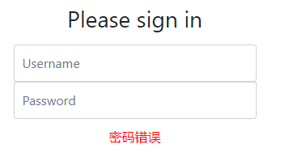

# 网站安全框架

## 安全简介

在 Web 开发中，安全一直是非常重要的一个方面。安全虽然属于应用的非功能性需求，但是应该在应用开发的初期就考虑进来。如果在应用开发的后期才考虑安全的问题，就可能陷入一个两难的境地：一方面，应用存在严重的安全漏洞，无法满足用户的要求，并可能造成用户的隐私数据被攻击者窃取；另一方面，应用的基本架构已经确定，要修复安全漏洞，可能需要对系统的架构做出比较重大的调整，因而需要更多的开发时间，影响应用的发布进程。因此，从应用开发的第一天就应该把安全相关的因素考虑进来，并在整个应用的开发过程中。

市面上存在比较有名的：Shiro，Spring Security 

主要作用：认证、授权

一般来说，Web 应用的安全性包括用户认证（Authentication）和用户授权（Authorization）两个部分。用户认证指的是验证某个用户是否为系统中的合法主体，也就是说用户**能否访问**该系统。用户认证一般要求用户提供用户名和密码。系统通过校验用户名和密码来完成认证过程。用户授权指的是验证某个用户**是否有权限**执行某个操作。在一个系统中，不同用户所具有的权限是不同的。比如对一个文件来说，有的用户只能进行读取，而有的用户可以进行修改。一般来说，系统会为不同的用户分配不同的角色，而每个角色则对应一系列的权限。

## Spring Security

Spring Security是一个功能强大且高度可定制的身份验证和访问控制框架。它实际上是保护基于spring的应用程序的标准。

Spring Security是一个框架，侧重于为Java应用程序提供身份验证和授权。与所有Spring项目一样，Spring安全性的真正强大之处在于它可以轻松地扩展以满足定制需求。Spring 是一个非常流行和成功的 Java 应用开发框架。Spring Security 基于 Spring 框架，提供了一套 Web 应用安全性的完整解决方案。

### 简介

Spring Security 是针对Spring项目的安全框架，也是Spring Boot底层安全模块默认的技术选型，他可以实现强大的Web安全控制，对于安全控制，我们仅需要引入 spring-boot-starter-security 模块，进行少量的配置，即可实现强大的安全管理！

几个类：

-   WebSecurityConfigurerAdapter：自定义Security策略
-   AuthenticationManagerBuilder：自定义认证策略
-   @EnableWebSecurity：开启WebSecurity模式

Spring Security的两个主要目标是 “认证” 和 “授权”（访问控制）。

**“认证”（Authentication）**

身份验证是关于验证您的凭据，如用户名/用户ID和密码，以验证您的身份。

身份验证通常通过用户名和密码完成，有时与身份验证因素结合使用。

 **“授权” （Authorization）**

授权发生在系统成功验证您的身份后，最终会授予您访问资源（如信息，文件，数据库，资金，位置，几乎任何内容）的完全权限。

### 使用

1.  导入依赖

    ```xml
    <dependency>
       <groupId>org.springframework.boot</groupId>
       <artifactId>spring-boot-starter-security</artifactId>
    </dependency>
    ```

2.  编写基础配置类

    ```java
    @EnableWebSecurity // 开启WebSecurity模式
    public class SecurityConfig extends WebSecurityConfigurerAdapter {
    
       @Override
       protected void configure(HttpSecurity http) throws Exception {
       // 定制请求的授权规则
       // 首页所有人可以访问
       http.authorizeRequests().antMatchers("/").permitAll()
      .antMatchers("/level1/**").hasRole("vip1")
      .antMatchers("/level2/**").hasRole("vip2")
      .antMatchers("/level3/**").hasRole("vip3");
      	// 开启自动配置的登录功能
    	// /login 请求来到登录页
    	// /login?error 重定向到这里表示登录失败
    	http.formLogin();
        //开启自动配置的注销的功能
        // /logout 注销请求
       http.logout().logoutSuccessUrl("/");
       //记住我
       http.rememberMe().rememberMeParameter("remember");
      }
        //定义认证规则
    @Override
    protected void configure(AuthenticationManagerBuilder auth) throws Exception {
       //在内存中定义，也可以在jdbc中去拿....
       //Spring security 5.0中新增了多种加密方式，也改变了密码的格式。
       //要想我们的项目还能够正常登陆，需要修改一下configure中的代码。我们要将前端传过来的密码进行某种方式加密
       //spring security 官方推荐的是使用bcrypt加密方式。
       auth.inMemoryAuthentication().passwordEncoder(new BCryptPasswordEncoder())
              .withUser("kuangshen").password(new BCryptPasswordEncoder().encode("123456")).roles("vip2","vip3")
              .and()
              .withUser("root").password(new BCryptPasswordEncoder().encode("123456")).roles("vip1","vip2","vip3")
              .and()
              .withUser("guest").password(new BCryptPasswordEncoder().encode("123456")).roles("vip1","vip2");
        
    }
        //或者采用JDBC认证
        /**
        @Autowired
        private DataSource dataSource;
        @Autowired
        public void configureGlobal(AuthenticationManagerBuilder auth) throws Exception{
        	UserBuilder users = User.withDefaultPasswordEncoder();
        	auth
        		.jdbcAuthentication()
        		.dataSource(dataSource)
        		.withDefaultSchema()
        		.withUser("kuangshen").password(new BCryptPasswordEncoder().encode("123456")).roles("vip2","vip3")
        		.withUser("root").password(new BCryptPasswordEncoder().encode("123456")).roles("vip1","vip2","vip3")
        		.withUser("guest").password(new BCryptPasswordEncoder().encode("123456")).roles("vip1","vip2");
        }
        */
    }
    ```

3.  修改对应前端代码，实现网站安全控制

## Shiro

### 概述

Apache Shiro是一个强大且易用的Java安全框架

可以完成身份验证、授权、密码和会话管理

Shiro 不仅可以用在 JavaSE 环境中，也可以用在 JavaEE 环境中

### 功能


`Authentication`：身份认证/登录，验证用户是不是拥有相应的身份；

`Authorization`：授权，即权限验证，验证某个已认证的用户是否拥有某个权限；即判断用户是否能做事情，常见的如：验证某个用户是否拥有某个角色。或者细粒度的验证某个用户对某个资源是否具有某个权限；

`Session Manager`：会话管理，即用户登录后就是一次会话，在没有退出之前，它的所有信息都在会话中；会话可以是普通JavaSE环境的，也可以是如Web环境的；

`Cryptography`：加密，保护数据的安全性，如密码加密存储到数据库，而不是明文存储；

`Web Support`：Web支持，可以非常容易的集成到Web环境；

`Caching`：缓存，比如用户登录后，其用户信息、拥有的角色/权限不必每次去查，这样可以提高效率；

`Concurrency`：shiro支持多线程应用的并发验证，即如在一个线程中开启另一个线程，能把权限自动传播过去；

`Testing`：提供测试支持；

`Run As`：允许一个用户假装为另一个用户（如果他们允许）的身份进行访问；

`Remember Me`：记住我，这个是非常常见的功能，即一次登录后，下次再来的话不用登录了。

### 外部架构


应用代码直接交互的对象是Subject，也就是说Shiro的对外API核心就是Subject；其每个API的含义：

`Subject`：主体，代表了**当前“用户”**，这个用户不一定是一个具体的人，与当前应用交互的任何东西都是Subject，如网络爬虫，机器人等；即一个抽象概念；所有Subject都绑定到SecurityManager，与Subject的所有交互都会委托给SecurityManager；可以把Subject认为是一个门面；SecurityManager才是实际的执行者；

`SecurityManager`：安全管理器；即所有与安全有关的操作都会与SecurityManager交互；且它**管理着所有Subject**；可以看出它是Shiro的核心，它负责与后边介绍的其他组件进行交互，如果学习过SpringMVC，你可以把它看成DispatcherServlet前端控制器；

`Realm`：域，**Shiro从从Realm获取安全数据**（如用户、角色、权限），就是说SecurityManager要验证用户身份，那么它需要从Realm获取相应的用户进行比较以确定用户身份是否合法；也需要从Realm得到用户相应的角色/权限进行验证用户是否能进行操作；可以把Realm看成DataSource，即安全数据源。

也就是说对于我们而言，最简单的一个Shiro应用：

1.  应用代码通过Subject来进行认证和授权，而Subject又委托给SecurityManager；
2.  我们需要给Shiro的SecurityManager注入Realm，从而让SecurityManager能得到合法的用户及其权限进行判断。

从以上也可以看出，Shiro不提供维护用户/权限，而是通过Realm让开发人员自己注入

### 内部架构


`Subject`：主体，可以看到主体可以是任何可以与应用交互的“用户”；

`SecurityManager`：相当于SpringMVC中的DispatcherServlet或者Struts2中的FilterDispatcher；是Shiro的心脏；所有具体的交互都通过SecurityManager进行控制；它管理着所有Subject、且负责进行认证和授权、及会话、缓存的管理。

`Authenticator`：认证器，负责主体认证的，这是一个扩展点，如果用户觉得Shiro默认的不好，可以自定义实现；其需要认证策略（Authentication Strategy），即什么情况下算用户认证通过了；

`Authrizer`：授权器，或者访问控制器，用来决定主体是否有权限进行相应的操作；即控制着用户能访问应用中的哪些功能；

`Realm`：可以有1个或多个Realm，可以认为是安全实体数据源，即用于获取安全实体的；可以是JDBC实现，也可以是LDAP实现，或者内存实现等等；由用户提供；注意：Shiro不知道你的用户/权限存储在哪及以何种格式存储；所以我们一般在应用中都需要实现自己的Realm；

`SessionManager`：如果写过Servlet就应该知道Session的概念，Session呢需要有人去管理它的生命周期，这个组件就是SessionManager；而Shiro并不仅仅可以用在Web环境，也可以用在如普通的JavaSE环境、EJB等环境；所有呢，Shiro就抽象了一个自己的Session来管理主体与应用之间交互的数据；这样的话，比如我们在Web环境用，刚开始是一台Web服务器；接着又上了台EJB服务器；这时想把两台服务器的会话数据放到一个地方，这个时候就可以实现自己的分布式会话（如把数据放到Memcached服务器）；

`SessionDAO`：DAO大家都用过，数据访问对象，用于会话的CRUD，比如我们想把Session保存到数据库，那么可以实现自己的SessionDAO，通过如JDBC写到数据库；比如想把Session放到Memcached中，可以实现自己的Memcached SessionDAO；另外SessionDAO中可以使用Cache进行缓存，以提高性能；

`CacheManager`：缓存控制器，来管理如用户、角色、权限等的缓存的；因为这些数据基本上很少去改变，放到缓存中后可以提高访问的性能

`Cryptography`：密码模块，Shiro提高了一些常见的加密组件用于如密码加密/解密的

### 认证流程


**用户** 提交 **身份信息、凭证信息** 封装成 **令牌** 交由 **安全管理器** 认证

### 快速入门

1.  按照官网提示找到 快速入门案例
    
    GitHub地址：[shiro/samples/quickstart/](https://github.com/apache/shiro/tree/master/samples/quickstart)

    从GitHub 的文件中可以看出这个快速入门案例是一个 Maven 项目

2.  新建一个 Maven 工程，删除其 src 目录，将其作为父工程

3.  在父工程中新建一个 Maven 模块
    

4.  复制快速入门案例 POM.xml 文件中的依赖 （版本号自选）

    ```xml
    <dependencies>
            <dependency>
                <groupId>org.apache.shiro</groupId>
                <artifactId>shiro-core</artifactId>
                <version>1.4.1</version>
            </dependency>
    
            <!-- configure logging -->
            <dependency>
                <groupId>org.slf4j</groupId>
                <artifactId>jcl-over-slf4j</artifactId>
                <version>1.7.29</version>
            </dependency>
            <dependency>
                <groupId>org.slf4j</groupId>
                <artifactId>slf4j-log4j12</artifactId>
                <version>1.7.29</version>
            </dependency>
            <dependency>
                <groupId>log4j</groupId>
                <artifactId>log4j</artifactId>
                <version>1.2.17</version>
            </dependency>
        </dependencies>
    ```

5.  把快速入门案例中的 resource 下的`log4j.properties` 复制下来

6.  复制一下 `shiro.ini` 文件

7.  复制一下 `Quickstart.java` 文件
    如果有导包的错误，把那两个错误的包删掉，就会自动导对的包了，快速入门案例中用的方法过时了

8.  运行 `Quickstart.java`，得到结果
    

    代码分析：

    

-   步骤

    1.  通过 SecurityUtils 获取当前执行的用户 Subject

        ```java
        Subject currentUser = SecurityUtils.getSubject();
        ```

    2.  通过 当前用户拿到 Session

        ```java
        Session session = currentUser.getSession();
        ```

    3.  用 Session 存值取值

        ```java
        session.setAttribute("someKey", "aValue");
        String value = (String) session.getAttribute("someKey");
        ```

    4.  判断用户是否被认证

        ```java
        currentUser.isAuthenticated()
        ```

    5.  执行登录操作

        ```java
         currentUser.login(token);
        ```

    6.  打印其标识主体

        ```java
        currentUser.getPrincipal();
        ```

    7.  注销

        ```java
        currentUser.logout();
        ```

### Springboot整合Shiro

1.  导入依赖

    ```xml
    <dependency>
                <groupId>org.apache.shiro</groupId>
                <artifactId>shiro-spring-boot-web-starter</artifactId>
                <version>1.6.0</version>
            </dependency>
    ```

2.  编写配置文件

    -   Shiro 三大要素

        -   subject -> ShiroFilterFactoryBean
        -   securityManager -> DefaultWebSecurityManager
        -   realm

        实际操作中对象创建的顺序 ： realm -> securityManager -> subject

        自定义Realm：

    ```java
    //自定义Realm
    public class UserRealm extends AuthorizingRealm {
        @Override
        protected AuthorizationInfo doGetAuthorizationInfo(PrincipalCollection principals) {
            System.out.println("授权");
            return null;
        }
    
        @Override
        protected AuthenticationInfo doGetAuthenticationInfo(AuthenticationToken token) throws AuthenticationException {
            System.out.println("认证");
            return null;
        }
    }
    ```

    ​	配置文件：

    ```java
    @Configuration
    public class ShiroConfig {
        @Bean(name = "shiroFilterFactoryBean")
        public ShiroFilterFactoryBean getShiroFilterFactoryBean(@Qualifier("getDefaultWebSecurityManager") DefaultWebSecurityManager defaultWebSecurityManager){
            ShiroFilterFactoryBean bean = new ShiroFilterFactoryBean();
            //设置安全管理器
            bean.setSecurityManager(defaultWebSecurityManager);
            return bean;
        }
    
        @Bean
        public DefaultWebSecurityManager getDefaultWebSecurityManager(@Qualifier("userRealm") UserRealm userRealm){
            DefaultWebSecurityManager securityManager = new DefaultWebSecurityManager();
            //关联realm
            securityManager.setRealm(userRealm);
            return securityManager;
        }
    
        @Bean
        public UserRealm userRealm(){
            return new UserRealm();
        }
    }
    
    ```

3.  使用

    -   登录拦截

        ```java
        @Bean(name = "shiroFilterFactoryBean")
            public ShiroFilterFactoryBean getShiroFilterFactoryBean(@Qualifier("getDefaultWebSecurityManager") DefaultWebSecurityManager defaultWebSecurityManager){
                ShiroFilterFactoryBean subject = new ShiroFilterFactoryBean();
                subject.setSecurityManager(defaultWebSecurityManager);
        
                //添加 Shiro 的内置过滤器=======================
                /*
                    anon : 无需认证，就可以访问
                    authc : 必须认证，才能访问
                    user : 必须拥有 “记住我”功能才能用
                    perms : 拥有对某个资源的权限才能访问
                    role : 拥有某个角色权限才能访问
                 */
                Map<String, String> map = new LinkedHashMap<>();
                // 设置 /user/add 这个请求,只有认证过才能访问
        //        map.put("/user/add","authc");
        //        map.put("/user/update","authc");
                // 设置 /user/ 下面的所有请求,只有认证过才能访问
                map.put("/user/*","authc");
                subject.setFilterChainDefinitionMap(map);
                // 设置登录的请求
                subject.setLoginUrl("/toLogin");
        //============================================
                return subject;
            }
        ```

    -   用户认证

        1.  在 Controller 中写一个登录的控制器

            ```java
            //登录的方法
                @RequestMapping("/login")
                public String login(String username, String password, Model model) {
                    //获取当前用户
                    Subject subject = SecurityUtils.getSubject();
                    //没有认证过
                    //封装用户的登录数据,获得令牌
                    UsernamePasswordToken token = new UsernamePasswordToken(username, password);
            
                    //登录 及 异常处理
                    try {
                        //用户登录
                        subject.login(token);
                        return "index";
                    } catch (UnknownAccountException uae) {
                        //如果用户名不存在
                        System.out.println("用户名不存在");
                        model.addAttribute("exception", "用户名不存在");
                        return "login";
                    } catch (IncorrectCredentialsException ice) {
                        //如果密码错误
                        System.out.println("密码错误");
                        model.addAttribute("exception", "密码错误");
                        return "login";
                    }
                }
            
            ```

        2.  重启，测试
            
            成功

            **并且可以看出，是先执行了 自定义的 `UserRealm` 中的 `AuthenticationInfo` 方法，再执行了，登录的相关操作**

            下面去自定义的 `UserRealm` 中的 `AuthenticationInfo` 方法中去获取用户信息

        3.  修改 `UserRealm` 中的 `AuthenticationInfo`

            ```java
            @Override
                protected AuthenticationInfo doGetAuthenticationInfo(AuthenticationToken authenticationToken) throws AuthenticationException {
                    //打印一个提示
                    System.out.println("执行了认证方法");
            
                    // 用户名密码(暂时先自定义一个做测试)
                    String name = "root";
                    String password = "1234";
            
                    //通过参数获取登录的控制器中生成的 令牌
                    UsernamePasswordToken token = (UsernamePasswordToken) authenticationToken;
                    //用户名认证
                    if (!token.getUsername().equals(name)){
                        // return null 就表示控制器中抛出的相关异常
                        return null;
                    }
                    //密码认证， Shiro 自己做，为了避免和密码的接触
                    //最后返回一个 AuthenticationInfo 接口的实现类，这里选择 SimpleAuthenticationInfo
                    // 三个参数：获取当前用户的认证 ； 密码 ； 认证名
                    return new SimpleAuthenticationInfo(principal, user.getPwd(), this.getName());
                }
            
            ```

        4.  测试
            输入错误的密码
            
            
            输入正确的密码
            登录成功，且可以访问 那两个页面