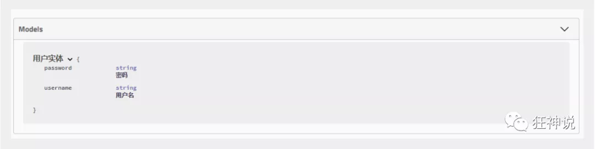
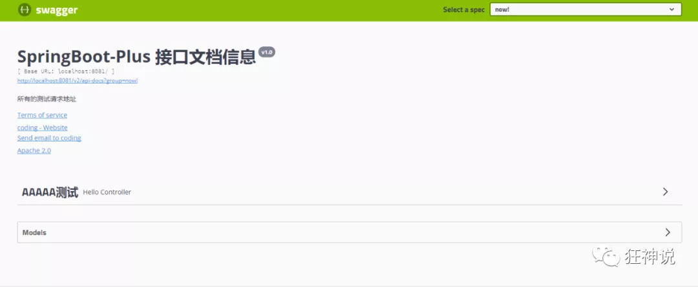
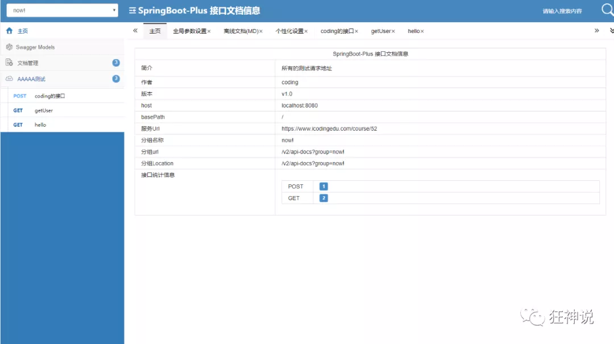
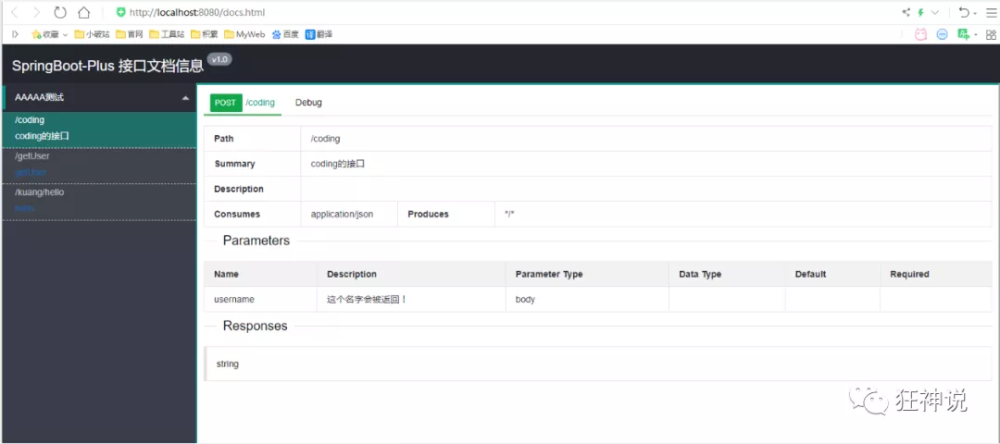
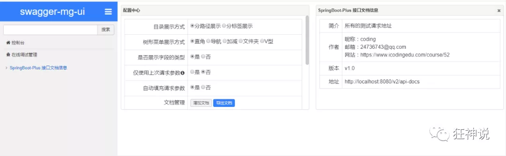

# Swagger

## 简介

**前后端分离**

-   前端 -> 前端控制层、视图层
-   后端 -> 后端控制层、服务层、数据访问层
-   前后端通过API进行交互
-   前后端相对独立且松耦合

**产生的问题**

-   前后端集成，前端或者后端无法做到“及时协商，尽早解决”，最终导致问题集中爆发

**解决方案**

-   首先定义schema [ 计划的提纲 ]，并实时跟踪最新的API，降低集成风险

**Swagger**

-   号称世界上最流行的API框架
-   Restful Api 文档在线自动生成器 => **API 文档 与API 定义同步更新**
-   直接运行，在线测试API
-   支持多种语言 （如：Java，PHP等）
-   官网：https://swagger.io/

## SpringBoot集成Swagger

### 使用Swagger

1.  新建项目

2.  导入依赖

    ```xml
    <!-- https://mvnrepository.com/artifact/io.springfox/springfox-swagger2 -->
    <dependency>
       <groupId>io.springfox</groupId>
       <artifactId>springfox-swagger2</artifactId>
       <version>2.9.2</version>
    </dependency>
    <!-- https://mvnrepository.com/artifact/io.springfox/springfox-swagger-ui -->
    <dependency>
       <groupId>io.springfox</groupId>
       <artifactId>springfox-swagger-ui</artifactId>
       <version>2.9.2</version>
    </dependency>
    ```

3.  配置类

    ```java
    @Configuration //配置类
    @EnableSwagger2// 开启Swagger2的自动配置
    public class SwaggerConfig {  
    }
    ```

4.  访问测试 ：http://localhost:8080/swagger-ui.html ，可以看到swagger的界面

### 配置Swagger

```java
@Configuration
@EnableSwagger2
public class SwaggerConfig {
    @Bean//配置docket以配置Swagger具体参数
    public Docket docket(){
        return new Docket(DocumentationType.SWAGGER_2).apiInfo(apiInfo());
    }

    private ApiInfo apiInfo(){
        Contact contact = new Contact("", "", "");//联系人信息
        return new ApiInfo(
                "Api Documentation",// 标题
                "Api Documentation",// 描述
                "v1.0",// 描述
                "urn:tos",//组织链接
                contact,//联系人信息
                "Apache 2.0",//许可
                "http://www.apache.org/licenses/LICENSE-2.0",//许可连接
                new ArrayList<>()//扩展
        );

    }
}
```

### 配置扫描接口

-   通过select配置如何扫描接口

    ```java
    @Bean
    public Docket docket() {
       return new Docket(DocumentationType.SWAGGER_2)
          .apiInfo(apiInfo())
          .select()// 通过.select()方法，去配置扫描接口,RequestHandlerSelectors配置如何扫描接口
          .apis(RequestHandlerSelectors.basePackage("com.demo.swaggertest.controller"))
          .build();
    }
    ```

-   所有的配置方法

    ```
    any() // 扫描所有，项目中的所有接口都会被扫描到
    none() // 不扫描接口
    // 通过方法上的注解扫描，如withMethodAnnotation(GetMapping.class)只扫描get请求
    withMethodAnnotation(final Class<? extends Annotation> annotation)
    // 通过类上的注解扫描，如.withClassAnnotation(Controller.class)只扫描有controller注解的类中的接口
    withClassAnnotation(final Class<? extends Annotation> annotation)
    basePackage(final String basePackage) // 根据包路径扫描接口
    ```

-   配置接口扫描过滤

    ```java
    @Bean
    public Docket docket() {
       return new Docket(DocumentationType.SWAGGER_2)
          .apiInfo(apiInfo())
          .select()// 通过.select()方法，去配置扫描接口,RequestHandlerSelectors配置如何扫描接口
          .apis(RequestHandlerSelectors.basePackage("com.demo.swaggertest.controller"))
           // 配置如何通过path过滤,即这里只扫描请求以/abc开头的接口
          .paths(PathSelectors.ant("/abc/**"))
          .build();
    }
    ```

-   所有过滤方式

    ```
    any() // 任何请求都扫描
    none() // 任何请求都不扫描
    regex(final String pathRegex) // 通过正则表达式控制
    ant(final String antPattern) // 通过ant()控制
    ```

### 配置是否启动

-   通过enable()方法配置是否启用swagger，如果是false，swagger将不能在浏览器中访问了

    ```java
    @Bean
    public Docket docket() {
       return new Docket(DocumentationType.SWAGGER_2)
          .apiInfo(apiInfo())
          .enable(false) //配置是否启用Swagger，如果是false，在浏览器将无法访问
          .select()// 通过.select()方法，去配置扫描接口,RequestHandlerSelectors配置如何扫描接口
          .apis(RequestHandlerSelectors.basePackage("com.demo.swaggertest.controller"))
           // 配置如何通过path过滤,即这里只扫描请求以/abc开头的接口
          .paths(PathSelectors.ant("/abc/**"))
          .build();
    }
    ```

-   动态配置当项目处于test、dev环境时显示swagger，处于prod时不显示

    ```java
    @Bean
    public Docket docket(Environment environment) {
       // 设置要显示swagger的环境
       Profiles of = Profiles.of("dev", "test");
       // 判断当前是否处于该环境
       // 通过 enable() 接收此参数判断是否要显示
       boolean b = environment.acceptsProfiles(of);
       
       return new Docket(DocumentationType.SWAGGER_2)
          .apiInfo(apiInfo())
          .enable(b) //配置是否启用Swagger，如果是false，在浏览器将无法访问
          .select()// 通过.select()方法，去配置扫描接口,RequestHandlerSelectors配置如何扫描接口
          .apis(RequestHandlerSelectors.basePackage("com.demo.swaggertest.controller"))
           // 配置如何通过path过滤,即这里只扫描请求以/abc开头的接口
          .paths(PathSelectors.ant("/abc/**"))
          .build();
    }
    ```

### 配置API分组

-   如果没有配置分组，默认是default。通过groupName()方法即可配置分组：

```java
@Bean
public Docket docket(Environment environment) {
   return new Docket(DocumentationType.SWAGGER_2).apiInfo(apiInfo())
      .groupName("hello") // 配置分组
       // 省略配置....
}
```

-   配置多个分组只需要配置多个docket即可：

```java
@Bean
public Docket docket1(){
   return new Docket(DocumentationType.SWAGGER_2).groupName("group1");
}
@Bean
public Docket docket2(){
   return new Docket(DocumentationType.SWAGGER_2).groupName("group2");
}
@Bean
public Docket docket3(){
   return new Docket(DocumentationType.SWAGGER_2).groupName("group3");
}
```

### 实体类配置

-   新建一个实体类

```java
@ApiModel("用户实体")
public class User {
   @ApiModelProperty("用户名")
   public String username;
   @ApiModelProperty("密码")
   public String password;
}
```

-   只要这个实体在**请求接口**的返回值上（即使是泛型），都能映射到实体项中：

```java
@RequestMapping("/getUser")
public User getUser(){
   return new User();
}
```



**注：并不是因为@ApiModel这个注解让实体显示在这里了，而是只要出现在接口方法的返回值上的实体都会显示在这里，而@ApiModel和@ApiModelProperty这两个注解只是为实体添加注释的。**

@ApiModel为类添加注释

@ApiModelProperty为类属性添加注释

-   常用注解

| Swagger注解                                            | 简单说明                                             |
| ------------------------------------------------------ | ---------------------------------------------------- |
| @Api(tags = "xxx模块说明")                             | 作用在模块类上                                       |
| @ApiOperation("xxx接口说明")                           | 作用在接口方法上                                     |
| @ApiModel("xxxPOJO说明")                               | 作用在模型类上：如VO、BO                             |
| @ApiModelProperty(value = "xxx属性说明",hidden = true) | 作用在类方法和属性上，hidden设置为true可以隐藏该属性 |
| @ApiParam("xxx参数说明")                               | 作用在参数、方法和字段上，类似@ApiModelProperty      |

## Swagger皮肤

我们可以导入不同的包实现不同的皮肤定义：

1、默认的  **访问 http://localhost:8080/swagger-ui.html**

```xml
<dependency>
   <groupId>io.springfox</groupId>
   <artifactId>springfox-swagger-ui</artifactId>
   <version>2.9.2</version>
</dependency>
```



2、bootstrap-ui  **访问 http://localhost:8080/doc.html**

```xml
<!-- 引入swagger-bootstrap-ui包 /doc.html-->
<dependency>
   <groupId>com.github.xiaoymin</groupId>
   <artifactId>swagger-bootstrap-ui</artifactId>
   <version>1.9.1</version>
</dependency>
```



3、Layui-ui  **访问 http://localhost:8080/docs.html**

```xml
<!-- 引入swagger-ui-layer包 /docs.html-->
<dependency>
   <groupId>com.github.caspar-chen</groupId>
   <artifactId>swagger-ui-layer</artifactId>
   <version>1.1.3</version>
</dependency>
```



4、mg-ui  **访问 http://localhost:8080/document.html**

```xml
<!-- 引入swagger-ui-layer包 /document.html-->
<dependency>
   <groupId>com.zyplayer</groupId>
   <artifactId>swagger-mg-ui</artifactId>
   <version>1.0.6</version>
</dependency>
```



