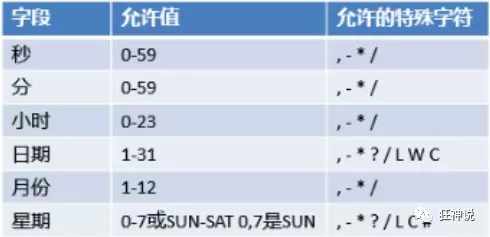
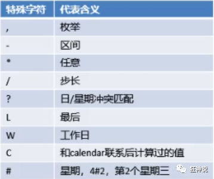
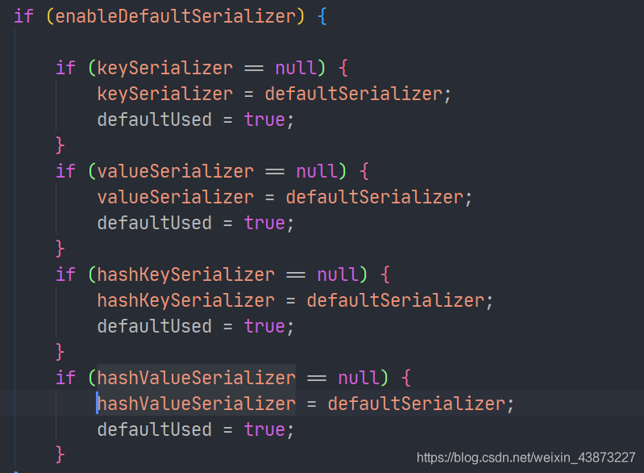
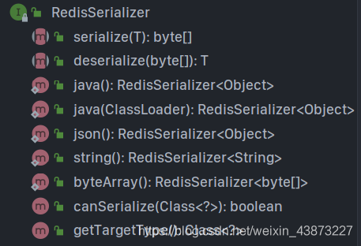
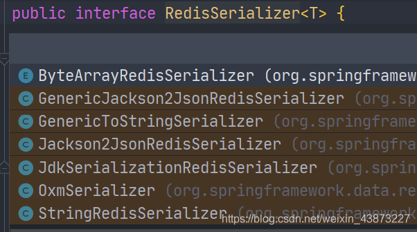

# SpringBoot进阶

## 常用任务

常常会用到异步处理任务，比如我们在网站上发送邮件，后台会去发送邮件，此时前台会造成响应不动，直到邮件发送完毕，响应才会成功，所以我们一般会采用多线程的方式去处理这些任务。还有一些定时任务，比如需要在每天凌晨的时候，分析一次前一天的日志信息。还有就是邮件的发送，其实SpringBoot都给我们提供了对应的支持，我们上手使用十分的简单，只需要开启一些注解支持，配置一些配置文件即可。

### 异步任务

-   Service层

    ```java
    @Service
    public class AsyncService {
        @Async//告诉Spring这是一个异步方法
        public void hello() {
            try {
                Thread.sleep(3000);
            } catch (InterruptedException e) {
                e.printStackTrace();
            }
            System.out.println("waiting...");
        }
    }
    ```

-   Controller层

    ```java
    @RestController
    public class AsyncController {
        @Autowired
        AsyncService asyncService;
        @RequestMapping("/hello")
        public String hello(){
            asyncService.hello();
            return "OK";
        }
    }
    ```

-   主方法开启异步功能

    **SpringBoot就会自己开一个线程池，进行调用**

    ```java
    @EnableAsync
    @SpringBootApplication
    public class TasksApplication {
    
        public static void main(String[] args) {
            SpringApplication.run(TasksApplication.class, args);
        }
    
    }
    ```

### 邮件任务

-   导入依赖

    ```xml
    <dependency>
       <groupId>org.springframework.boot</groupId>
       <artifactId>spring-boot-starter-mail</artifactId>
    </dependency>
    ```

-   配置文件

    ```properties
    spring.mail.username=username@qq.com
    spring.mail.password=password
    spring.mail.host=smtp.qq.com
    #qq邮箱需要配置ssl加密
    spring.mail.properties.mail.smtl.ssl.enable=true
    ```

-   测试发送邮件

    ```java
    @Autowired
    JavaMailSenderImpl mailSender;
    
    @Test
    public void contextLoads() {
       //邮件设置1：一个简单的邮件
       SimpleMailMessage message = new SimpleMailMessage();
       message.setSubject("subject");
       message.setText("content");
    
       message.setTo("userto@qq.com");
       message.setFrom("userfrom@qq.com");
       mailSender.send(message);
    }
    
    @Test
    public void contextLoads2() throws MessagingException {
       //邮件设置2：一个复杂的邮件
       MimeMessage mimeMessage = mailSender.createMimeMessage();
       MimeMessageHelper helper = new MimeMessageHelper(mimeMessage, true);
    
       helper.setSubject("subject");
       helper.setText("<p style='color:red'>content</p>",true);
    
       //发送附件
       helper.addAttachment("1.jpg",new File(""));
       helper.addAttachment("2.jpg",new File(""));
    
       helper.setTo("userto@qq.com");
       helper.setFrom("userfrom@qq.com");
    
       mailSender.send(mimeMessage);
    }
    ```

### 定时任务

项目开发中经常需要执行一些定时任务，比如需要在每天凌晨的时候，分析一次前一天的日志信息，Spring为我们提供了异步执行任务调度的方式，提供了两个接口。

-   TaskExecutor接口
-   TaskScheduler接口

两个注解：

-   @EnableScheduling
-   @Scheduled

**cron表达式：**





1.  创建一个service

    ```java
    @Service
    public class ScheduledService {
       
       //秒   分   时     日   月   周几
       //0 * * * * MON-FRI
       //注意cron表达式的用法；
       @Scheduled(cron = "0 * * * * 0-7")
       public void hello(){
           System.out.println("hello.....");
      }
    }
    ```

2.  在主程序上增加@EnableScheduling 开启定时任务功能

    ```java
    @EnableAsync //开启异步注解功能
    @EnableScheduling //开启基于注解的定时任务
    @SpringBootApplication
    public class SpringbootTaskApplication {
    
       public static void main(String[] args) {
           SpringApplication.run(SpringbootTaskApplication.class, args);
      }
    
    }
    ```

-   常用的cron表达式

    ```
    （1）0/2 * * * * ?   表示每2秒 执行任务
    （1）0 0/2 * * * ?   表示每2分钟 执行任务
    （1）0 0 2 1 * ?   表示在每月的1日的凌晨2点调整任务
    （2）0 15 10 ? * MON-FRI   表示周一到周五每天上午10:15执行作业
    （3）0 15 10 ? 6L 2002-2006   表示2002-2006年的每个月的最后一个星期五上午10:15执行作
    （4）0 0 10,14,16 * * ?   每天上午10点，下午2点，4点
    （5）0 0/30 9-17 * * ?   朝九晚五工作时间内每半小时
    （6）0 0 12 ? * WED   表示每个星期三中午12点
    （7）0 0 12 * * ?   每天中午12点触发
    （8）0 15 10 ? * *   每天上午10:15触发
    （9）0 15 10 * * ?     每天上午10:15触发
    （10）0 15 10 * * ?   每天上午10:15触发
    （11）0 15 10 * * ? 2005   2005年的每天上午10:15触发
    （12）0 * 14 * * ?     在每天下午2点到下午2:59期间的每1分钟触发
    （13）0 0/5 14 * * ?   在每天下午2点到下午2:55期间的每5分钟触发
    （14）0 0/5 14,18 * * ?     在每天下午2点到2:55期间和下午6点到6:55期间的每5分钟触发
    （15）0 0-5 14 * * ?   在每天下午2点到下午2:05期间的每1分钟触发
    （16）0 10,44 14 ? 3 WED   每年三月的星期三的下午2:10和2:44触发
    （17）0 15 10 ? * MON-FRI   周一至周五的上午10:15触发
    （18）0 15 10 15 * ?   每月15日上午10:15触发
    （19）0 15 10 L * ?   每月最后一日的上午10:15触发
    （20）0 15 10 ? * 6L   每月的最后一个星期五上午10:15触发
    （21）0 15 10 ? * 6L 2002-2005   2002年至2005年的每月的最后一个星期五上午10:15触发
    （22）0 15 10 ? * 6#3   每月的第三个星期五上午10:15触发
    ```

    

## SpringBoot整合Redis

1.  导入依赖

    ```xml
    <dependency>
        <groupId>org.springframework.boot</groupId>
        <artifactId>spring-boot-starter-data-redis</artifactId>
    </dependency>
    ```

    springboot 2.x后 ，原来使用的 Jedis 被 lettuce 替换。

    >   jedis：采用的直连，多个线程操作的话，是不安全的。如果要避免不安全，使用jedis pool连接池！更像BIO模式
    >
    >   lettuce：采用netty，实例可以在多个线程中共享，不存在线程不安全的情况！可以减少线程数据了，更像NIO模式

2.  编写配置文件

    ```properties
    spring.redis.host=127.0.0.1
    spring.redis.port=6379
    ```

3.  测试

    ```java
    @SpringBootTest
    class RedisApplicationTests {
    
        @Autowired
        private RedisTemplate redisTemplate;
    
        @Test
        void contextLoads() {
            // redisTemplate 操作不同的数据类型，api和我们的指令是一样的
            // opsForValue 操作字符串 类似String
            // opsForList 操作List 类似List
            // opsForHah
    
            // 除了基本的操作，我们常用的方法都可以直接通过redisTemplate操作，比如事务和基本的CRUD
    
            // 获取连接对象
            //RedisConnection connection = redisTemplate.getConnectionFactory().getConnection();
            //connection.flushDb();
            //connection.flushAll();
    
            redisTemplate.opsForValue().set("key1","value1");
            System.out.println(redisTemplate.opsForValue().get("key1"));
        }
    
    }
    ```

    默认的序列化器是采用JDK序列化器

    

    而默认的RedisTemplate中的所有序列化器都是使用这个序列化器：

    

    后续我们定制RedisTemplate就可以对其进行修改。

    `RedisSerializer`提供了多种序列化方案：

    -   直接调用RedisSerializer的静态方法来返回序列化器，然后set

        

    -   自己new 相应的实现类，然后set

        

4.  自己编写RedisTemplate模板

    ```java
    @Configuration
    public class RedisConfig {
    
       @Bean
        public RedisTemplate<String, Object> redisTemplate(RedisConnectionFactory redisConnectionFactory) throws UnknownHostException {
            // 将template 泛型设置为 <String, Object>
            RedisTemplate<String, Object> template = new RedisTemplate();
            // 连接工厂，不必修改
            template.setConnectionFactory(redisConnectionFactory);
            /*
             * 序列化设置
             */
            // key、hash的key 采用 String序列化方式
            template.setKeySerializer(RedisSerializer.string());
            template.setHashKeySerializer(RedisSerializer.string());
            // value、hash的value 采用 Jackson 序列化方式
            template.setValueSerializer(RedisSerializer.json());
            template.setHashValueSerializer(RedisSerializer.json());
            template.afterPropertiesSet();
            
            return template;
        }
    }
    ```

5.  自定义Redis工具类

    >   https://www.cnblogs.com/zhzhlong/p/11434284.html

    ```java
    import org.springframework.data.redis.connection.DataType;
    import org.springframework.data.redis.core.Cursor;
    import org.springframework.data.redis.core.ScanOptions;
    import org.springframework.data.redis.core.StringRedisTemplate;
    import org.springframework.data.redis.core.ZSetOperations.TypedTuple;
    
    import java.util.Collection;
    import java.util.Date;
    import java.util.List;
    import java.util.Map;
    import java.util.Map.Entry;
    import java.util.Set;
    import java.util.concurrent.TimeUnit;
    
    /**
     * Redis工具类*/
    public class RedisUtil {
        private StringRedisTemplate redisTemplate;
    
        public void setRedisTemplate(StringRedisTemplate redisTemplate) {
            this.redisTemplate = redisTemplate;
        }
    
        public StringRedisTemplate getRedisTemplate() {
            return this.redisTemplate;
        }
    
        /** -------------------key相关操作--------------------- */
    
        /**
         * 删除key
         * 
         * @param key
         */
        public void delete(String key) {
            redisTemplate.delete(key);
        }
    
        /**
         * 批量删除key
         * 
         * @param keys
         */
        public void delete(Collection<String> keys) {
            redisTemplate.delete(keys);
        }
    
        /**
         * 序列化key
         * 
         * @param key
         * @return
         */
        public byte[] dump(String key) {
            return redisTemplate.dump(key);
        }
    
        /**
         * 是否存在key
         * 
         * @param key
         * @return
         */
        public Boolean hasKey(String key) {
            return redisTemplate.hasKey(key);
        }
    
        /**
         * 设置过期时间
         * 
         * @param key
         * @param timeout
         * @param unit
         * @return
         */
        public Boolean expire(String key, long timeout, TimeUnit unit) {
            return redisTemplate.expire(key, timeout, unit);
        }
    
        /**
         * 设置过期时间
         * 
         * @param key
         * @param date
         * @return
         */
        public Boolean expireAt(String key, Date date) {
            return redisTemplate.expireAt(key, date);
        }
    
        /**
         * 查找匹配的key
         * 
         * @param pattern
         * @return
         */
        public Set<String> keys(String pattern) {
            return redisTemplate.keys(pattern);
        }
    
        /**
         * 将当前数据库的 key 移动到给定的数据库 db 当中
         * 
         * @param key
         * @param dbIndex
         * @return
         */
        public Boolean move(String key, int dbIndex) {
            return redisTemplate.move(key, dbIndex);
        }
    
        /**
         * 移除 key 的过期时间，key 将持久保持
         * 
         * @param key
         * @return
         */
        public Boolean persist(String key) {
            return redisTemplate.persist(key);
        }
    
        /**
         * 返回 key 的剩余的过期时间
         * 
         * @param key
         * @param unit
         * @return
         */
        public Long getExpire(String key, TimeUnit unit) {
            return redisTemplate.getExpire(key, unit);
        }
    
        /**
         * 返回 key 的剩余的过期时间
         * 
         * @param key
         * @return
         */
        public Long getExpire(String key) {
            return redisTemplate.getExpire(key);
        }
    
        /**
         * 从当前数据库中随机返回一个 key
         * 
         * @return
         */
        public String randomKey() {
            return redisTemplate.randomKey();
        }
    
        /**
         * 修改 key 的名称
         * 
         * @param oldKey
         * @param newKey
         */
        public void rename(String oldKey, String newKey) {
            redisTemplate.rename(oldKey, newKey);
        }
    
        /**
         * 仅当 newkey 不存在时，将 oldKey 改名为 newkey
         * 
         * @param oldKey
         * @param newKey
         * @return
         */
        public Boolean renameIfAbsent(String oldKey, String newKey) {
            return redisTemplate.renameIfAbsent(oldKey, newKey);
        }
    
        /**
         * 返回 key 所储存的值的类型
         * 
         * @param key
         * @return
         */
        public DataType type(String key) {
            return redisTemplate.type(key);
        }
    
        /** -------------------string相关操作--------------------- */
    
        /**
         * 设置指定 key 的值
         * @param key
         * @param value
         */
        public void set(String key, String value) {
            redisTemplate.opsForValue().set(key, value);
        }
    
        /**
         * 获取指定 key 的值
         * @param key
         * @return
         */
        public String get(String key) {
            return redisTemplate.opsForValue().get(key);
        }
    
        /**
         * 返回 key 中字符串值的子字符
         * @param key
         * @param start
         * @param end
         * @return
         */
        public String getRange(String key, long start, long end) {
            return redisTemplate.opsForValue().get(key, start, end);
        }
    
        /**
         * 将给定 key 的值设为 value ，并返回 key 的旧值(old value)
         * 
         * @param key
         * @param value
         * @return
         */
        public String getAndSet(String key, String value) {
            return redisTemplate.opsForValue().getAndSet(key, value);
        }
    
        /**
         * 对 key 所储存的字符串值，获取指定偏移量上的位(bit)
         * 
         * @param key
         * @param offset
         * @return
         */
        public Boolean getBit(String key, long offset) {
            return redisTemplate.opsForValue().getBit(key, offset);
        }
    
        /**
         * 批量获取
         * 
         * @param keys
         * @return
         */
        public List<String> multiGet(Collection<String> keys) {
            return redisTemplate.opsForValue().multiGet(keys);
        }
    
        /**
         * 设置ASCII码, 字符串'a'的ASCII码是97, 转为二进制是'01100001', 此方法是将二进制第offset位值变为value
         * 
         * @param key 位置
         * @param value
         *            值,true为1, false为0
         * @return
         */
        public boolean setBit(String key, long offset, boolean value) {
            return redisTemplate.opsForValue().setBit(key, offset, value);
        }
    
        /**
         * 将值 value 关联到 key ，并将 key 的过期时间设为 timeout
         * 
         * @param key
         * @param value
         * @param timeout
         *            过期时间
         * @param unit
         *            时间单位, 天:TimeUnit.DAYS 小时:TimeUnit.HOURS 分钟:TimeUnit.MINUTES
         *            秒:TimeUnit.SECONDS 毫秒:TimeUnit.MILLISECONDS
         */
        public void setEx(String key, String value, long timeout, TimeUnit unit) {
            redisTemplate.opsForValue().set(key, value, timeout, unit);
        }
    
        /**
         * 只有在 key 不存在时设置 key 的值
         * 
         * @param key
         * @param value
         * @return 之前已经存在返回false,不存在返回true
         */
        public boolean setIfAbsent(String key, String value) {
            return redisTemplate.opsForValue().setIfAbsent(key, value);
        }
    
        /**
         * 用 value 参数覆写给定 key 所储存的字符串值，从偏移量 offset 开始
         * 
         * @param key
         * @param value
         * @param offset
         *            从指定位置开始覆写
         */
        public void setRange(String key, String value, long offset) {
            redisTemplate.opsForValue().set(key, value, offset);
        }
    
        /**
         * 获取字符串的长度
         * 
         * @param key
         * @return
         */
        public Long size(String key) {
            return redisTemplate.opsForValue().size(key);
        }
    
        /**
         * 批量添加
         * 
         * @param maps
         */
        public void multiSet(Map<String, String> maps) {
            redisTemplate.opsForValue().multiSet(maps);
        }
    
        /**
         * 同时设置一个或多个 key-value 对，当且仅当所有给定 key 都不存在
         * 
         * @param maps
         * @return 之前已经存在返回false,不存在返回true
         */
        public boolean multiSetIfAbsent(Map<String, String> maps) {
            return redisTemplate.opsForValue().multiSetIfAbsent(maps);
        }
    
        /**
         * 增加(自增长), 负数则为自减
         * 
         * @param key
         * @return
         */
        public Long incrBy(String key, long increment) {
            return redisTemplate.opsForValue().increment(key, increment);
        }
    
        /**
         * 
         * @param key
         * @return
         */
        public Double incrByFloat(String key, double increment) {
            return redisTemplate.opsForValue().increment(key, increment);
        }
    
        /**
         * 追加到末尾
         * 
         * @param key
         * @param value
         * @return
         */
        public Integer append(String key, String value) {
            return redisTemplate.opsForValue().append(key, value);
        }
    
        /** -------------------hash相关操作------------------------- */
    
        /**
         * 获取存储在哈希表中指定字段的值
         * 
         * @param key
         * @param field
         * @return
         */
        public Object hGet(String key, String field) {
            return redisTemplate.opsForHash().get(key, field);
        }
    
        /**
         * 获取所有给定字段的值
         * 
         * @param key
         * @return
         */
        public Map<Object, Object> hGetAll(String key) {
            return redisTemplate.opsForHash().entries(key);
        }
    
        /**
         * 获取所有给定字段的值
         * 
         * @param key
         * @param fields
         * @return
         */
        public List<Object> hMultiGet(String key, Collection<Object> fields) {
            return redisTemplate.opsForHash().multiGet(key, fields);
        }
    
        public void hPut(String key, String hashKey, String value) {
            redisTemplate.opsForHash().put(key, hashKey, value);
        }
    
        public void hPutAll(String key, Map<String, String> maps) {
            redisTemplate.opsForHash().putAll(key, maps);
        }
    
        /**
         * 仅当hashKey不存在时才设置
         * 
         * @param key
         * @param hashKey
         * @param value
         * @return
         */
        public Boolean hPutIfAbsent(String key, String hashKey, String value) {
            return redisTemplate.opsForHash().putIfAbsent(key, hashKey, value);
        }
    
        /**
         * 删除一个或多个哈希表字段
         * 
         * @param key
         * @param fields
         * @return
         */
        public Long hDelete(String key, Object... fields) {
            return redisTemplate.opsForHash().delete(key, fields);
        }
    
        /**
         * 查看哈希表 key 中，指定的字段是否存在
         * 
         * @param key
         * @param field
         * @return
         */
        public boolean hExists(String key, String field) {
            return redisTemplate.opsForHash().hasKey(key, field);
        }
    
        /**
         * 为哈希表 key 中的指定字段的整数值加上增量 increment
         * 
         * @param key
         * @param field
         * @param increment
         * @return
         */
        public Long hIncrBy(String key, Object field, long increment) {
            return redisTemplate.opsForHash().increment(key, field, increment);
        }
    
        /**
         * 为哈希表 key 中的指定字段的整数值加上增量 increment
         * 
         * @param key
         * @param field
         * @param delta
         * @return
         */
        public Double hIncrByFloat(String key, Object field, double delta) {
            return redisTemplate.opsForHash().increment(key, field, delta);
        }
    
        /**
         * 获取所有哈希表中的字段
         * 
         * @param key
         * @return
         */
        public Set<Object> hKeys(String key) {
            return redisTemplate.opsForHash().keys(key);
        }
    
        /**
         * 获取哈希表中字段的数量
         * 
         * @param key
         * @return
         */
        public Long hSize(String key) {
            return redisTemplate.opsForHash().size(key);
        }
    
        /**
         * 获取哈希表中所有值
         * 
         * @param key
         * @return
         */
        public List<Object> hValues(String key) {
            return redisTemplate.opsForHash().values(key);
        }
    
        /**
         * 迭代哈希表中的键值对
         * 
         * @param key
         * @param options
         * @return
         */
        public Cursor<Entry<Object, Object>> hScan(String key, ScanOptions options) {
            return redisTemplate.opsForHash().scan(key, options);
        }
    
        /** ------------------------list相关操作---------------------------- */
    
        /**
         * 通过索引获取列表中的元素
         * 
         * @param key
         * @param index
         * @return
         */
        public String lIndex(String key, long index) {
            return redisTemplate.opsForList().index(key, index);
        }
    
        /**
         * 获取列表指定范围内的元素
         * 
         * @param key
         * @param start
         *            开始位置, 0是开始位置
         * @param end
         *            结束位置, -1返回所有
         * @return
         */
        public List<String> lRange(String key, long start, long end) {
            return redisTemplate.opsForList().range(key, start, end);
        }
    
        /**
         * 存储在list头部
         * 
         * @param key
         * @param value
         * @return
         */
        public Long lLeftPush(String key, String value) {
            return redisTemplate.opsForList().leftPush(key, value);
        }
    
        /**
         * 
         * @param key
         * @param value
         * @return
         */
        public Long lLeftPushAll(String key, String... value) {
            return redisTemplate.opsForList().leftPushAll(key, value);
        }
    
        /**
         * 
         * @param key
         * @param value
         * @return
         */
        public Long lLeftPushAll(String key, Collection<String> value) {
            return redisTemplate.opsForList().leftPushAll(key, value);
        }
    
        /**
         * 当list存在的时候才加入
         * 
         * @param key
         * @param value
         * @return
         */
        public Long lLeftPushIfPresent(String key, String value) {
            return redisTemplate.opsForList().leftPushIfPresent(key, value);
        }
    
        /**
         * 如果pivot存在,再pivot前面添加
         * 
         * @param key
         * @param pivot
         * @param value
         * @return
         */
        public Long lLeftPush(String key, String pivot, String value) {
            return redisTemplate.opsForList().leftPush(key, pivot, value);
        }
    
        /**
         * 
         * @param key
         * @param value
         * @return
         */
        public Long lRightPush(String key, String value) {
            return redisTemplate.opsForList().rightPush(key, value);
        }
    
        /**
         * 
         * @param key
         * @param value
         * @return
         */
        public Long lRightPushAll(String key, String... value) {
            return redisTemplate.opsForList().rightPushAll(key, value);
        }
    
        /**
         * 
         * @param key
         * @param value
         * @return
         */
        public Long lRightPushAll(String key, Collection<String> value) {
            return redisTemplate.opsForList().rightPushAll(key, value);
        }
    
        /**
         * 为已存在的列表添加值
         * 
         * @param key
         * @param value
         * @return
         */
        public Long lRightPushIfPresent(String key, String value) {
            return redisTemplate.opsForList().rightPushIfPresent(key, value);
        }
    
        /**
         * 在pivot元素的右边添加值
         * 
         * @param key
         * @param pivot
         * @param value
         * @return
         */
        public Long lRightPush(String key, String pivot, String value) {
            return redisTemplate.opsForList().rightPush(key, pivot, value);
        }
    
        /**
         * 通过索引设置列表元素的值
         * 
         * @param key
         * @param index
         *            位置
         * @param value
         */
        public void lSet(String key, long index, String value) {
            redisTemplate.opsForList().set(key, index, value);
        }
    
        /**
         * 移出并获取列表的第一个元素
         * 
         * @param key
         * @return 删除的元素
         */
        public String lLeftPop(String key) {
            return redisTemplate.opsForList().leftPop(key);
        }
    
        /**
         * 移出并获取列表的第一个元素， 如果列表没有元素会阻塞列表直到等待超时或发现可弹出元素为止
         * 
         * @param key
         * @param timeout
         *            等待时间
         * @param unit
         *            时间单位
         * @return
         */
        public String lBLeftPop(String key, long timeout, TimeUnit unit) {
            return redisTemplate.opsForList().leftPop(key, timeout, unit);
        }
    
        /**
         * 移除并获取列表最后一个元素
         * 
         * @param key
         * @return 删除的元素
         */
        public String lRightPop(String key) {
            return redisTemplate.opsForList().rightPop(key);
        }
    
        /**
         * 移出并获取列表的最后一个元素， 如果列表没有元素会阻塞列表直到等待超时或发现可弹出元素为止
         * 
         * @param key
         * @param timeout
         *            等待时间
         * @param unit
         *            时间单位
         * @return
         */
        public String lBRightPop(String key, long timeout, TimeUnit unit) {
            return redisTemplate.opsForList().rightPop(key, timeout, unit);
        }
    
        /**
         * 移除列表的最后一个元素，并将该元素添加到另一个列表并返回
         * 
         * @param sourceKey
         * @param destinationKey
         * @return
         */
        public String lRightPopAndLeftPush(String sourceKey, String destinationKey) {
            return redisTemplate.opsForList().rightPopAndLeftPush(sourceKey,
                    destinationKey);
        }
    
        /**
         * 从列表中弹出一个值，将弹出的元素插入到另外一个列表中并返回它； 如果列表没有元素会阻塞列表直到等待超时或发现可弹出元素为止
         * 
         * @param sourceKey
         * @param destinationKey
         * @param timeout
         * @param unit
         * @return
         */
        public String lBRightPopAndLeftPush(String sourceKey, String destinationKey,
                long timeout, TimeUnit unit) {
            return redisTemplate.opsForList().rightPopAndLeftPush(sourceKey,
                    destinationKey, timeout, unit);
        }
    
        /**
         * 删除集合中值等于value得元素
         * 
         * @param key
         * @param index
         *            index=0, 删除所有值等于value的元素; index>0, 从头部开始删除第一个值等于value的元素;
         *            index<0, 从尾部开始删除第一个值等于value的元素;
         * @param value
         * @return
         */
        public Long lRemove(String key, long index, String value) {
            return redisTemplate.opsForList().remove(key, index, value);
        }
    
        /**
         * 裁剪list
         * 
         * @param key
         * @param start
         * @param end
         */
        public void lTrim(String key, long start, long end) {
            redisTemplate.opsForList().trim(key, start, end);
        }
    
        /**
         * 获取列表长度
         * 
         * @param key
         * @return
         */
        public Long lLen(String key) {
            return redisTemplate.opsForList().size(key);
        }
    
        /** --------------------set相关操作-------------------------- */
    
        /**
         * set添加元素
         * 
         * @param key
         * @param values
         * @return
         */
        public Long sAdd(String key, String... values) {
            return redisTemplate.opsForSet().add(key, values);
        }
    
        /**
         * set移除元素
         * 
         * @param key
         * @param values
         * @return
         */
        public Long sRemove(String key, Object... values) {
            return redisTemplate.opsForSet().remove(key, values);
        }
    
        /**
         * 移除并返回集合的一个随机元素
         * 
         * @param key
         * @return
         */
        public String sPop(String key) {
            return redisTemplate.opsForSet().pop(key);
        }
    
        /**
         * 将元素value从一个集合移到另一个集合
         * 
         * @param key
         * @param value
         * @param destKey
         * @return
         */
        public Boolean sMove(String key, String value, String destKey) {
            return redisTemplate.opsForSet().move(key, value, destKey);
        }
    
        /**
         * 获取集合的大小
         * 
         * @param key
         * @return
         */
        public Long sSize(String key) {
            return redisTemplate.opsForSet().size(key);
        }
    
        /**
         * 判断集合是否包含value
         * 
         * @param key
         * @param value
         * @return
         */
        public Boolean sIsMember(String key, Object value) {
            return redisTemplate.opsForSet().isMember(key, value);
        }
    
        /**
         * 获取两个集合的交集
         * 
         * @param key
         * @param otherKey
         * @return
         */
        public Set<String> sIntersect(String key, String otherKey) {
            return redisTemplate.opsForSet().intersect(key, otherKey);
        }
    
        /**
         * 获取key集合与多个集合的交集
         * 
         * @param key
         * @param otherKeys
         * @return
         */
        public Set<String> sIntersect(String key, Collection<String> otherKeys) {
            return redisTemplate.opsForSet().intersect(key, otherKeys);
        }
    
        /**
         * key集合与otherKey集合的交集存储到destKey集合中
         * 
         * @param key
         * @param otherKey
         * @param destKey
         * @return
         */
        public Long sIntersectAndStore(String key, String otherKey, String destKey) {
            return redisTemplate.opsForSet().intersectAndStore(key, otherKey,
                    destKey);
        }
    
        /**
         * key集合与多个集合的交集存储到destKey集合中
         * 
         * @param key
         * @param otherKeys
         * @param destKey
         * @return
         */
        public Long sIntersectAndStore(String key, Collection<String> otherKeys,
                String destKey) {
            return redisTemplate.opsForSet().intersectAndStore(key, otherKeys,
                    destKey);
        }
    
        /**
         * 获取两个集合的并集
         * 
         * @param key
         * @param otherKeys
         * @return
         */
        public Set<String> sUnion(String key, String otherKeys) {
            return redisTemplate.opsForSet().union(key, otherKeys);
        }
    
        /**
         * 获取key集合与多个集合的并集
         * 
         * @param key
         * @param otherKeys
         * @return
         */
        public Set<String> sUnion(String key, Collection<String> otherKeys) {
            return redisTemplate.opsForSet().union(key, otherKeys);
        }
    
        /**
         * key集合与otherKey集合的并集存储到destKey中
         * 
         * @param key
         * @param otherKey
         * @param destKey
         * @return
         */
        public Long sUnionAndStore(String key, String otherKey, String destKey) {
            return redisTemplate.opsForSet().unionAndStore(key, otherKey, destKey);
        }
    
        /**
         * key集合与多个集合的并集存储到destKey中
         * 
         * @param key
         * @param otherKeys
         * @param destKey
         * @return
         */
        public Long sUnionAndStore(String key, Collection<String> otherKeys,
                String destKey) {
            return redisTemplate.opsForSet().unionAndStore(key, otherKeys, destKey);
        }
    
        /**
         * 获取两个集合的差集
         * 
         * @param key
         * @param otherKey
         * @return
         */
        public Set<String> sDifference(String key, String otherKey) {
            return redisTemplate.opsForSet().difference(key, otherKey);
        }
    
        /**
         * 获取key集合与多个集合的差集
         * 
         * @param key
         * @param otherKeys
         * @return
         */
        public Set<String> sDifference(String key, Collection<String> otherKeys) {
            return redisTemplate.opsForSet().difference(key, otherKeys);
        }
    
        /**
         * key集合与otherKey集合的差集存储到destKey中
         * 
         * @param key
         * @param otherKey
         * @param destKey
         * @return
         */
        public Long sDifference(String key, String otherKey, String destKey) {
            return redisTemplate.opsForSet().differenceAndStore(key, otherKey,
                    destKey);
        }
    
        /**
         * key集合与多个集合的差集存储到destKey中
         * 
         * @param key
         * @param otherKeys
         * @param destKey
         * @return
         */
        public Long sDifference(String key, Collection<String> otherKeys,
                String destKey) {
            return redisTemplate.opsForSet().differenceAndStore(key, otherKeys,
                    destKey);
        }
    
        /**
         * 获取集合所有元素
         * 
         * @param key
         * @return
         */
        public Set<String> setMembers(String key) {
            return redisTemplate.opsForSet().members(key);
        }
    
        /**
         * 随机获取集合中的一个元素
         * 
         * @param key
         * @return
         */
        public String sRandomMember(String key) {
            return redisTemplate.opsForSet().randomMember(key);
        }
    
        /**
         * 随机获取集合中count个元素
         * 
         * @param key
         * @param count
         * @return
         */
        public List<String> sRandomMembers(String key, long count) {
            return redisTemplate.opsForSet().randomMembers(key, count);
        }
    
        /**
         * 随机获取集合中count个元素并且去除重复的
         * 
         * @param key
         * @param count
         * @return
         */
        public Set<String> sDistinctRandomMembers(String key, long count) {
            return redisTemplate.opsForSet().distinctRandomMembers(key, count);
        }
    
        /**
         * 
         * @param key
         * @param options
         * @return
         */
        public Cursor<String> sScan(String key, ScanOptions options) {
            return redisTemplate.opsForSet().scan(key, options);
        }
    
        /**------------------zSet相关操作--------------------------------*/
        
        /**
         * 添加元素,有序集合是按照元素的score值由小到大排列
         * 
         * @param key
         * @param value
         * @param score
         * @return
         */
        public Boolean zAdd(String key, String value, double score) {
            return redisTemplate.opsForZSet().add(key, value, score);
        }
    
        /**
         * 
         * @param key
         * @param values
         * @return
         */
        public Long zAdd(String key, Set<TypedTuple<String>> values) {
            return redisTemplate.opsForZSet().add(key, values);
        }
    
        /**
         * 
         * @param key
         * @param values
         * @return
         */
        public Long zRemove(String key, Object... values) {
            return redisTemplate.opsForZSet().remove(key, values);
        }
    
        /**
         * 增加元素的score值，并返回增加后的值
         * 
         * @param key
         * @param value
         * @param delta
         * @return
         */
        public Double zIncrementScore(String key, String value, double delta) {
            return redisTemplate.opsForZSet().incrementScore(key, value, delta);
        }
    
        /**
         * 返回元素在集合的排名,有序集合是按照元素的score值由小到大排列
         * 
         * @param key
         * @param value
         * @return 0表示第一位
         */
        public Long zRank(String key, Object value) {
            return redisTemplate.opsForZSet().rank(key, value);
        }
    
        /**
         * 返回元素在集合的排名,按元素的score值由大到小排列
         * 
         * @param key
         * @param value
         * @return
         */
        public Long zReverseRank(String key, Object value) {
            return redisTemplate.opsForZSet().reverseRank(key, value);
        }
    
        /**
         * 获取集合的元素, 从小到大排序
         * 
         * @param key
         * @param start
         *            开始位置
         * @param end
         *            结束位置, -1查询所有
         * @return
         */
        public Set<String> zRange(String key, long start, long end) {
            return redisTemplate.opsForZSet().range(key, start, end);
        }
    
        /**
         * 获取集合元素, 并且把score值也获取
         * 
         * @param key
         * @param start
         * @param end
         * @return
         */
        public Set<TypedTuple<String>> zRangeWithScores(String key, long start,
                long end) {
            return redisTemplate.opsForZSet().rangeWithScores(key, start, end);
        }
    
        /**
         * 根据Score值查询集合元素
         * 
         * @param key
         * @param min
         *            最小值
         * @param max
         *            最大值
         * @return
         */
        public Set<String> zRangeByScore(String key, double min, double max) {
            return redisTemplate.opsForZSet().rangeByScore(key, min, max);
        }
    
        /**
         * 根据Score值查询集合元素, 从小到大排序
         * 
         * @param key
         * @param min
         *            最小值
         * @param max
         *            最大值
         * @return
         */
        public Set<TypedTuple<String>> zRangeByScoreWithScores(String key,
                double min, double max) {
            return redisTemplate.opsForZSet().rangeByScoreWithScores(key, min, max);
        }
    
        /**
         * 
         * @param key
         * @param min
         * @param max
         * @param start
         * @param end
         * @return
         */
        public Set<TypedTuple<String>> zRangeByScoreWithScores(String key,
                double min, double max, long start, long end) {
            return redisTemplate.opsForZSet().rangeByScoreWithScores(key, min, max,
                    start, end);
        }
    
        /**
         * 获取集合的元素, 从大到小排序
         * 
         * @param key
         * @param start
         * @param end
         * @return
         */
        public Set<String> zReverseRange(String key, long start, long end) {
            return redisTemplate.opsForZSet().reverseRange(key, start, end);
        }
    
        /**
         * 获取集合的元素, 从大到小排序, 并返回score值
         * 
         * @param key
         * @param start
         * @param end
         * @return
         */
        public Set<TypedTuple<String>> zReverseRangeWithScores(String key,
                long start, long end) {
            return redisTemplate.opsForZSet().reverseRangeWithScores(key, start,
                    end);
        }
    
        /**
         * 根据Score值查询集合元素, 从大到小排序
         * 
         * @param key
         * @param min
         * @param max
         * @return
         */
        public Set<String> zReverseRangeByScore(String key, double min,
                double max) {
            return redisTemplate.opsForZSet().reverseRangeByScore(key, min, max);
        }
    
        /**
         * 根据Score值查询集合元素, 从大到小排序
         * 
         * @param key
         * @param min
         * @param max
         * @return
         */
        public Set<TypedTuple<String>> zReverseRangeByScoreWithScores(
                String key, double min, double max) {
            return redisTemplate.opsForZSet().reverseRangeByScoreWithScores(key,
                    min, max);
        }
    
        /**
         * 
         * @param key
         * @param min
         * @param max
         * @param start
         * @param end
         * @return
         */
        public Set<String> zReverseRangeByScore(String key, double min,
                double max, long start, long end) {
            return redisTemplate.opsForZSet().reverseRangeByScore(key, min, max,
                    start, end);
        }
    
        /**
         * 根据score值获取集合元素数量
         * 
         * @param key
         * @param min
         * @param max
         * @return
         */
        public Long zCount(String key, double min, double max) {
            return redisTemplate.opsForZSet().count(key, min, max);
        }
    
        /**
         * 获取集合大小
         * 
         * @param key
         * @return
         */
        public Long zSize(String key) {
            return redisTemplate.opsForZSet().size(key);
        }
    
        /**
         * 获取集合大小
         * 
         * @param key
         * @return
         */
        public Long zZCard(String key) {
            return redisTemplate.opsForZSet().zCard(key);
        }
    
        /**
         * 获取集合中value元素的score值
         * 
         * @param key
         * @param value
         * @return
         */
        public Double zScore(String key, Object value) {
            return redisTemplate.opsForZSet().score(key, value);
        }
    
        /**
         * 移除指定索引位置的成员
         * 
         * @param key
         * @param start
         * @param end
         * @return
         */
        public Long zRemoveRange(String key, long start, long end) {
            return redisTemplate.opsForZSet().removeRange(key, start, end);
        }
    
        /**
         * 根据指定的score值的范围来移除成员
         * 
         * @param key
         * @param min
         * @param max
         * @return
         */
        public Long zRemoveRangeByScore(String key, double min, double max) {
            return redisTemplate.opsForZSet().removeRangeByScore(key, min, max);
        }
    
        /**
         * 获取key和otherKey的并集并存储在destKey中
         * 
         * @param key
         * @param otherKey
         * @param destKey
         * @return
         */
        public Long zUnionAndStore(String key, String otherKey, String destKey) {
            return redisTemplate.opsForZSet().unionAndStore(key, otherKey, destKey);
        }
    
        /**
         * 
         * @param key
         * @param otherKeys
         * @param destKey
         * @return
         */
        public Long zUnionAndStore(String key, Collection<String> otherKeys,
                String destKey) {
            return redisTemplate.opsForZSet()
                    .unionAndStore(key, otherKeys, destKey);
        }
    
        /**
         * 交集
         * 
         * @param key
         * @param otherKey
         * @param destKey
         * @return
         */
        public Long zIntersectAndStore(String key, String otherKey,
                String destKey) {
            return redisTemplate.opsForZSet().intersectAndStore(key, otherKey,
                    destKey);
        }
    
        /**
         * 交集
         * 
         * @param key
         * @param otherKeys
         * @param destKey
         * @return
         */
        public Long zIntersectAndStore(String key, Collection<String> otherKeys,
                String destKey) {
            return redisTemplate.opsForZSet().intersectAndStore(key, otherKeys,
                    destKey);
        }
    
        /**
         * 
         * @param key
         * @param options
         * @return
         */
        public Cursor<TypedTuple<String>> zScan(String key, ScanOptions options) {
            return redisTemplate.opsForZSet().scan(key, options);
        }
    }
    ```

    