# Dubbo和Zookeeper集成

## 分布式系统

-   分布式系统是若干独立计算机的集合，这些计算机对于用户来说就像单个相关系统。
-   分布式系统是由一组通过网络进行通信、为了完成共同的任务而协调工作的计算机节点组成的系统。分布式系统的出现是为了用廉价的、普通的机器完成单个计算机无法完成的计算、存储任务。其目的是**利用更多的机器，处理更多的数据**。
-   分布式系统（distributed system）是建立在网络之上的软件系统。
-   只有当单个节点的处理能力无法满足日益增长的计算、存储任务的时候，且硬件的提升（加内存、加磁盘、使用更好的CPU）高昂到得不偿失的时候，应用程序也不能进一步优化的时候，我们才需要考虑分布式系统。因为，分布式系统要解决的问题本身就是和单机系统一样的，而由于分布式系统多节点、通过网络通信的拓扑结构，会引入很多单机系统没有的问题，为了解决这些问题又会引入更多的机制、协议，带来更多的问题。

随着互联网的发展，网站应用的规模不断扩大，常规的垂直应用架构已无法应对，分布式服务架构以及流动计算架构势在必行，急需**一个治理系统**确保架构有条不紊的演进。

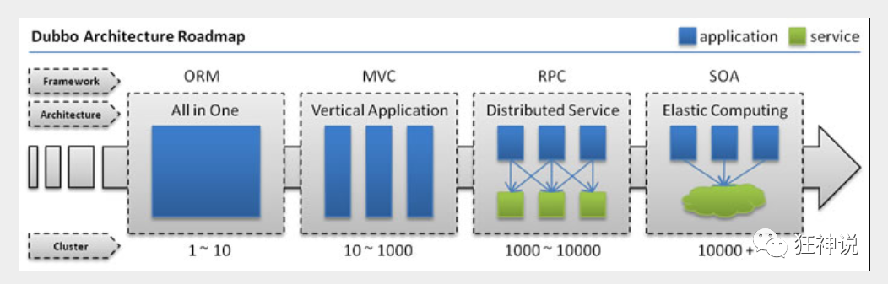

### 单一应用架构

当网站流量很小时，只需一个应用，将所有功能都部署在一起，以减少部署节点和成本。此时，用于简化增删改查工作量的数据访问框架(ORM)是关键。

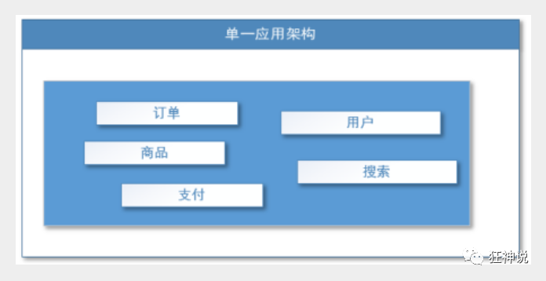

适用于小型网站，小型管理系统，将所有功能都部署到一个功能里，简单易用。

**缺点：**

1.  性能扩展比较难
2.  协同开发问题
3.  不利于升级维护

### 垂直应用架构

当访问量逐渐增大，单一应用增加机器带来的加速度越来越小，将应用拆成互不相干的几个应用，以提升效率。此时，用于加速前端页面开发的Web框架(MVC)是关键。

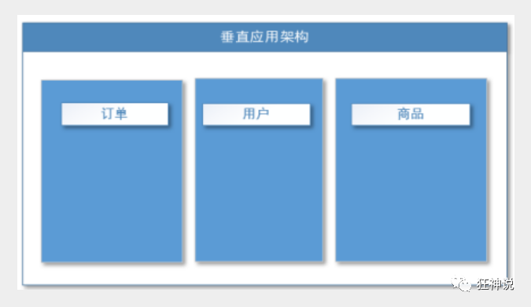

通过切分业务来实现各个模块独立部署，降低了维护和部署的难度，团队各司其职更易管理，性能扩展也更方便，更有针对性。

缺点：公用模块无法重复利用，开发性的浪费

### 分布式服务架构

当垂直应用越来越多，应用之间交互不可避免，将核心业务抽取出来，作为独立的服务，逐渐形成稳定的服务中心，使前端应用能更快速的响应多变的市场需求。此时，用于提高业务复用及整合的**分布式服务框架(RPC)**是关键。

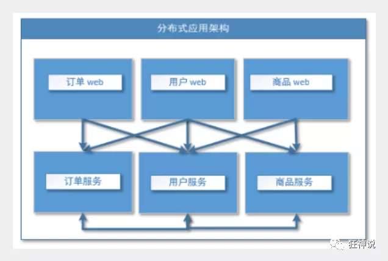

### 流式计算架构

当服务越来越多，容量的评估，小服务资源的浪费等问题逐渐显现，此时需增加一个调度中心基于访问压力实时管理集群容量，提高集群利用率。此时，用于**提高机器利用率的资源调度和治理中心**(SOA)[ Service Oriented Architecture]是关键。

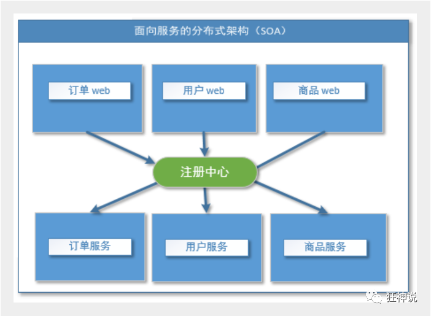

## RPC

RPC【Remote Procedure Call】是指远程过程调用，是一种进程间通信方式，他是一种技术的思想，而不是规范。它允许程序调用另一个地址空间（通常是共享网络的另一台机器上）的过程或函数，而不用程序员显式编码这个远程调用的细节。即程序员无论是调用本地的还是远程的函数，本质上编写的调用代码基本相同。

也就是说两台服务器A，B，一个应用部署在A服务器上，想要调用B服务器上应用提供的函数/方法，由于不在一个内存空间，不能直接调用，需要通过网络来表达调用的语义和传达调用的数据。为什么要用RPC呢？就是无法在一个进程内，甚至一个计算机内通过本地调用的方式完成的需求，比如不同的系统间的通讯，甚至不同的组织间的通讯，由于计算能力需要横向扩展，需要在多台机器组成的集群上部署应用。RPC就是要像调用本地的函数一样去调远程函数；

>   https://www.jianshu.com/p/2accc2840a1b

### 原理

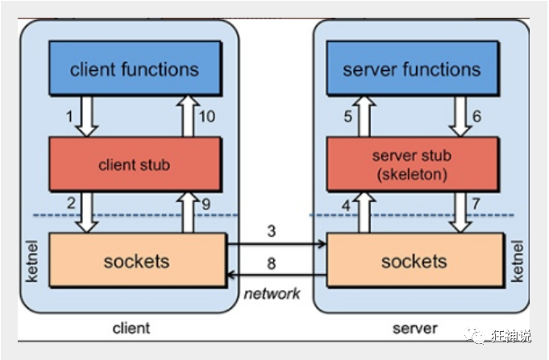

### 组成

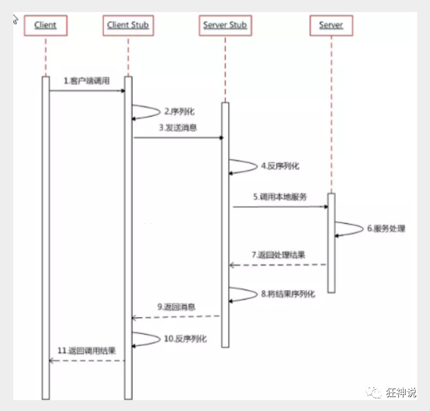

RPC两个模块：

-   通信
-   序列化（数据传输需要转换）

## Dubbo

### 基本概念

Apache Dubbo |ˈdʌbəʊ| 是一款高性能、轻量级的开源Java RPC框架，它提供了三大核心能力：面向接口的远程方法调用，智能容错和负载均衡，以及服务自动注册和发现。

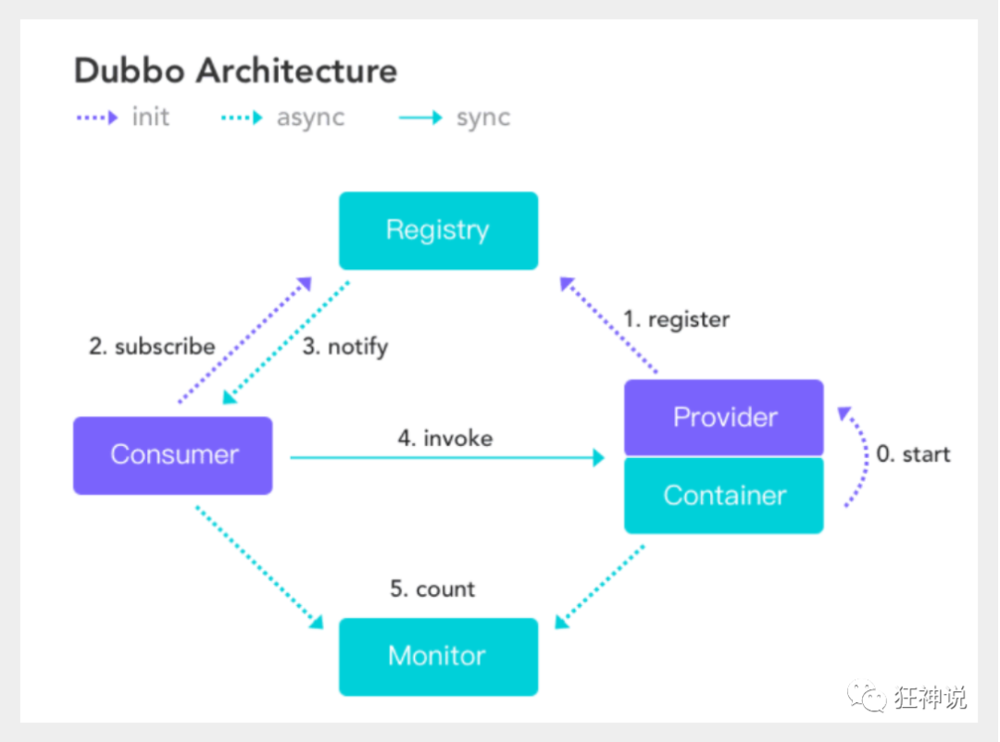

**服务提供者**（Provider）：暴露服务的服务提供方，服务提供者在启动时，向注册中心注册自己提供的服务。

**服务消费者**（Consumer）：调用远程服务的服务消费方，服务消费者在启动时，向注册中心订阅自己所需的服务，服务消费者，从提供者地址列表中，基于软负载均衡算法，选一台提供者进行调用，如果调用失败，再选另一台调用。

**注册中心**（Registry）：注册中心返回服务提供者地址列表给消费者，如果有变更，注册中心将基于长连接推送变更数据给消费者

**监控中心**（Monitor）：服务消费者和提供者，在内存中累计调用次数和调用时间，定时每分钟发送一次统计数据到监控中心

**调用关系说明**

-   服务容器负责启动，加载，运行服务提供者。
-   服务提供者在启动时，向注册中心注册自己提供的服务。
-   服务消费者在启动时，向注册中心订阅自己所需的服务。
-   注册中心返回服务提供者地址列表给消费者，如果有变更，注册中心将基于长连接推送变更数据给消费者。
-   服务消费者，从提供者地址列表中，基于软负载均衡算法，选一台提供者进行调用，如果调用失败，再选另一台调用。
-    服务消费者和提供者，在内存中累计调用次数和调用时间，定时每分钟发送一次统计数据到监控中心。

### 安装并启动zookeeper

***\*ZooKeeper\**服务命令:**

1.  启动ZK服务: sh bin/zkServer.sh start.
2.  查看ZK服务状态: sh bin/zkServer.sh status.
3.  停止ZK服务: sh bin/zkServer.sh stop.
4.  重启ZK服务: sh bin/zkServer.sh restart.

dubbo本身并不是一个服务软件。它其实就是一个jar包，能够帮你的java程序连接到zookeeper，并利用zookeeper消费、提供服务。

但是为了让用户更好的管理监控众多的dubbo服务，官方提供了一个可视化的监控程序dubbo-admin，不过这个监控即使不装也不影响使用。

执行 dubbo-admin\target 下的dubbo-admin-0.0.1-SNAPSHOT.jar

```
java -jar dubbo-admin-0.0.1-SNAPSHOT.jar
```

【注意：zookeeper的服务一定要打开！】

执行完毕，我们去访问一下 http://localhost:7001/ ， 这时候我们需要输入登录账户和密码，我们都是默认的root-root；

登录成功后，查看界面

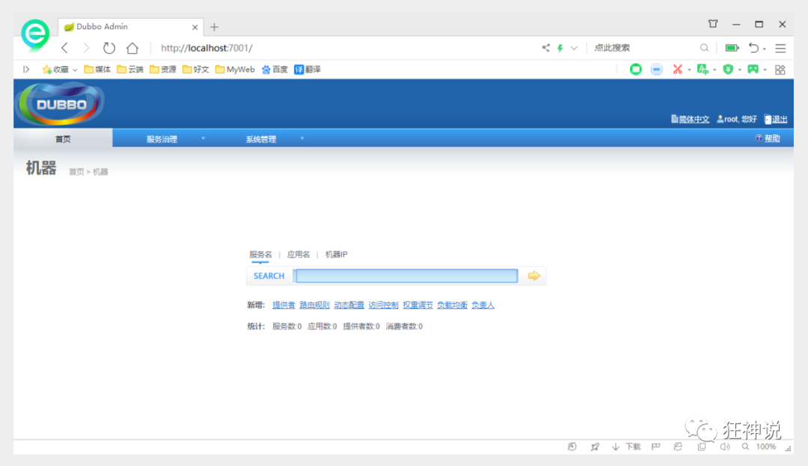

## 整合SpringBoot

### 框架搭建

1.  启动zookeeper

2.  IDEA创建一个Maven项目，并删除src 作为父项目

3.  创建一个模块，实现服务提供者：provider ， 选择web依赖即可

4.  项目创建完毕，我们写一个服务，比如卖票的服务

    编写接口

    ```java
    public interface TicketService {
       public String getTicket();
    }
    ```
    

编写实现类
    
```java
    public class TicketServiceImpl implements TicketService {
       @Override
       public String getTicket() {
           return "【【票】】";
      }
    }
```

5.  创建一个模块，实现服务消费者：consumer ， 选择web依赖即可

6.  项目创建完毕，我们写一个服务，比如用户的服务

    编写service

    ```java
    public class UserService {
       //我们需要去拿去注册中心的服务
    }
    ```

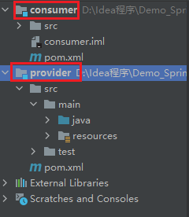

1.  需求：现在我们的用户想使用买票的服务，这要怎么处理

###  服务提供者

1.  将服务提供者注册到注册中心，我们需要整合Dubbo和zookeeper，所以需要导包

    ```xml
    	<!--dubbo-->
    	<!-- https://mvnrepository.com/artifact/org.apache.dubbo/dubbo-spring-boot-starter -->
    	<dependency>
    		<groupId>org.apache.dubbo</groupId>
    		<artifactId>dubbo-spring-boot-starter</artifactId>
    		<version>2.7.7</version>
    	</dependency>
    	<!--ZooKeeper 客户端-->
    	<!-- https://mvnrepository.com/artifact/com.github.sgroschupf/zkclient -->
    	<dependency>
    		<groupId>com.github.sgroschupf</groupId>
    		<artifactId>zkclient</artifactId>
    		<version>0.1</version>
    	</dependency>
    
    	<!--ZooKeeper 服务端-->
    	<dependency>
    		<groupId>org.apache.curator</groupId>
    		<artifactId>curator-framework</artifactId>
    		<version>2.12.0</version>
    	</dependency>
    	<dependency>
    		<groupId>org.apache.curator</groupId>
    		<artifactId>curator-recipes</artifactId>
    		<version>2.12.0</version>
    	</dependency>
    	<!--ZooKeeper-->
    	<dependency>
    		<groupId>org.apache.zookeeper</groupId>
    		<artifactId>zookeeper</artifactId>
    		<version>3.4.14</version>
    		<!--排除这个slf4j-log4j12-->
    		<exclusions>
    			<exclusion>
    				<groupId>org.slf4j</groupId>
    				<artifactId>slf4j-log4j12</artifactId>
    			</exclusion>
    		</exclusions>
    	</dependency>
    
    ```

2.  在springboot配置文件中配置dubbo相关属性

    ```properties
    #服务应用的名字
    dubbo.application.name=provider
    #注册中心地址
    dubbo.registry.address=zookeeper://127.0.0.1:2181
    #哪些服务要被注册
    dubbo.scan.base-packages=com.demo.service
    
    ```

3.  在service的实现类中配置服务注解，发布服务！注意导包问题

    `@Service` 注解，Spring 和 Dubbo 分别有自己的，且名字一样，容易造成导错包，还不知道问题出在哪
    不过在新的版本中 @Service 换成了 `@DubboService`
    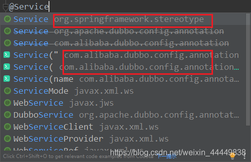

4.  测试
    进入 Dubbo admin 页面查看

    **提示**：如果 zookeeper 的版本过高，会出现 Springboot 连接不上 zookeeper 的情况，可以自行解决，也可以用最省事的办法降版本

    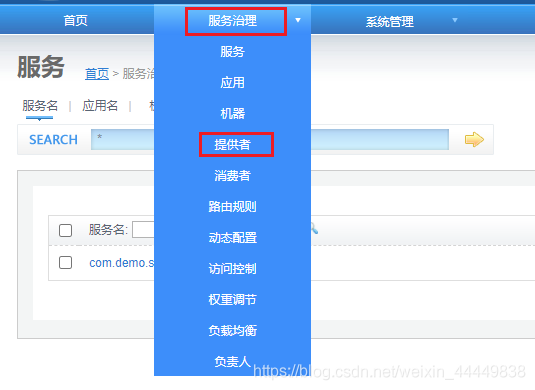
    
    成功

**逻辑理解 ：应用启动起来，dubbo就会扫描指定的包下带有@component注解的服务，将它发布在指定的注册中心中！**

### 服务消费者

1.  导入依赖，和之前的依赖一样

2.  配置参数

    ```properties
    #配置消费者去注册中心取服务，
    #   所以需要暴露自己的名字
    dubbo.application.name=consumer
    #注册中心的地址
    dubbo.registry.address=zookeeper://localhost:2181
    ```
    
3.  本来**正常步骤**是需要将服务提供者的接口打包，然后用pom文件导入
    我们这里**使用简单的方式**，直接将服务的接口拿过来，路径必须保证正确，即和服务提供者相同
    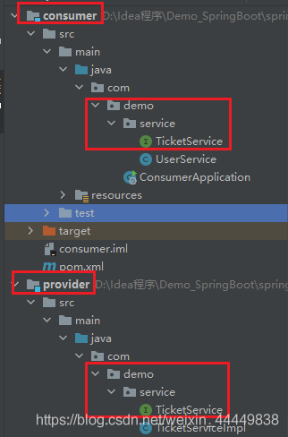

4.  完善消费者的服务类

    ```java
    @Service // 这是 Spring 的注解
    public class UserService {
        // 取注册中心拿到服务
        // 引用 两种方式 ： 1. pom坐标 ； 2. 定义路径相同的接口名
    
        @DubboReference
        TicketService ticketService;
    
        public void buyTickets(){
            String ticket = ticketService.getTicket();
            System.out.println("从注册中心得到 ： "+ticket);
        }
    }
    ```
    
5.  测试类编写

    ```java
    @Autowired
    	UserService userService;
    	@Test
    	void contextLoads() {
    		userService.buyTickets();
    	}
    ```
    
6.  执行测试代码
    **前提（少一个都会报错）** ：
    1、Zookeeper 启动成功
    2、Dubbo 启动成功
    3、启动提供者服务

    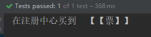

7.  打开 Dubbo.admin 监控中心查看结果

    **前提（少一个都会报错）** ：
    1、Zookeeper 启动成功
    2、Dubbo 启动成功
    3、启动提供者服务
    4、启动消费者服务

    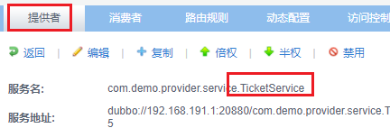
    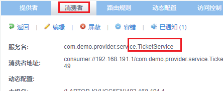

**这就是SpingBoot + dubbo + zookeeper实现分布式开发的应用，其实就是一个服务拆分的思想**

