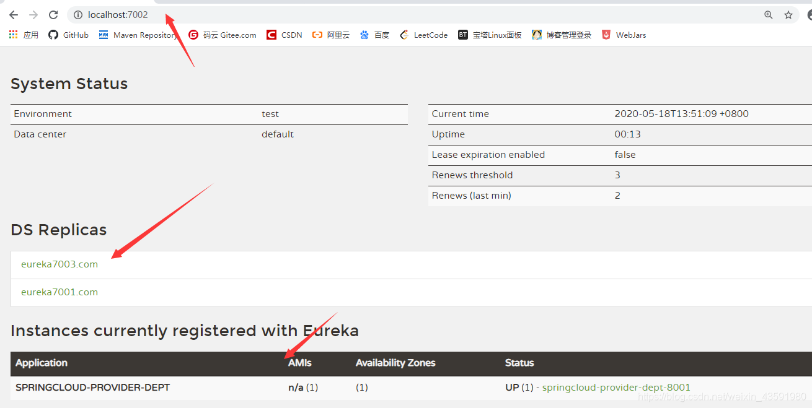
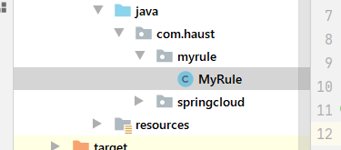
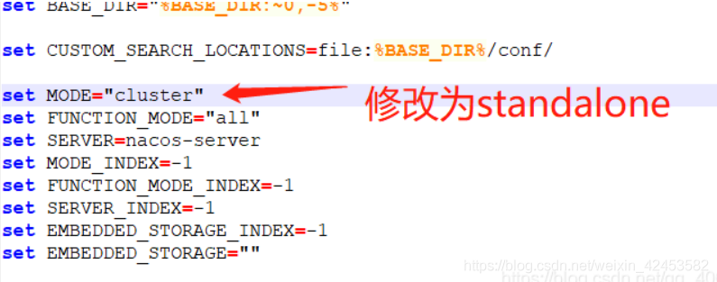
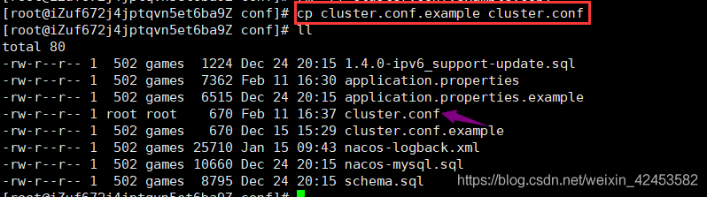
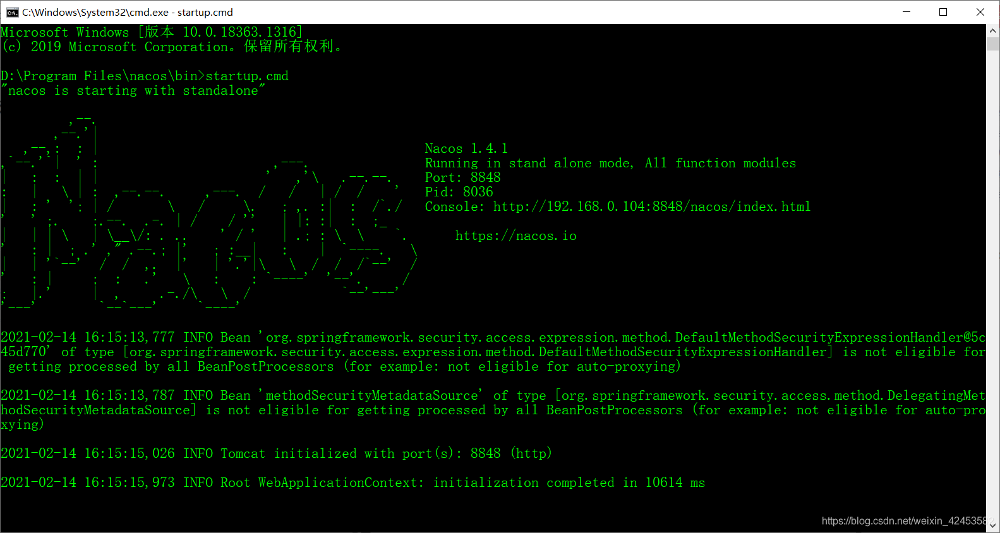
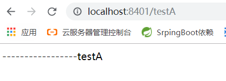
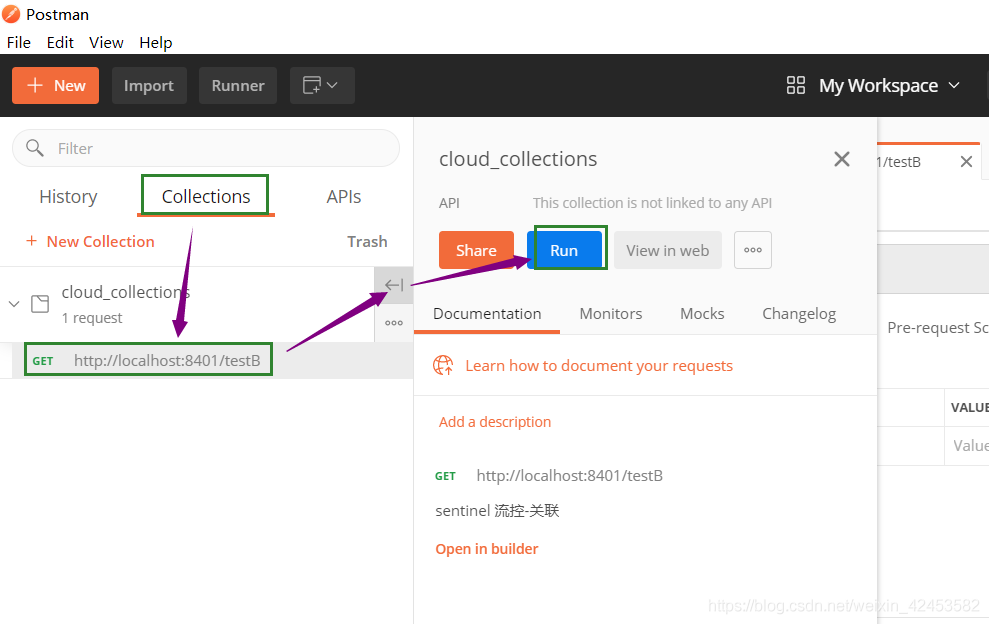
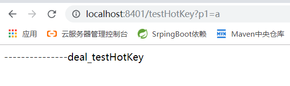
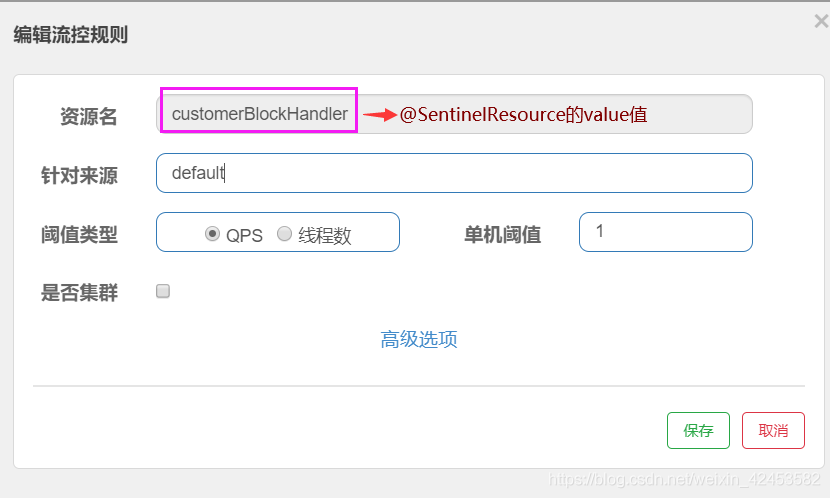
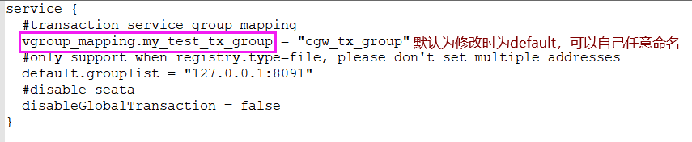

# SpringCloud

>   参考：https://blog.csdn.net/weixin_43591980/article/details/106255122

## 微服务

-   就目前而言，对于微服务，业界并没有一个统一的，标准的定义。
-   但通常而言，微服务架构是一种架构模式，或者说是一种架构风格，**它体长将单一的应用程序划分成一组小的服务**，每个服务运行在其独立的自己的进程内，服务之间互相协调，互相配置，为用户提供最终价值，服务之间采用轻量级的通信机制(**HTTP**)互相沟通，每个服务都围绕着具体的业务进行构建，并且能狗被独立的部署到生产环境中，另外，应尽量避免统一的，集中式的服务管理机制，对具体的一个服务而言，应该根据业务上下文，选择合适的语言，工具(**Maven**)对其进行构建，可以有一个非常轻量级的集中式管理来协调这些服务，可以使用不同的语言来编写服务，也可以使用不同的数据存储。
-   微服务化的核心就是将传统的一站式应用，根据业务拆分成一个一个的服务，彻底地去耦合，每一个微服务提供单个业务功能的服务，一个服务做一件事情，从技术角度看就是一种小而独立的处理过程，类似进程的概念，能够自行单独启动或销毁，拥有自己独立的数据库。

### 微服务与微服务架构

>   微服务

强调的是服务的大小，它关注的是某一个点，是具体解决某一个问题/提供落地对应服务的一个服务应用，狭义的看，可以看作是IDEA中的一个个微服务工程，或者Moudel。IDEA 工具里面使用Maven开发的一个个独立的小Moudel，它具体是使用SpringBoot开发的一个小模块，专业的事情交给专业的模块来做，一个模块就做着一件事情。强调的是一个个的个体，每个个体完成一个具体的任务或者功能。

>   微服务架构

一种新的架构形式，Martin Fowler 于2014年提出。

微服务架构是一种架构模式，它体长将单一应用程序划分成一组小的服务，服务之间相互协调，互相配合，为用户提供最终价值。每个服务运行在其独立的进程中，服务与服务之间采用轻量级的通信机制**(如HTTP)**互相协作，每个服务都围绕着具体的业务进行构建，并且能够被独立的部署到生产环境中，另外，应尽量避免统一的，集中式的服务管理机制，对具体的一个服务而言，应根据业务上下文，选择合适的语言、工具**(如Maven)**对其进行构建。

### 微服务优缺点

>   优点

-   单一职责原则；
-   每个服务足够内聚，足够小，代码容易理解，这样能聚焦一个指定的业务功能或业务需求；
-   开发简单，开发效率高，一个服务可能就是专一的只干一件事；
-   微服务能够被小团队单独开发，这个团队只需2-5个开发人员组成；
-   微服务是松耦合的，是有功能意义的服务，无论是在开发阶段或部署阶段都是独立的；
-   微服务能使用不同的语言开发；
-   易于和第三方集成，微服务允许容易且灵活的方式集成自动部署，通过持续集成工具，如jenkins，Hudson，bamboo；
-   微服务易于被一个开发人员理解，修改和维护，这样小团队能够更关注自己的工作成果，无需通过合作才能体现价值；
-   微服务允许利用和融合最新技术；
-   **微服务只是业务逻辑的代码，不会和HTML，CSS，或其他的界面混合;**
-   **每个微服务都有自己的存储能力，可以有自己的数据库，也可以有统一的数据库；**

>   缺点

-   开发人员要处理分布式系统的复杂性；
-   多服务运维难度，随着服务的增加，运维的压力也在增大；
-   系统部署依赖问题；
-   服务间通信成本问题；
-   数据一致性问题；
-   系统集成测试问题；
-   性能和监控问题；

### 微服务技术栈

| **微服务技术条目**                     | 落地技术                                                     |
| -------------------------------------- | ------------------------------------------------------------ |
| 服务开发                               | SpringBoot、Spring、SpringMVC等                              |
| 服务配置与管理                         | Netfix公司的Archaius、阿里的Diamond等                        |
| 服务注册与发现                         | Eureka、Consul、Zookeeper等                                  |
| 服务调用                               | Rest、RPC、gRPC                                              |
| 服务熔断器                             | Hystrix、Envoy等                                             |
| 负载均衡                               | Ribbon、Nginx等                                              |
| 服务接口调用(客户端调用服务的简化工具) | Fegin等                                                      |
| 消息队列                               | Kafka、RabbitMQ、ActiveMQ等                                  |
| 服务配置中心管理                       | SpringCloudConfig、Chef等                                    |
| 服务路由(API网关)                      | Zuul等                                                       |
| 服务监控                               | Zabbix、Nagios、Metrics、Specatator等                        |
| 全链路追踪                             | Zipkin、Brave、Dapper等                                      |
| 数据流操作开发包                       | SpringCloud Stream(封装与Redis，Rabbit，Kafka等发送接收消息) |
| 时间消息总栈                           | SpringCloud Bus                                              |
| 服务部署                               | Docker、OpenStack、Kubernetes等                              |

>   微服务框架对比

| **功能点/服务框架** | Netflix/SpringCloud                                          | Motan                                                       | gRPC                      | Thri t   | Dubbo/DubboX                        |
| ------------------- | ------------------------------------------------------------ | ----------------------------------------------------------- | ------------------------- | -------- | ----------------------------------- |
| 功能定位            | 完整的微服务框架                                             | RPC框架，但整合了ZK或Consul，实现集群环境的基本服务注册发现 | RPC框架                   | RPC框架  | 服务框架                            |
| 支持Rest            | 是，Ribbon支持多种可拔插的序列号选择                         | 否                                                          | 否                        | 否       | 否                                  |
| 支持RPC             | 否                                                           | 是(Hession2)                                                | 是                        | 是       | 是                                  |
| 支持多语言          | 是(Rest形式)                                                 | 否                                                          | 是                        | 是       | 否                                  |
| 负载均衡            | 是(服务端zuul+客户端Ribbon)，zuul-服务，动态路由，云端负载均衡Eureka（针对中间层服务器） | 是(客户端)                                                  | 否                        | 否       | 是(客户端)                          |
| 配置服务            | Netfix Archaius，Spring Cloud Config Server 集中配置         | 是(Zookeeper提供)                                           | 否                        | 否       | 否                                  |
| 服务调用链监控      | 是(zuul)，zuul提供边缘服务，API网关                          | 否                                                          | 否                        | 否       | 否                                  |
| 高可用/容错         | 是(服务端Hystrix+客户端Ribbon)                               | 是(客户端)                                                  | 否                        | 否       | 是(客户端)                          |
| 典型应用案例        | Netflix                                                      | Sina                                                        | Google                    | Facebook |                                     |
| 社区活跃程度        | 高                                                           | 一般                                                        | 高                        | 一般     | 2017年后重新开始维护，之前中断了5年 |
| 学习难度            | 中等                                                         | 低                                                          | 高                        | 高       | 低                                  |
| 文档丰富程度        | 高                                                           | 一般                                                        | 一般                      | 一般     | 高                                  |
| 其他                | Spring Cloud Bus为我们的应用程序带来了更多管理端点           | 支持降级                                                    | Netflix内部在开发集成gRPC | IDL定义  | 实践的公司比较多                    |

## SpringCloud概述

Spring官网：https://spring.io/


### SpringBoot与SpringCloud关系

-   SpringBoot专注于快速方便的开发单个个体微服务；
-   SpringCloud是关注全局的微服务协调整理治理框架，它将SpringBoot开发的一个个单体微服务，整合并管理起来，为各个微服务之间提供：配置管理、服务发现、断路器、路由、微代理、事件总线、全局锁、决策竞选、分布式会话等等集成服务；
-   SpringBoot可以离开SpringCloud独立使用，开发项目，但SpringCloud离不开SpringBoot，属于依赖关系；
-   SpringBoot专注于快速、方便的开发单个个体微服务，SpringCloud关注全局的服务治理框架；


### Dubbo与SpringCloud技术选型

1.  分布式+服务治理Dubbo

    目前成熟的互联网架构，应用服务化拆分 + 消息中间件

2.  Dubbo与SpringCloud对比

    |              | Dubbo         | SpringCloud                  |
    | ------------ | ------------- | ---------------------------- |
    | 服务注册中心 | Zookeeper     | Spring Cloud Netfilx Eureka  |
    | 服务调用方式 | RPC           | REST API                     |
    | 服务监控     | Dubbo-monitor | Spring Boot Admin            |
    | 断路器       | 不完善        | Spring Cloud Netfilx Hystrix |
    | 服务网关     | 无            | Spring Cloud Netfilx Zuul    |
    | 分布式配置   | 无            | Spring Cloud Config          |
    | 服务跟踪     | 无            | Spring Cloud Sleuth          |
    | 消息总栈     | 无            | Spring Cloud Bus             |
    | 数据流       | 无            | Spring Cloud Stream          |
    | 批量任务     | 无            | Spring Cloud Task            |

    **最大区别：Spring Cloud 抛弃了Dubbo的RPC通信，采用的是基于HTTP的REST方式**

    严格来说，这两种方式各有优劣。虽然从一定程度上来说，后者牺牲了服务调用的性能，但也避免了上面提到的原生RPC带来的问题。而且REST相比RPC更为灵活，服务提供方和调用方的依赖只依靠一纸契约，不存在代码级别的强依赖，这个优点在当下强调快速演化的微服务环境下，显得更加合适。

    **二者解决的问题域不一样：Dubbo的定位是一款RPC框架，而SpringCloud的目标是微服务架构下的一站式解决方案。**

### SpringCloud作用

-   Distributed/versioned configuration 分布式/版本控制配置
-   Service registration and discovery 服务注册与发现
-   Routing 路由
-   Service-to-service calls 服务到服务的调用
-   Load balancing 负载均衡配置
-   Circuit Breakers 断路器
-   Distributed messaging 分布式消息管理

## SpringCloud环境搭建

### 概述

-   我们会使用一个Dept部门模块做一个微服务通用案例**Consumer**消费者(**Client**)通过REST调用**Provider**提供者(**Server**)提供的服务。
-   Maven的分包分模块架构：

```json
一个简单的Maven模块结构是这样的：

-- app-parent: 一个父项目(app-parent)聚合了很多子项目(app-util\app-dao\app-web...)
  |-- pom.xml
  |
  |-- app-core
  ||---- pom.xml
  |
  |-- app-web
  ||---- pom.xml
  ......
```

一个父工程带着多个Moudule子模块

MicroServiceCloud父工程(Project)下初次带着3个子模块(Module)

-   microservicecloud-api 【封装的整体entity/接口/公共配置等】
-   microservicecloud-consumer-dept-80 【服务提供者】
-   microservicecloud-provider-dept-8001 【服务消费者】

### 版本选择

**大版本说明**

| SpringBoot | SpringCloud             | 关系                                     |
| ---------- | ----------------------- | ---------------------------------------- |
| 1.2.x      | Angel版本(天使)         | 兼容SpringBoot1.2x                       |
| 1.3.x      | Brixton版本(布里克斯顿) | 兼容SpringBoot1.3x，也兼容SpringBoot1.4x |
| 1.4.x      | Camden版本(卡姆登)      | 兼容SpringBoot1.4x，也兼容SpringBoot1.5x |
| 1.5.x      | Dalston版本(多尔斯顿)   | 兼容SpringBoot1.5x，不兼容SpringBoot2.0x |
| 1.5.x      | Edgware版本(埃奇韦尔)   | 兼容SpringBoot1.5x，不兼容SpringBoot2.0x |
| 2.0.x      | Finchley版本(芬奇利)    | 兼容SpringBoot2.0x，不兼容SpringBoot1.5x |
| 2.1.x      | Greenwich版本(格林威治) |                                          |

**实际开发版本关系**

| spring-boot-starter-parent |              | spring-cloud-dependencles |              |
| -------------------------- | ------------ | ------------------------- | ------------ |
| **版本号**                 | **发布日期** | **版本号**                | **发布日期** |
| 1.5.2.RELEASE              | 2017-03      | Dalston.RC1               | 2017-x       |
| 1.5.9.RELEASE              | 2017-11      | Edgware.RELEASE           | 2017-11      |
| 1.5.16.RELEASE             | 2018-04      | Edgware.SR5               | 2018-10      |
| 1.5.20.RELEASE             | 2018-09      | Edgware.SR5               | 2018-10      |
| 2.0.2.RELEASE              | 2018-05      | Fomchiey.BULD-SNAPSHOT    | 2018-x       |
| 2.0.6.RELEASE              | 2018-10      | Fomchiey-SR2              | 2018-10      |
| 2.1.4.RELEASE              | 2019-04      | Greenwich.SR1             | 2019-03      |

### 详细配置

1.  创建父工程

    -   新建父工程项目springcloud，切记**Packageing是pom模式**
    -   主要是定义POM文件，将后续各个子模块公用的jar包等统一提取出来，类似一个抽象父类
        

    ```xml
    <?xml version="1.0" encoding="UTF-8"?>
    <project xmlns="http://maven.apache.org/POM/4.0.0"
             xmlns:xsi="http://www.w3.org/2001/XMLSchema-instance"
             xsi:schemaLocation="http://maven.apache.org/POM/4.0.0 http://maven.apache.org/xsd/maven-4.0.0.xsd">
        <modelVersion>4.0.0</modelVersion>
    
        <groupId>com.kuang</groupId>
        <artifactId>springcloud</artifactId>
        <version>1.0-SNAPSHOT</version>
        <modules>
            <module>springcloud-api</module>
            <module>springcloud-provider-dept-8001</module>
            <module>springcloud-consumer-dept-80</module>
            <module>springcloud-eureka-7001</module>
            <module>springcloud-eureka-7002</module>
            <module>springcloud-eureka-7003</module>
            <module>springcloud-provider-dept-8002</module>
            <module>springcloud-provider-dept-8003</module>
            <module>springcloud-consumer-dept-feign</module>
            <module>springcloud-provider-dept-hystrix-8001</module>
            <module>springcloud-consumer-hystrix-dashboard</module>
            <module>springcloud-zuul-9527</module>
            <module>springcloud-config-server-3344</module>
            <module>springcloud-config-client-3355</module>
            <module>springcloud-config-eureka-7001</module>
            <module>springcloud-config-dept-8001</module>
        </modules>
    
        <!-- 打包方式 pom -->
        <packaging>pom</packaging>
    
        <properties>
            <project.build.sourceEncoding>UTF-8</project.build.sourceEncoding>
            <maven.compiler.encoding>UTF-8</maven.compiler.encoding>
            <java.version>11</java.version>
            <maven.compiler.source>11</maven.compiler.source>
            <maven.compiler.target>11</maven.compiler.target>
        </properties>
    
        <dependencyManagement>
            <dependencies>
                <!--springcloud的依赖-->
                <dependency>
                    <groupId>org.springframework.cloud</groupId>
                    <artifactId>spring-cloud-dependencies</artifactId>
                    <version>Greenwich.SR1</version>
                    <type>pom</type>
                    <scope>import</scope>
                </dependency>
                <!--springBoot依赖-->
                <dependency>
                    <groupId>org.springframework.boot</groupId>
                    <artifactId>spring-boot-dependencies</artifactId>
                    <version>2.1.4.RELEASE</version>
                    <type>pom</type>
                    <scope>import </scope>
                </dependency>
                <!--数据库-->
                <dependency>
                    <groupId>mysql</groupId>
                    <artifactId>mysql-connector-java</artifactId>
                    <version>8.0.20</version>
                </dependency>
                <dependency>
                    <groupId>com.alibaba</groupId>
                    <artifactId>druid</artifactId>
                    <version>1.1.22</version>
                </dependency>
                <!--SpringBoot启动器-->
                <dependency>
                    <groupId>org.mybatis.spring.boot</groupId>
                    <artifactId>mybatis-spring-boot-starter</artifactId>
                    <version>2.1.1</version>
                </dependency>
                <!--junit-->
                <dependency>
                    <groupId>junit</groupId>
                    <artifactId>junit</artifactId>
                    <version>4.12</version>
                </dependency>
                <!--lombok-->
                <dependency>
                    <groupId>org.projectlombok</groupId>
                    <artifactId>lombok</artifactId>
                    <version>1.18.12</version>
                </dependency>
                <!--日志测试-->
                <dependency>
                    <groupId>ch.qos.logback</groupId>
                    <artifactId>logback-core</artifactId>
                    <version>1.2.3</version>
                </dependency>
            </dependencies>
        </dependencyManagement>
    
        <build>
    
        </build>
    
    </project>
    ```

2.  创建子模块

    

    springcloud-consumer-dept-80访问springcloud-provider-dept-8001下的controller使用REST方式

    ```java
    package com.kuang.springcloud.controller;
    
    import com.kuang.springcloud.pojo.Dept;
    import org.springframework.beans.factory.annotation.Autowired;
    import org.springframework.stereotype.Controller;
    import org.springframework.web.bind.annotation.PathVariable;
    import org.springframework.web.bind.annotation.RequestMapping;
    import org.springframework.web.bind.annotation.RestController;
    import org.springframework.web.client.RestTemplate;
    
    import java.util.List;
    
    @RestController
    public class DeptConsumerController {
    
        /**
         * 理解：消费者，不应该有service层~
         * RestTemplate .... 供我们直接调用就可以了！ 注册到Spring中
         * (地址：url, 实体：Map ,Class<T> responseType)
         * <p>
         * 提供多种便捷访问远程http服务的方法，简单的Restful服务模板~
         */
        @Autowired
        private RestTemplate restTemplate;
    
        /**
         * 服务提供方地址前缀
         * <p>
         * Ribbon:我们这里的地址，应该是一个变量，通过服务名来访问
         */
        private static final String REST_URL_PREFIX = "http://localhost:8001";
        //private static final String REST_URL_PREFIX = "http://SPRINGCLOUD-PROVIDER-DEPT";
    
        /**
         * 消费方添加部门信息
         * @param dept
         * @return
         */
        @RequestMapping("/consumer/dept/add")
        public boolean add(Dept dept) {
            // postForObject(服务提供方地址(接口),参数实体,返回类型.class)
            return restTemplate.postForObject(REST_URL_PREFIX + "/dept/add", dept, Boolean.class);
        }
    
        /**
         * 消费方根据id查询部门信息
         * @param id
         * @return
         */
        @RequestMapping("/consumer/dept/get/{id}")
        public Dept get(@PathVariable("id") Long id) {
            // getForObject(服务提供方地址(接口),返回类型.class)
            return restTemplate.getForObject(REST_URL_PREFIX + "/dept/get/" + id, Dept.class);
        }
    
        /**
         * 消费方查询部门信息列表
         * @return
         */
        @RequestMapping("/consumer/dept/list")
        public List<Dept> list() {
            return restTemplate.getForObject(REST_URL_PREFIX + "/dept/list", List.class);
        }
    }
    
    ```

    使用RestTemplete先需要放入Spring容器中

    ```java
    @Configuration
    public class ConfigBean {//@Configuration -- spring  applicationContext.xml
    
    
        @Bean
        public RestTemplate getRestTemplate(){
            return new RestTemplate();
        }
    }
    ```

    springcloud-provider-dept-8001的dao接口调用springcloud-api模块下的pojo，可使用在springcloud-provider-dept-8001的pom文件导入springcloud-api模块依赖的方式：

    ```xml
     <!--我们需要拿到实体类，所以要配置api module-->
            <dependency>
                <groupId>com.haust</groupId>
                <artifactId>springcloud-api</artifactId>
                <version>1.0-SNAPSHOT</version>
            </dependency>
    ```

## Eureka服务注册中心

### 概述

-   Netflix在涉及Eureka时，遵循的就是API原则.
-   Eureka是Netflix的有个子模块，也是核心模块之一。Eureka是基于REST的服务，用于定位服务，以实现云端中间件层服务发现和故障转移，服务注册与发现对于微服务来说是非常重要的，有了服务注册与发现，只需要使用服务的标识符，就可以访问到服务，而不需要修改服务调用的配置文件了，功能类似于Dubbo的注册中心，比如Zookeeper.

### 原理

-   **Eureka基本的架构**
    -   Springcloud 封装了Netflix公司开发的Eureka模块来实现服务注册与发现 (对比Zookeeper).
    -   Eureka采用了C-S的架构设计，EurekaServer作为服务注册功能的服务器，他是服务注册中心.
    -   而系统中的其他微服务，使用Eureka的客户端连接到EurekaServer并维持心跳连接。这样系统的维护人员就可以通过EurekaServer来监控系统中各个微服务是否正常运行，Springcloud 的一些其他模块 (比如Zuul) 就可以通过EurekaServer来发现系统中的其他微服务，并执行相关的逻辑.


-   和Dubbo架构对比.

    

-   Eureka 包含两个组件：**Eureka Server** 和 **Eureka Client**.

-   Eureka Server 提供服务注册，各个节点启动后，回在EurekaServer中进行注册，这样Eureka Server中的服务注册表中将会储存所有课用服务节点的信息，服务节点的信息可以在界面中直观的看到.

-   Eureka Client 是一个Java客户端，用于简化EurekaServer的交互，客户端同时也具备一个内置的，使用轮询负载算法的负载均衡器。在应用启动后，将会向EurekaServer发送心跳 (默认周期为30秒) 。如果Eureka Server在多个心跳周期内没有接收到某个节点的心跳，EurekaServer将会从服务注册表中把这个服务节点移除掉 (默认周期为90s).

-   **三大角色**

    -   Eureka Server：提供服务的注册与发现
    -   Service Provider：服务生产方，将自身服务注册到Eureka中，从而使服务消费方能狗找到
    -   Service Consumer：服务消费方，从Eureka中获取注册服务列表，从而找到消费服务

-   目前工程状况


### Eureka Server

1.  springcloud-eureka-7001 模块建立

2.  pom.xml 配置

    ```xml
    <!--导包~-->
    <dependencies>
        <!-- https://mvnrepository.com/artifact/org.springframework.cloud/spring-cloud-starter-eureka-server -->
        <!--导入Eureka Server依赖-->
        <dependency>
            <groupId>org.springframework.cloud</groupId>
            <artifactId>spring-cloud-starter-eureka-server</artifactId>
            <version>1.4.6.RELEASE</version>
        </dependency>
        <!--热部署工具-->
        <dependency>
            <groupId>org.springframework.boot</groupId>
            <artifactId>spring-boot-devtools</artifactId>
        </dependency>
    </dependencies>
    ```

3.  application.yml

    ```yml
    server:
      port: 7001
    
    # Eureka配置
    eureka:
      instance:
        # Eureka服务端的实例名字
        hostname: 127.0.0.1
      client:
        # 表示是否向 Eureka 注册中心注册自己(这个模块本身是服务器,所以不需要)
        register-with-eureka: false
        # fetch-registry如果为false,则表示自己为注册中心,客户端的化为 ture
        fetch-registry: false
        # Eureka监控页面~
        service-url:
          defaultZone: http://${eureka.instance.hostname}:${server.port}/eureka/
    ```

    源码中Eureka的默认端口以及访问路径:


4.  主启动类

    ```java
    @SpringBootApplication
    // @EnableEurekaServer 服务端的启动类，可以接受别人注册进来~
    @EnableEurekaServer
    public class EurekaServer_7001 {
        public static void main(String[] args) {
            SpringApplication.run(EurekaServer_7001.class,args);
        }
    }
    
    ```
    
5.  启动成功后访问 http://localhost:7001/ 得到以下页面


### Eureka Client

**调整之前创建的springlouc-provider-dept-8001**

1.  导入Eureca依赖

    ```xml
    <!--Eureka依赖-->
    <!-- https://mvnrepository.com/artifact/org.springframework.cloud/spring-cloud-starter-eureka -->
    <dependency>
        <groupId>org.springframework.cloud</groupId>
        <artifactId>spring-cloud-starter-eureka</artifactId>
        <version>1.4.6.RELEASE</version>
    </dependency>
    ```

2.  application中新增Eureca配置

    ```yml
    # Eureka配置：配置服务注册中心地址
    eureka:
      client:
        service-url:
          defaultZone: http://localhost:7001/eureka/
    ```

3.  为主启动类添加@EnableEurekaClient注解

    ```java
    @SpringBootApplication
    // @EnableEurekaClient 开启Eureka客户端注解，在服务启动后自动向注册中心注册服务
    @EnableEurekaClient
    public class DeptProvider_8001 {
        public static void main(String[] args) {
            SpringApplication.run(DeptProvider_8001.class,args);
        }
    }
    ```

4.  先启动7001服务端后启动8001客户端进行测试，然后访问监控页http://localhost:7001/ 产看结果如图，成功


1.  修改Eureka上的默认描述信息

    ```yml
    # Eureka配置：配置服务注册中心地址
    eureka:
      client:
        service-url:
          defaultZone: http://localhost:7001/eureka/
      instance:
        instance-id: springcloud-provider-dept-8001 #修改Eureka上的默认描述信息
    ```

    结果如图：
    

    如果此时停掉springcloud-provider-dept-8001 等**30s**后 监控会开启保护机制：
    

2.  配置关于服务加载的监控信息


pom.xml中添加依赖

```xml
<!--actuator完善监控信息-->
<dependency>
 <groupId>org.springframework.boot</groupId>
 <artifactId>spring-boot-starter-actuator</artifactId>
</dependency>
```

application.yml中添加配置

```yml
# info配置
info:
# 项目的名称
app.name: haust-springcloud
# 公司的名称
company.name: test
```

此时刷新监控页，点击进入跳转新页面显示info。

### 自我保护机制

**好死不如赖活着**

一句话总结就是：**某时刻某一个微服务不可用，eureka不会立即清理，依旧会对该微服务的信息进行保存！**

-   默认情况下，当eureka server在一定时间内没有收到实例的心跳，便会把该实例从注册表中删除（**默认是90秒**），但是，如果短时间内丢失大量的实例心跳，便会触发eureka server的自我保护机制，比如在开发测试时，需要频繁地重启微服务实例，但是我们很少会把eureka server一起重启（因为在开发过程中不会修改eureka注册中心），**当一分钟内收到的心跳数大量减少时，会触发该保护机制**。可以在eureka管理界面看到Renews threshold和Renews(last min)，当后者（最后一分钟收到的心跳数）小于前者（心跳阈值）的时候，触发保护机制，会出现红色的警告：`EMERGENCY!EUREKA MAY BE INCORRECTLY CLAIMING INSTANCES ARE UP WHEN THEY'RE NOT.RENEWALS ARE LESSER THAN THRESHOLD AND HENCE THE INSTANCES ARE NOT BEGING EXPIRED JUST TO BE SAFE.`从警告中可以看到，eureka认为虽然收不到实例的心跳，但它认为实例还是健康的，eureka会保护这些实例，不会把它们从注册表中删掉。
-   该保护机制的目的是避免网络连接故障，在发生网络故障时，微服务和注册中心之间无法正常通信，但服务本身是健康的，不应该注销该服务，如果eureka因网络故障而把微服务误删了，那即使网络恢复了，该微服务也不会重新注册到eureka server了，因为只有在微服务启动的时候才会发起注册请求，后面只会发送心跳和服务列表请求，这样的话，该实例虽然是运行着，但永远不会被其它服务所感知。所以，eureka server在短时间内丢失过多的客户端心跳时，会进入自我保护模式，该模式下，eureka会保护注册表中的信息，不在注销任何微服务，当网络故障恢复后，eureka会自动退出保护模式。自我保护模式可以让集群更加健壮。
-   但是我们在开发测试阶段，需要频繁地重启发布，如果触发了保护机制，则旧的服务实例没有被删除，这时请求有可能跑到旧的实例中，而该实例已经关闭了，这就导致请求错误，影响开发测试。所以，在开发测试阶段，我们可以把自我保护模式关闭，只需在eureka server配置文件中加上如下配置即可：`eureka.server.enable-self-preservation=false`【不推荐关闭自我保护机制】

### 集群环境配置


##### 1.初始化

新建springcloud-eureka-7002、springcloud-eureka-7003 模块

1.为pom.xml添加依赖 (与springcloud-eureka-7001相同)

```xml
<!--导包~-->
<dependencies>
    <!-- https://mvnrepository.com/artifact/org.springframework.cloud/spring-cloud-starter-eureka-server -->
    <!--导入Eureka Server依赖-->
    <dependency>
        <groupId>org.springframework.cloud</groupId>
        <artifactId>spring-cloud-starter-eureka-server</artifactId>
        <version>1.4.6.RELEASE</version>
    </dependency>
    <!--热部署工具-->
    <dependency>
        <groupId>org.springframework.boot</groupId>
        <artifactId>spring-boot-devtools</artifactId>
    </dependency>
</dependencies>
```

2.application.yml配置(与springcloud-eureka-7001相同)

```yml
server:
  port: 7003

# Eureka配置
eureka:
  instance:
    hostname: localhost # Eureka服务端的实例名字
  client:
    register-with-eureka: false # 表示是否向 Eureka 注册中心注册自己(这个模块本身是服务器,所以不需要)
    fetch-registry: false # fetch-registry如果为false,则表示自己为注册中心
    service-url: # 监控页面~
      # 重写Eureka的默认端口以及访问路径 --->http://localhost:7001/eureka/
      defaultZone: http://${eureka.instance.hostname}:${server.port}/eureka/
```

3.主启动类(与springcloud-eureka-7001相同)

```java
@SpringBootApplication
// @EnableEurekaServer 服务端的启动类，可以接受别人注册进来~
public class EurekaServer_7003 {
    public static void main(String[] args) {
        SpringApplication.run(EurekaServer_7003.class,args);
    }
}
```

##### 2.集群成员相互关联

配置一些自定义本机名字，找到本机hosts文件并打开

在hosts文件最后加上，要访问的本机名称，默认是localhost


修改application.yml的配置，如图为springcloud-eureka-7001配置，springcloud-eureka-7002/springcloud-eureka-7003同样分别修改为其对应的名称即可


在集群中使springcloud-eureka-7001关联springcloud-eureka-7002、springcloud-eureka-7003

完整的springcloud-eureka-7001下的application.yml如下

```yml
server:
  port: 7001

#Eureka配置
eureka:
  instance:
    hostname: eureka7001.com #Eureka服务端的实例名字
  client:
    register-with-eureka: false #表示是否向 Eureka 注册中心注册自己(这个模块本身是服务器,所以不需要)
    fetch-registry: false #fetch-registry如果为false,则表示自己为注册中心
    service-url: #监控页面~
      #重写Eureka的默认端口以及访问路径 --->http://localhost:7001/eureka/
      # 单机： defaultZone: http://${eureka.instance.hostname}:${server.port}/eureka/
      # 集群（关联）：7001关联7002、7003
      defaultZone: http://eureka7002.com:7002/eureka/,http://eureka7003.com:7003/eureka/
```

同时在集群中使springcloud-eureka-7002关联springcloud-eureka-7001、springcloud-eureka-7003

完整的springcloud-eureka-7002下的application.yml如下

```yml
server:
  port: 7002

#Eureka配置
eureka:
  instance:
    hostname: eureka7002.com #Eureka服务端的实例名字
  client:
    register-with-eureka: false #表示是否向 Eureka 注册中心注册自己(这个模块本身是服务器,所以不需要)
    fetch-registry: false #fetch-registry如果为false,则表示自己为注册中心
    service-url: #监控页面~
      #重写Eureka的默认端口以及访问路径 --->http://localhost:7001/eureka/
      # 单机： defaultZone: http://${eureka.instance.hostname}:${server.port}/eureka/
      # 集群（关联）：7002关联7001、7003
      defaultZone: http://eureka7001.com:7001/eureka/,http://eureka7003.com:7003/eureka/
```

springcloud-eureka-7003配置方式同理可得.

通过springcloud-provider-dept-8001下的yml配置文件，修改**Eureka配置：配置服务注册中心地址**

```yml
# Eureka配置：配置服务注册中心地址
eureka:
  client:
    service-url:
      # 注册中心地址7001-7003
      defaultZone: http://eureka7001.com:7001/eureka/,http://eureka7002.com:7002/eureka/,http://eureka7003.com:7003/eureka/
  instance:
    instance-id: springcloud-provider-dept-8001 #修改Eureka上的默认描述信息
```

这样模拟集群就搭建好了，就可以把一个项目挂载到三个服务器上了



### 对比Zookeeper

###### **1. CAP原则**

RDBMS (MySQL\Oracle\sqlServer) ===> ACID

NoSQL (Redis\MongoDB) ===> CAP

###### **2. ACID是什么？**

-   A (Atomicity) 原子性
-   C (Consistency) 一致性
-   I (Isolation) 隔离性
-   D (Durability) 持久性

###### **3. CAP是什么?**

-   C (Consistency) 强一致性
-   A (Availability) 可用性
-   P (Partition tolerance) 分区容错性

CAP的三进二：CA、AP、CP

###### **4. CAP理论的核心**

-   一个分布式系统不可能同时很好的满足一致性，可用性和分区容错性这三个需求
-   根据CAP原理，将NoSQL数据库分成了满足CA原则，满足CP原则和满足AP原则三大类
    -   CA：单点集群，满足一致性，可用性的系统，通常可扩展性较差
    -   CP：满足一致性，分区容错的系统，通常性能不是特别高
    -   AP：满足可用性，分区容错的系统，通常可能对一致性要求低一些

###### **5. 作为分布式服务注册中心，Eureka比Zookeeper好在哪里？**

著名的CAP理论指出，一个分布式系统不可能同时满足C (一致性) 、A (可用性) 、P (容错性)，由于分区容错性P再分布式系统中是必须要保证的，因此我们只能再A和C之间进行权衡。

-   Zookeeper 保证的是 CP —> 满足一致性，分区容错的系统，通常性能不是特别高
-   Eureka 保证的是 AP —> 满足可用性，分区容错的系统，通常可能对一致性要求低一些

**Zookeeper保证的是CP**

 当向注册中心查询服务列表时，我们可以容忍注册中心返回的是几分钟以前的注册信息，但不能接收服务直接down掉不可用。也就是说，**服务注册功能对可用性的要求要高于一致性**。但zookeeper会出现这样一种情况，当master节点因为网络故障与其他节点失去联系时，剩余节点会重新进行leader选举。问题在于，选举leader的时间太长，30-120s，且选举期间整个zookeeper集群是不可用的，这就导致在选举期间注册服务瘫痪。在云部署的环境下，因为网络问题使得zookeeper集群失去master节点是较大概率发生的事件，虽然服务最终能够恢复，但是，漫长的选举时间导致注册长期不可用，是不可容忍的。

**Eureka保证的是AP**

 Eureka看明白了这一点，因此在设计时就优先保证可用性。**Eureka各个节点都是平等的**，几个节点挂掉不会影响正常节点的工作，剩余的节点依然可以提供注册和查询服务。而Eureka的客户端在向某个Eureka注册时，如果发现连接失败，则会自动切换至其他节点，只要有一台Eureka还在，就能保住注册服务的可用性，只不过查到的信息可能不是最新的，除此之外，Eureka还有之中自我保护机制，如果在15分钟内超过85%的节点都没有正常的心跳，那么Eureka就认为客户端与注册中心出现了网络故障，此时会出现以下几种情况：

-   Eureka不在从注册列表中移除因为长时间没收到心跳而应该过期的服务
-   Eureka仍然能够接受新服务的注册和查询请求，但是不会被同步到其他节点上 (即保证当前节点依然可用)
-   当网络稳定时，当前实例新的注册信息会被同步到其他节点中

**因此，Eureka可以很好的应对因网络故障导致部分节点失去联系的情况，而不会像zookeeper那样使整个注册服务瘫痪**

## Ribbon负载均衡

### 概述

>   Ribbon是什么？

-   Spring Cloud Ribbon 是基于Netflix Ribbon 实现的一套**客户端负载均衡的工具**。
-   简单的说，Ribbon 是 Netflix 发布的开源项目，主要功能是提供客户端的软件负载均衡算法，将 Netflix 的中间层服务连接在一起。Ribbon 的客户端组件提供一系列完整的配置项，如：连接超时、重试等。简单的说，就是在配置文件中列出 LoadBalancer (简称LB：负载均衡) 后面所有的及其，Ribbon 会自动的帮助你基于某种规则 (如简单轮询，随机连接等等) 去连接这些机器。我们也容易使用 Ribbon 实现自定义的负载均衡算法！

>   Ribbon能干嘛？


-   LB，即负载均衡 (LoadBalancer) ，在微服务或分布式集群中经常用的一种应用。
-   负载均衡简单的说就是将用户的请求平摊的分配到多个服务上，从而达到系统的HA (高用)。
-   常见的负载均衡软件有 Nginx、Lvs 等等。
-   Dubbo、SpringCloud 中均给我们提供了负载均衡，**SpringCloud 的负载均衡算法可以自定义**。
-   负载均衡简单分类：
    -   集中式LB
        -   即在服务的提供方和消费方之间使用独立的LB设施，如**Nginx(反向代理服务器)**，由该设施负责把访问请求通过某种策略转发至服务的提供方！
    -   进程式 LB
        -   将LB逻辑集成到消费方，消费方从服务注册中心获知有哪些地址可用，然后自己再从这些地址中选出一个合适的服务器。
        -   **Ribbon 就属于进程内LB**，它只是一个类库，集成于消费方进程，消费方通过它来获取到服务提供方的地址！

### 集成Ribbon

**springcloud-consumer-dept-80**向pom.xml中添加Ribbon和Eureka依赖

```xml
<!--Ribbon-->
<dependency>
    <groupId>org.springframework.cloud</groupId>
    <artifactId>spring-cloud-starter-ribbon</artifactId>
    <version>1.4.6.RELEASE</version>
</dependency>
<!--Eureka: Ribbon需要从Eureka服务中心获取要拿什么-->
<dependency>
    <groupId>org.springframework.cloud</groupId>
    <artifactId>spring-cloud-starter-eureka</artifactId>
    <version>1.4.6.RELEASE</version>
</dependency>
```

在application.yml文件中配置Eureka

```yml
# Eureka配置
eureka:
  client:
    register-with-eureka: false # 不向 Eureka注册自己
    service-url: # 从三个注册中心中随机取一个去访问
      defaultZone: http://eureka7001.com:7001/eureka/,http://eureka7002.com:7002/eureka/,http://eureka7003.com:7003/eureka/
```

主启动类加上@EnableEurekaClient注解，开启Eureka

```java
//Ribbon 和 Eureka 整合以后，客户端可以直接调用，不用关心IP地址和端口号
@SpringBootApplication
@EnableEurekaClient //开启Eureka 客户端
public class DeptConsumer_80 {
    public static void main(String[] args) {
        SpringApplication.run(DeptConsumer_80.class, args);
    }
}
```

自定义Spring配置类：ConfigBean.java 配置负载均衡实现RestTemplate

```java
@Configuration
public class ConfigBean {//@Configuration -- spring  applicationContext.xml

    @LoadBalanced //配置负载均衡实现RestTemplate
    @Bean
    public RestTemplate getRestTemplate() {
        return new RestTemplate();
    }
}
```

修改conroller：DeptConsumerController.java

```java
//Ribbon:我们这里的地址，应该是一个变量，通过服务名来访问
//private static final String REST_URL_PREFIX = "http://localhost:8001";
private static final String REST_URL_PREFIX = "http://SPRINGCLOUD-PROVIDER-DEPT";
```

### 使用Ribbon实现负载均衡

流程图：


1.新建两个服务提供者Moudle：springcloud-provider-dept-8003、springcloud-provider-dept-8002

2.参照springcloud-provider-dept-8001 依次为另外两个Moudle添加pom.xml依赖 、resourece下的mybatis和application.yml配置，Java代码

3.启动所有服务测试(根据自身电脑配置决定启动服务的个数)，访问http://eureka7001.com:7002/查看结果


测试访问http://localhost/consumer/dept/list 这时候随机访问的是服务提供者8003


再次访问http://localhost/consumer/dept/list这时候随机的是服务提供者8001


以上这种**每次访问http://localhost/consumer/dept/list随机访问集群中某个服务提供者，这种情况叫做轮询**，轮询算法在SpringCloud中可以自定义。

在springcloud-provider-dept-80模块下的ConfigBean中进行配置，切换使用不同的规则

```java
@Configuration
public class ConfigBean {//@Configuration -- spring  applicationContext.xml

    /**
     * IRule:
     * RoundRobinRule 轮询策略
     * RandomRule 随机策略
     * AvailabilityFilteringRule ： 会先过滤掉，跳闸，访问故障的服务~，对剩下的进行轮询~
     * RetryRule ： 会先按照轮询获取服务~，如果服务获取失败，则会在指定的时间内进行，重试
     */
    @Bean
    public IRule myRule() {
        return new RandomRule();//使用随机策略
        //return new RoundRobinRule();//使用轮询策略
        //return new AvailabilityFilteringRule();//使用轮询策略
        //return new RetryRule();//使用轮询策略
    }
}
```

也可以自定义规则，在myRule包下自定义一个配置类MyRule.java，注意：**该包不要和主启动类所在的包同级，要跟启动类所在包同级**：



MyRule.java

```java
@Configuration
public class MyRule {

    @Bean
    public IRule myRule(){
        return new MyRandomRule();//默认是轮询RandomRule,现在自定义为自己的
    }
}
```

主启动类开启负载均衡并指定自定义的MyRule配置类

```java
//Ribbon 和 Eureka 整合以后，客户端可以直接调用，不用关心IP地址和端口号
@SpringBootApplication
@EnableEurekaClient
//在微服务启动的时候就能加载自定义的Ribbon类(自定义的规则会覆盖原有默认的规则)
@RibbonClient(name = "SPRINGCLOUD-PROVIDER-DEPT",configuration = MyRule.class)//开启负载均衡,并指定自定义的规则
public class DeptConsumer_80 {
    public static void main(String[] args) {
        SpringApplication.run(DeptConsumer_80.class, args);
    }
}
```

自定义的规则(这里我们参考Ribbon中默认的规则代码自己稍微改动)：MyRandomRule.java

```java
public class MyRandomRule extends AbstractLoadBalancerRule {

    /**
     * 每个服务访问5次则换下一个服务(总共3个服务)
     * <p>
     * total=0,默认=0,如果=5,指向下一个服务节点
     * index=0,默认=0,如果total=5,index+1
     */
    private int total = 0;//被调用的次数
    private int currentIndex = 0;//当前是谁在提供服务

    //@edu.umd.cs.findbugs.annotations.SuppressWarnings(value = "RCN_REDUNDANT_NULLCHECK_OF_NULL_VALUE")
    public Server choose(ILoadBalancer lb, Object key) {
        if (lb == null) {
            return null;
        }
        Server server = null;

        while (server == null) {
            if (Thread.interrupted()) {
                return null;
            }
            List<Server> upList = lb.getReachableServers();//获得当前活着的服务
            List<Server> allList = lb.getAllServers();//获取所有的服务

            int serverCount = allList.size();
            if (serverCount == 0) {
                /*
                 * No servers. End regardless of pass, because subsequent passes
                 * only get more restrictive.
                 */
                return null;
            }

            //int index = chooseRandomInt(serverCount);//生成区间随机数
            //server = upList.get(index);//从或活着的服务中,随机获取一个

            //=====================自定义代码=========================

            if (total < 5) {
                server = upList.get(currentIndex);
                total++;
            } else {
                total = 0;
                currentIndex++;
                if (currentIndex > upList.size()) {
                    currentIndex = 0;
                }
                server = upList.get(currentIndex);//从活着的服务中,获取指定的服务来进行操作
            }
            
            //======================================================
            
            if (server == null) {
                /*
                 * The only time this should happen is if the server list were
                 * somehow trimmed. This is a transient condition. Retry after
                 * yielding.
                 */
                Thread.yield();
                continue;
            }
            if (server.isAlive()) {
                return (server);
            }
            // Shouldn't actually happen.. but must be transient or a bug.
            server = null;
            Thread.yield();
        }
        return server;
    }

    protected int chooseRandomInt(int serverCount) {
        return ThreadLocalRandom.current().nextInt(serverCount);
    }

    @Override
    public Server choose(Object key) {
        return choose(getLoadBalancer(), key);
    }

    @Override
    public void initWithNiwsConfig(IClientConfig clientConfig) {
        // TODO Auto-generated method stub
    }
}
```

## Feign负载均衡

### 概述

Feign是声明式Web Service客户端，它让微服务之间的调用变得更简单，类似controller调用service。SpringCloud集成了Ribbon和Eureka，可以使用Feigin提供负载均衡的http客户端

**只需要创建一个接口，然后添加注解即可~**

Feign，主要是社区版，大家都习惯面向接口编程。这个是很多开发人员的规范。调用微服务访问两种方法

1.  微服务名字 【ribbon】
2.  接口和注解 【feign】

**Feign能干什么？**

-   Feign旨在使编写Java Http客户端变得更容易
-   前面在使用**Ribbon** + **RestTemplate**时，利用**RestTemplate**对Http请求的封装处理，形成了一套模板化的调用方法。但是在实际开发中，由于对服务依赖的调用可能不止一处，往往一个接口会被多处调用，所以通常都会针对每个微服务自行封装一个客户端类来包装这些依赖服务的调用。所以，**Feign**在此基础上做了进一步的封装，由他来帮助我们定义和实现依赖服务接口的定义，在Feign的实现下，我们只需要创建一个接口并使用注解的方式来配置它 (类似以前Dao接口上标注Mapper注解，现在是一个微服务接口上面标注一个Feign注解)，即可完成对服务提供方的接口绑定，简化了使用Spring Cloud Ribbon 时，自动封装服务调用客户端的开发量。

**Feign默认集成了Ribbon**

-   利用**Ribbon**维护了MicroServiceCloud-Dept的服务列表信息，并且通过轮询实现了客户端的负载均衡，而与**Ribbon**不同的是，通过**Feign**只需要定义服务绑定接口且以声明式的方法，优雅而简单的实现了服务调用。

### 配置与使用

1.  创建springcloud-consumer-fdept-feign模块

    

    拷贝springcloud-consumer-dept-80模块下的pom.xml，resource，以及java代码到springcloud-consumer-feign模块，并添加feign依赖。

    ```xml
    <!--Feign的依赖-->
    <dependency>
        <groupId>org.springframework.cloud</groupId>
        <artifactId>spring-cloud-starter-feign</artifactId>
        <version>1.4.6.RELEASE</version>
    </dependency>
    ```

    通过**Ribbon**实现：—原来的controller：**DeptConsumerController.java**

    ```java
    @RestController
    public class DeptConsumerController {
    
        /**
         * 理解：消费者，不应该有service层~
         * RestTemplate .... 供我们直接调用就可以了！ 注册到Spring中
         * (地址：url, 实体：Map ,Class<T> responseType)
         * <p>
         * 提供多种便捷访问远程http服务的方法，简单的Restful服务模板~
         */
        @Autowired
        private RestTemplate restTemplate;
    
        /**
         * 服务提供方地址前缀
         * <p>
         * Ribbon:我们这里的地址，应该是一个变量，通过服务名来访问
         */
    //    private static final String REST_URL_PREFIX = "http://localhost:8001";
        private static final String REST_URL_PREFIX = "http://SPRINGCLOUD-PROVIDER-DEPT";
    
        /**
         * 消费方添加部门信息
         * @param dept
         * @return
         */
        @RequestMapping("/consumer/dept/add")
        public boolean add(Dept dept) {
            // postForObject(服务提供方地址(接口),参数实体,返回类型.class)
            return restTemplate.postForObject(REST_URL_PREFIX + "/dept/add", dept, Boolean.class);
        }
    
        /**
         * 消费方根据id查询部门信息
         * @param id
         * @return
         */
        @RequestMapping("/consumer/dept/get/{id}")
        public Dept get(@PathVariable("id") Long id) {
            // getForObject(服务提供方地址(接口),返回类型.class)
            return restTemplate.getForObject(REST_URL_PREFIX + "/dept/get/" + id, Dept.class);
        }
    
        /**
         * 消费方查询部门信息列表
         * @return
         */
        @RequestMapping("/consumer/dept/list")
        public List<Dept> list() {
            return restTemplate.getForObject(REST_URL_PREFIX + "/dept/list", List.class);
        }
    }
    ```

    通过**Feign**实现：—改造后controller：**DeptConsumerController.java**

    ```java
    @RestController
    public class DeptConsumerController {
    
        @Autowired
        private DeptClientService deptClientService;
    
        /**
         * 消费方添加部门信息
         * @param dept
         * @return
         */
        @RequestMapping("/consumer/dept/add")
        public boolean add(Dept dept) {
            return deptClientService.addDept(dept);
        }
    
        /**
         * 消费方根据id查询部门信息
         * @param id
         * @return
         */
        @RequestMapping("/consumer/dept/get/{id}")
        public Dept get(@PathVariable("id") Long id) {
           return deptClientService.queryById(id);
        }
    
        /**
         * 消费方查询部门信息列表
         * @return
         */
        @RequestMapping("/consumer/dept/list")
        public List<Dept> list() {
            return deptClientService.queryAll();
        }
    }
    ```

    Feign和Ribbon二者对比，前者显现出面向接口编程特点，代码看起来更清爽，而且Feign调用方式更符合我们之前在做SSM或者SprngBoot项目时，Controller层调用Service层的编程习惯！

    **主配置类**：

    ```java
    @SpringBootApplication
    @EnableEurekaClient
    // feign客户端注解,并指定要扫描的包以及配置接口DeptClientService
    @EnableFeignClients(basePackages = {"com.haust.springcloud"})
    // 切记不要加这个注解，不然会出现404访问不到
    //@ComponentScan("com.haust.springcloud")
    public class FeignDeptConsumer_80 {
        public static void main(String[] args) {
            SpringApplication.run(FeignDeptConsumer_80.class, args);
        }
    }
    ```

2.  改造springcloud-api模块

    pom.xml添加feign依赖

    ```xml
    <!--Feign的依赖-->
    <dependency>
        <groupId>org.springframework.cloud</groupId>
        <artifactId>spring-cloud-starter-feign</artifactId>
        <version>1.4.6.RELEASE</version>
    </dependency>
    ```

    新建service包，并新建DeptClientService.java接口，

    ```java
    // @FeignClient:微服务客户端注解,value:指定微服务的名字,这样就可以使Feign客户端直接找到对应的微服务
    @FeignClient(value = "SPRINGCLOUD-PROVIDER-DEPT")
    public interface DeptClientService {
    
        @GetMapping("/dept/get/{id}")
        public Dept queryById(@PathVariable("id") Long id);
    
        @GetMapping("/dept/list")
        public Dept queryAll();
    
        @GetMapping("/dept/add")
        public Dept addDept(Dept dept);
    }
    ```

### 比较Ribbon与Feign

Feign 本质上也是实现了 Ribbon，只不过后者是在调用方式上，为了满足一些开发者习惯的接口调用习惯！

下面我们关闭springcloud-consumer-dept-80 这个服务消费方，换用springcloud-consumer-dept-feign(端口还是80) 来代替：(依然可以正常访问，就是调用方式相比于Ribbon变化了)


## Hystrix服务熔断

### 服务雪崩

多个微服务之间调用的时候，假设微服务A调用微服务B和微服务C，微服务B和微服务C又调用其他的微服务，这就是所谓的“扇出”，如果扇出的链路上**某个微服务的调用响应时间过长，或者不可用**，对微服务A的调用就会占用越来越多的系统资源，进而引起系统崩溃，所谓的“雪崩效应”。


 对于高流量的应用来说，单一的后端依赖可能会导致所有服务器上的所有资源都在几十秒内饱和。比失败更糟糕的是，这些应用程序还可能导致服务之间的延迟增加，备份队列，线程和其他系统资源紧张，导致整个系统发生更多的级联故障，**这些都表示需要对故障和延迟进行隔离和管理，以达到单个依赖关系的失败而不影响整个应用程序或系统运行**。

 我们需要，**弃车保帅**！

### Hystrix概述

**Hystrix**是一个应用于处理分布式系统的延迟和容错的开源库，在分布式系统里，许多依赖不可避免的会调用失败，比如超时，异常等，**Hystrix** 能够保证在一个依赖出问题的情况下，不会导致整个体系服务失败，避免级联故障，以提高分布式系统的弹性。

 “**断路器**”本身是一种开关装置，当某个服务单元发生故障之后，通过断路器的故障监控 (类似熔断保险丝) ，**向调用方返回一个服务预期的，可处理的备选响应 (FallBack) ，而不是长时间的等待或者抛出调用方法无法处理的异常，这样就可以保证了服务调用方的线程不会被长时间，不必要的占用**，从而避免了故障在分布式系统中的蔓延，乃至雪崩。


### Hystrix作用

-   服务降级
-   服务熔断
-   服务限流
-   接近实时的监控
-   …

当一切正常时，请求流可以如下所示：


当许多后端系统中有一个潜在阻塞服务时，它可以阻止整个用户请求：


随着大容量通信量的增加，单个后端依赖项的潜在性会导致所有服务器上的所有资源在几秒钟内饱和。

应用程序中通过网络或客户端库可能导致网络请求的每个点都是潜在故障的来源。比失败更糟糕的是，这些应用程序还可能导致服务之间的延迟增加，从而备份队列、线程和其他系统资源，从而导致更多跨系统的级联故障。


当使用**Hystrix**包装每个基础依赖项时，上面的图表中所示的体系结构会发生类似于以下关系图的变化。**每个依赖项是相互隔离的**，限制在延迟发生时它可以填充的资源中，并包含在回退逻辑中，该逻辑决定在依赖项中发生任何类型的故障时要做出什么样的响应：


### 服务熔断

**熔断机制是赌赢雪崩效应的一种微服务链路保护机制**。

 当扇出链路的某个微服务不可用或者响应时间太长时，会进行服务的降级，**进而熔断该节点微服务的调用，快速返回错误的响应信息**。检测到该节点微服务调用响应正常后恢复调用链路。在SpringCloud框架里熔断机制通过Hystrix实现。Hystrix会监控微服务间调用的状况，当失败的调用到一定阀值缺省是**5秒内20次调用失败，就会启动熔断机制**。熔断机制的注解是：`@HystrixCommand`。

服务熔断解决如下问题：

-   当所依赖的对象不稳定时，能够起到快速失败的目的；
-   快速失败后，能够根据一定的算法动态试探所依赖对象是否恢复。

新建springcloud-provider-dept-hystrix-8001模块并拷贝springcloud-provider-dept–8001内的**pom.xml、resource**和Java代码进行初始化并调整。

**导入hystrix依赖**

```xml
<!--导入Hystrix依赖-->
<dependency>
    <groupId>org.springframework.cloud</groupId>
    <artifactId>spring-cloud-starter-hystrix</artifactId>
    <version>1.4.6.RELEASE</version>
</dependency>
```

**调整yml配置文件**

```yml
server:
  port: 8001

# mybatis配置
mybatis:
  # springcloud-api 模块下的pojo包
  type-aliases-package: com.haust.springcloud.pojo
  # 本模块下的mybatis-config.xml核心配置文件类路径
  config-location: classpath:mybatis/mybatis-config.xml
  # 本模块下的mapper配置文件类路径
  mapper-locations: classpath:mybatis/mapper/*.xml

# spring配置
spring:
  application:
    #项目名
    name: springcloud-provider-dept
  datasource:
    # 德鲁伊数据源
    type: com.alibaba.druid.pool.DruidDataSource
    driver-class-name: com.mysql.jdbc.Driver
    url: jdbc:mysql://localhost:3306/db01?useUnicode=true&characterEncoding=utf-8
    username: root
    password: root

# Eureka配置：配置服务注册中心地址
eureka:
  client:
    service-url:
      # 注册中心地址7001-7003
      defaultZone: http://eureka7001.com:7001/eureka/,http://eureka7002.com:7002/eureka/,http://eureka7003.com:7003/eureka/
  instance:
    instance-id: springcloud-provider-dept-hystrix-8001 #修改Eureka上的默认描述信息
    prefer-ip-address: true #改为true后默认显示的是ip地址而不再是localhost

#info配置
info:
  app.name: haust-springcloud #项目的名称
  company.name: com.haust #公司的名称
```

**prefer-ip-address: false**:


**prefer-ip-address: true**：


**修改controller**

```java
@RestController
public class DeptController {

    @Autowired
    private DeptService deptService;

    /**
     * 根据id查询部门信息
     * 如果根据id查询出现异常,则走hystrixGet这段备选代码
     * @param id
     * @return
     */
    @HystrixCommand(fallbackMethod = "hystrixGet")
    @RequestMapping("/dept/get/{id}")//根据id查询
    public Dept get(@PathVariable("id") Long id){
        Dept dept = deptService.queryById(id);
        if (dept==null){
            throw new RuntimeException("这个id=>"+id+",不存在该用户，或信息无法找到~");
        }
        return dept;
    }

    /**
     * 根据id查询备选方案(熔断)
     * @param id
     * @return
     */
    public Dept hystrixGet(@PathVariable("id") Long id){
        return new Dept().setDeptno(id)
                .setDname("这个id=>"+id+",没有对应的信息,null---@Hystrix~")
                .setDb_source("在MySQL中没有这个数据库");
    }
}

```

**为主启动类添加对熔断的支持注解@EnableCircuitBreaker**

```java
@SpringBootApplication
@EnableEurekaClient // EnableEurekaClient 客户端的启动类，在服务启动后自动向注册中心注册服务
@EnableDiscoveryClient // 服务发现~
@EnableCircuitBreaker // 添加对熔断的支持注解
public class HystrixDeptProvider_8001 {
    public static void main(String[] args) {
        SpringApplication.run(HystrixDeptProvider_8001.class,args);
    }
}
```

**测试**：

使用熔断后，当访问一个不存在的id时，前台页展示数据如下:


而不适用熔断的springcloud-provider-dept–8001模块访问相同地址会出现下面状况:


因此，**为了避免因某个微服务后台出现异常或错误而导致整个应用或网页报错，使用熔断是必要的**

### 服务降级

服务降级是指 当服务器压力剧增的情况下，根据实际业务情况及流量，对一些服务和页面有策略的不处理，或换种简单的方式处理，从而释放服务器资源以保证核心业务正常运作或高效运作。说白了，**就是尽可能的把系统资源让给优先级高的服务**。

资源有限，而请求是无限的。如果在并发高峰期，不做服务降级处理，一方面肯定会影响整体服务的性能，严重的话可能会导致宕机某些重要的服务不可用。所以，一般在高峰期，为了保证核心功能服务的可用性，都要对某些服务降级处理。比如当双11活动时，把交易无关的服务统统降级，如查看蚂蚁深林，查看历史订单等等。

服务降级主要用于什么场景呢？当整个微服务架构整体的负载超出了预设的上限阈值或即将到来的流量预计将会超过预设的阈值时，为了保证重要或基本的服务能正常运行，可以将一些 不重要 或 不紧急 的服务或任务进行服务的 延迟使用 或 暂停使用。

降级的方式可以根据业务来，可以延迟服务，比如延迟给用户增加积分，只是放到一个缓存中，等服务平稳之后再执行 ；或者在粒度范围内关闭服务，比如关闭相关文章的推荐。


由上图可得，**当某一时间内服务A的访问量暴增，而B和C的访问量较少，为了缓解A服务的压力，这时候需要B和C暂时关闭一些服务功能，去承担A的部分服务，从而为A分担压力，叫做服务降级**。

##### 服务降级需要考虑的问题

-   1）那些服务是核心服务，哪些服务是非核心服务
-   2）那些服务可以支持降级，那些服务不能支持降级，降级策略是什么
-   3）除服务降级之外是否存在更复杂的业务放通场景，策略是什么？

##### 自动降级分类

1）超时降级：主要配置好超时时间和超时重试次数和机制，并使用异步机制探测回复情况

2）失败次数降级：主要是一些不稳定的api，当失败调用次数达到一定阀值自动降级，同样要使用异步机制探测回复情况

3）故障降级：比如要调用的远程服务挂掉了（网络故障、DNS故障、http服务返回错误的状态码、rpc服务抛出异常），则可以直接降级。降级后的处理方案有：默认值（比如库存服务挂了，返回默认现货）、兜底数据（比如广告挂了，返回提前准备好的一些静态页面）、缓存（之前暂存的一些缓存数据）

4）限流降级：秒杀或者抢购一些限购商品时，此时可能会因为访问量太大而导致系统崩溃，此时会使用限流来进行限制访问量，当达到限流阀值，后续请求会被降级；降级后的处理方案可以是：排队页面（将用户导流到排队页面等一会重试）、无货（直接告知用户没货了）、错误页（如活动太火爆了，稍后重试）。

在springcloud-api模块下的service包中新建降级配置类DeptClientServiceFallBackFactory.java

```java

@Component
public class DeptClientServiceFallBackFactory implements FallbackFactory {

    @Override
    public DeptClientService create(Throwable cause) {
        return new DeptClientService() {
            @Override
            public Dept queryById(Long id) {
                return new Dept()
                        .setDeptno(id)
                        .setDname("id=>" + id + "没有对应的信息，客户端提供了降级的信息，这个服务现在已经被关闭")
                        .setDb_source("没有数据~");
            }
            @Override
            public List<Dept> queryAll() {
                return null;
            }

            @Override
            public Boolean addDept(Dept dept) {
                return false;
            }
        };
    }
}
```

在DeptClientService中指定降级配置类DeptClientServiceFallBackFactory

```java
@Component //注册到spring容器中
//@FeignClient:微服务客户端注解,value:指定微服务的名字,这样就可以使Feign客户端直接找到对应的微服务
@FeignClient(value = "SPRINGCLOUD-PROVIDER-DEPT",fallbackFactory = DeptClientServiceFallBackFactory.class)//fallbackFactory指定降级配置类
public interface DeptClientService {

    @GetMapping("/dept/get/{id}")
    public Dept queryById(@PathVariable("id") Long id);

    @GetMapping("/dept/list")
    public List<Dept> queryAll();

    @GetMapping("/dept/add")
    public Boolean addDept(Dept dept);
}
```

在**springcloud-consumer-dept-feign**模块中开启降级：

```yml
server:
  port: 80

# Eureka配置
eureka:
  client:
    register-with-eureka: false # 不向 Eureka注册自己
    service-url: # 从三个注册中心中随机取一个去访问
      defaultZone: http://eureka7001.com:7001/eureka/,http://eureka7002.com:7002/eureka/,http://eureka7003.com:7003/eureka/

# 开启降级feign.hystrix
feign:
  hystrix:
    enabled: true
```

**服务熔断与服务降级**

-   **服务熔断—>服务端**：某个服务超时或异常，引起熔断~，类似于保险丝(自我熔断)
-   **服务降级—>客户端**：从整体网站请求负载考虑，当某个服务熔断或者关闭之后，服务将不再被调用，此时在客户端，我们可以准备一个 FallBackFactory ，返回一个默认的值(缺省值)。会导致整体的服务下降，但是好歹能用，比直接挂掉强。
-   触发原因不太一样，服务熔断一般是某个服务（下游服务）故障引起，而服务降级一般是从整体负荷考虑；管理目标的层次不太一样，熔断其实是一个框架级的处理，每个微服务都需要（无层级之分），而降级一般需要对业务有层级之分（比如降级一般是从最外围服务开始）
-   实现方式不太一样，服务降级具有代码侵入性(由控制器完成/或自动降级)，熔断一般称为**自我熔断**。

**熔断，降级，限流**：

限流：限制并发的请求访问量，超过阈值则拒绝；

降级：服务分优先级，牺牲非核心服务（不可用），保证核心服务稳定；从整体负荷考虑；

熔断：依赖的下游服务故障触发熔断，避免引发本系统崩溃；系统自动执行和恢复

### Dashboard流监控

新建springcloud-consumer-hystrix-dashboard模块

**添加依赖**

```xml
<!--Hystrix依赖-->
<dependency>
    <groupId>org.springframework.cloud</groupId>
    <artifactId>spring-cloud-starter-hystrix</artifactId>
    <version>1.4.6.RELEASE</version>
</dependency>
<!--dashboard依赖-->
<dependency>
    <groupId>org.springframework.cloud</groupId>
    <artifactId>spring-cloud-starter-hystrix-dashboard</artifactId>
    <version>1.4.6.RELEASE</version>
</dependency>
<!--Ribbon-->
<dependency>
    <groupId>org.springframework.cloud</groupId>
    <artifactId>spring-cloud-starter-ribbon</artifactId>
    <version>1.4.6.RELEASE</version>
</dependency>
<!--Eureka-->
<dependency>
    <groupId>org.springframework.cloud</groupId>
    <artifactId>spring-cloud-starter-eureka</artifactId>
    <version>1.4.6.RELEASE</version>
</dependency>
<!--实体类+web-->
<dependency>
    <groupId>com.haust</groupId>
    <artifactId>springcloud-api</artifactId>
    <version>1.0-SNAPSHOT</version>
</dependency>
<dependency>
    <groupId>org.springframework.boot</groupId>
    <artifactId>spring-boot-starter-web</artifactId>
</dependency>
<!--热部署-->
<dependency>
    <groupId>org.springframework.boot</groupId>
    <artifactId>spring-boot-devtools</artifactId>
</dependency>
```

**主启动类**

```java
@SpringBootApplication
// 开启Dashboard
@EnableHystrixDashboard
public class DeptConsumerDashboard_9001 {
    public static void main(String[] args) {
        SpringApplication.run(DeptConsumerDashboard_9001.class,args);
    }
}
```

给springcloud-provider-dept-hystrix-8001模块下的主启动类添加如下代码,添加监控

```java
@SpringBootApplication
@EnableEurekaClient //EnableEurekaClient 客户端的启动类，在服务启动后自动向注册中心注册服务
public class DeptProvider_8001 {
    public static void main(String[] args) {
        SpringApplication.run(DeptProvider_8001.class,args);
    }

    //增加一个 Servlet
    @Bean
    public ServletRegistrationBean hystrixMetricsStreamServlet(){
        ServletRegistrationBean registrationBean = new ServletRegistrationBean(new HystrixMetricsStreamServlet());
        //访问该页面就是监控页面
        registrationBean.addUrlMappings("/actuator/hystrix.stream");
       
        return registrationBean;
    }
}
```

访问：http://localhost:9001/hystrix


进入监控页面：


效果如下图：


## Zuul路由网关

### 概述

Zull包含了对请求的**路由**(用来跳转的)和**过滤**两个最主要功能：

 其中**路由功能负责将外部请求转发到具体的微服务实例上，是实现外部访问统一入口的基础**，而过**滤器功能则负责对请求的处理过程进行干预，是实现请求校验，服务聚合等功能的基础**。Zuul和Eureka进行整合，将Zuul自身注册为Eureka服务治理下的应用，同时从Eureka中获得其他服务的消息，也即以后的访问微服务都是通过Zuul跳转后获得。


**注意**：Zuul 服务最终还是会注册进 Eureka

**提供**：代理 + 路由 + 过滤 三大功能！

### 案例

**新建springcloud-zuul模块，并导入依赖**

```xml
<dependencies>
    <!--导入zuul依赖-->
    <dependency>
        <groupId>org.springframework.cloud</groupId>
        <artifactId>spring-cloud-starter-zuul</artifactId>
        <version>1.4.6.RELEASE</version>
    </dependency>
    <!--Hystrix依赖-->
    <dependency>
        <groupId>org.springframework.cloud</groupId>
        <artifactId>spring-cloud-starter-hystrix</artifactId>
        <version>1.4.6.RELEASE</version>
    </dependency>
    <!--dashboard依赖-->
    <dependency>
        <groupId>org.springframework.cloud</groupId>
        <artifactId>spring-cloud-starter-hystrix-dashboar</artifactId>
        <version>1.4.6.RELEASE</version>
    </dependency>
    <!--Ribbon-->
    <dependency>
        <groupId>org.springframework.cloud</groupId>
        <artifactId>spring-cloud-starter-ribbon</artifactId>
        <version>1.4.6.RELEASE</version>
    </dependency>
    <!--Eureka-->
    <dependency>
        <groupId>org.springframework.cloud</groupId>
        <artifactId>spring-cloud-starter-eureka</artifactId>
        <version>1.4.6.RELEASE</version>
    </dependency>
    <!--实体类+web-->
    <dependency>
        <groupId>com.haust</groupId>
        <artifactId>springcloud-api</artifactId>
        <version>1.0-SNAPSHOT</version>
    </dependency>
    <dependency>
        <groupId>org.springframework.boot</groupId>
        <artifactId>spring-boot-starter-web</artifactId>
    </dependency>
    <!--热部署-->
    <dependency>
        <groupId>org.springframework.boot</groupId>
        <artifactId>spring-boot-devtools</artifactId>
    </dependency>
</dependencies>
```

**application.yml**

```yml
server:
  port: 9527

spring:
  application:
    name: springcloud-zuul #微服务名称

# eureka 注册中心配置
eureka:
  client:
    service-url:
      defaultZone: http://eureka7001.com:7001/eureka/,http://eureka7002.com:7002/eureka/,http://eureka7003.com:7003/eureka/
  instance: #实例的id
    instance-id: zuul9527.com
    prefer-ip-address: true # 显示ip

info:
  app.name: haust.springcloud # 项目名称
  company.name: 河南科技大学西苑校区 # 公司名称

# zull 路由网关配置
zuul:
  # 路由相关配置
  # 原来访问路由 eg:http://www.cspStudy.com:9527/springcloud-provider-dept/dept/get/1
  # zull路由配置后访问路由 eg:http://www.cspstudy.com:9527/haust/mydept/dept/get/1
  routes:
    mydept.serviceId: springcloud-provider-dept # eureka注册中心的服务提供方路由名称
    mydept.path: /mydept/** # 将eureka注册中心的服务提供方路由名称 改为自定义路由名称
  # 不能再使用这个路径访问了，*： 忽略,隐藏全部的服务名称~
  ignored-services: "*"
  # 设置公共的前缀
  prefix: /haust
```

**主启动类**

```java
@SpringBootApplication
@EnableZuulProxy // 开启Zuul
public class ZuulApplication_9527 {

    public static void main(String[] args) {
        SpringApplication.run(ZuulApplication_9527.class,args);
    }
}
```

测试：


可以看出Zull路由网关被注册到Eureka注册中心中了！


上图是没有经过Zull路由网关配置时，服务接口访问的路由，可以看出直接用微服务(服务提供方)名称去访问，这样不安全，不能将微服务名称暴露！

所以经过Zull路由网关配置后，访问的路由为：


我们看到，微服务名称被替换并隐藏，换成了我们自定义的微服务名称mydept，同时加上了前缀haust，这样就做到了对路由fan访问的加密处理！

## SpringCloud Config分布式配置

**Spring Cloud Config为分布式系统中的外部配置提供服务器和客户端支持**。使用Config Server，您可以在所有环境中管理应用程序的外部属性。客户端和服务器上的概念映射与Spring `Environment`和`PropertySource`抽象相同，因此它们与Spring应用程序非常契合，但可以与任何以任何语言运行的应用程序一起使用。随着应用程序通过从开发人员到测试和生产的部署流程，您可以管理这些环境之间的配置，并确定应用程序具有迁移时需要运行的一切。服务器存储后端的默认实现使用git，因此它轻松支持标签版本的配置环境，以及可以访问用于管理内容的各种工具。很容易添加替代实现，并使用Spring配置将其插入。

### 概述

**分布式系统面临的–配置文件问题**

微服务意味着要将单体应用中的业务拆分成一个个子服务，每个服务的粒度相对较小，因此系统中会出现大量的服务，由于每个服务都需要必要的配置信息才能运行，所以一套集中式的，动态的配置管理设施是必不可少的。spring cloud提供了configServer来解决这个问题，我们每一个微服务自己带着一个application.yml，那上百个的配置文件修改起来，令人头疼！

**什么是SpringCloud config分布式配置中心？**


 spring cloud config 为微服务架构中的微服务提供集中化的外部支持，配置服务器为各个不同微服务应用的所有环节提供了一个**中心化的外部配置**。

 spring cloud config 分为**服务端**和**客户端**两部分。

 服务端也称为 **分布式配置中心**，它是一个独立的微服务应用，用来连接配置服务器并为客户端提供获取配置信息，加密，解密信息等访问接口。

 客户端则是**通过指定的配置中心来管理应用资源，以及与业务相关的配置内容，并在启动的时候从配置中心获取和加载配置信息**。配置服务器默认采用git来存储配置信息，这样就有助于对环境配置进行版本管理。并且可用通过git客户端工具来方便的管理和访问配置内容。

**spring cloud config 分布式配置中心能干嘛？**

-   集中式管理配置文件
-   不同环境，不同配置，动态化的配置更新，分环境部署，比如 /dev /test /prod /beta /release
-   运行期间动态调整配置，不再需要在每个服务部署的机器上编写配置文件，服务会向配置中心统一拉取配置自己的信息
-   当配置发生变动时，服务不需要重启，即可感知到配置的变化，并应用新的配置
-   将配置信息以REST接口的形式暴露

**spring cloud config 分布式配置中心与GitHub整合**

 由于spring cloud config 默认使用git来存储配置文件 (也有其他方式，比如自持SVN 和本地文件)，但是最推荐的还是git ，而且使用的是 http / https 访问的形式。

### 案例

##### **服务端**

新建springcloud-config-server-3344模块导入pom.xml依赖

```xml
<dependencies>
    <!--web-->
    <dependency>
        <groupId>org.springframework.boot</groupId>
        <artifactId>spring-boot-starter-web</artifactId>
    </dependency>
    <!--config-->
    <dependency>
        <groupId>org.springframework.cloud</groupId>
        <artifactId>spring-cloud-config-server</artifactId>
        <version>2.1.1.RELEASE</version>
    </dependency>
    <!--eureka-->
    <dependency>
        <groupId>org.springframework.cloud</groupId>
        <artifactId>spring-cloud-starter-eureka</artifactId>
        <version>1.4.6.RELEASE</version>
    </dependency>
</dependencies>
```

resource下创建application.yml配置文件，Spring Cloud Config服务器从git存储库（必须提供）为远程客户端提供配置：

```yml
server:
  port: 3344

spring:
  application:
    name: springcloud-config-server
  # 连接码云远程仓库
  cloud:
    config:
      server:
        git:
          # 注意是https的而不是ssh
          uri: https://gitee.com/cao_shi_peng/springcloud-config.git 
            # 通过 config-server可以连接到git，访问其中的资源以及配置~

# 不加这个配置会报Cannot execute request on any known server 这个错：连接Eureka服务端地址不对
# 或者直接注释掉eureka依赖 这里暂时用不到eureka
eureka:
  client:
    register-with-eureka: false
    fetch-registry: false
```

主启动类

```java
@EnableConfigServer // 开启spring cloud config server服务
@SpringBootApplication
public class Config_server_3344 {
    public static void main(String[] args) {
        SpringApplication.run(Config_server_3344.class,args);
    }
}
```

将本地git仓库springcloud-config文件夹下新建的application.yml提交到仓库

定位资源的默认策略是克隆一个git仓库（在`spring.cloud.config.server.git.uri`），并使用它来初始化一个迷你`SpringApplication`。小应用程序的`Environment`用于枚举属性源并通过JSON端点发布。

HTTP服务具有以下格式的资源：

```json
/{application}/{profile}[/{label}]
/{application}-{profile}.yml
/{label}/{application}-{profile}.yml
/{application}-{profile}.properties
/{label}/{application}-{profile}.properties
```

其中“应用程序”作为`SpringApplication`中的`spring.config.name`注入（即常规的Spring Boot应用程序中通常是“应用程序”），“配置文件”是活动配置文件（或逗号分隔列表的属性），“label”是可选的git标签（默认为“master”）。

测试访问http://localhost:3344/application-dev.yml


测试访问 http://localhost:3344/application/test/master


测试访问 http://localhost:3344/master/application-dev.yml


如果测试访问不存在的配置则不显示 如：http://localhost:3344/master/application-aaa.yml


##### **客户端**

将本地git仓库springcloud-config文件夹下新建的config-client.yml提交到仓库

新建一个springcloud-config-client-3355模块，并导入依赖

```xml
<!--config-->
<!-- https://mvnrepository.com/artifact/org.springframework.cloud/spring-cloud-start -->
<dependency>
    <groupId>org.springframework.cloud</groupId>
    <artifactId>spring-cloud-starter-config</artifactId>
    <version>2.1.1.RELEASE</version>
</dependency>
<dependency>
    <groupId>org.springframework.boot</groupId>
    <artifactId>spring-boot-starter-actuator</artifactId>
</dependency>
<dependency>
    <groupId>org.springframework.boot</groupId>
    <artifactId>spring-boot-starter-web</artifactId>
</dependency>

```

resources下创建application.yml和bootstrap.yml配置文件

**bootstrap.yml** 是系统级别的配置

```yml
# 系统级别的配置
spring:
  cloud:
    config:
      name: config-client # 需要从git上读取的资源名称，不要后缀
      profile: dev
      label: master
      uri: http://localhost:3344
```

**application.yml** 是用户级别的配置

```yml
# 用户级别的配置
spring:
  application:
    name: springcloud-config-client
```

创建controller包下的**ConfigClientController.java** 用于测试

```java
@RestController
public class ConfigClientController {

    @Value("${spring.application.name}")
    private String applicationName; //获取微服务名称

    @Value("${eureka.client.service-url.defaultZone}")
    private String eurekaServer; //获取Eureka服务

    @Value("${server.port}")
    private String port; //获取服务端的端口号


    @RequestMapping("/config")
    public String getConfig(){
        return "applicationName:"+applicationName +
         "eurekaServer:"+eurekaServer +
         "port:"+port;
    }
}
```

主启动类

```java
@SpringBootApplication
public class ConfigClient {
    public static void main(String[] args) {
        SpringApplication.run(ConfigClient.class,args);
    }
}
```

测试：

启动服务端Config_server_3344 再启动客户端ConfigClient

访问：http://localhost:8201/config/


**小案例**

本地新建config-dept.yml和config-eureka.yml并提交到码云仓库

新建springcloud-config-eureka-7001模块，并将原来的springcloud-eureka-7001模块下的内容拷贝的该模块。

1.清空该模块的application.yml配置，并新建bootstrap.yml连接远程配置

```yml
spring:
  cloud:
    config:
      name: config-eureka # 仓库中的配置文件名称
      label: master
      profile: dev
      uri: http://localhost:3344
```

2.在pom.xml中添加spring cloud config依赖

```xml
<!--config-->
<!-- https://mvnrepository.com/artifact/org.springframework.cloud/spring-cloud-starter-config -->
<dependency>
    <groupId>org.springframework.cloud</groupId>
    <artifactId>spring-cloud-starter-config</artifactId>
    <version>2.1.1.RELEASE</version>
</dependency>
```

3.主启动类

```java
@SpringBootApplication
@EnableEurekaServer //EnableEurekaServer 服务端的启动类，可以接受别人注册进来~
public class ConfigEurekaServer_7001 {
    public static void main(String[] args) {
        SpringApplication.run(ConfigEurekaServer_7001.class,args);
    }
}
```

4.测试

第一步：启动 Config_Server_3344，并访问 http://localhost:3344/master/config-eureka-dev.yml 测试


第二部：启动ConfigEurekaServer_7001，访问 http://localhost:7001/ 测试


显示上图则成功

新建springcloud-config-dept-8001模块并拷贝springcloud-provider-dept-8001的内容

同理导入spring cloud config依赖、清空application.yml 、新建bootstrap.yml配置文件并配置

```yml
spring:
  cloud:
    config:
      name: config-dept
      label: master
      profile: dev
      uri: http://localhost:3344
```

主启动类

```java
@SpringBootApplication
@EnableEurekaClient //在服务启动后自动注册到Eureka中！
@EnableDiscoveryClient //服务发现~
@EnableCircuitBreaker //
public class ConfigDeptProvider_8001 {
    public static void main(String[] args) {
        SpringApplication.run(ConfigDeptProvider_8001.class,args);
    }

    //增加一个 Servlet
    @Bean
    public ServletRegistrationBean hystrixMetricsStreamServlet(){
        ServletRegistrationBean registrationBean = new ServletRegistrationBean(new HystrixMetricsStreamServlet());
        registrationBean.addUrlMappings("/actuator/hystrix.stream");
        return registrationBean;
    }
}
```


## SpringCloud Alibaba

> https://blog.csdn.net/weixin_42453582/article/details/113697878

详见 https://github.com/Skills-Learning-Path/springcloud2020

### 概述

官网：[点击访问](https://spring.io/projects/spring-cloud-alibaba#overview)
GitHub中文文档：[点击访问](https://github.com/alibaba/spring-cloud-alibaba/blob/master/README-zh.md)

- Spring Cloud alibaba为分布式应用开发提供一站式解决方案。它包含开发分布式应用程序所需的所有组件，使您可以轻松地使用Spring Cloud开发应用程序。
- 有了Spring Cloud Alibaba，您只需要添加一些注释和少量配置，就可以将Spring Cloud的应用程序连接到阿里巴巴的分布式解决方案上，并利用阿里巴巴的中间件构建分布式应用系统。

**1、主要功能**

- 服务限流降级：默认支持 WebServlet、WebFlux, OpenFeign、RestTemplate、Spring Cloud Gateway, Zuul, Dubbo 和 RocketMQ 限流降级功能的接入，可以在运行时通过控制台实时修改限流降级规则，还支持查看限流降级 Metrics 监控。
- 服务注册与发现：适配 Spring Cloud 服务注册与发现标准，默认集成了 Ribbon 的支持。
- 分布式配置管理：支持分布式系统中的外部化配置，配置更改时自动刷新。
- 消息驱动能力：基于 Spring Cloud Stream 为微服务应用构建消息驱动能力。
- 分布式事务：使用 @GlobalTransactional 注解， 高效并且对业务零侵入地解决分布式事务问题。
- 阿里云对象存储：阿里云提供的海量、安全、低成本、高可靠的云存储服务。支持在任何应用、任何时间、任何地点存储和访问任意类型的数据。
- 分布式任务调度：提供秒级、精准、高可靠、高可用的定时（基于 Cron 表达式）任务调度服务。同时提供分布式的任务执行模型，如网格任务。网格任务支持海量子任务均匀分配到所有 Worker（schedulerx-client）上执行。
- 阿里云短信服务：覆盖全球的短信服务，友好、高效、智能的互联化通讯能力，帮助企业迅速搭建客户触达通道。

### Nacos简介和下载

**1、是什么**
一个更易于构建云原生应用的动态服务发现、配置管理和 服务管理平台。

**2、能干嘛**

- 替代Eureka做服务注册中心
- 替代Config做服务配置中心

下载地址：[点击访问](https://github.com/alibaba/nacos/releases/tag/1.4.1)

下载完成后进入文件夹的bin目录下启动nacos：
运行后访问：`http://localhost:8848/nacos`:
登陆成功：

### Nacos之服务注册中心

**1、消费者模块搭建**
**(1)创建子模块`cloudalibaba-provider-paymnet9001`**

**(2)编写pom**
父pom：

```xml
<dependencyManagement>
   	<dependencies> 
		 <!-- spring cloud alibaba 2.1.0.RELEASE -->
         <dependency>
         	<groupId>com.alibaba.cloud</groupId>
           	<artifactId>spring-cloud-alibaba-dependencies</artifactId>
	        <version>2.1.0.RELEASE</version>
            <type>pom</type>
            <scope>import</scope>
         </dependency>
	</dependencies>
</dependencyManagement>
123456789101112
```

本pom：

```xml
<dependencies>
	<!-- 引入自定义的api的通用包 -->
        <dependency>
            <groupId>com.atguigu.springcloud</groupId>
            <artifactId>cloud-api-commons</artifactId>
            <version>1.0-SNAPSHOT</version>
        </dependency>
    <!-- SpringCloud alibaba nacos -->
    <dependency>
        <groupId>com.alibaba.cloud</groupId>
        <artifactId>spring-cloud-starter-alibaba-nacos-discovery</artifactId>
    </dependency>
    <!-- SpringBoot整合web组件 -->
    <dependency>
        <groupId>org.springframework.boot</groupId>
        <artifactId>spring-boot-starter-web</artifactId>
    </dependency>
    <dependency>
        <groupId>org.springframework.boot</groupId>
        <artifactId>spring-boot-starter-actuator</artifactId>
    </dependency>
    <!-- 常规jar -->
    <dependency>
        <groupId>org.springframework.boot</groupId>
        <artifactId>spring-boot-devtools</artifactId>
        <scope>runtime</scope>
        <optional>true</optional>
    </dependency>
    <dependency>
        <groupId>org.projectlombok</groupId>
        <artifactId>lombok</artifactId>
        <optional>true</optional>
    </dependency>
    <dependency>
        <groupId>org.springframework.boot</groupId>
        <artifactId>spring-boot-starter-test</artifactId>
        <scope>test</scope>
    </dependency>
</dependencies>
123456789101112131415161718192021222324252627282930313233343536373839
```

**(3)编写application.yml**

```yaml
server:
  port: 9001
spring:
  application:
    name: nacos-payment-provider
  cloud:
    nacos:
      discovery:
        server-addr: localhost:8848 #配置nacos地址
#打开全部监控端点
maagement:
  endpoints:
    web:
      exposure:
        include: '*'
123456789101112131415
```

**(4)创建主启动类**

```java
import org.springframework.boot.SpringApplication;
import org.springframework.boot.autoconfigure.SpringBootApplication;
import org.springframework.cloud.client.discovery.EnableDiscoveryClient;

@SpringBootApplication
@EnableDiscoveryClient
public class PaymentMain9001 {
    public static void main(String[] args) {
        SpringApplication.run(PaymentMain9001.class,args);
    }
}
1234567891011
```

**(5)编写业务方法**

```java
import org.springframework.beans.factory.annotation.Value;
import org.springframework.web.bind.annotation.GetMapping;
import org.springframework.web.bind.annotation.PathVariable;
import org.springframework.web.bind.annotation.RestController;

@RestController
public class PaymentController {

    @Value("${server.port}")
    private String serverPort;

    @GetMapping(value = "/payment/nacos/{id}")
    public String getPayment(@PathVariable("id") Integer id){
        return "nacos registry,serverPort:" + serverPort + "\t id" + id;
    }
}
12345678910111213141516
```

**(6)启动nacos和9001模块进行测试**
进入Nacos的web管理界面的服务列表，可以查看到注册到Nacos服务注册中心中的服务：
**2、服务提供者模块副本搭建**
**(1)创建子模块`cloudalibaba-provider-paymnet9002`**
几乎跟9001完全一样，作为演示Nacos的负载均衡功能使用。
启动之后查看一下Nacos服务注册中心，确定服务实例数量：
**3、消费者模块副本搭建**
**(1)创建子模块`cloudalibaba-consumer-nacos-order83`**
**(2)编写pom**

```xml
<dependencies>
        <!-- SpringCloud alibaba nacos -->
        <dependency>
            <groupId>com.alibaba.cloud</groupId>
            <artifactId>spring-cloud-starter-alibaba-nacos-discovery</artifactId>
        </dependency>
        <!-- 引入自定义的api的通用包 -->
        <dependency>
            <groupId>com.atguigu.springcloud</groupId>
            <artifactId>cloud-api-commons</artifactId>
            <version>1.0-SNAPSHOT</version>
        </dependency>
        <!-- SpringBoot整合web组件 -->
        <dependency>
            <groupId>org.springframework.boot</groupId>
            <artifactId>spring-boot-starter-web</artifactId>
        </dependency>
        <dependency>
            <groupId>org.springframework.boot</groupId>
            <artifactId>spring-boot-starter-actuator</artifactId>
        </dependency>
        <!-- 常规jar -->
        <dependency>
            <groupId>org.springframework.boot</groupId>
            <artifactId>spring-boot-devtools</artifactId>
            <scope>runtime</scope>
            <optional>true</optional>
        </dependency>
        <dependency>
            <groupId>org.projectlombok</groupId>
            <artifactId>lombok</artifactId>
            <optional>true</optional>
        </dependency>
        <dependency>
            <groupId>org.springframework.boot</groupId>
            <artifactId>spring-boot-starter-test</artifactId>
            <scope>test</scope>
        </dependency>
    </dependencies>
123456789101112131415161718192021222324252627282930313233343536373839
```

**(3)编写application.yml**

```yaml
server:
  port: 83
spring:
  cloud:
    nacos:
      discovery:
        server-addr: localhost:8848
  application:
    name: nacos-order-consumer
#消费者将要去访问的微服务名称（注册成功进nacos的微服务提供者）
server-url:
  nacos-user-service: http://nacos-payment-provider
123456789101112
```

**(4)创建启动类**

```java
import org.springframework.boot.SpringApplication;
import org.springframework.boot.autoconfigure.SpringBootApplication;
import org.springframework.cloud.client.discovery.EnableDiscoveryClient;

@SpringBootApplication
@EnableDiscoveryClient
public class OrderNacosMain83 {
    public static void main(String[] args) {
        SpringApplication.run(OrderNacosMain83.class,args);
    }
}
1234567891011
```

**(5)编写业务类**
需要添加一个RestTemplate的配置类：

```java
import org.springframework.cloud.client.loadbalancer.LoadBalanced;
import org.springframework.context.annotation.Bean;
import org.springframework.context.annotation.Configuration;
import org.springframework.web.client.RestTemplate;

@Configuration
public class AppliationContextConfig {

    @Bean
    @LoadBalanced   //赋予RestTemplate负载均衡的能力
    public RestTemplate getRestTemplate(){
        return new RestTemplate();
    }
}
1234567891011121314
import lombok.extern.slf4j.Slf4j;
import org.springframework.beans.factory.annotation.Value;
import org.springframework.web.bind.annotation.GetMapping;
import org.springframework.web.bind.annotation.PathVariable;
import org.springframework.web.bind.annotation.RestController;
import org.springframework.web.client.RestTemplate;

import javax.annotation.Resource;

@RestController
@Slf4j
public class OrderNacosController {

    @Resource
    private RestTemplate restTemplate;
    @Value("${server-url.nacos-user-service}")
    private String serverURL;

    @GetMapping("/consumer/payment/nacos/{id}")
    public String paymentInfo(@PathVariable("id")Long id){
        return restTemplate.getForObject(serverURL+"/payment/nacos/"+id,String.class);
    }
}
1234567891011121314151617181920212223
```

**(6)启动nacos、payment9001、payment9222和order83测试**


通过访问：`http://localhost:83/consumer/payment/nacos/1133`,可以看出nacos默认自带负载均衡(轮询)：


**4、Nacos服务注册中心对比**

| 服务注册与发现框架 | CAP模型 | 控制台管理 | 社区活跃度      |
| ------------------ | ------- | ---------- | --------------- |
| Eureka             | AP      | 支持       | 低(2.x版本闭源) |
| Zookeeper          | CP      | 不支持     | 中              |
| Consul             | CP      | 支持       | 高              |
| Nacos              | AP/CP   | 支持       | 高              |


`Nacos与其他注册中心特性对比`

|                 | Nacos                      | Eureka      | Consul            | CoreDNS | Zookeeper   |
| --------------- | -------------------------- | ----------- | ----------------- | ------- | ----------- |
| 一致性协议      | CP+AP                      | AP          | CP                | /       | CP          |
| 健康检查        | TCP/HTTP/MySQL/Client Beat | Client Beat | TCP/HTTP/gRPC/Cmd | /       | Client Beat |
| 负载均衡        | 权重/DSL/metadata/CMDB     | Ribbon      | Fabio             | RR      | /           |
| 雪崩保护        | 支持                       | 支持        | 不支持            | 不支持  | 不支持      |
| 自动注销实例    | 支持                       | 支持        | 不支持            | 不支持  | 不支持      |
| 访问协议        | HTTP/DNS/UDP               | HTTP        | HTTP/DNS          | DNS     | TCP         |
| 监听支持        | 支持                       | 支持        | 支持              | 不支持  | 支持        |
| 多数据中心      | 支持                       | 支持        | 支持              | 不支持  | 不支持      |
| 跨注册中心      | 支持                       | 不支持      | 支持              | 不支持  | 不支持      |
| SpringCloud集成 | 支持                       | 支持        | 支持              | 不支持  | 不支持      |
| Dubbo集成       | 支持                       | 不支持      | 不支持            | 不支持  | 支持        |
| K8s集成         | 支持                       | 不支持      | 支持              | 支持    | 不支持      |

```
Nacos支持AP和CP的切换
```

- C是所有节点在同一时间看到的数据是一致的；而A的定义是所有的请求都会收到响应。
- 何时选择何种模式？
  – 一般来说，如果不需要存储服务级别的信息且服务实例是通过nacos-client注册，并能保持心跳上报，那么可以选择AP模式，AP模式为了服务的可能性而减弱了一致性，因此AP模式下只支持临时实例。
  – 如果需要在服务级别编辑或者存储配置信息，那么CP是必须的。K8S服务和DNS服务则适用于CP模式。CP模式下则支持注册持久化实例，此时则是以Raft协议为集群运行模式，该模式下注册实例之前必须先注册服务，如果服务不存在，则返回错误。
  –切换命令：`curl -X PUT '$NACOS_SERVER:8848/nacos/v1/ns/operator/switches?entry=serverMode&value=CP'`

### Nacos之服务配置中心

**1、Nacos作为配置中心–基础配置**
**(1)创建子模块`cloudalibaba-config-nacos-client3377`**
**(2)编写pom**

```xml
 <dependencies>
        <!-- nacos-config -->
        <dependency>
            <groupId>com.alibaba.cloud</groupId>
            <artifactId>spring-cloud-starter-alibaba-nacos-config</artifactId>
        </dependency>
        <!-- SpringCloud alibaba nacos discovery-->
        <dependency>
            <groupId>com.alibaba.cloud</groupId>
            <artifactId>spring-cloud-starter-alibaba-nacos-discovery</artifactId>
        </dependency>
        <!-- SpringBoot整合web组件 -->
        <dependency>
            <groupId>org.springframework.boot</groupId>
            <artifactId>spring-boot-starter-web</artifactId>
        </dependency>
        <dependency>
            <groupId>org.springframework.boot</groupId>
            <artifactId>spring-boot-starter-actuator</artifactId>
        </dependency>
        <!-- 常规jar -->
        <dependency>
            <groupId>org.springframework.boot</groupId>
            <artifactId>spring-boot-devtools</artifactId>
            <scope>runtime</scope>
            <optional>true</optional>
        </dependency>
        <dependency>
            <groupId>org.projectlombok</groupId>
            <artifactId>lombok</artifactId>
            <optional>true</optional>
        </dependency>
        <dependency>
            <groupId>org.springframework.boot</groupId>
            <artifactId>spring-boot-starter-test</artifactId>
            <scope>test</scope>
        </dependency>
    </dependencies>
1234567891011121314151617181920212223242526272829303132333435363738
```

**(3)编写application.yml**
Nacos同springcloud-config一样，在项目初始化时，要保证先从配置中心进行配置拉取，拉取之后，才能保证项目的正常启动。
`bootstrap.yml`：

```xml
server:
  port: 3377
spring:
  application:
    name: nacos-config-client
  cloud:
    nacos:
      discovery:
        server-addr: localhost:8848 #nacos服务注册中心地址
      config:
        server-addr: localhost:8848 #nacos作为配置中心地址
        file-extension: yaml #指定yaml格式的配置
123456789101112
```

`application.yml`：

```yaml
spring:
  profiles:
    active: dev
123
```

**(4)创建主启动类**

```java
import org.springframework.boot.SpringApplication;
import org.springframework.boot.autoconfigure.SpringBootApplication;
import org.springframework.cloud.client.discovery.EnableDiscoveryClient;

@SpringBootApplication
@EnableDiscoveryClient
public class NacosConfigClientMain3377 {
    public static void main(String[] args) {
        SpringApplication.run(NacosConfigClientMain3377.class,args);
    }
}
1234567891011
```

**(5)编写业务类**

```java
import org.springframework.beans.factory.annotation.Value;
import org.springframework.cloud.context.config.annotation.RefreshScope;
import org.springframework.web.bind.annotation.GetMapping;
import org.springframework.web.bind.annotation.RestController;

@RestController
@RefreshScope   //支持Nacos得动态刷新功能
public class ConfigClientController {

    @Value("${config.info}")
    private String configInfo;

    @GetMapping("/config/info")
    public String getConfigInfo(){
        return configInfo;
   -  }
}
1234567891011121314151617
```

**(6)在Nacos中添加配置信息**

填写好之后发布：

**其中配置文件命名规则如下**：
**(7)测试，启动子模块client3377**


修改一下配置文件内容，再次发布：
再次通过请求获取内容：
**至此，Nacos Config中心配置成功！**

**2、Nacos之命名空间分组和DataID三者关系**


**(1)是什么**
类似Java里面的package名和类名
最外层的namespace是可以用于区分部署环境的，Group和DataID逻辑上区分两个目标对象。

**(2)三者情况**

`默认情况`：**Namespac=public，Group=DEFAULT_GROUP，默认Cluster是DEFAULT**

- Nacos默认命名空间是public，Namespace主要用来实现隔离。
  比方说我们现在有三个环境：开发、测试、生产环境，我们就可以创建三个Namespace，不同的Namespace之间是隔离的。
- Group默认是DEFAULT_GROUP，Group可以把不同的微服务划分到同一个分组里面去。
- Service就是微服务。一个Service可以包含多个Cluster(集群)，Nacos默认Cluster是DEFAULT,Cluster是指对指定微服务的一个虚拟划分。
  比如说为了容灾，将Service微服务分别部署在黄杭州机房和广州机房，这时就可以给杭州机房的Service微服务起一个集群名称(HZ)，给广州机房的Service微服务起一个集群名称(GZ)，还可以让同一机房的微服务相互调用，以提升性能。
  最后是Instance，就是微服务的实例。

**(3)DataID配置**
指定spring.profile.active和配置文件的DataI来使不同环境下读取不同的配置。
新建dev和test两个DataID：
通过`spring.profile.active`属性就能进行多环境下配置文件的读取：

**(4)Group分组方案**
通过Group实现环境区分，
通过bootstrap+application实现group区分开发环境，`在config下增加一条group的配置即可。可配置为DEV_GROUP或TEST_GROUP`：


**(5)Namespace空间方案**

在此新建dev和test两个Namespace：
回到服务列表，可以发现在public的基础上多了两个：
进入配置列表dev命名空间下创建三个配置文件：
通过bootstrap+application实现命名空间区分开发环境，`在config下增加一条namespace的配置即可。其值即为命名空间的ID`：


### Nacos集群和持久化配置(重点)

文档说明地址：[点击访问](https://nacos.io/zh-cn/docs/cluster-mode-quick-start.html)

默认Nacos使用嵌入式数据库实现数据的存储。所以，如果启动多个默认配置下的Nacos节点，数据存储是存在一致性的问题的。为了解决这个问题，Nacos采用了`集中式存储的方式来支持集群化部署，目前只支持MySQL的存储`。

**1、Nacos支持三种部署模式**：

- 单机模式—用于测试和单机使用。
- 集群模式—用于生产环境，确保高可用。
- 多集群模式—用于多数据中心场景。

**2、Nacos持久化切换配置**
Nacos默认自带的是嵌入式数据库derby
**(1)实现Nacos的derby切换到mysql**

- MySQL版本要求：5.6.5+
- 找到 nacos/conf 目录下的的sql脚本文件
  打开这个sql脚本复制里面的sql语句前往Mysql数据库图形化工具中执行一下：
  
  执行之前如果没有建库语句先自己写个建库语句在执行：
- 找到 nacos/conf 目录下的的application.properties配置文件，`修改conf/application.properties文件，增加支持mysql数据源配置（目前只支持mysql），添加mysql数据源的url、用户名和密码`"：

```xml
spring.datasource.platform=mysql

db.num=1
db.url.0=jdbc:mysql://11.162.196.16:3306/nacos_devtest?characterEncoding=utf8&connectTimeout=1000&socketTimeout=3000&autoReconnect=true
db.user=nacos_devtest
db.password=youdontknow
123456
```


- 至此已经切换成功，重新启动Nacos：
  **此处遇到了一些问题需要修改，因为数据库要5.6.5+，我索性下载了mysql8.0.20，所以连接数据时在Nacos官网所给的`db.url.0`=jdbc:mysql://11.162.196.16:3306/nacos_devtest?characterEncoding=utf8&connectTimeout=1000&socketTimeout=3000&autoReconnect=true的基础上添加时区参数：`serverTimezone=UTC`；另外我删除了之前nacos1.1.4，因为其版本过低无法与mysql8.0连接，下载了nacos1.4.1，启动报错，需要修改一下`startup.cmd/startup.sh`：
  这两处都修改之后，终于启动成功！**
  这也意味我们切换默认数据库derby到mysql是成功的！
- 这也意味着在Nacos中添加一个配置，去数据库中可以查到：
  mysql数据库查询结果跟我们预想的一致：
  
  **(2)Linux版Nacos+MySQL生产环境配置**
- **进入[Nacos下载官网](https://github.com/alibaba/nacos/releases/tag/1.4.1)下载Linux版nacos**：
- **将下载的压缩包传到Linux服务器上，我使用的是FileZilla Client上传的**：
  解压命令：`tar -zxvf nacos-server-1.4.1.tar.gz`
  至此已经下载成功！
- **跟windows上切换derby到MySQL一样，先找到config/nacos-mysql.sql，复制里面的内容到Linux数据上执行**：
  
  然后在进入到application.properties中添加配置：
- **Linux服务器上nacos的集群配置cluster.conf**
  梳理出3台nacos的不同服务端口号。修改`cluster.conf.example`之前先拷贝一下，修改拷贝的文件：
  进入这个配置文件就可以配置nacos集群，配置文件中的IP不能写127.0.0.1，必须写Linux命令hostname -i能够识别的IP，查看当前服务器hostname：
- 编辑Nacos启动脚本`startup.sh`，使它能够接受不同的端口
  平时单机版启动的时候，都是./startup.sh即可。但是，集群启动的时候，我们希望能够可以类似其他软件的shell命令，`传递不同的端口号启动不同的nacos实例`。
  命令：`./startup.sh -p 3333` 表示启动端口号为3333的nacos服务器实例，争取和上一步的cluster.conf配置一致起来。
  
  
- **Nginx的配置，由它作为负载均衡器**
  – 修改Nginx的配置文件，进入nacos/config目录下，在修改nginx.config之前最好先拷贝一份然后修改，总共修改以下三处：
- **截止到此处，1个Nginx+3个Nacos注册中心+1个MySQL搭建完成**
  – 测试通过nginx访问nacos：`http://ip:1111/nacos/#/login`
  ---- 启动nacos(进入nacos/bin目录下执行三次分别在端口3333/4444/5555启动nacos集群)：`.startup.sh -p 3333/4444/5555`：
  查看启动的nacos服务数量命令：`ps -ef|grep nacos|grep -v grep|wc -l`。
- **此处由于linux服务器配置太低只启动一台3333nacos和nginx进行测试**
  
  进入nginx安装目录下的sbin目录下，执行命令启动nginx:`./nginx -c /nginx安装目录/conf/nginx.conf`。
  启动之后通过访问：`http://服务器ip:1111/nacos/#/login`，就能够访问到nacos的登录管理界面！

### Sentinel实现熔断和限流

Gihub地址：[点击访问](https://github.com/alibaba/Sentinel)
中文文档：[点击访问](https://github.com/alibaba/Sentinel/wiki/介绍)
**Sentinel: 分布式系统的流量防卫兵**

**1、Sentinel 是什么？**
随着微服务的流行，服务和服务之间的稳定性变得越来越重要。Sentinel 以流量为切入点，从流量控制、熔断降级、系统负载保护等多个维度保护服务的稳定性。

**2、Sentinel 具有以下特征:**

- 丰富的应用场景：Sentinel 承接了阿里巴巴近 10 年的双十一大促流量的核心场景，例如秒杀（即突发流量控制在系统容量可以承受的范围）、消息削峰填谷、集群流量控制、实时熔断下游不可用应用等。
- 完备的实时监控：Sentinel 同时提供实时的监控功能。您可以在控制台中看到接入应用的单台机器秒级数据，甚至 500 台以下规模的集群的汇总运行情况。
- 广泛的开源生态：Sentinel 提供开箱即用的与其它开源框架/库的整合模块，例如与 Spring Cloud、Dubbo、gRPC 的整合。您只需要引入相应的依赖并进行简单的配置即可快速地接入 Sentinel。
- 完善的 SPI 扩展点：Sentinel 提供简单易用、完善的 SPI 扩展接口。您可以通过实现扩展接口来快速地定制逻辑。例如定制规则管理、适配动态数据源等。

**3、Hystrix与Sentinel 的差别**

- Hystrix需要程序员手工搭建监控平台
- Hystrix没有一套web界面可以给我们进行更细粒度化的配置
- Sentinel 的主要特性
  – 单独的一个组件，可以独立出来
  – 直接界面化的细粒度统一配置
  – 约定>配置>编码

**4、Sentinel下载安装并运行**
**(1)下载地址：[前往下载](http://github.com/alibaba/Sentinel/releases)**

**(2)安装Sentinel控制台**

- sentinel组建由两部分构成
  – **核心库**（Java客户端）不依赖任何框架/库，能够运行于所有Java运行时环境，同时对Dubbo/Spring Cloud等框架也有较好的支持。
  – **控制台**（Dashboard）基于SpringBoot开发，打包后可以直接运行，不需要额外的Tomcat等应用容器。
- 运行步骤
  –下载到本地jar包
  – 需要有java8环境且8080端口不能被占用
  – 命令：`java -jar sentinel-dashboard-xxx.jar`
  
  – 访问sentinel管理界面：`http://localhost:8080`，账号密码均为sentinel
  
  

**5、sentinel初始化监控**
**(1)启动Nacos8848**


**(2)创建子模块`cloudalibaba-sentinel-service8401`**

- 改pom

```xml
    <!-- SpringCloud alibaba nacos -->
    <dependency>
        <groupId>com.alibaba.cloud</groupId>
        <artifactId>spring-cloud-starter-alibaba-nacos-discovery</artifactId>
    </dependency>
    <!-- SpringCloud alibaba sentinel-datasource-nacos:用于持久化 -->
    <dependency>
        <groupId>com.alibaba.csp</groupId>
        <artifactId>sentinel-datasource-nacos</artifactId>
    </dependency>
    <!-- SpringCloud alibaba sentinel -->
    <dependency>
        <groupId>com.alibaba.cloud</groupId>
        <artifactId>spring-cloud-starter-alibaba-sentinel</artifactId>
    </dependency>
    <!-- openfeign -->
    <dependency>
        <groupId>org.springframework.cloud</groupId>
        <artifactId>spring-cloud-starter-openfeign</artifactId>
    </dependency>
    <!-- SpringBoot整合web组件 -->
    <dependency>
        <groupId>org.springframework.boot</groupId>
        <artifactId>spring-boot-starter-web</artifactId>
    </dependency>
    <dependency>
        <groupId>org.springframework.boot</groupId>
        <artifactId>spring-boot-starter-actuator</artifactId>
    </dependency>
    <!-- 常规jar -->
    <dependency>
        <groupId>org.springframework.boot</groupId>
        <artifactId>spring-boot-devtools</artifactId>
        <scope>runtime</scope>
        <optional>true</optional>
    </dependency>
    <dependency>
        <groupId>org.projectlombok</groupId>
        <artifactId>lombok</artifactId>
        <optional>true</optional>
    </dependency>
    <dependency>
        <groupId>org.springframework.boot</groupId>
        <artifactId>spring-boot-starter-test</artifactId>
        <scope>test</scope>
    </dependency>
</dependencies>
1234567891011121314151617181920212223242526272829303132333435363738394041424344454647
```

- 编写application.yml

```yaml
server:
  port: 8401
spring:
  application:
    name: cloudalibaba-sentinel-service
  cloud:
    nacos:
      discovery:
        #Nacos服务注册中心地址
        server-addr: localhost:8848
    sentinel:
      transport:
        #配置Sentinel Dashboard地址
        dashboard: localhost:8080
        #默认8719端口，假如被占用会自动从8719开始一依次+1扫描，知道找到未占用的端口
        port: 8719

management:
  endpoints:
    web:
      exposure:
        include: '*'
12345678910111213141516171819202122
```

- 创建主启动类

```java
import org.springframework.boot.SpringApplication;
import org.springframework.boot.autoconfigure.SpringBootApplication;
import org.springframework.cloud.client.discovery.EnableDiscoveryClient;

@SpringBootApplication
@EnableDiscoveryClient
public class MainApp8401 {
    public static void main(String[] args) {
        SpringApplication.run(MainApp8401.class,args);
    }
}
1234567891011
```

- 编写业务类

```java
import org.springframework.web.bind.annotation.GetMapping;
import org.springframework.web.bind.annotation.RestController;

@RestController
public class FlowLimitController {

    @GetMapping("/testA")
    public String testA(){
        return "-----------------testA";
    }

    @GetMapping("/testB")
    public String testB(){
        return "-----------------testB";
    }
}
12345678910111213141516
```

**(3)启动子模块8401微服务查看sentinel**
因为Sentinel采用的是懒加载机制，需要执行一次访问才能够在`http://localhost:8080/#/dashboard`监控界面出现：

- 执行一次访问
  
- 刷新sentinel监控界面，就能够看到8401微服务节点进入了sentinel监控中：
  
  **(4)sentinel的流控规则**
  
- 资源名：唯一名称，默认请求路径
- 针对来源：sentinel可以针对调用者进行限流，填写微服务名，默认default（不区分来源）
- 阀值类型/单机阀值：
  – QPS(每秒钟请求数量)：当调用该api的QPS达到阀值的时候，进行限流
  – 线程数：当调用该api的线程数达到阀值的时候 ，进行限流
- 是否集群：不需要集群
- 流控模式：
  – 直接：api达到限流条件时，直接限流
  – 关联：当关联的资源达到阀值时，就限流自己
  – 链路：只记录指定链路上的流量(指定资源从**入口资源**进来的流量，如果达到阀值，就进行限流)【api级别的针对来源】
- 流控效果：
  – 快速失败：直接失败，抛异常
  – Warm Up：根据codeFactor(冷加载因子，默认3)的值，从阀值/codeFactor，经过预热时长，才达到设置的QPS阀值
  – 排队等待：匀速排队，让请求以匀速通过，阀值类型必须设置为QPS否则无效。
  **A、QPS直接失败：当调用该api的QPS达到阀值的时候，进行限流**
  新增一个流控规则：`表示1s访问/testA的数量为1，超过1次会出错`
  1s内超过1次就会被阻塞限流：
  
  **B、线程数直接失败：当调用该api的线程数达到阀值的时候 ，进行限流**
  新增一个流控规则：`表示访问/testB的线程最大处理数量为1，超过1次会出错`
  
  
  **C、关联：当关联的资源达到阀值时，就限流自己(别人惹事自己承担)**
  比如：支付功能方法达到处理阀值，就得限流下下订单的功能方法。
  
  正常情况下我们访问/testA并不会出现阻塞限流，现在用postman模拟并发密集的访问/testB的同时我们在访问/testA进行测试：
  
  点击 `run “collectionsName”`
  
  密集访问/testB的同时访问/testA，发现被限流了，这就是流控-关联的作用：
  
  **D、链路：只记录指定链路上的流量(指定资源从入口资源进来的流量，如果达到阀值，就进行限流)【api级别的针对来源】**
  

**E、预热Warm up**

- 当系统长期处于低水位的情况下，当流量突然增加时，直接把系统拉升到高水位可能瞬间把系统压垮。通过“冷启动”，让通过的流量缓慢增加，在一定的时间内逐渐增加到阈值上限，给冷系统一个预热时间，避免冷系统被压垮。
- 公式：阀值/coldFactor(默认值为3)，经过预热时长后才会达到阈值。

比如：系统初始化的阀值为10/3约等于3，即阀值刚开始为3；然后过了5s后阀值才慢慢恢复到10

配置好规则之后，访问/testB 5s之前快速点击会出现阻塞限流情况，但是5s之后阀值达到了10便不会轻易出现了阻塞情况了。

**F、排队等待：匀速排队，让请求以匀速通过，阀值类型必须设置为QPS否则无效**

- 匀速排队方式严格的控制请求通过的间隔时间，对应的是漏桶算法。
- 这种方式用于处理间隔性的突发流量，例如消息队列。想象一下这样的场景，在某一秒有大量的请求到来，而接下来几秒则处于空闲状态，我们希望`系统能够在接下来的空闲期间逐渐处理这些请求，而不是在第一秒直接拒绝多余的请求`。
  /testA每秒处理一个请求，超时的话就排队等待，等待的超时时间设置为20000ms：
  
  在/testA方法中添加打印方法：
  使用postman向/testA发送10次请求，请求间隔为0.1s：
  可以看到控制台打印结果显示每隔一秒处理了一次请求而不是0.1s，排队等候生效，如果请求数量实在过多，可能会出现一个请求在排队20s都没有排上就会出现超时报错处理。

**(5)sentinel降级规则**

- sentinel熔断降级会在调用链路中某个资源出现不稳定的状态时（例如调用超时或异常比例升高），对这个资源 的调用进行限制，让请求快速失败，避免影响到其他的资源而导致级联错误。当资源被降级后，在接下来的降级时间窗口之内，对该资源的调用都自动熔断（默认行为是抛出DegradeException）
- Sentinel 提供以下几种熔断策略
  – `慢调用比例`：选择以慢调用比例作为阈值，需要设置允许的慢调用RT(平均响应时间)，请求的响应时间大于该值则统计为慢调用。当单位统计时长内请求数目大于设置的最小请求数目，并且慢调用的比例大于阈值，则接下来的熔断时长内请求会自动被熔断。经过熔断时长后熔断器会进入探测恢复状态，若接下来的一个请求响应时间小于设置的慢调用 RT 则结束熔断，若大于设置的慢调用 RT 则会再次被熔断。
  – `异常比例`：当单位统计时长内请求数目大于设置的最小请求数目，并且异常的比例大于阈值，则接下来的熔断时长内请求会自动被熔断。经过熔断时长后熔断器会进入探测恢复状态，若接下来的一个请求成功完成（没有错误）则结束熔断，否则会再次被熔断。异常比率的阈值范围是 [0.0, 1.0]，代表 0% - 100%。
  – `异常数`：当单位统计时长内的异常数目超过阈值之后会自动进行熔断。经过熔断时长后熔断器会进入探测恢复状态，若接下来的一个请求成功完成（没有错误）则结束熔断，否则会再次被熔断。

**A、慢调用比例**

testD()方法：

```java
	@GetMapping("/testD")
    public String testD(){
        try {
            TimeUnit.SECONDS.sleep(1);
        } catch (InterruptedException e) {
            e.printStackTrace();
        }
        log.info("testD 测试RT");
        return "-----------------testD";
    }
12345678910
```

快速点击访问/testD导致1s内响应数>=5,又因为我们的线程作了1s睡眠，处理时间大于0.2响应，所以全部响应都为慢响应，满足两个条件则触发服务降级：
又因为我们的熔断时长为1s，所以当下1s请求数<5时，则结束熔断，请求成功：
**B、异常比例**

当1s内错误率大于20%且请求数大于5才会触发降级。

**C、异常数**


**(6)sentinel热点规则**

- 何为热点？热点即经常访问的数据。很多时候我们希望统计某个热点数据中访问频次最高的TOP K数据，并对其访问进行限制。比如：
  – 商品ID为参数，统计一段时间内最常购买的商品ID进行限制
  – 用户ID为参数，针对一段时间内频繁访问的用户ID进行限制
- 热点参数限流会统计传入参数中的热点参数，并根据配置的限流阈值与模式，对包含热点参数的资源调用进行限流。热点参数限流可以看做是一种特殊的流量控制，仅对包热点参数的资源调用有效。
- Sentinel利用LRU策略统计最近常访问的热点参数，结合令牌桶算法进行参数级别的流控。热点参数限流支持集群模式。

**A、兜底方法：分为系统默认和客户自定义两种**

- 之前的case，限流出问题后，都是用sentinel系统默认的提示：Blocked by Sentinel(flow limiting)
  其实我们使用`@SentinelResource`实现类似hystrix那样自定义某个方法出现问题就找对应的兜底降级方法：

在8401模块中添加如下方法

```java
 	@GetMapping("/testHotKey")
    @SentinelResource(value = "testHotKey",blockHandler = "deal_testHotKey")
    public String testHotKey(@RequestParam(value = "p1",required = false)String p1,
                             @RequestParam(value = "p2",required = false)String p2){

        return "--------------testHotKey";
    }
    public String deal_testHotKey(String p1, String p2, BlockException exception){
        return "---------------deal_testHotKey";
    }
12345678910
```

在Sentinel控制台添加如下热点规则：

再次访问`http://localhost:8401/testHotKey?p1=a`频率为1s1次的时候不会出现问题，当频率超过1s1次，则就会执行我们在`@SentinelResource`注解中指定的兜底方法：
**注**：如果不指定`@SentinelResource`的blockHandler属性的兜底方法的话，当违反了热点规则时，会报错误界面：

**B、参数例外项**
上述A中参数p1的QPS超过1次/s就会马上被限流。当存在特殊情况，例如：**当p1的值是我们所期望的值时，希望它即便超过1次/s也不会被限流**。

- 此处配置热点规则：`当p1=5时，阈值为200;其他情况阈值为1`
  
  
  先访问 http://localhost:8401/testHotKey?p1=a，当QPS<=1时正常访问，当QPS>1则限流执行兜底方法:
  
  再访问 http://localhost:8401/testHotKey?p1=5，当我们快速点击发现不会出现兜底方法执行了，由此可见：我们的手速没法达到200次/s 且 配置例外项成功了:
  **C、`@SentinelResource`只处理的是违背Sentinel控制台热点规则的访问情况，而对于处理方法中出现的异常不涉及**

**(7)系统自适应限流**

- 系统自适应限流：Sentinel系统自适应限流从整体维度对应用入口流量进行控制，结合应用的Load、CPU使用率、总体平均RT、入口QPS和并发线程数等几个维度的监控指标，通过自适应的流控策略，让系统的入口流量和系统的负载达到一个平衡，让系统尽可能跑在最大吞吐量的同时保证系统整体的稳定性。
- 系统保护规则：从应用级别的入口流量进行控制，从单台机器的 load、CPU 使用率、平均 RT、入口 QPS 和并发线程数等几个维度监控应用指标，让系统尽可能跑在最大吞吐量的同时保证系统整体的稳定性。
  – 系统保护规则是应用整体维度的，而不是资源维度的，并且仅对入口流量生效。入口流量指的是进入应用的流量，比如 Web 服务或 Dubbo 服务端接收的请求，都属于入口流量。
  – 系统规则支持以下的模式：
  [1] **Load 自适应**（仅对 Linux/Unix-like 机器生效）：系统的 load1 作为启发指标，进行自适应系统保护。当系统 load1 超过设定的启发值，且系统当前的并发线程数超过估算的系统容量时才会触发系统保护（BBR 阶段）。系统容量由系统的`maxQps * minRt`估算得出。设定参考值一般是`CPU cores * 2.5`。
  [2] **CPU usage**（1.5.0+ 版本）：当系统 CPU 使用率超过阈值即触发系统保护（取值范围 0.0-1.0），比较灵敏。
  [3] **平均 RT**：当单台机器上所有入口流量的平均 RT 达到阈值即触发系统保护，单位是毫秒。
  [4] **并发线程数**：当单台机器上所有入口流量的并发线程数达到阈值即触发系统保护。
  [5] **入口 QPS**：当单台机器上所有入口流量的 QPS 达到阈值即触发系统保护。
  
  **A、配置一个入口QPS系统规则**
  
  现在无论是/testA还是/testB当访问频率超过1次/s都会触发限流。
  **将整个系统比作一个小区，将controller中的rest地址比作住户。之前的得规则设置都是住户门口的设置，只针对某个住户生效；而系统规则则是对小区大门生效**。

**(8)@SentinelResource配置**

**A、目前兜底方法存在的问题**

- 系统默认的兜底方法没有体现我们自己的业务要求；
- 而依照现有条件，我们自定义兜底方法又会和业务代码耦合在一起；
- 每个业务方法都添加一个兜底方法会造成代码膨胀加剧；
- 没有体现全局统一的处理方法；

**B、客户自定义限流处理逻辑**

- 自定义处理类
  

```java
import com.alibaba.csp.sentinel.slots.block.BlockException;
import com.atguigu.springcloud.utils.CommonResult;

public class CustomerBlockHandler {

    public static CommonResult handlerException(BlockException exception){
        return new CommonResult(4444,"按客户自定义，global handlerException-----1");
    }

    public static CommonResult handlerException2(BlockException exception){
        return new CommonResult(4444,"按客户自定义，global handlerException-----2");
    }
}
12345678910111213
```

- 编写业务方法

```java
import com.alibaba.csp.sentinel.annotation.SentinelResource;
import com.alibaba.csp.sentinel.slots.block.BlockException;
import com.atguigu.springcloud.alibaba.myhandler.CustomerBlockHandler;
import com.atguigu.springcloud.entity.Payment;
import com.atguigu.springcloud.utils.CommonResult;
import org.springframework.web.bind.annotation.GetMapping;
import org.springframework.web.bind.annotation.RestController;

@RestController
public class RateLimitController {

    @GetMapping("/byResource")
    @SentinelResource(value = "byResource",blockHandler = "handleException")
    public CommonResult byResource(){
        return new CommonResult(200,"按资源名称限流测试ok",new Payment(2020L,"serial001"));
    }
    public CommonResult handleException(BlockException exception){
        return new CommonResult(444,exception.getClass().getCanonicalName()+"\t服务不可用");
    }

    @GetMapping("/rateLimit/byUrl")
    @SentinelResource(value = "byUrl")
    public CommonResult byUrl(){
        return new CommonResult(200,"按url限流测试ok",new Payment(2020L,"serial002"));
    }

    @GetMapping("/rateLimit/customerBlockHandler")
    @SentinelResource(value = "customerBlockHandler",blockHandlerClass = CustomerBlockHandler.class,
            blockHandler = "handlerException2")
    public CommonResult customerBlockHandler(){
        return new CommonResult(200,"按url限流测试ok",new Payment(2020L,"serial002"));
    }
}
123456789101112131415161718192021222324252627282930313233
```


通过这样基本可以解决兜底方法跟业务方法耦合。
根据**资源名添加流控规则就可以实现我们自定义兜底的方法执行**：

**C、@SentinelResource注解其他属性**
注意：注解方式埋点不支持private方法

- Sentinel主要有三个狠心Api
  – SphU定义资源
  – Tracer定义统计
  – ContextUtil定义上下文
  **A、fallback、blockHandler属性值设置**

```java
@RequestMapping("/consumer/fallback/{id}")
    //@SentinelResource(value = "fallback")   //没有配置任何处理方法
    //@SentinelResource(value = "fallback",fallback = "handlerFallback")  //fallback只负责业务异常
    //@SentinelResource(value = "fallback",blockHandler = "blockHandler")   //blockHandler只负责sentinel控制台违规异常
    @SentinelResource(value = "fallback",fallback = "handlerFallback",blockHandler = "blockHandler")
    public CommonResult<Payment> fallback(@PathVariable("id")Long id){
        CommonResult<Payment> result = restTemplate.getForObject(SERVICE_URL + "/paymentSQL/" + id,CommonResult.class,id);
        if(id == 4){
            throw new IllegalArgumentException("IllegalArgumentException,非法参数异常....");
        }else if(result.getData() == null){
            throw new NullPointerException("NullPointerException,该ID没有对应的记录，空指针异常！");
        }
        return result;
    }
    //fallback处理方法（用于处理java程序运行中出现的异常）
    public CommonResult<Payment> handlerFallback(@PathVariable("id")Long id,Throwable e){
        Payment payment = new Payment(id,"null");
        return new CommonResult<>(444,"java运行异常，handlerFallback，exception内容:"+e.getMessage(),payment);
    }
    //blockHandler处理方法（用于处理外部访问违背sentinel控制台规则的异常）
    public CommonResult blockHandler(@PathVariable("id")Long id, BlockException exception){
        Payment payment = new Payment(id,"null");
        return new CommonResult<>(445,"sentinel控制台限流异常，blockException:"+exception.getMessage(),payment);
    }
123456789101112131415161718192021222324
```

`若fallback、blockHandler都进行了配置，当出现两种情况的异常时只会进入blockHandler处理逻辑`。

**B、exceptionsToIgnore属性**

当添加该异常之后再次访问：

**(9)Sentinel持久化规则**

- 当前存在的问题：一旦我们重启应用，sentinel规则将消失。在生产环境需要将配置规则进行持久化。
- 怎么做？
  – 将限流配置规则持久化进Nacos保存。只要刷新8401某个rest地址，sentinel控制台上的流控规则就能看到；只要Nacos里面的配置不删除，针对8401上sentinel上的流控规则就持续有效。

A、启动8401子模块，访问`http://localhost:8401/rateLimit/byUrl`，在sentinel控制台中添加流控规则：

B、重启8401子模块，再次访问`http://localhost:8401/rateLimit/byUrl`发现流控规则已经不起作用
C、修改8401子模块实现sentinel流控规则持久化

- 在POM添加依赖

```xml
<!-- SpringCloud alibaba sentinel-datasource-nacos:用于持久化 -->
<dependency>
    <groupId>com.alibaba.csp</groupId>
    <artifactId>sentinel-datasource-nacos</artifactId>
</dependency>
12345
```

- 修改application.yml

```yaml
server:
  port: 8401
spring:
  application:
    name: cloudalibaba-sentinel-service
  cloud:
    nacos:
      discovery:
        #Nacos服务注册中心地址
        server-addr: localhost:8848
    sentinel:
      transport:
        #配置Sentinel Dashboard地址
        dashboard: localhost:8080
        #默认8719端口，假如被占用会自动从8719开始一依次+1扫描，知道找到未占用的端口
        port: 8719
      datasource:
        dsl:
          nacos:
           server-addr: localhost:8848
           dataId: cloudalibaba-sentinel-service
           groupId: DEFAULT_GROUP
           data-type: json
           rule-type: flow
management:
  endpoints:
    web:
      exposure:
        include: '*'
1234567891011121314151617181920212223242526272829
```


D、添加Nacos业务规则配置


```xml
[
    {
        "resource": 资源名称
        "limitApp": 来源应用
        "greate": 阈值类型：0->线程数，1->QPS
        "count": 单机阈值
        "strategy": 流控模式：0->直接，1->关联，2->链路
        "controlBehavior": 流控效果：0->快速失败，1->Warm Up,2->排队等候
        "clusterMode": 是否集群
    }
]
1234567891011
```

nacos发布之后重启8401然后访问以下流控规则的rest地址：


至此，sentinel持久化配置成功！

### SpringCloud Alibaba Seata处理分布式事务

**1、分布式事务问题**
单体应用被拆分成微服务应用，原来的三个模块被拆分成`三个独立的应用`，分别使用`三个独立的数据源`。
业务操作需要调用三个服务来完成。此时`每个服务内部的数据一致性由本地事务来保证，但是全局的数据一致性问题没法保证`。
**例如**：
用户购买商品的业务逻辑。整个业务逻辑由三个微服务提供支持

- 仓储服务：对给定的商品扣除仓储数量。
- 订单服务：根据采购需求创建订单。
- 账户服务：从用户账户扣除余额。
  

**2、Seata简介**
Seata是一款开源的分布式事务解决方案，致力于在微服务架构下提供高性能和简单易用的分布式事务服务。Seata 将为用户提供了 AT、TCC、SAGA 和 XA 事务模式，为用户打造一站式的分布式解决方案。

中文官网：[点击访问](http://seata.io/zh-cn/)
中文文档：[点击访问](http://seata.io/zh-cn/docs/overview/what-is-seata.html)

**(1)一个典型的分布式事务过程**
分布式事务处理过程的`一ID+三组件模型`:

- Transaction ID XID
  – 全局唯一的事务ID
- 三组件概念
  –TC (Transaction Coordinator) - 事务协调者：维护全局和分支事务的状态，驱动全局事务提交或回滚。
  –TM (Transaction Manager) - 事务管理器：定义全局事务的范围：开始全局事务、提交或回滚全局事务。
  –RM (Resource Manager) - 资源管理器：管理分支事务处理的资源，与TC交谈以注册分支事务和报告分支事务的状态，并驱动分支事务提交或回滚。
  
- 处理过程：
  – TM向TC申请开启一个全局事务，全局事务创建成功并生成一个全局唯一的XID；
  – XID在微服务调用链路的上下文中传播；
  – RM向TC注册分支事务，将其纳入XID对应全局事务的管辖；
  – TM向TC发起针对XID的全局提交或回滚协议；
  – TC调度XID下管辖的全部分支事务完成提交或回滚请求。

**(2)Seata下载**
下载地址：[前往下载](https://github.com/seata/seata/releases)

**(3)Seata怎么用**

- 本地`@Transactional`
- 全局`@GlobalTransactional`

**3、Seata-Server安装**
**(1)之前下载windows版Seata压缩包后解压到本地目录下，进入seate文件夹下的conf，修改`file.conf`(修改之前先备份)**

**主要修改**：自定义事务组名称+事务日志存储模式为db+数据库连接信息

- service模块
- store模块

**(2)在mysql数据库中建库建表**

在conf目录下找`到db_store.sql`数据库脚本文件并运行：
运行之后会在seata数据库下生成三个表(分支表、全局表、锁表)：
**(3)在conf目录下找到registry.conf配置文件并修改**


**(4)先启动nacos端口号8848，在启动seata**
先等Nacos启动并访问成功后，在启动Seate：
**启动遇到了一些问题即解决方法**：

- 首先我下载的Seata为官方推荐的稳定版本1.0
- 我笔记本电脑上装的MySQL版本为8.0+，启动时一直报数据库创建连接失败，后来经过网上查询知道是jdbc的jar版本过低导致的，因为Seata1.0 lib目录下的jdbc jar包版本为5.0+，需要换成8.0+才能访问到数据库8.0+版本的，可以下载Seata1.4+进入lib目录下手动将jdbc jar包替换进Seata中就可以了！
  
  进入Nacos服务列表可以查看到注册进Nacos中的Seata：

**4、Seata的四大模式**
**(1)AT模式**
**`前提`**

- 基于支持本地ACID事务的关系型数据库。
- Java应用，通过JDBC访问数据库。

**`整体机制`**
两个阶段提交协议的演变

- 一阶段：业务数据和回滚日志记录在同一本地事务中提交，释放本地锁和连接资源。
- 二阶段：
  – 提交异步化非常快速的完成。
  – 回滚通过一阶段的回滚日志进行反向补偿。

A、一阶段加载
在一阶段，Seata会拦截“业务SQL”

- 解析SQL语义，找到“业务SQL”要更新的业务数据，在业务数据被更新前，将其保存成“before image”
- 执行“业务SQL”更新业务数据，在业务数据更新之后
- 其保存成“after image”，最后生成行锁
  以上操作全部在一个数据库事务内完成，这样就能够保证一阶段操作的原子性了。
  

B、二阶段提交
如果提交顺利的话，因为“业务SQL”在一阶段已经提交至数据库，所以Seata框架只需要*将一阶段保存的快照数据和行锁删掉，完成数据清理即可*。

C、二阶段回滚

- 二阶段如果是回滚的话，Seata就需要回滚一阶段已经执行的“业务SQL”，还原业务数据。
- 回滚方式便是用“before image”还原业务数据。
- 但在还原前首先要校验脏写，对比“数据库当前业务数据”和“after image”，如果两份数据完全一致说明没有脏写，可以还原原数据；如果不一致说明存在脏写，此时需要转人工处理。
