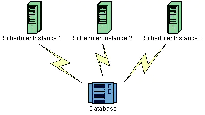

# Quartz框架

## Quartz基本配置

> **Quartz是启动定时任务的框架。**

### 1. Quartz的核心元素

> Quartz调度依靠的三大核心元素就是：Scheduler、Trigger、Job。

> **1. Job（任务）**

作用：具体要执行的业务逻辑，比如：发送短信、发送邮件、访问数据库、同步数据等。

> **2. Trigger（触发器）**

作用：用来定义Job（任务）触发条件、触发时间，触发间隔，终止时间等。
 四大类型：SimpleTrigger、CornTrigger、DateIntervalTrigger、NthIncludedDayTrigger。

> **3. scheduler（调度器）**

作用：Scheduler启动Trigger去执行Job。
 类型：Scheduler由scheduler工厂创建：**DirectSchedulerFactory 或者 StdSchedulerFactory。**
 第二种工厂StdSchedulerFactory使用较多，因为 DirectSchedulerFactory 使用起来不够方便，需要作许多详细的手工编码设置。
 Scheduler 主要有三种：**RemoteMBeanScheduler， RemoteScheduler 和 StdScheduler。**

### 2. Quartz的准备工作

#### 2.1. maven依赖


```xml
      <!--quartz相关依赖-->
        <dependency>
            <groupId>org.quartz-scheduler</groupId>
            <artifactId>quartz</artifactId>
            <version>2.2.1</version>
        </dependency>

        <dependency>
            <groupId>org.quartz-scheduler</groupId>
            <artifactId>quartz-jobs</artifactId>
            <version>2.2.1</version>
        </dependency>
    >>>>SpringBoot替换为：>>>>
    <!--quartz依赖-->
    <dependency>
        <groupId>org.springframework.boot</groupId>
        <artifactId>spring-boot-starter-quartz</artifactId>
    </dependency>
```

#### 2.2. Quartz的配置文件

在Quartz JAR文件的org.quartz包下就包含一个quartz.properties属性配置文件并提供了默认属性。如果需要调整默认配置，可以在类路径下建立一个新的quartz.properties，它将自动被Quartz加载并覆盖默认的设置。

##### 2.2.1 文件的加载位置

> 需要注意的是：配置文件一般为quartz.properties文件，但是如果使用yml文件格式的配置，则quartz.properties里面的配置会失效；

【配置文件】默认：优先顺序Classpath:quartz.properties-->org/quartz/quartz.properties

【程序内指定】在StdSchedulerFactory.getScheduler()之前使用StdSchedulerFactory.initialize(xx)

##### 2.2.2Quartz的配置信息

**注：`QuartzProperties`类读取的就是我们yml文件中的配置。**

> **1. 基础配置**

[scheduler的配置信息](https://links.jianshu.com/go?to=https%3A%2F%2Fblog.csdn.net%2Fjcy7523%2Farticle%2Fdetails%2F77482279)


```ruby
#可以为任意字符串，对于scheduler来说此值没有意义，但是可以区分同一系统中多个不同的实例，
#如果使用了集群的功能，就必须对每一个实例使用相同的名称，这样使这些实例“逻辑上”是同一个scheduler。
org.quartz.scheduler.instanceName = JobScheduler
#可以是任意字符串，但如果是集群，scheduler实例的值必须唯一，可以使用AUTO自动生成。
org.quartz.scheduler.instanceId = AUTO
org.quartz.scheduler.rmi.export = false
org.quartz.scheduler.rmi.proxy = false

# 默认false，若是在执行Job之前Quartz开启UserTransaction，此属性应该为true。
#Job执行完毕，JobDataMap更新完（如果是StatefulJob）事务就会提交。默认值是false，可以在job类上使用@ExecuteInJTATransaction 注解，以便在各自的job上决定是否开启JTA事务。
org.quartz.scheduler.wrapJobExecutionInUserTransaction = false
#一个scheduler节点允许接收的trigger的最大数，默认是1，这个值越大，定时任务执行的越多，但代价是集群节点之间的不均衡。
org.quartz.scheduler.batchTriggerAcquisitionMaxCount=1
```

> **2. 调度器线程池配置**


```csharp
#线程池的实例类，（一般使用SimpleThreadPool即可满足几乎所有用户的需求）
org.quartz.threadPool.class= org.quartz.simpl.SimpleThreadPool
#线程数量，不会动态增加
org.quartz.threadPool.threadCount= 10
#线程优先级
org.quartz.threadPool.threadPriority= 5
#加载任务代码的ClassLoader是否从外部继承
org.quartz.threadPool.threadsInheritContextClassLoaderOfInitializingThread= true
#是否设置调度器线程为守护线程
org.quartz.scheduler.makeSchedulerThreadDaemon: true
```

> **3. Configure JobStore 作业存储配置**

3.1. RAMJobStore

将schedule相关信息保存在RAM中，轻量级，速度快，遗憾的是应用重启时相关信息都将丢失。


```csharp
org.quartz.jobStore.class = org.quartz.simpl.RAMJobStore
#最大能忍受的触发超时时间，如果超时则认为“失误”
org.quartz.jobStore.misfireThreshold = 60000
```

3.2. JDBC-JobStore

将schedule相关信息保存在RDB中，有两种实现：JobStoreTX和JobStoreCMT

前者为application自己管理事务；
 后者为application server管理事务，即全局JTA；

JDBCJobStore终于把数据持久化起来了，这个也是使用最广泛的数据存储方式。在于Spring集成后都不需要自己配置一遍数据库连接了。

> 配置方式以及默认值：


```csharp
#选择JDBC的存储方式
org.quartz.jobStore.class= org.quartz.impl.jdbcjobstore.JobStoreTX
#类似于Hibernate的dialect，用于处理DB之间的差异，StdJDBCDelegate能满足大部分的DB（授权）
org.quartz.jobStore.driverDelegateClass = org.quartz.impl.jdbcjobstore.StdJDBCDelegate
#存储相关信息表的前缀
org.quartz.jobStore.tablePrefix = QRTZ_
#这个值必须datasource的配置信息
org.quartz.jobStore.dataSource = myDS
#JobDataMaps是否都为String类型
#（若是true的话，便可不用让更复杂的对象以序列化的形式保存到BLOB列中。以防序列化可能导致的版本号问题）
org.quartz.jobStore.useProperties = false
#最大能忍受的触发超时时间，如果超时则认为“失误”
org.quartz.jobStore.misfireThreshold = 60000
#是否是应用在集群中，当应用在集群中时必须设置为TRUE，否则会出错。
#如果有多个Quartz实例在用同一套数据库时，必须设置为true。
org.quartz.jobStore.isClustered=False
#只用于设置了isClustered为true的时候，设置一个频度（毫秒），用于实例报告给集群中的其他实例。
#这会影响到侦测失败实例的敏捷度。
org.quartz.jobStore.clusterCheckinInterval =15000
#这是JobStore能处理的错过触发的Trigger的最大数量。处理太多（2打）很快就会导致数据库表被锁定够长的时间，
#这样会妨碍别的（还未错过触发）trigger执行的性能。
org.quartz.jobStore.maxMisfiresToHandleAtATime=20
#设置这个参数为true会告诉Quartz从数据源获取连接后不要调用它的setAutoCommit(false)方法。
#在少数情况下是有用的，比如有一个驱动本来是关闭的，但是又调用这个关闭的方法。但是大部分情况下驱动都要求调用setAutoCommit(false)
org.quartz.jobStore.dontSetAutoCommitFalse=false
#这必须是一个从LOCKS表查询一行并对这行记录加锁的SQL。假设没有设置，默认值如下。
#{0}会在运行期间被前面配置的TABLE_PREFIX所代替
org.quartz.jobStore.selectWithLockSQL=SELECT * FROM {0}LOCKS WHERE LOCK_NAME = ? FOR UPDATE
#值为true时告知Quartz（当使用JobStoreTX或CMT）调用JDBC连接的setTransactionIsolation(Connection.TRANSACTION_SERIALIZABLE) 方法。这有助于某些数据库在高负载和长时间事务时锁的超时。
org.quartz.jobStore.txIsolationLevelSerializable=false
```

> **4. 数据库配置**

datasource的相关信息全部定义与quartz.properties中，quartz自己创建datasource。


```css
org.quartz.dataSource.NAME.driver
org.quartz.dataSource.NAME.URL
org.quartz.dataSource.NAME.user
org.quartz.dataSource.NAME.password
org.quartz.dataSource.NAME.maxConnections
```

> 需要注意的是，#NAME字段必须与$@org.quartz.jobStore.dataSource保持一致

**`但是一般我们的数据库连接池一般使用第三方连接池，那么就会导致org.quartz.jobStore.dataSource=#NAME无法配置！！可以使用quartz.job-store-type=jdbc替代。`**

##### 2.2.3 SpringBoot2.x整合Quartz的配置文件

自动加载的源码：**`org.springframework.boot.autoconfigure.quartz.QuartzAutoConfiguration`**


```bash
spring:
  datasource:
    name: mysql_test
    type: com.alibaba.druid.pool.DruidDataSource
    #druid相关配置
    druid:
      #监控统计拦截的filters
      filter: stat,config
#      driver-class-name: com.mysql.cj.jdbc.Driver
      #基本属性
      url: jdbc:mysql://localhost:3306/mydb
      username: root
      password: 123456
      #初始化连接数
      initial-size: 10
      #最小活跃连接数
      min-size: 5
      #最大活跃连接数
      max-active: 20
      #获取连接的等待时间
      max-wait: 60000
      #间隔多久进行一次检查，检查需要关闭的空闲连接
      time-between-eviction-runs-millis: 60000
      #一个连接在池中最小的生存时间(5分钟)
      min-evictable-idle-time-millis: 300000
      validation-query: SELECT 'X'
      # 验证空闲的连接，若无法验证，则删除连接
      test-while-idle: true
      # 不检测池中连接的可用性（默认false）
      # 导致的问题是，若项目作为服务端，数据库连接被关闭时，客户端调用就会出现大量的timeout
      test-on-borrow: false
      #在返回连接池之前是否验证对象
      test-on-return: false
      #打开PSCache，并指定每个连接上PSCache的大小。oracle设为true，mysql设为false。分库分表较多推荐设置为false
      #第三发连接池在使用的时候，获取到Connection后，使用完毕，调用关闭方法，并没有将Connection关闭，只是放回到连接池中
      #如果调用这个方法，而没有手动关闭PreparedStatement，就可能造成内存溢出，但是JDK1.7实现了AutoCloseable接口，就不需要关闭了
      pool-prepared-statements: false
      max-pool-prepared-statement-per-connection-size: 20
      # connection-properties:
      use-unfair-lock: true
  quartz:
    #相关属性配置
    properties:
      org:
        quartz:
          scheduler:
            # 集群名，区分同一系统的不同实例，若使用集群功能，则每一个实例都要使用相同的名字
            instanceName: clusteredScheduler
            # 若是集群下，每个instanceId必须唯一
            instanceId: AUTO
          threadPool:
            #一般使用这个便可
            class: org.quartz.simpl.SimpleThreadPool
            #线程数量，不会动态增加
            threadCount: 10
            threadPriority: 5
            threadsInheritContextClassLoaderOfInitializingThread: true
          jobStore:
            #选择JDBC的存储方式
            class: org.quartz.impl.jdbcjobstore.JobStoreTX
            driverDelegateClass: org.quartz.impl.jdbcjobstore.StdJDBCDelegate
            tablePrefix: QRTZ_
            useProperties: false
            isClustered: true
            clusterCheckinInterval: 15000
    job-store-type: jdbc
    #是否等待任务执行完毕后，容器才会关闭
    wait-for-jobs-to-complete-on-shutdown=false
    #配置的job是否覆盖已经存在的JOB信息
    overwrite-existing-jobs: false
```

**1. 讲一下最后两个配置**

1. wait-for-jobs-to-complete-on-shutdown：Quartz默认false，是否等待任务运行完毕后关闭Spring容器，若是为false的情况下，可能出现**`java.lang.IllegalStateException: JobStore is shutdown - aborting retry`**异常，推荐开启。
2. overwrite-existing-jobs：这个是配置文件的job是否会覆盖数据库正在运行的job。quartz启动之后，会以数据库的为准，若该属性为false，则配置文件修改后不会起作用。

**2. 线程池配置不生效问题及原因**

配置线程池参数，无论怎样都不生效。经过debug得知。源码：**`org.quartz.impl.StdSchedulerFactory#instantiate()`**，由于线程池的参数有误，导致配置的是默认值。


image.png

## jobstore数据库字段详解

从上节我们知道JobStore的存储方式有两种：

- RAMJobStore：将scheduler存储在内存中，但是重启服务器信息会丢失。
- JDBCJobStore：将scheduler存储在数据库中。

> 所有需要在数据库中创建数据库表，来完成scheduler数据的存储。

[官网——quartz所需的sql地址](https://links.jianshu.com/go?to=https%3A%2F%2Fgithub.com%2Fquartz-scheduler%2Fquartz%2Fblob%2Fmaster%2Fquartz-core%2Fsrc%2Fmain%2Fresources%2Forg%2Fquartz%2Fimpl%2Fjdbcjobstore%2Ftables_mysql_innodb.sql)

> 汇总：每张表的使命

1. qrtz_job_details：记录每个任务的详细信息。
2. qrtz_triggers：记录每个触发器的详细信息。
3. qrtz_corn_triggers：记录cornTrigger的信息。
4. qrtz_scheduler_state：记录 调度器（每个机器节点）的生命状态。
5. qrtz_fired_triggers：记录每个正在执行的触发器。
6. qrtz_locks：记录程序的悲观锁（防止多个节点同时执行同一个定时任务）。

> **1. qrtz_job_details**

存储每一个已配置的Job的详细信息。


```go
CREATE TABLE `qrtz_job_details` (
  `SCHED_NAME` varchar(120) COLLATE utf8_bin NOT NULL COMMENT '调度器名,集群环境中使用,必须使用同一个名称——集群环境下”逻辑”相同的scheduler,默认为QuartzScheduler',
  `JOB_NAME` varchar(200) COLLATE utf8_bin NOT NULL COMMENT '集群中job的名字',
  `JOB_GROUP` varchar(200) COLLATE utf8_bin NOT NULL COMMENT '集群中job的所属组的名字',
  `DESCRIPTION` varchar(250) COLLATE utf8_bin DEFAULT NULL COMMENT '描述',
  `JOB_CLASS_NAME` varchar(250) COLLATE utf8_bin NOT NULL COMMENT '集群中个note job实现类的完全包名,quartz就是根据这个路径到classpath找到该job类',
  `IS_DURABLE` varchar(1) COLLATE utf8_bin NOT NULL COMMENT '是否持久化,把该属性设置为1，quartz会把job持久化到数据库中',
  `IS_NONCONCURRENT` varchar(1) COLLATE utf8_bin NOT NULL COMMENT '是否并行，该属性可以通过注解配置',
  `IS_UPDATE_DATA` varchar(1) COLLATE utf8_bin NOT NULL,
  `REQUESTS_RECOVERY` varchar(1) COLLATE utf8_bin NOT NULL COMMENT '当一个scheduler失败后，其他实例可以发现那些执行失败的Jobs，若是1，那么该Job会被其他实例重新执行，否则对应的Job只能释放等待下次触发',
  `JOB_DATA` blob COMMENT '一个blob字段，存放持久化job对象',
  PRIMARY KEY (`SCHED_NAME`,`JOB_NAME`,`JOB_GROUP`)
) ENGINE=InnoDB DEFAULT CHARSET=utf8 COLLATE=utf8_bin COMMENT='存储每一个已配置的 Job 的详细信息';
```

> **2. qrtz_triggers**

存放配置的Trigger信息

**注意：**
 **`1. 一个Job可以被多个Trigger绑定，但是一个Trigger只能绑定一个Job。`**

**`2. MISFIRE_INSTR字段表示misfire策略，cornTrigger和SimpleTrigger含有不同的含义，以cronTrigger为例，字段枚举如下：org.quartz.Trigger类下：`**


```java
//quartz默认策略，cornTrigger使用MISFIRE_INSTRUCTION_FIRE_ONCE_NOW
public static final int MISFIRE_INSTRUCTION_SMART_POLICY = 0;
//恢复后，重新执行misfire次
public static final int MISFIRE_INSTRUCTION_IGNORE_MISFIRE_POLICY = -1;
//无论misfire多少次，恢复后只执行一次
public static final int MISFIRE_INSTRUCTION_FIRE_ONCE_NOW = 1;
//无论misfire多少次，恢复后，一次都不执行
public static final int MISFIRE_INSTRUCTION_DO_NOTHING = 2;
```


```go
CREATE TABLE `qrtz_triggers` (
  `SCHED_NAME` varchar(120) COLLATE utf8_bin NOT NULL COMMENT '调度器名，和配置文件org.quartz.scheduler.instanceName保持一致',
  `TRIGGER_NAME` varchar(200) COLLATE utf8_bin NOT NULL COMMENT '触发器的名字',
  `TRIGGER_GROUP` varchar(200) COLLATE utf8_bin NOT NULL COMMENT '触发器所属组的名字',
  `JOB_NAME` varchar(200) COLLATE utf8_bin NOT NULL COMMENT 'qrtz_job_details表job_name的外键',
  `JOB_GROUP` varchar(200) COLLATE utf8_bin NOT NULL COMMENT 'qrtz_job_details表job_group的外键',
  `DESCRIPTION` varchar(250) COLLATE utf8_bin DEFAULT NULL COMMENT '描述',
  `NEXT_FIRE_TIME` bigint(13) DEFAULT NULL COMMENT '下一次触发时间',
  `PREV_FIRE_TIME` bigint(13) DEFAULT NULL COMMENT '上一次触发时间',
  `PRIORITY` int(11) DEFAULT NULL COMMENT '线程优先级',
  `TRIGGER_STATE` varchar(16) COLLATE utf8_bin NOT NULL COMMENT '当前trigger状态，设置为ACQUIRED,如果设置为WAITING,则job不会触发',
  `TRIGGER_TYPE` varchar(8) COLLATE utf8_bin NOT NULL COMMENT '触发器类型',
  `START_TIME` bigint(13) NOT NULL COMMENT '开始时间',
  `END_TIME` bigint(13) DEFAULT NULL COMMENT '结束时间',
  `CALENDAR_NAME` varchar(200) COLLATE utf8_bin DEFAULT NULL COMMENT '日历名称',
  `MISFIRE_INSTR` smallint(2) DEFAULT NULL COMMENT 'misfire处理规则,1代表【以当前时间为触发频率立刻触发一次，然后按照Cron频率依次执行】,
   2代表【不触发立即执行,等待下次Cron触发频率到达时刻开始按照Cron频率依次执行�】,
   -1代表【以错过的第一个频率时间立刻开始执行,重做错过的所有频率周期后，当下一次触发频率发生时间大于当前时间后，再按照正常的Cron频率依次执行】',
  `JOB_DATA` blob COMMENT 'JOB存储对象',
  PRIMARY KEY (`SCHED_NAME`,`TRIGGER_NAME`,`TRIGGER_GROUP`),
  KEY `SCHED_NAME` (`SCHED_NAME`,`JOB_NAME`,`JOB_GROUP`),
  CONSTRAINT `qrtz_triggers_ibfk_1` FOREIGN KEY (`SCHED_NAME`, `JOB_NAME`, `JOB_GROUP`) REFERENCES `qrtz_job_details` (`SCHED_NAME`, `JOB_NAME`, `JOB_GROUP`)
) ENGINE=InnoDB DEFAULT CHARSET=utf8 COLLATE=utf8_bin COMMENT='存储已配置的 Trigger 的信息';
```

> **3. qrtz_corn_triggers**

存放cron类型的触发器


```go
CREATE TABLE `qrtz_cron_triggers` (
  `SCHED_NAME` varchar(120) COLLATE utf8_bin NOT NULL COMMENT '集群名',
  `TRIGGER_NAME` varchar(200) COLLATE utf8_bin NOT NULL COMMENT '调度器名,qrtz_triggers表trigger_name的外键',
  `TRIGGER_GROUP` varchar(200) COLLATE utf8_bin NOT NULL COMMENT 'qrtz_triggers表trigger_group的外键',
  `CRON_EXPRESSION` varchar(200) COLLATE utf8_bin NOT NULL COMMENT 'cron表达式',
  `TIME_ZONE_ID` varchar(80) COLLATE utf8_bin DEFAULT NULL COMMENT '时区ID',
  PRIMARY KEY (`SCHED_NAME`,`TRIGGER_NAME`,`TRIGGER_GROUP`),
  CONSTRAINT `qrtz_cron_triggers_ibfk_1` FOREIGN KEY (`SCHED_NAME`, `TRIGGER_NAME`, `TRIGGER_GROUP`) REFERENCES `qrtz_triggers` (`SCHED_NAME`, `TRIGGER_NAME`, `TRIGGER_GROUP`)
) ENGINE=InnoDB DEFAULT CHARSET=utf8 COLLATE=utf8_bin COMMENT='存放cron类型的触发器';
```

> **4. qrtz_scheduler_state**

存储所有节点的scheduler，会定期检查scheduler是否失效，启动多个scheduler，查询数据库：


image

记录了最后最新的检查时间，在quartz.properties中设置了CHECKIN_INTERVAL为1000，也就是每秒检查一次；


```go
CREATE TABLE `qrtz_scheduler_state` (
  `SCHED_NAME` varchar(120) COLLATE utf8_bin NOT NULL COMMENT '调度器名称，集群名',
  `INSTANCE_NAME` varchar(200) COLLATE utf8_bin NOT NULL COMMENT '集群中实例ID，配置文件中org.quartz.scheduler.instanceId的配置',
  `LAST_CHECKIN_TIME` bigint(13) NOT NULL COMMENT '上次检查时间',
  `CHECKIN_INTERVAL` bigint(13) NOT NULL COMMENT '检查时间间隔',
  PRIMARY KEY (`SCHED_NAME`,`INSTANCE_NAME`)
) ENGINE=InnoDB DEFAULT CHARSET=utf8 COLLATE=utf8_bin COMMENT='调度器状态';
```

> **5. qrtz_fired_triggers**

存储已经触发的trigger相关信息，trigger随着时间的推移状态发生变化，直到最后trigger执行完成，从表中被删除；以SimpleTrigger为例重复3次执行为例。
 **相同的trigger和job，每触发一次都会创建一个实例；从刚被创建的ACQUIRED状态，到EXECUTING状态，最后执行完从数据库中删除；**


状态变化


```php
CREATE TABLE `qrtz_fired_triggers` (
  `SCHED_NAME` varchar(120) COLLATE utf8_bin NOT NULL COMMENT '调度器名称，集群名',
  `ENTRY_ID` varchar(95) COLLATE utf8_bin NOT NULL COMMENT '运行Id',
  `TRIGGER_NAME` varchar(200) COLLATE utf8_bin NOT NULL COMMENT '触发器名',
  `TRIGGER_GROUP` varchar(200) COLLATE utf8_bin NOT NULL COMMENT '触发器组',
  `INSTANCE_NAME` varchar(200) COLLATE utf8_bin NOT NULL COMMENT '集群中实例ID',
  `FIRED_TIME` bigint(13) NOT NULL COMMENT '触发时间',
  `SCHED_TIME` bigint(13) NOT NULL,
  `PRIORITY` int(11) NOT NULL COMMENT '线程优先级',
  `STATE` varchar(16) COLLATE utf8_bin NOT NULL COMMENT '状态',
  `JOB_NAME` varchar(200) COLLATE utf8_bin DEFAULT NULL COMMENT '任务名',
  `JOB_GROUP` varchar(200) COLLATE utf8_bin DEFAULT NULL COMMENT '任务组',
  `IS_NONCONCURRENT` varchar(1) COLLATE utf8_bin DEFAULT NULL COMMENT '是否并行',
  `REQUESTS_RECOVERY` varchar(1) COLLATE utf8_bin DEFAULT NULL COMMENT '是否恢复',
  PRIMARY KEY (`SCHED_NAME`,`ENTRY_ID`)
) ENGINE=InnoDB DEFAULT CHARSET=utf8 COLLATE=utf8_bin COMMENT='存储与已触发的 Trigger 相关的状态信息，以及相联 Job 的执行信息';
```

> **6. qrtz_simple_triggers**

存储简单的trigger，包括重复次数，间隔，以及触发次数。
 **注意：**TIMES_TRIGGERED用来记录执行了多少次了，此值被定义在SimpleTriggerImpl中，每次执行+1，这里定义的REPEAT_COUNT=5，实际情况会执行6次。因为第一次是在0开始。


```go
CREATE TABLE `qrtz_simple_triggers` (
  `SCHED_NAME` varchar(120) COLLATE utf8_bin NOT NULL COMMENT '调度器名，集群名',
  `TRIGGER_NAME` varchar(200) COLLATE utf8_bin NOT NULL COMMENT '触发器名',
  `TRIGGER_GROUP` varchar(200) COLLATE utf8_bin NOT NULL COMMENT '触发器组',
  `REPEAT_COUNT` bigint(7) NOT NULL COMMENT '重复次数',
  `REPEAT_INTERVAL` bigint(12) NOT NULL COMMENT '重复间隔',
  `TIMES_TRIGGERED` bigint(10) NOT NULL COMMENT '已触发次数',
  PRIMARY KEY (`SCHED_NAME`,`TRIGGER_NAME`,`TRIGGER_GROUP`),
  CONSTRAINT `qrtz_simple_triggers_ibfk_1` FOREIGN KEY (`SCHED_NAME`, `TRIGGER_NAME`, `TRIGGER_GROUP`) REFERENCES `qrtz_triggers` (`SCHED_NAME`, `TRIGGER_NAME`, `TRIGGER_GROUP`)
) ENGINE=InnoDB DEFAULT CHARSET=utf8 COLLATE=utf8_bin COMMENT='存储简单的 Trigger，包括重复次数，间隔，以及已触的次数';
```

> **7. qrtz_simprop_triggers**

存储CalendarIntervalTrigger和DailyTimeIntervalTrigger两种类型的触发器，使用CalendarIntervalTrigger做如下配置：

CalendarIntervalTrigger没有对应的FactoryBean，直接设置实现类CalendarIntervalTriggerImpl；指定的重复周期是1，默认单位是天，也就是每天执行一次。


```go
CREATE TABLE `qrtz_simprop_triggers` (
  `SCHED_NAME` varchar(120) COLLATE utf8_bin NOT NULL,
  `TRIGGER_NAME` varchar(200) COLLATE utf8_bin NOT NULL,
  `TRIGGER_GROUP` varchar(200) COLLATE utf8_bin NOT NULL,
  `STR_PROP_1` varchar(512) COLLATE utf8_bin DEFAULT NULL,
  `STR_PROP_2` varchar(512) COLLATE utf8_bin DEFAULT NULL,
  `STR_PROP_3` varchar(512) COLLATE utf8_bin DEFAULT NULL,
  `INT_PROP_1` int(11) DEFAULT NULL,
  `INT_PROP_2` int(11) DEFAULT NULL,
  `LONG_PROP_1` bigint(20) DEFAULT NULL,
  `LONG_PROP_2` bigint(20) DEFAULT NULL,
  `DEC_PROP_1` decimal(13,4) DEFAULT NULL,
  `DEC_PROP_2` decimal(13,4) DEFAULT NULL,
  `BOOL_PROP_1` varchar(1) COLLATE utf8_bin DEFAULT NULL,
  `BOOL_PROP_2` varchar(1) COLLATE utf8_bin DEFAULT NULL,
  PRIMARY KEY (`SCHED_NAME`,`TRIGGER_NAME`,`TRIGGER_GROUP`),
  CONSTRAINT `qrtz_simprop_triggers_ibfk_1` FOREIGN KEY (`SCHED_NAME`, `TRIGGER_NAME`, `TRIGGER_GROUP`) REFERENCES `qrtz_triggers` (`SCHED_NAME`, `TRIGGER_NAME`, `TRIGGER_GROUP`)
) ENGINE=InnoDB DEFAULT CHARSET=utf8 COLLATE=utf8_bin COMMENT='存储CalendarIntervalTrigger和DailyTimeIntervalTrigger两种类型的触发器';
```

> **8. qrtz_blob_triggers**

自定义的triggers使用blog类型进行存储，非自定义的triggers不会存放在此表中，Quartz提供的triggers包括：CronTrigger，CalendarIntervalTrigger，DailyTimeIntervalTrigger以及SimpleTrigger。


```go
CREATE TABLE `qrtz_blob_triggers` (
  `SCHED_NAME` varchar(120) COLLATE utf8_bin NOT NULL,
  `TRIGGER_NAME` varchar(200) COLLATE utf8_bin NOT NULL,
  `TRIGGER_GROUP` varchar(200) COLLATE utf8_bin NOT NULL,
  `BLOB_DATA` blob,
  PRIMARY KEY (`SCHED_NAME`,`TRIGGER_NAME`,`TRIGGER_GROUP`),
  CONSTRAINT `qrtz_blob_triggers_ibfk_1` FOREIGN KEY (`SCHED_NAME`, `TRIGGER_NAME`, `TRIGGER_GROUP`) REFERENCES `qrtz_triggers` (`SCHED_NAME`, `TRIGGER_NAME`, `TRIGGER_GROUP`)
) ENGINE=InnoDB DEFAULT CHARSET=utf8 COLLATE=utf8_bin;
```

> **9. qrtz_calendars**

以 Blob 类型存储 Quartz 的 Calendar 信息


```objectivec
CREATE TABLE qrtz_calendars
(
  SCHED_NAME VARCHAR2(120) NOT NULL,
  CALENDAR_NAME  VARCHAR2(200) NOT NULL,
  CALENDAR BLOB NOT NULL,
  CONSTRAINT QRTZ_CALENDARS_PK PRIMARY KEY (SCHED_NAME,CALENDAR_NAME)
);
```

> **10. qrtz_paused_trigger_grps**

存储已暂停的 Trigger 组的信息


```cpp
CREATE TABLE qrtz_paused_trigger_grps
(
  SCHED_NAME VARCHAR2(120) NOT NULL,
  TRIGGER_GROUP  VARCHAR2(200) NOT NULL,
  CONSTRAINT QRTZ_PAUSED_TRIG_GRPS_PK PRIMARY KEY (SCHED_NAME,TRIGGER_GROUP)
);
```

> **11. qrtz_locks**

存储程序的悲观锁的信息(假如使用了悲观锁)

Quartz提供的锁表，为多个节点调度提供分布式锁，实现分布式调度，默认有2个锁：

- STATE_ACCESS主要用在scheduler定期检查是否有效的时候，保证只有一个节点去处理已经失效的scheduler。
- TRIGGER_ACCESS主要用在TRIGGER被调度的时候，保证只有一个节点去执行调度。


```cpp
CREATE TABLE qrtz_locks
(
  SCHED_NAME VARCHAR2(120) NOT NULL,
  LOCK_NAME  VARCHAR2(40) NOT NULL,
  CONSTRAINT QRTZ_LOCKS_PK PRIMARY KEY (SCHED_NAME,LOCK_NAME)
);
```

[Quartz的配置细节](https://links.jianshu.com/go?to=https%3A%2F%2Fwww.cnblogs.com%2Fdyx2018%2Fp%2F9557600.html)

**附录：**

> 1. Quartz的2.*版本数据库建表语句


```go
DROP TABLE  QRTZ_FIRED_TRIGGERS;
DROP TABLE QRTZ_PAUSED_TRIGGER_GRPS;
DROP TABLE QRTZ_SCHEDULER_STATE;
DROP TABLE QRTZ_LOCKS;
DROP TABLE QRTZ_SIMPLE_TRIGGERS;
DROP TABLE QRTZ_SIMPROP_TRIGGERS;
DROP TABLE QRTZ_CRON_TRIGGERS;
DROP TABLE QRTZ_BLOB_TRIGGERS;
DROP TABLE QRTZ_TRIGGERS;
DROP TABLE QRTZ_JOB_DETAILS;
DROP TABLE QRTZ_CALENDARS;

CREATE TABLE `qrtz_job_details` (
  `SCHED_NAME` varchar(120) COLLATE utf8_bin NOT NULL,
  `JOB_NAME` varchar(200) COLLATE utf8_bin NOT NULL,
  `JOB_GROUP` varchar(200) COLLATE utf8_bin NOT NULL,
  `DESCRIPTION` varchar(250) COLLATE utf8_bin DEFAULT NULL,
  `JOB_CLASS_NAME` varchar(250) COLLATE utf8_bin NOT NULL,
  `IS_DURABLE` varchar(1) COLLATE utf8_bin NOT NULL,
  `IS_NONCONCURRENT` varchar(1) COLLATE utf8_bin NOT NULL,
  `IS_UPDATE_DATA` varchar(1) COLLATE utf8_bin NOT NULL,
  `REQUESTS_RECOVERY` varchar(1) COLLATE utf8_bin NOT NULL,
  `JOB_DATA` blob,
  PRIMARY KEY (`SCHED_NAME`,`JOB_NAME`,`JOB_GROUP`)
) ENGINE = InnoDB DEFAULT CHARSET=utf8 COLLATE =utf8_bin;


CREATE TABLE `qrtz_calendars` (
  `SCHED_NAME` varchar(120) COLLATE utf8_bin NOT NULL,
  `CALENDAR_NAME` varchar(200) COLLATE utf8_bin NOT NULL,
  `CALENDAR` blob NOT NULL,
  PRIMARY KEY (`SCHED_NAME`,`CALENDAR_NAME`)
) ENGINE=InnoDB DEFAULT CHARSET=utf8 COLLATE=utf8_bin;

CREATE TABLE `qrtz_triggers` (
  `SCHED_NAME` varchar(120) COLLATE utf8_bin NOT NULL,
  `TRIGGER_NAME` varchar(200) COLLATE utf8_bin NOT NULL,
  `TRIGGER_GROUP` varchar(200) COLLATE utf8_bin NOT NULL,
  `JOB_NAME` varchar(200) COLLATE utf8_bin NOT NULL,
  `JOB_GROUP` varchar(200) COLLATE utf8_bin NOT NULL,
  `DESCRIPTION` varchar(250) COLLATE utf8_bin DEFAULT NULL,
  `NEXT_FIRE_TIME` bigint(13) DEFAULT NULL,
  `PREV_FIRE_TIME` bigint(13) DEFAULT NULL,
  `PRIORITY` int(11) DEFAULT NULL,
  `TRIGGER_STATE` varchar(16) COLLATE utf8_bin NOT NULL,
  `TRIGGER_TYPE` varchar(8) COLLATE utf8_bin NOT NULL,
  `START_TIME` bigint(13) NOT NULL,
  `END_TIME` bigint(13) DEFAULT NULL,
  `CALENDAR_NAME` varchar(200) COLLATE utf8_bin DEFAULT NULL,
  `MISFIRE_INSTR` smallint(2) DEFAULT NULL,
  `JOB_DATA` blob,
  PRIMARY KEY (`SCHED_NAME`,`TRIGGER_NAME`,`TRIGGER_GROUP`),
  KEY `SCHED_NAME` (`SCHED_NAME`,`JOB_NAME`,`JOB_GROUP`),
  CONSTRAINT `qrtz_triggers_ibfk_1` FOREIGN KEY (`SCHED_NAME`, `JOB_NAME`, `JOB_GROUP`) REFERENCES `qrtz_job_details` (`SCHED_NAME`, `JOB_NAME`, `JOB_GROUP`)
) ENGINE=InnoDB DEFAULT CHARSET=utf8 COLLATE=utf8_bin;


CREATE TABLE `qrtz_blob_triggers` (
  `SCHED_NAME` varchar(120) COLLATE utf8_bin NOT NULL,
  `TRIGGER_NAME` varchar(200) COLLATE utf8_bin NOT NULL,
  `TRIGGER_GROUP` varchar(200) COLLATE utf8_bin NOT NULL,
  `BLOB_DATA` blob,
  PRIMARY KEY (`SCHED_NAME`,`TRIGGER_NAME`,`TRIGGER_GROUP`),
  CONSTRAINT `qrtz_blob_triggers_ibfk_1` FOREIGN KEY (`SCHED_NAME`, `TRIGGER_NAME`, `TRIGGER_GROUP`) REFERENCES `qrtz_triggers` (`SCHED_NAME`, `TRIGGER_NAME`, `TRIGGER_GROUP`)
) ENGINE=InnoDB DEFAULT CHARSET=utf8 COLLATE=utf8_bin;


CREATE TABLE `qrtz_cron_triggers` (
  `SCHED_NAME` varchar(120) COLLATE utf8_bin NOT NULL,
  `TRIGGER_NAME` varchar(200) COLLATE utf8_bin NOT NULL,
  `TRIGGER_GROUP` varchar(200) COLLATE utf8_bin NOT NULL,
  `CRON_EXPRESSION` varchar(200) COLLATE utf8_bin NOT NULL,
  `TIME_ZONE_ID` varchar(80) COLLATE utf8_bin DEFAULT NULL,
  PRIMARY KEY (`SCHED_NAME`,`TRIGGER_NAME`,`TRIGGER_GROUP`),
  CONSTRAINT `qrtz_cron_triggers_ibfk_1` FOREIGN KEY (`SCHED_NAME`, `TRIGGER_NAME`, `TRIGGER_GROUP`) REFERENCES `qrtz_triggers` (`SCHED_NAME`, `TRIGGER_NAME`, `TRIGGER_GROUP`)
) ENGINE=InnoDB DEFAULT CHARSET=utf8 COLLATE=utf8_bin;


CREATE TABLE `qrtz_fired_triggers` (
  `SCHED_NAME` varchar(120) COLLATE utf8_bin NOT NULL,
  `ENTRY_ID` varchar(95) COLLATE utf8_bin NOT NULL,
  `TRIGGER_NAME` varchar(200) COLLATE utf8_bin NOT NULL,
  `TRIGGER_GROUP` varchar(200) COLLATE utf8_bin NOT NULL,
  `INSTANCE_NAME` varchar(200) COLLATE utf8_bin NOT NULL,
  `FIRED_TIME` bigint(13) NOT NULL,
  `SCHED_TIME` bigint(13) NOT NULL,
  `PRIORITY` int(11) NOT NULL,
  `STATE` varchar(16) COLLATE utf8_bin NOT NULL,
  `JOB_NAME` varchar(200) COLLATE utf8_bin DEFAULT NULL,
  `JOB_GROUP` varchar(200) COLLATE utf8_bin DEFAULT NULL,
  `IS_NONCONCURRENT` varchar(1) COLLATE utf8_bin DEFAULT NULL,
  `REQUESTS_RECOVERY` varchar(1) COLLATE utf8_bin DEFAULT NULL,
  PRIMARY KEY (`SCHED_NAME`,`ENTRY_ID`)
) ENGINE=InnoDB DEFAULT CHARSET=utf8 COLLATE=utf8_bin;


CREATE TABLE `qrtz_locks` (
  `SCHED_NAME` varchar(120) COLLATE utf8_bin NOT NULL,
  `LOCK_NAME` varchar(40) COLLATE utf8_bin NOT NULL,
  PRIMARY KEY (`SCHED_NAME`,`LOCK_NAME`)
) ENGINE=InnoDB DEFAULT CHARSET=utf8 COLLATE=utf8_bin;


CREATE TABLE `qrtz_paused_trigger_grps` (
  `SCHED_NAME` varchar(120) COLLATE utf8_bin NOT NULL,
  `TRIGGER_GROUP` varchar(200) COLLATE utf8_bin NOT NULL,
  PRIMARY KEY (`SCHED_NAME`,`TRIGGER_GROUP`)
) ENGINE=InnoDB DEFAULT CHARSET=utf8 COLLATE=utf8_bin;

CREATE TABLE `qrtz_scheduler_state` (
  `SCHED_NAME` varchar(120) COLLATE utf8_bin NOT NULL,
  `INSTANCE_NAME` varchar(200) COLLATE utf8_bin NOT NULL,
  `LAST_CHECKIN_TIME` bigint(13) NOT NULL,
  `CHECKIN_INTERVAL` bigint(13) NOT NULL,
  PRIMARY KEY (`SCHED_NAME`,`INSTANCE_NAME`)
) ENGINE=InnoDB DEFAULT CHARSET=utf8 COLLATE=utf8_bin;

CREATE TABLE `qrtz_simple_triggers` (
  `SCHED_NAME` varchar(120) COLLATE utf8_bin NOT NULL,
  `TRIGGER_NAME` varchar(200) COLLATE utf8_bin NOT NULL,
  `TRIGGER_GROUP` varchar(200) COLLATE utf8_bin NOT NULL,
  `REPEAT_COUNT` bigint(7) NOT NULL,
  `REPEAT_INTERVAL` bigint(12) NOT NULL,
  `TIMES_TRIGGERED` bigint(10) NOT NULL,
  PRIMARY KEY (`SCHED_NAME`,`TRIGGER_NAME`,`TRIGGER_GROUP`),
  CONSTRAINT `qrtz_simple_triggers_ibfk_1` FOREIGN KEY (`SCHED_NAME`, `TRIGGER_NAME`, `TRIGGER_GROUP`) REFERENCES `qrtz_triggers` (`SCHED_NAME`, `TRIGGER_NAME`, `TRIGGER_GROUP`)
) ENGINE=InnoDB DEFAULT CHARSET=utf8 COLLATE=utf8_bin;

CREATE TABLE `qrtz_simprop_triggers` (
  `SCHED_NAME` varchar(120) COLLATE utf8_bin NOT NULL,
  `TRIGGER_NAME` varchar(200) COLLATE utf8_bin NOT NULL,
  `TRIGGER_GROUP` varchar(200) COLLATE utf8_bin NOT NULL,
  `STR_PROP_1` varchar(512) COLLATE utf8_bin DEFAULT NULL,
  `STR_PROP_2` varchar(512) COLLATE utf8_bin DEFAULT NULL,
  `STR_PROP_3` varchar(512) COLLATE utf8_bin DEFAULT NULL,
  `INT_PROP_1` int(11) DEFAULT NULL,
  `INT_PROP_2` int(11) DEFAULT NULL,
  `LONG_PROP_1` bigint(20) DEFAULT NULL,
  `LONG_PROP_2` bigint(20) DEFAULT NULL,
  `DEC_PROP_1` decimal(13,4) DEFAULT NULL,
  `DEC_PROP_2` decimal(13,4) DEFAULT NULL,
  `BOOL_PROP_1` varchar(1) COLLATE utf8_bin DEFAULT NULL,
  `BOOL_PROP_2` varchar(1) COLLATE utf8_bin DEFAULT NULL,
  PRIMARY KEY (`SCHED_NAME`,`TRIGGER_NAME`,`TRIGGER_GROUP`),
  CONSTRAINT `qrtz_simprop_triggers_ibfk_1` FOREIGN KEY (`SCHED_NAME`, `TRIGGER_NAME`, `TRIGGER_GROUP`) REFERENCES `qrtz_triggers` (`SCHED_NAME`, `TRIGGER_NAME`, `TRIGGER_GROUP`)
) ENGINE=InnoDB DEFAULT CHARSET=utf8 COLLATE=utf8_bin;

create index idx_qrtz_j_req_recovery on qrtz_job_details(SCHED_NAME,REQUESTS_RECOVERY);
create index idx_qrtz_j_grp on qrtz_job_details(SCHED_NAME,JOB_GROUP);

create index idx_qrtz_t_j on qrtz_triggers(SCHED_NAME,JOB_NAME,JOB_GROUP);
create index idx_qrtz_t_jg on qrtz_triggers(SCHED_NAME,JOB_GROUP);
create index idx_qrtz_t_c on qrtz_triggers(SCHED_NAME,CALENDAR_NAME);
create index idx_qrtz_t_g on qrtz_triggers(SCHED_NAME,TRIGGER_GROUP);
create index idx_qrtz_t_state on qrtz_triggers(SCHED_NAME,TRIGGER_STATE);
create index idx_qrtz_t_n_state on qrtz_triggers(SCHED_NAME,TRIGGER_NAME,TRIGGER_GROUP,TRIGGER_STATE);
create index idx_qrtz_t_n_g_state on qrtz_triggers(SCHED_NAME,TRIGGER_GROUP,TRIGGER_STATE);
create index idx_qrtz_t_next_fire_time on qrtz_triggers(SCHED_NAME,NEXT_FIRE_TIME);
create index idx_qrtz_t_nft_st on qrtz_triggers(SCHED_NAME,TRIGGER_STATE,NEXT_FIRE_TIME);
create index idx_qrtz_t_nft_misfire on qrtz_triggers(SCHED_NAME,MISFIRE_INSTR,NEXT_FIRE_TIME);
create index idx_qrtz_t_nft_st_misfire on qrtz_triggers(SCHED_NAME,MISFIRE_INSTR,NEXT_FIRE_TIME,TRIGGER_STATE);
create index idx_qrtz_t_nft_st_misfire_grp on qrtz_triggers(SCHED_NAME,MISFIRE_INSTR,NEXT_FIRE_TIME,TRIGGER_GROUP,TRIGGER_STATE);

create index idx_qrtz_ft_trig_inst_name on qrtz_fired_triggers(SCHED_NAME,INSTANCE_NAME);
create index idx_qrtz_ft_inst_job_req_rcvry on qrtz_fired_triggers(SCHED_NAME,INSTANCE_NAME,REQUESTS_RECOVERY);
create index idx_qrtz_ft_j_g on qrtz_fired_triggers(SCHED_NAME,JOB_NAME,JOB_GROUP);
create index idx_qrtz_ft_jg on qrtz_fired_triggers(SCHED_NAME,JOB_GROUP);
create index idx_qrtz_ft_t_g on qrtz_fired_triggers(SCHED_NAME,TRIGGER_NAME,TRIGGER_GROUP);

create index idx_qrtz_ft_tg on qrtz_fired_triggers(SCHED_NAME,TRIGGER_GROUP);
```

## 任务的并行/串行执行

> 若是多线程时，能够控制同一时刻相同的JOB只能有一个在执行。原因是由于定时执行频率是30s，然而可能30s后该job还没结束。结果另一个线程再次启用同一job下的方法。
>  我们希望前一个job结束后才能进行下一次的调用。那该如何设计呢？

### 1. 提出问题

**任务类：**


```java
@Component
public class TestJob2 extends  CustomQuartzJobBean{
    private Logger logger = LoggerFactory.getLogger(TestJob2.class);

    @Override
    protected void executeInternal(JobExecutionContext context) throws JobExecutionException {
        logger.info("【数据库配置定时】-【开始】");
        try {
            Thread.sleep(2000);
        } catch (InterruptedException e) {
            e.printStackTrace();
        }
        logger.info("【数据库配置定时】-【结束】");
    }
}
```

但定时是[*/1 * * * * ?]，即1s执行一次。


```css
2019-07-04 14:44:21,010 INFO [51877] [clusteredScheduler_Worker-10] [] (TestJob2.java:24): 【数据库配置定时】-【开始】
2019-07-04 14:44:21,011 INFO [51878] [clusteredScheduler_Worker-8] [] (TestJob2.java:30): 【数据库配置定时】-【结束】
2019-07-04 14:44:22,009 INFO [52876] [clusteredScheduler_Worker-5] [] (TestJob2.java:30): 【数据库配置定时】-【结束】
2019-07-04 14:44:22,010 INFO [52877] [clusteredScheduler_Worker-1] [] (TestJob2.java:24): 【数据库配置定时】-【开始】
2019-07-04 14:44:23,011 INFO [53878] [clusteredScheduler_Worker-3] [] (TestJob2.java:24): 【数据库配置定时】-【开始】
2019-07-04 14:44:23,010 INFO [53877] [clusteredScheduler_Worker-10] [] (TestJob2.java:30): 【数据库配置定时】-【结束】
```

**可以看到，此时的任务是并发执行。**


qrtz_job_details表数据.png

因为**将scheduler存储在数据库中。**由此我们可以看到该job【是否允许并发】字段为【no】。

### 2. 分析问题

**Spring提供了两种配置JobDetail的方式，官方示例如下：**


```xml
<!-- JobDetail配置 1 -->
<bean name="exampleJob" class="org.springframework.scheduling.quartz.JobDetailFactoryBean">
    <property name="jobClass" value="example.ExampleJob"/>
    <property name="jobDataAsMap">
        <map>
            <entry key="timeout" value="5"/>
        </map>
    </property>
</bean>
```


```xml
<!-- JobDetail配置 2 -->
<bean id="jobDetail" class="org.springframework.scheduling.quartz.MethodInvokingJobDetailFactoryBean">
    <property name="targetObject" ref="exampleBusinessObject"/>
    <property name="targetMethod" value="doIt"/>
    <property name="concurrent" value="false"/>
</bean>
```


```dart
 JobDetailFactoryBean jobFactory = new JobDetailFactoryBean();
 jobFactory.setName(jobName);
 jobFactory.setBeanName(clazzName);  //包名+类名
 jobFactory.setJobClass((Class<? extends Job>) aClass);
 jobFactory.setGroup(jobGroup);
 jobFactory.setDurability(true);
 jobFactory.afterPropertiesSet();

 MethodInvokingJobDetailFactoryBean invokingJobDetailFactoryBean=new MethodInvokingJobDetailFactoryBean();
 invokingJobDetailFactoryBean.setConcurrent(false);
 invokingJobDetailFactoryBean.setName(jobName);
 invokingJobDetailFactoryBean.setGroup(jobGroup);
 invokingJobDetailFactoryBean.setTargetClass(aClass);
 invokingJobDetailFactoryBean.setTargetMethod("xxx");
```

> 首先说**MethodInvokingJobDetailFactoryBean**配置，按照官方的意思是：在简单情况下，如果定时任务只是需要调用某个Spring对象的某个方法，可以使用这个简单配置下，**concurrent**设置为**false**可以防止任务的并发执行。但是**这种方式功能不强，作用不大。**

#### 2.1 JobDetailFactoryBean方式配置

首先，需要配置jobClass属性，**jobClass需要传入一个job实现类。**Spring推荐直接继承**QuartzJobBean**类，官方示例如下


```java
package example;

public class ExampleJob extends QuartzJobBean {

    private int timeout;

    /**
     * Setter called after the ExampleJob is instantiated
     * with the value from the JobDetailFactoryBean (5)
     */
    public void setTimeout(int timeout) {
        this.timeout = timeout;
    }

    protected void executeInternal(JobExecutionContext ctx) throws JobExecutionException {
        // do the actual work
    }

}
```

在**executeInternal()**中进行实际的逻辑

其次是配置**jobDataAsMap**属性，如上例中，jobDataAsMap配置了一个map


```csharp
<entry key="timeout" value="5"/>
```

只要继承**QuartzJobBean**，就可以通过这种方式直接向Job属性中传递值。如上例中的：


```cpp
  private int timeout;

    /**
     * Setter called after the ExampleJob is instantiated
     * with the value from the JobDetailFactoryBean (5)
     */
    public void setTimeout(int timeout) {
        this.timeout = timeout;
    }
```

然后在**executeInternal()**方法中就可以直接使用timeout的值了。


```java
 @Override
    protected void executeInternal(JobExecutionContext context) throws JobExecutionException {
        System.out.println(timeout);
    }
```

#### 2.2 配置Trigger和Scheduler

Quartz中常用的Trigger只有两种：


```xml
<bean id="simpleTrigger" class="org.springframework.scheduling.quartz.SimpleTriggerFactoryBean">
    <!-- see the example of method invoking job above -->
    <property name="jobDetail" ref="jobDetail"/>
    <!-- 10 seconds -->
    <property name="startDelay" value="10000"/>
    <!-- repeat every 50 seconds -->
    <property name="repeatInterval" value="50000"/>
</bean>

<!-- trigger 2 -->
<bean id="cronTrigger" class="org.springframework.scheduling.quartz.CronTriggerFactoryBean">
    <property name="jobDetail" ref="exampleJob"/>
    <!-- run every morning at 6 AM -->
    <property name="cronExpression" value="0 0 6 * * ?"/>
</bean>
```


```cpp
 CronTriggerFactoryBean triggerFactoryBean = new 
 CronTriggerFactoryBean();
 triggerFactoryBean.setName("corn_" + clazzName);
 //jobDetails
 triggerFactoryBean.setJobDetail(jobFactory.getObject());
 triggerFactoryBean.setCronExpression(quartzCorn);
 triggerFactoryBean.setGroup(QUARTZ_TRIGGER_GROUP);
 triggerFactoryBean.afterPropertiesSet();
```

- simpleTrigger每隔一段时间执行一次任务，jobDetail就是前面生成的jobDetail；startDelay表示系统启动起来后过多长时间开始执行任务，单位：毫秒；repeatInterval表示任务执行时间间隔，单位毫秒；
- cornTrigger是corn表达式来执行的定时任务。

实际上，是登记**qrtz_corn_triggers|qrtz_simple_triggers**和**qrtz_triggers**这张表


### 3. 如何设置Quartz任务串行

> 在**MethodInvokingJobDetailFactoryBean**中，含有一个**concurrent**属性，可以用来控制任务是否并行执行。但在**JobDetailFactoryBean**中并没有这个属性。并且由于**MethodInvokingJobDetailFactoryBean**功能差，在实际开发中使用的并不多。所有，如何防止**JobDetailFactoryBean**并行呢？


```java
package example;

//只需要在Job类上加上这个注解即可
@DisallowConcurrentExecution
public class ExampleJob extends QuartzJobBean {

    private int timeout;

    /**
     * Setter called after the ExampleJob is instantiated
     * with the value from the JobDetailFactoryBean (5)
     */
    public void setTimeout(int timeout) {
        this.timeout = timeout;
    }

    protected void executeInternal(JobExecutionContext ctx) throws JobExecutionException {
        // do the actual work
    }

}
```


qrtz_job_detail.png

在加上注解后，该表是否并行会在项目启动的时候，自动设置为1。不允许并行。


## misfire处理机制

### 什么叫做misfire

在Quartz中，当一个持久化的触发器因为：
 **1. 调度器被关闭；**
 **2. 线程池没有可用线程；**
 **3. 项目重启；**
 **4. 任务的串行执行；**
 **而错过激活时间**，就会发生激活失败（**misfire**）。

> 此时我们需要明确两个问题（1）如何判定激活失败；（2）如何处理激活失败；

### 1. 如何判定激活失败

在[Quartz框架（一）—Quartz的基本配置](https://www.jianshu.com/p/2a5d3b6336ba)中，quartz.properties配置文件中含有一个属性是**misfireThreshold**（单位毫秒），用来指定调度引擎设置触发器超时的“临界值”。也就是说Quartz对于任务的超时是有容忍度的。**只有超过这个容忍度才会判定位misfire。**

**quartz.properties的配置文件**


```bash
#设置容忍度为12s
org.quartz.jobStore.misfireThreshold = 12000
```

Corn=[*/2 * * * * ?] 即每两秒循环一次

**jobDetail每次执行需要7s**


```java
@Component
@DisallowConcurrentExecution
public class TestJob2 extends  CustomQuartzJobBean{
    private Logger logger = LoggerFactory.getLogger(TestJob2.class);

    @Override
    protected void executeInternal(JobExecutionContext context) throws JobExecutionException {
        logger.info("【数据库配置定时】-【开始】");
        try {
            Thread.sleep(7000);
        } catch (InterruptedException e) {
            e.printStackTrace();
        }
        logger.info("【数据库配置定时】-【结束】");
    }
}
```

| 任务编号 | 预定运行时刻 | 实际运行时刻 | 延迟量（秒） |
| :------: | :----------- | :----------- | :----------- |
|    1     | 17:54:00     | 17:54:00     | 0            |
|    2     | 17:54:02     | 17:54:07     | 5            |
|    3     | 17:54:04     | 17:54:14     | 10           |
|    4     | 17:54:06     | 17:54:21     | misfire      |

从表中可以看到，每一次任务的延迟都是5s作用，该延迟量不断累积，并且与misfireThreshold比较，直到在17:54:21时发生了misfire，那么17:54:21第4次任务会不会执行呢，答案是不一定的，取决于配置。

### 2. 激活失败的处理

激活失败指令（Misfire Instruction`[因死抓可神 指令]`）是触发器的一个重要配置。所有类型的触发器都有一个默认的指令：


```css
Trigger.MISFIRE_INSTRUCTION_SMART_POLICY
```

但是这个“机智策略（policy `[跑了谁]` ）”对于不同类型的触发器其具体行为是不同的。

> misfire Instruction在qutz_triggers表中的字段。


misfire Instruction.png

> 代码中设置misfire策略的方式。

#### 2.1 quartz中CornTrigger使用的策略


```java
//所有的misfile任务马上执行
public static final int MISFIRE_INSTRUCTION_IGNORE_MISFIRE_POLICY = -1;
//在Trigger中默认选择MISFIRE_INSTRUCTION_FIRE_ONCE_NOW 策略
public static final int MISFIRE_INSTRUCTION_SMART_POLICY = 0;
// CornTrigger默认策略，合并部分misfire，正常执行下一个周期的任务。
public static final int MISFIRE_INSTRUCTION_FIRE_ONCE_NOW = 1;
//所有的misFire都不管，执行下一个周期的任务。
public static final int MISFIRE_INSTRUCTION_DO_NOTHING = 2;
```

- 可以通过**setMisfireInstruction方法**设置misfire策略。


```cpp
 CronTriggerFactoryBean triggerFactoryBean = new CronTriggerFactoryBean();
 triggerFactoryBean.setName("corn_" + clazzName);
 triggerFactoryBean.setJobDetail(jobFactory.getObject());
 triggerFactoryBean.setCronExpression(quartzCorn);
 triggerFactoryBean.setGroup(QUARTZ_TRIGGER_GROUP);
 //设置misfire策略
 triggerFactoryBean.setMisfireInstruction(CronTrigger.MISFIRE_INSTRUCTION_IGNORE_MISFIRE_POLICY);
 triggerFactoryBean.afterPropertiesSet();
```

- 也可以通过**CronScheduleBuilder**设置misfire策略。


```cpp
 CronScheduleBuilder csb = CronScheduleBuilder.cronSchedule("0/5 * * * * ?");
 //MISFIRE_INSTRUCTION_DO_NOTHING
 csb.withMisfireHandlingInstructionDoNothing();
 //MISFIRE_INSTRUCTION_FIRE_ONCE_NOW
 csb.withMisfireHandlingInstructionFireAndProceed();//(默认)
 //MISFIRE_INSTRUCTION_IGNORE_MISFIRE_POLICY
 csb.withMisfireHandlingInstructionIgnoreMisfires();
```

> 策略的具体含义

**前提：在每个星期周一下午5点到7点，每隔一个小时执行一次，理论上共执行3次。**

**1. 情景一：**


```java
//所有misfire的任务会马上执行
public static final int MISFIRE_INSTRUCTION_IGNORE_MISFIRE_POLICY = -1;
```

若是5点misfire，6:15系统恢复之后，5,6点的misfire会马上执行。

**2. 情景二：**


```java
//不做任何事情
public static final int MISFIRE_INSTRUCTION_DO_NOTHING = 2;
```

若是5点misfire，6:15系统恢复之后，只会执行7点的misfire。如果下次执行时间超过了end time，实际上就没有执行机会了。

**3. 情景三：（cronTrigger的默认策略）**


```java
// CornTrigger默认策略，合并部分misfire，正常执行下一个周期的任务。
public static final int MISFIRE_INSTRUCTION_FIRE_ONCE_NOW = 1;
```

若是5点misfire，6:15系统恢复之后，立刻执行一次（只会一次）misfire。

#### 2.2 quartz中SImpleTrigger使用的策略

1. 若是使用**`MISFIRE_INSTRUCTION_SMART_POLICY`**—机智的策略
   - 如果Repeat=0; 【重复0次】
      instruction selected = MISFIRE_INSTRUCTION_FIRE_NOW;【立刻执行，对于不会重复执行的任务，只是默认的处理策略。】
   - 如果Repeat Count=REPEAT_INDEFINITELY;【无限重复】
      instruction selected = MISFIRE_INSTRUCTION_RESCHEDULE_NEXT_WITH_REMAINING_COUNT;【在下一个激活点执行，且错过的执行机会作废。】
   - 如果Repeat Count>0;【有限重复】
      instruction selected = MISFIRE_INSTRUCTION_RESCHEDULE_NOW_WITH_EXISTING_REPEAT_COUNT;【立即执行，并执行指定的次数。】

### 3. misfire的执行流程

1. 若配置（默认为true，可配置）成获取锁前先检查是否有需要recovery的trigger，先获取misfireCount；
2. 获取TRIGGER_ACCESS锁；
3. **misfired的判断依据：**status=waiting，current_time-next_fire_time>misfireThreshold（可配置，默认1分钟）【即实际触发时间-预计触发时间大于容忍度时间】，获取misfired的trigger，默认一个事务中只能最大有20个misfired trigger（可配置）。
4. updateAfterMisfired：获取misfired的策略（默认是MISFIRE_INSTRUCTION_SMART_POLICY该策略在CronTrigger中为MISFIRE_INSTRUCTION_FIRE_ONCE_NOW），根据策略更新nexFireTime。
5. 将nextFireTime等更新到trigger表；
6. commit connection，释放锁。


misfired执行流程


## 有状态的job和无状态job

Job中有一个StatefulJob子接口，代表着有状态的任务，**该接口是一个没有方法的标签接口**，其目的就是让Quartz知道任务的类型，以便采用不同的执行方案。


```java
 /* 
 *
 * @deprecated use DisallowConcurrentExecution and/or PersistJobDataAfterExecution annotations instead.
 * 
 * @author James House
 */
@PersistJobDataAfterExecution
@DisallowConcurrentExecution
public interface StatefulJob extends Job {

    /*
     * ~~~~~~~~~~~~~~~~~~~~~~~~~~~~~~~~~~~~~~~~~~~~~~~~~~~~~~~~~~~~~~~~~~~~~~~~~
     * 
     * Interface.
     * 
     * ~~~~~~~~~~~~~~~~~~~~~~~~~~~~~~~~~~~~~~~~~~~~~~~~~~~~~~~~~~~~~~~~~~~~~~~~~
     */

}
```

正如原码中描述：**`use DisallowConcurrentExecution and/or PersistJobDataAfterExecution annotations instead.`**该接口已过时，但是可以使用**上面的注解**代替。

- @DisallowConcurrentExecution 不允许并发执行，即JOB为串行执行。
- @PersistJobDataAfterExecution 在执行后将JobData持久化。

无状态任务在执行时，拥有自己的JobDataMap拷贝，对JobData的更改不会影响下次的执行。而有状态任务共享同一个JobDataMap实例，每次任务执行对JobDataMap所做的更改都会保存下来，后面的执行可以看到这个更改。也就是每次执行任务后都会对后面的执行发生影响。

正因为这个原因，无状态的Job可以并发执行，而**有状态的StatefulJob不能并发执行**，这意味着如果前次的StatefulJob还没有执行完毕，下一次的任务将阻塞等待，直到前次任务执行完毕。有状态任务比无状态任务需要考虑更多的因素，程序往往拥有更高的复杂度，因此除非必要，应该尽量使用无状态的Job。

如果Quartz使用了数据库持久化任务调度信息，**无状态的JobDataMap仅会在Scheduler注册任务时保持一次，而有状态任务对应的JobDataMap在每次执行任务后都会进行保存。**

Trigger自身也可以拥有一个JobDataMap，其关联的Job可以通过JobExecutionContext#getTrigger().getJobDataMap()获取Trigger中的JobDataMap。不管是有状态还是无状态的任务，在任务执行期间对Trigger的JobDataMap所做的更改都不会进行持久，也即不会对下次的执行产生影响。

> **案例测试：**

**1. 有状态的Job**


```java
@Component
public class TestJob2 extends CustomQuartzJobBean implements StatefulJob {
    private Logger logger = LoggerFactory.getLogger(TestJob2.class);

    @Override
    protected void executeInternal(JobExecutionContext context) throws JobExecutionException {
        JobDataMap jobDataMap = context.getJobDetail().getJobDataMap();
        String value = jobDataMap.getString("key");
        logger.info("value的值："+value);
        //设置jobData的值
        jobDataMap.put("key",value + "哈哈");

        logger.info("【数据库配置定时】-【结束】");
    }
}
```

执行结果：


```css
2019-07-08 14:32:20,572 INFO [6105] [clusteredScheduler_Worker-6] [] (TestJob2.java:30): value的值：这是一个
2019-07-08 14:32:20,573 INFO [6106] [clusteredScheduler_Worker-6] [] (TestJob2.java:33): 【数据库配置定时】-【结束】
2019-07-08 14:32:25,020 INFO [10553] [clusteredScheduler_Worker-7] [] (TestJob2.java:30): value的值：这是一个哈哈
2019-07-08 14:32:25,021 INFO [10554] [clusteredScheduler_Worker-7] [] (TestJob2.java:33): 【数据库配置定时】-【结束】
2019-07-08 14:32:30,013 INFO [15546] [clusteredScheduler_Worker-8] [] (TestJob2.java:30): value的值：这是一个哈哈哈哈
2019-07-08 14:32:30,013 INFO [15546] [clusteredScheduler_Worker-8] [] (TestJob2.java:33): 【数据库配置定时】-【结束】
2019-07-08 14:32:35,017 INFO [20550] [clusteredScheduler_Worker-9] [] (TestJob2.java:30): value的值：这是一个哈哈哈哈哈哈
2019-07-08 14:32:35,018 INFO [20551] [clusteredScheduler_Worker-9] [] (TestJob2.java:33): 【数据库配置定时】-【结束】
2019-07-08 14:32:40,015 INFO [25548] [clusteredScheduler_Worker-10] [] (TestJob2.java:30): value的值：这是一个哈哈哈哈哈哈哈哈
2019-07-08 14:32:40,015 INFO [25548] [clusteredScheduler_Worker-10] [] (TestJob2.java:33): 【数据库配置定时】-【结束】
2019-07-08 14:32:45,016 INFO [30549] [clusteredScheduler_Worker-1] [] (TestJob2.java:30): value的值：这是一个哈哈哈哈哈哈哈哈哈哈
2019-07-08 14:32:45,016 INFO [30549] [clusteredScheduler_Worker-1] [] (TestJob2.java:33): 【数据库配置定时】-【结束】
```

**2. 无状态的Job**


```java
@Component
public class TestJob2 extends CustomQuartzJobBean {
    private Logger logger = LoggerFactory.getLogger(TestJob2.class);

    @Override
    protected void executeInternal(JobExecutionContext context) throws JobExecutionException {
        JobDataMap jobDataMap = context.getJobDetail().getJobDataMap();
        String value = jobDataMap.getString("key");
        logger.info("value的值："+value);
        //设置jobData的值
        jobDataMap.put("key",value + "哈哈");

        logger.info("【数据库配置定时】-【结束】");
    }
}
```

执行结果：


```css
2019-07-08 15:05:25,026 INFO [8174] [clusteredScheduler_Worker-2] [] (TestJob2.java:23): value的值：这是一个
2019-07-08 15:05:25,026 INFO [8174] [clusteredScheduler_Worker-2] [] (TestJob2.java:27): 【数据库配置定时】-【结束】
2019-07-08 15:05:30,017 INFO [13165] [clusteredScheduler_Worker-3] [] (TestJob2.java:23): value的值：这是一个
2019-07-08 15:05:30,017 INFO [13165] [clusteredScheduler_Worker-3] [] (TestJob2.java:27): 【数据库配置定时】-【结束】
2019-07-08 15:05:35,020 INFO [18168] [clusteredScheduler_Worker-4] [] (TestJob2.java:23): value的值：这是一个
2019-07-08 15:05:35,021 INFO [18169] [clusteredScheduler_Worker-4] [] (TestJob2.java:27): 【数据库配置定时】-【结束】
2019-07-08 15:05:40,018 INFO [23166] [clusteredScheduler_Worker-5] [] (TestJob2.java:23): value的值：这是一个
2019-07-08 15:05:40,019 INFO [23167] [clusteredScheduler_Worker-5] [] (TestJob2.java:27): 【数据库配置
```


## Trigger状态转换

在Quartz框架中，Trigger是一个重要的对象，定时任务的**调度、触发**都是通过Trigger的操作来实现的。

Trigger按照类型的不同，可以划分为SIMPLE、CORN、BLOB等类型，数据库中也有对应的表存储。除此之外**QRTZ_TRIGGERS**和**QRTZ_FIRED_TRIGGERS**是两张存储Trigger调度的表。

> **正常获取、触发任务执行的流程：**

**一个触发器只能绑定一个Job，但是一个Job可以有多个触发器**

调度器线程执行的时候，首先从triggers表中获取状态为WAITING，并且将要触发的Trigger。然后将WAITING状态更新为ACQUIRED，表示该触发器抢占到了，防止其他调度器（实例）抢占。然后插入触发器信息以及实例名到FRIED_TRIGGERS表中，状态为ACQUIRED。前面的更新和后面的插入是在一个事务中进行的。

该触发器抢占到任务后，等待触发时间的到来。

**执行时间到来后，每触发一次任务，都会在FIRED_TRIGGERS表中创建一条记录，并且状态为EXECUTING。**如果任务允许并发执行，此时TRIGGERS表里的状态更新为WAITING，PAUSED，COMPLETE（不需要执行）。

如果任务不允许并发执行，还会把Triggers表里的状态更新为BLOCK或PAUSED_BLOCK。

注意：**Triggers表更新时根据 任务名和任务所属组名 而不是 触发器名称和触发器组名来更新的。**这就解决了一个任务有多个触发器的并发问题；然后触发器线程会创建一个执行环境来执行任务，以便在任务执行完成后更新触发器的状态。**任务执行完成后，在一个事务中触发器状态更新为WAITING，删除FIRED_TRIGGERS表里对应的记录。**


image.png

> **如何避免多个节点执行同一个任务**

qrtz_trigger表中有`NEXT_FIRE_TIME`字段（下一次触发时间）。每个任务在即将执行的时候，获取qrtz_locks表中的行级锁，开启一个事务（更新qrtz_trigger表状态为ACQUIRED，并且插入qrtz_fire_trigger一条数据，起始状态为ACQUIRED）。


## Quartz集群原理

### 1. Quartz集群



Quartz集群

Quartz急群众每个节点是一个独立的Quartz任务应用，它又管理者其他节点。该集群需要分别对每个节点分别启动或停止，**独立的Quartz节点并不与另一个节点或是管理节点通信。Quartz应用是通过共有相同数据库表来感知到另一应用。**也就是说只有使用持久化JobStore存储Job和Trigger才能完成Quartz集群。

Quartz的集群部署方案是分布式的，没有负责集中管理的节点，而是利用数据库杭锁的方式来实现集群环境下的并发控制。

一个scheduler实例在集群模式下首先获取{0}LOCKS表中的行锁；

向Mysql获取杭锁的语句：


```csharp
select * from {0}LOCKS where sched_name = ? and lock_name = ? for update
```

{0}会替换为配置文件默认配置的**`QRTZ_`**。sched_name为应用集群的实例名，lock_name就是行级锁名。Quartz主要由两个行级锁。

| lock_name      | desc         |
| :------------- | :----------- |
| STATE_ACCESS   | 状态访问锁   |
| TRIGGER_ACCESS | 触发器访问锁 |

Quartz集群争用触发器行锁，锁被占用只能等待，获取触发器行锁之后，先获取需要等待触发的其他触发器信息。数据库更新触发器状态信息，及时是否触发器行锁，供其他调度实例获取，然后在进行触发器任务调度操作，对数据库操作就要先获取行锁。


```csharp
#集群中应用采用相同的Scheduler实例
org.quartz.scheduler.instanceName: wenqyScheduler

#集群节点的ID必须唯一，可由quartz自动生成
org.quartz.scheduler.instanceId: AUTO

#通知Scheduler实例要它参与到一个集群当中
org.quartz.jobStore.isClustered: true

#需持久化存储
org.quartz.jobStore.class=org.quartz.impl.jdbcjobstore.JobStoreTX
org.quartz.jobStore.driverDelegateClass=org.quartz.impl.jdbcjobstore.StdJDBCDelegate

#数据源
org.quartz.jobStore.dataSource=myDS

#quartz表前缀
org.quartz.jobStore.tablePrefix=QRTZ_

#数据源配置
org.quartz.dataSource.myDS.driver: com.mysql.jdbc.Driver
org.quartz.dataSource.myDS.URL: jdbc:mysql://localhost:3306/ncdb
org.quartz.dataSource.myDS.user: root
org.quartz.dataSource.myDS.password: 123456
org.quartz.dataSource.myDS.maxConnections: 5
org.quartz.dataSource.myDS.validationQuery: select 0
```

同一集群下，instanceName必须相同，instanceId可自动生成，isClustered为true，持久化存储，指定数据库类型对应的驱动类和数据源连接。

### 2. 集群故障转移

每个服务器会定时（org.quartz.jobStore.clusterCheckinInterval这个时间）更新SCHEDULER_STATE表中的LAST_CHECK_TIME（**将服务器的当前时刻更新为最后更新时刻**）字段，遍历集群各兄弟节点的实例状态，检测集群各个兄弟节点的健康状态。

#### 2.1 如何检测故障节点

当集群的一个节点的Scheduler实例执行CHECKIN时，他会查看是否有其他节点Scheduler实例在到达他们预期的时间还未CHECKIN，则认为该节点故障。


```css
LAST_CHECK_TIME+CHECKIN_INTERVAL<System.currentTimeMillis()
```

源码请参考**`org.quartz.impl.jdbcjobstore.JobStoreSupport下的`**


```csharp
  /**
     * Get a list of all scheduler instances in the cluster that may have failed.
     * This includes this scheduler if it is checking in for the first time.
     */
    protected List<SchedulerStateRecord> findFailedInstances(Connection conn)
        throws JobPersistenceException {
    // find failed instances...
    if (calcFailedIfAfter(rec) < timeNow) {
    }            
```


```cpp
    protected long calcFailedIfAfter(SchedulerStateRecord rec) {
        return rec.getCheckinTimestamp() +
            Math.max(rec.getCheckinInterval(), 
                    (System.currentTimeMillis() - lastCheckin)) +
            7500L;
    }
```

**那么则认为该节点故障。**

#### 2.2 如何处理故障节点

集群管理线程检测到故障节点，就会更新触发器的状态，状态更新如下：

| 故障节点触发器更新前状态 | 更新后状态      |
| :----------------------- | :-------------- |
| BLOCK                    | WAITING         |
| PAUSED_BLOCK             | PAUSED          |
| ACQUIRED                 | WAITING         |
| COMPLETE                 | 无，删除Trigger |

需要注意的是：若**`qrtz_fired_triggers`**不是ACQUIRED状态，而是执行状态，且jobRequestRecovery=true:

- 创建一个SimpleTrigger，存储到triggers表中；
- status=waiting,MISFIRE_INSTR=MISFIRE_INSTRUCTION_IGNORE_MISFIRE_POLICY。

然后删除firedTrigger。恢复故障的任务。

> 集群管理线程会删除故障节点的实例状态（qrtz_scheduler_state表），即重置了所有故障节点触发任务一般，原先故障任务和正常任务一样就交由了调度处理线程处理。

### 3. 注意问题

**1. 时间同步问题**

Quartz实际并不关心你是在相同还是不同的机器上运行节点。当集群放置在不同的机器上时，称之为水平集群。节点跑在同一台机器上时，称之为垂直集群。对于垂直集群，存在着单点故障的问题。这对高可用性的应用来说是无法接受的，因为一旦机器崩溃了，所有的节点也就被终止了。对于水平集群，存在着时间同步问题。

节点用时间戳来通知其他实例它自己的最后检入时间。假如节点的时钟被设置为将来的时间，那么运行中的Scheduler将再也意识不到那个结点已经宕掉了。另一方面，如果某个节点的时钟被设置为过去的时间，也许另一节点就会认定那个节点已宕掉并试图接过它的Job重运行。最简单的同步计算机时钟的方式是使用某一个Internet时间服务器(Internet Time Server ITS)。

**2. 节点争抢Job问题**

因为Quartz使用了一个随机的负载均衡算法，Job以随机的方式由不同的实例执行。Quartz官网上提到当前，还不存在一个方法来指派(钉住) 一个 Job 到集群中特定的节点。


## Quartz实现异步通知

> 使用Quartz如何实现梯度的异步通知呢？

### 1. 一个Job绑定多个触发器

> 一个Trigger只能绑定一个Job，但是一个Job可以绑定多个Trigger。

那么，若是我们将一个Job上绑定多个触发器，且每个触发器只是触发一次的话，那么，实际上我们便可以实现阶梯式的异步通知。

**程序代码**


```tsx
public class TestQuartzForMoreJob {

    Logger logger=LoggerFactory.getLogger(TestQuartzForMoreJob.class);

    @Test
    public void test() {
        SimpleScheduleBuilder scheduleBuilder1=SimpleScheduleBuilder.repeatSecondlyForTotalCount(1);
        //任务
        JobDetail jobDetail = JobBuilder.newJob(HelloQuartz.class)
                .withIdentity("job1", "job_group1")
                .storeDurably()
                .build();

        SimpleDateFormat sdf = new SimpleDateFormat("yyyy-MM-dd hh:mm:ss");
        Date date = new Date();
        Date date1 = addSecond(date, 5);
        Date date2 = addSecond(date, 15);
        //日志打印
        logger.info("获取到任务的时间:"+sdf.format(date));
        logger.info("第一次通知的时间:"+sdf.format(date1));
        logger.info("第二次通知的时间:"+sdf.format(date2));
        //触发器1
        SimpleTrigger trigger = newTrigger().withIdentity("trigger1", "group1")
                .withSchedule(scheduleBuilder1)
                .startAt(date1)
                .forJob(new JobKey("job1", "job_group1"))
                .build();
        //触发器2
        SimpleTrigger trigger2 = newTrigger().withIdentity("trigger2", "group1")
                .withSchedule(scheduleBuilder1)
                .forJob(new JobKey("job1", "job_group1"))
                .startAt(date2)
                .build();
        try {
            Scheduler scheduler = StdSchedulerFactory.getDefaultScheduler();
            //多触发器关联
            scheduler.scheduleJob(jobDetail, trigger);
            scheduler.scheduleJob(trigger2);
            scheduler.start();
            Thread.sleep(100000);
            scheduler.shutdown();
        } catch (SchedulerException e) {
            e.printStackTrace();
        } catch (InterruptedException e) {
            e.printStackTrace();
        }
    }
    public static Date addSecond(Date date, int second) {
        java.util.Calendar calendar = java.util.Calendar.getInstance();
        calendar.setTime(date);
//        calendar.add(Calendar.MINUTE, minute);
        calendar.add(Calendar.SECOND, second);
        return calendar.getTime();
    }
}
```

**日志打印**


```css
17:19:53.215 [main] INFO com.com.tellme.TestQuartzForMoreJob - 获取到任务的时间:2019-07-09 05:19:53
17:19:53.220 [main] INFO com.com.tellme.TestQuartzForMoreJob - 第一次通知的时间:2019-07-09 05:19:58
17:19:53.220 [main] INFO com.com.tellme.TestQuartzForMoreJob - 第二次通知的时间:2019-07-09 05:20:08
17:19:58.218 [DefaultQuartzScheduler_Worker-1] INFO com.com.tellme.HelloQuartz - 多触发器测试，时间:2019-07-09 05:19:58
17:20:08.211 [DefaultQuartzScheduler_Worker-2] INFO com.com.tellme.HelloQuartz - 多触发器测试，时间:2019-07-09 05:20:08
```

### 2. 定时轮询数据库

这个思想是将需要异步通知的数据保存到数据表中，该表的结构有这么几个主要的字段：


```php
CREATE TABLE `yy_notify` (
  `TXN_ID` varchar(32) NOT NULL COMMENT '系统单号',
  `SERVICE_ID` varchar(255) NOT NULL COMMENT 'Spring Bean id',
  `SCAN_STATUS` varchar(2) DEFAULT NULL COMMENT '扫描状态（00：待扫描，01：不扫描）',
  `SCAN_TIMES` int(1) DEFAULT '0' COMMENT '扫描次数',
  `NEXT_SCAN_TIME` timestamp NULL DEFAULT NULL COMMENT '下次扫描时间，用于梯度查询场景',
  `NOTIFY_STATUS` varchar(255) DEFAULT NULL COMMENT '(02-通知成功，03-通知返回失败，01-未通知)',
  `CREATE_TIME` timestamp NOT NULL DEFAULT CURRENT_TIMESTAMP COMMENT '创建时间',
  `MODIFY_TIME` timestamp NOT NULL DEFAULT CURRENT_TIMESTAMP ON UPDATE CURRENT_TIMESTAMP COMMENT '修改时间',
  PRIMARY KEY (`TXN_ID`) USING BTREE,
) ENGINE=InnoDB DEFAULT CHARSET=utf8;
```

每1分钟轮询一次该表，将该表中**NOTIFY_STATUS=未通知，SCAN_TIMES<=最大扫描次数，NEXT_SCAN_TIME<当前时间**的数据取出，直接调用通知逻辑。


## 动态操作Quartz定时任务

### 1. 如何创建一个任务

> **方法一：JobDetailFactoryBean或者CronTriggerFactoryBean**

如何创建一个复杂的Bean对象，我们可以借助FactoryBean。而巧妙的是，JobDetailFactoryBean或者CronTriggerFactoryBean都实现了FactoryBean接口和InitializingBean接口。虽然我们new JobDetailFactoryBean()，但是实际上是将JobDetail交由的IOC管理。而InitializingBean接口会在属性装载完毕之后，自动的回调**`afterPropertiesSet()`**方法，完成Bean对象的最终构建：


```java
    @Bean
    public JobDetailFactoryBean jobDetail(){
        //查询数据库或者配置文件
        JobDetailFactoryBean jobDetailFactoryBean=new JobDetailFactoryBean();
        jobDetailFactoryBean.setName("");
        jobDetailFactoryBean.setBeanName("");
        jobDetailFactoryBean.setJobClass((Class<? extends Job>) aClass);
        jobDetailFactoryBean.setGroup("");
        jobDetailFactoryBean.setDurability(true);
        return jobDetailFactoryBean;
    }
```

而实际上更加直观的写法：


```dart
     JobDetailFactoryBean jobFactory = new JobDetailFactoryBean();
     jobFactory.setName("");
     jobFactory.setBeanName("");
     jobFactory.setJobClass((Class<? extends Job>) aClass);
     jobFactory.setGroup("");
     jobFactory.setDurability(true);
     jobFactory.afterPropertiesSet();
     //完成JobDetail的创建
     JobDetail jobDetail= jobFactory.getObject();
```

> **方法二：使用建筑者模式创建Job或者Trigger**

这种方式是通过建筑者模式创建Job或者Trigger。也是更加的优雅。


```tsx
    //创建Job
    public static JobDetail getJobDetail(JobKey jobKey, String description, boolean jobShouldRecover, JobDataMap jobDataMap, Class<? extends Job> jobClass) {

        return JobBuilder.newJob(jobClass)
                .withIdentity(jobKey)
                .withDescription(description)
                .setJobData(jobDataMap)
                .usingJobData(jobDataMap)   //设置JobDataMap字段
                .requestRecovery(jobShouldRecover)
                .storeDurably()  //表示当没有触发器与之关联时，仍然将job继续保存在Scheduler中
                .build();
    }
    //创建Trigger
    public static Trigger getCornTrigger(TriggerKey triggerKey, String description, JobDataMap jobDataMap, String cronExpression, JobKey jobKey) {
        return TriggerBuilder.newTrigger()
                .withIdentity(triggerKey)
                .withDescription(description)
                .withSchedule(CronScheduleBuilder.cronSchedule(cronExpression))
                .forJob(jobKey.getName(), jobKey.getGroup()) //制定Trigger和Job的关联关系
                .usingJobData(jobDataMap)  //具体执行的方法中可以拿到这个传进去的信息。
                .build();
    }
```

### 2. 任务的动态操作

首先我们需要在项目启动时Spring容器启动完毕，去加载自定义定时配置表的配置，动态的去创建任务。那么需要实现**`CommandLineRunner/ApplicationRunner`**接口。
 [SpringBoot启动时初始化方法集合](https://www.jianshu.com/p/36661b971bd6)

实际上，动态操作定时任务，本质上就是操作scheduler（调度器）中的内容，所以实际上便是直接调用**`org.quartz.Scheduler`**类。然后根据自身业务进行扩展，代码就在**附录**中。

### 3. 注意事项

JobDataMap在Job和Trigger存储的数据并不一致。


```java
@Slf4j
public class TestJob extends QuartzJobBean {

    @Override
    protected void executeInternal(JobExecutionContext context) throws JobExecutionException {
        JobDataMap jobDataMap = context.getJobDetail().getJobDataMap();
        log.info("Job中的JobDataMap"+JSONObject.toJSONString(jobDataMap));
        JobDataMap jobDataMap1 = context.getTrigger().getJobDataMap();
        log.info("Trigger中的JobDataMap"+JSONObject.toJSONString(jobDataMap1));
        log.info("【定时任务测试--开始】");
    }
}
```

若是我们调用**`org.quartz.Scheduler`**中的**`triggerJob`**方法，立即执行一次定时任务，并且传入了JobDataMap，实际上**`context.getTrigger().getJobDataMap();`**才可以获取到。


```java
 void triggerJob(JobKey jobKey, JobDataMap data)
        throws SchedulerException;
```

### 附录

**动态操作定时的完整代码：**


```java
/**
 * Created by EalenXie on 2019/7/10 13:49.
 * 核心其实就是Scheduler的功能 , 这里只是非常简单的示例说明其功能
 * 如需根据自身业务进行扩展 请参考 {@link org.quartz.Scheduler}
 */
@Slf4j
@Service
public class QuartzJobService {

    //Quartz定时任务核心的功能实现类
    private Scheduler scheduler;

    public QuartzJobService(@Autowired SchedulerFactoryBean schedulerFactoryBean) {
        scheduler = schedulerFactoryBean.getScheduler();
    }

    /**
     * 创建和启动 定时任务
     * {@link org.quartz.Scheduler#scheduleJob(JobDetail, Trigger)}
     *
     * @param define 定时任务
     */
    public void scheduleJob(TaskDefine define) throws SchedulerException {
        //1.定时任务 的 名字和组名
        JobKey jobKey = define.getJobKey();
        //2.定时任务 的 元数据
        JobDataMap jobDataMap = getJobDataMap(define.getJobDataMap());
        //3.定时任务 的 描述
        String description = define.getDescription();
        //4.定时任务 的 逻辑实现类
        Class<? extends Job> jobClass = define.getJobClass();
        //5.定时任务 的 cron表达式
        String cron = define.getCronExpression();
        JobDetail jobDetail = getJobDetail(jobKey, description, jobDataMap, jobClass);
        Trigger trigger = getTrigger(jobKey, description, jobDataMap, cron);
        scheduler.scheduleJob(jobDetail, trigger);
    }


    /**
     * 暂停Job
     * {@link org.quartz.Scheduler#pauseJob(JobKey)}
     */
    public void pauseJob(JobKey jobKey) throws SchedulerException {
        scheduler.pauseJob(jobKey);
    }

    /**
     * 恢复Job
     * {@link org.quartz.Scheduler#resumeJob(JobKey)}
     */
    public void resumeJob(JobKey jobKey) throws SchedulerException {
        scheduler.resumeJob(jobKey);
    }

    /**
     * 删除Job
     * {@link org.quartz.Scheduler#deleteJob(JobKey)}
     */
    public void deleteJob(JobKey jobKey) throws SchedulerException {
        scheduler.deleteJob(jobKey);
    }


    /**
     * 修改Job 的cron表达式
     */
    public boolean modifyJobCron(TaskDefine define) {
        String cronExpression = define.getCronExpression();
        //1.如果cron表达式的格式不正确,则返回修改失败
        if (!CronExpression.isValidExpression(cronExpression)) return false;
        JobKey jobKey = define.getJobKey();
        TriggerKey triggerKey = new TriggerKey(jobKey.getName(), jobKey.getGroup());
        try {
            CronTrigger cronTrigger = (CronTrigger) scheduler.getTrigger(triggerKey);
            JobDataMap jobDataMap = getJobDataMap(define.getJobDataMap());
            //2.如果cron发生变化了,则按新cron触发 进行重新启动定时任务
            if (!cronTrigger.getCronExpression().equalsIgnoreCase(cronExpression)) {
                CronTrigger trigger = TriggerBuilder.newTrigger()
                        .withIdentity(triggerKey)
                        .withSchedule(CronScheduleBuilder.cronSchedule(cronExpression))
                        .usingJobData(jobDataMap)
                        .build();
                scheduler.rescheduleJob(triggerKey, trigger);
            }
        } catch (SchedulerException e) {
            log.error("printStackTrace", e);
            return false;
        }
        return true;
    }


    /**
     * 获取定时任务的定义
     * JobDetail是任务的定义,Job是任务的执行逻辑
     *
     * @param jobKey      定时任务的名称 组名
     * @param description 定时任务的 描述
     * @param jobDataMap  定时任务的 元数据
     * @param jobClass    {@link org.quartz.Job} 定时任务的 真正执行逻辑定义类
     */
    public JobDetail getJobDetail(JobKey jobKey, String description, JobDataMap jobDataMap, Class<? extends Job> jobClass) {
        return JobBuilder.newJob(jobClass)
                .withIdentity(jobKey)
                .withDescription(description)
                .setJobData(jobDataMap)
                .usingJobData(jobDataMap)
                .requestRecovery()
                .storeDurably()
                .build();
    }


    /**
     * 获取Trigger (Job的触发器,执行规则)
     *
     * @param jobKey         定时任务的名称 组名
     * @param description    定时任务的 描述
     * @param jobDataMap     定时任务的 元数据
     * @param cronExpression 定时任务的 执行cron表达式
     */
    public Trigger getTrigger(JobKey jobKey, String description, JobDataMap jobDataMap, String cronExpression) {
        return TriggerBuilder.newTrigger()
                .withIdentity(jobKey.getName(), jobKey.getGroup())
                .withDescription(description)
                .withSchedule(CronScheduleBuilder.cronSchedule(cronExpression))
                .usingJobData(jobDataMap)
                .build();
    }


    public JobDataMap getJobDataMap(Map<?, ?> map) {
        return map == null ? new JobDataMap() : new JobDataMap(map);
    }


}
```


## 监听

### 1. 概述

Quartz的监听器用于当任务调度中关注的事件发生时，能够及时获取这一事件的通知。

1. Quartz监听的种类：

- JobListener：任务监听；
- TriggerListener：触发器监听；
- SchedulerListener：调度器监听；

1. 监听器的作用域

- 全局监听器：能够接收到所有的Job/Trigger的事件通知；
- 局部监听器：只能接收在其上注册Job或者Trigger的事件；

### 2. 监听器的种类

#### 2.1 JobListener

**源码位置：`org.quartz.JobListener`**


```csharp
public interface JobListener {
    //获取该JobListener的名称
    String getName();
    //Scheduler在JobDetail将要被执行时调用该方法
    void jobToBeExecuted(JobExecutionContext context);
    //Scheduler在JobDetail将要被执行时，但又被TriggerListener否决调用
    void jobExecutionVetoed(JobExecutionContext context);
    //任务执行完毕调用该方法
    void jobWasExecuted(JobExecutionContext context,
            JobExecutionException jobException);

}
```

**将JobListener绑定到Scheduler中：**


```cpp
//监听所有的Job
scheduler.getListenerManager().addJobListener(new SimpleJobListener(), EverythingMatcher.allJobs());
//监听特定的Job
scheduler.getListenerManager().addJobListener(new SimpleJobListener(), KeyMatcher.keyEquals(JobKey.jobKey("HelloWorld1_Job", "HelloWorld1_Group")));
//监听同一任务组的Job
scheduler.getListenerManager().addJobListener(new SimpleJobListener(), GroupMatcher.jobGroupEquals("HelloWorld2_Group"));
//监听两个任务组的Job
scheduler.getListenerManager().addJobListener(new SimpleJobListener(), OrMatcher.or(GroupMatcher.jobGroupEquals("HelloWorld1_Group"), GroupMatcher.jobGroupEquals("HelloWorld2_Group")));
```

#### 2.2 TriggerListener

**源码位置：`org.quartz.TriggerListener`**

触发器监听，即在任务调度过程中，与触发器Trigger相关的事件：触发器触发、触发器未正常触发、触发器触发完成等。


```java
public interface TriggerListener {
    //获取触发器的名字
    public String getName();
    //Job的execute()方法被调用时调用该方法。
    public void triggerFired(Trigger trigger, JobExecutionContext context);
    //Trigger触发后，TriggerListener给了一个选择否定Job的执行。假如该方法返回true，该Job将不会被触发
    public boolean vetoJobExecution(Trigger trigger, JobExecutionContext context);
    //Trigger错过触发时间触发该方法，此方法不应该含有长时间的处理逻辑。
    public void triggerMisfired(Trigger trigger);
    //Trigger被触发并且完成Job后触发。
    public void triggerComplete(Trigger trigger, JobExecutionContext context,
            int triggerInstructionCode);
}
```

**将TriggerListener绑定到Scheduler中：**


```cpp
//监听所有的Trigger
scheduler.getListenerManager().addTriggerListener(new SimpleTriggerListener("SimpleTrigger"), EverythingMatcher.allTriggers());
//监听特定的Trigger
scheduler.getListenerManager().addTriggerListener(new SimpleTriggerListener("SimpleTrigger"), KeyMatcher.keyEquals(TriggerKey.triggerKey("HelloWord1_Job", "HelloWorld1_Group")));
//监听一组Trigger
scheduler.getListenerManager().addTriggerListener(new SimpleTriggerListener("SimpleTrigger"), GroupMatcher.groupEquals("HelloWorld1_Group"));
//移除监听器
scheduler.getListenerManager().removeTriggerListener("SimpleTrigger");
```

#### 2.3 SchedulerListener

**源码位置：`org.quartz.SchedulerListener`**

SchedulerListener会在Scheduler的生命周期关键事件发生时调用。与Scheduler有关的事件包括：增加一个job/trigger，删除一个job/Trigger，scheduler发生严重错误，关闭Scheduler等。


```csharp
public interface SchedulerListener {
     //用于部署JobDetail时调用
    public void jobScheduled(Trigger trigger);
    //用于卸载JobDetail时调用
    public void jobUnscheduled(String triggerName, String triggerGroup);
    //当一个Trigger没有触发次数时调用。
    public void triggerFinalized(Trigger trigger);

    public void triggersPaused(String triggerName, String triggerGroup);

    public void triggersResumed(String triggerName, String triggerGroup);
    //当一个或一组 JobDetail 暂停时调用这个方法。
    public void jobsPaused(String jobName, String jobGroup);
    //当一个或一组 Job 从暂停上恢复时调用这个方法。假如是一个 Job 组，jobName 参数将为 null。
    public void jobsResumed(String jobName, String jobGroup);
    //在 Scheduler 的正常运行期间产生一个严重错误时调用这个方法。
    public void schedulerError(String msg, SchedulerException cause);
    //当Scheduler 开启时，调用该方法
    public void schedulerStarted();
    //当Scheduler处于StandBy模式时，调用该方法
    public void schedulerInStandbyMode();
    //当Scheduler停止时，调用该方法
    public void schedulerShutdown();
    //当Scheduler中的数据被清除时，调用该方法。
    public void schedulingDataCleared();
}
```

**将SchedulerListener绑定到Scheduler中：**


```cpp
//创建监听
scheduler.getListenerManager().addSchedulerListener(new SimpleSchedulerListener());
//移除监听
scheduler.getListenerManager().removeSchedulerListener(new SimpleSchedulerListener());
```


