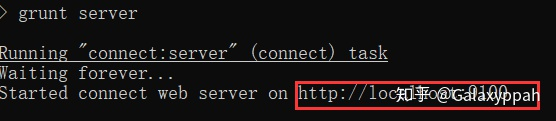
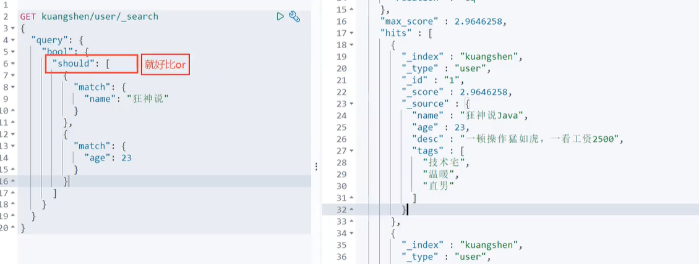

# ElasticSearch

> https://zhuanlan.zhihu.com/p/268065286
>
> 7.6.1

6.X 和 7.X 区别十分大(原生API,RestFul高级)

## 概述

Elasticsearchm，Solr:搜索(百度,github,淘宝电商!)

只要需要用到搜索,就可以用ES!(大数据量的情况下使用!)

ElasticSearch,简称es，**es是一个开源的高拓展的分布式全文检索引擎**，它可以近乎实施的存储、检索数据；本身**扩展性很好**，可以扩展到上百台服务器，处理PB级别的数据。es也使用java开发并**使用Lucene 作为其核心**来实现所有索引和搜索的功能，但是它的目的是**通过简单的RESTful API来隐藏Lucene的复杂性**，从而让全文搜索变得简单

**谁在使用**

- 维基百科，类似百度百科，全文检索，高亮，搜索推荐
- 国外新闻网站，类似搜狐新闻，用户行为日志（点击，浏览，收藏，评论）+社交网络数据，数据分析。。。
- Stack Overflow国外的程序异常讨论论坛
- GitHub（开源代码管理），搜索上千亿行代码
- 电商网站，检索商品
- 日志数据分析，logstash采集日志，ES进行复杂的数据分析，ELK技术（elasticsearch+logstash+kibana）
- 商品价格监控网站
- 商业智能系统
- 站内搜索

## ES和solr的差别

**ElasticSearch简介**

ElasticSearch是一个实施**分布式搜索**和**分析引擎**。它让你以前所未有的速度**处理大数据**成为可能。它用于**全文搜索、结构化搜索、分析**以及将这三者混合使用：

维基百科使用es提供全文搜索并高亮关键字，以及输入实施搜索和搜索纠错等搜索建议功能；英国公报使用es结合用户日志和社交网络数据提供给他们的编辑以实施的反馈，以便了解龚总对新发表的文章的回应。。。

es是一个基于Apache Lucene(TM)的开源搜索引擎。无论在开源还是专有领域，Lucene可以被认为是迄今为止最先进、性能最好、功能最全的搜索引擎库。想要使用它，必须使用java来作为开发语言并将其直接继承到你的应用中。

**solr简介**

Solr是Apache下的一个顶级开源项目，采用java开发，是基于Lucene的全文搜索服务器。Solr提供了比Lucene更为丰富的查询语言，同时**实现了可配置、可扩展、并对索引、搜索性能进行了优化。**它**可以独立运行**，是一个独立的企业及搜索应用服务器，它对外提供类似于web-service的API接口。用户可以通过http请求，像搜索引擎服务器提交一定格式的文件，生成索引；也可以通过提出查找请求，并得到返回结果。

**两者比较**

- 当单纯的**对已有数据进行搜索**时，Solr更快
- 当**实时建立索引**是，Solr会产生io阻塞，查询性能较差，ElasticSearch具有明显的优势
- 随着**数据量的增加**，Solr的搜索效率会变得更低，而Elasticsearch却没有明显的变化

**总结**

1. **es**基本是**开箱即用**，非常简单。而solr会有点复杂。
2. Solr利用Zookeeper进行分布式管理，而elasticsearch自身带有分布式协调管理功能
3. solr支持更多格式的数据，比如json xml csv。而es只支持json文件格式
4. solr官方提供的功能更多，而elasticsearch更注重核心功能，高级功能由第三方插件提供
5. solr查询快，但更新索引时慢，用于电商等查询多的应用
6. es建立索引宽，即实时性查询快，用于facebook新浪等搜索
7. solr较成熟，有一个更大，更成熟的用户、开发和贡献者社区，而elasticsearch相对开发维护者较少，更新太快，学习使用成本较高

## ElasticSearch安装

**注：安装ElasticSearch之前必须保证JDK1.8+安装完毕，并正确的配置好JDK环境变量，否则启动ElasticSearch失败。**

下载windows版本，解压压缩包，打开，看到如下目录：


打开config文件夹：


双击bin目录下的elasticsearch.bat启动


点击后：


在浏览器访问127.0.0.1:9200,若得到以下信息则安装成功：


**安装es的图形化界面插件**

**下载nodejs**:[https://nodejs.org/en/](https://link.zhihu.com/?target=https%3A//nodejs.org/en/)

LTS:长期支持版本

安装：下一步下一步 。。。

查看版本：


**下载elasticsearch-head-master.zip:**

解压后安装依赖，一定要跳转到该解压文件夹下输入该命令：




访问测试：


由于ES进程和客户端进程端口号不同，存在跨域问题，所以需要在ES的配置文件中配置下解决跨域问题：


启动es，使用head工具进行连接测试：


**了解ELK**

**ELK是ElasticSearch 、 Logstash、Kibana三大开源框架首字母大写简称**。市面上也称为Elastic Stack。**Lostash**是ELK的中央数据流，用于从不同目标（文件/数据存储/MQ）**收集**的**不同格式数据**，经过过滤后支持输出到不同目的地。**Kibana可以将elastic的数据通过友好的页面展示出来，提供实时分析的功能**。

市面上很多开发只要提到ELK能够一直说出它是一个日志分析架构技术栈总称，但实际上**ELK不仅仅适用于日志分析，它还可以支持其他任何数据分析和手机的场景，日志分析和收集知识**更具有代表性。并非唯一性。

**安装Kibana**

**Kibana**是一个针对ElasticSearch的开源**分析及可视化平台，用来搜索、查看交互存储在ElasticSearch索引中的数据**。使用Kibana，可以通过各种如表进行高级数据分析及展示。Kibana让海量数据更容易理解。它操作简单，基于浏览器的用户界面可以快速创建仪表板实时显示Elasticsearch查询动态。设置Kibana非常简单。无需编码或者额外的基础构架，几分钟内就可以完成Kibana安装并启动Elasricsearch索引检测。

进入bin目录，启动服务


访问IP：5601


## ES核心概念

集群,节点,索引,类型,文档,分片,映射是什么

> elasticsearch是面向文档的,关系行数据库和elasticsearch客观的对比! 一切都是json

| RelationalDB     | Elasticsearch                          |
| ---------------- | -------------------------------------- |
| 数据库(database) | 索引(indices)                          |
| 表(tables)       | types(7版本以及之后会被抛弃，默认_doc) |
| 行(rows)         | documents                              |
| 字段(columns)    | fields                                 |

elasticsearch(集群)中可以包含多个索引(数据库),每个索引中可以包含多个类型(表),每个类型先又包含多个文档(行),每个文档中又包含多个字段(列).

### 物理设计

elasticsearch在后台吧每个索引划分成多个分片,每个分片可以在集群中的不同服务器间迁移

一个人就是一个集群,默认的集群名称就是ElasticSearch


### 逻辑设计

一个索引类型中，包含多个文档，比如说文档1，文档2。当我们索引一篇文档时，可以通过这样的一各顺序找到它:索引》类型文档ID，通过这个组合我们就能索引到某个具体的文档。注意:ID不必是整数，实际上它是个字符串

#### 文档

之前说elasticsearch是面向文档的，那么就意味着索引和搜索数据的最小单位是文档，elasticsearch中，文档有几个重要属性︰

- 自我包含，一篇文档同时包含字段和对应的值，也就是同时包含key:value !
- 可以是层次型的，一个文档中包含自文档，复杂的逻辑实体就是这么来的!
- 灵活的结构，文档不依赖预先定义的模式，我们知道关系型数据库中，要提前定义字段才能使用，在elasticsearch中，对于字段是非常灵活的，有时候，我们可以忽略该字段，或者动态的添加一个新的字段。

尽管我们可以随意的新增或者忽略某个字段，但是，每个字段的类型非常重要，比如一个年龄字段类型，可以是字符串也可以是整形。因为elasticsearch会保存字段和类型之间的映射及其他的设置。这种映射具体到每个映射的每种类型，这也是为什么在elasticsearch中，类型有时候也称为映射类型。

#### 类型

类型是文档的逻辑容器，就像关系型数据库一样，表格是行的容器。类型中对于字段的定义称为映射，比如name映射为字符串类型。我们说文档是无模式的，它们不需要拥有映射中所定义的所有字段，比如新增一个字段，那么elasticsearch是怎么做的呢?elasticsearch会自动的将新字段加入映射，但是这个字段的不确定它是什么类型，elasticsearch就开始猜，如果这个值是18，那么elasticsearch会认为它是整形。但是elasticsearch也可能猜不对，所以最安全的方式就是提前定义好所需要的映射，这点跟关系型数据库殊途同归了，先定义好字段，然后再使用，别整什么幺蛾子。

#### 索引

就是数据库

索引是映射类型的容器，elasticsearch中的索引是一个非常大的文档集合。索引存储了映射类型的字段和其他设置。然后它们被存储到了各个分片上了。我们来研究下分片是如何工作的。

**物理设计︰节点和分片如何工作**


一个集群至少有一个节点，而一个节点就是一个elasricsearch进程，节点可以有多个索引默认的，如果你创建索引，那么索引将会有个5个分片( primary shard ,又称主分片)构成的，每一个主分片会有一个副本( replica shard ,又称复制分片)


上图是一个有3个节点的集群，可以看到主分片和对应的复制分片都不会在同一个节点内，这样有利于某个节点挂掉了，数据也不至于丢失。实际上，一个分片是一个Lucene索引，一个包含倒排索引的文件目录，倒排索引的结构使得**elasticsearch在不扫描全部文档的情况下，就能告诉你哪些文档包含特定的关键字**。不过，等等，倒排索引是什么鬼?

#### 倒排索引

elasticsearch使用的是一种称为倒排索引的结构，采用Lucene倒排索作为底层。这种结构适用于快速的全文搜索，一个索引文档中所有不重复的列表构成，对于每一个词，都有一个包含它的文档列表。例如，现在有两个文档，每个文档包含如下内容∶

```bash
Study every day,good good up to forever # 文档1包含的内容
To forever, study every day, good good up # 文档2包含的内容
```

为了创建倒排索引，我们首先要将每个文档拆分成独立的词(或称为词条或者tokens)，然后创建一个包含所有不重复的词条的排序列表，然后列出每个词条出现在哪个文档:


现在，我们试图搜索to forever，只需要查看包含每个词条的文档


两个文档都匹配，但是第一个文档比第二个匹配程度更高。如果没有别的条件，现在，这两个包含关键字的文档都将返回。再来看一个示例，比如我们通过博客标签来搜索博客文章。那么倒排索引列表就是这样的一个结构:


如果要搜索含有python标签的文章，那相对于查找所有原始数据而言，查找倒排索引后的数据将会快的多。只需要查看标签这一栏，然后获取相关的文章ID即可。完全过滤掉无关的所有数据，提高效率!

elasticsearch的索引和Lucene的索引对比

在elasticsearch中，索引（库)这个词被频繁使用，这就是术语的使用。在elasticsearch中，索引被分为多个分片，每份分片是一个Lucene的索引。所以一个elasticsearch索引是由多个Lucene索引组成的。别问为什么，谁让elasticsearch使用Lucene作为底层呢!如无特指，说起索引都是指elasticsearch的索引。

接下来的一切操作都在kibana中Dev Tools下的Console里完成。基础操作!

## IK分词器

> 什么是IK分词器?

分词︰即把一段中文或者别的划分成一个个的关键字，我们在搜索时候会把自己的信息进行分词，会把数据库中或者索引库中的数据进行分词，然后进行一个匹配操作，默认的中文分词是将每个字看成一个词，比如““我爱狂神"会被分为"我”“爱”“狂”"神”，这显然是不符合要求的，所以我们需要安装中文分词器ik来解决这个问题。

如果要使用中文,建议使用ik分词器

IK提供了两个分词算法: ik smart和ik_max_word，其中ik_smart为最少切分， ik_max_word为最细粒度划分!一会我们测试!

**ik_smart为最少切分**


**ik_max_word为最细粒度划分**,**穷尽词库的可能**


> **问题**


发现问题: 阿灰被拆开了

这种需要的词,需要自己加到我们的分词器的字典中

> ik分词器增加自己的配置


重启es


重启后再次使用


以后的话,我们需要自己配置分词就在自己定义的dic文件中进行配置即可

## RestFul风格说明

一种软件架构风格,而不是标准,只是提供了一组设计原则和约束条件.它主要是用于客户端和服务器交互类的软件.基于这个风格设计的软件可以更简洁,更有层次,更易于实现缓存等机制

基本Rest命令说明:


### 关于索引的基本操作

1. 创建第一个索引

   ```bash
   PUT /索引名/~类型名(未来可能取消不写)~/文档id
   {
         请求体
   }
   ```

   

   完成了自动增加了索引!数据也成功的添加了，这就是我说大家在初期可以把它当做数据库学习的原因

   

   1）那么name这个字段用不用指定类型呢.毕竟我们关系型数据库时需要指定类型的啊

   - 字符串类型

     text, keyword

   - 数值类型

     long, integer, short, byte, double, float, half float, scaled fload

   - 日期类型

     date

   - 布尔值类型

     boolean

   - 二进制类型

     binart

   - 等等…

   2）指定字段的类型

    

   3）获得这个规则信息, 可以通过GET请求获取具体的信息

   

   4）查看默认的信息

   

   

   如果自己的文档字段没有指定，那么es就会给我们默认配置字段类型!

   **扩展:**

   通过get _cat/ 可以获得当前的很多信息

   

2. **修改** 提交还是使用PUT即可,然后覆盖值,或用新办法

   曾经的方法 用PUT覆盖

   

   目前的方法

   

3. 删除索引

   

   通过DELETE命令实现删除, 根据你的请求来判断是删除索引还是删除文档记录,

   使用RESTFUL风格是我们ES推荐大家使用的

### 关于文档的基本操作

1. 添加数据

```java
PUT ahui/test/1
{
    
  "name": "ahui",
  "age": 21,
  "desc": "愿你拥有大风与烈酒,也能享受孤独与自由",
  "tags": ["二次元","宅男","码农"]
}
```


2. 获取数据


3. 更新数据 PUT(相当于是覆盖了上一条)


4. POST 修改数据,推荐使用这种修改方式

```
POST /test2/user/2/_update
{
  "doc":{
    "age": 18
  }
  
}
```


简单的搜索

```bash
GET ahui/user/1
```

简单的**条件查询**,可以根据默认的映射规则,产生基本的查询


> 复杂查询搜索 select (排序,分页,高亮,模糊查询,精准查询等)


我们之后使用Java操作es, 所有的方法和对象就是这里面的key

> 排序


> 分页查询


数据下标还是从0开始

> 布尔值查询

must (and) 所有的条件都要符合 相当于 where id = 1 and name = xxx


should (or) 所有的条件符合其一 相当于 where id = 1 or name = xxx



must_not (not) 反向查询


过滤器 filter


- gt 大于
- gte 大于等于
- lt 小于
- lte 小于等于

> 匹配多个条件


> 精确查询

term 查询是直接通过倒排索引指定的词条进程精确的查找的

**关于分词:**

- term, 直接查询精确的
- match, 会使用分词器解析 (先分析文档,然后通过分析的文档进行查询)

**两个类型 text keyword**


> 多个值匹配的精确查询


> 高亮查询


这些其实MySQL也可以做,试试Mysql效率比较低

- 匹配
- 按条件匹配
- 精确匹配
- 匹配字段过滤
- 多条件查询
- 高亮查询
- 倒排查询

## 整合SpringBoot


1. 找到原生的依赖

   ```xml
   <repositories>
       <repository>
           <id>es-snapshots</id>
           <name>elasticsearch snapshot repo</name>
           <url>https://snapshots.elastic.co/maven/</url>
       </repository>
   </repositories>
   ```

2. 找对象


3. 分析这个类中的方法即可

> 配置基本的项目

**问题:** 一定要保证我们导入的依赖和我们的es版本一致


将本地对应的版本与此保持一致


源码中提供的对象


1. 创建索引
2. 判断索引是否存在
3. 删除索引
4. 创建文档
5. CRUD文档

**测试方法**

```java
package com.onlylmf;

import com.alibaba.fastjson.JSON;
import com.onlylmf.pojo.User;
import org.elasticsearch.action.admin.indices.delete.DeleteIndexRequest;
import org.elasticsearch.action.bulk.BulkRequest;
import org.elasticsearch.action.bulk.BulkResponse;
import org.elasticsearch.action.delete.DeleteRequest;
import org.elasticsearch.action.delete.DeleteResponse;
import org.elasticsearch.action.get.GetRequest;
import org.elasticsearch.action.get.GetResponse;
import org.elasticsearch.action.index.IndexRequest;
import org.elasticsearch.action.index.IndexResponse;
import org.elasticsearch.action.search.SearchRequest;
import org.elasticsearch.action.search.SearchResponse;
import org.elasticsearch.action.support.master.AcknowledgedResponse;
import org.elasticsearch.action.update.UpdateRequest;
import org.elasticsearch.action.update.UpdateResponse;
import org.elasticsearch.client.RequestOptions;
import org.elasticsearch.client.RestHighLevelClient;
import org.elasticsearch.client.indices.CreateIndexRequest;
import org.elasticsearch.client.indices.CreateIndexResponse;
import org.elasticsearch.client.indices.GetIndexRequest;
import org.elasticsearch.common.unit.TimeValue;
import org.elasticsearch.common.xcontent.XContentType;
import org.elasticsearch.index.query.MatchAllQueryBuilder;
import org.elasticsearch.index.query.QueryBuilders;
import org.elasticsearch.index.query.TermQueryBuilder;
import org.elasticsearch.search.SearchHit;
import org.elasticsearch.search.builder.SearchSourceBuilder;
import org.elasticsearch.search.fetch.subphase.FetchSourceContext;
import org.junit.jupiter.api.Test;
import org.springframework.beans.factory.annotation.Autowired;
import org.springframework.beans.factory.annotation.Qualifier;
import org.springframework.boot.test.context.SpringBootTest;

import java.io.IOException;
import java.util.ArrayList;
import java.util.concurrent.TimeUnit;

@SpringBootTest
class AhuiEsApiApplicationTests {
    

    @Autowired
    @Qualifier("restHighLevelClient") //不加也行 但定义的名字要是这个名字
    private RestHighLevelClient client;


    //测试索引的创建 Request PUT ahui_index
    @Test
    void testCreateIndex() throws IOException {
    
        //1. 创建索引请求
        CreateIndexRequest request = new CreateIndexRequest("ahui_index");
        //2. 客户端执行请求
        CreateIndexResponse createIndexResponse = client.indices()
                .create(request, RequestOptions.DEFAULT);

        System.out.println(createIndexResponse);
    }

    //测试获取索引,判断其是否存在
    @Test
    void testExistIndex() throws IOException {
    
        GetIndexRequest request = new GetIndexRequest("ahui_index");
        boolean exists = client.indices().exists(request, RequestOptions.DEFAULT);
        System.out.println(exists);
    }

    //测试删除索引
    @Test
    void testDeleteIndex() throws IOException {
    
        DeleteIndexRequest request = new DeleteIndexRequest("ahui_index");
        //删除
        AcknowledgedResponse delete = client.indices().delete(request, RequestOptions.DEFAULT);
        System.out.println(delete.isAcknowledged());
    }

    @Test
    //测试添加文档
    void testAddDocument() throws IOException {
    
        //创建对象
        User user = new User("阿灰", 21);
        //创建请求
        IndexRequest request = new IndexRequest("ahui_index");

        //规则 put ahui_index/_doc/1
        request.id("1");
        request.timeout(TimeValue.timeValueSeconds(1));
        request.timeout("1s");//等价写法

        //将我们的数据放入请求 json (使用fastjson进行转换)
        IndexRequest source = request.source(JSON.toJSONString(user), XContentType.JSON);

        //客户端发送请求, 获取响应的结果
        IndexResponse indexResponse = client.index(request, RequestOptions.DEFAULT);

        //返回具体的json信息
        System.out.println(indexResponse.toString());
        //对应我们命令返回的状态 CREATED
        System.out.println(indexResponse.status());
    }

    @Test
    //获取文档
    void testIsExistes() throws IOException {
    
        GetRequest getRequest = new GetRequest("ahui_index", "1");
        //不获取返回的_source 的上下文了
        getRequest.fetchSourceContext(new FetchSourceContext(false));
        getRequest.storedFields("_none_");

        boolean exists = client.exists(getRequest, RequestOptions.DEFAULT);
        System.out.println(exists);
    }

    @Test
    //获取文档的信息
    void testGetDocument() throws IOException {
    
        GetRequest getRequest = new GetRequest("ahui_index", "1");
        GetResponse getResponse = client.get(getRequest, RequestOptions.DEFAULT);
        //打印文档的内容
        System.out.println(getResponse.getSourceAsString());
        //返回的全部内容和命令是一样的
        System.out.println(getResponse);
    }

    @Test
    //获取文档的信息
    void testUpdateRequest() throws IOException {
    
        UpdateRequest updateRequest = new UpdateRequest("ahui_index", "1");
        updateRequest.timeout("1s");

        User user = new User("阿灰学Java", 22);
        updateRequest.doc(JSON.toJSONString(user),XContentType.JSON);

        UpdateResponse updateResponse = client.update(updateRequest, RequestOptions.DEFAULT);
        System.out.println(updateResponse.status());

    }

    @Test
    //删除文档记录
    void testDeleteRequest() throws IOException {
    
        DeleteRequest deleteRequest = new DeleteRequest("ahui_index", "1");
        deleteRequest.timeout("1s");

        DeleteResponse delete = client.delete(deleteRequest, RequestOptions.DEFAULT);
        System.out.println(delete.status());

    }

    @Test
    //特殊的,实际项目中一般都会批量插入数据
    void testBulkRequest() throws IOException{
    
        BulkRequest bulkRequest = new BulkRequest();
        bulkRequest.timeout("10s");

        ArrayList<User> userList = new ArrayList<>();
        userList.add(new User("ahui1",18));
        userList.add(new User("ahui2",18));
        userList.add(new User("ahui3",18));
        userList.add(new User("onlylmf1",18));
        userList.add(new User("onlylmf2",18));
        userList.add(new User("onlylmf3",18));

        //批量处理请求
        for (int i = 0; i < userList.size(); i++) {
    
            //批量更新和批量修改等, 就在这里修改对应的请求就可以了
            bulkRequest.add(new IndexRequest("ahui_index")
            .id("" + (i + 1)) //不加id的话会默认生成随机id
            .source(JSON.toJSONString(userList.get(i)),XContentType.JSON));
        }
        BulkResponse bulkResponse = client.bulk(bulkRequest, RequestOptions.DEFAULT);
        //是够失败, 返回false代表成功
        System.out.println(bulkResponse.hasFailures());
    }

    @Test
    //查询
    //SearchRequest 搜索请求
    //SearchSourceBuilder 条件构造
    //HighLightBuilder 构建高亮
    //xxx QueryBuilder 对应我们刚才看到的所有命令
    void testSearch() throws IOException {
    
        SearchRequest searchRequest = new SearchRequest("ahui_index");
        //构建搜索条件
        SearchSourceBuilder sourceBuilder = new SearchSourceBuilder();

        //查询条件,我们可以使用QueryBuilders 工具类来实现
        //QueryBuilders.termQuery  精确匹配
        //QueryBuilders.matchAllQuery 匹配所有
        TermQueryBuilder termQueryBuilder = QueryBuilders.termQuery("name", "ahui1");
//        MatchAllQueryBuilder matchAllQueryBuilder = QueryBuilders.matchAllQuery();
        sourceBuilder.query(termQueryBuilder);
        sourceBuilder.timeout(new TimeValue(60, TimeUnit.SECONDS));
        
        searchRequest.source(sourceBuilder);

        SearchResponse searchResponse = client.search(searchRequest, RequestOptions.DEFAULT);
        System.out.println(JSON.toJSONString(searchResponse.getHits()));
        System.out.println("==========================================");
        for (SearchHit documentFileds : searchResponse.getHits().getHits()) {
    
            System.out.println(documentFileds.getSourceAsMap());
        }
    }
}
```

