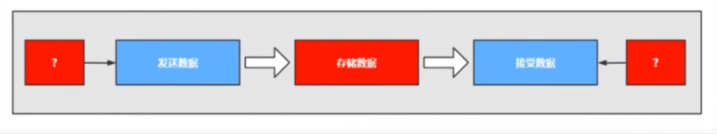

# RabbitMQ

## 中间件

### 什么是中间件

我国企业从20世纪80年代开始就逐渐进行信息化建设，由于方法和体系的不成熟，以及企业业务的市场需求的不断变化，一个企业可能同时运行着多个不同的业务系统，这些系统可能基于不同的操作系统、不同的数据库、异构的网络环境。现在的问题是，如何把这些信息系统结合成一个有机地协同工作的整体，真正实现企业跨平台、分布式应用。中间件便是解决之道，它用自己的复杂换取了企业应用的简单。

中间件（Middleware）是处于操作系统和应用程序之间的软件，也有人认为它应该属于操作系统中的一部分。人们在使用中间件时，往往是一组中间件集成在一起，构成一个平台（包括开发平台和运行平台），但在这组中间件中必须要有一个通信中间件，即中间件+平台+通信，这个定义也限定了只有用于分布式系统中才能称为中间件，同时还可以把它与支撑软件和使用软件区分开来

### 为什么需要消息中间件

具体地说，中间件屏蔽了底层操作系统的复杂性，使程序开发人员面对一个简单而统一的开发环境，减少程序设计的复杂性，将注意力集中在自己的业务上，不必再为程序在不同系统软件上的移植而重复工作，从而大大减少了技术上的负担，中间件带给应用系统的，不只是开发的简便、开发周期的缩短，也减少了系统的维护、运行和管理的工作量，还减少了计算机总体费用的投入。

### 中间件特点

为解决分布异构问题，人们提出了中间件（middleware)的概念。中间件时位于平台（硬件和操作系统）和应用之间的通用服务，如下图所示，这些服务具有标准的程序接口和协议。针对不同的操作系统和硬件平台，它们可以有符合接口的协议规范的多种实现。

也很难给中间件一个严格的定义，但中间件应具有如下的一些特点：

（1）满足大量应用的需要

（2）运行于多种硬件和 OS平台

（3）支持分布计算，提供跨网络、硬件和 OS平台的透明性的应用或服务的交互

（4）支持标准的协议

（5）支持标准的接口

由于标准接口对于可移植性和标准协议对于互操作性的重要性，中间件已成为许多标准化工作的主要部分。对于应用软件开发，中间件远比操作系统和网络服务更为重要，中间件提供的程序接口定义了一个相对稳定的高层应用环境，不管底层的计算机硬件和系统软件怎样更新换代，只要将中间件升级更新，并保持中间件对外的接口定义不变，应用软件几乎不需任何修改，从而保护了企业在应用软件开发和维护中的重大投资。

简单说：中间件有个很大的特点，是脱离于具体设计目标，而具备提供普遍独立功能需求的模块。这使得中间件一定是可替换的。如果一个系统设计中，中间件时不可替代的，不是架构、框架设计有问题，那么就是这个中间件，在别处可能是个中间件，在这个系统内是引擎。

在实际的项目中，大部分的企业项目开发中，在早起都采用的是单体的架构模式

在企业开发当中，大部分的初期架构都采用的是单体架构的模式进行架构，而这种架构的典型的特点：就是把所有的业务和模块，源代码，静态资源文件等都放在一个工程中，如果其中的一个模块升级或者迭代发生一个很小的变动都会重新编译和重新部署项目。这种这狗存在的问题是：

（1）耦合度太高
（2）不易维护
（3）服务器的成本高
（4）以及升级架构的复杂度也会增大
这样就有后续的分布式架构系统。

分布式架构

通俗一点：就是一个请求由服务器端的多个服务（服务或者系统）协同处理完成

和单体架构不同的是，单体架构是一个请求发起 jvm调度线程（确切的是 tomcat线程池）分配线程 Thread来处理请求直到释放，而分布式系统是：一个请求时由多个系统共同来协同完成，jvm和环境都可能是独立。如果生活中的比喻的话，单体架构就像建设一个小房子很快就能够搞定，如果你要建设一个鸟巢或者大型的建筑，你就必须是各个环节的协同和分布，这样目的也是项目发展到后期的时候要去部署和思考的问题。我们也不难看出来：分布式架构系统存在的特点和问题如下：

存在问题：

- 学习成本高，技术栈过多

- 运维成本和服务器成本增高

- 人员的成本也会增高

- 项目的负载度也会上升

- 面临的错误和容错性也会成倍增加

- 占用的服务器端口和通讯的选择的成本高

- 安全性的考虑和因素逼迫可能选择 RMI/MQ相关的服务器端通讯

好处：

- 服务系统的独立，占用的服务器资源减少和占用的硬件成本减少，确切的说是：可以合理的分配服务资源，不造成服务器资源的浪费
- 系统的独立维护和部署，耦合度降低，可插拔性
- 系统的架构和技术栈的选择可以变的灵活（而不是单纯地选择 java）
- 弹性的部署，不会造成平台因部署造成的瘫痪和停服的状态

基于消息中间件的分布式系统的架构

消息中间件的是

1. 利用可靠的消息传递机制进行系统和系统直接的通讯
2. 通过提供消息传递和消息的派对机制，它可以在分布式系统环境下扩展进程间的通讯

消息中间件应用的场景

1. 跨系统数据传递
2. 高并发的流量削峰
3. 数据的并发和异步处理
4. 大数据分析与传递
5. 分布式事务

比如你有一个数据要进行迁移或者请求并发过多的时候，比如你有10 W的并发请求下订单，我们可以在这些订单入库之前，我们可以把订单请求堆积到消息队列中，让它稳健可靠的入库和执行

### 常见的消息中间件

ActiveMQ、RabbitMQ、Kafka、RocketMQ等

### 消息中间件的本质与设计

- 本质

它是一种接受数据、接受请求、存储数据、发送数据等功能的技术服务

MQ消息队列：负责数据的传接受，存储和传递，所以性能要高于普通服务和技术

谁来生产消息，存储消息和消费消息呢？

- 核心组成部分
  1. 消息的协议
  2. 消息的持久化机制
  3. 消息的分发策略
  4. 消息的高可用，高可靠
  5. 消息的容错机制

### 消息队列协议

- 什么是协议

  

  所谓协议是指：

  1. 计算机底层操作系统和应用程序通讯时共同遵守的一组约定，只有遵循共同的约定和规范，系统和底层操作系统之间才能相互交流
  2. 和一般的网络应用程序的不同它主要负责数据的接受和传递，所以性能比较的高
  3. 协议对数据格式和计算机之间交换数据都必须严格遵守规范

  网络协议三要素：

  1. 语法：语法是用户数据与控制信息的结构与格式，以及数据出现的顺序
  2. 语义：语义是解释控制信息每个部分的意义，它规定了需要发出何种控制信息，以及完成的动作与做出什么样的响应
  3. 时序：时序是对事件发生顺序的详细说明

  为什么消息中间件不直接使用 http协议

  1. 因为 http请求报文头和响应报文头是比较复杂的，包含了Cookie，数据的加密解密，窗台吗，响应码等附加的功能，但是对于一个消息而言，我们并不需要这么复杂，也没有这个必要性，它其实就是负责数据传递，存储，分发就行，一定要追求的是高性能。尽量简洁，快速
  2. 大部分情况下 http大部分都是短链接，在实际的交互过程中，一个请求到响应都很有可能会中断，中断以后就不会执行持久化，就会造成请求的丢失。这样就不利于消息中间件的业务场景，因为消息中间件可能是一个长期的获取信息的过程，出现问题和故障要对数据或消息执行持久化等，目的是为了保证消息和数据的高可靠和稳健的运行

- AMQP协议

  AMQP：（全称：Advanced Message Queuing Protocol）是高级消息队列协议。由摩根大通集团联合其他公司共同设计。是一个提供统一消息服务的应用层标准高级消息队列协议，是应用层协议的一个开放标准，为面向消息的中间件设计。基于此协议的客户端与消息中间件可传递消息，并不受客户端/中间件不同产品，不同的开发语言等条件的限制。Erlang中的实现由 RabbitMQ等

  特性：

  1. 分布式事务支持
  2. 消息的持久化支持
  3. 高性能和高可靠的消息处理优势

  

- MQTT协议

  MQTT协议（Message Queueing Telemetry Transport）消息队列是 IBM开放的及时通讯协议，物联网系统架构中的重要组成部分

  特点：

  1. 轻量
  2. 结构简单
  3. 传输快，不支持事务
  4. 没有持久化设计

  应用场景：

  1. 适用于计算能力有限
  2. 低带宽
  3. 网络不稳定的场景

  支持者：

  

- OpenMessager协议

  是近几年由阿里、雅虎和滴滴出行、Stremalio等公司共同参与创立的分布式信息中间件、流处理等领域的应用开发标准

  特点：

  1. 结构简单
  2. 解析速度快
  3. 支持事务和持久化设计

- Kafka协议

  Kafka协议是基于 TCP/IP的二进制协议。消息内部是 通过长度来分割，由一些基本数据类型组成

  特点：

  1. 结构简单
  2. 解析速度快
  3. 无事务支持
  4. 有持久化设计

  ### 消息队列持久化

简单来说就是将数据存入磁盘，而不是存在内存中随服务器重启断开而消失，使数据能够永久保存

### 消息的分发策略

MQ消息 队列有如下几个角色

1. 生产者
2. 存储消息
3. 消费者

那么生产者生成消息以后，MQ进行存储，消费者是如何获取消息的呢？一般获取数据的方式无外乎推（push）或者拉（pull）两种方式，典型的 git就有推拉机制，我们发送的 http请求就是一种典型的拉取数据库数据返回的过程。而消息队列 MQ是一种推送的过程，而这些推机制会使用到很多的业务场景也有很多对应推机制策略

消息分发策略的机制和对比

### 消息队列的高可用和高可靠

- 什么是高可用

  所谓**高可用：是指产品在规定的条件和规定的时刻或时间内处于可执行规定功能状态的能力**

  当业务量增加时，请求也过大，一台消息中间件服务器的会触及硬件（CPU，内存，磁盘）的极限，一台消息服务器你已经无法满足业务的需求，所以消息中间件必须支持集群部署，来达到高可用的目的

- 什么是高可靠

  所谓**高可靠是指：系统可以无故障地持续运行**，比如一个系统突然崩溃，报错，异常等等并不影响线上业务的正常运行，出错的几率极低，就称之为：高可靠

  在高并发的业务场景中，如果不能保证系统的高可靠，那造成的隐患和损失是非常严重的

  如何保证中间件消息的可靠性呢，可以从两个方面考虑：

  1. 消息的传输：通过协议来保证系统间数据解析的正确性
  2. 消息的存储区可靠：通过持久化来保证消息的可靠性

- 集群模式1 - Master-slave主从共享数据的部署方式

  

  解说：生产者将消费发送到 Master节点，所有的都连接这个消息队列共享这块数据区域，Master节点负责写入，一旦 Master挂掉，slave节点继续服务。从而形成高可用

- 集群模式2 - Master-slave主从同步部署方式

  

  解释：这种模式写入消息同样在 Master主节点上，但是主节点会同步数据到 slave节点形成副本，和 zookeeper或者 redis主从机制很雷同。这样可以达到负载均衡的效果，如果消费者有多个这样就可以去不同的节点进行消费，以为消息的拷贝和同步会占用很大的带宽和网络资源。在后去的 rabbitmq中会有使用

- 集群模式3 - 多主集群同步部署模式

  

  解释：和上面的区别不是特别的大，但是它的写入可以往任意节点去写入

- 集群模式4 - 多主集群转发部署模式

  

  解释：如果你插入的数据是 broker-1中国，元数据信息会存储数据的相关描述和记录存放的位置（队列）。它会对描述信息也就是元数据信息进行同步，如果消费者在 broker-2中进行消费，发现自己节点没有对应的信息，可以从对应的元数据信息中去查询，然后返回对应的消息信息，场景：比如买火车票或者黄牛买演唱会门票，比如第一个黄牛有顾客说要买的演唱会门票，但是没有但是他回去联系其他的黄牛询问，如果有就返回

- 集群模式5 Master-slave与 Broker-cluster组合的方案

  

  解释：实现多主多从的热备机制来完成消息的高可用以及数据的热备机制，在生产规模达到一定的阶段的时候，这种使用的频率比较高

