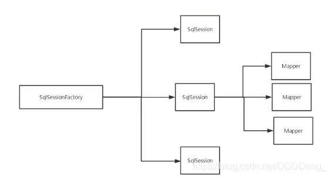
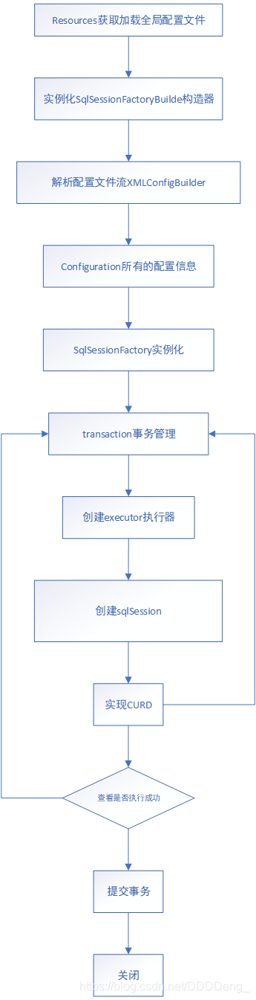

# Mybatis 入门

## 简介

-   MyBatis 是一款优秀的持久层框架
-   它支持自定义 SQL、存储过程以及高级映射
-   MyBatis 免除了几乎所有的 JDBC 代码以及设置参数和获取结果集的工作

```xml
<!-- https://mvnrepository.com/artifact/org.mybatis/mybatis -->
<dependency>
    <groupId>org.mybatis</groupId>
    <artifactId>mybatis</artifactId>
    <version>3.5.2</version>
</dependency>
```

### 持久化

-   将程序的数据在**持久状态**与**瞬时状态**转化的过程
-   内存：断电即失
-   数据库（JDBC）、IO文件持久化

### 持久层

Dao层、Service层、Controller层

-   完成持久化工作的代码块
-   层界限十分明显
-   MyBatis帮助程序员将数据存入到数据库中

## 第一个MyBatis程序

1.  导入maven依赖

    ```xml
    <dependencies>
            <dependency>
                <groupId>mysql</groupId>
                <artifactId>mysql-connector-java</artifactId>
                <version>5.1.37</version>
            </dependency>
            <dependency>
                <groupId>org.mybatis</groupId>
                <artifactId>mybatis</artifactId>
                <version>3.5.2</version>
            </dependency>
            <dependency>
                <groupId>junit</groupId>
                <artifactId>junit</artifactId>
                <version>4.12</version>
                <scope>test</scope>
            </dependency>
        </dependencies>
    ```

2.  创建一个模块

    -   编写MyBatis核心配置文件

        ```xml
        <?xml version="1.0" encoding="UTF-8" ?>
        <!DOCTYPE configuration
                PUBLIC "-//mybatis.org//DTD Config 3.0//EN"
                "http://mybatis.org/dtd/mybatis-3-config.dtd">
        <!--核心配置文件-->
        <configuration>
            <environments default="development">
                <environment id="development">
                    <transactionManager type="JDBC"/>
                    <dataSource type="POOLED">
                        <property name="driver" value="com.mysql.jdbc.Driver"/>
                        <property name="url" value="jdbc:mysql://localhost:3306/school?useSSL=true&amp;useUnicode=true&amp;characterEncoding=UTF-8"/>
                        <property name="username" value="root"/>
                        <property name="password" value="123456"/>
                    </dataSource>
                </environment>
            </environments>
        <mappers>
                <mapper resource="com/dao/UserMapper.xml"/>
            </mappers>
        </configuration>
        ```

    -   编写MyBatis工具类

        ```java
        package com.util;
        
        import org.apache.ibatis.io.Resources;
        import org.apache.ibatis.session.SqlSession;
        import org.apache.ibatis.session.SqlSessionFactory;
        import org.apache.ibatis.session.SqlSessionFactoryBuilder;
        
        import java.io.IOException;
        import java.io.InputStream;
        
        public class MyBatisUtil {
            private static SqlSessionFactory sqlSessionFactory;
            static {
                try {
                    //获取sqlSessionFactory对象
                    String resource = "mybatis-config.xml";
                    InputStream inputStream = Resources.getResourceAsStream(resource);
                    sqlSessionFactory = new SqlSessionFactoryBuilder().build(inputStream);
                } catch (IOException e) {
                    e.printStackTrace();
                }
            }
        
            public static SqlSession getSqlSession(){
                return sqlSessionFactory.openSession();
            }
        }
        ```

3.  编写代码

    -   实体类

        ```java
        package com.pojo;
        
        public class User {
            private int id;
            private String username;
            private String password;
        
            public User() {
            }
        
            public User(int id, String username, String password) {
                this.id = id;
                this.username = username;
                this.password = password;
            }
        
            public int getId() {
                return id;
            }
        
            public void setId(int id) {
                this.id = id;
            }
        
            public String getUsername() {
                return username;
            }
        
            public void setUsername(String username) {
                this.username = username;
            }
        
            public String getPassword() {
                return password;
            }
        
            public void setPassword(String password) {
                this.password = password;
            }
        }
        
        ```

    -   Dao接口

        ```java
        package com.dao;
        
        import com.pojo.User;
        
        import java.util.List;
        
        public interface UserDao {
            List<User> getUserList();
        
        }
        
        ```

    -   接口实现类(xml配置文件)

        ```xml
        <?xml version="1.0" encoding="UTF-8" ?>
        <!DOCTYPE mapper
                PUBLIC "-//mybatis.org//DTD Mapper 3.0//EN"
                "http://mybatis.org/dtd/mybatis-3-mapper.dtd">
        <!--绑定一个指定的mapper接口-->
        <mapper namespace="com.dao.UserDao">
            <select id="getUserList" resultType="com.pojo.User">
                select * from school.user;
            </select>
        </mapper>
        ```

4.  测试

    注意点：org.apache.ibatis.binding.BindingException: Type interface com.dao.UserDao is not known to the MapperRegistry.

    核心配置文件注册Mappers

    ```java
    package com.dao;
    
    import com.pojo.User;
    import com.util.MyBatisUtil;
    import org.apache.ibatis.session.SqlSession;
    import org.junit.Test;
    
    import java.util.List;
    
    public class UserDaoTest {
        @Test
        public void test(){
            SqlSession sqlSession = MyBatisUtil.getSqlSession();
            UserDao userDao = sqlSession.getMapper(UserDao.class);
            List<User> userList = userDao.getUserList();
            for (User user : userList) {
                System.out.println(user);
            }
            sqlSession.close();
        }
    }
    ```

5. 注意：

    1.  三个对象

        a. SqlSessionFactoryBuilder

        这个类可以被实例化、使用和丢弃，一旦创建了 SqlSessionFactory，就不再需要它了。 因此 SqlSessionFactoryBuilder 实例的最佳作用域是方法作用域（也就是局部方法变量）。 你可以重用 SqlSessionFactoryBuilder 来创建多个 SqlSessionFactory 实例，但最好还是不要一直保留着它，以保证所有的 XML 解析资源可以被释放给更重要的事情。

        b. SqlSessionFactory

        SqlSessionFactory 一旦被创建就应该在应用的运行期间一直存在，没有任何理由丢弃它或重新创建另一个实例。 使用 SqlSessionFactory 的最佳实践是在应用运行期间不要重复创建多次，多次重建 SqlSessionFactory 被视为一种代码“坏习惯”。因此 SqlSessionFactory 的最佳作用域是应用作用域。 有很多方法可以做到，最简单的就是使用单例模式或者静态单例模式。

        c. SqlSession

        每个线程都应该有它自己的 SqlSession 实例。SqlSession 的实例不是线程安全的，因此是不能被共享的，所以它的最佳的作用域是请求或方法作用域。 绝对不能将 SqlSession 实例的引用放在一个类的静态域，甚至一个类的实例变量也不行。 也绝不能将 SqlSession 实例的引用放在任何类型的托管作用域中，比如 Servlet 框架中的 HttpSession。 如果你现在正在使用一种 Web 框架，考虑将 SqlSession 放在一个和 HTTP 请求相似的作用域中。 换句话说，每次收到 HTTP 请求，就可以打开一个 SqlSession，返回一个响应后，就关闭它。 这个关闭操作很重要，为了确保每次都能执行关闭操作，你应该把这个关闭操作放到 finally 块中。

    2.  namespace

        namespcace中的包名要和接口中的包名一致
        
    3.  select标签
    
        选择，查询语句
    
        -   id：对应的namespace中的方法名
        -   resultType：Sql语句执行的返回值
        -   parameterType：参数类型
    
        a. 编写接口
    
        ```java
        public interface UserDao {
            List<User> getUserList();//查询全部用户
            User getUserById(int id);//根据id查询用户
            int addUser(User user);//插入用户
            int updateUser(User user);//修改用户
            int delUser(int id);//删除用户
        }
        ```
    
        b. 编写sql语句
    
        ```xml
        <mapper namespace="com.dao.UserDao">
            <select id="getUserList" resultType="com.pojo.User">
                select * from school.user;
            </select>
            <select id="getUserById" parameterType="int" resultType="com.pojo.User">
                select * from school.user where id = #{id};
            </select>
            <insert id="addUser" parameterType="com.pojo.User">
                insert into school.user (id,username,password) values (#{id},#{username},#{password});
            </insert>
            <update id="updateUser" parameterType="com.pojo.User">
                update school.user set username=#{username}, password=#{password} where id=#{id};
            </update>
            <delete id="delUser" parameterType="int">
                delete from school.user where id=#{id};
            </delete>
        </mapper>
        ```
    
        c. 测试
    
        ```java
        public class UserDaoTest {
            @Test
            public void test(){
                SqlSession sqlSession = MyBatisUtil.getSqlSession();
                UserDao userDao = sqlSession.getMapper(UserDao.class);
                List<User> userList = userDao.getUserList();
                for (User user : userList) {
                    System.out.println(user);
                }
                sqlSession.close();
            }
            @Test
            public void testId(){
                SqlSession sqlSession = MyBatisUtil.getSqlSession();
                UserDao userDao = sqlSession.getMapper(UserDao.class);
                User user = userDao.getUserById(1);
                System.out.println(user);
                sqlSession.close();
            }
            @Test
            public void testAdd(){
                SqlSession sqlSession = MyBatisUtil.getSqlSession();
                UserDao userDao = sqlSession.getMapper(UserDao.class);
                int res = userDao.addUser(new User(3, "hhh", "111111"));
                if(res>0){
                    System.out.println("Success");
                }
                sqlSession.commit();//提交事务
                sqlSession.close();
            }
            @Test
            public void testUpdate(){
                SqlSession sqlSession = MyBatisUtil.getSqlSession();
                UserDao userDao = sqlSession.getMapper(UserDao.class);
                userDao.updateUser(new User(3,"aaabb","123123"));
                sqlSession.commit();//提交事务
                sqlSession.close();
            }
            @Test
            public void testdel(){
                SqlSession sqlSession = MyBatisUtil.getSqlSession();
                UserDao userDao = sqlSession.getMapper(UserDao.class);
                userDao.delUser(3);
                sqlSession.commit();//提交事务
                sqlSession.close();
            }
        }
        ```
    
    4.  insert
    
    5.  update
    
    6.  delete

-   注意点：增删改需要提交事务

### 常见错误

-   标签匹配错误
-   resource绑定mapper需要使用路径
-   程序配置文件必须符合规范
-   NullPointerException，没有注册到资源
-   输出的xml文件有中文乱码问题
-   maven资源没有导出问题

### 万能Map

参数过多可以考虑使用map

```java
int addUser2(Map<String,Object> map);//万能map
```

```xml
<insert id="addUser2" parameterType="map">
        insert into school.user (id,username,password) values (#{id},#{username},#{password});
    </insert>
```

```java
@Test
    public void add2(){
        SqlSession sqlSession = MyBatisUtil.getSqlSession();
        UserDao userDao = sqlSession.getMapper(UserDao.class);
        Map<String, Object> map = new HashMap<>();
        map.put("id",4);
        map.put("password","121212");
        map.put("username","ads");
        userDao.addUser2(map);
        sqlSession.commit();//提交事务
        sqlSession.close();
    }
```

-   Map传递参数，直接在sql中取出key即可【parameterType="map"】
-   对象传递参数，直接在sql中取对象的属性即可 【parameterType="Object"】
-   只有一个基本类型参数的情况下，可以直接在sql中取到
-   多个参数用Map，或者注解

### 模糊查询

1.  java代码执行的时候传递通配符`%%`

    ```java
    List<User> users = userDao.getUserLike("%a%");
    ```

2.  在sql拼接中使用通配符

    ```xml
    <select id="getUserLike" resultType="com.pojo.User">
            select * from school.user where username like "%"#{value}"%";
        </select>
    ```


## 配置解析

### 核心配置文件

`mybatis-config.xml`

MyBatis 的配置文件包含了会深深影响 MyBatis 行为的设置和属性信息

```xml
configuration（配置）
properties（属性）
settings（设置）
typeAliases（类型别名）
typeHandlers（类型处理器）
objectFactory（对象工厂）
plugins（插件）
environments（环境配置）
environment（环境变量）
transactionManager（事务管理器）
dataSource（数据源）
databaseIdProvider（数据库厂商标识）
mappers（映射器）
```

-   environments（环境配置）

    **可以配置多个环境，但每个 SqlSessionFactory 实例只能选择一种环境**

    事务管理器（transactionManager）

    在 MyBatis 中有两种类型的事务管理器（也就是 type="[JDBC|MANAGED]"）：

    -   JDBC – 这个配置直接使用了 JDBC 的提交和回滚设施，它依赖从数据源获得的连接来管理事务作用域。
    -   MANAGED – 这个配置几乎没做什么。它从不提交或回滚一个连接，而是让容器来管理事务的整个生命周期（比如 JEE 应用服务器的上下文）。 默认情况下它会关闭连接。然而一些容器并不希望连接被关闭，因此需要将 closeConnection 属性设置为 false 来阻止默认的关闭行为。

    数据源（dataSource）

    dataSource 元素使用标准的 JDBC 数据源接口来配置 JDBC 连接对象的资源

    有三种内建的数据源类型（也就是 type="[UNPOOLED|POOLED|JNDI]"）

-   properties（属性）

    可以通过properties实现引用配置文件

    这些属性可以在外部进行配置，并可以进行动态替换，既可以在典型的 Java 属性文件中配置这些属性，也可以在 properties 元素的子元素中设置。

    1.  【db.properties】

    ```properties
    driver=com.mysql.jdbc.Driver
    url=jdbc:mysql://localhost:3306/school?useSSL=false&amp;useUnicode=true&amp;characterEncoding=UTF-8
    username=root
    password=123456
    ```

    2.  在核心配置文件中引入

    ```xml
    <properties resource="db.properties"></properties>
    ```

    -   可以在其中增加一些属性
    -   如果属性冲突，优先使用外部配置文件

-   typeAliases（类型别名）

    类型别名可为 Java 类型设置一个缩写名字。 它仅用于 XML 配置，意在降低冗余的全限定类名书写

    ```xml
    <typeAliases>
        <typeAlias type="com.pojo.User" alias="User"></typeAlias>
    </typeAliases>
    ```

    也可以指定一个包名，MyBatis 会在包名下面搜索需要的 Java Bean

    ```xml
    <typeAliases>
            <package name="com.pojo"/>
        </typeAliases>
    ```

    在没有注解的情况下，会使用 Bean 的首字母小写的非限定类名来作为它的别名。

    可以在实体类上增加注解来修改别名

    ```java
    @Alias("hello")
    public class User {
        ...
    }
    ```

-   settings（设置）

    | 设置名 | 描述 | 有效值 | 默认值 |
    | :----- | :--- | :----- | :----- |
    | cacheEnabled       | 全局性地开启或关闭所有映射器配置文件中已配置的任何缓存。     | true \| false | true  |
    | lazyLoadingEnabled | 延迟加载的全局开关。当开启时，所有关联对象都会延迟加载。 特定关联关系中可通过设置 `fetchType` 属性来覆盖该项的开关状态。 | true \| false | false |
    | logImpl | 指定 MyBatis 所用日志的具体实现，未指定时将自动查找。 | SLF4J \| LOG4J \| LOG4J2 \| JDK_LOGGING \| COMMONS_LOGGING \| STDOUT_LOGGING \| NO_LOGGING | 未设置 |
    
-   其他配置

    typeHandlers（类型处理器）
    objectFactory（对象工厂）
    plugins（插件）

    -  [MyBatis Generator Core](https://mvnrepository.com/artifact/org.mybatis.generator/mybatis-generator-core)
    -  [MyBatis Plus](https://mvnrepository.com/artifact/com.baomidou/mybatis-plus-boot-starter)
    
-   mappers（映射器）

    ```xml
    <!-- 使用相对于类路径的资源引用 -->
    <mappers>
            <mapper resource="com/dao/UserMapper.xml"/>
    </mappers>
    ```

    ```xml
    <!-- 使用映射器接口实现类的完全限定类名 -->
    <mappers>
            <mapper class="com.dao.UserMapper"></mapper>
        </mappers>
    ```

    ```xml
    <!-- 将包内的映射器接口实现全部注册为映射器 -->
    <mappers>
            <package name="com.dao"/>
        </mappers>
    ```

    注意点：

    1.  接口与Mapper的配置文件必须同名
    2.  接口与Mapper的配置文件必须在同一个包内

### 生命周期和作用域

理解我们之前讨论过的不同作用域和生命周期类别是至关重要的，因为错误的使用会导致非常严重的**并发问题**

-   SqlSessionFactoryBuilder
    1.  一旦创建了SqlSessionFactory，就不再需要它了
    2.  局部变量
-   SqlSessionFactory
    1.  可以想象为数据库连接池
    2.  SqlSessionFactory一旦被创建应该在应用的运行期间一直存在，不应丢弃它或重新创建另一个实例
    3.  SqlSessionFactory最佳作用域是应用作用域
    4.  最简单的就是使用单例模式或者静态单例模式
-   SqlSession
    1.  连接到连接池的一个请求
    2.  SqlSession实例不是线程安全的，因此不能被共享，最佳作用域是请求或方法作用域
    3.  用完之后需要关闭，否则资源被占用



### 解决属性名和字段名不一致的问题

1.  起别名

    ```xml
    <select id="getUserById" parameterType="int" resultType="com.pojo.User">
            select id,username,password as pwd from school.user where id = #{id};
        </select>
    ```

2.  resultMap结果集映射

    ```xml
    <resultMap id="UserMap" type="user">
    <!--        column数据库中的列 property属性-->
            <result column="id" property="id"></result>
            <result column="username" property="username"></result>
            <result column="password" property="pwd"></result>
        </resultMap>
        <select id="getUserById" parameterType="int" resultMap="UserMap">
            select * from school.user where id = #{id};
        </select>
    ```

-   `resultMap` 元素是 MyBatis 中最重要最强大的元素
-   ResultMap 的设计思想是，对简单的语句做到零配置，对于复杂一点的语句，只需要描述语句之间的关系就行了
-   `ResultMap` 的优秀之处——你完全可以不用显式地配置它们

## 日志

### 日志工厂

排错，日志就是最好的助手

可以用日志工厂来实现

-   SLF4J  
-   LOG4J 
-   LOG4J2 
-   JDK_LOGGING 
-   COMMONS_LOGGING 
-   STDOUT_LOGGING 
-   NO_LOGGING

### STDOUT_LOGGING

STDOUT_LOGGING配置：

```xml
<settings>
        <setting name="logImpl" value="STDOUT_LOGGING"/>
    </settings>
```

输出日志：

```xml
Opening JDBC Connection
Created connection 293508253.
Setting autocommit to false on JDBC Connection [com.mysql.jdbc.JDBC4Connection@117e949d]
==>  Preparing: select * from school.user where id = ?; 
==> Parameters: 1(Integer)
<==    Columns: id, username, password
<==        Row: 1, zhangsan, 123
<==      Total: 1
User{id=1, username='zhangsan', pwd='123'}
Resetting autocommit to true on JDBC Connection [com.mysql.jdbc.JDBC4Connection@117e949d]
Closing JDBC Connection [com.mysql.jdbc.JDBC4Connection@117e949d]
Returned connection 293508253 to pool.
```

### LOG4J

-   通过使用Log4j，我们可以控制日志信息输送的目的地是控制台、文件、GUI组件，甚至是套接口服务器、NT的事件记录器、UNIX Syslog守护进程等
-   我们也可以控制每一条日志的输出格式；通过定义每一条日志信息的级别，我们能够更加细致地控制日志的生成过程
-   这些可以通过一个配置文件来灵活地进行配置，而不需要修改应用的代码

1.  log4j导入

    ```xml
    <!-- https://mvnrepository.com/artifact/log4j/log4j -->
            <dependency>
                <groupId>log4j</groupId>
                <artifactId>log4j</artifactId>
                <version>1.2.17</version>
            </dependency>
    ```

2.  log4j配置文件

```properties
#将等级为DEBUG的日志信息输出到console和file这两个目的地，console和file的定义在下面的代码
log4j.rootLogger=DEBUG,console,file

#控制台输出的相关设置
log4j.appender.console = org.apache.log4j.ConsoleAppender
log4j.appender.console.Target = System.out
log4j.appender.console.Threshold=DEBUG
log4j.appender.console.layout = org.apache.log4j.PatternLayout
log4j.appender.console.layout.ConversionPattern=[%c]-%m%n

#文件输出的相关设置
log4j.appender.file = org.apache.log4j.RollingFileAppender
log4j.appender.file.File=./log/test.log
log4j.appender.file.MaxFileSize=10mb
log4j.appender.file.Threshold=DEBUG
log4j.appender.file.layout=org.apache.log4j.PatternLayout
log4j.appender.file.layout.ConversionPattern=[%p][%d{yy-MM-dd}][%c]%m%n

#日志输出级别
log4j.logger.org.mybatis=DEBUG
log4j.logger.java.sql=DEBUG
log4j.logger.java.sql.Statement=DEBUG
log4j.logger.java.sql.ResultSet=DEBUG
log4j.logger.java.sql.PreparedStatement=DEBUG
```

3.  配置log4j为日志的实现

    ```xml
    <settings>
            <setting name="logImpl" value="LOG4J"/>
        </settings>
    ```

4.  测试使用

    ```java
    static Logger logger = Logger.getLogger(UserMapperTest.class);
    @Test
        public void test4j(){
            logger.info("info:enter test4j");
            logger.debug("debug:enter test4j");
            logger.error("error");
        }
    ```

## 分页

-   减少数据的处理量

### 使用Limit

语法：

```sql
select * from user limit startIndex, pageSize;
```

```java
List<User> getUserLimit(Map<String,Integer> map);//分页
```

```xml
<select id="getUserLimit" parameterType="map" resultType="com.pojo.User">
        select * from school.user limit #{startIndex},#{pageSize};
    </select>
```

```java
@Test
    public void testLimit(){
        SqlSession sqlSession = MyBatisUtil.getSqlSession();
        UserDao userDao = sqlSession.getMapper(UserDao.class);
        Map<String, Integer> map = new HashMap<>();
        map.put("startIndex",1);
        map.put("pageSize",2);
        List<User> list = userDao.getUserLimit(map);
        for(User user:list){
            System.out.println(user);
        }
        sqlSession.close();
    }
```

### 使用RowBounds

不再使用SQL实现分页

```xml
<select id="getUserLimit2" resultType="com.pojo.User">
        select * from school.user;
    </select>
```

```java
@Test
    public void testLimit2(){
        SqlSession sqlSession = MyBatisUtil.getSqlSession();
        RowBounds rowBounds = new RowBounds(1, 2);
        List<User> list = sqlSession.selectList("com.dao.UserDao.getUserLimit2",null,rowBounds);
        for(User user:list){
            System.out.println(user);
        }
        sqlSession.close();
    }
```

## 注解

### 面向接口编程

-   面向对象是指，我们考虑问题时，以对象为单位，考虑它的属性和方法；
-   面向过程是指，我们考虑问题时，以一个具体的流程（事务过程）为单位，考虑它的实现；
-   接口设计与非接口设计是针对复用技术而言的，与面向对象（过程）不是一个问题，更多的体现就是对系统整体的架构；

### 使用注解开发

```java
public interface UserMapper {
    @Select("select * from user")
    List<User> getUserList();
    @Select("select * from user where id=#{id}")
    User getUserById(@Param("id") int id);//全部参数必须加上@Param
    @Insert("insert into user(id,username,password) values(#{id},#{username},#{password})")
    int addUser(User user);
    @Delete("delete from user where id=#{id}")
    int delUser(@Param("id") int id);
}
```

```xml
<mapper class="com.dao.UserMapper"></mapper>
```

本质是反射机制，底层是动态代理

**关于@Param( )注解**

-   基本类型的参数或者String类型，需要加上
-   引用类型不需要加
-   如果只有一个基本类型的话，可以忽略，但是建议大家都加上
-   我们在SQL中引用的就是我们这里的@Param()中设定的属性名

### MyBatis执行流程



### \#{} ${}区别

-   \#{}

　　　　#将传入的数据都当成一个字符串，会对自动传入的数据加一个双引号。

　　　　　　例如：`order by #{parameterName} //或取Map中的value#{Key}也是一样操作。`

　　　　　　假设传入参数是“Smith”

　　　　　　会解析成：order by "Smith"

-   ${} 

　　　　$将传入的数据直接显示生成在sql中。

　　　　　　例如：`order by #{parameterName} //或取Map中的value#{Key}也是一样操作。`

　　　　　　假设传入参数是“Smith”

　　　　　　会解析成：order by Smith

-   区别：
    -   \#方式能够很大程度防止sql注入，$方式无法防止Sql注入。
    -   $方式一般用于传入数据库对象，例如传入表名。
    -   从安全性上考虑，能使用#尽量使用#来传参，因为这样可以有效防止SQL注入的问题。

-   注意：

    -   MyBatis排序时使用order by 动态参数时需要注意，用$而不是#！

        例如：`ORDER BY ${columnName} //这里MyBatis不会修改或转义字符串，可实现动态传入排序。`

    -   建议：接受从用户输出的内容并提供给语句中不变的字符串，这样做是不安全的。这会导致潜在的SQL注入攻击，因此你不应该允许用户输入这些字段，或者通常自行转义并检查。

    -   传入表名称用${}

    -   时间比较，需要为#{}，参数尽量用#{}，${}容易导致需要有引号的参数失效

### Lombok

使用步骤：

1.  安装lombok

2.  导入lombok的jar包

    ```xml
    <!-- https://mvnrepository.com/artifact/org.projectlombok/lombok -->
            <dependency>
                <groupId>org.projectlombok</groupId>
                <artifactId>lombok</artifactId>
                <version>1.18.10</version>
    
            </dependency>
    ```

3.  使用注解

    -   `@Data`:无参构造、getter、setter、toString、hashcode、equals
    -   `@AllArgsConstructor`：有参构造
    -   `@NoArgsConstructor`：无参构造

    ```java
    @Data
    @AllArgsConstructor
    @NoArgsConstructor
    public class User {
        private int id;
        private String username;
        private String password;
    }
    ```

## 复杂查询

```sql
CREATE TABLE `teacher` (
  `id` INT(10) NOT NULL,
  `name` VARCHAR(30) DEFAULT NULL,
  PRIMARY KEY (`id`)
) ENGINE=INNODB DEFAULT CHARSET=utf8;

INSERT INTO teacher(`id`, `name`) VALUES (1, 'aaa'); 

CREATE TABLE `student` (
  `id` INT(10) NOT NULL,
  `name` VARCHAR(30) DEFAULT NULL,
  `tid` INT(10) DEFAULT NULL,
  PRIMARY KEY (`id`),
  KEY `fktid` (`tid`),
  CONSTRAINT `fktid` FOREIGN KEY (`tid`) REFERENCES `teacher` (`id`)
) ENGINE=INNODB DEFAULT CHARSET=utf8;
INSERT INTO `student` (`id`, `name`, `tid`) VALUES ('1', '小明', '1'); 
INSERT INTO `student` (`id`, `name`, `tid`) VALUES ('2', '小红', '1'); 
INSERT INTO `student` (`id`, `name`, `tid`) VALUES ('3', '小张', '1'); 
INSERT INTO `student` (`id`, `name`, `tid`) VALUES ('4', '小李', '1'); 
INSERT INTO `student` (`id`, `name`, `tid`) VALUES ('5', '小王', '1');
```

### 多对一

-   按照查询嵌套处理

```xml
<mapper namespace="com.dao.StudentMapper">
    <select id="getStudentInfo" resultMap="StudentTeacher">
        select * from student;
    </select>
    <resultMap id="StudentTeacher" type="Student">
<!--        association对象 collection集合-->
<!--        property:注入给实体类的某个属性-->
<!--        column：在上次查询结果集中，用哪些值作为条件去执行下一条sql语句-->
<!--        select：下一条要执行的sql语句-->
<!--        javaType：用sql语句查询出的结果集，封装给某个类的对象-->
        <association property="teacher" column="tid" javaType="Teacher" select="getTeacherInfo"></association>
    </resultMap>
    <select id="getTeacherInfo" resultType="Teacher">
        select * from teacher where id=#{id};
    </select>
</mapper>
```

-   按照结果嵌套处理

```xml
<mapper namespace="com.dao.StudentMapper">

    <resultMap id="StudentTeacher" type="Student">
        <result property="id" column="sid"></result>
        <result property="name" column="sname"></result>
        <association property="teacher" javaType="Teacher">
            <result property="id" column="tid"></result>
            <result property="name" column="tname"></result>
        </association>
    </resultMap>
    <select id="getStudentInfo" resultMap="StudentTeacher">
        select s.id as sid,s.name as sname,t.name as tname,t.id as tid from student as s,teacher as t where s.tid=t.id;
    </select>
</mapper>
```

### 一对多

-   按照结果嵌套处理

```xml
<mapper namespace="com.dao.TeacherMapper">

    <resultMap id="TeacherStudent" type="Teacher">
        <result property="id" column="tid"></result>
        <result property="name" column="tname"></result>
        <collection property="students" ofType="Student">
            <result property="id" column="sid"></result>
            <result property="name" column="sname"></result>
            <result property="tid" column="tid"></result>
        </collection>
    </resultMap>

    <select id="getTeacher" resultMap="TeacherStudent">
        select s.id as sid, s.name as sname, t.name as tname, t.id as tid from student as s, teacher as t where s.tid=tid and tid=#{tid};
    </select>

</mapper>
```

-   按照查询嵌套处理

```xml
<mapper namespace="com.dao.TeacherMapper">
<select id="getTeacher" resultMap="TeacherStudent">
        select * from teacher where id=#{tid};
    </select>

    <resultMap id="TeacherStudent" type="Teacher">
        <collection property="students" javaType="ArrayList" ofType="Student" select="getStudent" column="id"></collection>
    </resultMap>

    <select id="getStudent" resultType="Student">
        select * from student where tid=#{tid};
    </select>
 </mapper>
```

关联：association【多对一】

集合：collection【一对多】

javaType：指定实体类中属性的类型

ofType：指定映射到集合中的pojo类型，即泛型中的约束类型

-   注意：
    1.  保证sql的可读性
    2.  注意属性名和字段的问题
    3.  如果不好排查错误，可以使用日志

## 动态SQL

-   动态SQL就是根据不同的条件生成不同的SQL语句

### IF

使用动态 SQL 最常见情景是根据条件包含 where 子句的一部分

```java
List<Blog> queryBlogIf(Map map);
```

```xml
<select id="queryBlogIf" resultType="blog" parameterType="map">
        select * from blog where 1=1
        <if test="title!=null">
            and title=#{title}
        </if>
        <if test="author!=null">
            and author=#{author}
        </if>
    </select>
```

### Where

*where* 元素只会在子元素返回任何内容的情况下才插入 “WHERE” 子句。而且，若子句的开头为 “AND” 或 “OR”，*where* 元素也会将它们去除。

```xml
<select id="queryBlogIf" resultType="blog" parameterType="map">
        select * from blog
        <where>
            <if test="title!=null">
                title=#{title}
            </if>
            <if test="author!=null">
                and author=#{author}
            </if>
        </where>
    </select>
```

### Choose、When

有时候，我们不想使用所有的条件，而只是想从多个条件中选择一个使用。针对这种情况，MyBatis 提供了 choose 元素，它有点像 Java 中的 switch 语句。

```xml
<select id="queryBlogChoose" parameterType="map" resultType="blog">
        select * from blog
        <where>
            <choose>
                <when test="title!=null">
                    title=#{title}
                </when>
                <when test="author!=null">
                    author=#{author}
                </when>
                <otherwise>
                    views=#{views}
                </otherwise>
            </choose>
        </where>
    </select>
```

### Set

*set* 元素会动态地在行首插入 SET 关键字，并会删掉额外的逗号（这些逗号是在使用条件语句给列赋值时引入的）

```xml
<update id="updateBlog" parameterType="map">
    update blog
    <set>
        <if test="title!=null">
            title=#{title},
        </if>
        <if test="author!=null">
            author=#{author},
        </if>
    </set>
    where id=#{id};
</update>
```

### Trim

可以通过自定义 trim 元素来定制 *where* 元素的功能。比如，和 *where* 元素等价的自定义 trim 元素为：

```xml
<trim prefix="WHERE" prefixOverrides="AND |OR ">
  ...
</trim>
```

*prefixOverrides* 属性会忽略通过管道符分隔的文本序列（注意此例中的空格是必要的）。上述例子会移除所有 *prefixOverrides* 属性中指定的内容，并且插入 *prefix* 属性中指定的内容。

与 *set* 元素等价的自定义 *trim* 元素：

```xml
<trim prefix="SET" suffixOverrides=",">
  ...
</trim>
```

注意，我们覆盖了后缀值设置，并且自定义了前缀值。

动态SQL就是在拼接SQL语句，我们只要保证SQL的正确性，按照SQL的格式，去排列组合就可以了

### SQL片段

有的时候，我们可能会将一些公共部分抽取出来，方便复用。

1.  使用sql标签抽取公共部分
2.  在需要使用的地方使用include标签引用即可

```xml
<sql id="if-title-author">
        <if test="title!=null">
            title=#{title}
        </if>
        <if test="author!=null">
            and author=#{author}
        </if>
    </sql>
```

```xml
<select id="queryBlogIf" resultType="blog" parameterType="map">
        select * from blog
        <where>
                <include refid="if-title-author"></include>
        </where>
</select>
```

-   注意：
    1.  最好基于单表来定义sql片段
    2.  不要存在where标签

### Foreach

动态 SQL 的另一个常见使用场景是对集合进行遍历（尤其是在构建 IN 条件语句的时候）。比如：

```xml
<select id="queryBlogForeach" parameterType="map" resultType="blog">
        select * from blog
        <where>
            <foreach collection="ids" item="id" open="and (" close=")" separator="or">
                id=#{id}
            </foreach>
        </where>
</select>
```

*foreach* 元素的功能非常强大，它允许你指定一个集合，声明可以在元素体内使用的集合项（item）和索引（index）变量。它也允许你指定开头与结尾的字符串以及集合项迭代之间的分隔符。这个元素也不会错误地添加多余的分隔符。

你可以将任何可迭代对象（如 List、Set 等）、Map 对象或者数组对象作为集合参数传递给 *foreach*。当使用可迭代对象或者数组时，index 是当前迭代的序号，item 的值是本次迭代获取到的元素。当使用 Map 对象（或者 Map.Entry 对象的集合）时，index 是键，item 是值。

```java
    public void testForeach(){
        SqlSession sqlSession = MyBatisUtil.getSqlSession();
        BlogMapper mapper = sqlSession.getMapper(BlogMapper.class);
        Map<String, ArrayList<Integer>> map = new HashMap<>();
        ArrayList<Integer> ids = new ArrayList<>();
        ids.add(1);
        ids.add(2);
        map.put("ids",ids);
        mapper.queryBlogForeach(map);
        sqlSession.close();
    }
```

## 缓存

### 简介

-   查询 ： 连接数据库，耗资源

     一次查询的结果，给他暂存一个可以直接取到的地方 --> 内存：缓存

    我们再次查询的相同数据的时候，直接走缓存，不走数据库了

1.  什么是缓存[Cache]？
    -   存在内存中的临时数据
    -   将用户经常查询的数据放在缓存（内存）中，用户去查询数据就不用从磁盘上（关系型数据库文件）查询，从缓存中查询，从而提高查询效率，解决了高并发系统的性能问题
2.  为什么使用缓存？
    -   减少和数据库的交互次数，减少系统开销，提高系统效率
3.  什么样的数据可以使用缓存？
    -   经常查询并且不经常改变的数据 【可以使用缓存】

### MyBatis缓存

-   MyBatis包含一个非常强大的查询缓存特性，它可以非常方便的定制和配置缓存，缓存可以极大的提高查询效率。

-   MyBatis系统中默认定义了两级缓存：

    一级缓存和二级缓存

    -   默认情况下，只有一级缓存开启（SqlSession级别的缓存，也称为本地缓存）
    -   二级缓存需要手动开启和配置，他是基于namespace级别的缓存。
    -   为了提高可扩展性，MyBatis定义了缓存接口Cache。我们可以通过实现Cache接口来自定义二级缓存。

### 一级缓存

一级缓存也叫本地缓存：SqlSession

-   与数据库同一次会话期间查询到的数据会放在本地缓存中
-   以后如果需要获取相同的数据，直接从缓存中拿，没必要再去查询数据库

### 二级缓存

-   二级缓存也叫全局缓存，一级缓存作用域太低了，所以诞生了二级缓存
-   基于namespace级别的缓存，一个名称空间，对应一个二级缓存
-   工作机制
    -   一个会话查询一条数据，这个数据就会被放在当前会话的一级缓存中
    -   如果会话关闭了，这个会员对应的一级缓存就没了；但是我们想要的是，会话关闭了，一级缓存中的数据被保存到二级缓存中
    -   新的会话查询信息，就可以从二级缓存中获取内容
    -   不同的mapper查询出的数据会放在自己对应的缓存（map）中

一级缓存开启（SqlSession级别的缓存，也称为本地缓存）

-   二级缓存需要手动开启和配置，他是基于namespace级别的缓存。
-   为了提高可扩展性，MyBatis定义了缓存接口Cache。我们可以通过实现Cache接口来定义二级缓存。

