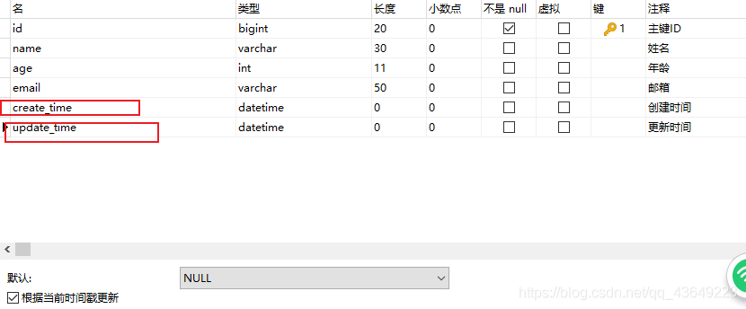

# MyBatisPlus

## 特性

-   **无侵入**：只做增强不做改变，引入它不会对现有工程产生影响，如丝般顺滑
-   **损耗小**：启动即会自动注入基本 CURD，性能基本无损耗，直接面向对象操作
-   **强大的 CRUD 操作**：内置通用 Mapper、通用 Service，仅仅通过少量配置即可实现单表大部分 CRUD 操作，更有强大的条件构造器，满足各类使用需求
-   **支持 Lambda 形式调用**：通过 Lambda 表达式，方便的编写各类查询条件，无需再担心字段写错
-   **支持主键自动生成**：支持多达 4 种主键策略（内含分布式唯一 ID 生成器 - Sequence），可自由配置，完美解决主键问题
-   **支持 ActiveRecord 模式**：支持 ActiveRecord 形式调用，实体类只需继承 Model 类即可进行强大的 CRUD 操作
-   **支持自定义全局通用操作**：支持全局通用方法注入（ Write once, use anywhere ）
-   **内置代码生成器**：采用代码或者 Maven 插件可快速生成 Mapper 、 Model 、 Service 、 Controller 层代码，支持模板引擎，更有超多自定义配置等您来使用
-   **内置分页插件**：基于 MyBatis 物理分页，开发者无需关心具体操作，配置好插件之后，写分页等同于普通 List 查询
-   **分页插件支持多种数据库**：支持 MySQL、MariaDB、Oracle、DB2、H2、HSQL、SQLite、Postgre、SQLServer 等多种数据库
-   **内置性能分析插件**：可输出 Sql 语句以及其执行时间，建议开发测试时启用该功能，能快速揪出慢查询
-   **内置全局拦截插件**：提供全表 delete 、 update 操作智能分析阻断，也可自定义拦截规则，预防误操作

## 快速入门

使用第三方插件:

1.  导入对应的依赖

    ```xml
    <dependencies>
            <dependency>
                <groupId>mysql</groupId>
                <artifactId>mysql-connector-java</artifactId>
            </dependency>
            <dependency>
                <groupId>org.projectlombok</groupId>
                <artifactId>lombok</artifactId>
            </dependency>
            <dependency>
                <groupId>com.baomidou</groupId>
                <artifactId>mybatis-plus-boot-starter</artifactId>
                <version>3.4.1</version>
            </dependency>
            <dependency>
                <groupId>org.springframework.boot</groupId>
                <artifactId>spring-boot-starter-web</artifactId>
            </dependency>
            <dependency>
                <groupId>org.springframework.boot</groupId>
                <artifactId>spring-boot-starter-test</artifactId>
                <scope>test</scope>
            </dependency>
        </dependencies>
    ```

    说明:我们使用mybatis-plus 可以节省我们大量的代码,尽量不要同时导入mybatis和mybatis-plus因为版本有差异

2.  配置文件

    ```properties
    spring.datasource.username=root
    spring.datasource.password=123456
    spring.datasource.url=jdbc:mysql://localhost:3306/test?useSSL=false&useUnicode=true&characterEncoding=utf-8&serverTimezone=GMT%2B8
    spring.datasource.driver-class-name=com.mysql.cj.jdbc.Driver
    ```

3.  使用方式

    -   pojo

    ```java
    @Data
    @AllArgsConstructor
    @NoArgsConstructor
    public class User {
        private Long id;
        private String name;
        private Integer age;
        private String email;
    }
    ```

    -   mapper

    ```java
    @Repository
    public interface UserMapper extends BaseMapper<User> {
    
    }
    ```

    -   测试

    ```java
    @SpringBootTest
    class DemoApplicationTests {
    
        @Autowired
        private UserMapper userMapper;
        @Test
        void contextLoads() {
            List<User> users = userMapper.selectList(null);
            users.forEach(System.out::println);
        }
    
    }
    ```

## 配置日志

我们所有的sql是不可见的,我们希望知道他是怎么执行的,所以我们必须看日志!

```properties
# 配置日志  (默认控制台输出)
mybatis-plus.configuration.log-impl=org.apache.ibatis.logging.stdout.StdOutImpl
```

```
Creating a new SqlSession
SqlSession [org.apache.ibatis.session.defaults.DefaultSqlSession@4245bf68] was not registered for synchronization because synchronization is not active
2020-12-03 14:28:24.455  INFO 24320 --- [           main] com.zaxxer.hikari.HikariDataSource       : HikariPool-1 - Starting...
2020-12-03 14:28:24.613  INFO 24320 --- [           main] com.zaxxer.hikari.HikariDataSource       : HikariPool-1 - Start completed.
JDBC Connection [HikariProxyConnection@1256142210 wrapping com.mysql.cj.jdbc.ConnectionImpl@57e4b86c] will not be managed by Spring
==>  Preparing: SELECT id,name,age,email FROM user
==> Parameters: 
<==    Columns: id, name, age, email
<==        Row: 1, Jone, 18, test1@baomidou.com
<==        Row: 2, Jack, 20, test2@baomidou.com
<==        Row: 3, Tom, 28, test3@baomidou.com
<==        Row: 4, Sandy, 21, test4@baomidou.com
<==        Row: 5, Billie, 24, test5@baomidou.com
<==      Total: 5
Closing non transactional SqlSession [org.apache.ibatis.session.defaults.DefaultSqlSession@4245bf68]
```

## CRUD扩展

### 插入数据

```java
@Test
    public void testInsert(){
        User user = new User();
        user.setName("abc");
        user.setAge(12);
        user.setEmail("123@123");
        int result = userMapper.insert(user);//自动生成id
        System.out.println(result);//受影响的行数
        System.out.println(user);
    }
```

```
Creating a new SqlSession
SqlSession [org.apache.ibatis.session.defaults.DefaultSqlSession@77c66a4f] was not registered for synchronization because synchronization is not active
2020-12-03 14:31:37.151  INFO 24648 --- [           main] com.zaxxer.hikari.HikariDataSource       : HikariPool-1 - Starting...
2020-12-03 14:31:37.307  INFO 24648 --- [           main] com.zaxxer.hikari.HikariDataSource       : HikariPool-1 - Start completed.
JDBC Connection [HikariProxyConnection@1467742939 wrapping com.mysql.cj.jdbc.ConnectionImpl@25ae1f80] will not be managed by Spring
==>  Preparing: INSERT INTO user ( id, name, age, email ) VALUES ( ?, ?, ?, ? )
==> Parameters: 1334384776920068097(Long), abc(String), 12(Integer), 123@123(String)
<==    Updates: 1
Closing non transactional SqlSession [org.apache.ibatis.session.defaults.DefaultSqlSession@77c66a4f]
```

>   主键生成策略

分布式系统中常见的唯一id生成方案：

>   https://www.cnblogs.com/haoxinyue/p/5208136.html

-   uuid

    常见的方式。可以利用数据库也可以利用程序生成，一般来说全球唯一。

    优点：

    1）简单，代码方便。

    2）生成ID性能非常好，基本不会有性能问题。

    3）全球唯一，在遇见数据迁移，系统数据合并，或者数据库变更等情况下，可以从容应对。

    缺点：

    1）没有排序，无法保证趋势递增。

    2）UUID往往是使用字符串存储，查询的效率比较低。

    3）存储空间比较大，如果是海量数据库，就需要考虑存储量的问题。

    4）传输数据量大

    5）不可读。

-   自增id

    最常见的方式。利用数据库，全数据库唯一。

    优点：

    1）简单，代码方便，性能可以接受。

    2）数字ID天然排序，对分页或者需要排序的结果很有帮助。

    缺点：

    1）不同数据库语法和实现不同，数据库迁移的时候或多数据库版本支持的时候需要处理。

    2）在单个数据库或读写分离或一主多从的情况下，只有一个主库可以生成。有单点故障的风险。

    3）在性能达不到要求的情况下，比较难于扩展。

    4）如果遇见多个系统需要合并或者涉及到数据迁移会相当痛苦。

    5）分表分库的时候会有麻烦。

    优化方案：

    针对主库单点，如果有多个Master库，则每个Master库设置的起始数字不一样，步长一样，可以是Master的个数。比如：Master1 生成的是 1，4，7，10，Master2生成的是2,5,8,11 Master3生成的是 3,6,9,12。这样就可以有效生成集群中的唯一ID，也可以大大降低ID生成数据库操作的负载。

-   **雪花算法**

    snowflake是Twitter开源的分布式ID生成算法，结果是一个long型的ID。其核心思想是：使用**41bit作为毫秒数**，**10bit作为机器的ID**（5个bit是*数据中心*，5个bit的*机器ID*），12bit作为**毫秒内的流水号**（意味着每个节点在每毫秒可以产生 4096 个 ID），最后还有一个**符号位**，永远是0。
    可以保证几乎全球唯一。

-   redis生成

    当使用数据库来生成ID性能不够要求的时候，我们可以尝试使用Redis来生成ID。这主要依赖于Redis是单线程的，所以也可以用生成全局唯一的ID。可以用Redis的原子操作 INCR和INCRBY来实现。

    可以使用Redis集群来获取更高的吞吐量。假如一个集群中有5台Redis。可以初始化每台Redis的值分别是1,2,3,4,5，然后步长都是5。各个Redis生成的ID为：

    A：1,6,11,16,21

    B：2,7,12,17,22

    C：3,8,13,18,23

    D：4,9,14,19,24

    E：5,10,15,20,25

    这个，随便负载到哪个机确定好，未来很难做修改。但是3-5台服务器基本能够满足器上，都可以获得不同的ID。但是步长和初始值一定需要事先需要了。使用Redis集群也可以方式单点故障的问题。

    另外，比较适合使用Redis来生成每天从0开始的流水号。比如订单号=日期+当日自增长号。可以每天在Redis中生成一个Key，使用INCR进行累加。

    优点：

    1）不依赖于数据库，灵活方便，且性能优于数据库。

    2）数字ID天然排序，对分页或者需要排序的结果很有帮助。

    缺点：

    1）如果系统中没有Redis，还需要引入新的组件，增加系统复杂度。

    2）需要编码和配置的工作量比较大。

-   zookeeper生成

    zookeeper主要通过其znode数据版本来生成序列号，可以生成32位和64位的数据版本号，客户端可以使用这个版本号来作为唯一的序列号。
    很少会使用zookeeper来生成唯一ID。主要是由于需要依赖zookeeper，并且是多步调用API，如果在竞争较大的情况下，需要考虑使用分布式锁。因此，性能在高并发的分布式环境下，也不甚理想

主键生成策略：

1.  默认 ID_WORKER 全局唯一id

    ```java
    public class User {
        @TableId(type = IdType.ID_WORKER)
        private Long id;
        private String name;
        private Integer age;
        private String email;
    }
    ```

2.  主键自增

    ```java
    public class User {
        @TableId(type = IdType.AUTO)
        private Long id;
        private String name;
        private Integer age;
        private String email;
    }
    ```

    数据库字段一定要是**自增**

3.  其它策略

    ```java
    public enum IdType {
        AUTO(0),//数据库ID自增  
        NONE(1),//该类型为未设置主键类型      
        INPUT(2),//用户输入ID
          		 //该类型可以通过自己注册自动填充插件进行填充  
    //以下3种类型、只有当插入对象ID 为空，才自动填充。     
        ID_WORKER(3),//全局唯一ID (idWorker)      
        UUID(4),//全局唯一ID (UUID)          
        ID_WORKER_STR(5);//字符串全局唯一ID (idWorker 的字符串表示)    
    }
    ```

### 更新数据

```java
@Test
    public void testUpdate(){
        User user = new User();
        //通过条件自动拼接动态sql
        user.setId(1334384776920068097L);
        user.setName("def");
        int result = userMapper.updateById(user);
        System.out.println(result);//受影响的行数
    }
```

```
Creating a new SqlSession
SqlSession [org.apache.ibatis.session.defaults.DefaultSqlSession@3be3e76c] was not registered for synchronization because synchronization is not active
2020-12-03 14:51:31.571  INFO 26989 --- [           main] com.zaxxer.hikari.HikariDataSource       : HikariPool-1 - Starting...
2020-12-03 14:51:31.721  INFO 26989 --- [           main] com.zaxxer.hikari.HikariDataSource       : HikariPool-1 - Start completed.
JDBC Connection [HikariProxyConnection@1425202985 wrapping com.mysql.cj.jdbc.ConnectionImpl@6df791a4] will not be managed by Spring
==>  Preparing: UPDATE user SET name=? WHERE id=?
==> Parameters: def(String), 1334384776920068097(Long)
<==    Updates: 1
Closing non transactional SqlSession [org.apache.ibatis.session.defaults.DefaultSqlSession@3be3e76c]
```

### 自动填充

创建时间 . 修改时间! 这些个操作都是自动化完成的,我们不希望手动更新!

阿里巴巴开发手册:所有的数据库表:gmt_create .gmt_modified几乎所有的表都要配置上!而且需要自动化!

>   方式一:数据库级别

1.在表中新增字段 create_time , update_time



2.再次测试插入方法,我们需要先把实体类同步

```java
private Data creatTime;
private Data updateTime;
```

再次更新查看结果即可


>   方式二:代码级别

1.  实体类字段属性上添加注解

```java
//记住用util包下的Date!!
//字段添加填充内容
@TableField(fill = FieldFill.INSERT)
private Data creatTime;

@TableField(fill = FieldFill.INSERT_UPDATE)
private Data updateTime;
```

2.  编写处理器来处理这个注解

```java
@Slf4j
@Component //把处理器加到IOC容器中
public class MyMetaObjectHandler implements MetaObjectHandler {

    //插入时的填充策略
    @Override
    public void insertFill(MetaObject metaObject) {
        log.info("Start insert fill.... ");
        this.setFieldValByName("createTime",new Date(),metaObject);
        this.setFieldValByName("updateTime",new Date(),metaObject);
    }

    //更新时的填充策略
    @Override
    public void updateFill(MetaObject metaObject) {
        log.info("Start update fill.... ");
        this.setFieldValByName("updateTime",new Date(),metaObject);
    }
}
```

3.  测试插入

4.  测试更新,观察时间即可!

### 乐观锁

>   乐观锁: 顾名思义十分乐观,他总是认为不会出现问题,无论干什么都不去上锁!如果出现了问题,再次更新值测试
>
>   悲观锁;顾名思义十分悲观,他总是认为出现问题,无论干什么都会上锁!再去操作!

我们这里主要讲解 乐观锁机制!

乐观锁实现方式:

-   取出记录时,获取当前version
-   更新时,带上这个version
-   执行更新时,set version = newVersion where version = oldVersion
-   如果version不对,就更新失败

1.  字段加上version注解

```java
@Version
private Integer version;
```

2.  编写配置类

```java
@EnableTransactionManagement
@Configuration
public class MyBatisPlusConfig {
    @Bean
    public MybatisPlusInterceptor MybatisPlusInterceptor() {
        MybatisPlusInterceptor mybatisPlusInterceptor = new MybatisPlusInterceptor();
        mybatisPlusInterceptor.addInnerInterceptor(new OptimisticLockerInnerInterceptor());
        return mybatisPlusInterceptor;
    }
}
```

3.  测试

```java
@Test
    public void testLock(){
        User user = userMapper.selectById(1L);
        user.setName("def");
        userMapper.updateById(user);
    }
```

```
Creating a new SqlSession
SqlSession [org.apache.ibatis.session.defaults.DefaultSqlSession@36510e73] was not registered for synchronization because synchronization is not active
2020-12-03 15:38:38.913  INFO 31796 --- [           main] com.zaxxer.hikari.HikariDataSource       : HikariPool-1 - Starting...
2020-12-03 15:38:39.055  INFO 31796 --- [           main] com.zaxxer.hikari.HikariDataSource       : HikariPool-1 - Start completed.
JDBC Connection [HikariProxyConnection@1895102622 wrapping com.mysql.cj.jdbc.ConnectionImpl@634aa81e] will not be managed by Spring
==>  Preparing: SELECT id,name,age,email,create_time,update_time,version FROM user WHERE id=?
==> Parameters: 1(Long)
<==    Columns: id, name, age, email, create_time, update_time, version
<==        Row: 1, abc, 18, test1@baomidou.com, null, 2020-12-03 15:38:12, 1
<==      Total: 1
Closing non transactional SqlSession [org.apache.ibatis.session.defaults.DefaultSqlSession@36510e73]
Creating a new SqlSession
SqlSession [org.apache.ibatis.session.defaults.DefaultSqlSession@5e0f2c82] was not registered for synchronization because synchronization is not active
2020-12-03 15:38:39.120  INFO 31796 --- [           main] c.m.handler.MyMetaObjectHandler          : update fill
JDBC Connection [HikariProxyConnection@1855590605 wrapping com.mysql.cj.jdbc.ConnectionImpl@634aa81e] will not be managed by Spring
==>  Preparing: UPDATE user SET name=?, age=?, email=?, update_time=?, version=? WHERE id=? AND version=?
==> Parameters: def(String), 18(Integer), test1@baomidou.com(String), 2020-12-03 15:38:39.12(Timestamp), 2(Integer), 1(Long), 1(Integer)
<==    Updates: 1
Closing non transactional SqlSession [org.apache.ibatis.session.defaults.DefaultSqlSession@5e0f2c82]
```

### 查询数据

-   批量查询

```java
@Test
    public void testselect(){
        User user = userMapper.selectById(1L);
        System.out.println(user);
        List<User> users = userMapper.selectBatchIds(Arrays.asList(1, 2, 3));
        users.forEach(System.out::println);
    }
```

-   条件查询

```java
@Test
    public void testselect(){
        Map<String, Object> map = new HashMap<>();
        map.put("name","abc");
        List<User> userList = userMapper.selectByMap(map);
        userList.forEach(System.out::println);
    }
```

-   分页查询

1、原始的 limit 进行分页

2、pageHelper 第三方插件

3、MyBatis-Plus其实也内置了分页插件

使用：

1.  配置拦截器组件

    ```java
    @EnableTransactionManagement
    @Configuration
    public class MyBatisPlusConfig {
        @Bean
        public MybatisPlusInterceptor MybatisPlusInterceptor() {
            MybatisPlusInterceptor mybatisPlusInterceptor = new MybatisPlusInterceptor();
            mybatisPlusInterceptor.addInnerInterceptor(new OptimisticLockerInnerInterceptor());
            mybatisPlusInterceptor.addInnerInterceptor(new PaginationInnerInterceptor(DbType.MYSQL));
            return mybatisPlusInterceptor;
        }
    }
    ```

2.  直接使用Page对象

    ```java
    @Test
        public void testSelectPage(){
            Page<User> page = new Page<>(2,3);//参数一：当前页，参数二：页面大小
            userMapper.selectPage(page,null);
            page.getRecords().forEach(System.out::println);
        }
    ```

### 删除数据

-   单个删除

```java
@Test
    public void testDeleteById(){
        int res = userMapper.deleteById(1334399101453889538L);
        System.out.println(res);
    }
```

-   批量删除

```java
    @Test
    public void testDeleteById(){
        int res = userMapper.deleteBatchIds(Arrays.asList(1334413244152098818L, 1334413267602423809L, 1334413291010859009L));
        System.out.println(res);
    }
```

-   条件删除

```java
@Test
    public void testDeleteMap(){
        Map<String, Object> map = new HashMap<>();
        map.put("name","abc");
        int res = userMapper.deleteByMap(map);
        System.out.println(res);
    }
```

### 逻辑删除

物理删除:从数据库中直接移除

逻辑删除: 在数据库中没有被移除,而是通过一个变量来让他失效! deleted=0=>deleted=1

使用：

1.  实体类中增加属性，并添加注解

```java
@TableLogic
private int deleted;
```

2.  配置

```properties
mybatis-plus.global-config.db-config.logic-delete-value=1
mybatis-plus.global-config.db-config.logic-not-delete-value=0
```

**走的是更新操作,不是删除操作**

**查询的时候会自动过滤删除的数据**

## 性能分析插件

我们在平时的开发中,会遇到一些慢sql.

MyBatis-Plus也提供了性能分析插件,如果超过这个时间就停止运行

**该插件 3.2.0 以上版本移除**

1.  导入插件

```java
@Bean
    @Profile({"dev","test"}) //设置dev 和 test环境开启
    public PerformanceInterceptor performanceInterceptor(){
        PerformanceInterceptor performanceInterceptor = new PerformanceInterceptor();
        performanceInterceptor.setMaxTime(1);
        performanceInterceptor.setFormat(true);
        return performanceInterceptor;
    }
```

2.  设置开发环境

```properties
#设置开发环境
spring.profiles.active=dev
```

3.  测试查询

```java
@Test
    public void testSelectBatchId(){
        List<User> users = userMapper.selectBatchIds(Arrays.asList(1, 2, 3));
        users.forEach(System.out::println);
    }
```


-   高版本性能分析：p6spy

    1.  导入依赖

        ```xml
        <dependency>
                    <groupId>p6spy</groupId>
                    <artifactId>p6spy</artifactId>
                    <version>3.8.2</version>
                </dependency>
        ```

    2.  更改配置

        ```properties
        spring.datasource.url=jdbc:p6spy:mysql://localhost:3306/test?useSSL=false&useUnicode=true&characterEncoding=utf-8&serverTimezone=GMT%2B8
        spring.datasource.driver-class-name=com.p6spy.engine.spy.P6SpyDriver
        ```

        新建`spy.properties`:

        ```properties
        module.log=com.p6spy.engine.logging.P6LogFactory,com.p6spy.engine.outage.P6OutageFactory
        # 自定义日志打印
        logMessageFormat=com.baomidou.mybatisplus.extension.p6spy.P6SpyLogger
        
        
        #日志输出到控制台，解开注释就行了
        appender=com.baomidou.mybatisplus.extension.p6spy.StdoutLogger
        
        # 指定输出文件位置
        logfile=sql.log
        
        # 使用日志系统记录 sql
        #appender=com.p6spy.engine.spy.appender.Slf4JLogger
        # 设置 p6spy driver 代理
        deregisterdrivers=true
        # 取消JDBC URL前缀
        useprefix=true
        # 配置记录 Log 例外,可去掉的结果集有error,info,batch,debug,statement,commit,rollback,result,resultset.
        excludecategories=info,debug,result,batch,resultset
        # 日期格式
        dateformat=yyyy-MM-dd HH:mm:ss
        # 实际驱动可多个
        #driverlist=org.h2.Driver
        # 是否开启慢SQL记录
        outagedetection=true
        # 慢SQL记录标准 2 秒
        outagedetectioninterval=2
        ```

    3.  测试

        ```java
        @Test
            void contextLoads() {
                List<User> users = userMapper.selectList(null);
                users.forEach(System.out::println);
            }
        ```

        ```
        Consume Time：4 ms 2020-12-03 16:52:07
         Execute SQL：SELECT id,name,age,email,create_time,update_time,version,deleted FROM user WHERE deleted=0
        ```

## 条件构造器

Wappper

我们写一些复杂的SQL就可以使用他来替代

```java
@Test
    void contextLoads() {
        // 查询name不为空的用户，并且邮箱不为空的用户，年龄大于等于12
        QueryWrapper<User> wrapper = new QueryWrapper<>();
        wrapper
                .isNotNull("name")
                .isNotNull("email")
                .ge("age",12);
        userMapper.selectList(wrapper).forEach(System.out::println); // 和我们刚才学习的map对比一下
    }

    @Test
    void test2(){
        // 查询名字狂神说
        QueryWrapper<User> wrapper = new QueryWrapper<>();
        wrapper.eq("name","狂神说");
        User user = userMapper.selectOne(wrapper); // 查询一个数据，出现多个结果使用List 或者 Map
        System.out.println(user);
    }

    @Test
    void test3(){
        // 查询年龄在 20 ~ 30 岁之间的用户
        QueryWrapper<User> wrapper = new QueryWrapper<>();
        wrapper.between("age",20,30); // 区间
        Integer count = userMapper.selectCount(wrapper);// 查询结果数
        System.out.println(count);
    }

    // 模糊查询
    @Test
    void test4(){
        // 查询年龄在 20 ~ 30 岁之间的用户
        QueryWrapper<User> wrapper = new QueryWrapper<>();
        // 左和右  t%
        wrapper
                .notLike("name","e")
                .likeRight("email","t");

        List<Map<String, Object>> maps = userMapper.selectMaps(wrapper);
        maps.forEach(System.out::println);
    }

    // 模糊查询
    @Test
    void test5(){

        QueryWrapper<User> wrapper = new QueryWrapper<>();
        // id 在子查询中查出来
        wrapper.inSql("id","select id from user where id<3");

        List<Object> objects = userMapper.selectObjs(wrapper);
        objects.forEach(System.out::println);
    }

    //测试六
    @Test
    void test6(){
        QueryWrapper<User> wrapper = new QueryWrapper<>();
        // 通过id进行排序
        wrapper.orderByAsc("id");

        List<User> users = userMapper.selectList(wrapper);
        users.forEach(System.out::println);
    }

```

## 代码生成器

dao、pojo、service、controller都给我自己去编写完成！

AutoGenerator 是 MyBatis-Plus 的代码生成器，通过 AutoGenerator 可以快速生成 Entity、

Mapper、Mapper XML、Service、Controller 等各个模块的代码，极大的提升了开发效率。

只需要改实体类名字 和包名 还有 数据库配置即可

```java
@SpringBootTest
public class AutoTest {
    @Test
    public void test(){
        // 需要构建一个 代码自动生成器 对象 
        AutoGenerator mpg = new AutoGenerator();

        // 配置策略 
        // 1、全局配置 
        GlobalConfig gc = new GlobalConfig();
        String projectPath = System.getProperty("user.dir");
        gc.setOutputDir(projectPath+"/src/main/java");
        gc.setAuthor("test"); gc.setOpen(false);
        gc.setFileOverride(false);

        // 是否覆盖
        gc.setServiceName("%sService");

        // 去Service的I前缀
        gc.setIdType(IdType.ID_WORKER);
        gc.setDateType(DateType.ONLY_DATE);
        gc.setSwagger2(true);
        mpg.setGlobalConfig(gc);

        //2、设置数据源
        DataSourceConfig dsc = new DataSourceConfig();
        dsc.setUrl("jdbc:mysql://localhost:3306/test?useSSL=false&useUnicode=true&characterEncoding=utf-8&serverTimezone=GMT%2B8");
        dsc.setDriverName("com.mysql.cj.jdbc.Driver");
        dsc.setUsername("root");
        dsc.setPassword("123456");
        dsc.setDbType(DbType.MYSQL); mpg.setDataSource(dsc);

        //3、包的配置
        PackageConfig pc = new PackageConfig();
        //只需要改实体类名字 和包名 还有 数据库配置即可
        pc.setModuleName("blog"); pc.setParent("com.kuang");
        pc.setEntity("entity"); pc.setMapper("mapper");
        pc.setService("service"); pc.setController("controller");
        mpg.setPackageInfo(pc);

        //4、策略配置
        StrategyConfig strategy = new StrategyConfig();
        strategy.setInclude("blog_tags","course","links","sys_settings","user_record"," user_say");

        // 设置要映射的表名
        strategy.setNaming(NamingStrategy.underline_to_camel);
        strategy.setColumnNaming(NamingStrategy.underline_to_camel);
        strategy.setEntityLombokModel(true);

        // 自动lombok；
        strategy.setLogicDeleteFieldName("deleted");

        // 自动填充配置
        TableFill gmtCreate = new TableFill("gmt_create", FieldFill.INSERT);
        TableFill gmtModified = new TableFill("gmt_modified", FieldFill.INSERT_UPDATE);
        ArrayList<TableFill> tableFills = new ArrayList<>();
        tableFills.add(gmtCreate); tableFills.add(gmtModified);
        strategy.setTableFillList(tableFills);

        // 乐观锁
        strategy.setVersionFieldName("version");
        strategy.setRestControllerStyle(true);
        strategy.setControllerMappingHyphenStyle(true);

        // localhost:8080/hello_id_2 
        mpg.setStrategy(strategy);
        mpg.execute(); //执行 
    
    }
}
```

