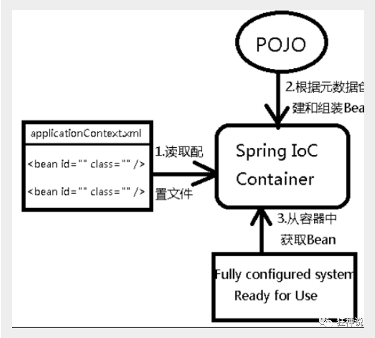

# Spring

## Spring简介

Spring : 春天 --->给软件行业带来了春天

2002年，Rod Jahnson首次推出了Spring框架雏形interface21框架。

2004年3月24日，Spring框架以interface21框架为基础，经过重新设计，发布了1.0正式版。

很难想象Rod Johnson的学历 , 他是悉尼大学的博士，然而他的专业不是计算机，而是音乐学。

Spring理念 : 使现有技术更加实用 . 本身就是一个大杂烩 , 整合现有的框架技术

-   优点

    1.  Spring是一个开源免费的框架 , 容器  

    2.  Spring是一个轻量级的框架 , 非侵入式的 

    3.  控制反转 IoC  , 面向切面 Aop

    4.  对事务的支持 , 对框架的支持

**Spring是一个轻量级的控制反转(IoC)和面向切面(AOP)的容器（框架）**

-   组成

    

    Spring 框架是一个分层架构，由 7 个定义良好的模块组成。Spring 模块构建在核心容器之上，核心容器定义了创建、配置和管理 bean 的方式。

    

    组成 Spring 框架的每个模块（或组件）都可以单独存在，或者与其他一个或多个模块联合实现。每个模块的功能如下：

    -   核心容器：核心容器提供 Spring 框架的基本功能。核心容器的主要组件是 BeanFactory，它是工厂模式的实现。BeanFactory 使用*控制反转*（IOC） 模式将应用程序的配置和依赖性规范与实际的应用程序代码分开。
    -   Spring 上下文：Spring 上下文是一个配置文件，向 Spring 框架提供上下文信息。Spring 上下文包括企业服务，例如 JNDI、EJB、电子邮件、国际化、校验和调度功能。
    -   Spring AOP：通过配置管理特性，Spring AOP 模块直接将面向切面的编程功能 , 集成到了 Spring 框架中。所以，可以很容易地使 Spring 框架管理任何支持 AOP的对象。Spring AOP 模块为基于 Spring 的应用程序中的对象提供了事务管理服务。通过使用 Spring AOP，不用依赖组件，就可以将声明性事务管理集成到应用程序中。
    -   Spring DAO：JDBC DAO 抽象层提供了有意义的异常层次结构，可用该结构来管理异常处理和不同数据库供应商抛出的错误消息。异常层次结构简化了错误处理，并且极大地降低了需要编写的异常代码数量（例如打开和关闭连接）。Spring DAO 的面向 JDBC 的异常遵从通用的 DAO 异常层次结构。
    -   Spring ORM：Spring 框架插入了若干个 ORM 框架，从而提供了 ORM 的对象关系工具，其中包括 JDO、Hibernate 和 iBatis SQL Map。所有这些都遵从 Spring 的通用事务和 DAO 异常层次结构。
    -   Spring Web 模块：Web 上下文模块建立在应用程序上下文模块之上，为基于 Web 的应用程序提供了上下文。所以，Spring 框架支持与 Jakarta Struts 的集成。Web 模块还简化了处理多部分请求以及将请求参数绑定到域对象的工作。
    -   Spring MVC 框架：MVC 框架是一个全功能的构建 Web 应用程序的 MVC 实现。通过策略接口，MVC 框架变成为高度可配置的，MVC 容纳了大量视图技术，其中包括 JSP、Velocity、Tiles、iText 和 POI。


**Spring Boot与Spring Cloud**

-   Spring Boot 是 Spring 的一套快速配置脚手架，可以基于Spring Boot 快速开发单个微服务;
-   Spring Cloud是基于Spring Boot实现的；
-   Spring Boot专注于快速、方便集成的单个微服务个体，Spring Cloud关注全局的服务治理框架；
-   Spring Boot使用了约束优于配置的理念，很多集成方案已经帮你选择好了，能不配置就不配置 , Spring Cloud很大的一部分是基于Spring Boot来实现，Spring Boot可以离开Spring Cloud独立使用开发项目，但是Spring Cloud离不开Spring Boot，属于依赖的关系。
-   SpringBoot在SpringClound中起到了承上启下的作用，如果你要学习SpringCloud必须要学习SpringBoot。

## IOC理论

使用set注入

```java
public class UserServiceImpl implements UserService{
    private UserDao userDao;
    //利用set实现动态实现值的注入
    public void setUserDao(UserDao userDao) {
        this.userDao = userDao;
    }

    @Override
    public void getUser() {
        userDao.getUser();
    }
}

```

```java
public class MyTest {
    @Test
    public void test1(){
        UserService userService = new UserServiceImpl();
        ((UserServiceImpl)userService).setUserDao(new UserDaoImpl());
        userService.getUser();
        ((UserServiceImpl)userService).setUserDao(new UserDaoMySQL());
        userService.getUser();
    }
}
```

以前所有东西都是由程序去进行控制创建 , 而现在是由我们自行控制创建对象 , 把主动权交给了调用者 . 程序不用去管怎么创建,怎么实现了 . 它只负责提供一个接口 。

这种思想 , 从本质上解决了问题 , 我们程序员不再去管理对象的创建了 , 更多的去关注业务的实现 . 耦合性大大降低 . 这也就是IOC的原型。


**控制反转IoC(Inversion of Control)，是一种设计思想，DI(依赖注入)是实现IoC的一种方法**，也有人认为DI只是IoC的另一种说法。没有IoC的程序中 , 我们使用面向对象编程 , 对象的创建与对象间的依赖关系完全硬编码在程序中，对象的创建由程序自己控制，控制反转后将对象的创建转移给第三方，个人认为所谓控制反转就是：获得依赖对象的方式反转了。

**IoC是Spring框架的核心内容**，使用多种方式完美的实现了IoC，可以使用XML配置，也可以使用注解，新版本的Spring也可以零配置实现IoC。Spring容器在初始化时先读取配置文件，根据配置文件或元数据创建与组织对象存入容器中，程序使用时再从Ioc容器中取出需要的对象。



采用XML方式配置Bean的时候，Bean的定义信息是和实现分离的，而采用注解的方式可以把两者合为一体，Bean的定义信息直接以注解的形式定义在实现类中，从而达到了零配置的目的。

**控制反转是一种通过描述（XML或注解）并通过第三方去生产或获取特定对象的方式。在Spring中实现控制反转的是IoC容器，其实现方法是依赖注入（Dependency Injection,DI）。**

## Spring 入门

### Hello Spring

pojo中

```java
package com.pojo;

public class Hello {

    private String name;

    public String getName() {
        return name;
    }

    public void setName(String name) {
        this.name = name;
    }

    @Override
    public String toString() {
        return "Hello{" +
                "name='" + name + '\'' +
                '}';
    }
}
```

resource中

```xml
<?xml version="1.0" encoding="UTF-8"?>
<beans xmlns="http://www.springframework.org/schema/beans"
       xmlns:xsi="http://www.w3.org/2001/XMLSchema-instance"
       xsi:schemaLocation="http://www.springframework.org/schema/beans
        https://www.springframework.org/schema/beans/spring-beans.xsd">

    <!--bean = 对象-->
    <!--id = 变量名-->
    <!--class = new的对象-->
    <!--property 相当于给对象中的属性设值-->
    
    <bean id="hello" class="com.pojo.Hello">
        <property name="name" value="Spring"/>
    </bean>
</beans>
```

test

```java
import com.pojo.Hello;
import org.springframework.context.ApplicationContext;
import org.springframework.context.support.ClassPathXmlApplicationContext;

public class Mytest {

    public static void main(String[] args) {
        //获取spring上下文对象
        ApplicationContext context = new ClassPathXmlApplicationContext("beans.xml");
        //我们的对象下能在都在spring·中管理了，我们要使用，直接取出来就可以了
        Hello hello = (Hello) context.getBean("hello");
        System.out.println(hello.toString());
    }
}
```

bean = 对象
id = 变量名
class = new的对象
property 相当于给对象中的属性设值

核心用set注入

第一个文件中

```xml
<?xml version="1.0" encoding="UTF-8"?>
<beans xmlns="http://www.springframework.org/schema/beans"
       xmlns:xsi="http://www.w3.org/2001/XMLSchema-instance"
       xsi:schemaLocation="http://www.springframework.org/schema/beans
        https://www.springframework.org/schema/beans/spring-beans.xsd">

    <bean id="userdaomysql" class="com.dao.UserDaoMysqlImpl"></bean>

    <bean id="userServiceImpl" class="com.service.UserServiceImp">
        <!--ref引用spring中已经创建很好的对象-->
        <!--value是一个具体的值-->
        <property name="userDao" ref="userdaomysql"/>
    </bean>

</beans>
```

这个过程就叫控制反转 :

-   控制 : 谁来控制对象的创建 , 传统应用程序的对象是由程序本身控制创建的 , 使用Spring后 , 对象是由Spring来创建的
-   反转 : 程序本身不创建对象 , 而变成被动的接收对象 .

依赖注入 : 就是利用set方法来进行注入的.

 IOC是一种编程思想，由主动的编程变成被动的接收

### IOC创建对象方式

1.  使用无参构造创建对象，默认。
2.  使用有参构造

下标赋值

```xml
<?xml version="1.0" encoding="UTF-8"?>
<beans xmlns="http://www.springframework.org/schema/beans"
       xmlns:xsi="http://www.w3.org/2001/XMLSchema-instance"
       xsi:schemaLocation="http://www.springframework.org/schema/beans
        https://www.springframework.org/schema/beans/spring-beans.xsd">

    <bean id="user" class="com.pojo.User">
        <constructor-arg index="0" value="123"/>
    </bean>
</beans>
```

类型赋值（不建议使用）

```xml
<bean id="user" class="com.pojo.User">
    <constructor-arg type="java.lang.String" value="123"/>
</bean>
```

直接通过参数名

```xml
<bean id="user" class="com.pojo.User">
    <constructor-arg name="name" value="123"></constructor-arg>
</bean>
```

### Spring配置

**别名**

```xml
<bean id="user" class="com.pojo.User">
    <constructor-arg name="name" value="123"></constructor-arg>
</bean>

<alias name="user" alias="user2"/>
```

**Bean的配置**

-   id：bean的id标识符
-   class：bean对象所对应的类型
-   name：别名，更高级，可以同时取多个别名。

**import**

一般用于团队开发，它可以将多个配置文件，导入合并为一个

```xml
<import resource="beans.xml"/>
```

## 依赖注入

### set方式注入

-   依赖：bean对象的创建依赖于容器
-   注入：bean对象中的所有属性，由容器来注入

```xml
<bean id="student" class="com.pojo.Student">
<!--        普通值注入-->
        <property name="name" value="testname"/>
<!--        bean注入-->
        <property name="address" ref="address"/>
<!--        数组注入-->
        <property name="books">
            <array>
                <value>123</value>
                <value>456</value>
                <value>789</value>
            </array>
        </property>
<!--        List注入-->
        <property name="hobbies">
            <list>
                <value>h1</value>
                <value>h2</value>
                <value>h3</value>
            </list>
        </property>
<!--        Map注入-->
        <property name="card">
            <map>
                <entry key="key1" value="value1"/>
                <entry key="key2" value="value2"/>
                <entry key="key3" value="value3"/>
            </map>
        </property>
<!--        Set注入-->
        <property name="games">
            <set>
                <value>v1</value>
                <value>v2</value>
                <value>v3</value>
            </set>
        </property>
<!--        null值注入-->
        <property name="def">
            <null></null>
        </property>
<!--        Properties注入-->
        <property name="info">
            <props>
                <prop key="id">123456</prop>
                <prop key="gender">male</prop>
                <prop key="uuid">111111</prop>
            </props>
        </property>
    </bean>
    <bean id="address" class="com.pojo.Address">
        <property name="address" value="test"/>
    </bean>
```

### 扩展方式注入

```xml
<?xml version="1.0" encoding="UTF-8"?>
<beans xmlns="http://www.springframework.org/schema/beans"
       xmlns:xsi="http://www.w3.org/2001/XMLSchema-instance"
       xmlns:p="http://www.springframework.org/schema/p"
       xmlns:c="http://www.springframework.org/schema/c"
       xsi:schemaLocation="http://www.springframework.org/schema/beans
        https://www.springframework.org/schema/beans/spring-beans.xsd">
<!--    p命名空间注入，可以直接注册属性的值-->
    <bean id="user" class="com.pojo.User" p:name="abc" p:age="20"/>
<!--    c命名空间注入，可以直接注册构造器-->
    <bean id="user2" class="com.pojo.User" c:age="18" c:name="ttt"/>
</beans>
```

注意：

1、P命名空间注入 : 需要在头文件中加入约束文件

```
 导入约束 : xmlns:p="http://www.springframework.org/schema/p"
```

2、c 命名空间注入 : 需要在头文件中加入约束文件

```
 导入约束 : xmlns:c="http://www.springframework.org/schema/c"
```

发现问题：爆红了，刚才我们没有写有参构造

解决：把有参构造器加上，这里也能知道，c 就是所谓的构造器注入

### Bean作用域

在Spring中，那些组成应用程序的主体及由Spring IoC容器所管理的对象，被称之为bean。简单地讲，bean就是由IoC容器初始化、装配及管理的对象 .


几种作用域中，request、session作用域仅在基于web的应用中使用（不必关心你所采用的是什么web应用框架），只能用在基于web的Spring ApplicationContext环境。

#### Singleton

单例模式（默认）

```xml
 <bean id="ServiceImpl" class="cn.csdn.service.ServiceImpl" scope="singleton">
```

#### Prototype

原型模式（每次从容器中get的时候会产生一个新对象）

```xml
 <bean id="account" class="com.foo.DefaultAccount" scope="prototype"/>  
```

