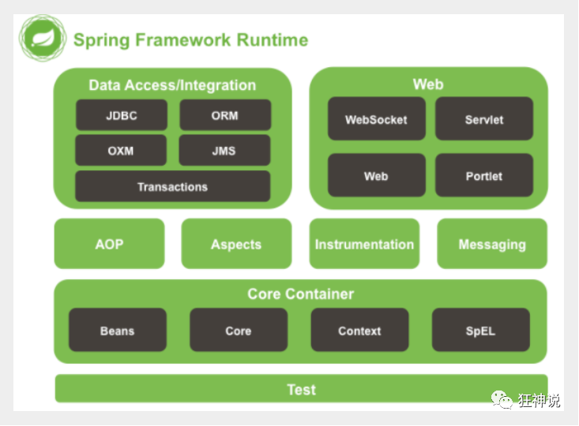

# Spring

## Spring简介

Spring : 春天 --->给软件行业带来了春天

2002年，Rod Jahnson首次推出了Spring框架雏形interface21框架。

2004年3月24日，Spring框架以interface21框架为基础，经过重新设计，发布了1.0正式版。

很难想象Rod Johnson的学历 , 他是悉尼大学的博士，然而他的专业不是计算机，而是音乐学。

Spring理念 : 使现有技术更加实用 . 本身就是一个大杂烩 , 整合现有的框架技术

-   优点

    1.  Spring是一个开源免费的框架 , 容器  

    2.  Spring是一个轻量级的框架 , 非侵入式的 

    3.  控制反转 IoC  , 面向切面 Aop

    4.  对事务的支持 , 对框架的支持

**Spring是一个轻量级的控制反转(IoC)和面向切面(AOP)的容器（框架）**

-   组成

    

    Spring 框架是一个分层架构，由 7 个定义良好的模块组成。Spring 模块构建在核心容器之上，核心容器定义了创建、配置和管理 bean 的方式。

    

    组成 Spring 框架的每个模块（或组件）都可以单独存在，或者与其他一个或多个模块联合实现。每个模块的功能如下：

    -   核心容器：核心容器提供 Spring 框架的基本功能。核心容器的主要组件是 BeanFactory，它是工厂模式的实现。BeanFactory 使用*控制反转*（IOC） 模式将应用程序的配置和依赖性规范与实际的应用程序代码分开。
    -   Spring 上下文：Spring 上下文是一个配置文件，向 Spring 框架提供上下文信息。Spring 上下文包括企业服务，例如 JNDI、EJB、电子邮件、国际化、校验和调度功能。
    -   Spring AOP：通过配置管理特性，Spring AOP 模块直接将面向切面的编程功能 , 集成到了 Spring 框架中。所以，可以很容易地使 Spring 框架管理任何支持 AOP的对象。Spring AOP 模块为基于 Spring 的应用程序中的对象提供了事务管理服务。通过使用 Spring AOP，不用依赖组件，就可以将声明性事务管理集成到应用程序中。
    -   Spring DAO：JDBC DAO 抽象层提供了有意义的异常层次结构，可用该结构来管理异常处理和不同数据库供应商抛出的错误消息。异常层次结构简化了错误处理，并且极大地降低了需要编写的异常代码数量（例如打开和关闭连接）。Spring DAO 的面向 JDBC 的异常遵从通用的 DAO 异常层次结构。
    -   Spring ORM：Spring 框架插入了若干个 ORM 框架，从而提供了 ORM 的对象关系工具，其中包括 JDO、Hibernate 和 iBatis SQL Map。所有这些都遵从 Spring 的通用事务和 DAO 异常层次结构。
    -   Spring Web 模块：Web 上下文模块建立在应用程序上下文模块之上，为基于 Web 的应用程序提供了上下文。所以，Spring 框架支持与 Jakarta Struts 的集成。Web 模块还简化了处理多部分请求以及将请求参数绑定到域对象的工作。
    -   Spring MVC 框架：MVC 框架是一个全功能的构建 Web 应用程序的 MVC 实现。通过策略接口，MVC 框架变成为高度可配置的，MVC 容纳了大量视图技术，其中包括 JSP、Velocity、Tiles、iText 和 POI。


**Spring Boot与Spring Cloud**

-   Spring Boot 是 Spring 的一套快速配置脚手架，可以基于Spring Boot 快速开发单个微服务;
-   Spring Cloud是基于Spring Boot实现的；
-   Spring Boot专注于快速、方便集成的单个微服务个体，Spring Cloud关注全局的服务治理框架；
-   Spring Boot使用了约束优于配置的理念，很多集成方案已经帮你选择好了，能不配置就不配置 , Spring Cloud很大的一部分是基于Spring Boot来实现，Spring Boot可以离开Spring Cloud独立使用开发项目，但是Spring Cloud离不开Spring Boot，属于依赖的关系。
-   SpringBoot在SpringClound中起到了承上启下的作用，如果你要学习SpringCloud必须要学习SpringBoot。

## IOC理论

使用set注入

```java
public class UserServiceImpl implements UserService{
    private UserDao userDao;
    //利用set实现动态实现值的注入
    public void setUserDao(UserDao userDao) {
        this.userDao = userDao;
    }

    @Override
    public void getUser() {
        userDao.getUser();
    }
}

```

```java
public class MyTest {
    @Test
    public void test1(){
        UserService userService = new UserServiceImpl();
        ((UserServiceImpl)userService).setUserDao(new UserDaoImpl());
        userService.getUser();
        ((UserServiceImpl)userService).setUserDao(new UserDaoMySQL());
        userService.getUser();
    }
}
```

以前所有东西都是由程序去进行控制创建 , 而现在是由我们自行控制创建对象 , 把主动权交给了调用者 . 程序不用去管怎么创建,怎么实现了 . 它只负责提供一个接口 。

这种思想 , 从本质上解决了问题 , 我们程序员不再去管理对象的创建了 , 更多的去关注业务的实现 . 耦合性大大降低 . 这也就是IOC的原型。


**控制反转IoC(Inversion of Control)，是一种设计思想，DI(依赖注入)是实现IoC的一种方法**，也有人认为DI只是IoC的另一种说法。没有IoC的程序中 , 我们使用面向对象编程 , 对象的创建与对象间的依赖关系完全硬编码在程序中，对象的创建由程序自己控制，控制反转后将对象的创建转移给第三方，个人认为所谓控制反转就是：获得依赖对象的方式反转了。

**IoC是Spring框架的核心内容**，使用多种方式完美的实现了IoC，可以使用XML配置，也可以使用注解，新版本的Spring也可以零配置实现IoC。Spring容器在初始化时先读取配置文件，根据配置文件或元数据创建与组织对象存入容器中，程序使用时再从Ioc容器中取出需要的对象。


采用XML方式配置Bean的时候，Bean的定义信息是和实现分离的，而采用注解的方式可以把两者合为一体，Bean的定义信息直接以注解的形式定义在实现类中，从而达到了零配置的目的。

**控制反转是一种通过描述（XML或注解）并通过第三方去生产或获取特定对象的方式。在Spring中实现控制反转的是IoC容器，其实现方法是依赖注入（Dependency Injection,DI）。**

## Spring 入门

### Hello Spring

pojo中

```java
package com.pojo;

public class Hello {

    private String name;

    public String getName() {
        return name;
    }

    public void setName(String name) {
        this.name = name;
    }

    @Override
    public String toString() {
        return "Hello{" +
                "name='" + name + '\'' +
                '}';
    }
}
```

resource中

```xml
<?xml version="1.0" encoding="UTF-8"?>
<beans xmlns="http://www.springframework.org/schema/beans"
       xmlns:xsi="http://www.w3.org/2001/XMLSchema-instance"
       xsi:schemaLocation="http://www.springframework.org/schema/beans
        https://www.springframework.org/schema/beans/spring-beans.xsd">

    <!--bean = 对象-->
    <!--id = 变量名-->
    <!--class = new的对象-->
    <!--property 相当于给对象中的属性设值-->
    
    <bean id="hello" class="com.pojo.Hello">
        <property name="name" value="Spring"/>
    </bean>
</beans>
```

test

```java
import com.pojo.Hello;
import org.springframework.context.ApplicationContext;
import org.springframework.context.support.ClassPathXmlApplicationContext;

public class Mytest {

    public static void main(String[] args) {
        //获取spring上下文对象
        ApplicationContext context = new ClassPathXmlApplicationContext("beans.xml");
        //我们的对象下能在都在spring·中管理了，我们要使用，直接取出来就可以了
        Hello hello = (Hello) context.getBean("hello");
        System.out.println(hello.toString());
    }
}
```

bean = 对象
id = 变量名
class = new的对象
property 相当于给对象中的属性设值

核心用set注入

第一个文件中

```xml
<?xml version="1.0" encoding="UTF-8"?>
<beans xmlns="http://www.springframework.org/schema/beans"
       xmlns:xsi="http://www.w3.org/2001/XMLSchema-instance"
       xsi:schemaLocation="http://www.springframework.org/schema/beans
        https://www.springframework.org/schema/beans/spring-beans.xsd">

    <bean id="userdaomysql" class="com.dao.UserDaoMysqlImpl"></bean>

    <bean id="userServiceImpl" class="com.service.UserServiceImp">
        <!--ref引用spring中已经创建很好的对象-->
        <!--value是一个具体的值-->
        <property name="userDao" ref="userdaomysql"/>
    </bean>

</beans>
```

这个过程就叫控制反转 :

-   控制 : 谁来控制对象的创建 , 传统应用程序的对象是由程序本身控制创建的 , 使用Spring后 , 对象是由Spring来创建的
-   反转 : 程序本身不创建对象 , 而变成被动的接收对象 .

依赖注入 : 就是利用set方法来进行注入的.

 IOC是一种编程思想，由主动的编程变成被动的接收

### IOC创建对象方式

1.  使用无参构造创建对象，默认。
2.  使用有参构造

下标赋值

```xml
<?xml version="1.0" encoding="UTF-8"?>
<beans xmlns="http://www.springframework.org/schema/beans"
       xmlns:xsi="http://www.w3.org/2001/XMLSchema-instance"
       xsi:schemaLocation="http://www.springframework.org/schema/beans
        https://www.springframework.org/schema/beans/spring-beans.xsd">

    <bean id="user" class="com.pojo.User">
        <constructor-arg index="0" value="123"/>
    </bean>
</beans>
```

类型赋值（不建议使用）

```xml
<bean id="user" class="com.pojo.User">
    <constructor-arg type="java.lang.String" value="123"/>
</bean>
```

直接通过参数名

```xml
<bean id="user" class="com.pojo.User">
    <constructor-arg name="name" value="123"></constructor-arg>
</bean>
```

### Spring配置

**别名**

```xml
<bean id="user" class="com.pojo.User">
    <constructor-arg name="name" value="123"></constructor-arg>
</bean>

<alias name="user" alias="user2"/>
```

**Bean的配置**

-   id：bean的id标识符
-   class：bean对象所对应的类型
-   name：别名，更高级，可以同时取多个别名。

**import**

一般用于团队开发，它可以将多个配置文件，导入合并为一个

```xml
<import resource="beans.xml"/>
```

## 依赖注入

### set方式注入

-   依赖：bean对象的创建依赖于容器
-   注入：bean对象中的所有属性，由容器来注入

```xml
<bean id="student" class="com.pojo.Student">
<!--        普通值注入-->
        <property name="name" value="testname"/>
<!--        bean注入-->
        <property name="address" ref="address"/>
<!--        数组注入-->
        <property name="books">
            <array>
                <value>123</value>
                <value>456</value>
                <value>789</value>
            </array>
        </property>
<!--        List注入-->
        <property name="hobbies">
            <list>
                <value>h1</value>
                <value>h2</value>
                <value>h3</value>
            </list>
        </property>
<!--        Map注入-->
        <property name="card">
            <map>
                <entry key="key1" value="value1"/>
                <entry key="key2" value="value2"/>
                <entry key="key3" value="value3"/>
            </map>
        </property>
<!--        Set注入-->
        <property name="games">
            <set>
                <value>v1</value>
                <value>v2</value>
                <value>v3</value>
            </set>
        </property>
<!--        null值注入-->
        <property name="def">
            <null></null>
        </property>
<!--        Properties注入-->
        <property name="info">
            <props>
                <prop key="id">123456</prop>
                <prop key="gender">male</prop>
                <prop key="uuid">111111</prop>
            </props>
        </property>
    </bean>
    <bean id="address" class="com.pojo.Address">
        <property name="address" value="test"/>
    </bean>
```

### 扩展方式注入

```xml
<?xml version="1.0" encoding="UTF-8"?>
<beans xmlns="http://www.springframework.org/schema/beans"
       xmlns:xsi="http://www.w3.org/2001/XMLSchema-instance"
       xmlns:p="http://www.springframework.org/schema/p"
       xmlns:c="http://www.springframework.org/schema/c"
       xsi:schemaLocation="http://www.springframework.org/schema/beans
        https://www.springframework.org/schema/beans/spring-beans.xsd">
<!--    p命名空间注入，可以直接注册属性的值-->
    <bean id="user" class="com.pojo.User" p:name="abc" p:age="20"/>
<!--    c命名空间注入，可以直接注册构造器-->
    <bean id="user2" class="com.pojo.User" c:age="18" c:name="ttt"/>
</beans>
```

注意：

1、P命名空间注入 : 需要在头文件中加入约束文件

```
 导入约束 : xmlns:p="http://www.springframework.org/schema/p"
```

2、c 命名空间注入 : 需要在头文件中加入约束文件

```
 导入约束 : xmlns:c="http://www.springframework.org/schema/c"
```

发现问题：爆红了，刚才我们没有写有参构造

解决：把有参构造器加上，这里也能知道，c 就是所谓的构造器注入

### Bean作用域

在Spring中，那些组成应用程序的主体及由Spring IoC容器所管理的对象，被称之为bean。简单地讲，bean就是由IoC容器初始化、装配及管理的对象 .


几种作用域中，request、session作用域仅在基于web的应用中使用（不必关心你所采用的是什么web应用框架），只能用在基于web的Spring ApplicationContext环境。

-   Singleton

单例模式（默认）

```xml
 <bean id="ServiceImpl" class="cn.csdn.service.ServiceImpl" scope="singleton">
```

-   Prototype

原型模式（每次从容器中get的时候会产生一个新对象）

```xml
 <bean id="account" class="com.foo.DefaultAccount" scope="prototype"/>  
```

## Bean自动装配

-   自动装配是Spring是满足bean依赖的一种方式
-   Spring会在上下文自动寻找，并自动给bean装配属性

在Spring中有三种装配的方式

1.  在xml中显式配置
2.  在java中显式配置
3.  隐式的自动装配bean

```xml
<?xml version="1.0" encoding="UTF-8"?>
<beans xmlns="http://www.springframework.org/schema/beans"
       xmlns:xsi="http://www.w3.org/2001/XMLSchema-instance"
       xmlns:p="http://www.springframework.org/schema/p"
       xmlns:c="http://www.springframework.org/schema/c"
       xsi:schemaLocation="http://www.springframework.org/schema/beans
        https://www.springframework.org/schema/beans/spring-beans.xsd">
    <bean id="cat" class="com.pojo.Cat"/>
    <bean id="dog" class="com.pojo.Dog"/>
    <bean id="people" class="com.pojo.People">
        <property name="name" value="testname"/>
        <property name="dog" ref="dog"/>
        <property name="cat" ref="cat"/>
    </bean>
</beans>
```

### ByName自动装配

Byname自动装配：byname会自动查找，和自己对象set对应的值对应的beanid（id字段）

保证所有id唯一，并且和set注入的值一致

```xml
<?xml version="1.0" encoding="UTF-8"?>
<beans xmlns="http://www.springframework.org/schema/beans"
       xmlns:xsi="http://www.w3.org/2001/XMLSchema-instance"
       xmlns:p="http://www.springframework.org/schema/p"
       xmlns:c="http://www.springframework.org/schema/c"
       xsi:schemaLocation="http://www.springframework.org/schema/beans
        https://www.springframework.org/schema/beans/spring-beans.xsd">
    <bean id="cat" class="com.pojo.Cat"/>
    <bean id="dog" class="com.pojo.Dog"/>
    <bean id="people" class="com.pojo.People" autowire="byName">
        <property name="name" value="testname"/>
    </bean>
</beans>
```

### ByType自动装配

Bytype自动装配：byType会自动查找，和自己对象属性类型相同的bean（class字段）

保证所有的class唯一，并且和属性类型一致

```xml
<?xml version="1.0" encoding="UTF-8"?>
<beans xmlns="http://www.springframework.org/schema/beans"
       xmlns:xsi="http://www.w3.org/2001/XMLSchema-instance"
       xmlns:p="http://www.springframework.org/schema/p"
       xmlns:c="http://www.springframework.org/schema/c"
       xsi:schemaLocation="http://www.springframework.org/schema/beans
        https://www.springframework.org/schema/beans/spring-beans.xsd">
    <bean id="cat" class="com.pojo.Cat"/>
    <bean id="dog" class="com.pojo.Dog"/>
    <bean id="people" class="com.pojo.People" autowire="byType">
        <property name="name" value="testname"/>
    </bean>
</beans>
```

### 使用注解实现自动装配

jdk1.5支持的注解，spring2.5支持的注解

注意：

1.  导入约束：context约束
2.  配置注解的支持

```xml
<?xml version="1.0" encoding="UTF-8"?>
<beans xmlns="http://www.springframework.org/schema/beans"
       xmlns:xsi="http://www.w3.org/2001/XMLSchema-instance"
       xmlns:context="http://www.springframework.org/schema/context"
       xmlns:p="http://www.springframework.org/schema/p"
       xmlns:c="http://www.springframework.org/schema/c"
       xsi:schemaLocation="http://www.springframework.org/schema/beans
        https://www.springframework.org/schema/beans/spring-beans.xsd
        http://www.springframework.org/schema/context
        https://www.springframework.org/schema/context/spring-context.xsd">
    <context:annotation-config/>
    
    <bean id="cat" class="com.pojo.Cat"/>
    <bean id="dog" class="com.pojo.Dog"/>
    <bean id="people" class="com.pojo.People"/>
</beans>
```

@AutoWired

在属性上个使用，也可以在set上使用(优先匹配type，其次name)

我们可以不用编写set方法了

```java
public class People {
    @Autowired
    private Cat cat;
    @Autowired
    private Dog dog;
    private String name;
}
```

@Nullable 字段标志的注解，说明这个字段可以为null

如果显式定义AutoWired的required属性为false，表示这个对象可以为null

```java
public class People {
    @Autowired(required=false)
    private Cat cat;
    @Autowired
    private Dog dog;
    private String name;
}
```

如果@Autowired自动装配环境比较复杂。自动装配无法通过一个注解完成的时候

我们可以使用@Qualifier(value = "dog")去配合使用，指定一个唯一的**id**对象

```java
public class People {
    @Autowired
    private Cat cat;
    @Autowired
    @Qualifier(value = "dog")
    private Dog dog;
    private String name;
}
```

@Resource也可以实现自动装配

```java
public class People {
    @Resource
    private Cat cat;
    @Resource(name = "dog")
    private Dog dog;
    private String name;
}
```

区别：

-   @Autowired默认通过byType实现，而且必须要求这个对象存在
-   @Resource默认通过byName实现，如果找不到，通过byType实现

## 使用注解开发

在spring4之后，必须要保证aop的包导入

使用注解需要导入contex的约束，增加注解的支持

```xml
<?xml version="1.0" encoding="UTF-8"?>
<beans xmlns="http://www.springframework.org/schema/beans"
       xmlns:xsi="http://www.w3.org/2001/XMLSchema-instance"
       xmlns:context="http://www.springframework.org/schema/context"
       xmlns:p="http://www.springframework.org/schema/p"
       xmlns:c="http://www.springframework.org/schema/c"
       xsi:schemaLocation="http://www.springframework.org/schema/beans
        https://www.springframework.org/schema/beans/spring-beans.xsd
        http://www.springframework.org/schema/context
        https://www.springframework.org/schema/context/spring-context.xsd">
<!--指定要扫描的包-->
    <context:component-scan base-package="com.pojo"/>
    <context:annotation-config/>

</beans>
```

1.  Bean

2.  属性如何注入`@Component`

    ```java
    @Component
    public class User {
        @Value("abc")
        public String name;
    }
    ```

3.  衍生的注解

    @Component有几个衍生注解，会按照web开发中，mvc架构中分层。

    -   dao层（@Repository）
    -   service层（@Service）
    -   controller层（@Controller）

    这四个注解功能一样的，都是代表将某个类注册到容器中

4.  自动装配

5.  作用域`@Scope`

    ```java
    @Component
    @Scope("singleton")
    public class User {
        @Value("abc")
        public String name;
    }
    ```

xml与注解

-   xml更加万能，维护简单
-   注解，不是自己的类，使用不了，维护复杂

最佳实践：

-   xml用来管理bean
-   注解只用来完成属性的注入

## 使用Java方式配置Spring

JavaConfig 原来是 Spring 的一个子项目，它通过 Java 类的方式提供 Bean 的定义信息，在 Spring4 的版本， JavaConfig 已正式成为 Spring4 的核心功能

配置类：

```java
@Configuration
public class MyConfig {
    @Bean
    public User getUser(){
        return new User();
    }
}
```

被托管的类：

```java
@Component
public class User {
    private String name;

    public String getName() {
        return name;
    }
    @Value("test")
    public void setName(String name) {
        this.name = name;
    }

    @Override
    public String toString() {
        return "User{" +
                "name='" + name + '\'' +
                '}';
    }
}

```

测试：

```java
public void test(){
        ApplicationContext context = new AnnotationConfigApplicationContext(MyConfig.class);
        User user = context.getBean("getUser", User.class);
        System.out.println(user.toString());
    }
```

## AOP

### 概念

AOP（Aspect Oriented Programming）意为：面向切面编程，通过预编译方式和运行期动态代理实现程序功能的统一维护的一种技术。AOP是OOP的延续，是软件开发中的一个热点，也是Spring框架中的一个重要内容，是函数式编程的一种衍生范型。利用AOP可以对业务逻辑的各个部分进行隔离，从而使得业务逻辑各部分之间的耦合度降低，提高程序的可重用性，同时提高了开发的效率。


### AOP在Spring中的作用

提供声明式事务；允许用户自定义切面

以下名词需要了解下：

-   横切关注点：跨越应用程序多个模块的方法或功能。即是，与我们业务逻辑无关的，但是我们需要关注的部分，就是横切关注点。如日志 , 安全 , 缓存 , 事务等等 ....
-   切面（ASPECT）：横切关注点 被模块化 的特殊对象。即，它是一个类。
-   通知（Advice）：切面必须要完成的工作。即，它是类中的一个方法。
-   目标（Target）：被通知对象。
-   代理（Proxy）：向目标对象应用通知之后创建的对象。
-   切入点（PointCut）：切面通知 执行的 “地点”的定义。
-   连接点（JointPoint）：与切入点匹配的执行点。


Aop 在 不改变原有代码的情况下 , 去增加新的功能。

### 使用Spring实现AOP

需要导入依赖：

```xml
<dependencies>
    <dependency>
        <groupId>org.aspectj</groupId>
        <artifactId>aspectjweaver</artifactId>
        <version>1.9.4</version>
    </dependency>
</dependencies>
```

#### 方式一：原生Spring API接口

-   模拟业务：

```java
public interface UserService {
    public void add();
    public void delete();
    public void update();
    public void select();
}
public class UserServiceImpl implements UserService{
    @Override
    public void add() {
        System.out.println("add");
    }

    @Override
    public void delete() {
        System.out.println("delete");
    }

    @Override
    public void update() {
        System.out.println("update");
    }

    @Override
    public void select() {
        System.out.println("select");
    }
}

```

-   增强类

```java
public class BeforeLog implements MethodBeforeAdvice {
    @Override
    public void before(Method method, Object[] args, Object target) throws Throwable {
        //method:要执行的目标对象的方法
        //args：参数
        //target：目标对象
        System.out.println(target.getClass().getName()+"--"+method.getName());
    }
}
public class AfterLog implements AfterReturningAdvice {
    @Override
    public void afterReturning(Object returnValue, Method method, Object[] args, Object target) throws Throwable {
        System.out.println(method.getName()+"--"+returnValue);
    }
}
```

-   配置文件

```xml
<?xml version="1.0" encoding="UTF-8"?>
<beans xmlns="http://www.springframework.org/schema/beans"
       xmlns:xsi="http://www.w3.org/2001/XMLSchema-instance"
       xmlns:context="http://www.springframework.org/schema/context"
       xmlns:p="http://www.springframework.org/schema/p"
       xmlns:c="http://www.springframework.org/schema/c"
       xmlns:aop="http://www.springframework.org/schema/aop"
       xsi:schemaLocation="http://www.springframework.org/schema/beans
        https://www.springframework.org/schema/beans/spring-beans.xsd
        http://www.springframework.org/schema/context
        https://www.springframework.org/schema/context/spring-context.xsd
        http://www.springframework.org/schema/aop
        https://www.springframework.org/schema/aop/spring-aop.xsd">
    <bean id="userservice" class="com.service.UserServiceImpl"/>
    <bean id="beforelog" class="com.log.BeforeLog"/>
    <bean id="afterlog" class="com.log.AfterLog"/>

    <aop:config>
        <!--切入点 expression:表达式匹配要执行的方法-->
        <aop:pointcut id="pointcut" expression="execution(* com.service.UserServiceImpl.*(..))"/>
         <!--执行环绕; advice-ref执行方法 . pointcut-ref切入点-->
        <aop:advisor advice-ref="beforelog" pointcut-ref="pointcut"/>
        <aop:advisor advice-ref="afterlog" pointcut-ref="pointcut"/>
    </aop:config>

</beans>
```

-   注：execution表达式：

    拦截任意公共方法

    ```java
    execution(public * *(..))
    ```

    拦截以set开头的任意方法

    ```java
    execution(* set*(..))
    ```

    拦截类或者接口中的方法

    ```java
    execution(* com.xyz.service.AccountService.*(..)) //拦截**AccountService**(类、接口)中定义的所有方法
    ```

    拦截包中定义的方法，不包含子包中的方法

    ```java
    execution(* com.xyz.service.*.*(..)) //拦截**com.xyz.service**包中所有类中任意方法，不包含子包中的类
    ```

    拦截包或者子包中定义的方法

    ```java
    execution(* com.xyz.service..*.*(..))//拦截**com.xyz.service**包或者子包中定义的所有方法
    ```

#### 方式二：自定义类实现AOP

-   自定义类

```java
public class DiyPointCut {
    public void before(){
        System.out.println("===before===");
    }
    public void after(){
        System.out.println("===after===");
    }
}
```

-   配置文件

```xml
<?xml version="1.0" encoding="UTF-8"?>
<beans xmlns="http://www.springframework.org/schema/beans"
       xmlns:xsi="http://www.w3.org/2001/XMLSchema-instance"
       xmlns:context="http://www.springframework.org/schema/context"
       xmlns:p="http://www.springframework.org/schema/p"
       xmlns:c="http://www.springframework.org/schema/c"
       xmlns:aop="http://www.springframework.org/schema/aop"
       xsi:schemaLocation="http://www.springframework.org/schema/beans
        https://www.springframework.org/schema/beans/spring-beans.xsd
        http://www.springframework.org/schema/context
        https://www.springframework.org/schema/context/spring-context.xsd
        http://www.springframework.org/schema/aop
        https://www.springframework.org/schema/aop/spring-aop.xsd">
    <bean id="userservice" class="com.service.UserServiceImpl"/>


    <bean id="diy" class="com.diy.DiyPointCut"/>
    <aop:config>
        <!--自定义切面：ref要引用的类-->
        <aop:aspect ref="diy">
            <!--切入点-->
            <aop:pointcut id="point" expression="execution(* com.service.UserServiceImpl.*(..))"/>
            <!--通知-->
            <aop:before method="before" pointcut-ref="point"/>
            <aop:after method="after" pointcut-ref="point"/>
        </aop:aspect>
    </aop:config>
</beans>
```

#### 方式三：注解实现AOP

-   注解实现的增强类

```java
@Aspect//标注这个类是一个切面
public class AnnotationPointCut {
    @Before("execution(* com.service.UserServiceImpl.*(..))")
    public void before(){
        System.out.println("===before===");
    }
    @After("execution(* com.service.UserServiceImpl.*(..))")
    public void after(){
        System.out.println("===after===");
    }
    //在环绕增强中，可以给定一个参数，代表我们要处理切入的点
    @Around("execution(* com.service.UserServiceImpl.*(..))")
    public void around(ProceedingJoinPoint jp) throws Throwable {
        System.out.println("===around before===");
        System.out.println(jp.getSignature());
        jp.proceed();//执行方法
        System.out.println("===around after===");
    }
}
```

-   配置文件开启注解支持

```xml
<?xml version="1.0" encoding="UTF-8"?>
<beans xmlns="http://www.springframework.org/schema/beans"
       xmlns:xsi="http://www.w3.org/2001/XMLSchema-instance"
       xmlns:context="http://www.springframework.org/schema/context"
       xmlns:p="http://www.springframework.org/schema/p"
       xmlns:c="http://www.springframework.org/schema/c"
       xmlns:aop="http://www.springframework.org/schema/aop"
       xsi:schemaLocation="http://www.springframework.org/schema/beans
        https://www.springframework.org/schema/beans/spring-beans.xsd
        http://www.springframework.org/schema/context
        https://www.springframework.org/schema/context/spring-context.xsd
        http://www.springframework.org/schema/aop
        https://www.springframework.org/schema/aop/spring-aop.xsd">
    <bean id="userservice" class="com.service.UserServiceImpl"/>


    <bean id="annotationPointCut" class="com.diy.AnnotationPointCut"/>
    <!--开启注解支持-->
    <aop:aspectj-autoproxy/>
</beans>
```

-   aop:aspectj-autoproxy说明：

>   通过aop命名空间的<aop:aspectj-autoproxy />声明自动为spring容器中那些配置@aspectJ切面的bean创建代理，织入切面。当然，spring 在内部依旧采用AnnotationAwareAspectJAutoProxyCreator进行自动代理的创建工作，但具体实现的细节已经被<aop:aspectj-autoproxy />隐藏起来了
>
>   <aop:aspectj-autoproxy />有一个proxy-target-class属性，默认为false，表示使用jdk动态代理织入增强，当配为<aop:aspectj-autoproxy  poxy-target-class="true"/>时，表示使用CGLib动态代理技术织入增强。不过即使proxy-target-class设置为false，如果目标类没有声明接口，则spring将自动使用CGLib动态代理。

## Spring整合MyBatis

### 导入依赖

```xml
    <dependencies>
        <dependency>
            <groupId>junit</groupId>
            <artifactId>junit</artifactId>
            <version>4.12</version>
        </dependency>
        <dependency>
            <groupId>mysql</groupId>
            <artifactId>mysql-connector-java</artifactId>
            <version>5.1.37</version>
        </dependency>
        <dependency>
            <groupId>org.mybatis</groupId>
            <artifactId>mybatis</artifactId>
            <version>3.5.2</version>
        </dependency>
        <dependency>
            <groupId>org.springframework</groupId>
            <artifactId>spring-webmvc</artifactId>
            <version>5.2.5.RELEASE</version>
        </dependency>
        <dependency>
            <groupId>org.springframework</groupId>
            <artifactId>spring-jdbc</artifactId>
            <version>5.2.5.RELEASE</version>
        </dependency>
        <dependency>
            <groupId>org.aspectj</groupId>
            <artifactId>aspectjweaver</artifactId>
            <version>1.9.4</version>
        </dependency>
        <dependency>
            <groupId>org.mybatis</groupId>
            <artifactId>mybatis-spring</artifactId>
            <version>2.0.4</version>
        </dependency>
    </dependencies>
```

### Mybatis-spring

MyBatis-Spring 会帮助你将 MyBatis 代码无缝地整合到 Spring 中。它将允许 MyBatis 参与到 Spring 的事务管理之中，创建映射器 mapper 和 `SqlSession` 并注入到 bean 中，以及将 Mybatis 的异常转换为 Spring 的 `DataAccessException`。 最终，可以做到应用代码不依赖于 MyBatis，Spring 或 MyBatis-Spring。

1.  编写数据源配置
2.  sqlSessionFactory
3.  sqlSessionTemplate
4.  给接口加实现类
5.  将实现类注入到Spring中，测试使用

方式一：

-   配置文件

```xml
<?xml version="1.0" encoding="UTF-8"?>
<beans xmlns="http://www.springframework.org/schema/beans"
       xmlns:xsi="http://www.w3.org/2001/XMLSchema-instance"
       xmlns:context="http://www.springframework.org/schema/context"
       xmlns:p="http://www.springframework.org/schema/p"
       xmlns:c="http://www.springframework.org/schema/c"
       xmlns:aop="http://www.springframework.org/schema/aop"
       xsi:schemaLocation="http://www.springframework.org/schema/beans
        https://www.springframework.org/schema/beans/spring-beans.xsd
        http://www.springframework.org/schema/context
        https://www.springframework.org/schema/context/spring-context.xsd
        http://www.springframework.org/schema/aop
        https://www.springframework.org/schema/aop/spring-aop.xsd">
<!--DataScource:使用Spring的数据源替换MyBatis的配置-->
    <bean id="datasource" class="org.springframework.jdbc.datasource.DriverManagerDataSource">
        <property name="driverClassName" value="com.mysql.jdbc.Driver"/>
        <property name="url" value="jdbc:mysql://localhost:3306/school?useSSL=false&amp;useUnicode=true&amp;characterEncoding=UTF-8"/>
        <property name="username" value="root"/>
        <property name="password" value="123456"/>
    </bean>
<!--sqlSessionFactory-->
    <bean id="sqlSessionFactory" class="org.mybatis.spring.SqlSessionFactoryBean">
        <property name="dataSource" ref="datasource"/>
        <!--绑定MyBatis配置文件-->
        <property name="configLocation" value="classpath:mybatis-config.xml"/>
        <property name="mapperLocations" value="classpath:com/mapper/*.xml"/>
    </bean>
<!--sqlSessionTemplate就是之前的sqlSession-->
    <bean id="sqlSession" class="org.mybatis.spring.SqlSessionTemplate">
        <!--只能使用构造器注入-->
        <constructor-arg index="0" ref="sqlSessionFactory"/>
    </bean>
<!--注入实现类-->
    <bean id="userMapper" class="com.mapper.UserMapperImpl">
        <property name="sqlSession" ref="sqlSession"/>
    </bean>
</beans>
```

-   实现类

```java
public class UserMapperImpl implements UserMapper{
    private SqlSessionTemplate sqlSession;

    public void setSqlSession(SqlSessionTemplate sqlSession) {
        this.sqlSession = sqlSession;
    }

    @Override
    public List<User> selectUser() {
        return sqlSession.getMapper(UserMapper.class).selectUser();
    }
}
```

-   Mapper

```xml
<?xml version="1.0" encoding="UTF-8" ?>
<!DOCTYPE mapper
        PUBLIC "-//mybatis.org//DTD Config 3.0//EN"
        "http://mybatis.org/dtd/mybatis-3-mapper.dtd">
<mapper namespace="com.mapper.UserMapper">
    <select id="selectUser" resultType="user">
        select * from school.user
    </select>
</mapper>
```

方式二：

-   实现类

```java
public class UserMapperImpl2 extends SqlSessionDaoSupport implements UserMapper{
    @Override
    public List<User> selectUser() {
        return getSqlSession().getMapper(UserMapper.class).selectUser();
    }
}
```

-   配置文件

```xml
<?xml version="1.0" encoding="UTF-8"?>
<beans xmlns="http://www.springframework.org/schema/beans"
       xmlns:xsi="http://www.w3.org/2001/XMLSchema-instance"
       xmlns:context="http://www.springframework.org/schema/context"
       xmlns:p="http://www.springframework.org/schema/p"
       xmlns:c="http://www.springframework.org/schema/c"
       xmlns:aop="http://www.springframework.org/schema/aop"
       xsi:schemaLocation="http://www.springframework.org/schema/beans
        https://www.springframework.org/schema/beans/spring-beans.xsd
        http://www.springframework.org/schema/context
        https://www.springframework.org/schema/context/spring-context.xsd
        http://www.springframework.org/schema/aop
        https://www.springframework.org/schema/aop/spring-aop.xsd">
<!--DataScource:使用Spring的数据源替换MyBatis的配置-->
    <bean id="datasource" class="org.springframework.jdbc.datasource.DriverManagerDataSource">
        <property name="driverClassName" value="com.mysql.jdbc.Driver"/>
        <property name="url" value="jdbc:mysql://localhost:3306/school?useSSL=false&amp;useUnicode=true&amp;characterEncoding=UTF-8"/>
        <property name="username" value="root"/>
        <property name="password" value="123456"/>
    </bean>
<!--sqlSessionFactory-->
    <bean id="sqlSessionFactory" class="org.mybatis.spring.SqlSessionFactoryBean">
        <property name="dataSource" ref="datasource"/>
        <!--绑定MyBatis配置文件-->
        <property name="configLocation" value="classpath:mybatis-config.xml"/>
        <property name="mapperLocations" value="classpath:com/mapper/*.xml"/>
    </bean>
<!--sqlSessionTemplate就是之前的sqlSession-->
    <bean id="sqlSession" class="org.mybatis.spring.SqlSessionTemplate">
        <!--只能使用构造器注入-->
        <constructor-arg index="0" ref="sqlSessionFactory"/>
    </bean>
<!--注入实现类-->
    <bean id="userMapper2" class="com.mapper.UserMapperImpl2">
        <property name="sqlSessionFactory" ref="sqlSessionFactory"/>
    </bean>
</beans>
```

## 声明式事务

### 事务

要么都成功，要么都失败；在项目中十分重要，确报项目的完整性和一致性

### ACID原则

-   原子性：一个操作，要么都成功，要么都失败
-   一致性：一个事务**前后数据一致**。
-   隔离性：多个业务操作同一个资源，防止数据损坏
-   持久性：事务一旦提交，无论系统发生什么问题，结果都不会改变，被持久化进数据库中

### Spring中的事务管理

-   声明式事务
-   编程式事务

### 声明式事务

-   配置文件

```xml
<!--配置声明式事务-->
    <bean id="transactionManager" class="org.springframework.jdbc.datasource.DataSourceTransactionManager">
        <constructor-arg ref="datasource"/>
    </bean>
<!--结合AOP实现事务-->
<!--配置事务通知-->
    <tx:advice id="txAdvice" transaction-manager="transactionManager">
        <!--给哪些方法配置事务-->
        <tx:attributes>
            <tx:method name="add" propagation="REQUIRED"/>
            <tx:method name="delete" propagation="REQUIRED"/>
            <tx:method name="query" read-only="true"/>
            <tx:method name="*" propagation="REQUIRED"/>
        </tx:attributes>
    </tx:advice>
<!--配置事务切入-->
    <aop:config>
        <aop:pointcut id="txPointCut" expression="execution(* com.mapper.*.*(..))"/>
        <aop:advisor advice-ref="txAdvice" pointcut-ref="txPointCut"/>
    </aop:config>
```

