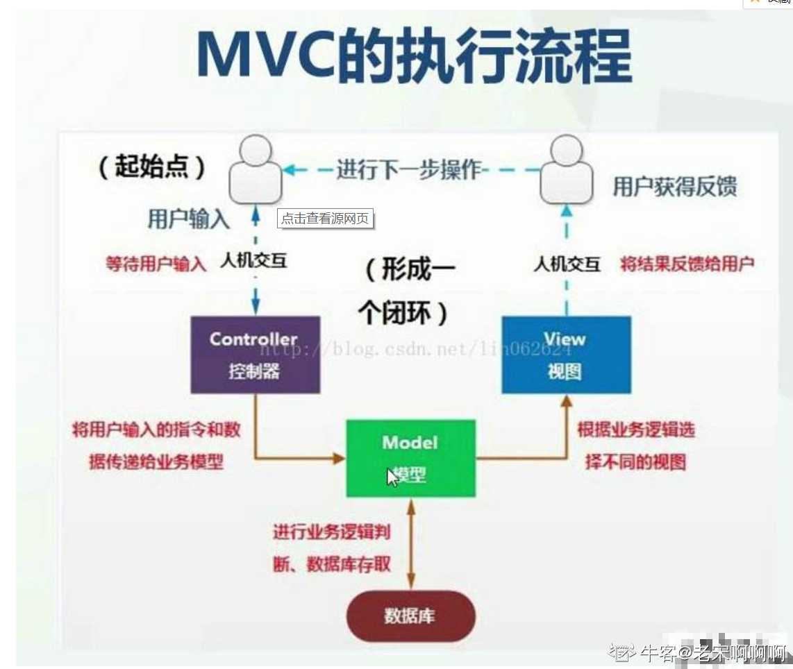
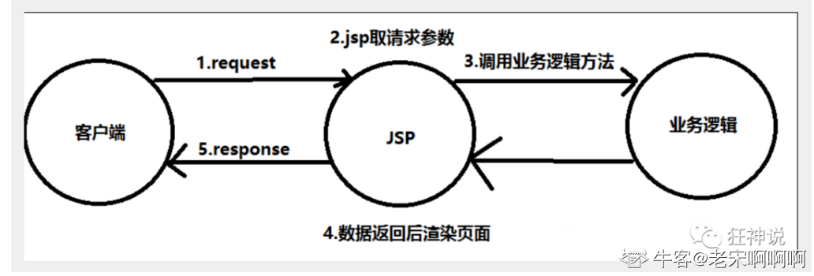
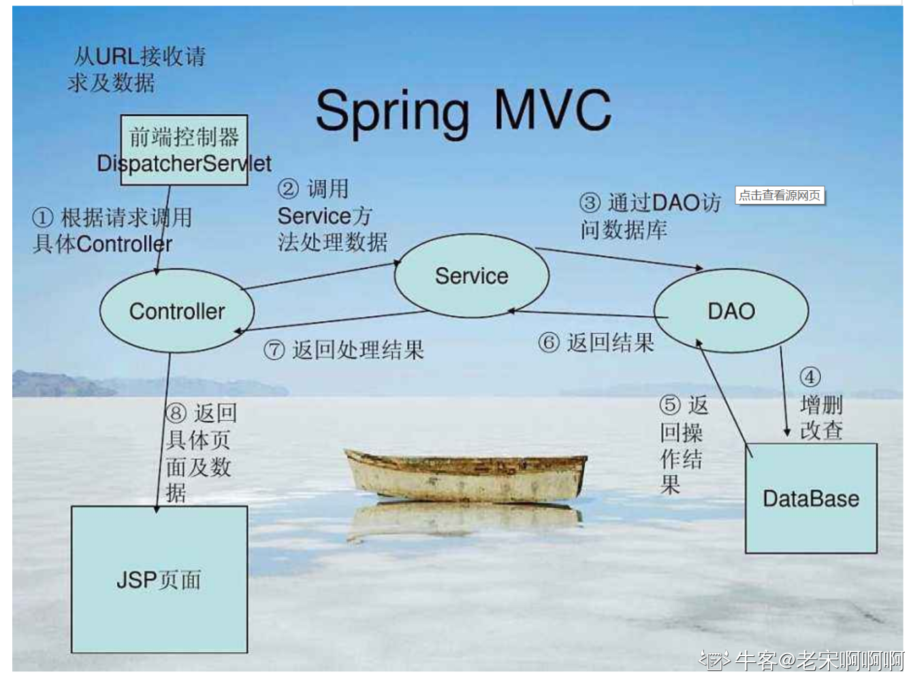
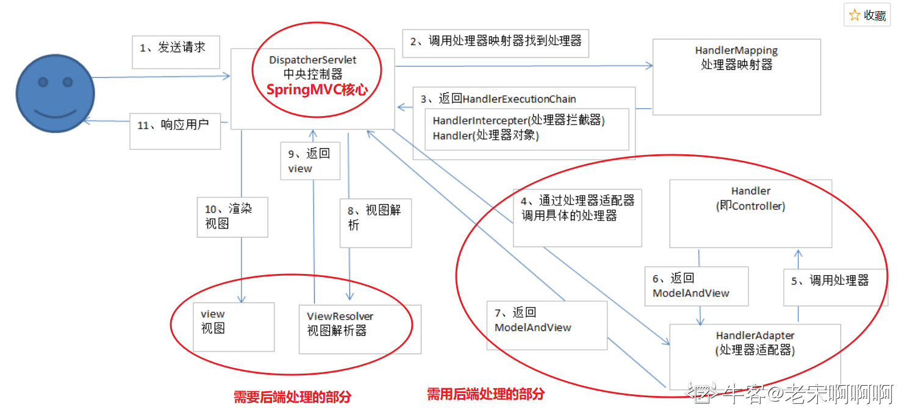

# Spring MVC

>   https://blog.nowcoder.net/n/e240960d8f164ba6a98371ed008b5f35

## MVC

-   MVC是模型(Model)、视图(View)、控制器(Controller)的简写，是一种软件设计规范。
-   是将业务逻辑、数据、显示分离的方法来组织代码。
-   MVC主要作用是**降低了视图与业务逻辑间的双向偶合**。
-   MVC不是一种设计模式，**MVC是一种架构模式**。当然不同的MVC存在差异。

**Model（模型）：**数据模型，提供要展示的数据，因此包含数据和行为，可以认为是领域模型或JavaBean组件（包含数据和行为），不过现在一般都分离开来：Value Object（数据Dao） 和 服务层（行为Service）。也就是模型提供了模型数据查询和模型数据的状态更新等功能，包括数据和业务。

**View（视图）：**负责进行模型的展示，一般就是我们见到的用户界面，客户想看到的东西。

**Controller（控制器）：**接收用户请求，委托给模型进行处理（状态改变），处理完毕后把返回的模型数据返回给视图，由视图负责展示。也就是说控制器做了个调度员的工作。

**最典型的MVC就是JSP + servlet + javabean的模式。**

**Model1时代**

-   分为：视图层V和模型层M；由视图层的view来控制分发数据并展示给用户
-   缺点：JSP职责不单一，过重，不便于维护
    

**Model2时代（MVC延续至今）**

-   流程：分为了Contrller,Model,View
-   访问流程：


1.  用户发请求
2.  Servlet接收请求数据，并调用对应的业务逻辑方法
3.  业务处理完毕，返回更新后的数据给servlet
4.  servlet转向到JSP，由JSP来渲染页面
5.  响应给前端更新后的页面



**Controller：控制器**

1.  取得表单数据
2.  调用业务逻辑
3.  转向指定的页面

**Model：模型**

1.  业务逻辑
2.  保存数据的状态

**View：视图**

1.  显示页面

Model2这样不仅提高的代码的复用率与项目的扩展性，且大大降低了项目的维护成本。Model 1模式的实现比较简单，适用于快速开发小规模项目，Model1中JSP页面身兼View和Controller两种角色，将控制逻辑和表现逻辑混杂在一起，从而导致代码的重用性非常低，增加了应用的扩展性和维护的难度。Model2消除了Model1的缺点。

**MVC框架要做哪些事情**

1.  将url映射到java类或java类的方法 .
2.  封装用户提交的数据 .
3.  处理请求--调用相关的业务处理--封装响应数据 .
4.  将响应的数据进行渲染 . jsp / html 等表示层数据 .

## Spring MVC

Spring MVC是Spring Framework的一部分，是基于Java实现MVC的轻量级Web框架。

Spring MVC的特点：

1.  轻量级，简单易学
2.  高效 , 基于请求响应的MVC框架
3.  与Spring兼容性好，无缝结合
4.  约定优于配置
5.  功能强大：RESTful、数据验证、格式化、本地化、主题等
6.  简洁灵活

Spring的web框架围绕**DispatcherServlet** [ 调度Servlet ] 设计。

DispatcherServlet的作用是将请求分发到不同的处理器。从Spring 2.5开始，使用Java 5或者以上版本的用户可以采用基于注解形式进行开发，十分简洁.

### 中心控制器

Spring的web框架围绕DispatcherServlet设计。DispatcherServlet的作用是将请求分发到不同的处理器。从Spring 2.5开始，使用Java 5或者以上版本的用户可以采用基于注解的controller声明方式。

Spring MVC框架像许多其他MVC框架一样, **以请求为驱动** , **围绕一个中心Servlet分派请求及提供其他功能**，**DispatcherServlet是一个实际的Servlet (它继承自HttpServlet 基类)**。


### 执行原理



**SpringMVC底层工作原理：**

1.  DispatcherServlet表示前置控制器，是整个SpringMVC的控制中心。用户发出请求，DispatcherServlet接收请求并拦截请求。
    -   假设url为 : http://localhost:8080/SpringMVC/hello
    -   服务器域名：[http://localhost:8080](http://localhost:8080/)
    -   web站点：/SpringMVC
    -   hello表示控制器：/hello
    -   **通过分析，如上url表示为：请求位于服务器localhost:8080上的SpringMVC站点的hello控制器。**
2.  HandlerMapping为处理器映射。DispatcherServlet调用HandlerMapping,HandlerMapping根据请求url查找Handler。
3.  HandlerExecution表示具体的Handler,其主要作用是根据url查找控制器，如上url被查找控制器为：hello。
4.  HandlerExecution将解析后的信息传递给DispatcherServlet,如解析控制器映射等。
5.  HandlerAdapter表示处理器适配器，其按照特定的规则去执行Handler。
6.  Handler让具体的Controller执行。
7.  Controller将具体的执行信息返回给HandlerAdapter,如ModelAndView。
8.  HandlerAdapter将视图逻辑名或模型传递给DispatcherServlet。
9.  DispatcherServlet调用视图解析器(ViewResolver)来解析HandlerAdapter传递的逻辑视图名。
10.  视图解析器将解析的逻辑视图名传给DispatcherServlet。
11.  DispatcherServlet根据视图解析器解析的视图结果，调用具体的视图。
12.  最终视图呈现给用户。

## Hello SpringMVC

1.  配置web.xml  ， 注册DispatcherServlet

     ```xml
    <?xml version="1.0" encoding="UTF-8"?>
    <web-app xmlns="http://xmlns.jcp.org/xml/ns/javaee"
             xmlns:xsi="http://www.w3.org/2001/XMLSchema-instance"
             xsi:schemaLocation="http://xmlns.jcp.org/xml/ns/javaee http://xmlns.jcp.org/xml/ns/javaee/web-app_4_0.xsd"
             version="4.0">
    
        <!--1.注册DispatcherServlet-->
        <servlet>
            <servlet-name>springmvc</servlet-name>
            <servlet-class>org.springframework.web.servlet.DispatcherServlet</servlet-class>
            <!--关联一个springmvc的配置文件:【servlet-name】-servlet.xml-->
            <init-param>
                <param-name>contextConfigLocation</param-name>
                <param-value>classpath:springmvc-servlet.xml</param-value>
            </init-param>
            <!--启动级别-1-->
            <load-on-startup>1</load-on-startup>
        </servlet>
    
        <!--/ 匹配所有的请求；（不包括.jsp）-->
        <!--/* 匹配所有的请求；（包括.jsp）-->
        <servlet-mapping>
            <servlet-name>springmvc</servlet-name>
            <url-pattern>/</url-pattern>
        </servlet-mapping>
    
    </web-app>
     ```

2.  编写SpringMVC 的 配置文件:springmvc-servlet.xml 

    ```xml
    <?xml version="1.0" encoding="UTF-8"?>
    <beans xmlns="http://www.springframework.org/schema/beans"
           xmlns:xsi="http://www.w3.org/2001/XMLSchema-instance"
           xsi:schemaLocation="http://www.springframework.org/schema/beans
           http://www.springframework.org/schema/beans/spring-beans.xsd">
    
        <bean class="org.springframework.web.servlet.handler.BeanNameUrlHandlerMapping"/>
        <bean class="org.springframework.web.servlet.mvc.SimpleControllerHandlerAdapter"/>
        <!--视图解析器:DispatcherServlet给他的ModelAndView-->
        <bean class="org.springframework.web.servlet.view.InternalResourceViewResolver" id="InternalResourceViewResolver">
            <!--前缀-->
            <property name="prefix" value="/WEB-INF/jsp/"/>
            <!--后缀-->
            <property name="suffix" value=".jsp"/>
        </bean>
        
        
        <!--Handler-->
        <bean id="/hello" class="com.controller.HelloController"/>
        
    </beans>
    ```

3.  编写我们要操作业务Controller ，要么实现Controller接口，要么增加注解；需要返回一个ModelAndView，装数据，封视图；

    ```java
    import org.springframework.web.servlet.ModelAndView;
    import org.springframework.web.servlet.mvc.Controller;
    import javax.servlet.http.HttpServletRequest;
    import javax.servlet.http.HttpServletResponse;
    
    //注意：这里我们先导入Controller接口
    public class HelloController implements Controller {
    
        public ModelAndView handleRequest(HttpServletRequest request, HttpServletResponse response) throws Exception {
            //ModelAndView 模型和视图
            ModelAndView mv = new ModelAndView();
    
            //封装对象，放在ModelAndView中。Model
            mv.addObject("msg", "HelloSpringMVC!");
            //封装要跳转的视图，放在ModelAndView中
            mv.setViewName("hello"); //: /WEB-INF/jsp/hello.jsp
            return mv;
        }
    }
    ```

## 使用注解开发

1.  配置web.xml

    ```xml
    <?xml version="1.0" encoding="UTF-8"?>
    <web-app xmlns="http://xmlns.jcp.org/xml/ns/javaee"
             xmlns:xsi="http://www.w3.org/2001/XMLSchema-instance"
             xsi:schemaLocation="http://xmlns.jcp.org/xml/ns/javaee http://xmlns.jcp.org/xml/ns/javaee/web-app_4_0.xsd"
             version="4.0">
        <servlet>
            <servlet-name>SpringMVC</servlet-name>
            <servlet-class>org.springframework.web.servlet.DispatcherServlet</servlet-class>
            <init-param>
                <param-name>contextConfigLocation</param-name>
                <param-value>classpath:springmvc-servlet.xml</param-value>
            </init-param>
        </servlet>
        <servlet-mapping>
            <servlet-name>SpringMVC</servlet-name>
            <url-pattern>/</url-pattern>
        </servlet-mapping>
    </web-app>
    ```

2.  添加SpringMVC配置文件

    ```xml
    <?xml version="1.0" encoding="UTF-8"?>
    <beans xmlns="http://www.springframework.org/schema/beans"
           xmlns:xsi="http://www.w3.org/2001/XMLSchema-instance"
           xmlns:context="http://www.springframework.org/schema/context"
           xmlns:mvc="http://www.springframework.org/schema/mvc"
           xsi:schemaLocation="http://www.springframework.org/schema/beans
           http://www.springframework.org/schema/beans/spring-beans.xsd
           http://www.springframework.org/schema/context
           https://www.springframework.org/schema/context/spring-context.xsd
           http://www.springframework.org/schema/mvc
           https://www.springframework.org/schema/mvc/spring-mvc.xsd">
    
        <!-- 自动扫描包，让指定包下的注解生效,由IOC容器统一管理 -->
        <context:component-scan base-package="com.controller"/>
        <!-- 让Spring MVC不处理静态资源 -->
        <mvc:default-servlet-handler />
        <!--
        支持mvc注解驱动
            在spring中一般采用@RequestMapping注解来完成映射关系
            要想使@RequestMapping注解生效
            必须向上下文中注册DefaultAnnotationHandlerMapping
            和一个AnnotationMethodHandlerAdapter实例
            这两个实例分别在类级别和方法级别处理。
            而annotation-driven配置帮助我们自动完成上述两个实例的注入。
         -->
        <mvc:annotation-driven />
    
        <!-- 视图解析器 -->
        <bean class="org.springframework.web.servlet.view.InternalResourceViewResolver"
              id="internalResourceViewResolver">
            <!-- 前缀 -->
            <property name="prefix" value="/WEB-INF/jsp/" />
            <!-- 后缀 -->
            <property name="suffix" value=".jsp" />
        </bean>
    
    </beans>
    ```

3.  创建Controller

    ```java
    import org.springframework.stereotype.Controller;
    import org.springframework.ui.Model;
    import org.springframework.web.bind.annotation.RequestMapping;
    
    @Controller
    @RequestMapping("/hello")
    public class HelloController {
        @RequestMapping("/h1")
        public String hello(Model model){
            model.addAttribute("msg","hello, SpringMVC");//封装数据
            return "hello";//会被视图解析器处理
        }
    
    }
    ```

## RestFul和控制器

### Controller

-   控制器复杂提供访问应用程序的行为，通常通过接口定义或注解定义两种方法实现。

-   控制器负责解析用户的请求并将其转换为一个模型。

-   在Spring MVC中一个控制器类可以包含多个方法

-   在Spring MVC中，对于Controller的配置方式有很多种

    1.  实现Controller接口

        -   实现接口Controller定义控制器是较老的办法
        -   缺点是：一个控制器中只有一个方法，如果要多个方法则需要定义多个Controller；定义的方式比较麻烦。

    2.  使用注解@Controller

        -   @Controller注解类型用于声明Spring类的实例是一个控制器（在讲IOC时还提到了另外3个注解）；

        -   Spring可以使用扫描机制来找到应用程序中所有基于注解的控制器类，为了保证Spring能找到你的控制器，需要在配置文件中声明组件扫描；

        -   **可以发现，我们的两个请求都可以指向一个视图，但是页面结果的结果是不一样的，从这里可以看出视图是被复用的，而控制器与视图之间是弱偶合关系。注解方式是平时使用的最多的方式。**

        -   @RequestMapping注解用于映射url到控制器类或一个特定的处理程序方法。可用于类或方法上。用于类上，表示类中的所有响应请求的方法都是以该地址作为父路径。

        -   为了测试结论更加准确，我们可以加上一个项目名测试 myweb

        -   只注解在方法上面

            ```java
            @Controller
            public class TestController {
               @RequestMapping("/h1")
               public String test(){
                   return "test";
              }
            }
            ```

            访问路径：/项目名/ h1

        -   同时注解类与方法

            ```java
            @Controller
            @RequestMapping("/admin")
            public class TestController {
               @RequestMapping("/h1")
               public String test(){
                   return "test";
              }
            }
            ```

            访问路径：/项目名/admin/h1  , 需要先指定类的路径再指定方法的路径

### RestFul风格

-   概念

    Restful就是一个资源定位及资源操作的风格。不是标准也不是协议，只是一种风格。基于这个风格设计的软件可以更简洁，更有层次，更易于实现缓存等机制。

-   功能

    资源：互联网所有的事物都可以被抽象为资源

    资源操作：使用POST、DELETE、PUT、GET，使用不同方法对资源进行操作。

    分别对应 添加、 删除、修改、查询。

    **使用RESTful操作资源** ：可以通过不同的请求方式来实现不同的效果！如下：请求地址一样，但是功能可以不同！

    ​	http://127.0.0.1/item/1 查询,GET

    ​	http://127.0.0.1/item 新增,POST

    ​	http://127.0.0.1/item 更新,PUT

    ​	http://127.0.0.1/item/1 删除,DELETE

-   使用

    1.  可以使用  @PathVariable 注解，让方法参数的值对应绑定到一个URI模板变量上

    ```java
     @RequestMapping("/commit/{p1}/{p2}")
       public String index(@PathVariable int p1, @PathVariable int p2, Model model){
           int result = p1+p2;
           //Spring MVC会自动实例化一个Model对象用于向视图中传值
           model.addAttribute("msg", "结果："+result);
           //返回视图位置
           return "test";
      }
    ```

    2.  指定请求类型

    -   增加method

    ```java
    @RequestMapping(value = "/hello",method = {RequestMethod.POST})
    public String index2(Model model){
       model.addAttribute("msg", "hello!");
       return "test";
    }
    ```

    -   注解变体

    ```
    @GetMapping
    @PostMapping
    @PutMapping
    @DeleteMapping
    @PatchMapping
    ```

    ```java
    @PostMapping("/add2/{a}/{b}")
        public String test2(@PathVariable int a, @PathVariable int b, Model model){
            int res=a+b;
            model.addAttribute("msg",res+"---1");
            return "test";
        }
        @GetMapping("/add2/{a}/{b}")
        public String test3(@PathVariable int a, @PathVariable int b, Model model){
            int res=a+b;
            model.addAttribute("msg",res+"---2");
            return "test";
        }
    ```

## 跳转

### ModelAndView

设置ModelAndView对象 , 根据view的名称 , 和视图解析器跳到指定的页面 

页面 : {视图解析器前缀} + viewName +{视图解析器后缀}

```xml
<!-- 视图解析器 -->
<bean class="org.springframework.web.servlet.view.InternalResourceViewResolver"
     id="internalResourceViewResolver">
   <!-- 前缀 -->
   <property name="prefix" value="/WEB-INF/jsp/" />
   <!-- 后缀 -->
   <property name="suffix" value=".jsp" />
</bean>
```

对应的controller类

```java
public class ControllerTest1 implements Controller {

   public ModelAndView handleRequest(HttpServletRequest httpServletRequest, HttpServletResponse httpServletResponse) throws Exception {
       //返回一个模型视图对象
       ModelAndView mv = new ModelAndView();
       mv.addObject("msg","ControllerTest1");
       mv.setViewName("test");
       return mv;
  }
}
```

### ServletAPI

通过设置ServletAPI , 不需要视图解析器 .

1.  通过HttpServletResponse进行输出
2.  通过HttpServletResponse实现重定向
3.  通过HttpServletResponse实现转发

```java
@Controller
public class ResultGo {

   @RequestMapping("/result/t1")
   public void test1(HttpServletRequest req, HttpServletResponse rsp) throws IOException {
       rsp.getWriter().println("Hello,Spring BY servlet API");
  }

   @RequestMapping("/result/t2")
   public void test2(HttpServletRequest req, HttpServletResponse rsp) throws IOException {
       rsp.sendRedirect("/index.jsp");
  }

   @RequestMapping("/result/t3")
   public void test3(HttpServletRequest req, HttpServletResponse rsp) throws Exception {
       //转发
       req.setAttribute("msg","/result/t3");
       req.getRequestDispatcher("/WEB-INF/jsp/test.jsp").forward(req,rsp);
  }

}
```

### SpringMVC

无需视图解析器实现转发与重定向：

```java
@Controller
public class ModelTest1 {
    @RequestMapping("/tt1")
    public String test1(Model model){
        return "forward:/index.jsp";
    }
    @RequestMapping("/tt2")
    public String test2(Model model){
        return "redirect:/index.jsp";
    }
}
```

有视图解析器：默认转发，可使用redirect实现重定向

```java
@Controller
public class ModelTest1 {
    @RequestMapping("/tt1")
    public String test1(Model model){
        return "index";
    }
    @RequestMapping("/tt2")
    public String test2(Model model){
        return "redirect:/index.jsp";
    }
}
```

## 数据处理

### 处理提交数据

1.  提交的域名称和处理方法的参数名一致

提交数据 : http://localhost:8080/hello?name=abc

处理方法 :

```java
@RequestMapping("/hello")
public String hello(String name){
   System.out.println(name);
   return "hello";
}
```

后台输出 : abc

2.  提交的域名称和处理方法的参数名不一致

提交数据 : http://localhost:8080/hello?username=abc

处理方法 :

```java
//@RequestParam("username") : username提交的域的名称 .
@RequestMapping("/hello")
public String hello(@RequestParam("username") String name){
   System.out.println(name);
   return "hello";
}
```

后台输出 : abc

3.  提交的是一个对象

要求提交的表单域和对象的属性名一致  , 参数使用对象即可

1、实体类

```java
public class User {
   private int id;
   private String name;
   private int age;
   //构造
   //get/set
   //tostring()
}
```

2、提交数据 : http://localhost:8080/mvc04/user?name=abc&id=1&age=15

3、处理方法 :

```java
@RequestMapping("/user")
public String user(User user){
   System.out.println(user);
   return "hello";
}
```

后台输出 : User { id=1, name='abc', age=15 }

说明：如果使用对象的话，前端传递的参数名和对象名必须一致，否则就是null。

### 数据显示到前端

**第一种 : 通过ModelAndView**

```java
public class ControllerTest1 implements Controller {

   public ModelAndView handleRequest(HttpServletRequest httpServletRequest, HttpServletResponse httpServletResponse) throws Exception {
       //返回一个模型视图对象
       ModelAndView mv = new ModelAndView();
       mv.addObject("msg","ControllerTest1");
       mv.setViewName("test");
       return mv;
  }
}
```

**第二种 : 通过ModelMap**

```java
@RequestMapping("/hello")
public String hello(@RequestParam("username") String name, ModelMap model){
   //封装要显示到视图中的数据
   //相当于req.setAttribute("name",name);
   model.addAttribute("name",name);
   System.out.println(name);
   return "hello";
}
```

**第三种 : 通过Model**

```java
@RequestMapping("/ct2/hello")
public String hello(@RequestParam("username") String name, Model model){
   //封装要显示到视图中的数据
   //相当于req.setAttribute("name",name);
   model.addAttribute("msg",name);
   System.out.println(name);
   return "test";
}
```

>Model 只有寥寥几个方法只适合用于储存数据，简化了新手对于Model对象的操作和理解；
>
>ModelMap 继承了 LinkedMap ，除了实现了自身的一些方法，同样的继承 LinkedMap 的方法和特性；
>
>ModelAndView 可以在储存数据的同时，可以进行设置返回的逻辑视图，进行控制展示层的跳转。

## 乱码问题

### Spring过滤器

```xml
<filter>
   <filter-name>encoding</filter-name>
   <filter-class>org.springframework.web.filter.CharacterEncodingFilter</filter-class>
   <init-param>
       <param-name>encoding</param-name>
       <param-value>utf-8</param-value>
   </init-param>
</filter>
<filter-mapping>
   <filter-name>encoding</filter-name>
   <url-pattern>/*</url-pattern>
</filter-mapping>
```

有些极端情况下，这个过滤器对get的支持不好 .

处理方法 :

-   修改tomcat配置文件 ：设置编码！

```xml
<Connector URIEncoding="utf-8" port="8080" protocol="HTTP/1.1"
          connectionTimeout="20000"
          redirectPort="8443" />
```

### 自定义过滤器

-   自定义过滤器

```java
import javax.servlet.*;
import javax.servlet.http.HttpServletRequest;
import javax.servlet.http.HttpServletRequestWrapper;
import javax.servlet.http.HttpServletResponse;
import java.io.IOException;
import java.io.UnsupportedEncodingException;
import java.util.Map;

/**
* 解决get和post请求 全部乱码的过滤器
*/
public class GenericEncodingFilter implements Filter {

   @Override
   public void destroy() {
  }

   @Override
   public void doFilter(ServletRequest request, ServletResponse response, FilterChain chain) throws IOException, ServletException {
       //处理response的字符编码
       HttpServletResponse myResponse=(HttpServletResponse) response;
       myResponse.setContentType("text/html;charset=UTF-8");

       // 转型为与协议相关对象
       HttpServletRequest httpServletRequest = (HttpServletRequest) request;
       // 对request包装增强
       HttpServletRequest myrequest = new MyRequest(httpServletRequest);
       chain.doFilter(myrequest, response);
  }

   @Override
   public void init(FilterConfig filterConfig) throws ServletException {
  }

}

//自定义request对象，HttpServletRequest的包装类
class MyRequest extends HttpServletRequestWrapper {

   private HttpServletRequest request;
   //是否编码的标记
   private boolean hasEncode;
   //定义一个可以传入HttpServletRequest对象的构造函数，以便对其进行装饰
   public MyRequest(HttpServletRequest request) {
       super(request);// super必须写
       this.request = request;
  }

   // 对需要增强方法 进行覆盖
   @Override
   public Map getParameterMap() {
       // 先获得请求方式
       String method = request.getMethod();
       if (method.equalsIgnoreCase("post")) {
           // post请求
           try {
               // 处理post乱码
               request.setCharacterEncoding("utf-8");
               return request.getParameterMap();
          } catch (UnsupportedEncodingException e) {
               e.printStackTrace();
          }
      } else if (method.equalsIgnoreCase("get")) {
           // get请求
           Map<String, String[]> parameterMap = request.getParameterMap();
           if (!hasEncode) { // 确保get手动编码逻辑只运行一次
               for (String parameterName : parameterMap.keySet()) {
                   String[] values = parameterMap.get(parameterName);
                   if (values != null) {
                       for (int i = 0; i < values.length; i++) {
                           try {
                               // 处理get乱码
                               values[i] = new String(values[i]
                                      .getBytes("ISO-8859-1"), "utf-8");
                          } catch (UnsupportedEncodingException e) {
                               e.printStackTrace();
                          }
                      }
                  }
              }
               hasEncode = true;
          }
           return parameterMap;
      }
       return super.getParameterMap();
  }

   //取一个值
   @Override
   public String getParameter(String name) {
       Map<String, String[]> parameterMap = getParameterMap();
       String[] values = parameterMap.get(name);
       if (values == null) {
           return null;
      }
       return values[0]; // 取回参数的第一个值
  }

   //取所有值
   @Override
   public String[] getParameterValues(String name) {
       Map<String, String[]> parameterMap = getParameterMap();
       String[] values = parameterMap.get(name);
       return values;
  }
}
```

## JSON

-   JSON(JavaScript Object Notation, JS 对象标记) 是一种轻量级的数据交换格式，目前使用特别广泛。
-   采用完全独立于编程语言的**文本格式**来存储和表示数据。
-   简洁和清晰的层次结构使得 JSON 成为理想的数据交换语言。
-   易于人阅读和编写，同时也易于机器解析和生成，并有效地提升网络传输效率。

```js
var obj = {a: 'Hello', b: 'World'}; //这是一个对象，注意键名也是可以使用引号包裹的
var json = '{"a": "Hello", "b": "World"}'; //这是一个 JSON 字符串，本质是一个字符串
```

### JSON 和 JavaScript 对象互转

要实现从JSON字符串转换为JavaScript 对象，使用 JSON.parse() 方法：

```js
var obj = JSON.parse('{"a": "Hello", "b": "World"}');
//结果是 {a: 'Hello', b: 'World'}
```

要实现从JavaScript 对象转换为JSON字符串，使用 JSON.stringify() 方法：

```js
var json = JSON.stringify({a: 'Hello', b: 'World'});
//结果是 '{"a": "Hello", "b": "World"}'
```

### Controller返回JSON数据

-   Jackson工具包

使用Jackson，使用它需要导入它的jar包

```xml
<dependency>
            <groupId>com.fasterxml.jackson.core</groupId>
            <artifactId>jackson-databind</artifactId>
            <version>2.10.0</version>
</dependency>
```

编写Controller代码：

```java
@Controller
public class UserController {
    @RequestMapping("/j1")
    @ResponseBody//不会走视图解析器，直接返回字符串
    public String json1() throws JsonProcessingException {
        //jackson
        ObjectMapper mapper = new ObjectMapper();
        User user = new User("测试",10,"M");
        String str = mapper.writeValueAsString(user);
        return str;
    }
}
```

发现出现了乱码问题，我们需要设置一下他的编码格式为utf-8，以及它返回的类型；

通过@RequestMaping的produces属性来实现，修改下代码

```java
//produces:指定响应体返回类型和编码
@RequestMapping(value = "/json1",produces = "application/json;charset=utf-8")
```

乱码统一解决，修改SpringMVC配置文件：

```xml
<mvc:annotation-driven>
   <mvc:message-converters register-defaults="true">
       <bean class="org.springframework.http.converter.StringHttpMessageConverter">
           <constructor-arg value="UTF-8"/>
       </bean>
       <bean class="org.springframework.http.converter.json.MappingJackson2HttpMessageConverter">
           <property name="objectMapper">
               <bean class="org.springframework.http.converter.json.Jackson2ObjectMapperFactoryBean">
                   <property name="failOnEmptyBeans" value="false"/>
               </bean>
           </property>
       </bean>
   </mvc:message-converters>
</mvc:annotation-driven>
```

返回json字符串统一解决：在类上直接使用 @RestController，这样子，里面所有的方法都只会返回 json 字符串了，不用再每一个都添加@ResponseBody 

```java
@RestController
public class UserController {
    @RequestMapping("/j1")
    public String json1() throws JsonProcessingException {
        //jackson
        ObjectMapper mapper = new ObjectMapper();
        User user = new User("测试",10,"M");
        String str = mapper.writeValueAsString(user);
        return str;
    }
}
```

工具类：

```java
public class JSONUtils {
    public static String getJson(Object object, String dateformat){
        ObjectMapper mapper = new ObjectMapper();
        mapper.configure(SerializationFeature.WRITE_DATES_AS_TIMESTAMPS, false);
        SimpleDateFormat sdf = new SimpleDateFormat(dateformat);
        mapper.setDateFormat(sdf);
        try {
            return mapper.writeValueAsString(object);
        } catch (JsonProcessingException e) {
            return null;
        }
    }
    public static String getJson(Object object){
        return getJson(object,"yyyy-MM-dd HH:mm:ss");
    }
}

```

-   fastjson工具包

使用fastjson，使用它需要导入它的jar包

```xml
<dependency>
            <groupId>com.alibaba</groupId>
            <artifactId>fastjson</artifactId>
            <version>1.2.62</version>
</dependency>
```

fastjson 三个主要的类：

**JSONObject  代表 json 对象** 

-   JSONObject实现了Map接口, 猜想 JSONObject底层操作是由Map实现的。
-   JSONObject对应json对象，通过各种形式的get()方法可以获取json对象中的数据，也可利用诸如size()，isEmpty()等方法获取"键：值"对的个数和判断是否为空。其本质是通过实现Map接口并调用接口中的方法完成的。

**JSONArray  代表 json 对象数组**

-   内部是有List接口中的方法来完成操作的。

**JSON代表 JSONObject和JSONArray的转化**

-   JSON类源码分析与使用
-   仔细观察这些方法，主要是实现json对象，json对象数组，javabean对象，json字符串之间的相互转化。

```java
@RequestMapping("/j6")
    public String json6(){
        List<User> list = new ArrayList<>();
        list.add(new User("测试",10,"M"));
        list.add(new User("测试",11,"M"));
        list.add(new User("测试",12,"M"));
        String s = JSON.toJSONString(list);
        return s;
    }
```

## SSM整合

>   http://mp.weixin.qq.com/s?__biz=Mzg2NTAzMTExNg==&mid=2247484004&idx=1&sn=cef9d881d0a8d7db7e8ddc6a380a9a76&scene=19#wechat_redirect

-   MyBatis层
-   Spring层
-   SpringMVC层

