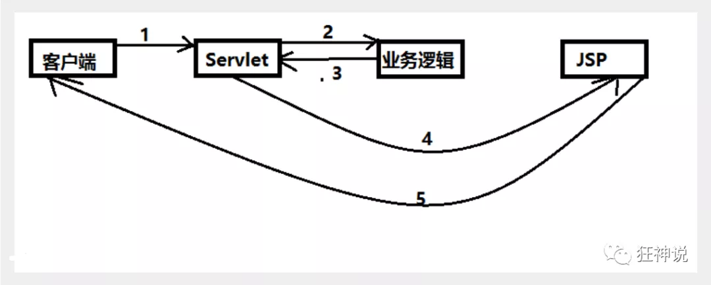

# Spring MVC

>   https://blog.nowcoder.net/n/e240960d8f164ba6a98371ed008b5f35

## MVC

-   MVC是模型(Model)、视图(View)、控制器(Controller)的简写，是一种软件设计规范。
-   是将业务逻辑、数据、显示分离的方法来组织代码。
-   MVC主要作用是**降低了视图与业务逻辑间的双向偶合**。
-   MVC不是一种设计模式，**MVC是一种架构模式**。当然不同的MVC存在差异。

**Model（模型）：**数据模型，提供要展示的数据，因此包含数据和行为，可以认为是领域模型或JavaBean组件（包含数据和行为），不过现在一般都分离开来：Value Object（数据Dao） 和 服务层（行为Service）。也就是模型提供了模型数据查询和模型数据的状态更新等功能，包括数据和业务。

**View（视图）：**负责进行模型的展示，一般就是我们见到的用户界面，客户想看到的东西。

**Controller（控制器）：**接收用户请求，委托给模型进行处理（状态改变），处理完毕后把返回的模型数据返回给视图，由视图负责展示。也就是说控制器做了个调度员的工作。

**最典型的MVC就是JSP + servlet + javabean的模式。**

**Model1时代**

-   分为：视图层V和模型层M；由视图层的view来控制分发数据并展示给用户
-   缺点：JSP职责不单一，过重，不便于维护
    

**Model2时代（MVC延续至今）**

-   流程：分为了Contrller,Model,View
-   访问流程：

1.  用户发请求
2.  Servlet接收请求数据，并调用对应的业务逻辑方法
3.  业务处理完毕，返回更新后的数据给servlet
4.  servlet转向到JSP，由JSP来渲染页面
5.  响应给前端更新后的页面

**Controller：控制器**

1.  取得表单数据
2.  调用业务逻辑
3.  转向指定的页面

**Model：模型**

1.  业务逻辑
2.  保存数据的状态

**View：视图**

1.  显示页面

Model2这样不仅提高的代码的复用率与项目的扩展性，且大大降低了项目的维护成本。Model 1模式的实现比较简单，适用于快速开发小规模项目，Model1中JSP页面身兼View和Controller两种角色，将控制逻辑和表现逻辑混杂在一起，从而导致代码的重用性非常低，增加了应用的扩展性和维护的难度。Model2消除了Model1的缺点。

**MVC框架要做哪些事情**

1.  将url映射到java类或java类的方法 .
2.  封装用户提交的数据 .
3.  处理请求--调用相关的业务处理--封装响应数据 .
4.  将响应的数据进行渲染 . jsp / html 等表示层数据 .

## Spring MVC

Spring MVC是Spring Framework的一部分，是基于Java实现MVC的轻量级Web框架。

Spring MVC的特点：

1.  轻量级，简单易学
2.  高效 , 基于请求响应的MVC框架
3.  与Spring兼容性好，无缝结合
4.  约定优于配置
5.  功能强大：RESTful、数据验证、格式化、本地化、主题等
6.  简洁灵活

Spring的web框架围绕**DispatcherServlet** [ 调度Servlet ] 设计。

DispatcherServlet的作用是将请求分发到不同的处理器。从Spring 2.5开始，使用Java 5或者以上版本的用户可以采用基于注解形式进行开发，十分简洁.

### 中心控制器

Spring的web框架围绕DispatcherServlet设计。DispatcherServlet的作用是将请求分发到不同的处理器。从Spring 2.5开始，使用Java 5或者以上版本的用户可以采用基于注解的controller声明方式。

Spring MVC框架像许多其他MVC框架一样, **以请求为驱动** , **围绕一个中心Servlet分派请求及提供其他功能**，**DispatcherServlet是一个实际的Servlet (它继承自HttpServlet 基类)**。

### 执行原理

**SpringMVC底层工作原理：**

1.  DispatcherServlet表示前置控制器，是整个SpringMVC的控制中心。用户发出请求，DispatcherServlet接收请求并拦截请求。
    -   假设url为 : http://localhost:8080/SpringMVC/hello
    -   服务器域名：[http://localhost:8080](http://localhost:8080/)
    -   web站点：/SpringMVC
    -   hello表示控制器：/hello
    -   **通过分析，如上url表示为：请求位于服务器localhost:8080上的SpringMVC站点的hello控制器。**
2.  HandlerMapping为处理器映射。DispatcherServlet调用HandlerMapping,HandlerMapping根据请求url查找Handler。
3.  HandlerExecution表示具体的Handler,其主要作用是根据url查找控制器，如上url被查找控制器为：hello。
4.  HandlerExecution将解析后的信息传递给DispatcherServlet,如解析控制器映射等。
5.  HandlerAdapter表示处理器适配器，其按照特定的规则去执行Handler。
6.  Handler让具体的Controller执行。
7.  Controller将具体的执行信息返回给HandlerAdapter,如ModelAndView。
8.  HandlerAdapter将视图逻辑名或模型传递给DispatcherServlet。
9.  DispatcherServlet调用视图解析器(ViewResolver)来解析HandlerAdapter传递的逻辑视图名。
10.  视图解析器将解析的逻辑视图名传给DispatcherServlet。
11.  DispatcherServlet根据视图解析器解析的视图结果，调用具体的视图。
12.  最终视图呈现给用户。