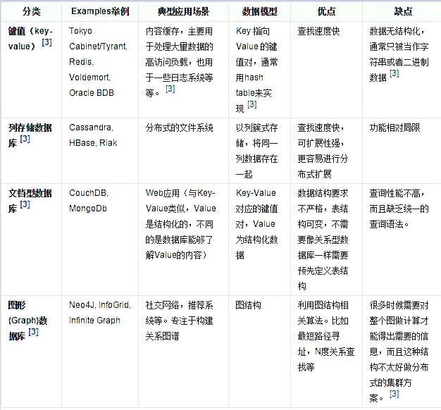

# Redis入门

## Nosql概述

大数据时代，一般的数据库无法进行分析处理了

1.  单机MySQL的时代

    App->DAL->MySQL

    访问量不会太大，单个数据量完全足够，服务器没有太大的压力

    -   数据量如果太大，一台机器放不下
    -   数据的索引如果太大，机器内存也放不下
    -   访问量（读写混合），一个服务器承受不了

2.  缓存（Memcached）+MySQL+垂直拆分

    多个数据库读写分离，使用缓存保证效率（解决读的问题）

    优化数据结构和索引->文件缓存（IO）->Memcached

3.  分库分表+水平拆分

    分库分表来解决写的压力

    MyIsam->Innodb

4.  技术爆炸

    定位、热榜

    MySQL的关系型数据库不够用，数据量大、变化很快。

    存储一些比较大的内容，数据库表很大，效率较低。

    需要使用NoSQL数据库，可以很好地处理这种情况

-   NoSQL：Not Only SQL

    泛指非关系型数据库

    传统的关系型数据库很难对付web2.0时代

    关系型数据库：表格--行、列

    非关系型数据库：键值对来控制，不需要固定的格式

-   NoSQL特点

    1.  方便扩展（数据之间没有关系，很好扩展）
    2.  大数据量高性能
    3.  数据类型是多样型的（不需要事先设计数据库，随取随用）
    4.  传统的RDBMS与NoSQL的区别
        -   RDBMS
            1.  结构化组织
            2.  结构化查询SQL
            3.  数据、关系都存储在单独的表中
            4.  数据操作、数据定义语言
            5.  严格的一致性
            6.  基础的事务操作
        -   NoSQL
            1.  不仅仅是数据
            2.  没有固定的查询语言
            3.  键值对存储、列存储、文档存储、图形数据库
            4.  最终一致性
            5.  CAP定理和BASE理论
            6.  高性能、高可用、高可扩展性

-   大数据时代

    1.  3V
        -   海量Volume
        -   多样Variety
        -   实时Velocity
    2.  3高
        -   高并发
        -   高可扩
        -   高性能

    ## NoSQL四大分类

### KV键值对

-   Redis
-   memcache

### 文档型数据库

bson格式：二进制json

-   MongoDB：基于分布式存储的数据库，主要用于存储大量的文档
-   ConthDB

### 列存储数据库

-   HBase
-   分布式文件系统

### 图关系数据库

-   不是存图形，是存关系的
-   Neo4j
-   InfoGrid

