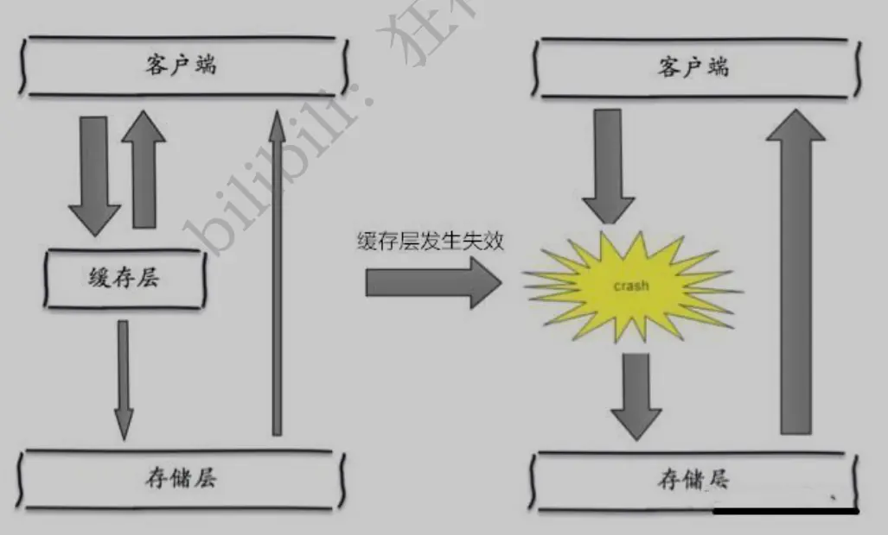

# Redis进阶

## 配置文件

### unit单位

```bash
# Note on units: when memory size is needed, it is possible to specify
# it in the usual form of 1k 5GB 4M and so forth:
#
# 1k => 1000 bytes
# 1kb => 1024 bytes
# 1m => 1000000 bytes
# 1mb => 1024*1024 bytes
# 1g => 1000000000 bytes
# 1gb => 1024*1024*1024 bytes
#
# units are case insensitive so 1GB 1Gb 1gB are all the same.
```

### 包含其它配置文件

```bash
# Include one or more other config files here.  This is useful if you
# have a standard template that goes to all Redis servers but also need
# to customize a few per-server settings.  Include files can include
# other files, so use this wisely.
#
# Notice option "include" won't be rewritten by command "CONFIG REWRITE"
# from admin or Redis Sentinel. Since Redis always uses the last processed
# line as value of a configuration directive, you'd better put includes
# at the beginning of this file to avoid overwriting config change at runtime.
#
# If instead you are interested in using includes to override configuration
# options, it is better to use include as the last line.
#
# include /path/to/local.conf
# include /path/to/other.conf
```

### 网络

-   ip地址

```bash
# By default, if no "bind" configuration directive is specified, Redis listens
# for connections from all the network interfaces available on the server.
# It is possible to listen to just one or multiple selected interfaces using
# the "bind" configuration directive, followed by one or more IP addresses.
#
# Examples:
#
# bind 192.168.1.100 10.0.0.1
# bind 127.0.0.1 ::1
#
# ~~~ WARNING ~~~ If the computer running Redis is directly exposed to the
# internet, binding to all the interfaces is dangerous and will expose the
# instance to everybody on the internet. So by default we uncomment the
# following bind directive, that will force Redis to listen only into
# the IPv4 loopback interface address (this means Redis will be able to
# accept connections only from clients running into the same computer it
# is running).
#
# IF YOU ARE SURE YOU WANT YOUR INSTANCE TO LISTEN TO ALL THE INTERFACES
# JUST COMMENT THE FOLLOWING LINE.
# ~~~~~~~~~~~~~~~~~~~~~~~~~~~~~~~~~~~~~~~~~~~~~~~~~~~~~~~~~~~~~~~~~~~~~~~~
```

-   保护模式

```bash
# Protected mode is a layer of security protection, in order to avoid that
# Redis instances left open on the internet are accessed and exploited.
#
# When protected mode is on and if:
#
# 1) The server is not binding explicitly to a set of addresses using the
#    "bind" directive.
# 2) No password is configured.
#
# The server only accepts connections from clients connecting from the
# IPv4 and IPv6 loopback addresses 127.0.0.1 and ::1, and from Unix domain
# sockets.
#
# By default protected mode is enabled. You should disable it only if
# you are sure you want clients from other hosts to connect to Redis
# even if no authentication is configured, nor a specific set of interfaces
# are explicitly listed using the "bind" directive.
protected-mode yes
```

-   端口

```bash
# Accept connections on the specified port, default is 6379 (IANA #815344).
# If port 0 is specified Redis will not listen on a TCP socket.
port 6379
```

### 通用配置

-   以守护进程方式运行

```bash
# By default Redis does not run as a daemon. Use 'yes' if you need it.
# Note that Redis will write a pid file in /var/run/redis.pid when daemonized.
daemonize yes
```

-   pid进程文件

```bash
# If a pid file is specified, Redis writes it where specified at startup
# and removes it at exit.
#
# When the server runs non daemonized, no pid file is created if none is
# specified in the configuration. When the server is daemonized, the pid file
# is used even if not specified, defaulting to "/var/run/redis.pid".
#
# Creating a pid file is best effort: if Redis is not able to create it
# nothing bad happens, the server will start and run normally.
pidfile /var/run/redis_6379.pid
```

-   日志

```bash
# Specify the server verbosity level.
# This can be one of:
# debug (a lot of information, useful for development/testing)
# verbose (many rarely useful info, but not a mess like the debug level)
# notice (moderately verbose, what you want in production probably)
# warning (only very important / critical messages are logged)
loglevel notice
# Specify the log file name. Also the empty string can be used to force
# Redis to log on the standard output. Note that if you use standard
# output for logging but daemonize, logs will be sent to /dev/null
logfile "/var/log/redis/redis-server.log"
```

-   数据库的数量

```bash
# Set the number of databases. The default database is DB 0, you can select
# a different one on a per-connection basis using SELECT <dbid> where
# dbid is a number between 0 and 'databases'-1
databases 16
```

-   是否显示logo

```bash
# By default Redis shows an ASCII art logo only when started to log to the
# standard output and if the standard output is a TTY. Basically this means
# that normally a logo is displayed only in interactive sessions.
#
# However it is possible to force the pre-4.0 behavior and always show a
# ASCII art logo in startup logs by setting the following option to yes.
always-show-logo yes
```

### 快照

-   持久化规则

```bash
# Save the DB on disk:
#
#   save <seconds> <changes>
#
#   Will save the DB if both the given number of seconds and the given
#   number of write operations against the DB occurred.
#
#   In the example below the behaviour will be to save:
#   after 900 sec (15 min) if at least 1 key changed
#   after 300 sec (5 min) if at least 10 keys changed
#   after 60 sec if at least 10000 keys changed
#
#   Note: you can disable saving completely by commenting out all "save" lines.
#
#   It is also possible to remove all the previously configured save
#   points by adding a save directive with a single empty string argument
#   like in the following example:
#
#   save ""

save 900 1
save 300 10
save 60 10000
```

-   持久化出错是否停止

```bash
# By default Redis will stop accepting writes if RDB snapshots are enabled
# (at least one save point) and the latest background save failed.
# This will make the user aware (in a hard way) that data is not persisting
# on disk properly, otherwise chances are that no one will notice and some
# disaster will happen.
#
# If the background saving process will start working again Redis will
# automatically allow writes again.
#
# However if you have setup your proper monitoring of the Redis server
# and persistence, you may want to disable this feature so that Redis will
# continue to work as usual even if there are problems with disk,
# permissions, and so forth.
stop-writes-on-bgsave-error yes
```

-   是否压缩rdb文件

```bash
# Compress string objects using LZF when dump .rdb databases?
# For default that's set to 'yes' as it's almost always a win.
# If you want to save some CPU in the saving child set it to 'no' but
# the dataset will likely be bigger if you have compressible values or keys.
rdbcompression yes
```

-   是否校验rdb文件

```bash
# Since version 5 of RDB a CRC64 checksum is placed at the end of the file.
# This makes the format more resistant to corruption but there is a performance
# hit to pay (around 10%) when saving and loading RDB files, so you can disable it
# for maximum performances.
#
# RDB files created with checksum disabled have a checksum of zero that will
# tell the loading code to skip the check.
rdbchecksum yes
```

-   rdb文件保存目录

```bash
# The working directory.
#
# The DB will be written inside this directory, with the filename specified
# above using the 'dbfilename' configuration directive.
#
# The Append Only File will also be created inside this directory.
#
# Note that you must specify a directory here, not a file name.
dir /var/lib/redis
```

### 安全

-   设置密码

```bash
# IMPORTANT NOTE: starting with Redis 6 "requirepass" is just a compatiblity
# layer on top of the new ACL system. The option effect will be just setting
# the password for the default user. Clients will still authenticate using
# AUTH <password> as usually, or more explicitly with AUTH default <password>
# if they follow the new protocol: both will work.
#
# requirepass foobared
```

-   客户端也可以直接设置密码：

```bash
config get requirepass #获取密码
config set requirepass "123456" #设置密码
auth 123456 #身份认证
```

### 客户端

-   限制客户端最大连接数

```bash
# Set the max number of connected clients at the same time. By default
# this limit is set to 10000 clients, however if the Redis server is not
# able to configure the process file limit to allow for the specified limit
# the max number of allowed clients is set to the current file limit
# minus 32 (as Redis reserves a few file descriptors for internal uses).
#
# Once the limit is reached Redis will close all the new connections sending
# an error 'max number of clients reached'.
#
# IMPORTANT: When Redis Cluster is used, the max number of connections is also
# shared with the cluster bus: every node in the cluster will use two
# connections, one incoming and another outgoing. It is important to size the
# limit accordingly in case of very large clusters.
#
# maxclients 10000
```

### 内存设置

-   配置最大内存

```bash
# In short... if you have replicas attached it is suggested that you set a lower
# limit for maxmemory so that there is some free RAM on the system for replica
# output buffers (but this is not needed if the policy is 'noeviction').
#
# maxmemory <bytes>
```

-   内存达到上限的处理策略

```bash
# MAXMEMORY POLICY: how Redis will select what to remove when maxmemory
# is reached. You can select one from the following behaviors:
#
# volatile-lru -> Evict using approximated LRU, only keys with an expire set.
# allkeys-lru -> Evict any key using approximated LRU.
# volatile-lfu -> Evict using approximated LFU, only keys with an expire set.
# allkeys-lfu -> Evict any key using approximated LFU.
# volatile-random -> Remove a random key having an expire set.
# allkeys-random -> Remove a random key, any key.
# volatile-ttl -> Remove the key with the nearest expire time (minor TTL)
# noeviction -> Don't evict anything, just return an error on write operations.
#
# LRU means Least Recently Used
# LFU means Least Frequently Used
#
# Both LRU, LFU and volatile-ttl are implemented using approximated
# randomized algorithms.
#
# Note: with any of the above policies, Redis will return an error on write
#       operations, when there are no suitable keys for eviction.
#
#       At the date of writing these commands are: set setnx setex append
#       incr decr rpush lpush rpushx lpushx linsert lset rpoplpush sadd
#       sinter sinterstore sunion sunionstore sdiff sdiffstore zadd zincrby
#       zunionstore zinterstore hset hsetnx hmset hincrby incrby decrby
#       getset mset msetnx exec sort
#
# The default is:
#
# maxmemory-policy noeviction
```

maxmemory-policy 六种方式：

-   volatile-lru：只对设置了过期时间的key进行LRU（默认值） 

-   allkeys-lru ： 删除lru算法的key   

-   volatile-random：随机删除即将过期key   

-   allkeys-random：随机删除   

-   volatile-ttl ： 删除即将过期的   

-   noeviction ： 永不过期，返回错误

### aof配置

-   默认不开启aof模式，使用rdb模式

```bash
# By default Redis asynchronously dumps the dataset on disk. This mode is
# good enough in many applications, but an issue with the Redis process or
# a power outage may result into a few minutes of writes lost (depending on
# the configured save points).
#
# The Append Only File is an alternative persistence mode that provides
# much better durability. For instance using the default data fsync policy
# (see later in the config file) Redis can lose just one second of writes in a
# dramatic event like a server power outage, or a single write if something
# wrong with the Redis process itself happens, but the operating system is
# still running correctly.
#
# AOF and RDB persistence can be enabled at the same time without problems.
# If the AOF is enabled on startup Redis will load the AOF, that is the file
# with the better durability guarantees.
#
# Please check http://redis.io/topics/persistence for more information.
appendonly no
```

-   持久化aof文件

```bash
# The name of the append only file (default: "appendonly.aof")
appendfilename "appendonly.aof"
```

-   同步频率

```bash
# The fsync() call tells the Operating System to actually write data on disk
# instead of waiting for more data in the output buffer. Some OS will really flush
# data on disk, some other OS will just try to do it ASAP.
#
# Redis supports three different modes:
#
# no: don't fsync, just let the OS flush the data when it wants. Faster.
# always: fsync after every write to the append only log. Slow, Safest.
# everysec: fsync only one time every second. Compromise.
#
# The default is "everysec", as that's usually the right compromise between
# speed and data safety. It's up to you to understand if you can relax this to
# "no" that will let the operating system flush the output buffer when
# it wants, for better performances (but if you can live with the idea of
# some data loss consider the default persistence mode that's snapshotting),
# or on the contrary, use "always" that's very slow but a bit safer than
# everysec.
#
# More details please check the following article:
# http://antirez.com/post/redis-persistence-demystified.html
#
# If unsure, use "everysec".

# appendfsync always (每次修改都会sync，消耗性能)
appendfsync everysec #(每秒执行一次sync，可能会丢失这1s数据)
# appendfsync no (不执行sync，操作系统自己同步，速度最快)
```

## Redis持久化

Redis是内存数据库，如果不能将内存中的数据保存到磁盘，那么一旦服务器进程退出，服务器中的数据库状态也会消失。

### RDB（Redis DataBase）

在指定的时间间隔内将内存中的数据快照写入磁盘，也就是Snapshot快照，它恢复时将快照文件直接读到内存里

Redis会单独创建（fork）一个子进程来进行持久化，先将数据写入到一个临时文件中，待持久化过程都结束了，再将这个临时文件替换上次持久化好的文件。整个过程中主进程不进行任何IO操作，确保了高性能。如果需要进行大规模数据的恢复，且对于数据恢复的完整性不是非常敏感，那ROB方式要比AOF更加高效。ROB的缺点是最后一次持久化后的数据可能丢失。


默认为RDB，一般不需要修改这个配置，保存的文件默认是dump.rdb

在生产环境，有时会将这个文件备份

-   触发RDB机制（自动生成dump.rdb）

    1.  save规则满足
    2.  执行flushall命令
    3.  退出Redis

-   恢复RDB文件

    1.  将rdb文件放到redis启动目录下

    2.  Redis启动后会自动加载

    3.  查看目录：

        ```bash
        127.0.0.1:6379> config get dir
        1) "dir"
        2) "/var/lib/redis"
        ```

-   RDB优缺点

    1.  适合大规模数据恢复
    2.  对数据完整性要求不高，可以使用RDB
    3.  需要一定的时间间隔进行操作，如果redis宕机了最后一次修改的数据就没有了
    4.  fork进程的时候会占用一定的内存空间

### AOF（Append Only File）

将所有命令都记录下来，恢复时就把这个文件全部执行一遍。

以日志的形式来记录每个写操作，将Redis执行过的所有指令记录下来（读操作不记录），只许追加文件但不可以改文件，redis启动之初会读取该文件重新构建数据，换言之，redis重启的话就根据日志文件的内容将写指令从前到后执行一次以完成数据的恢复工作。


AOF模式默认是不开启的，如需开启要手动开启（`appendonly yes`）

如果aof文件有错误，redis启动会失败，需要修复Redis（`redis-check-aof --fix`），文件正常后重启就可以恢复

-   AOF重写规则
    1.  aof默认是文件的无限追加，会越来越大
    2.  如果AOF文件大于64MB，会fork一个新的进程来对文件进行重写

-   AOF优缺点
    1.  每一次修改都同步，文件完整性会更好
    2.  每秒同步数据，可能会丢失一秒的数据
    3.  从不同步效率最高
    4.  对于数据文件来说，aof远远大于rdb，修复的速度也比rdb慢
    5.  aof运行效率也比rdb慢

### 扩展

>   作者：TurboSnail
>   链接：https://juejin.im/post/6844903939339452430
>   来源：掘金
>   著作权归作者所有。商业转载请联系作者获得授权，非商业转载请注明出处。

-   如果是数据不那么敏感，且可以从其他地方重新生成补回的，那么可以关闭持久化
-   如果是数据比较重要，不想再从其他地方获取，且可以承受数分钟的数据丢失，比如缓存等，那么可以只使用RDB
-   如果是用做内存数据库，要使用Redis的持久化，建议是RDB和AOF都开启，或者定期执行`bgsave`做快照备份，RDB方式更适合做数据的备份，AOF可以保证数据的不丢失

## Redis发布订阅

Redis的发布订阅是一种消息通信模式：发布者(pub)发送消息，接收者(sub接收消息)

Redis客户端可以订阅任意数量的频道


三个角色：

-   消息发布者
-   频道
-   消息订阅者

>   https://www.runoob.com/redis/redis-pub-sub.html

示意图：

-   下图展示了频道 channel1 ， 以及订阅这个频道的三个客户端 —— client2 、 client5 和 client1 之间的关系：


-   当有新消息通过 PUBLISH 命令发送给频道 channel1 时， 这个消息就会被发送给订阅它的三个客户端：


### 常用命令

下表列出了 redis 发布订阅常用命令：

| 序号 | 命令及描述                                                   |
| :--- | :----------------------------------------------------------- |
| 1    | `PSUBSCRIBE pattern [pattern ...]` 订阅一个或多个符合给定模式的频道。 |
| 2    | `PUBSUB subcommand [argument [argument ...]]` 查看订阅与发布系统状态。 |
| 3    | `PUBLISH channel message` 将信息发送到指定的频道。           |
| 4    | `PUNSUBSCRIBE [pattern [pattern ...]]` 退订所有给定模式的频道。 |
| 5    | `SUBSCRIBE channel [channel ...]`订阅给定的一个或多个频道的信息。 |
| 6    | `UNSUBSCRIBE [channel [channel ...]]` 指退订给定的频道。     |

示例：

-   接收者

```bash
127.0.0.1:6379> subscribe abc
Reading messages... (press Ctrl-C to quit)
1) "subscribe"
2) "abc"
3) (integer) 1
1) "message"
2) "abc"
3) "hello"
1) "message"
2) "abc"
3) "hello222"
```

-   发送者

```bash
127.0.0.1:6379> ping
PONG
127.0.0.1:6379> publish abc "hello"
(integer) 1
127.0.0.1:6379> publish abc "hello222"
(integer) 1
127.0.0.1:6379> 
```

### 原理

Redis是用C实现的，publish.c文件中是发布和订阅机制的底层实现

Redis通过PUBLISH、SUBSCRIBE、PSUBSCRIBE等命令实现发布和订阅功能

-   通过SUBSCRIBE命令订阅某频道后，server中维护了一个字典，字典的键就是一个个频道，字典的值是一个链表，保存了所有订阅这个频道的客户端。SUBSCRIBE命令的关键是将客户端添加到指定的频道的订阅列表中。
-   通过PUBLISH命令向订阅者发送消息，server中使用指定的频道作为键，在它所维护的频道字典中查找记录了订阅这个频道的所有客户端的链表，遍历这个链表，将消息发送给订阅者

在Redis中，可以设置某个key值进行消息发布及消息订阅，当一个key值进行了消息发布后，所有订阅它的客户端都会收到相应的信息。

使用场景：

-   实时通信系统
-   订阅、关注系统

## Redis主从复制

### 概念

主从复制是将一台Redis服务器的数据复制到其他的Redis服务器中，前者称为主节点（master/leader），后者称为从节点（slave/follower）；数据的复制是单向的，只能从主节点复制到从节点。Master以写为主，Slave以读为主。

默认情况下，每台Redis服务器都是主节点，且一个主节点可以有多个从节点（或者没有），但一个从节点只能有一个主节点。

-   作用
    1.  数据冗余：主从复制实现了数据的热备份，是持久化之外的另一种数据冗余方式
    2.  故障恢复：当主节点出现问题时，可以由从节点提供服务，实现快速的故障恢复，实际上是一种服务的冗余
    3.  负载均衡：在主从复制基础上，配合读写分离，可以由主节点提供写服务、从节点提供读服务（即写Redis数据时应用连接主节点，读Redis数据时应用连接从节点），分担服务器负载；尤其在写少读多的情况下，通过多个从节点分担读负载，可以大大提高Redis服务器的并发量
    4.  高可用基石：除了上述作用之外，主从复制还是哨兵和集群能够实施的基础，因此主从复制是高可用的基础


主从复制，读写分离，可以减缓服务器压力，一般至少一主三从

1.  单个Redis服务器会发生单点故障，并且一台服务器需要处理所有的请求负载，压力较大
2.  单个Redis服务器内存容量有限，一般单台Redis最大使用内存不能超过20G

### 环境配置

只用配置从库，不用配置主库

查看当前库的信息

```bash
127.0.0.1:6379> info replication
# Replication
role:master
connected_slaves:0
master_replid:8a93cd94244ed76ed8bcd89639dc033ce2c29877
master_replid2:0000000000000000000000000000000000000000
master_repl_offset:0
second_repl_offset:-1
repl_backlog_active:0
repl_backlog_size:1048576
repl_backlog_first_byte_offset:0
repl_backlog_histlen:0
```

1.  修改配置文件信息：

-   端口
-   pid名字
-   log文件名字
-   dump.rdb文件名字

2.  启动Redis服务器

    进程信息查看：

```bas
$ ps -ef |grep redis
root      6573     1  0 16:38 ?        00:00:00 redis-server 127.0.0.1:6379
root      6582     1  0 16:38 ?        00:00:00 redis-server 127.0.0.1:6380
root      6591     1  0 16:38 ?        00:00:00 redis-server 127.0.0.1:6381
```

3.  配置从机 `slaveof ip port`

    ```bash
    127.0.0.1:6380> slaveof 127.0.0.1 6379
    OK
    127.0.0.1:6380> info replication
    # Replication
    role:slave
    master_host:127.0.0.1
    master_port:6379
    master_link_status:up
    master_last_io_seconds_ago:1
    master_sync_in_progress:0
    slave_repl_offset:0
    slave_priority:100
    slave_read_only:1
    connected_slaves:0
    master_replid:a68f635adb45f4f29c792df61f0d48007b3b2fa0
    master_replid2:0000000000000000000000000000000000000000
    master_repl_offset:0
    second_repl_offset:-1
    repl_backlog_active:1
    repl_backlog_size:1048576
    repl_backlog_first_byte_offset:1
    repl_backlog_histlen:0
    ```

    主机配置查看：

    ```bash
    127.0.0.1:6379> info replication
    # Replication
    role:master
    connected_slaves:2
    slave0:ip=127.0.0.1,port=6380,state=online,offset=112,lag=1
    slave1:ip=127.0.0.1,port=6381,state=online,offset=112,lag=1
    master_replid:a68f635adb45f4f29c792df61f0d48007b3b2fa0
    master_replid2:0000000000000000000000000000000000000000
    master_repl_offset:112
    second_repl_offset:-1
    repl_backlog_active:1
    repl_backlog_size:1048576
    repl_backlog_first_byte_offset:1
    repl_backlog_histlen:112
    ```

    注意：可以在配置文件中配置主从关系

    ```bash
    replicaof <masterip> <masterport>
    masterauth <master-password>
    ```

### 细节

1.  主机可以写，从机不能写只能读；主机中的所有信息和数据都会自动被从机保存

    ```bash
    127.0.0.1:6379> set k1 v1
    OK
    127.0.0.1:6381> keys *
    1) "k1"
    127.0.0.1:6381> set k2 v2
    (error) READONLY You can't write against a read only replica. 
    ```

2.  主机断开连接，从机依旧连接到主机，如果主机回来了从机仍然可以读取到主机写的信息

3.  如果使用的命令配置的主从关系，从机重启后会自动变成主机，只要变为从机会立刻从主机中获取值

4.  复制原理

    -   从机启动后成功连接到主机会发送一个sync同步命令
    -   主机接到命令，启动后台的存盘进程，同时收集所有接收到的用于修改数据集的命令，在后台进程执行完毕后，主机将传送整个数据文件到从机，并完成一次完全同步
    -   全量复制：从机在收到数据库文件数据后，将其存盘加载到内存中
    -   增量复制：主机继续将新的所有收集到的修改命令依次传送给从机完成同步
    -   只要重新连接主机，一次完全同步（全量复制）将被自动执行，数据一定可以在从机中看到

5.  层层链路

    上一个主节点连接下一个从节点

    `M--S--S`

6.  如果主机断开了，可以使用`slaveof no one`让自己变成主机，其它的结点可以手动连接到这个结点

## Redis 哨兵模式

自动选取主服务器的方法

### 概念

主从切换技术的方法是：当主服务器宕机后，需要手动把一台从服务器切换成主服务器，这就需要人工干预，费时费力，还会造成一段时间内服务不可用。一般优先考虑哨兵模式来解决这个问题。

哨兵模式能够监控后台的主机是否有故障，如果故障了根据投票数自动将库转换为主库。

哨兵模式是一种特殊的模式，首先Redis提供了哨兵的命令，哨兵是一个独立的进程。作为进程它会独立运行，原理是哨兵通过发送命令，等待Redis服务器响应，从而监控运行的多个Redis实例。


哨兵的作用：

1.  通过发送命令，让Redis服务器返回监控其运行状态，包括主服务器和从服务器
2.  当哨兵检测到主服务器宕机，会自动将从服务器切换到主服务器，然后通过发布订阅模式通知其它的从服务器，让它们切换主机

但是一个哨兵进程对Redis服务器进行监控可能会发生问题，因此可以采用多个哨兵进行监控，各个哨兵之间还会监测，这就是**多哨兵模式**。


假设主服务器宕机，哨兵1先检测到，并不会马上重新选举，仅仅是哨兵1主观地认为主服务器不可用，这个现象称为**主观下线**。当后面的哨兵也检测到主服务器不可用，并且数量达到一定值时，那么哨兵之间就会进行一次投票，投票的结果由一个哨兵发起，进行故障转移操作。切换成功后，就会通过发布订阅模式，让各个哨兵把自己监控的从服务器实现切换主机，这个过程称为**客观下线**。

### 配置步骤

1.  配置哨兵配置文件`sentinel.conf`

    `sentinel monitor 被监控的名称 ip port 1`

2.  启动哨兵

    `redis-sentinel 配置文件路径`

3.  如果主机宕机，就会从从机中选择一个服务器

4.  主机回来后，只能归并到新的主机下，当做从机

```bash
# Example sentinel.conf

# 哨兵sentinel实例运行的端口 默认26379
port 26379

# 哨兵sentinel的工作目录
dir /tmp

# 哨兵sentinel监控的redis主节点的 ip port
# master-name 可以自己命名的主节点名字 只能由字母A-z、数字0-9 、这三个字符".-_"组成。
# quorum 配置多少个sentinel哨兵统一认为master主节点失联 那么这时客观上认为主节点失联了
# sentinel monitor <master-name> <ip> <redis-port> <quorum>
sentinel monitor mymaster 127.0.0.1 6379 2

# 当在Redis实例中开启了requirepass foobared 授权密码 这样所有连接Redis实例的客户端都要提供密码
# 设置哨兵sentinel 连接主从的密码 注意必须为主从设置一样的验证密码
# sentinel auth-pass <master-name> <password>
sentinel auth-pass mymaster MySUPER--secret-0123passw0rd

# 指定多少毫秒之后 主节点没有应答哨兵sentinel 此时 哨兵主观上认为主节点下线 默认30秒
# sentinel down-after-milliseconds <master-name> <milliseconds>
sentinel down-after-milliseconds mymaster 30000

# 这个配置项指定了在发生failover主备切换时最多可以有多少个slave同时对新的master进行 同步，
#这个数字越小，完成failover所需的时间就越长，
#但是如果这个数字越大，就意味着越 多的slave因为replication而不可用。
#可以通过将这个值设为 1 来保证每次只有一个slave 处于不能处理命令请求的状态。

# sentinel parallel-syncs <master-name> <numslaves>
sentinel parallel-syncs mymaster 1
# 故障转移的超时时间 failover-timeout 可以用在以下这些方面：
#1. 同一个sentinel对同一个master两次failover之间的间隔时间。
#2. 当一个slave从一个错误的master那里同步数据开始计算时间。直到slave被纠正为向正确的master那里同步数据时。
#3.当想要取消一个正在进行的failover所需要的时间。
#4.当进行failover时，配置所有slaves指向新的master所需的最大时间。不过，即使过了这个超时，slaves依然会被正确配置为指向master，但是就不按parallel-syncs所配置的规则来了
# 默认三分钟
# sentinel failover-timeout <master-name> <milliseconds>

sentinel failover-timeout mymaster 180000

# SCRIPTS EXECUTION

#配置当某一事件发生时所需要执行的脚本，可以通过脚本来通知管理员，例如当系统运行不正常时发邮件通知相关人员。
#对于脚本的运行结果有以下规则：
#若脚本执行后返回1，那么该脚本稍后将会被再次执行，重复次数目前默认为10
#若脚本执行后返回2，或者比2更高的一个返回值，脚本将不会重复执行。
#如果脚本在执行过程中由于收到系统中断信号被终止了，则同返回值为1时的行为相同。
#一个脚本的最大执行时间为60s，如果超过这个时间，脚本将会被一个SIGKILL信号终止，之后重新执行。

#通知型脚本:当sentinel有任何警告级别的事件发生时（比如说redis实例的主观失效和客观失效等等），将会去调用这个脚本，这时这个脚本应该通过邮件，SMS等方式去通知系统管理员关于系统不正常运行的信息。调用该脚本时，将传给脚本两个参数，一个是事件的类型，一个是事件的描述。如果sentinel.conf配置文件中配置了这个脚本路径，那么必须保证这个脚本存在于这个路径，并且是可执行的，否则sentinel无法正常启动成功。
#通知脚本
# shell编程
# sentinel notification-script <master-name> <script-path>
sentinel notification-script mymaster /var/redis/notify.sh

# 客户端重新配置主节点参数脚本
# 当一个master由于failover而发生改变时，这个脚本将会被调用，通知相关的客户端关于master地址已经发生改变的信息。
# 以下参数将会在调用脚本时传给脚本:
# <master-name> <role> <state> <from-ip> <from-port> <to-ip> <to-port>
# 目前<state>总是“failover”,
# <role>是“leader”或者“observer”中的一个。
# 参数 from-ip, from-port, to-ip, to-port是用来和旧的master和新的master(即旧的slave)通信的
# 这个脚本应该是通用的，能被多次调用，不是针对性的。
# sentinel client-reconfig-script <master-name> <script-path>
sentinel client-reconfig-script mymaster /var/redis/reconfig.sh # 一般都是由运维来配置！
```

### 优缺点

1.  哨兵集群基于主从复制模式
2.  主从可以切换，故障可以转移，系统的可用性就会更好
3.  哨兵模式是主从模式的升级，更加健壮
4.  Redis在线扩容较为麻烦，集群容量一旦到达上限在线扩容很麻烦
5.  实现哨兵模式的配置较为麻烦，里面有很多选择

## Redis缓存详解

>   https://blog.csdn.net/ThinkWon/article/details/103522351#_800


### 缓存穿透（查不到）

缓存穿透的概念很简单，用户想要查询一个数据，发现redis内存数据库没有，也就是缓存没有命中，于
 是向持久层数据库查询。发现也没有，于是本次查询失败。当用户很多的时候，缓存都没有命中（秒
 杀场景），于是都去请求了持久层数据库。这会给持久层数据库造成很大的压力，这时候就相当于出现了
 缓存穿透。

-   解决方案：

    1.  布隆过滤器

        布隆过滤器是一种数据结构，对所有可能查询的参数以hash形式存储，在控制层先进行校验，不符合则
        丢弃，从而避免了对底层存储系统的查询压力；

        

    2.  缓存空对象

        当存储层不命中后，即使返回的空对象也将其缓存起来，同时会设置一个过期时间，之后再访问这个数据将会从缓存中获取，保护了后端数据源。

        

        问题：

        -   如果空值能够被缓存起来，这就意味着缓存需要更多的空间存储更多的键，因为这当中可能会有很多的空值的键；
    
        -   即使对空值设置了过期时间，还是会存在缓存层和存储层的数据会有一段时间窗口的不一致，这对于需要保持一致性的业务会有影响
    
    

### 缓存雪崩

缓存雪崩，是指在某一个时间段，缓存集中过期失效。Redis 宕机！

产生雪崩的原因之一，比如在写本文的时候，马上就要到双十二零点，很快就会迎来一波抢购，这波商品时间比较集中的放入了缓存，假设缓存一个小时。那么到了凌晨一点钟的时候，这批商品的缓存就都过期了。而对这批商品的访问查询，都落到了数据库上，对于数据库而言，就会产生周期性的压力波峰。于是所有的请求都会达到存储层，存储层的调用量会暴增，造成存储层也会挂掉的情况。



其实集中过期，倒不是非常致命，比较致命的缓存雪崩，是缓存服务器某个节点宕机或断网。因为自然形成的缓存雪崩，一定是在某个时间段集中创建缓存，这个时候，数据库也是可以顶住压力的。无非就是对数据库产生周期性的压力而已。而缓存服务节点的宕机，对数据库服务器造成的压力是不可预知的，很有可能瞬间就把数据库压垮。

- 解决方案

    1.  redis高可用

        这个思想的含义是，既然redis有可能挂掉，那我多增设几台redis，这样一台挂掉之后其他的还可以继续
         工作，其实就是搭建的集群。（异地多活！）

    2.  限流降级

        这个解决方案的思想是，在缓存失效后，通过加锁或者队列来控制读数据库写缓存的线程数量。比如对
         某个key只允许一个线程查询数据和写缓存，其他线程等待。

    3.  数据预热

        数据预热的含义就是在正式部署之前，我先把可能的数据先预先访问一遍，这样部分可能大量访问的数
         据就会加载到缓存中。在即将发生大并发访问前手动触发加载缓存不同的key，设置不同的过期时间，让
         缓存失效的时间点尽量均匀。

### 缓存击穿（量太大，缓存过期）

**缓存击穿**是指缓存中没有但数据库中有的数据（一般是缓存时间到期），这时由于并发用户特别多，同时读缓存没读到数据，又同时去数据库去取数据，引起数据库压力瞬间增大，造成过大压力。和缓存雪崩不同的是，缓存击穿指并发查同一条数据，缓存雪崩是不同数据都过期了，很多数据都查不到从而查数据库。

-   解决方案

1.  设置热点数据永远不过期。

2.  加互斥锁，互斥锁

    

### 缓存预热

**缓存预热**就是系统上线后，将相关的缓存数据直接加载到缓存系统。这样就可以避免在用户请求的时候，先查询数据库，然后再将数据缓存的问题！用户直接查询事先被预热的缓存数据！

-   解决方案

1.  直接写个缓存刷新页面，上线时手工操作一下；
2.  数据量不大，可以在项目启动的时候自动进行加载；
3.  定时刷新缓存；

### 缓存降级

当访问量剧增、服务出现问题（如响应时间慢或不响应）或非核心服务影响到核心流程的性能时，仍然需要保证服务还是可用的，即使是有损服务。系统可以根据一些关键数据进行自动降级，也可以配置开关实现人工降级。

**缓存降级**的最终目的是保证核心服务可用，即使是有损的。而且有些服务是无法降级的（如加入购物车、结算）。

在进行降级之前要对系统进行梳理，看看系统是不是可以丢卒保帅；从而梳理出哪些必须誓死保护，哪些可降级；比如可以参考日志级别设置预案：

1.  一般：比如有些服务偶尔因为网络抖动或者服务正在上线而超时，可以自动降级；
2.  警告：有些服务在一段时间内成功率有波动（如在95~100%之间），可以自动降级或人工降级，并发送告警；
3.  错误：比如可用率低于90%，或者数据库连接池被打爆了，或者访问量突然猛增到系统能承受的最大阀值，此时可以根据情况自动降级或者人工降级；
4.  严重错误：比如因为特殊原因数据错误了，此时需要紧急人工降级。

服务降级的目的，是为了防止Redis服务故障，导致数据库跟着一起发生雪崩问题。因此，对于不重要的缓存数据，可以采取服务降级策略，例如一个比较常见的做法就是，Redis出现问题，不去数据库查询，而是直接返回默认值给用户。


​    

​    

​    