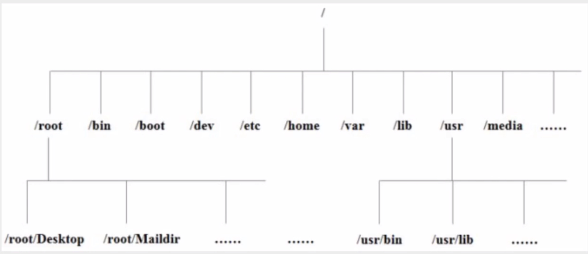
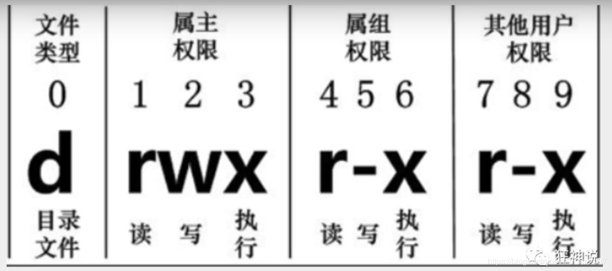
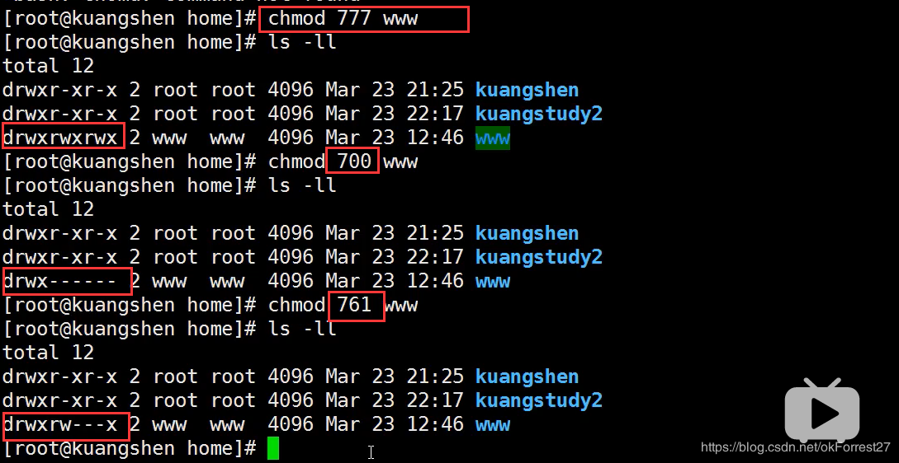
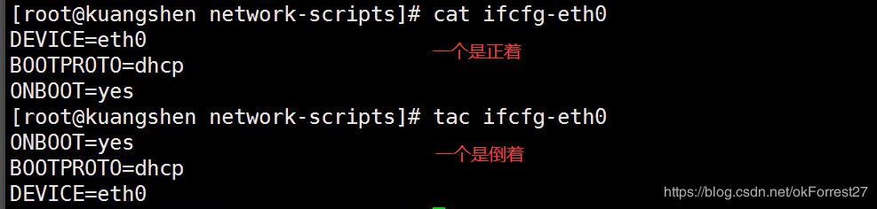
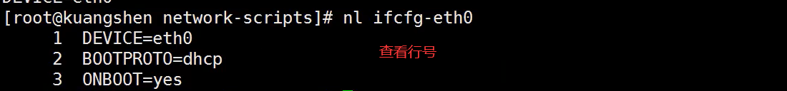
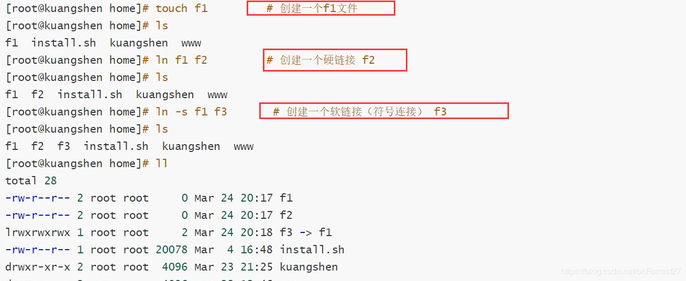
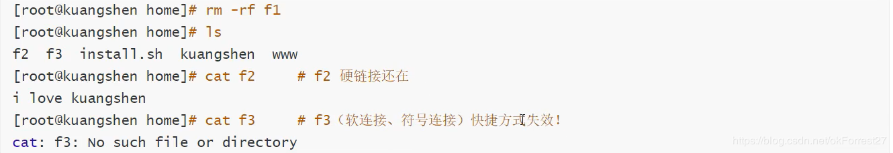

# Linux入门

>   https://blog.csdn.net/okForrest27/article/details/107032880

## 开关机

### 开机

用户登录：

-   命令行登录
-   ssh登录
-   图形界面登录

### 关机

首先执行sync命令

```bash
sync #将数据由内存同步到硬盘
shutdown -h 10 #10分钟后关机
shutdown -h now #立刻关机
showdown -r now #立刻重启
reboot #重启
halt #关闭系统
```

## 系统目录结构

1.  一切皆文件
2.  根目录`/`，所有文件都挂载在这个结点下



### 目录解释

-   `/bin`：bin是Binary的缩写, 这个目录存放着最经常使用的命令。
-   `/boot`： 这里存放的是启动Linux时使用的一些核心文件，包括一些连接文件以及镜像文件。
-   `/dev` ： dev是Device(设备)的缩写, 存放的是Linux的外部设备，在Linux中访问设备的方式和访问文件的方式是相同的。
-   **`/etc`： 这个目录用来存放所有的系统管理所需要的配置文件和子目录。**
-   **`/home`：用户的主目录，在Linux中，每个用户都有一个自己的目录，一般该目录名是以用户的账号命名的。**
-   `/lib`：这个目录里存放着系统最基本的动态连接共享库，其作用类似于Windows里的DLL文件。
-   `/lost+found`：这个目录一般情况下是空的，当系统非法关机后，这里就存放了一些文件。
-   `/media`：linux系统会自动识别一些设备，例如U盘、光驱等等，当识别后，linux会把识别的设备挂载到这个目录下。
-   `/mnt`：系统提供该目录是为了让用户临时挂载别的文件系统的，我们可以将光驱挂载在/mnt/上，然后进入该目录就可以查看光驱里的内容了。
-   **`/opt`：这是给主机额外安装软件所摆放的目录。比如你安装一个ORACLE数据库则就可以放到这个目录下。默认是空的。**
-   `/proc`：这个目录是一个虚拟的目录，它是系统内存的映射，我们可以通过直接访问这个目录来获取系统信息。
-   **`/root`：该目录为系统管理员，也称作超级权限者的用户主目录。**
-   `/sbin`：s就是Super User的意思，这里存放的是系统管理员使用的系统管理程序。
-   `/srv`：该目录存放一些服务启动之后需要提取的数据。
-   `/sys`：这是linux2.6内核的一个很大的变化。该目录下安装了2.6内核中新出现的一个文件系统 sysfs 。
-   **`/tmp`：这个目录是用来存放一些临时文件的。 用完即丢的文件可以放在这个目录下**
-   **`/usr`：这是一个非常重要的目录，用户的很多应用程序和文件都放在这个目录下，类似于windows下的program files目录。**
-   *`/usr/bin`： 系统用户使用的应用程序。*
-   *`/usr/sbin`： 超级用户使用的比较高级的管理程序和系统守护程序。*
-   *`/usr/src`： 内核源代码默认的放置目录。*
-   **`/var`：这个目录中存放着在不断扩充着的东西，我们习惯将那些经常被修改的目录放在这个目录下。包括各种日志文件。**
-   `/run`：是一个临时文件系统，存储系统启动以来的信息。当系统重启时，这个目录下的文件应该被删掉或清除。
-   **`/www`：存放服务器网站相关的资源，环境，网站的项目**

## 常用的基本命令

### 目录管理

-   绝对路径与相对路径

    -   绝对路径：路径的全称（以`/`开头）
    -   相对路径：相对当前目录的路径

-   `cd`：切换目录

    ```bash
     ~$ cd /
     /$ cd home
     home$ cd ..
     /$ 
    ```

-   `ls`：列出目录

    -a参数：all，查看全部文件，包括隐藏文件

    -l参数：列出所有的文件，包含文件的属性和权限，没有隐藏文件

    **注：Linux命令参数可以组合使用**

    ```bash
     /$ ls
    bin   cdrom  etc   initrd.img  lib64       media  opt   root  sbin  srv  tmp  var      vmlinuz.old
    boot  dev    home  lib         lost+found  mnt    proc  run   snap  sys  usr  vmlinuz
     /$ ls -a
    .   bin   cdrom  etc   initrd.img  lib64       media  opt   root  sbin  srv  tmp  var      vmlinuz.old
    ..  boot  dev    home  lib         lost+found  mnt    proc  run   snap  sys  usr  vmlinuz
     /$ ls -l
    总用量 108
    drwxr-xr-x   2 root root  4096 8月  20 16:52 bin
    drwxr-xr-x   4 root root  4096 4月  19 11:33 boot
    drwxr-xr-x   2 root root  4096 12月 19  2019 cdrom
    drwxr-xr-x  20 root root  4580 8月  23 09:06 dev
    drwxr-xr-x 148 root root 12288 8月  23 10:30 etc
    drwxr-xr-x   4 root root  4096 5月   9 17:00 home
    lrwxrwxrwx   1 root root    33 4月  19 11:29 initrd.img -> boot/initrd.img-4.15.0-97-generic
    drwxr-xr-x  23 root root  4096 4月  20 12:17 lib
    drwxr-xr-x   2 root root  4096 8月   6  2019 lib64
    drwx------   3 root root 16384 12月 19  2019 lost+found
    drwxr-xr-x   4 root root  4096 5月   3 16:30 media
    drwxr-xr-x   2 root root  4096 8月   6  2019 mnt
    drwxr-xr-x  15 root root  4096 8月   9 21:44 opt
    dr-xr-xr-x 374 root root     0 8月  23 09:04 proc
    drwx------  20 root root  4096 8月   2 22:54 root
    drwxr-xr-x  32 root root  1120 8月  23 11:10 run
    drwxr-xr-x   2 root root 12288 5月   8 13:34 sbin
    drwxr-xr-x   2 root root  4096 4月  30 22:23 snap
    drwxr-xr-x   2 root root  4096 8月   6  2019 srv
    dr-xr-xr-x  13 root root     0 8月  23 09:04 sys
    drwxrwxrwt  20 root root 12288 8月  23 12:54 tmp
    drwxr-xr-x  11 root root  4096 8月   6  2019 usr
    drwxr-xr-x  14 root root  4096 4月  30 22:23 var
    lrwxrwxrwx   1 root root    30 4月  19 11:29 vmlinuz -> boot/vmlinuz-4.15.0-97-generic
    lrwxrwxrwx   1 root root    29 4月  19 11:29 vmlinuz.old -> boot/vmlinuz-5.3.0-47-generic
     /$ ls -al
    总用量 116
    drwxr-xr-x  24 root root  4096 4月  30 22:23 .
    drwxr-xr-x  24 root root  4096 4月  30 22:23 ..
    drwxr-xr-x   2 root root  4096 8月  20 16:52 bin
    drwxr-xr-x   4 root root  4096 4月  19 11:33 boot
    drwxr-xr-x   2 root root  4096 12月 19  2019 cdrom
    drwxr-xr-x  20 root root  4580 8月  23 09:06 dev
    drwxr-xr-x 148 root root 12288 8月  23 10:30 etc
    drwxr-xr-x   4 root root  4096 5月   9 17:00 home
    lrwxrwxrwx   1 root root    33 4月  19 11:29 initrd.img -> boot/initrd.img-4.15.0-97-generic
    drwxr-xr-x  23 root root  4096 4月  20 12:17 lib
    drwxr-xr-x   2 root root  4096 8月   6  2019 lib64
    drwx------   3 root root 16384 12月 19  2019 lost+found
    drwxr-xr-x   4 root root  4096 5月   3 16:30 media
    drwxr-xr-x   2 root root  4096 8月   6  2019 mnt
    drwxr-xr-x  15 root root  4096 8月   9 21:44 opt
    dr-xr-xr-x 374 root root     0 8月  23 09:04 proc
    drwx------  20 root root  4096 8月   2 22:54 root
    drwxr-xr-x  32 root root  1120 8月  23 11:10 run
    drwxr-xr-x   2 root root 12288 5月   8 13:34 sbin
    drwxr-xr-x   2 root root  4096 4月  30 22:23 snap
    drwxr-xr-x   2 root root  4096 8月   6  2019 srv
    dr-xr-xr-x  13 root root     0 8月  23 09:04 sys
    drwxrwxrwt  20 root root 12288 8月  23 12:54 tmp
    drwxr-xr-x  11 root root  4096 8月   6  2019 usr
    drwxr-xr-x  14 root root  4096 4月  30 22:23 var
    lrwxrwxrwx   1 root root    30 4月  19 11:29 vmlinuz -> boot/vmlinuz-4.15.0-97-generic
    lrwxrwxrwx   1 root root    29 4月  19 11:29 vmlinuz.old -> boot/vmlinuz-5.3.0-47-generic
    ```

-   `pwd`：显示当前所在目录的路径

    ```bash
     ~$ pwd
    /home/sxn
    ```

-   mkdir：创建目录（文件夹）

    ```bash
    mkdir test1
    mkdir -p test2/test3/test4
    ```

    -p参数：递归创建多级目录

-   rmdir：删除目录

    ```bash
    rmdir test1
    rmdir -p test2/test3/test4
    ```

    rmdir只能移除空目录，如果存在文件需要先删除文件

    -p参数：递归删除多级目录

-   cp：复制文件或目录

    ```bash
    cp 1.txt abc/
    ```

    cp 原来的地方 新的地方

    如果文件重复，会询问覆盖或放弃

-   rm：移除文件或目录

    -f参数：忽略不存在的文件，不会出现警告，强制删除

    -r参数：递归删除目录

    -i参数：删除询问是否删除

    ```bash
    rm -rf install.sh
    ```

-   mv：移动文件或者目录

    -f参数：强制移动

    -u参数：只替换已经更新过的文件

    ```bash
    mv install.sh abc/ #移动文件
    mv abc def #重命名文件夹名
    ```

### 基本属性

Linux系统是一种典型的多用户系统,不同的用户处于不同的地位,拥有不同的权限。为了保护系统的安全性, Linux系统对不同的用户访问同一文件(包括目录文件)的权限做了不同的规定。

在Linux中我们可以使用ll或者ls -l命令来显示一个文件的属性以及文件所属的用户和组。

实例中, boot文件的第一个属性用"d"表示。 "d"在Linux中代表该文件是一 个目录文件。在Linux中第一个字符代表这个文件是目录、 文件或链接文件等等:

 - **当为[d]则是目录**

 - **当为[-]则是文件;**

 - **若是[l]则表示为链接文档( link file);**

 - 若是[b]则表示为装置文件里面的可供储存的接口设备(可随机存取装置) ;

 - 若是[c]则表示为装置文件里面的串行端口设备,例如键盘、鼠标( 一次性读取装置)。

 - 接下来的字符中,以三个为一组,且均为[rwx] 的三个参数的组合。其中，**[r]代表可读(read)、[w]代表可写(write)、[x]代表可执行(execute)**。要注意的是,这三个权限的位置不会改变,如果没有权限,就会出现减号[-]而已。每个文件的属性由左边第一部分的10个字符来确定 (如下图) :



从左至右用0-9这些数字来表示。
 
 第0位确定文件类型,第1-3位确定属主(该文件的所有者)拥有该文件的权限。第4-6位确定属组 (所有者的同组用户)拥有该文件的权限,第7-9位确定其他用户拥有该文件的权限。
 
 其中:
 
 第1、4、7位表示读权限,如果用"r"字符表示,则有读权限,如果用"-“字符表示,则没有读权限;
 
 第2、5、8位表示写权限,如果用"W"字符表示,则有写权限,如果用”-“字符表示没有写权限;
 
 第3、6、9位表示可执行权限,如果用"x"字符表示,则有执行权限,如果用”-"字符表示,则没有执行权限。
 
 对于文件来说,它都有一个特定的所有者,也就是对该文件具有所有权的用户。
 
 同时,在Linux系统中,用户是按组分类的, - -个用户属于一个或多个组。
 
 文件所有者以外的用户又可以分为文件所有者的同组用户和其他用户。
 
 **因此, Linux系统按文件所有者、文件所有者同组用户和其他用户来规定了不同的文件访问权限。**

### 修改文件属性

1.  chgrp :更改文件属组

```bash
chgrp [-R] 属组名文件名
```

​	-R 参数:递归更改文件属组,就是在更改某个目录文件的属组时,如果加上R的参数,那么该目录下的所有文件的属组都会更改。

2.  chown :更改文件属主,也可以同时更改文件属组

```bash
chown [-R] 属主名文件名
chown [-R] 属主名:属组名文件名
```

3.  chmod :更改文件9个属性

```bash
chmod [-R] xyz 文件或目录
```

Linux文件属性有两种设置方法,一种是数字（常用的是数字）, 一种是符号。

Linux文件的基本权限就有九个,分别是owner/group/others三种身份各有自己的read/write/execute权限。

文件的权限字符为: [-rwxrwxrwx]，这九个权限是三个三个一组的!其中,我们可以使用字来代表各个权限,各权限的分数对照表如下:r:4 w:2 x:1

chomd 777 文件赋予所有用户可读可执行。



### 文件内容查看

Linux系统中使用以下命令来查看文件的内容:

-   cat由第一行开始显示文件内容
-   tac从最后一行开始显示，可以看出tac是cat的倒着写!
-   nl显示的时候,顺道输出行号!
-   more一页一页的显示文件内容（空格表示翻页，enter代表向下看下一行，:f查看当前行号）
-   less与more类似,但是比more更好的是,他可以往前翻页!（空格翻页，上下键代表上下翻动页面，退出q命令，查找字符串`/需要查询的字符串`向下查询，向上查询使用`?需要查询的字符串`,用n继续搜寻下一个,用N向上寻找）
-   head 只看头几行 通过-n参数来控制显示几行
-   tail只看尾巴几行 通过-n参数来控制显示几行





### 链接

Linux链接分为两种：硬链接、软链接

**硬链接：A—B,假设B是A的硬链接，那么他们两个指向了同一个文件! 允许一个文件拥有多个路径，用户可以通过这种机制硬链接到一个重要文件上，防止误删**
**软链接：类似Windows下的快捷方式，删除源文件，快捷方式也就访问不了**

-   ln命令：创建链接

    默认创建硬链接

    -s参数：创建软连接

-   touch命令：创建空文件





​    