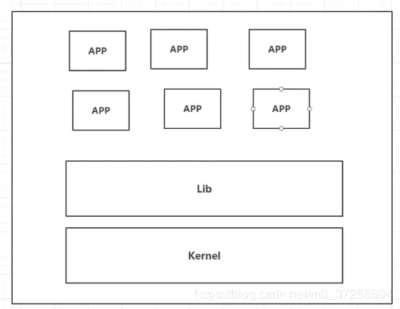
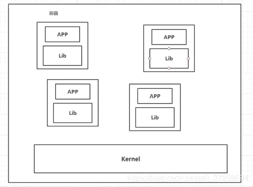
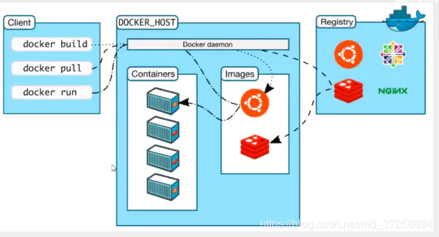
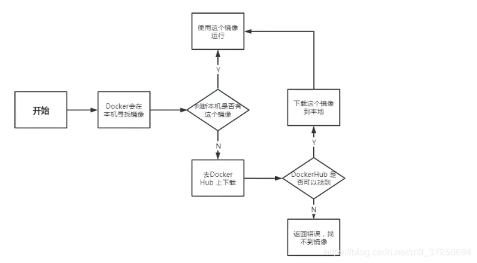
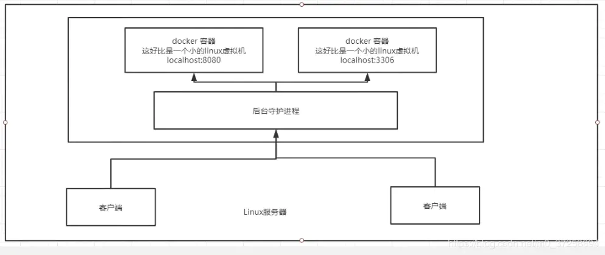
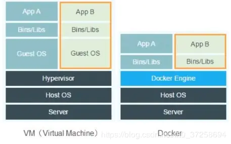
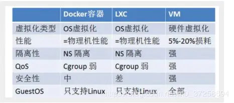

# Docker简介

## Docker概述

之前的虚拟机技术




虚拟机技术缺点：

1.  资源占用十分多

2.  冗余资源多

容器化技术

容器化技术不是模拟的一个完整的操作系统




比较Docker和虚拟机技术的不同：

传统虚拟机，虚拟出一个硬件，运行一个完整的操作系统，然后在这个系统上安装和运行软件； 容器内的应用直接运行在宿主机的内核上，容器是没有自己的内核的，也没有虚拟出硬件，所以十分轻便！ 每一个容器是互相隔离的，每一个容器内都有一个属于自己的文件系统，互相不影响。 DveOps（开发、运维）

应用更快速的交付和部署

-   传统：一对帮助文档，安装程序。

-   Docker：打包镜像发布测试，一键运行；

更便捷的升级和扩缩容

使用了docker之后，我们部署应用就和搭积木一样！

项目打包为了一个镜像，扩展服务器A！服务器B

更简单的系统运维

在容器化之后，我们开发，测试环境都是高度一致的。

更高效的计算资源利用

Docker是内核级别的虚拟化，可以在一个物理机上运行很多的容器实例！服务器的性能可以被压榨到极致！

## Docker安装

-   Docker的基本组成

    

    镜像（image）

    docker镜像就好比是一个模板，可以通过这个模板来创建容器服务，tomcat镜像==>run==>tomcat01容器（提供服务器），通过这个镜像可以创建很多个容器（最终服务运行或者项目运行就在容器中）。

    容器（container）

    Docker利用容器技术，独立运行一个或者一组应用，通过镜像来创建的。

    启动，停止，删除，基本命令！

    目前就可以吧容器理解为就是一个简易的Linux系统。

    仓库（repository）

    仓库就是存放镜像的地方！

    仓库分为共有仓库和私有仓库！

    Docker Hub（默认是国外的）

-   环境准备

    ```bash
     ~$ uname -r
    5.3.0-47-generic
     ~$ cat /etc/os-release 
    NAME="Ubuntu"
    VERSION="18.04.4 LTS (Bionic Beaver)"
    ID=ubuntu
    ID_LIKE=debian
    PRETTY_NAME="Ubuntu 18.04.4 LTS"
    VERSION_ID="18.04"
    HOME_URL="https://www.ubuntu.com/"
    SUPPORT_URL="https://help.ubuntu.com/"
    BUG_REPORT_URL="https://bugs.launchpad.net/ubuntu/"
    PRIVACY_POLICY_URL="https://www.ubuntu.com/legal/terms-and-policies/privacy-policy"
    VERSION_CODENAME=bionic
    UBUNTU_CODENAME=bionic
    ```

-   安装Docker

    1.  Uninstall old versions

        Older versions of Docker were called `docker`, `docker.io`, or `docker-engine`. If these are installed, uninstall them:

        ```bash
        $ sudo apt-get remove docker docker-engine docker.io containerd runc
        ```
        
    2.  Update the `apt` package index and install packages to allow `apt` to use a repository over HTTPS:

        ```bash
        $ sudo apt-get update
        
        $ sudo apt-get install \
            apt-transport-https \
            ca-certificates \
            curl \
            gnupg-agent \
            software-properties-common
        ```

    3.  Add Docker’s official GPG key:

        ```bash
        curl -fsSL https://download.docker.com/linux/ubuntu/gpg | sudo apt-key add -
        ```

        Verify that you now have the key with the fingerprint `9DC8 5822 9FC7 DD38 854A E2D8 8D81 803C 0EBF CD88`, by searching for the last 8 characters of the fingerprint.

        ```bash
        $ sudo apt-key fingerprint 0EBFCD88
        
        pub   rsa4096 2017-02-22 [SCEA]
              9DC8 5822 9FC7 DD38 854A  E2D8 8D81 803C 0EBF CD88
        uid           [ unknown] Docker Release (CE deb) <docker@docker.com>
        sub   rsa4096 2017-02-22 [S]
        ```

    4.  Use the following command to set up the **stable** repository. To add the **nightly** or **test** repository, add the word `nightly` or `test` (or both) after the word `stable` in the commands below.

        >   **Note**: The `lsb_release -cs` sub-command below returns the name of your Ubuntu distribution, such as `xenial`. Sometimes, in a distribution like Linux Mint, you might need to change `$(lsb_release -cs)` to your parent Ubuntu distribution. For example, if you are using `Linux Mint Tessa`, you could use `bionic`. Docker does not offer any guarantees on untested and unsupported Ubuntu distributions.

        ```bash
        $ sudo add-apt-repository \
           "deb [arch=amd64] https://download.docker.com/linux/ubuntu \
           $(lsb_release -cs) \
           stable"
        ```

    5.  Update the `apt` package index, and install the *latest version* of Docker Engine and containerd

        ```bash
         $ sudo apt-get update
         $ sudo apt-get install docker-ce docker-ce-cli containerd.io
        ```

    6.  Verify that Docker Engine is installed correctly by running the hello-world image.

        ```bash
        $ sudo docker run hello-world
        ```

-    Docker启动

    ```bash
     ~$ systemctl start docker
     ~$ sudo docker version
    Client: Docker Engine - Community
     Version:           19.03.12
     API version:       1.40
     Go version:        go1.13.10
     Git commit:        48a66213fe
     Built:             Mon Jun 22 15:45:36 2020
     OS/Arch:           linux/amd64
     Experimental:      false
    
    Server: Docker Engine - Community
     Engine:
      Version:          19.03.12
      API version:      1.40 (minimum version 1.12)
      Go version:       go1.13.10
      Git commit:       48a66213fe
      Built:            Mon Jun 22 15:44:07 2020
      OS/Arch:          linux/amd64
      Experimental:     false
     containerd:
      Version:          1.2.13
      GitCommit:        7ad184331fa3e55e52b890ea95e65ba581ae3429
     runc:
      Version:          1.0.0-rc10
      GitCommit:        dc9208a3303feef5b3839f4323d9beb36df0a9dd
     docker-init:
      Version:          0.18.0
      GitCommit:        fec3683
    ```

-   测试

    ```bash
     ~$ sudo docker run hello-world
    
    Hello from Docker!
    This message shows that your installation appears to be working correctly.
    
    To generate this message, Docker took the following steps:
     1. The Docker client contacted the Docker daemon.
     2. The Docker daemon pulled the "hello-world" image from the Docker Hub.
        (amd64)
     3. The Docker daemon created a new container from that image which runs the
        executable that produces the output you are currently reading.
     4. The Docker daemon streamed that output to the Docker client, which sent it
        to your terminal.
    
    To try something more ambitious, you can run an Ubuntu container with:
     $ docker run -it ubuntu bash
    
    Share images, automate workflows, and more with a free Docker ID:
     https://hub.docker.com/
    
    For more examples and ideas, visit:
     https://docs.docker.com/get-started/
    
    ```

    查看镜像

    ```bash
    ~$ sudo docker images
    REPOSITORY          TAG                 IMAGE ID            CREATED             SIZE
    hello-world         latest              bf756fb1ae65        8 months ago        13.3kB
    ```

-   卸载Docker

    ```bash
    #1. 卸载依赖
    yum remove docker-ce docker-ce-cli containerd.io
    #2. 删除资源
    rm -rf /var/lib/docker
    # /var/lib/docker 是docker的默认工作路径
    ```

## Docker运行        

运行原理图：



-   工作原理

    docker是一个Client-Server结构的系统，Docker的守护进程运行在主机上，通过Socket从客户端访问。

    Docker-Server收到DockerClient的指令，就会执行这个命令。

    

    Docker与虚拟机的比较：

    

    1.  Docker有着比虚拟机更少的抽象层；
    2.  Docker利用的宿主机的内核，vm需要的是GuestOS；
    3.  当新建一个容器时，Docker不需要和虚拟机一样重新加载一个操作系统内核，避免引导；虚拟机是加载Guest OS，分钟级别，而docker是利用宿主机的操作系统，省略了这个复杂的过程

    

    