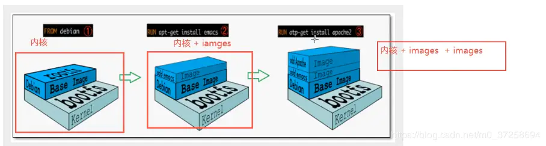
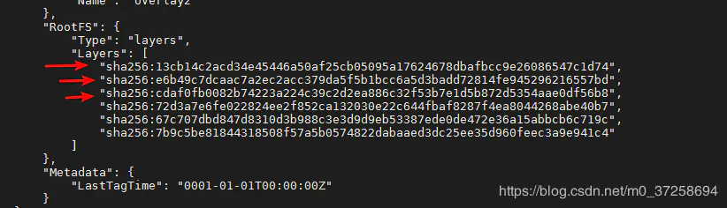
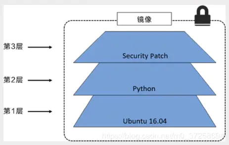
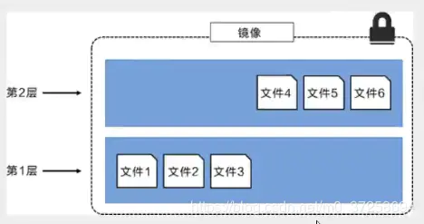
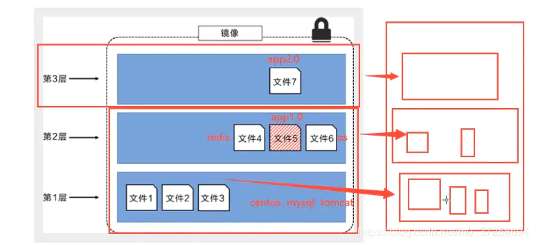
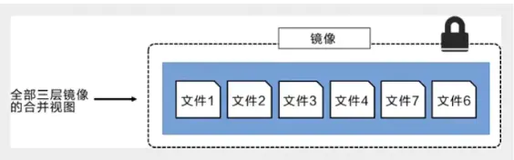
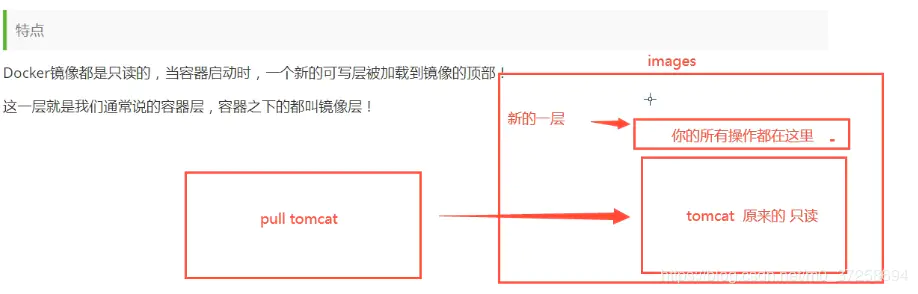
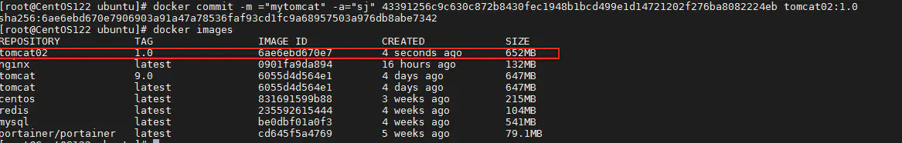

# Docker使用

## Docker常用命令

### 帮助命令

```bash
docker version    #显示docker版本
docker info       # 显示docker的系统信息，包括镜像和容器的数量
docker 命令 --help #帮助命令
```

>   https://docs.docker.com/reference/

### 镜像命令

-   docker images 查看所有本地主机上的镜像

```bash
[root@CentOS122 ubuntu]# docker images
REPOSITORY          TAG                 IMAGE ID            CREATED             SIZE
hello-world         latest              bf756fb1ae65        6 months ago        13.3kB
 
#解释
REPOSITORY          镜像的仓库源
TAG                 镜像的标签
IMAGE ID            镜像id
CREATED             镜像的创建时间
13.3kB              镜像的大小
 
#可选项
-a, --all            #列出所有镜像
-q, --quiet          #只显示镜像的id
```

-   docker search 搜索镜像

```bash
 ~$ docker search mysql
NAME                              DESCRIPTION                                     STARS               OFFICIAL            AUTOMATED
mysql                             MySQL is a widely used, open-source relation…   9931                [OK]                
mariadb                           MariaDB is a community-developed fork of MyS…   3634                [OK]                
mysql/mysql-server                Optimized MySQL Server Docker images. Create…   723                                     [OK]
percona                           Percona Server is a fork of the MySQL relati…   508                 [OK]                
centos/mysql-57-centos7           MySQL 5.7 SQL database server                   83                                      
mysql/mysql-cluster               Experimental MySQL Cluster Docker images. Cr…   75                                      
centurylink/mysql                 Image containing mysql. Optimized to be link…   61                                      [OK]
bitnami/mysql                     Bitnami MySQL Docker Image                      44                                      [OK]
deitch/mysql-backup               REPLACED! Please use http://hub.docker.com/r…   41                                      [OK]
tutum/mysql                       Base docker image to run a MySQL database se…   35                                      
prom/mysqld-exporter                                                              31                                      [OK]
schickling/mysql-backup-s3        Backup MySQL to S3 (supports periodic backup…   30                                      [OK]
databack/mysql-backup             Back up mysql databases to... anywhere!         30                                      
linuxserver/mysql                 A Mysql container, brought to you by LinuxSe…   25                                      
centos/mysql-56-centos7           MySQL 5.6 SQL database server                   20                                      
circleci/mysql                    MySQL is a widely used, open-source relation…   19                                      
mysql/mysql-router                MySQL Router provides transparent routing be…   16                                      
arey/mysql-client                 Run a MySQL client from a docker container      14                                      [OK]
fradelg/mysql-cron-backup         MySQL/MariaDB database backup using cron tas…   8                                       [OK]
openshift/mysql-55-centos7        DEPRECATED: A Centos7 based MySQL v5.5 image…   6                                       
devilbox/mysql                    Retagged MySQL, MariaDB and PerconaDB offici…   3                                       
ansibleplaybookbundle/mysql-apb   An APB which deploys RHSCL MySQL                2                                       [OK]
jelastic/mysql                    An image of the MySQL database server mainta…   1                                       
widdpim/mysql-client              Dockerized MySQL Client (5.7) including Curl…   1                                       [OK]
monasca/mysql-init                A minimal decoupled init container for mysql    0                                       

#解释
Options:
  -f, --filter filter   Filter output based on conditions provided
      --format string   Pretty-print search using a Go template
      --limit int       Max number of search results (default 25)
      --no-trunc        Don't truncate output

 ~$ sudo docker search -f=STARS=3000 mysql
NAME                DESCRIPTION                                     STARS               OFFICIAL            AUTOMATED
mysql               MySQL is a widely used, open-source relation…   9931                [OK]                
mariadb             MariaDB is a community-developed fork of MyS…   3634                [OK]                
```

-   docker pull 下载镜像

```bash
# 下载镜像 docker pull 镜像名[:tag]
[root@CentOS122 ubuntu]# docker pull tomcat:8
8: Pulling from library/tomcat #如果不写tag，默认就是latest
90fe46dd8199: Already exists   #分层下载： docker image 的核心 联合文件系统
35a4f1977689: Already exists 
bbc37f14aded: Already exists 
74e27dc593d4: Already exists 
93a01fbfad7f: Already exists 
1478df405869: Pull complete 
64f0dd11682b: Pull complete 
68ff4e050d11: Pull complete 
f576086003cf: Pull complete 
3b72593ce10e: Pull complete 
Digest: sha256:0c6234e7ec9d10ab32c06423ab829b32e3183ba5bf2620ee66de866df640a027  # 签名 防伪
Status: Downloaded newer image for tomcat:8
docker.io/library/tomcat:8 #真实地址
 
#等价于
docker pull tomcat:8
docker pull docker.io/library/tomcat:8
```

docker rmi 删除镜像

```bash
$ docker rmi -f bf756fb1ae65     #删除指定镜像
$ docker rmi -f 容器id 容器id ... #删除多个容器
$ docker rmi -f $(docker images -aq) #删除全部的容器
```

### 容器命令

有了镜像才可以创建容器

-   docker run 新建容器并启动

```bash
docker run [可选参数] image
 
#参数说明
--name="Nmae"    容器名字    tomcat01 toncat02. 用来区分容器
-d               后台方式运行
-it              使用交互式方式运行，进入容器查看内容
-p               指定容器的端口  -p 8080:8080
 1.   -p ip：主机端口：容器端口
 2.   -p 主机端口：容器端口（常用）
 3.   -p 容器端口
 4.    容器端口
-p               随机指定端口
```

测试：启动并进入容器

```bash
 ~$ sudo docker run -it centos /bin/bash
 [root@67de465e7b95 /]# ls
bin  dev  etc  home  lib  lib64  lost+found  media  mnt  opt  proc  root  run  sbin  srv  sys  tmp  usr  var
[root@67de465e7b95 /]# exit #退出容器
exit
```

-   docker ps 显示出所有运行的容器

```bash
#docker ps [可选参数] 
                #显示当前正在运行的容器
-a              #列出当前正在运行的容器+带出历史运行过的容器
-n=?            #显示最近创建的容器
-q              #只显示容器编号
    
 
$ docker ps
CONTAINER ID        IMAGE               COMMAND             CREATED             STATUS              PORTS               NAMES
$ docker ps -a
CONTAINER ID        IMAGE               COMMAND                  CREATED             STATUS                            PORTS                               NAMES
fe6cd8ee0d7b        centos              "/bin/bash"              3 minutes ago       Exited (130) About a minute ago                                       lucid_banach
5423b2d7463d        bf756fb1ae65        "/hello"                 50 minutes ago      Exited (0) 50 minutes ago                                             funny_keller
d4e3e35788fe        bf756fb1ae65        "/hello"                 23 hours ago        Exited (0) 23 hours ago                                               trusting_leavitt
c83ed1050c4a        mysql               "docker-entrypoint.s…"   9 days ago          Exited (255) 24 hours ago         0.0.0.0:3306->3306/tcp, 33060/tcp   mymysql
850e796a3e12        bf756fb1ae65        "/hello"                 10 days ago         Exited (0) 10 days ago                                                relaxed_nobel
 ~$ docker ps -n=1
CONTAINER ID        IMAGE               COMMAND             CREATED             STATUS                     PORTS               NAMES
fe6cd8ee0d7b        centos              "/bin/bash"              3 minutes ago       Exited (130) About a minute ago                                       lucid_banach
```

-   exit 退出容器

```bash
eixt #直接容器停止并退出
ctrl+p+q  #容器不停止退出
```

-   docker rm 删除容器

```bash
docker rm 容器id            #删除指定的容器，不能删除正在运行的容器；
docker rm -f 容器id         #强制删除正在运行的容器
docker rm -f $(docker ps -aq)      #删除所有容器
docker ps -a -q | xargs docker rm  #删除所有的容器
```

-   docker start 启动和停止容器的操作

```bash
docker start 容器id            #启动容器
docker restart 容器id          #重启容器
docker stop 容器id             #停止当前正在运行的容器
docker kill 容器id             #强制停止当前容器
```

### 其它命令

-   docker run -d 后台启动容器

```bash
#命令 docker run -d 命令
$ docker run -d centos
 
#问题docker ps 发现centos停止了
 
#常见的坑：docker容器使用后台启动，就必须要有一个前台的进程，docker发现没有应用，就会自动停止。
#nginx，容器启动后，发现自己没有提供服务，就会立刻停止，就是没有程序了
```

-   docker logs 查看日志

```bash
 #自己写一段脚本
$ docker run -d centos /bin/sh -c "while true;do echo abc;sleep 1;done"
#显示日志
-tf         #显示全部日志
--tail number #要显示的日志参数
$ docker logs -f --tail=200 60d2e46767cc
```

-   docker top 查看容器内部进程信息

```bash
$ docker top 5467d2706b3f
UID                 PID                 PPID                C                   STIME               TTY                 TIME                CMD
root                10484               10469               0                   06:35               ?                   00:00:00            /bin/sh -c while true;do echo shijun;sleep 1;done
root                10735               10484               0                   06:37               ?                   00:00:00            /usr/bin/coreutils --coreutils-pro
```

docker inspect 查看容器元数据

```bash
$ docker inspect 5467d2706b3f
[
    {
        "Id": "5467d2706b3f641d1101ca76332eea6b20a00ca5c5e37f033066c05e378be48a",
        "Created": "2020-07-09T22:35:13.490987912Z",
        "Path": "/bin/sh",
        "Args": [
            "-c",
            "while true;do echo abc;sleep 1;done"
        ],
        "State": {
            "Status": "running",
            "Running": true,
            "Paused": false,
            "Restarting": false,
            "OOMKilled": false,
            "Dead": false,
            "Pid": 10484,
            "ExitCode": 0,
            "Error": "",
            "StartedAt": "2020-07-09T22:35:15.253750561Z",
            "FinishedAt": "0001-01-01T00:00:00Z"
        },
        "Image": "sha256:831691599b88ad6cc2a4abbd0e89661a121aff14cfa289ad840fd3946f274f1f",
        "ResolvConfPath": "/var/lib/docker/containers/5467d2706b3f641d1101ca76332eea6b20a00ca5c5e37f033066c05e378be48a/resolv.conf",
        "HostnamePath": "/var/lib/docker/containers/5467d2706b3f641d1101ca76332eea6b20a00ca5c5e37f033066c05e378be48a/hostname",
        "HostsPath": "/var/lib/docker/containers/5467d2706b3f641d1101ca76332eea6b20a00ca5c5e37f033066c05e378be48a/hosts",
        "LogPath": "/var/lib/docker/containers/5467d2706b3f641d1101ca76332eea6b20a00ca5c5e37f033066c05e378be48a/5467d2706b3f641d1101ca76332eea6b20a00ca5c5e37f033066c05e378be48a-json.log",
        "Name": "/affectionate_heyrovsky",
        "RestartCount": 0,
        "Driver": "overlay2",
        "Platform": "linux",
        "MountLabel": "",
        "ProcessLabel": "",
        "AppArmorProfile": "",
        "ExecIDs": null,
        "HostConfig": {
            "Binds": null,
            "ContainerIDFile": "",
            "LogConfig": {
                "Type": "json-file",
                "Config": {}
            },
            "NetworkMode": "default",
            "PortBindings": {},
            "RestartPolicy": {
                "Name": "no",
                "MaximumRetryCount": 0
            },
            "AutoRemove": false,
            "VolumeDriver": "",
            "VolumesFrom": null,
            "CapAdd": null,
            "CapDrop": null,
            "Capabilities": null,
            "Dns": [],
            "DnsOptions": [],
            "DnsSearch": [],
            "ExtraHosts": null,
            "GroupAdd": null,
            "IpcMode": "private",
            "Cgroup": "",
            "Links": null,
            "OomScoreAdj": 0,
            "PidMode": "",
            "Privileged": false,
            "PublishAllPorts": false,
            "ReadonlyRootfs": false,
            "SecurityOpt": null,
            "UTSMode": "",
            "UsernsMode": "",
            "ShmSize": 67108864,
            "Runtime": "runc",
            "ConsoleSize": [
                0,
                0
            ],
            "Isolation": "",
            "CpuShares": 0,
            "Memory": 0,
            "NanoCpus": 0,
            "CgroupParent": "",
            "BlkioWeight": 0,
            "BlkioWeightDevice": [],
            "BlkioDeviceReadBps": null,
            "BlkioDeviceWriteBps": null,
            "BlkioDeviceReadIOps": null,
            "BlkioDeviceWriteIOps": null,
            "CpuPeriod": 0,
            "CpuQuota": 0,
            "CpuRealtimePeriod": 0,
            "CpuRealtimeRuntime": 0,
            "CpusetCpus": "",
            "CpusetMems": "",
            "Devices": [],
            "DeviceCgroupRules": null,
            "DeviceRequests": null,
            "KernelMemory": 0,
            "KernelMemoryTCP": 0,
            "MemoryReservation": 0,
            "MemorySwap": 0,
            "MemorySwappiness": null,
            "OomKillDisable": false,
            "PidsLimit": null,
            "Ulimits": null,
            "CpuCount": 0,
            "CpuPercent": 0,
            "IOMaximumIOps": 0,
            "IOMaximumBandwidth": 0,
            "MaskedPaths": [
                "/proc/asound",
                "/proc/acpi",
                "/proc/kcore",
                "/proc/keys",
                "/proc/latency_stats",
                "/proc/timer_list",
                "/proc/timer_stats",
                "/proc/sched_debug",
                "/proc/scsi",
                "/sys/firmware"
            ],
            "ReadonlyPaths": [
                "/proc/bus",
                "/proc/fs",
                "/proc/irq",
                "/proc/sys",
                "/proc/sysrq-trigger"
            ]
        },
        "GraphDriver": {
            "Data": {
                "LowerDir": "/var/lib/docker/overlay2/8a83580bdf045fa2c1bb55c34028f742a02b020f7714bd8a1378bfad4f48b03d-init/diff:/var/lib/docker/overlay2/b33aa1f4ccea184e655706729d226636fae2ae430e8b62029b77a394cf01d9e2/diff",
                "MergedDir": "/var/lib/docker/overlay2/8a83580bdf045fa2c1bb55c34028f742a02b020f7714bd8a1378bfad4f48b03d/merged",
                "UpperDir": "/var/lib/docker/overlay2/8a83580bdf045fa2c1bb55c34028f742a02b020f7714bd8a1378bfad4f48b03d/diff",
                "WorkDir": "/var/lib/docker/overlay2/8a83580bdf045fa2c1bb55c34028f742a02b020f7714bd8a1378bfad4f48b03d/work"
            },
            "Name": "overlay2"
        },
        "Mounts": [],
        "Config": {
            "Hostname": "5467d2706b3f",
            "Domainname": "",
            "User": "",
            "AttachStdin": false,
            "AttachStdout": false,
            "AttachStderr": false,
            "Tty": false,
            "OpenStdin": false,
            "StdinOnce": false,
            "Env": [
                "PATH=/usr/local/sbin:/usr/local/bin:/usr/sbin:/usr/bin:/sbin:/bin"
            ],
            "Cmd": [
                "/bin/sh",
                "-c",
                "while true;do echo shijun;sleep 1;done"
            ],
            "Image": "centos",
            "Volumes": null,
            "WorkingDir": "",
            "Entrypoint": null,
            "OnBuild": null,
            "Labels": {
                "org.label-schema.build-date": "20200611",
                "org.label-schema.license": "GPLv2",
                "org.label-schema.name": "CentOS Base Image",
                "org.label-schema.schema-version": "1.0",
                "org.label-schema.vendor": "CentOS"
            }
        },
        "NetworkSettings": {
            "Bridge": "",
            "SandboxID": "7e451d65a35c125c30411e95c39d3f65b9fd2b0ca565b1a6ca861f45b1873497",
            "HairpinMode": false,
            "LinkLocalIPv6Address": "",
            "LinkLocalIPv6PrefixLen": 0,
            "Ports": {},
            "SandboxKey": "/var/run/docker/netns/7e451d65a35c",
            "SecondaryIPAddresses": null,
            "SecondaryIPv6Addresses": null,
            "EndpointID": "1fb7a41df08f0e29e5eb35060cd3bea3a9864a077ac55b4c913bfb03ab2170ba",
            "Gateway": "172.17.0.1",
            "GlobalIPv6Address": "",
            "GlobalIPv6PrefixLen": 0,
            "IPAddress": "172.17.0.3",
            "IPPrefixLen": 16,
            "IPv6Gateway": "",
            "MacAddress": "02:42:ac:11:00:03",
            "Networks": {
                "bridge": {
                    "IPAMConfig": null,
                    "Links": null,
                    "Aliases": null,
                    "NetworkID": "d7bfe3e3aca1d28ee0b0835b1541f344c93ce4de021d306eca5c1144bd068749",
                    "EndpointID": "1fb7a41df08f0e29e5eb35060cd3bea3a9864a077ac55b4c913bfb03ab2170ba",
                    "Gateway": "172.17.0.1",
                    "IPAddress": "172.17.0.3",
                    "IPPrefixLen": 16,
                    "IPv6Gateway": "",
                    "GlobalIPv6Address": "",
                    "GlobalIPv6PrefixLen": 0,
                    "MacAddress": "02:42:ac:11:00:03",
                    "DriverOpts": null
                }
            }
        }
    }
]
```

-   docker exec -it 进入当前正在运行的容器

```bash
#方式一
$ docker exec -it 5467d2706b3f /bin/bash
[root@5467d2706b3f /]# ls
bin  dev  etc  home  lib  lib64  lost+found  media  mnt  opt  proc  root  run  sbin  srv  sys  tmp  usr  var
 
#方式二
$ docker attach 5467d2706b3f
 
区别：
#docker exec #进入当前容器后开启一个新的终端，可以在里面操作。（常用）
#docker attach # 进入容器当前正在执行的终端
```

-   docker cp 拷贝主机与容器间资源

```bash
$ docker exec -it 5705a9861f91 /bin/bash
[root@5705a9861f91 /]# ls
bin  dev  etc  home  lib  lib64  lost+found  media  mnt  opt  proc  root  run  sbin  srv  sys  tmp  usr  var
[root@5705a9861f91 /]# touch tmp
[root@5705a9861f91 /]# echo 'abc' > tmp.java
[root@5705a9861f91 /]# ls -a
.  ..  .dockerenv  bin  dev  etc  home  lib  lib64  lost+found  media  mnt  opt  proc  root  run  sbin  srv  sys  tmp  tmp.java  usr  var
[root@5705a9861f91 /]# exit
exit
#将容器内的资源拷贝到主机
$ docker cp 5705a9861f91:tmp.java /home
 
#将主机中的资源拷贝到容器内
$ docker cp /home/tmp.java 5705a9861f91:tmp
```


```bash
Usage:	docker [OPTIONS] COMMAND

A self-sufficient runtime for containers

Options:
      --config string      Location of client config files (default "/home/sxn/.docker")
  -c, --context string     Name of the context to use to connect to the daemon (overrides DOCKER_HOST env var and default
                           context set with "docker context use")
  -D, --debug              Enable debug mode
  -H, --host list          Daemon socket(s) to connect to
  -l, --log-level string   Set the logging level ("debug"|"info"|"warn"|"error"|"fatal") (default "info")
      --tls                Use TLS; implied by --tlsverify
      --tlscacert string   Trust certs signed only by this CA (default "/home/sxn/.docker/ca.pem")
      --tlscert string     Path to TLS certificate file (default "/home/sxn/.docker/cert.pem")
      --tlskey string      Path to TLS key file (default "/home/sxn/.docker/key.pem")
      --tlsverify          Use TLS and verify the remote
  -v, --version            Print version information and quit

Management Commands:
  builder     Manage builds
  config      Manage Docker configs
  container   Manage containers
  context     Manage contexts
  engine      Manage the docker engine
  image       Manage images
  network     Manage networks
  node        Manage Swarm nodes
  plugin      Manage plugins
  secret      Manage Docker secrets
  service     Manage services
  stack       Manage Docker stacks
  swarm       Manage Swarm
  system      Manage Docker
  trust       Manage trust on Docker images
  volume      Manage volumes

Commands:
  attach      Attach local standard input, output, and error streams to a running container
  build       Build an image from a Dockerfile
  commit      Create a new image from a container's changes
  cp          Copy files/folders between a container and the local filesystem
  create      Create a new container
  diff        Inspect changes to files or directories on a container's filesystem
  events      Get real time events from the server
  exec        Run a command in a running container
  export      Export a container's filesystem as a tar archive
  history     Show the history of an image
  images      List images
  import      Import the contents from a tarball to create a filesystem image
  info        Display system-wide information
  inspect     Return low-level information on Docker objects
  kill        Kill one or more running containers
  load        Load an image from a tar archive or STDIN
  login       Log in to a Docker registry
  logout      Log out from a Docker registry
  logs        Fetch the logs of a container
  pause       Pause all processes within one or more containers
  port        List port mappings or a specific mapping for the container
  ps          List containers
  pull        Pull an image or a repository from a registry
  push        Push an image or a repository to a registry
  rename      Rename a container
  restart     Restart one or more containers
  rm          Remove one or more containers
  rmi         Remove one or more images
  run         Run a command in a new container
  save        Save one or more images to a tar archive (streamed to STDOUT by default)
  search      Search the Docker Hub for images
  start       Start one or more stopped containers
  stats       Display a live stream of container(s) resource usage statistics
  stop        Stop one or more running containers
  tag         Create a tag TARGET_IMAGE that refers to SOURCE_IMAGE
  top         Display the running processes of a container
  unpause     Unpause all processes within one or more containers
  update      Update configuration of one or more containers
  version     Show the Docker version information
  wait        Block until one or more containers stop, then print their exit codes

Run 'docker COMMAND --help' for more information on a command.
```

## 可视化

```bash
docker run -d -p 8088:9000 --restart=always -v /var/run/docker.sock:/var/run/docker.sock --privileged=true portainer/portainer
```

-   访问测试：http://ip:8088/


## Docker镜像

### 镜像

镜像是一种轻量级、可执行的独立软件包，用来打包软件运行环境和基于运行环境开发的软件，它包含运行某个软件所需的所有内容，包括代码、运行时、库、环境变量和配置文件。

所有的应用，直接打包docker镜像，就可以直接跑起来！

**如何得到镜像**

-   从远程仓库下载
-   直接拷贝
-   自己制作一个镜像DockerFile

### 镜像加载原理

**UnionFS（联合文件系统）**

UnionFS（联合文件系统）：Union文件系统（UnionFS）是一种分层、轻量级并且高性能的文件系统，他支持对文件系统的修改作为一次提交来层层的叠加，同事可以将不同目录挂载到同一个虚拟文件系统下。Union文件系统是Docker镜像的基础。镜像可以通过分层来进行继承，基于基础镜像（没有父镜像），可以制作各种具体的应用镜像。

我们下载的时候看到的一层层就是这个！

特性：一次同时加载多个文件系统，但外面看起来，只能看到一个文件系统联合加载会把各层文件系统叠加起来，这样最终的文件系统会包含所有底层的文件和目录。

Docker镜像加载原理 docker的镜像实际上是由一层一层的文件系统组成，这就是层级的文件系统UnionFS。

bootfs（boot file system）主要包含bootloader和kernel，bootloader主要是引导加kernel，linux刚开始启动时，会加载bootfs文件系统，在Docker镜像的底层是boots.这一层与我们典型的Linux/Unix系统是一样的，包含boot加载器和内核。当boot加载完成之后整个内核就在内存中了，此时内存的使用权就已经由bootfs转交给内核，此时系统也会卸载bootfs。

rootfs（root file system），在bootfs之上。包含的就是典型linux系统的、dev,/proc,/bin,/etc等标准目录和文件。rootfs就是各种不同操作系统的发行版本，比如ubuntu,Centos等等。




平时我们安装进虚拟机的CentOS都要好几个G，为什么Docker这里才200M？

对于精简的OS，rootfs可以很小，只需要包含最基本的命令，工具和程序库就可以了，因为底层直接用Host的kernel，自己只需要提供rootfs就可以了。由此可见对于不同的linux发行版，bootfs基本是一致的，rootfs会有差别，因此不同的发行版可以共用bootfs。

虚拟机是分钟级别，容器是秒级！

### 分层

```bash
# docker pull redis
Using default tag: latest
latest: Pulling from library/redis
8559a31e96f4: Already exists
85a6a5c53ff0: Pull complete
b69876b7abed: Pull complete
a72d84b9df6a: Pull complete
5ce7b314b19c: Pull complete
04c4bfb0b023: Pull complete
Digest: sha256:800f2587bf3376cb01e6307afe599ddce9439deafbd4fb8562829da96085c9c5
Status: Downloaded newer image for redis:latest
docker.io/library/redis:latest
```

分层结构：最大的好处，是资源的共享。比如有多个镜像都从相同的Base镜像构建而来，那么宿主机只需在磁盘上保留一份base镜像，同时内存中也只需要加载一份base镜像，这样就可以为所有的容器服务了，而且镜像的每一层都可以被共享。

可以通过docker image inspect命令查看镜像分层

```bash
# docker inspect redis
```



理解：

所有的Docker镜像都起始于一个基础镜像层，当进行修改或增加新的容器时，就会在当前镜像层之上，创建新的镜像层。

举个简单的例子，加入基于Ubuntu Linux 16.04创建一个新的镜像，这就是新镜像的第一层；如果在该镜像中添加Python包，就会在基础镜像层之上创建第二个镜像层；如果继续添加安全补丁，就会创建第三个镜像层。



在添加额外的镜像层的同事，镜像始终保持是当前所有镜像的组合，理解这一点非常重要。下图中举例了一个简单的例子，么一个镜像层包含3个文件，二井巷包含了来自两个镜像层的6个文件。



上图中的镜像层跟之前途中的略有区别，主要目的是便于展示文件。

下图中展示了一个稍微复杂的三层镜像，在外部看来整个镜像只有6个文件，这是因为最上层的文件7是文件5的更新版本。



这种情况下，上层镜像层中的文件覆盖了底层镜像中的文件。这样就是的文件的更新版本作为一个新镜像层添加到镜像当中。

Docker通过存储影响（新版本采用快照机制）的方式来实现镜像层堆栈，并保证多镜像层对外展示为统一的文件系统。

Linux上可用的存储引擎有AUFS、Overlay2、Device Mapper、Btrfs，顾名思义，每一种存储引擎都给予Linux中对应的文件系统或者块设备技术，并且每种存储引擎都有其独有的性能给你特点。

Docker 在windows上仅支持windowsfilter一种存储引擎，该引擎基于NTFS文件系统之上实现了分层和CoW。

下图展示了与系统显示相同的三次镜像。所有的镜像层堆叠并合并，对外提供统一视图。



特点

DOcker镜像都是制度的，当容器启动时，一个新的可镀层被加载到镜像的顶部！

这一层就是我们通常说的容器层，容器之下都叫镜像层！



### Commit镜像

docker commit 提交容器成为一个新的副本（镜像）

```bash
#命令和git原理相似
docker commit -m="提交的描述信息" -a="作者" 容器id 目标镜像名：[TAG]
```

**实战**

```bash
# 1、启动一个默认的tomcat
docker run -d -p 8080:8080 tomcat
# 2、发现这个默认的tomcat 是没有webapps应用，官方的镜像默认webapps下面是没有文件的！
docker exec -it 容器id
# 3、拷贝文件进去
 cp -r #source #target
# 4、将操作过的容器通过commit调教为一个镜像！我们以后就使用我们修改过的镜像即可，这就是我们自己的一个修改的镜像。
docker commit -m="描述信息" -a="作者" 容器id 目标镜像名:[TAG]
docker commit -a="abc" -m="add webapps app" 容器id tomcat02:1.0
```



如果你想要保存当前容器的状态，就可以通过commit来提交，获得一个镜像，就好比我们我们使用虚拟机的快照。


