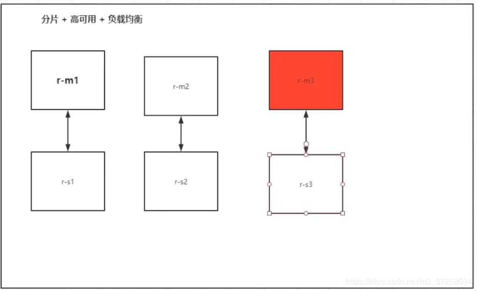

# Docker使用

## Docker常用命令

### 帮助命令

```bash
docker version    #显示docker版本
docker info       # 显示docker的系统信息，包括镜像和容器的数量
docker 命令 --help #帮助命令
```

>   https://docs.docker.com/reference/

### 镜像命令

-   docker images 查看所有本地主机上的镜像

```bash
[root@CentOS122 ubuntu]# docker images
REPOSITORY          TAG                 IMAGE ID            CREATED             SIZE
hello-world         latest              bf756fb1ae65        6 months ago        13.3kB
 
#解释
REPOSITORY          镜像的仓库源
TAG                 镜像的标签
IMAGE ID            镜像id
CREATED             镜像的创建时间
13.3kB              镜像的大小
 
#可选项
-a, --all            #列出所有镜像
-q, --quiet          #只显示镜像的id
```

-   docker search 搜索镜像

```bash
 ~$ docker search mysql
NAME                              DESCRIPTION                                     STARS               OFFICIAL            AUTOMATED
mysql                             MySQL is a widely used, open-source relation…   9931                [OK]                
mariadb                           MariaDB is a community-developed fork of MyS…   3634                [OK]                
mysql/mysql-server                Optimized MySQL Server Docker images. Create…   723                                     [OK]
percona                           Percona Server is a fork of the MySQL relati…   508                 [OK]                
centos/mysql-57-centos7           MySQL 5.7 SQL database server                   83                                      
mysql/mysql-cluster               Experimental MySQL Cluster Docker images. Cr…   75                                      
centurylink/mysql                 Image containing mysql. Optimized to be link…   61                                      [OK]
bitnami/mysql                     Bitnami MySQL Docker Image                      44                                      [OK]
deitch/mysql-backup               REPLACED! Please use http://hub.docker.com/r…   41                                      [OK]
tutum/mysql                       Base docker image to run a MySQL database se…   35                                      
prom/mysqld-exporter                                                              31                                      [OK]
schickling/mysql-backup-s3        Backup MySQL to S3 (supports periodic backup…   30                                      [OK]
databack/mysql-backup             Back up mysql databases to... anywhere!         30                                      
linuxserver/mysql                 A Mysql container, brought to you by LinuxSe…   25                                      
centos/mysql-56-centos7           MySQL 5.6 SQL database server                   20                                      
circleci/mysql                    MySQL is a widely used, open-source relation…   19                                      
mysql/mysql-router                MySQL Router provides transparent routing be…   16                                      
arey/mysql-client                 Run a MySQL client from a docker container      14                                      [OK]
fradelg/mysql-cron-backup         MySQL/MariaDB database backup using cron tas…   8                                       [OK]
openshift/mysql-55-centos7        DEPRECATED: A Centos7 based MySQL v5.5 image…   6                                       
devilbox/mysql                    Retagged MySQL, MariaDB and PerconaDB offici…   3                                       
ansibleplaybookbundle/mysql-apb   An APB which deploys RHSCL MySQL                2                                       [OK]
jelastic/mysql                    An image of the MySQL database server mainta…   1                                       
widdpim/mysql-client              Dockerized MySQL Client (5.7) including Curl…   1                                       [OK]
monasca/mysql-init                A minimal decoupled init container for mysql    0                                       

#解释
Options:
  -f, --filter filter   Filter output based on conditions provided
      --format string   Pretty-print search using a Go template
      --limit int       Max number of search results (default 25)
      --no-trunc        Don't truncate output

 ~$ sudo docker search -f=STARS=3000 mysql
NAME                DESCRIPTION                                     STARS               OFFICIAL            AUTOMATED
mysql               MySQL is a widely used, open-source relation…   9931                [OK]                
mariadb             MariaDB is a community-developed fork of MyS…   3634                [OK]                
```

-   docker pull 下载镜像

```bash
# 下载镜像 docker pull 镜像名[:tag]
[root@CentOS122 ubuntu]# docker pull tomcat:8
8: Pulling from library/tomcat #如果不写tag，默认就是latest
90fe46dd8199: Already exists   #分层下载： docker image 的核心 联合文件系统
35a4f1977689: Already exists 
bbc37f14aded: Already exists 
74e27dc593d4: Already exists 
93a01fbfad7f: Already exists 
1478df405869: Pull complete 
64f0dd11682b: Pull complete 
68ff4e050d11: Pull complete 
f576086003cf: Pull complete 
3b72593ce10e: Pull complete 
Digest: sha256:0c6234e7ec9d10ab32c06423ab829b32e3183ba5bf2620ee66de866df640a027  # 签名 防伪
Status: Downloaded newer image for tomcat:8
docker.io/library/tomcat:8 #真实地址
 
#等价于
docker pull tomcat:8
docker pull docker.io/library/tomcat:8
```

docker rmi 删除镜像

```bash
$ docker rmi -f bf756fb1ae65     #删除指定镜像
$ docker rmi -f 容器id 容器id ... #删除多个容器
$ docker rmi -f $(docker images -aq) #删除全部的容器
```

### 容器命令

有了镜像才可以创建容器

-   docker run 新建容器并启动

```bash
docker run [可选参数] image
 
#参数说明
--name="Nmae"    容器名字    tomcat01 toncat02. 用来区分容器
-d               后台方式运行
-it              使用交互式方式运行，进入容器查看内容
-p               指定容器的端口  -p 8080:8080
 1.   -p ip：主机端口：容器端口
 2.   -p 主机端口：容器端口（常用）
 3.   -p 容器端口
 4.    容器端口
-p               随机指定端口
```

测试：启动并进入容器

```bash
 ~$ sudo docker run -it centos /bin/bash
 [root@67de465e7b95 /]# ls
bin  dev  etc  home  lib  lib64  lost+found  media  mnt  opt  proc  root  run  sbin  srv  sys  tmp  usr  var
[root@67de465e7b95 /]# exit #退出容器
exit
```

-   docker ps 显示出所有运行的容器

```bash
#docker ps [可选参数] 
                #显示当前正在运行的容器
-a              #列出当前正在运行的容器+带出历史运行过的容器
-n=?            #显示最近创建的容器
-q              #只显示容器编号
    
 
$ docker ps
CONTAINER ID        IMAGE               COMMAND             CREATED             STATUS              PORTS               NAMES
$ docker ps -a
CONTAINER ID        IMAGE               COMMAND                  CREATED             STATUS                            PORTS                               NAMES
fe6cd8ee0d7b        centos              "/bin/bash"              3 minutes ago       Exited (130) About a minute ago                                       lucid_banach
5423b2d7463d        bf756fb1ae65        "/hello"                 50 minutes ago      Exited (0) 50 minutes ago                                             funny_keller
d4e3e35788fe        bf756fb1ae65        "/hello"                 23 hours ago        Exited (0) 23 hours ago                                               trusting_leavitt
c83ed1050c4a        mysql               "docker-entrypoint.s…"   9 days ago          Exited (255) 24 hours ago         0.0.0.0:3306->3306/tcp, 33060/tcp   mymysql
850e796a3e12        bf756fb1ae65        "/hello"                 10 days ago         Exited (0) 10 days ago                                                relaxed_nobel
 ~$ docker ps -n=1
CONTAINER ID        IMAGE               COMMAND             CREATED             STATUS                     PORTS               NAMES
fe6cd8ee0d7b        centos              "/bin/bash"              3 minutes ago       Exited (130) About a minute ago                                       lucid_banach
```

-   exit 退出容器

```bash
eixt #直接容器停止并退出
ctrl+p+q  #容器不停止退出
```

-   docker rm 删除容器

```bash
docker rm 容器id            #删除指定的容器，不能删除正在运行的容器；
docker rm -f 容器id         #强制删除正在运行的容器
docker rm -f $(docker ps -aq)      #删除所有容器
docker ps -a -q | xargs docker rm  #删除所有的容器
```

-   docker start 启动和停止容器的操作

```bash
docker start 容器id            #启动容器
docker restart 容器id          #重启容器
docker stop 容器id             #停止当前正在运行的容器
docker kill 容器id             #强制停止当前容器
```

### 其它命令

-   docker run -d 后台启动容器

```bash
#命令 docker run -d 命令
$ docker run -d centos
 
#问题docker ps 发现centos停止了
 
#常见的坑：docker容器使用后台启动，就必须要有一个前台的进程，docker发现没有应用，就会自动停止。
#nginx，容器启动后，发现自己没有提供服务，就会立刻停止，就是没有程序了
```

-   docker logs 查看日志

```bash
 #自己写一段脚本
$ docker run -d centos /bin/sh -c "while true;do echo abc;sleep 1;done"
#显示日志
-tf         #显示全部日志
--tail number #要显示的日志参数
$ docker logs -f --tail=200 60d2e46767cc
```

-   docker top 查看容器内部进程信息

```bash
$ docker top 5467d2706b3f
UID                 PID                 PPID                C                   STIME               TTY                 TIME                CMD
root                10484               10469               0                   06:35               ?                   00:00:00            /bin/sh -c while true;do echo shijun;sleep 1;done
root                10735               10484               0                   06:37               ?                   00:00:00            /usr/bin/coreutils --coreutils-pro
```

docker inspect 查看容器元数据

```bash
$ docker inspect 5467d2706b3f
[
    {
        "Id": "5467d2706b3f641d1101ca76332eea6b20a00ca5c5e37f033066c05e378be48a",
        "Created": "2020-07-09T22:35:13.490987912Z",
        "Path": "/bin/sh",
        "Args": [
            "-c",
            "while true;do echo abc;sleep 1;done"
        ],
        "State": {
            "Status": "running",
            "Running": true,
            "Paused": false,
            "Restarting": false,
            "OOMKilled": false,
            "Dead": false,
            "Pid": 10484,
            "ExitCode": 0,
            "Error": "",
            "StartedAt": "2020-07-09T22:35:15.253750561Z",
            "FinishedAt": "0001-01-01T00:00:00Z"
        },
        "Image": "sha256:831691599b88ad6cc2a4abbd0e89661a121aff14cfa289ad840fd3946f274f1f",
        "ResolvConfPath": "/var/lib/docker/containers/5467d2706b3f641d1101ca76332eea6b20a00ca5c5e37f033066c05e378be48a/resolv.conf",
        "HostnamePath": "/var/lib/docker/containers/5467d2706b3f641d1101ca76332eea6b20a00ca5c5e37f033066c05e378be48a/hostname",
        "HostsPath": "/var/lib/docker/containers/5467d2706b3f641d1101ca76332eea6b20a00ca5c5e37f033066c05e378be48a/hosts",
        "LogPath": "/var/lib/docker/containers/5467d2706b3f641d1101ca76332eea6b20a00ca5c5e37f033066c05e378be48a/5467d2706b3f641d1101ca76332eea6b20a00ca5c5e37f033066c05e378be48a-json.log",
        "Name": "/affectionate_heyrovsky",
        "RestartCount": 0,
        "Driver": "overlay2",
        "Platform": "linux",
        "MountLabel": "",
        "ProcessLabel": "",
        "AppArmorProfile": "",
        "ExecIDs": null,
        "HostConfig": {
            "Binds": null,
            "ContainerIDFile": "",
            "LogConfig": {
                "Type": "json-file",
                "Config": {}
            },
            "NetworkMode": "default",
            "PortBindings": {},
            "RestartPolicy": {
                "Name": "no",
                "MaximumRetryCount": 0
            },
            "AutoRemove": false,
            "VolumeDriver": "",
            "VolumesFrom": null,
            "CapAdd": null,
            "CapDrop": null,
            "Capabilities": null,
            "Dns": [],
            "DnsOptions": [],
            "DnsSearch": [],
            "ExtraHosts": null,
            "GroupAdd": null,
            "IpcMode": "private",
            "Cgroup": "",
            "Links": null,
            "OomScoreAdj": 0,
            "PidMode": "",
            "Privileged": false,
            "PublishAllPorts": false,
            "ReadonlyRootfs": false,
            "SecurityOpt": null,
            "UTSMode": "",
            "UsernsMode": "",
            "ShmSize": 67108864,
            "Runtime": "runc",
            "ConsoleSize": [
                0,
                0
            ],
            "Isolation": "",
            "CpuShares": 0,
            "Memory": 0,
            "NanoCpus": 0,
            "CgroupParent": "",
            "BlkioWeight": 0,
            "BlkioWeightDevice": [],
            "BlkioDeviceReadBps": null,
            "BlkioDeviceWriteBps": null,
            "BlkioDeviceReadIOps": null,
            "BlkioDeviceWriteIOps": null,
            "CpuPeriod": 0,
            "CpuQuota": 0,
            "CpuRealtimePeriod": 0,
            "CpuRealtimeRuntime": 0,
            "CpusetCpus": "",
            "CpusetMems": "",
            "Devices": [],
            "DeviceCgroupRules": null,
            "DeviceRequests": null,
            "KernelMemory": 0,
            "KernelMemoryTCP": 0,
            "MemoryReservation": 0,
            "MemorySwap": 0,
            "MemorySwappiness": null,
            "OomKillDisable": false,
            "PidsLimit": null,
            "Ulimits": null,
            "CpuCount": 0,
            "CpuPercent": 0,
            "IOMaximumIOps": 0,
            "IOMaximumBandwidth": 0,
            "MaskedPaths": [
                "/proc/asound",
                "/proc/acpi",
                "/proc/kcore",
                "/proc/keys",
                "/proc/latency_stats",
                "/proc/timer_list",
                "/proc/timer_stats",
                "/proc/sched_debug",
                "/proc/scsi",
                "/sys/firmware"
            ],
            "ReadonlyPaths": [
                "/proc/bus",
                "/proc/fs",
                "/proc/irq",
                "/proc/sys",
                "/proc/sysrq-trigger"
            ]
        },
        "GraphDriver": {
            "Data": {
                "LowerDir": "/var/lib/docker/overlay2/8a83580bdf045fa2c1bb55c34028f742a02b020f7714bd8a1378bfad4f48b03d-init/diff:/var/lib/docker/overlay2/b33aa1f4ccea184e655706729d226636fae2ae430e8b62029b77a394cf01d9e2/diff",
                "MergedDir": "/var/lib/docker/overlay2/8a83580bdf045fa2c1bb55c34028f742a02b020f7714bd8a1378bfad4f48b03d/merged",
                "UpperDir": "/var/lib/docker/overlay2/8a83580bdf045fa2c1bb55c34028f742a02b020f7714bd8a1378bfad4f48b03d/diff",
                "WorkDir": "/var/lib/docker/overlay2/8a83580bdf045fa2c1bb55c34028f742a02b020f7714bd8a1378bfad4f48b03d/work"
            },
            "Name": "overlay2"
        },
        "Mounts": [],
        "Config": {
            "Hostname": "5467d2706b3f",
            "Domainname": "",
            "User": "",
            "AttachStdin": false,
            "AttachStdout": false,
            "AttachStderr": false,
            "Tty": false,
            "OpenStdin": false,
            "StdinOnce": false,
            "Env": [
                "PATH=/usr/local/sbin:/usr/local/bin:/usr/sbin:/usr/bin:/sbin:/bin"
            ],
            "Cmd": [
                "/bin/sh",
                "-c",
                "while true;do echo shijun;sleep 1;done"
            ],
            "Image": "centos",
            "Volumes": null,
            "WorkingDir": "",
            "Entrypoint": null,
            "OnBuild": null,
            "Labels": {
                "org.label-schema.build-date": "20200611",
                "org.label-schema.license": "GPLv2",
                "org.label-schema.name": "CentOS Base Image",
                "org.label-schema.schema-version": "1.0",
                "org.label-schema.vendor": "CentOS"
            }
        },
        "NetworkSettings": {
            "Bridge": "",
            "SandboxID": "7e451d65a35c125c30411e95c39d3f65b9fd2b0ca565b1a6ca861f45b1873497",
            "HairpinMode": false,
            "LinkLocalIPv6Address": "",
            "LinkLocalIPv6PrefixLen": 0,
            "Ports": {},
            "SandboxKey": "/var/run/docker/netns/7e451d65a35c",
            "SecondaryIPAddresses": null,
            "SecondaryIPv6Addresses": null,
            "EndpointID": "1fb7a41df08f0e29e5eb35060cd3bea3a9864a077ac55b4c913bfb03ab2170ba",
            "Gateway": "172.17.0.1",
            "GlobalIPv6Address": "",
            "GlobalIPv6PrefixLen": 0,
            "IPAddress": "172.17.0.3",
            "IPPrefixLen": 16,
            "IPv6Gateway": "",
            "MacAddress": "02:42:ac:11:00:03",
            "Networks": {
                "bridge": {
                    "IPAMConfig": null,
                    "Links": null,
                    "Aliases": null,
                    "NetworkID": "d7bfe3e3aca1d28ee0b0835b1541f344c93ce4de021d306eca5c1144bd068749",
                    "EndpointID": "1fb7a41df08f0e29e5eb35060cd3bea3a9864a077ac55b4c913bfb03ab2170ba",
                    "Gateway": "172.17.0.1",
                    "IPAddress": "172.17.0.3",
                    "IPPrefixLen": 16,
                    "IPv6Gateway": "",
                    "GlobalIPv6Address": "",
                    "GlobalIPv6PrefixLen": 0,
                    "MacAddress": "02:42:ac:11:00:03",
                    "DriverOpts": null
                }
            }
        }
    }
]
```

-   docker exec -it 进入当前正在运行的容器

```bash
#方式一
$ docker exec -it 5467d2706b3f /bin/bash
[root@5467d2706b3f /]# ls
bin  dev  etc  home  lib  lib64  lost+found  media  mnt  opt  proc  root  run  sbin  srv  sys  tmp  usr  var
 
#方式二
$ docker attach 5467d2706b3f
 
区别：
#docker exec #进入当前容器后开启一个新的终端，可以在里面操作。（常用）
#docker attach # 进入容器当前正在执行的终端
```

-   docker cp 拷贝主机与容器间资源

```bash
$ docker exec -it 5705a9861f91 /bin/bash
[root@5705a9861f91 /]# ls
bin  dev  etc  home  lib  lib64  lost+found  media  mnt  opt  proc  root  run  sbin  srv  sys  tmp  usr  var
[root@5705a9861f91 /]# touch tmp
[root@5705a9861f91 /]# echo 'abc' > tmp.java
[root@5705a9861f91 /]# ls -a
.  ..  .dockerenv  bin  dev  etc  home  lib  lib64  lost+found  media  mnt  opt  proc  root  run  sbin  srv  sys  tmp  tmp.java  usr  var
[root@5705a9861f91 /]# exit
exit
#将容器内的资源拷贝到主机
$ docker cp 5705a9861f91:tmp.java /home
 
#将主机中的资源拷贝到容器内
$ docker cp /home/tmp.java 5705a9861f91:tmp
```


```bash
Usage:	docker [OPTIONS] COMMAND

A self-sufficient runtime for containers

Options:
      --config string      Location of client config files (default "/home/sxn/.docker")
  -c, --context string     Name of the context to use to connect to the daemon (overrides DOCKER_HOST env var and default
                           context set with "docker context use")
  -D, --debug              Enable debug mode
  -H, --host list          Daemon socket(s) to connect to
  -l, --log-level string   Set the logging level ("debug"|"info"|"warn"|"error"|"fatal") (default "info")
      --tls                Use TLS; implied by --tlsverify
      --tlscacert string   Trust certs signed only by this CA (default "/home/sxn/.docker/ca.pem")
      --tlscert string     Path to TLS certificate file (default "/home/sxn/.docker/cert.pem")
      --tlskey string      Path to TLS key file (default "/home/sxn/.docker/key.pem")
      --tlsverify          Use TLS and verify the remote
  -v, --version            Print version information and quit

Management Commands:
  builder     Manage builds
  config      Manage Docker configs
  container   Manage containers
  context     Manage contexts
  engine      Manage the docker engine
  image       Manage images
  network     Manage networks
  node        Manage Swarm nodes
  plugin      Manage plugins
  secret      Manage Docker secrets
  service     Manage services
  stack       Manage Docker stacks
  swarm       Manage Swarm
  system      Manage Docker
  trust       Manage trust on Docker images
  volume      Manage volumes

Commands:
  attach      Attach local standard input, output, and error streams to a running container
  build       Build an image from a Dockerfile
  commit      Create a new image from a container's changes
  cp          Copy files/folders between a container and the local filesystem
  create      Create a new container
  diff        Inspect changes to files or directories on a container's filesystem
  events      Get real time events from the server
  exec        Run a command in a running container
  export      Export a container's filesystem as a tar archive
  history     Show the history of an image
  images      List images
  import      Import the contents from a tarball to create a filesystem image
  info        Display system-wide information
  inspect     Return low-level information on Docker objects
  kill        Kill one or more running containers
  load        Load an image from a tar archive or STDIN
  login       Log in to a Docker registry
  logout      Log out from a Docker registry
  logs        Fetch the logs of a container
  pause       Pause all processes within one or more containers
  port        List port mappings or a specific mapping for the container
  ps          List containers
  pull        Pull an image or a repository from a registry
  push        Push an image or a repository to a registry
  rename      Rename a container
  restart     Restart one or more containers
  rm          Remove one or more containers
  rmi         Remove one or more images
  run         Run a command in a new container
  save        Save one or more images to a tar archive (streamed to STDOUT by default)
  search      Search the Docker Hub for images
  start       Start one or more stopped containers
  stats       Display a live stream of container(s) resource usage statistics
  stop        Stop one or more running containers
  tag         Create a tag TARGET_IMAGE that refers to SOURCE_IMAGE
  top         Display the running processes of a container
  unpause     Unpause all processes within one or more containers
  update      Update configuration of one or more containers
  version     Show the Docker version information
  wait        Block until one or more containers stop, then print their exit codes

Run 'docker COMMAND --help' for more information on a command.
```

## 可视化

```bash
docker run -d -p 8088:9000 --restart=always -v /var/run/docker.sock:/var/run/docker.sock --privileged=true portainer/portainer
```

-   访问测试：http://ip:8088/


## Docker镜像

### 镜像

镜像是一种轻量级、可执行的独立软件包，用来打包软件运行环境和基于运行环境开发的软件，它包含运行某个软件所需的所有内容，包括代码、运行时、库、环境变量和配置文件。

所有的应用，直接打包docker镜像，就可以直接跑起来！

**如何得到镜像**

-   从远程仓库下载
-   直接拷贝
-   自己制作一个镜像DockerFile

### 镜像加载原理

**UnionFS（联合文件系统）**

UnionFS（联合文件系统）：Union文件系统（UnionFS）是一种分层、轻量级并且高性能的文件系统，他支持对文件系统的修改作为一次提交来层层的叠加，同事可以将不同目录挂载到同一个虚拟文件系统下。Union文件系统是Docker镜像的基础。镜像可以通过分层来进行继承，基于基础镜像（没有父镜像），可以制作各种具体的应用镜像。

我们下载的时候看到的一层层就是这个！

特性：一次同时加载多个文件系统，但外面看起来，只能看到一个文件系统联合加载会把各层文件系统叠加起来，这样最终的文件系统会包含所有底层的文件和目录。

Docker镜像加载原理 docker的镜像实际上是由一层一层的文件系统组成，这就是层级的文件系统UnionFS。

bootfs（boot file system）主要包含bootloader和kernel，bootloader主要是引导加kernel，linux刚开始启动时，会加载bootfs文件系统，在Docker镜像的底层是boots.这一层与我们典型的Linux/Unix系统是一样的，包含boot加载器和内核。当boot加载完成之后整个内核就在内存中了，此时内存的使用权就已经由bootfs转交给内核，此时系统也会卸载bootfs。

rootfs（root file system），在bootfs之上。包含的就是典型linux系统的、dev,/proc,/bin,/etc等标准目录和文件。rootfs就是各种不同操作系统的发行版本，比如ubuntu,Centos等等。


平时我们安装进虚拟机的CentOS都要好几个G，为什么Docker这里才200M？

对于精简的OS，rootfs可以很小，只需要包含最基本的命令，工具和程序库就可以了，因为底层直接用Host的kernel，自己只需要提供rootfs就可以了。由此可见对于不同的linux发行版，bootfs基本是一致的，rootfs会有差别，因此不同的发行版可以共用bootfs。

虚拟机是分钟级别，容器是秒级！

### 分层

```bash
# docker pull redis
Using default tag: latest
latest: Pulling from library/redis
8559a31e96f4: Already exists
85a6a5c53ff0: Pull complete
b69876b7abed: Pull complete
a72d84b9df6a: Pull complete
5ce7b314b19c: Pull complete
04c4bfb0b023: Pull complete
Digest: sha256:800f2587bf3376cb01e6307afe599ddce9439deafbd4fb8562829da96085c9c5
Status: Downloaded newer image for redis:latest
docker.io/library/redis:latest
```

分层结构：最大的好处，是资源的共享。比如有多个镜像都从相同的Base镜像构建而来，那么宿主机只需在磁盘上保留一份base镜像，同时内存中也只需要加载一份base镜像，这样就可以为所有的容器服务了，而且镜像的每一层都可以被共享。

可以通过docker image inspect命令查看镜像分层

```bash
# docker inspect redis
```


理解：

所有的Docker镜像都起始于一个基础镜像层，当进行修改或增加新的容器时，就会在当前镜像层之上，创建新的镜像层。

举个简单的例子，加入基于Ubuntu Linux 16.04创建一个新的镜像，这就是新镜像的第一层；如果在该镜像中添加Python包，就会在基础镜像层之上创建第二个镜像层；如果继续添加安全补丁，就会创建第三个镜像层。


在添加额外的镜像层的同事，镜像始终保持是当前所有镜像的组合，理解这一点非常重要。下图中举例了一个简单的例子，么一个镜像层包含3个文件，二井巷包含了来自两个镜像层的6个文件。


上图中的镜像层跟之前途中的略有区别，主要目的是便于展示文件。

下图中展示了一个稍微复杂的三层镜像，在外部看来整个镜像只有6个文件，这是因为最上层的文件7是文件5的更新版本。


这种情况下，上层镜像层中的文件覆盖了底层镜像中的文件。这样就是的文件的更新版本作为一个新镜像层添加到镜像当中。

Docker通过存储影响（新版本采用快照机制）的方式来实现镜像层堆栈，并保证多镜像层对外展示为统一的文件系统。

Linux上可用的存储引擎有AUFS、Overlay2、Device Mapper、Btrfs，顾名思义，每一种存储引擎都给予Linux中对应的文件系统或者块设备技术，并且每种存储引擎都有其独有的性能给你特点。

Docker 在windows上仅支持windowsfilter一种存储引擎，该引擎基于NTFS文件系统之上实现了分层和CoW。

下图展示了与系统显示相同的三次镜像。所有的镜像层堆叠并合并，对外提供统一视图。


特点

DOcker镜像都是只读的，当容器启动时，一个新的可写层被加载到镜像的顶部！

这一层就是我们通常说的容器层，容器之下都叫镜像层！


### Commit镜像

docker commit 提交容器成为一个新的副本（镜像）

```bash
#命令和git原理相似
docker commit -m="提交的描述信息" -a="作者" 容器id 目标镜像名：[TAG]
```

**实战**

```bash
# 1、启动一个默认的tomcat
docker run -d -p 8080:8080 tomcat
# 2、发现这个默认的tomcat 是没有webapps应用，官方的镜像默认webapps下面是没有文件的！
docker exec -it 容器id
# 3、拷贝文件进去
 cp -r #source #target
# 4、将操作过的容器通过commit调教为一个镜像！我们以后就使用我们修改过的镜像即可，这就是我们自己的一个修改的镜像。
docker commit -m="描述信息" -a="作者" 容器id 目标镜像名:[TAG]
docker commit -a="abc" -m="add webapps app" 容器id tomcat02:1.0
```


如果你想要保存当前容器的状态，就可以通过commit来提交，获得一个镜像，就好比我们我们使用虚拟机的快照。

## 容器数据卷

### 什么是容器数据卷

docker的理念--将应用和环境打包成一个镜像

数据？如果数据都在容器中，那么我们删除容器，数据就会丢失。需求：数据可以持久化

Mysql，容器删了，数据没了！：需求：Mysql数据可以存储到本地

容器之间可以有一个**数据共享**的技术，Docker容器中产生的数据，同步到本地。

这就是卷技术：目录的挂载，将我们容器内的目录，挂载到Linux上面。


总结一句话：容器的持久化和同步操作！容器间也是可以数据共享的！

### 使用数据卷

```bash
#命令
docker run -it -v 主机目录:容器目录
 
#测试
[root@CentOS122 ubuntu]# docker run -it -v /home/ceshi:/home centos /bin/bash
 
#启动起来的时候我们可以通过docker inspect 容器id 查看容器卷挂载情况
[root@CentOS122 ceshi]# docker inspect 71727d6777f2
```


测试文件同步


再来测试！

1.  停止容器
2.  宿主机上修改文件
3.  启动容器
4.  容器内的数据依旧是同步的！


**ps:删除容器，外部挂载目录依旧存在，不会被删除！** 

好处：我们以后修改只需要在本地修改即可，容器内会自动同步的！

-   MySQL的数据卷持久化问题

```bash
# 获取镜像1.4具名和匿名挂载
 
#运行容器，需要做数据卷挂载！
#安装启动mysql，需要配置密码的，这一点需要注意！
 
#官方测试：
docker run --name some-mysql -v /my/custom:/etc/mysql/conf.d -e MYSQL_ROOT_PASSWORD=my-secret-pw -d mysql:tag
 
#启动我们的mysql
-d 后台运行
-p 端口映射
-v 卷挂载
-e 环境配置
--name 容器名字
[root@CentOS122 ceshi]# docker run -d -p 3306:3306 -v /home/mysql/conf:/etc/mysql/conf.d -v /home/mysql/data:/var/lib/mysql -e MYSQL_ROOT_PASSWORD=123456 --name mysql01 mysql
 
#启动成功之后，我们在本地使用sqlyog来测试
#sqlyog-连接到服务器
 
#测试在本地创建一个数据库，查看我们映射路径是否ok！
```

### 具名和匿名挂载

```bash
#匿名挂载
-v 容器内路径
[root@CentOS122 data]# docker run -d --name nginx01 -v /etc/nginx nginx
 
#查看所有的volume的情况
[root@CentOS122 data]# docker volume ls
DRIVER              VOLUME NAME
local               0a72cab3a7ecd61ae86d666c4c3fc364d820613ab7705fd38f84636608a7d90c
local               004e9827898f77d10b68198ebc3c3e153e63b81ef426b8bdf1afa6c494ff5844
#这里发现，就是匿名挂载，我们在-v只写了容器内的路径，没有写容器外的路径
 
#具名挂载
[root@CentOS122 data]# docker run -d --name nginx01 -v juming-nginx:/etc/nginx nginx
 
[root@CentOS122 data]# docker ps
CONTAINER ID        IMAGE               COMMAND                  CREATED             STATUS              PORTS                               NAMES
8b503354ae5b        nginx               "/docker-entrypoint.…"   3 seconds ago       Up 2 seconds        80/tcp                              nginx01
 
[root@CentOS122 data]# docker volume ls
DRIVER              VOLUME NAME
local               juming-nginx
 
#通过-v 卷名:容器内路径
#查看这个卷
[root@CentOS122 data]# docker volume inspect 8b503354ae5b
```


所有的docker容器内的卷，没有指定目录的情况下都是在/var/lib/docker/volumes/xxx/_data

我们可以通过具名挂载可以方便的找到我们的一个卷，大多数情况下使用具名挂载！

```bash
#如何确定具名挂载还是匿名挂载，试试指定路径挂载！
-v 容器内路径         #匿名挂载
-v 卷名：容器内路径    #具名挂载
-v 、宿主机路径：容器内路径 #指定路径挂载
```

拓展：

```bash
# 通过-v 容器内路径：ro rw 改变读写权限
ro readonly #只读
rw readwrite #可读可写
 
#一旦这里设置了容器权限，容器对我们挂载出来的内容就有限制了！
[root@CentOS122 data]# docker run -d --name nginx02 -v juming-nginx:/etc/nginx:ro nginx
[root@CentOS122 data]# docker run -d --name nginx02 -v juming-nginx:/etc/nginx:rw nginx
 
#ro 只要看到ro就说嘛这个路径只能通过宿主机来操作，容器内是无法操作的！
```

### 初始DockerFile

DockerFile就是用来构建docker镜像的构建稳健！命令脚本！先体验一下！

通过这个脚本可以生成镜像，镜像是一层一层的，脚本是一个一个的命令，每一个命令都是一层。

```
#创建一个dockerfile文件，名字可以随机，建议dockerfile
#文件内容
FROM centos
VOLUME ["volume01","volume02"]

 
CMD echo "------end------"
CMD /bin/bash
 
#这里的命令，一句就是镜像的一层
```


```bash
#启动自己写的容器
[root@CentOS122 home]# docker run -it 1fc3c9d5d5d5 /bin/bash
```


这个卷和外部一定有一个同步的目录！

查看一下卷挂载路径：

```bash
[root@CentOS122 ubuntu]# docker inspect 7e208a8caaa0
```


测试一下刚才的文件是否同步出去了！

这种方式我们未来使用的很多，因为我们通常会构建自己的镜像！

假设构建镜像的时候没有过挂载卷，要手动挂载 -v 卷名:容器内路径！

### 数据卷容器

多个mysql同步数据！


-   启动三个容器，通过我们刚才自己写的镜像启动


测试：可以删除docker01，查看一下docker02和docker03是否还可以访问这个文件？

测试的结果：依旧可以访问！


容器之间配置信息的传递，数据卷容器的生命周期一直延续到没有容器使用为止。

但是一旦持久化到本地，这个时候，**本地数据不会删除的**！

## DockerFile

### DockerFile介绍

dockerfile是用来构建docker镜像的文件！命令参数脚本！

构建步骤：

1.  编写一个dockerfile文件
2.  docker build构建成为一个镜像
3.  docker run运行镜像
4.  docker push 发布镜像（DockerHub、阿里云镜像仓库！）


很多官方镜像都是基础包，很多功能没有，我们通常会自己搭建自己的镜像！

官方既然可以制作镜像，那我们也可以！

### DockerFile构建过程

基础知识：

1.  每个保留关键字（指令）都必须是大写字母；
2.  执行从上到下顺序执行
3.  \#表示注释
4.  每一个指令都会创建提交一个新的镜像层，并提交！


dockerfile是没想开发的，我们以后要发布项目，做镜像，就需要编写dockerfile，这个文件很简单！

Docker镜像逐渐成为企业交付的标准，必须要掌握！

步骤：开发，部署，运维......缺一不可！

DockerFile：构建稳健，定义了一切的步骤，源代码；

DockerImages：通过DockerFile构件生成的镜像，最终发布和运行的产品！

Docker容器：容器就是镜像运行起来提供服务的服务器。

### DockerFile的指令

```bash
FROM                #基础镜像，一切从这里开始构建 centos
MAINTAINTER         #镜像是谁写的，姓名+邮箱
RUN                 #镜像构建的时候需要运行的命令
ADD                 #步骤：tomcat镜像，这个tomcat压缩包！添加内容
WORKDIR             #镜像的工作目录
VOLUME              #挂载的目录
EXPOSE              #暴露端口配置
CMD                 #指定这个容器启动的时候要运行的命令，只有最后一次会生效，可被替换
ENTERPOINT          #指定这个容器启动的时候要运行的命令，可追加命令
ONBUILD             #当构建一个被继承DockerFile这个时候就会运行ONBUILD的指令。触发指令
COPY                #类似ADD，当我们文件拷贝到镜像中
ENV                 #构建的时候设置环境变量
```


### 实战测试

Docker Hub中99%的镜像都是从这个基础镜像过来的FROM scratch，然后配置需要的软件和配置进行的构建。


-   创建一个自己的centos

```bash
# 1 、编写dockerfile的文件
FROM centos
MAINTAINER sj@string
 
ENV MYPATH /usr/local
WORKDIR $MYPATH
 
RUN yum -y install vim
RUN yum -y install net-tools
 
EXPOSE 80
 
CMD echo $MYPATH
CMD echo "------end--------"
CMD /bin/bash
 
# 2、通过文件构建镜像
docker build -f centos-dockerfile -t mycentos:1.0 .
 
 
#测试运行
docker run -it mycentos:1.0
```

-   对比：

之前原生的centos


我们的镜像：


我么可以列出本地进行的变更历史：


我们平时拿到一个镜像，可以研究一下它是怎么做的？

**CMD和ENTRYPOINT区别**

```bash
CMD                 #指定这个容器启动的时候要运行的命令，只有最后一次会生效，可被替换
ENTERPOINT          #指定这个容器启动的时候要运行的命令，可追加命令
```

测试cmd

```bash
#编写dockerfile文件
[root@CentOS122 home]# cat centos-cmd-dockerfile
FROM centos
 
CMD ["ls","-a"]
 
#构建镜像
[root@CentOS122 home]# docker build -f centos-cmd-dockerfile -t centos_cmd:1.0 .
Sending build context to Docker daemon  391.4MB
Step 1/2 : FROM centos
 ---> 831691599b88
Step 2/2 : CMD ["ls","-a"]
 ---> [Warning] IPv4 forwarding is disabled. Networking will not work.
 ---> Running in a542487e9c78
Removing intermediate container a542487e9c78
 ---> 09a93c904638
Successfully built 09a93c904638
Successfully tagged centos_cmd:1.0
 
#运行，发现我们的ls -a命令生效了
[root@CentOS122 home]# docker run centos_cmd
Unable to find image 'centos_cmd:latest' locally
docker: Error response from daemon: pull access denied for centos_cmd, repository does not exist or may require 'docker login': denied: requested access to the resource is denied.
See 'docker run --help'.
[root@CentOS122 home]# docker run centos_cmd:1.0
WARNING: IPv4 forwarding is disabled. Networking will not work.
.
..
.dockerenv
bin
dev
etc
home
lib
lib64
lost+found
media
mnt
opt
proc
root
run
sbin
srv
sys
tmp
usr
var
 
#想追加一个明亮 -l ，ls -al
[root@CentOS122 home]# docker run centos_cmd:1.0 -l
WARNING: IPv4 forwarding is disabled. Networking will not work.
docker: Error response from daemon: OCI runtime create failed: container_linux.go:349: starting container process caused "exec: \"-l\": executable file not found in $PATH": unknown.
ERRO[0000] error waiting for container: context canceled
 
#错误的原因
#CMD情形下， -l替换CMD ["ls","-a"]命令，而-l 不是命令，所以报错
```

**测试ENTERPOINT**

```bash
[root@CentOS122 home]# vim centos-entrypoint-dockerfile
[root@CentOS122 home]# docker build -f centos-entrypoint-dockerfile -t centos_entrypoint:1.0
"docker build" requires exactly 1 argument.
See 'docker build --help'.
 
Usage:  docker build [OPTIONS] PATH | URL | -
 
Build an image from a Dockerfile
[root@CentOS122 home]# docker build -f centos-entrypoint-dockerfile -t centos_entrypoint:1.0 .
Sending build context to Docker daemon  391.4MB
Step 1/2 : FROM centos
 ---> 831691599b88
Step 2/2 : ENTRYPOINT ["ls","-a"]
 ---> [Warning] IPv4 forwarding is disabled. Networking will not work.
 ---> Running in 445c47bb706a
Removing intermediate container 445c47bb706a
 ---> 2cbb97c27ac8
Successfully built 2cbb97c27ac8
Successfully tagged centos_entrypoint:1.0
[root@CentOS122 home]# docker run centos_entrypoint:1.0
WARNING: IPv4 forwarding is disabled. Networking will not work.
.
..
.dockerenv
bin
dev
etc
home
lib
lib64
lost+found
media
mnt
opt
proc
root
run
sbin
srv
sys
tmp
usr
var
[root@CentOS122 home]# docker run centos_entrypoint:1.0 -l
WARNING: IPv4 forwarding is disabled. Networking will not work.
total 0
drwxr-xr-x.   1 root root   6 Jul 12 05:08 .
drwxr-xr-x.   1 root root   6 Jul 12 05:08 ..
-rwxr-xr-x.   1 root root   0 Jul 12 05:08 .dockerenv
lrwxrwxrwx.   1 root root   7 May 11  2019 bin -> usr/bin
drwxr-xr-x.   5 root root 340 Jul 12 05:08 dev
drwxr-xr-x.   1 root root  66 Jul 12 05:08 etc
drwxr-xr-x.   2 root root   6 May 11  2019 home
lrwxrwxrwx.   1 root root   7 May 11  2019 lib -> usr/lib
lrwxrwxrwx.   1 root root   9 May 11  2019 lib64 -> usr/lib64
drwx------.   2 root root   6 Jun 11 02:35 lost+found
drwxr-xr-x.   2 root root   6 May 11  2019 media
drwxr-xr-x.   2 root root   6 May 11  2019 mnt
drwxr-xr-x.   2 root root   6 May 11  2019 opt
dr-xr-xr-x. 234 root root   0 Jul 12 05:08 proc
dr-xr-x---.   2 root root 162 Jun 11 02:35 root
drwxr-xr-x.  11 root root 163 Jun 11 02:35 run
lrwxrwxrwx.   1 root root   8 May 11  2019 sbin -> usr/sbin
drwxr-xr-x.   2 root root   6 May 11  2019 srv
dr-xr-xr-x.  13 root root   0 Jun 30 21:38 sys
drwxrwxrwt.   7 root root 145 Jun 11 02:35 tmp
drwxr-xr-x.  12 root root 144 Jun 11 02:35 usr
drwxr-xr-x.  20 root root 262 Jun 11 02:35 var
```

Dockerfile中很多命令都是十分的相似，我们需要了解他们的区别，我们最好的学习就是对比他们然后测试效果！

### 实战:tomcat镜像

1.  准备镜像文件toncat压缩包，jdk压缩包！
2.  编写dockerfile文件，官方明明dockerfile，build会自动

```bash
FROM centos #
MAINTAINER cheng<1204598429@qq.com>
COPY README /usr/local/README #复制文件
ADD jdk-8u231-linux-x64.tar.gz /usr/local/ #复制解压
ADD apache-tomcat-9.0.35.tar.gz /usr/local/ #复制解压
RUN yum -y install vim
ENV MYPATH /usr/local #设置环境变量
WORKDIR $MYPATH #设置工作目录
ENV JAVA_HOME /usr/local/jdk1.8.0_231 #设置环境变量
ENV CATALINA_HOME /usr/local/apache-tomcat-9.0.35 #设置环境变量
ENV PATH $PATH:$JAVA_HOME/bin:$CATALINA_HOME/lib #设置环境变量 分隔符是：
EXPOSE 8080 #设置暴露的端口
CMD /usr/local/apache-tomcat-9.0.35/bin/startup.sh && tail -F /usr/local/apache-tomcat-9.0.35/logs/catalina.out # 设置默认命令
```

3.  构建镜像

```bash
# 因为dockerfile命名使用默认命名 因此不用使用-f 指定文件
$ docker build -t mytomcat:0.1 .
```

4.  run镜像

```bash
$ docker run -d -p 8080:8080 --name tomcat01 -v /home/kuangshen/build/tomcat/test:/usr/local/apache-tomcat-9.0.35/webapps/test -v /home/kuangshen/build/tomcat/tomcatlogs/:/usr/local/apache-tomcat-9.0.35/logs mytomcat:0.1
```

5.  范文测试
6.  发布项目

由于做了卷挂载，我们直接在本地编写项目就可以发布了！

发现：项目部署成功，可以直接访问。

我们以后的开发步骤：需要掌握Dockerfile的编写！我们之后的一切都是使用docker镜像来发布运行的！

### 发布自己的镜像

Dockerhub

1.  地址：[hub.docker.com/](https://hub.docker.com/)
2.  确定账户可以登录
3.  登录

```bash
$ docker login --help
Usage:  docker login [OPTIONS] [SERVER]
 
Log in to a Docker registry.
If no server is specified, the default is defined by the daemon.
 
Options:
  -p, --password string   Password
      --password-stdin    Take the password from stdin
  -u, --username string   Username
```

1.  提交镜像

```bash
[root@CentOS122 tomcattest]# docker login -u dockerlearnsj
Password:
WARNING! Your password will be stored unencrypted in /root/.docker/config.json.
Configure a credential helper to remove this warning. See
https://docs.docker.com/engine/reference/commandline/login/#credentials-store
 
Login Succeeded
[root@CentOS122 tomcattest]# docker push tomcat02
The push refers to repository [docker.io/library/tomcat02]
b475618bf53f: Preparing
361fca1be245: Preparing
8caf7fc74a11: Preparing
a1c4399f9b22: Preparing
4f866e977815: Preparing
f73b2345c404: Waiting
f5181c7ef902: Waiting
2e5b4ca91984: Waiting
527ade4639e0: Waiting
c2c789d2d3c5: Waiting
8803ef42039d: Waiting
denied: requested access to the resource is denied
# 会发现push不上去，因为如果没有前缀的话默认是push到 官方的library
# 解决方法
# 第一种 build的时候添加你的dockerhub用户名，然后在push就可以放到自己的仓库了
$ docker build -t chengcoder/mytomcat:0.1 .
# 第二种 使用docker tag #然后再次push
$ docker tag 容器id chengcoder/mytomcat:1.0 #然后再次push
```

上传到阿里云镜像服务器上

看官网 很详细https://cr.console.aliyun.com/repository/

```bash
$ sudo docker login --username=zchengx registry.cn-shenzhen.aliyuncs.com
$ sudo docker tag [ImageId] registry.cn-shenzhen.aliyuncs.com/dsadxzc/cheng:[镜像版本号]
# 修改id 和 版本
sudo docker tag a5ef1f32aaae registry.cn-shenzhen.aliyuncs.com/dsadxzc/cheng:1.0
# 修改版本
$ sudo docker push registry.cn-shenzhen.aliyuncs.com/dsadxzc/cheng:[镜像版本号]
```


docker save 命令 ：将镜像打包成一个tar压缩包，可以送给别人

docker load 命令：解压tar包成镜像

## Docker网络

### 理解Docker

情况所有网络

```bash
#情况所有容器
[root@CentOS122 tomcattest]# docker rm -f $(docker ps -aq)
 
#删除所有镜像
[root@CentOS122 tomcattest]# docker rmi -f $(docker images -aq)
```

测试


三个网路

问题：docker日如何处理容器内网路访问？


```bash
#测试运行一个tomcat
[root@CentOS122 ubuntu]# docker run -d --name tomcat01 tomcat
WARNING: IPv4 forwarding is disabled. Networking will not work.
ad894daf4d6be03a30e370022ee936a8f8c9e76a84e9e899c6f2ee729418acda
[root@CentOS122 ubuntu]# docker ps
CONTAINER ID        IMAGE               COMMAND             CREATED             STATUS              PORTS               NAMES
ad894daf4d6b        tomcat              "catalina.sh run"   3 seconds ago       Up 2 seconds        8080/tcp            tomcat01
 
#查看宿主机网络
[root@CentOS122 ubuntu]# ip addr
1: lo: <LOOPBACK,UP,LOWER_UP> mtu 65536 qdisc noqueue state UNKNOWN group default qlen 1000
    link/loopback 00:00:00:00:00:00 brd 00:00:00:00:00:00
    inet 127.0.0.1/8 scope host lo
       valid_lft forever preferred_lft forever
    inet6 ::1/128 scope host
       valid_lft forever preferred_lft forever
2: ens32: <BROADCAST,MULTICAST,UP,LOWER_UP> mtu 1500 qdisc pfifo_fast state UP group default qlen 1000
    link/ether 00:50:56:29:0e:06 brd ff:ff:ff:ff:ff:ff
    inet 192.168.31.121/24 brd 192.168.31.255 scope global noprefixroute ens32
       valid_lft forever preferred_lft forever
    inet6 fe80::a91:c749:1e4:c19a/64 scope link noprefixroute
       valid_lft forever preferred_lft forever
3: virbr0: <NO-CARRIER,BROADCAST,MULTICAST,UP> mtu 1500 qdisc noqueue state DOWN group default qlen 1000
    link/ether 52:54:00:8c:75:5c brd ff:ff:ff:ff:ff:ff
    inet 192.168.122.1/24 brd 192.168.122.255 scope global virbr0
       valid_lft forever preferred_lft forever
4: virbr0-nic: <BROADCAST,MULTICAST> mtu 1500 qdisc pfifo_fast master virbr0 state DOWN group default qlen 1000
    link/ether 52:54:00:8c:75:5c brd ff:ff:ff:ff:ff:ff
5: docker0: <BROADCAST,MULTICAST,UP,LOWER_UP> mtu 1500 qdisc noqueue state UP group default
    link/ether 02:42:15:3f:39:04 brd ff:ff:ff:ff:ff:ff
    inet 172.17.0.1/16 brd 172.17.255.255 scope global docker0
       valid_lft forever preferred_lft forever
    inet6 fe80::42:15ff:fe3f:3904/64 scope link
       valid_lft forever preferred_lft forever
9: veth85cd340@if8: <BROADCAST,MULTICAST,UP,LOWER_UP> mtu 1500 qdisc noqueue master docker0 state UP group default
    link/ether ee:1c:4e:71:63:d7 brd ff:ff:ff:ff:ff:ff link-netnsid 0
    inet6 fe80::ec1c:4eff:fe71:63d7/64 scope link
       valid_lft forever preferred_lft forever
 
#查看容器网络
[root@CentOS122 ubuntu]# docker exec -it ad894daf4d6b /bin/bash
root@ad894daf4d6b:/usr/local/tomcat# ip addr
1: lo: <LOOPBACK,UP,LOWER_UP> mtu 65536 qdisc noqueue state UNKNOWN group default qlen 1000
    link/loopback 00:00:00:00:00:00 brd 00:00:00:00:00:00
    inet 127.0.0.1/8 scope host lo
       valid_lft forever preferred_lft forever
#查看到容器内部网络地址 发现容器起送的时候会得到一个eth0@if9 ip地址，docker服务器分配得！
8: eth0@if9: <BROADCAST,MULTICAST,UP,LOWER_UP> mtu 1500 qdisc noqueue state UP group default
    link/ether 02:42:ac:11:00:02 brd ff:ff:ff:ff:ff:ff link-netnsid 0
    inet 172.17.0.2/16 brd 172.17.255.255 scope global eth0
       valid_lft forever preferred_lft forever
 
# 思考： linux能不能ping通容器内网路？可以的！
#       容器内可以ping通宿主机吗？可以的！
#容器内ping宿主机网络 
root@ad894daf4d6b:/usr/local/tomcat# ping 192.168.31.121
PING 192.168.31.121 (192.168.31.121) 56(84) bytes of data.
64 bytes from 192.168.31.121: icmp_seq=1 ttl=64 time=0.100 ms
64 bytes from 192.168.31.121: icmp_seq=2 ttl=64 time=0.064 ms
64 bytes from 192.168.31.121: icmp_seq=3 ttl=64 time=0.063 ms
64 bytes from 192.168.31.121: icmp_seq=4 ttl=64 time=0.074 ms
64 bytes from 192.168.31.121: icmp_seq=5 ttl=64 time=0.097 ms
^C
--- 192.168.31.121 ping statistics ---
5 packets transmitted, 5 received, 0% packet loss, time 4ms
rtt min/avg/max/mdev = 0.063/0.079/0.100/0.018 ms
root@ad894daf4d6b:/usr/local/tomcat# exit
exit
#宿主机ping容器网络
[root@CentOS122 ubuntu]# ping 172.17.02
PING 172.17.02 (172.17.0.2) 56(84) bytes of data.
64 bytes from 172.17.0.2: icmp_seq=1 ttl=64 time=0.105 ms
64 bytes from 172.17.0.2: icmp_seq=2 ttl=64 time=0.056 ms
^C
--- 172.17.02 ping statistics ---
2 packets transmitted, 2 received, 0% packet loss, time 1000ms
rtt min/avg/max/mdev = 0.056/0.080/0.105/0.026 ms
```

**原理：**

1.  我们没启动一个docker容器，docker就会给docker容器分配一个ip，我们只要安装了docker，就会有一个docker0桥接模式，使用的技术就是veth-pair技术！

再次测试ip addr


1.  再启动一个容器测试，发现又多一对网络

```bash
[root@CentOS122 ubuntu]# docker run -d --name tomcat02 tomcat
```


我们发现这个容器带来的网卡都是一对一对的；veth-pair就是一对的虚拟设备接口，它们都是成对出现的，一端连着协议，一端彼此相连；正因为又这个特性，veth-pair充当一个桥梁，链接各种虚拟网络设备的；OpenStack，docker容器之间的链接，OVS的链接都是使用veth-pair技术

1.  我们来测试一下tomcat01和tomcat02是否可以ping通

```bash
[root@CentOS122 ubuntu]# docker exec -it tomcat01 ip addr
1: lo: <LOOPBACK,UP,LOWER_UP> mtu 65536 qdisc noqueue state UNKNOWN group default qlen 1000
    link/loopback 00:00:00:00:00:00 brd 00:00:00:00:00:00
    inet 127.0.0.1/8 scope host lo
       valid_lft forever preferred_lft forever
8: eth0@if9: <BROADCAST,MULTICAST,UP,LOWER_UP> mtu 1500 qdisc noqueue state UP group default
    link/ether 02:42:ac:11:00:02 brd ff:ff:ff:ff:ff:ff link-netnsid 0
    inet 172.17.0.2/16 brd 172.17.255.255 scope global eth0
       valid_lft forever preferred_lft forever
[root@CentOS122 ubuntu]# docker exec -it tomcat02 ping 172.17.0.2
PING 172.17.0.2 (172.17.0.2) 56(84) bytes of data.
64 bytes from 172.17.0.2: icmp_seq=1 ttl=64 time=0.088 ms
64 bytes from 172.17.0.2: icmp_seq=2 ttl=64 time=0.058 ms
64 bytes from 172.17.0.2: icmp_seq=3 ttl=64 time=0.060 ms
^C
--- 172.17.0.2 ping statistics ---
3 packets transmitted, 3 received, 0% packet loss, time 1000ms
rtt min/avg/max/mdev = 0.058/0.068/0.088/0.016 ms
```


**结论：** tomcat01和tomcat02共用一个路由器，docker0。

所有容器在不指定网络的情况下，都是docker0路由的，docker会给我们容器分配一个默认的可用ip。

**小结：**

docker使用的事linux的桥接，宿主机是一个docker容器的网桥docker0.


docker中所有的网络接口都是虚拟的，虚拟的转发效率高（类比内网传递文件）

只要删除容器，对应的网桥一对就没了！

思考一个场景：我们编写了一个微服务，database url=ip: 项目不重启，数据ip换了，我们希望可以处理这个问题，可以通过名字来进行访问容器？

### --link

思考一个场景：

我们编写一个微服务，docker-url=ip；项目不重启，数据库ip换掉了，我们希望可以处理这个问题，可以使用名称来进行访问容器

```bash
#直接使用名称
[root@CentOS122 ubuntu]# docker exec -it tomcat02 ping tomcat01
ping: tomcat01: Temporary failure in name resolution
#运行一个tomcat03 --link tomcat02
[root@CentOS122 ubuntu]# docker run -d -P --name tomcat03 --link tomcat02 tomcat
WARNING: IPv4 forwarding is disabled. Networking will not work.
7cfa664b4b2ca259e5e000bd5663427c55beb1e41b13fbb8a0a2d1fd0980ff14
#用tomcat03 ping tomcat02 可以ping通
[root@CentOS122 ubuntu]# docker exec -it tomcat03 ping tomcat02
PING tomcat02 (172.17.0.3) 56(84) bytes of data.
64 bytes from tomcat02 (172.17.0.3): icmp_seq=1 ttl=64 time=0.088 ms
64 bytes from tomcat02 (172.17.0.3): icmp_seq=2 ttl=64 time=0.059 ms
^C
--- tomcat02 ping statistics ---
2 packets transmitted, 2 received, 0% packet loss, time 999ms
rtt min/avg/max/mdev = 0.059/0.073/0.088/0.016 ms
#反过来用tomcat02 ping tomcat03 ping不通
[root@CentOS122 ubuntu]# docker exec -it tomcat02 ping tomcat03
ping: tomcat03: Temporary failure in name resolution
```

探究：

docker network inspect 网络id 网段相同

```bash
#查看docker网络
[root@CentOS122 ubuntu]# docker network ls
NETWORK ID          NAME                DRIVER              SCOPE
16a626150777        bridge              bridge              local
68f5a8898e3d        host                host                local
9f153659223a        none                null                local
 
#查看该网段
[root@CentOS122 ubuntu]# docker network inspect 16a626150777
[
    {
        "Name": "bridge",
        "Id": "16a6261507776953aedfcfd61a7ba057222d9fd16723fa8130971c2c285c4895",
        "Created": "2020-06-28T21:20:39.606370089+08:00",
        "Scope": "local",
        "Driver": "bridge",
        "EnableIPv6": false,
        "IPAM": {
            "Driver": "default",
            "Options": null,
            "Config": [
                {
                    "Subnet": "172.17.0.0/16"
                }
            ]
        },
        "Internal": false,
        "Attachable": false,
        "Ingress": false,
        "ConfigFrom": {
            "Network": ""
        },
        "ConfigOnly": false,
        "Containers": {
            "26559243668d2c32855876a44f2180949decebd00eb8923106bc815325baecff": {
                "Name": "tomcat02",
                "EndpointID": "38159301d629bad1f45ed6f8564fdc625d69d7b67b454259b96d820ab206ef1a",
                "MacAddress": "02:42:ac:11:00:03",
                "IPv4Address": "172.17.0.3/16",
                "IPv6Address": ""
            },
            "7cfa664b4b2ca259e5e000bd5663427c55beb1e41b13fbb8a0a2d1fd0980ff14": {
                "Name": "tomcat03",
                "EndpointID": "9bf0c29be3a7754b8cf85c620f74fbdcc15011124b1d5a7766148ca91936be12",
                "MacAddress": "02:42:ac:11:00:04",
                "IPv4Address": "172.17.0.4/16",
                "IPv6Address": ""
            },
            "ad894daf4d6be03a30e370022ee936a8f8c9e76a84e9e899c6f2ee729418acda": {
                "Name": "tomcat01",
                "EndpointID": "8292f1534d07f54cdfa307ee1d2919e87dc51819e8ff6e5b15e36754e6d9acf2",
                "MacAddress": "02:42:ac:11:00:02",
                "IPv4Address": "172.17.0.2/16",
                "IPv6Address": ""
            }
        },
        "Options": {
            "com.docker.network.bridge.default_bridge": "true",
            "com.docker.network.bridge.enable_icc": "true",
            "com.docker.network.bridge.enable_ip_masquerade": "true",
            "com.docker.network.bridge.host_binding_ipv4": "0.0.0.0",
            "com.docker.network.bridge.name": "docker0",
            "com.docker.network.driver.mtu": "1500"
        },
        "Labels": {}
    }
]
```


```bash
[root@CentOS122 ubuntu]# docker inspect 7cfa664b4b2c
```


查看tomcat03里面的/etc/hosts发现又tomcat02的配置：

```bash
[root@CentOS122 ubuntu]# docker exec -it tomcat03 cat /etc/hosts
127.0.0.1       localhost
::1     localhost ip6-localhost ip6-loopback
fe00::0 ip6-localnet
ff00::0 ip6-mcastprefix
ff02::1 ip6-allnodes
ff02::2 ip6-allrouters
172.17.0.3      tomcat02 26559243668d
172.17.0.4      7cfa664b4b2c
```

--link本质就是在hosts配置中添加映射！

现在使用docker已经不建议使用--link了。

自定义网络，不适用docker0！

docker0问题：不支持容器名连接访问！

### 自定义网络

查看所有的docker网络

```bash
#查看所有的docker网络
[root@CentOS122 ubuntu]# docker network ls
NETWORK ID          NAME                DRIVER              SCOPE
16a626150777        bridge              bridge              local
68f5a8898e3d        host                host                local
9f153659223a        none                null                local
```

**网络模式：**

briage：桥接模式docker（默认，自己创建也是用bridge模式）

none：不配置网络，一般不用

host：和所有主机共享网络

container：容器网络连通（用得少！局限性大）

测试

```bash
#我们直接使用启动命令 --net bridge，而这个就是我们的docker0
#bridge就是docker0
[root@CentOS122 ubuntu]# docker run -d -P --name tomcat01 tomcat
#===》等价于docker run -d -P --name tomcat01 --net bridge tomcat 

```

**问题：docker0的特点默认域名不能访问。--link可以打通连接，但是很麻烦！**

我们可以自定义网络：

```bash
[root@CentOS122 ubuntu]# docker network create --driver bridge --subnet 192.168.0.0/16 --gateway 192.168.0.1 mynet
543a2a281ee2eb5b12c4180a8b6a09b25f15602361ec3943202d28891d883335
 
[root@CentOS122 ubuntu]# docker network ls
NETWORK ID          NAME                DRIVER              SCOPE
16a626150777        bridge              bridge              local
68f5a8898e3d        host                host                local
543a2a281ee2        mynet               bridge              local
9f153659223a        none                null                local
```

### 输入命令

```bash
docker network inspect mynet
```


启动两个tomcat，再次查看网络情况：

```bash
[root@CentOS122 ubuntu]# docker run -d -P --name tomcat-net-01 --net mynet tomcat
WARNING: IPv4 forwarding is disabled. Networking will not work.
6e1dd326db4c97cf3750d31a8addc9b40f65e7f0d34879b9ee616608323ae7c2
[root@CentOS122 ubuntu]# docker run -d -P --name tomcat-net-02 --net mynet tomcat
WARNING: IPv4 forwarding is disabled. Networking will not work.
9b6e4ec6ddf6da5ad2e0ae1ab45707d41d877641b364595a15b376f439867857
```


在自定义网络下，服务可以互相ping通，不用使用--link

```bash
[root@CentOS122 ubuntu]# docker exec -it tomcat-net-01 ping tomcat-net-02
PING tomcat-net-02 (192.168.0.3) 56(84) bytes of data.
64 bytes from tomcat-net-02.mynet (192.168.0.3): icmp_seq=1 ttl=64 time=0.087 ms
64 bytes from tomcat-net-02.mynet (192.168.0.3): icmp_seq=2 ttl=64 time=0.061 ms
^C
--- tomcat-net-02 ping statistics ---
2 packets transmitted, 2 received, 0% packet loss, time 1000ms
rtt min/avg/max/mdev = 0.061/0.074/0.087/0.013 ms
[root@CentOS122 ubuntu]# docker exec -it tomcat-net-02 ping tomcat-net-01
PING tomcat-net-01 (192.168.0.2) 56(84) bytes of data.
64 bytes from tomcat-net-01.mynet (192.168.0.2): icmp_seq=1 ttl=64 time=0.068 ms
64 bytes from tomcat-net-01.mynet (192.168.0.2): icmp_seq=2 ttl=64 time=0.105 ms
^C
--- tomcat-net-01 ping statistics ---
2 packets transmitted, 2 received, 0% packet loss, time 2ms
rtt min/avg/max/mdev = 0.068/0.086/0.105/0.020 ms
```

我们自定义网络docker当我们维护好了对应的关系，推荐我们平时这样使用网络！

好处：

redis -不同的集群 使用不同的网络，保证集群是安全的和健康的！

mysql-不同的集群使用不同的网络，保证集群是安全的和健康的！


### 网络连通

```bash
[root@CentOS122 ubuntu]# docker network --help
 
Usage:  docker network COMMAND
 
Manage networks
 
Commands:
  connect     Connect a container to a network   #链接一个容器到一个网络
  create      Create a network
  disconnect  Disconnect a container from a network
  inspect     Display detailed information on one or more networks
  ls          List networks
  prune       Remove all unused networks
  rm          Remove one or more networks
 
Run 'docker network COMMAND --help' for more information on a command.
```

### 查看命令

```bash
[root@CentOS122 ubuntu]# docker network connect --help
 
Usage:  docker network connect [OPTIONS] NETWORK CONTAINER
 
Connect a container to a network
 
Options:
      --alias strings           Add network-scoped alias for the container
      --driver-opt strings      driver options for the network
      --ip string               IPv4 address (e.g., 172.30.100.104)
      --ip6 string              IPv6 address (e.g., 2001:db8::33)
      --link list               Add link to another container
      --link-local-ip strings   Add a link-local address for the 
#测试两个不同的网络连通，在启动两个tomcat 使用默认网络，即docker0
[root@CentOS122 ubuntu]# docker run -d -P --name tomcat01 tomcat
WARNING: IPv4 forwarding is disabled. Networking will not work.
7e38ecf0a2223deacb754b33725993666f780a4f70be02bcfda3786b5c95c126
[root@CentOS122 ubuntu]# docker run -d -P --name tomcat02 tomcat
WARNING: IPv4 forwarding is disabled. Networking will not work.
0a39827e064ed8b2a56bd4c42ad91e55ddc63ac5b466cc0b01ca28ec9c5e50c7
 
#测试两个网络之间的链接，发现不通
[root@CentOS122 ubuntu]# docker exec tomcat-net-01 ping tomcat01
ping: tomcat01: Temporary failure in name resolution
```

这是我们需要将tomcat01容器的ip加入到另一个网络：是的容器tomcat01与该网络能够连通


```bash
# 将tomcat01 连通tomcat-net-01 ，连通就是通过将tomcat01加入到mynet网络
# 也就是一个容器两个ip
[root@CentOS122 ubuntu]# docker network connect mynet tomcat01
[root@CentOS122 ubuntu]# docker exec -it tomcat01 ping tomcat-net-01
PING tomcat-net-01 (192.168.0.2) 56(84) bytes of data.
64 bytes from tomcat-net-01.mynet (192.168.0.2): icmp_seq=1 ttl=64 time=0.107 ms
64 bytes from tomcat-net-01.mynet (192.168.0.2): icmp_seq=2 ttl=64 time=0.061 ms
^C
--- tomcat-net-01 ping statistics ---
2 packets transmitted, 2 received, 0% packet loss, time 2ms
rtt min/avg/max/mdev = 0.061/0.084/0.107/0.023 ms
[root@CentOS122 ubuntu]# docker exec -it tomcat-net-01 ping tomcat01
PING tomcat01 (192.168.0.4) 56(84) bytes of data.
64 bytes from tomcat01.mynet (192.168.0.4): icmp_seq=1 ttl=64 time=0.047 ms
64 bytes from tomcat01.mynet (192.168.0.4): icmp_seq=2 ttl=64 time=0.061 ms
64 bytes from tomcat01.mynet (192.168.0.4): icmp_seq=3 ttl=64 time=0.068 ms
^C
--- tomcat01 ping statistics ---
3 packets transmitted, 3 received, 0% packet loss, time 3ms
rtt min/avg/max/mdev = 0.047/0.058/0.068/0.012 ms
```

### 部署redis集群



```bash
# 创建网卡
docker network create redis --subnet 172.38.0.0/16
# 通过脚本创建六个redis配置
for port in $(seq 1 6);\
do \
mkdir -p /mydata/redis/node-${port}/conf
touch /mydata/redis/node-${port}/conf/redis.conf
cat << EOF >> /mydata/redis/node-${port}/conf/redis.conf
port 6379
bind 0.0.0.0
cluster-enabled yes
cluster-config-file nodes.conf
cluster-node-timeout 5000
cluster-announce-ip 172.38.0.1${port}
cluster-announce-port 6379
cluster-announce-bus-port 16379
appendonly yes
EOF
done
 
# 通过脚本运行六个redis
for port in $(seq 1 6);\
docker run -p 637${port}:6379 -p 1667${port}:16379 --name redis-${port} \
-v /mydata/redis/node-${port}/data:/data \
-v /mydata/redis/node-${port}/conf/redis.conf:/etc/redis/redis.conf \
-d --net redis --ip 172.38.0.1${port} redis:5.0.9-alpine3.11 redis-server /etc/redis/redis.conf
 
#运行redis
docker exec -it redis-1 /bin/sh #redis默认没有bash
redis-cli --cluster create 172.38.0.11:6379 172.38.0.12:6379 172.38.0.13:6379 172.38.0.14:6379 172.38.0.15:6379 172.38.0.16:6379  --cluster-replicas 
```


