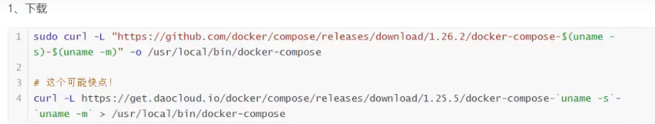
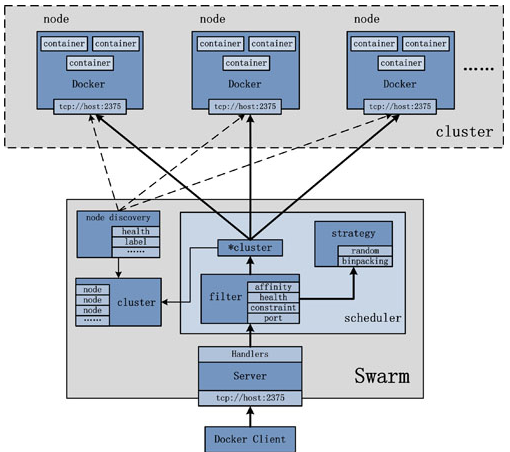
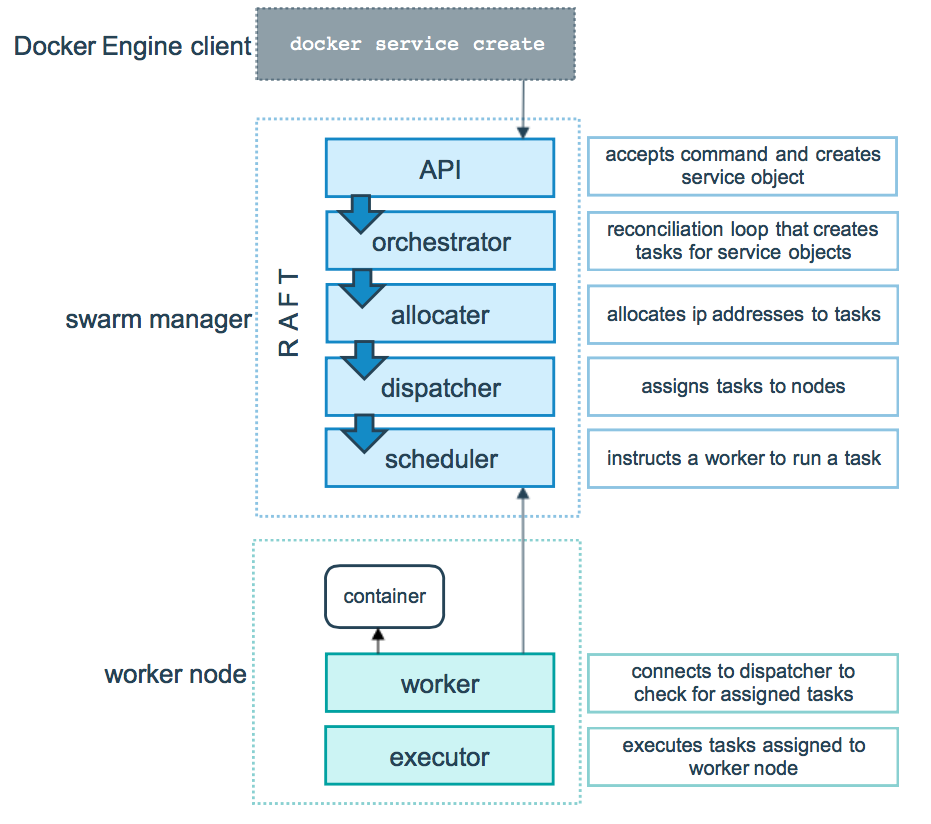
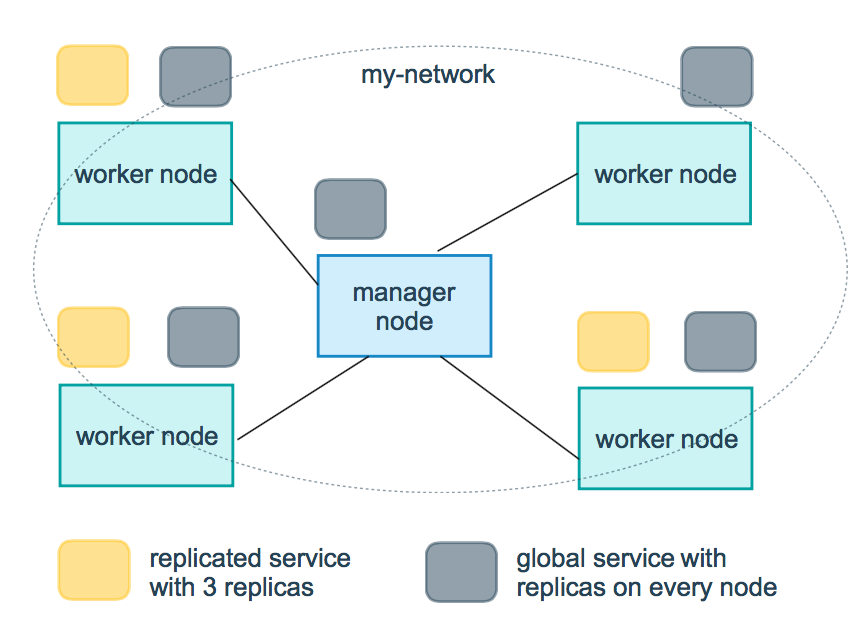
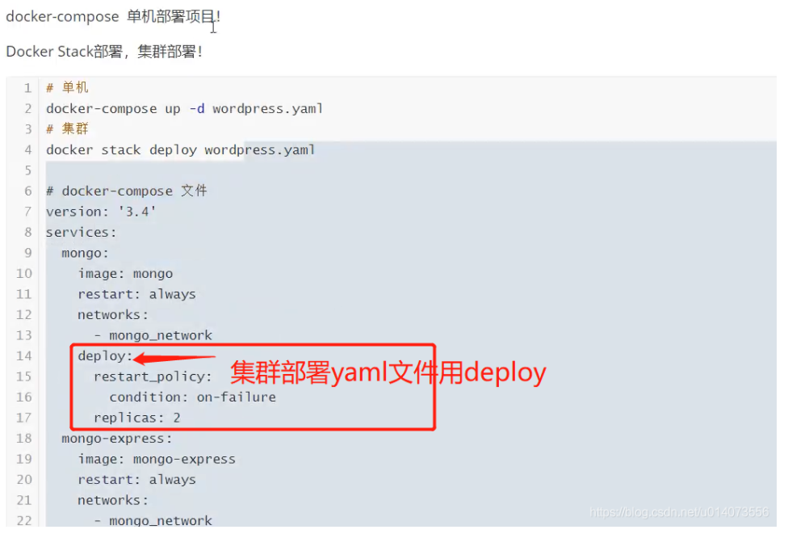

# Docker 进阶

>   https://blog.csdn.net/u014073556/article/details/109624184

## Docker Compose

> https://www.jianshu.com/p/658911a8cff3

原先dockerfile build run，需要手动操作，单个容器
Docker Compose 可以高效管理容器，定义运行多个容器。

使用步骤：

1. `dockerfile`保证项目在任何地方都可以运行
2. 在`docker-compose.yml`中定义项目中所用到的服务，保证他们可以相互隔离的运行
3. 运行命令`docker-compose up`启动项目

作用：批量容器编排

Compose是Docker官方的开源项目。需要安装！
web服务，redis，mysql，nginx……多个容器，通过compose可以快速启动。

```yaml
version: '2.0'
services:
	web:
		build: .
		ports:
		- "5000:5000"
		volumes:
		- .:/code
		- logvolume01:/var/log
		links:
		- redis
	redis:
		image: redis
volumes:
	logvolume01: {}
```

安装：




使用：官网计数器样例 https://docs.docker.com/compose/gettingstarted/


Compose重要概念：

-   服务services，容器应用。(web,redis,mysql…)
-   项目project。一组关联的容器。 博客，web,mysql wp

### Docker Compose 概述与安装

- 前面我们使用 Docker 的时候，定义 Dockerfile 文件，然后使用 docker build、docker run 等命令操作容器。然而微服务架构的应用系统一般包含若干个微服务，每个微服务一般都会部署多个实例，如果每个微服务都要手动启停，那么效率之低，维护量之大可想而知
- **使用 Docker Compose 可以轻松、高效的管理容器，它是一个用于定义和运行多容器 Docker 的应用程序工具**

- 安装 Docker Compose 可以通过下面命令自动下载适应版本的 Compose，并为安装脚本添加执行权限

```ruby
sudo curl -L https://github.com/docker/compose/releases/download/1.21.2/docker-compose-$(uname -s)-$(uname -m) -o /usr/local/bin/docker-compose
sudo chmod +x /usr/local/bin/docker-compose
```

- 查看安装是否成功

```undefined
docker-compose -v
```

### 快速入门

- 打包项目，获得 jar 包 docker-demo-0.0.1-SNAPSHOT.jar

```go
mvn clean package
```

- 在 jar 包所在路径创建 Dockerfile 文件，添加以下内容

```bash
FROM java:8
VOLUME /tmp
ADD docker-demo-0.0.1-SNAPSHOT.jar app.jar
RUN bash -c 'touch /app.jar'
EXPOSE 9000
ENTRYPOINT ["java","-Djava.security.egd=file:/dev/./urandom","-jar","app.jar"]
```

- 在 jar 包所在路径创建文件 docker-compose.yml，添加以下内容

```bash
version: '2' # 表示该 Docker-Compose 文件使用的是 Version 2 file
services:
  docker-demo:  # 指定服务名称
    build: .  # 指定 Dockerfile 所在路径
    ports:    # 指定端口映射
      - "9000:8761"
```

- 在 docker-compose.yml 所在路径下执行该命令 Compose 就会自动构建镜像并使用镜像启动容器

```cpp
docker-compose up
docker-compose up -d  // 后台启动并运行容器
```

- 访问 http://localhost:9000/hello 即可访问微服务接口

### 工程、服务、容器

- **Docker Compose 将所管理的容器分为三层，分别是工程（project）、服务（service）、容器（container）**
- **Docker Compose 运行目录下的所有文件（docker-compose.yml）组成一个工程,一个工程包含多个服务，每个服务中定义了容器运行的镜像、参数、依赖，一个服务可包括多个容器实例**

### Docker Compose 常用命令与配置

### 常见命令

- **ps**：列出所有运行容器

```undefined
docker-compose ps
```

- **logs**：查看服务日志输出

```undefined
docker-compose logs
```

- **port**：打印绑定的公共端口，下面命令可以输出 eureka 服务 8761 端口所绑定的公共端口

```undefined
docker-compose port eureka 8761
```

- **build**：构建或者重新构建服务

```undefined
docker-compose build
```

- **start**：启动指定服务已存在的容器

```undefined
docker-compose start eureka
```

- **stop**：停止已运行的服务的容器

```undefined
docker-compose stop eureka
```

- **rm**：删除指定服务的容器

```undefined
docker-compose rm eureka
```

- **up**：构建、启动容器

```undefined
docker-compose up
```

- **kill**：通过发送 SIGKILL 信号来停止指定服务的容器

```bash
docker-compose kill eureka
```

- **pull**：下载服务镜像
- **scale**：设置指定服务运气容器的个数，以 service=num 形式指定

```undefined
docker-compose scale user=3 movie=3
```

- **run**：在一个服务上执行一个命令

```undefined
docker-compose run web bash
```

### docker-compose.yml 属性

- **version**：指定 docker-compose.yml 文件的写法格式
- **services**：多个容器集合
- **build**：配置构建时，Compose 会利用它自动构建镜像，该值可以是一个路径，也可以是一个对象，用于指定 Dockerfile 参数

```undefined
build: ./dir
---------------
build:
    context: ./dir
    dockerfile: Dockerfile
    args:
        buildno: 1
```

- **command**：覆盖容器启动后默认执行的命令

```bash
command: bundle exec thin -p 3000
----------------------------------
command: [bundle,exec,thin,-p,3000]
```

- **dns**：配置 dns 服务器，可以是一个值或列表

```css
dns: 8.8.8.8
------------
dns:
    - 8.8.8.8
    - 9.9.9.9
```

- **dns_search**：配置 DNS 搜索域，可以是一个值或列表

```css
dns_search: example.com
------------------------
dns_search:
    - dc1.example.com
    - dc2.example.com
```

- **environment**：环境变量配置，可以用数组或字典两种方式

```bash
environment:
    RACK_ENV: development
    SHOW: 'ture'
-------------------------
environment:
    - RACK_ENV=development
    - SHOW=ture
```

- **env_file**：从文件中获取环境变量，可以指定一个文件路径或路径列表，其优先级低于 environment 指定的环境变量

```undefined
env_file: .env
---------------
env_file:
    - ./common.env
```

- **expose**：暴露端口，只将端口暴露给连接的服务，而不暴露给主机

```bash
expose:
    - "3000"
    - "8000"
```

- **image**：指定服务所使用的镜像

```undefined
image: java
```

- **network_mode**：设置网络模式

```bash
network_mode: "bridge"
network_mode: "host"
network_mode: "none"
network_mode: "service:[service name]"
network_mode: "container:[container name/id]"
```

- **ports**：对外暴露的端口定义，和 expose 对应

```objectivec
ports:   # 暴露端口信息  - "宿主机端口:容器暴露端口"
- "8763:8763"
- "8763:8763"
```

- **links**：将指定容器连接到当前连接，可以设置别名，避免ip方式导致的容器重启动态改变的无法连接情况

```bash
links:    # 指定服务名称:别名 
    - docker-compose-eureka-server:compose-eureka
```

- **volumes**：卷挂载路径

```csharp
volumes:
  - /lib
  - /var
```

- **logs**：日志输出信息

```undefined
--no-color          单色输出，不显示其他颜.
-f, --follow        跟踪日志输出，就是可以实时查看日志
-t, --timestamps    显示时间戳
--tail              从日志的结尾显示，--tail=200
```

### Docker Compose 其它

**更新容器**

- 当服务的配置发生更改时，可使用 docker-compose up 命令更新配置
- 此时，Compose 会删除旧容器并创建新容器，新容器会以不同的 IP 地址加入网络，名称保持不变，任何指向旧容起的连接都会被关闭，重新找到新容器并连接上去

**links**

- 服务之间可以使用服务名称相互访问，links 允许定义一个别名，从而使用该别名访问其它服务

```bash
version: '2'
services:
    web:
        build: .
        links:
            - "db:database"
    db:
        image: postgres
```

- 这样 Web 服务就可以使用 db 或 database 作为 hostname 访问 db 服务了

## Docker Swarm

Docker Compose 是一个在单个服务器或主机上创建多个容器的工具，而 Docker Swarm 则可以在多个服务器或主机上创建容器集群服务，对于微服务的部署，显然 Docker Swarm 会更加适合

> https://www.cnblogs.com/zhujingzhi/p/9792432.html


1. 初始化节点`docker swarm init`
2. `docker swarm join` 加入一个节点

Raft协议

双主双从：假如一个节点挂了，其他节点是否可以用

Raft协议：保证大多数节点存活才可以用，只要>1，集群至少大于3台

命令只能在manager上执行

### 概述

Swarm是Docker公司推出的用来管理docker集群的平台，几乎全部用GO语言来完成的开发的，代码开源在https://github.com/docker/swarm， 它是将一群Docker宿主机变成一个单一的虚拟主机，Swarm使用标准的Docker API接口作为其前端的访问入口，换言之，各种形式的Docker

Client(compose,docker-py等)均可以直接与Swarm通信，甚至Docker本身都可以很容易的与Swarm集成，这大大方便了用户将原本基于单节点的系统移植到Swarm上，同时Swarm内置了对Docker网络插件的支持，用户也很容易的部署跨主机的容器集群服务。

Docker Swarm 和 Docker Compose 一样，都是 Docker 官方容器编排项目，但不同的是，Docker Compose 是一个在单个服务器或主机上创建多个容器的工具，而 Docker Swarm 则可以在多个服务器或主机上创建容器集群服务，对于微服务的部署，显然 Docker Swarm 会更加适合。

从 Docker 1.12.0 版本开始，Docker Swarm 已经包含在 Docker 引擎中（docker swarm），并且已经内置了服务发现工具，我们就不需要像之前一样，再配置 Etcd 或者 Consul 来进行服务发现配置了。

Swarm deamon只是一个调度器(Scheduler)加路由器(router),Swarm自己不运行容器，它只是接受Docker客户端发来的请求，调度适合的节点来运行容器，这就意味着，即使Swarm由于某些原因挂掉了，集群中的节点也会照常运行，放Swarm重新恢复运行之后，他会收集重建集群信息。



在结构图可以看出 Docker Client使用Swarm对 集群(Cluster)进行调度使用。

上图可以看出，Swarm是典型的master-slave结构，通过发现服务来选举manager。manager是中心管理节点，各个node上运行agent接受manager的统一管理，集群会自动通过Raft协议分布式选举出manager节点，无需额外的发现服务支持，避免了单点的瓶颈问题，同时也内置了DNS的负载均衡和对外部负载均衡机制的集成支持

- 几个关键概念

1. Swarm
   集群的管理和编排是使用嵌入docker引擎的SwarmKit，可以在docker初始化时启动swarm模式或者加入已存在的swarm

2. Node
   一个节点是docker引擎集群的一个实例。您还可以将其视为Docker节点。您可以在单个物理计算机或云服务器上运行一个或多个节点，但生产群集部署通常包括分布在多个物理和云计算机上的Docker节点。
   要将应用程序部署到swarm，请将服务定义提交给 管理器节点。管理器节点将称为任务的工作单元分派 给工作节点。
   Manager节点还执行维护所需群集状态所需的编排和集群管理功能。Manager节点选择单个领导者来执行编排任务。
   工作节点接收并执行从管理器节点分派的任务。默认情况下，管理器节点还将服务作为工作节点运行，但您可以将它们配置为仅运行管理器任务并且是仅管理器节点。代理程序在每个工作程序节点上运行，并报告分配给它的任务。工作节点向管理器节点通知其分配的任务的当前状态，以便管理器可以维持每个工作者的期望状态。

3. Service
   一个服务是任务的定义，管理机或工作节点上执行。它是群体系统的中心结构，是用户与群体交互的主要根源。创建服务时，你需要指定要使用的容器镜像。

4. Task
   任务是在docekr容器中执行的命令，Manager节点根据指定数量的任务副本分配任务给worker节点

- 使用方法

  ```
  docker swarm：集群管理，子命令有init, join, leave, update。（docker swarm --help查看帮助）
  docker service：服务创建，子命令有create, inspect, update, remove, tasks。（docker service--help查看帮助）
  docker node：节点管理，子命令有accept, promote, demote, inspect, update, tasks, ls, rm。（docker node --help查看帮助）
  ```

node是加入到swarm集群中的一个docker引擎实体，可以在一台物理机上运行多个node，node分为：

- manager nodes，也就是管理节点
- worker nodes，也就是工作节点

1）manager node管理节点：执行集群的管理功能，维护集群的状态，选举一个leader节点去执行调度任务。
2）worker node工作节点：接收和执行任务。参与容器集群负载调度，仅用于承载task。
3）service服务：一个服务是工作节点上执行任务的定义。创建一个服务，指定了容器所使用的镜像和容器运行的命令。
  ``service是运行在worker nodes上的task的描述，service的描述包括使用哪个docker 镜像，以及在使用该镜像的容器中执行什么命令。
4）task任务：一个任务包含了一个容器及其运行的命令。task是service的执行实体，task启动docker容器并在容器中执行任务。

### Swarm的工作模式

1. Node

   

2. Service

   

3. 任务与调度

   

4. 服务副本与全局服务

   

### Swarm的调度策略

Swarm在调度(scheduler)节点（leader节点）运行容器的时候，会根据指定的策略来计算最适合运行容器的节点，目前支持的策略有：spread, binpack, random.

- Random
  顾名思义，就是随机选择一个Node来运行容器，一般用作调试用，spread和binpack策略会根据各个节点的可用的CPU, RAM以及正在运
  行的容器的数量来计算应该运行容器的节点。

- Spread
  在同等条件下，Spread策略会选择运行容器最少的那台节点来运行新的容器，binpack策略会选择运行容器最集中的那台机器来运行新的节点。
  使用Spread策略会使得容器会均衡的分布在集群中的各个节点上运行，一旦一个节点挂掉了只会损失少部分的容器。

- Binpack
  Binpack策略最大化的避免容器碎片化，就是说binpack策略尽可能的把还未使用的节点留给需要更大空间的容器运行，尽可能的把容器运行在
  一个节点上面。

### Swarm Cluster模式特性

1. 批量创建服务
   建立容器之前先创建一个overlay的网络，用来保证在不同主机上的容器网络互通的网络模式

2. 强大的集群的容错性
   当容器副本中的其中某一个或某几个节点宕机后，cluster会根据自己的服务注册发现机制，以及之前设定的值--replicas n，
   在集群中剩余的空闲节点上，重新拉起容器副本。整个副本迁移的过程无需人工干预，迁移后原本的集群的load balance依旧好使！
   不难看出，docker service其实不仅仅是批量启动服务这么简单，而是在集群中定义了一种状态。Cluster会持续检测服务的健康状态
   并维护集群的高可用性。

3. 服务节点的可扩展性
   Swarm Cluster不光只是提供了优秀的高可用性，同时也提供了节点弹性扩展或缩减的功能。当容器组想动态扩展时，只需通过scale
   参数即可复制出新的副本出来。

仔细观察的话，可以发现所有扩展出来的容器副本都run在原先的节点下面，如果有需求想在每台节点上都run一个相同的副本，方法
其实很简单，只需要在命令中将``"--replicas n"``更换成``"--mode=global"``即可！

- 复制服务（--replicas n）
  将一系列复制任务分发至各节点当中，具体取决于您所需要的设置状态，例如“--replicas 3”。

- 全局服务（--mode=global）
  适用于集群内全部可用节点上的服务任务，例如“--mode global”。如果大家在 Swarm 集群中设有 7 台 Docker 节点，则全部节点之上都将存在对应容器。

**调度机制**
所谓的调度其主要功能是cluster的server端去选择在哪个服务器节点上创建并启动一个容器实例的动作。它是由一个装箱算法和过滤器
组合而成。每次通过过滤器（constraint）启动容器的时候，swarm cluster 都会调用调度机制筛选出匹配约束条件的服务器，并在这上面运行容器。

**Swarm Cluster创建过程**

1. 发现Docker集群中的各个节点，收集节点状态、角色信息，并监视节点状态的变化
2. 初始化内部调度（scheduler）模块
3. 创建并启动API监听服务模块

一旦创建好这个cluster，就可以用命令docker service批量对集群内的容器进行操作，非常方便！

在启动容器后，docker 会根据当前每个swarm节点的负载判断，在负载最优的节点运行这个task任务，用``"docker service ls"` `和``"docker service ps + taskID"
可以看到任务运行在哪个节点上。容器启动后，有时需要等待一段时间才能完成容器创建。

## Docker Stack

> https://blog.csdn.net/huangjun0210/article/details/86502021

### 简介

单机模式下，我们可以使用 Docker Compose 来编排多个服务，而 Docker Swarm 只能实现对单个服务的简单部署。本文的主角 Docker Stack ，通过 Docker Stack 我们只需对已有的 docker-compose.yml 配置文件稍加改造就可以完成 Docker 集群环境下的多服务编排。

### Docker Stack与Docker Compose区别

- Docker stack会忽略了“构建”指令，无法使用stack命令构建新镜像，它是需要镜像是预先已经构建好的。 所以docker-compose更适合于开发场景；
- Docker Compose是一个Python项目，在内部，它使用Docker API规范来操作容器。所以需要安装Docker -compose，以便与Docker一起在您的计算机上使用；
- Docker Stack功能包含在Docker引擎中。你不需要安装额外的包来使用它，docker stacks 只是swarm mode的一部分。
- Docker stack不支持基于第2版写的docker-compose.yml ，也就是version版本至少为3。然而Docker Compose对版本为2和3的 文件仍然可以处理；
- docker stack把docker compose的所有工作都做完了，因此docker stack将占主导地位。同时，对于大多数用户来说，切换到使用docker stack既不困难，也不需要太多的开销。如果您是Docker新手，或正在选择用于新项目的技术，请使用docker stack。

### Docker Stack常用命令

```
docker stack deploy	部署新的堆栈或更新现有堆栈
docker stack ls	列出现有堆栈
docker stack ps	列出堆栈中的任务
docker stack rm	删除一个或多个堆栈
docker stack services	列出堆栈中的服务
```



## Docker Secret

用于安全配置（密码、证书）

> https://www.cnblogs.com/shenjianping/p/12272847.html

### 概述

我们知道manager节点保持状态的一致是通过Raft Database这个分布式存储的数据库，它本身就是将信息进行了secret，所以可以利用这个数据库将一些敏感信息，例如账号、密码等信息保存在这里，然后通过给service授权的方式允许它进行访问，这样达到避免密码明文显示的效果。

　　总之，secret的Swarm中secret的管理通过以下步骤完成：

- secret存在于Swarm Manager节点的的Raft Database里
- secret可以assign给一个service，然后这个service就可以看到这个secret
- 在container内部secret看起来像文件，实际上就是内存 

### 创建与使用

Secret的创建有两种方式，分别是：

- 基于文件的创建

  首先先创建一个文件用于存放密码

  ```bash
  [root@centos-7 ~]# vim mysql-password
  root
  ```

  然后再进行创建secret

  ```bash
  [root@centos-7 ~]# docker secret create mysql-pass mysql-password 
  texcct9ojqcz6n40woe97dd7k
  ```

  　　其中，mysql-pass是secret的名称，mysql-password是我们建立存储密码的文件，这样执行后就相当于将文件中的密码存储在Swarm中manager节点的Raft Database中了。为了安全起见，现在可以直接将这个文件删掉，因为Swarm中已经有这个密码了。

  ```bash
  [root@centos-7 ~]# rm -f mysql-password 
  ```

  现在可以查看一下secret列表：

  ```bash
  [root@centos-7 ~]# docker secret ls
  ID                          NAME                DRIVER              CREATED             UPDATED
  texcct9ojqcz6n40woe97dd7k   mysql-pass                              4 minutes ago       4 minutes ago
  ```

  已经存在了。

- 基于命令行创建

  ```bash
  [root@centos-7 ~]# echo "root" | docker secret create mysql-pass2 -
  hrtmn5yr3r3k66o39ba91r2e4
  [root@centos-7 ~]# docker secret ls
  ID                          NAME                DRIVER              CREATED             UPDATED
  texcct9ojqcz6n40woe97dd7k   mysql-pass                              6 minutes ago       6 minutes ago
  hrtmn5yr3r3k66o39ba91r2e4   mysql-pass2                             5 seconds ago       5 seconds ago
  ```

### 其它操作

1. inspect

```bash
[root@centos-7 ~]# docker secret inspect mysql-pass2
[
    {
        "ID": "hrtmn5yr3r3k66o39ba91r2e4",
        "Version": {
            "Index": 4061
        },
        "CreatedAt": "2020-02-07T08:39:25.630341396Z",
        "UpdatedAt": "2020-02-07T08:39:25.630341396Z",
        "Spec": {
            "Name": "mysql-pass2",
            "Labels": {}
        }
    }
]
```

展示secret的一些详情信息

2. rm

```bash
[root@centos-7 ~]# docker secret rm  mysql-pass2
mysql-pass2
[root@centos-7 ~]# docker secret ls
ID                          NAME                DRIVER              CREATED             UPDATED
texcct9ojqcz6n40woe97dd7k   mysql-pass                              12 minutes ago      12 minutes ago
```

删除一个secret

### 使用

1、容器中查看secret

 我们创建了一个secret，如何在启动一个服务后，将其授权给特定的服务然后它才可以看到呢？先看看创建服务的命令中是否有类似的命令或者参数：

```bash
[root@centos-7 ~]# docker service create --help

Usage:    docker service create [OPTIONS] IMAGE [COMMAND] [ARG...]

Create a new service

Options:
      --config config                      Specify configurations to expose to the service
...
 --secret secret                      Specify secrets to expose to the service
...
...
```

确实是有这样的命令，在创建服务时可以给服务暴露出secret。

2、创建服务

```bash
[root@centos-7 ~]# docker service create --name demo --secret mysql-pass busybox sh -c "while true; do sleep 3600; done"
zwgk5w0rpf17hn77axz6cn8di
overall progress: 1 out of 1 tasks 
1/1: running   
verify: Service converged 
```

查看这个服务运行在那个节点上：

```bash
[root@centos-7 ~]# docker service ls
ID                  NAME           MODE                REPLICAS            IMAGE               PORTS
zwgk5w0rpf17        demo           replicated          1/1                 busybox:latest      
[root@centos-7 ~]# docker service ps demo
ID                  NAME           IMAGE    NODE         DESIRED STATE       CURRENT STATE     ERROR  PORTS
yvr9lwvg8oca        demo.1        busybox:latest      localhost.localdomain   Running   Running 51 seconds ago                       
```

可以看到这个服务运行在localhost.localdomain主机的节点上，我们去这个节点上进入到容器内部，看是否能查看secret：

```bash
[root@localhost ~]# docker ps
CONTAINER ID    IMAGE               COMMAND           CREATED             STATUS    PORTS               NAMES
36573adf21f6  busybox:latest   "sh -c 'while true; …"4 minutes ago   Up 4 minutes  demo.1.yvr9lwvg8ocatym20hdfublhd
[root@localhost ~]# docker exec -it 36573adf21f6 /bin/sh
/ # ls
bin   dev   etc   home  proc  root  run   sys   tmp   usr   var
/ # cd /run/secrets
/run/secrets # ls
mysql-pass
/run/secrets # cat mysql-pass 
root
/run/secrets # 
```

可以看到确实是可行的。

3、mysql服务

 关于mysql镜像，详情查看https://hub.docker.com/_/mysql其中有关于secret的描述：

　　作为通过环境变量传递敏感信息的替代方法，`_FILE`可以将其附加到先前列出的环境变量中，从而使初始化脚本从容器中存在的文件中加载那些变量的值。特别是，这可用于从`/run/secrets/<secret_name>`文件中存储的Docker Secret加载密码。例如：

```bash
$ docker run --name some-mysql -e MYSQL_ROOT_PASSWORD_FILE=/run/secrets/mysql-root -d mysql:tag
```

目前，这仅支持`MYSQL_ROOT_PASSWORD`，`MYSQL_ROOT_HOST`，`MYSQL_DATABASE`，`MYSQL_USER`，和`MYSQL_PASSWORD`。

所以我们需要先创建一个文件secret用于存储数据库的敏感信息，因为之前已经创建过，这里无需再创建：

```bash
[root@centos-7 ~]# docker secret ls
ID                          NAME                DRIVER         CREATED             UPDATED
texcct9ojqcz6n40woe97dd7k   mysql-pass                         4 hours ago         4 hours ago
```

启动mysql服务：

```bash
[root@centos-7 ~]# docker service create --name db --secret mysql-pass -e MYSQL_ROOT_PASSWORD_FILE=/run/secrets/mysql-pass mysql
sbpagzqvpwt8ifymavf8o5xmi
overall progress: 1 out of 1 tasks 
1/1: running   
verify: Service converged 
```

查看mysql服务在那个节点上：

```bash
[root@centos-7 ~]# docker service ls
ID                  NAME                MODE                REPLICAS            IMAGE               PORTS
sbpagzqvpwt8        db                  replicated          0/1                 mysql:latest        
[root@centos-7 ~]# docker service ps db
ID            NAME        IMAGE         NODE                 DESIRED STATE  CURRENT STATE  ERROR    PORTS
qlmfm6u7lg8u    db.1    mysql:latest   localhost.localdomain   Running  Starting 2 seconds ago                                      
```

在worker节点中进入该服务的容器中查看secret：

```bash
[root@localhost ~]# docker ps
CONTAINER ID   IMAGE               COMMAND                  CREATED             STATUS              PORTS                 NAMES
2ac2a810e931  mysql:latest "docker-entrypoint.s…" 3 minutes ago  Up 2 minutes 3306/tcp, 33060/tcp  db.1.qlmfm6u7lg8u8i1v2m2c3ls3r

[root@localhost ~]# docker exec -it 2ac2a810e931 /bin/sh
# cd /run/secrets/
# ls
mysql-pass
# cat mysql-pass
root
```

这样知道了密码就可以进入到mysql数据库中了。

```bash
# mysql -uroot -p
Enter password: 
Welcome to the MySQL monitor.  Commands end with ; or \g.
Your MySQL connection id is 9
Server version: 8.0.19 MySQL Community Server - GPL

Copyright (c) 2000, 2020, Oracle and/or its affiliates. All rights reserved.

Oracle is a registered trademark of Oracle Corporation and/or its
affiliates. Other names may be trademarks of their respective
owners.

Type 'help;' or '\h' for help. Type '\c' to clear the current input statement.

mysql> 
```

## Docker Config

> https://www.linuxea.com/2308.html

### 在镜像中嵌入配置？

我们经常看到Dockerfile如下所示，其中创建新镜像只是为了将配置添加到基本镜像。

```bash
$ cat Dockerfile 
FROM marksugar：redis:5.0.0
RUN curl http:/xx/x/xredis.conf -o  /etc/redis/redis.conf 复制
```

在上述中，是将最新的redis.conf文件放到/etc/redis/redis.conf中

除此之外，我们还可以使用变量替换的方式进行处理。变量替换意味着需要设计模板和参数，如果参数过多，配置和替换起来将会耗费更多的时间，也较为复杂，并不是最好最安全的方式。

当然，我们可以直接挂载文件到容器中，那并不优雅，但的确能解决一部分问题。

如果需要频繁的修改文件，且变量替换也无法满足，也不想挂载文件，那现在就可以参考docker config。

### 使用场景

有一个配置redis.conf的配置文件在容器内，现在我将容器内的配置文件修改后重新附加到容器内。我修改了密码字段：

```bash
masterauth "OTdmOWI4ZTM4NTY1M2M4OTZh.com"
requirepass "OTdmOWI4ZTM4NTY1M2M4OTZh.com"
```

### config创建

现在，使用Docker CLI，我们可以从此配置文件创建配置redis.conf（redis.conf文件此前准备好的配置），我们将此配置命名为**redis**。

```bash
[root@linuxea.com /opt/2019/redis]# docker config create redis redis.conf 
269yklanwzva9yk74n6b3j9dk
```

然后我们可以检查配置，就像我们对其他任何Docker一样：

```bash
[root@linuxea.com /opt/2019/redis]# docker config inspect redis
[
    {
        "ID": "269yklanwzva9yk74n6b3j9dk",
        "Version": {
            "Index": 24
        },
        "CreatedAt": "2019-03-02T02:36:19.257840639Z",
        "UpdatedAt": "2019-03-02T02:36:19.257840639Z",
        "Spec": {
            "Name": "redis",
            "Labels": {},
            "Data": "YmluZCAwLjAuMC4wDQpwcm90ZWN0ZWQtbW9kZSB5ZXMNCnBvcnQgNjM3OQ0KdGNwLWJhY2tsb2cgNTExDQp0aW1lb3V0IDANCnRjcC1rZWVwYWxpdmUgMzAwDQpkYWVtb25pemUgbm8NCnN1cGVydmlzZWQgbm8NCnBpZGZpbGUgL3Zhci9ydW4vcmVkaXNfNjM3OS5waWQNCmxvZ2xldmVsIG5vdGljZQ0KbG9nZmlsZSAiL2RhdGEvbG9ncy9yZWRpc182Mzc5LmxvZyINCmRhdGFiYXNlcyAxNg0KYWx3YXlzLXNob3ctbG9nbyB5ZXMNCnNhdmUgOTAwIDENCnNhdmUgMzAwIDEwDQpzYXZlIDYwIDEwMDAwDQpzdG9wLXdyaXRlcy1vbi1iZ3NhdmUtZXJyb3IgeWVzDQpyZGJjb21wcmVzc2lvbiB5ZXMNCnJkYmNoZWNrc3VtIHllcw0KZGJmaWxlbmFtZSBkdW1wLnJkYg0KZGlyICIvZGF0YS9yZWRpcyINCnJlcGxpY2Etc2VydmUtc3RhbGUtZGF0YSB5ZXMNCnJlcGxpY2EtcmVhZC1vbmx5IHllcw0KcmVwbC1kaXNrbGVzcy1zeW5jIG5vDQpyZXBsLWRpc2tsZXNzLXN5bmMtZGVsYXkgNQ0KcmVwbC1kaXNhYmxlLXRjcC1ub2RlbGF5IG5vDQpyZXBsaWNhLXByaW9yaXR5IDEwMA0KbGF6eWZyZWUtbGF6eS1ldmljdGlvbiBubw0KbGF6eWZyZWUtbGF6eS1leHBpcmUgbm8NCmxhenlmcmVlLWxhenktc2VydmVyLWRlbCBubw0KcmVwbGljYS1sYXp5LWZsdXNoIG5vDQphcHBlbmRvbmx5IG5vDQphcHBlbmRmaWxlbmFtZSAiYXBwZW5kb25seS5hb2YiDQphcHBlbmRmc3luYyBldmVyeXNlYw0Kbm8tYXBwZW5kZnN5bmMtb24tcmV3cml0ZSBubw0KYXV0by1hb2YtcmV3cml0ZS1wZXJjZW50YWdlIDEwMA0KYXV0by1hb2YtcmV3cml0ZS1taW4tc2l6ZSA2NG1iDQphb2YtbG9hZC10cnVuY2F0ZWQgeWVzDQphb2YtdXNlLXJkYi1wcmVhbWJsZSB5ZXMNCmx1YS10aW1lLWxpbWl0IDUwMDANCnNsb3dsb2ctbG9nLXNsb3dlci10aGFuIDEwMDAwDQpzbG93bG9nLW1heC1sZW4gMTI4DQpsYXRlbmN5LW1vbml0b3ItdGhyZXNob2xkIDANCm5vdGlmeS1rZXlzcGFjZS1ldmVudHMgIiINCmhhc2gtbWF4LXppcGxpc3QtZW50cmllcyA1MTINCmhhc2gtbWF4LXppcGxpc3QtdmFsdWUgNjQNCmxpc3QtbWF4LXppcGxpc3Qtc2l6ZSAtMg0KbGlzdC1jb21wcmVzcy1kZXB0aCAwDQpzZXQtbWF4LWludHNldC1lbnRyaWVzIDUxMg0KenNldC1tYXgtemlwbGlzdC1lbnRyaWVzIDEyOA0KenNldC1tYXgtemlwbGlzdC12YWx1ZSA2NA0KaGxsLXNwYXJzZS1tYXgtYnl0ZXMgMzAwMA0Kc3RyZWFtLW5vZGUtbWF4LWJ5dGVzIDQwOTYNCnN0cmVhbS1ub2RlLW1heC1lbnRyaWVzIDEwMA0KYWN0aXZlcmVoYXNoaW5nIHllcw0KY2xpZW50LW91dHB1dC1idWZmZXItbGltaXQgbm9ybWFsIDAgMCAwDQpjbGllbnQtb3V0cHV0LWJ1ZmZlci1saW1pdCByZXBsaWNhIDI1Nm1iIDY0bWIgNjANCmNsaWVudC1vdXRwdXQtYnVmZmVyLWxpbWl0IHB1YnN1YiAzMm1iIDhtYiA2MA0KaHogMTANCmR5bmFtaWMtaHogeWVzDQphb2YtcmV3cml0ZS1pbmNyZW1lbnRhbC1mc3luYyB5ZXMNCnJkYi1zYXZlLWluY3JlbWVudGFsLWZzeW5jIHllcw0KbWF4bWVtb3J5LXBvbGljeSBhbGxrZXlzLWxmdQ0KbGZ1LWxvZy1mYWN0b3IgMTANCmxmdS1kZWNheS10aW1lIDENCm1heGNsaWVudHMgNjAwDQptYXhtZW1vcnkgNDA5Nk0NCm1hc3RlcmF1dGggIk9UZG1PV0k0WlRNNE5UWTFNMk00T1RaaC5jb20iDQpyZXF1aXJlcGFzcyAiT1RkbU9XSTRaVE00TlRZMU0yTTRPVFpoLmNvbSINCg=="
        }
    }
] 复制
```

数据仅为base64编码，可以轻松解码。

```bash
[root@linuxea.com /opt/2019/redis]# docker config inspect -f '{{json .Spec.Data}}' redis|cut -d '"' -f2 |base64 -d
bind 0.0.0.0
protected-mode yes
port 6379
....
masterauth "OTdmOWI4ZTM4NTY1M2M4OTZh.com"
requirepass "OTdmOWI4ZTM4NTY1M2M4OTZh.com"
```

我修改了密码字段: `OTdmOWI4ZTM4NTY1M2M4OTZh.com`

根据定义，配置中的数据不是机密的，因此不加密。

### docker-compose config配置

注意：由于配置是在运行应用程序之前创建的，因此在此文件中将其定义为**external**。如下：

```bash
version: '3.7'
services:
  redis:
    image: marksugar/redis:5.0.0
    container_name: redis
    restart: always
    network_mode: "host"
    privileged: true
    environment:
    - REDIS_CONF=off
    - REQUIRE_PASS=OTdmOWI4ZTM4NTY1M2M4OTZh
    - MASTER_AUTH=OTdmOWI4ZTM4NTY1M2M4OTZh
    - MAXCLIENTS_NUM=600
    - MAXMEMORY_SIZE=4096M
    volumes:
    - /etc/localtime:/etc/localtime:ro
    - /data/redis-data:/data/redis:Z
    - /data/logs:/data/logs
    configs:
      - source: redis
        target: /etc/redis/redis.conf
configs:
  redis:
    external: true 
```

其中configs引用如下：

- target： 配置文件在容器中的位置
- configs： 全局调用和局部调用

```bash
version: '3.7'
services:
  redis:
    image:
....
    configs:
      - source: redis
        target: /etc/redis/redis.conf
configs:
  redis:
    external: true
 
```

config的名称为redis，在全局配置中则填写redis，在局部配置中附加配置即可

### docker swarm 使用

然后可以使用以下命令运行该应用程序：

```bash
[root@linuxea.com /opt/2019/redis]# docker stack deploy -c ./docker-compose.yaml redis
Ignoring unsupported options: network_mode, privileged, restart

Ignoring deprecated options:

container_name: Setting the container name is not supported.

Creating network redis_default
Creating service redis_redis 
```

验证

```bash
[root@linuxea.com /opt/2019/redis]#  docker exec -it redis_redis.1.s6f35kwutld2d7oc80e4531rp cat /etc/redis/redis.conf
bind 0.0.0.0
protected-mode yes
port 6379
...
masterauth "OTdmOWI4ZTM4NTY1M2M4OTZh.com"
requirepass "OTdmOWI4ZTM4NTY1M2M4OTZh.com"
... 
```

info信息

```bash
[root@linuxea.com /opt/2019/redis]# docker exec -i redis_redis.1.s6f35kwutld2d7oc80e4531rp redis-cli -a OTdmOWI4ZTM4NTY1M2M4OTZh.com info|grep cpu
Warning: Using a password with '-a' or '-u' option on the command line interface may not be safe.
used_cpu_sys:1.445721
used_cpu_user:1.499864
used_cpu_sys_children:0.000000
used_cpu_user_children:0.000000 
```

删除命令

```bash
[root@linuxea.com /opt/2019/redis]# docker stack rm redis
Removing service redis_redis
Removing network redis_default 
```

### update

当需要修改配置的内容时，创建新配置（使用*docker config create*）然后更新服务以删除先前配置的config，并添加对新配置是一种常见模式。服务命令--config-rm和--config-add是

我们修改配置文件的密码，而后重新创建一个**redis1**的config文件

```bash
masterauth "OTdmOWI4ZTM4NTY1M2M4OTZh.com"
requirepass "OTdmOWI4ZTM4NTY1M2M4OTZh.com.cn"
```

创建redis1的config

```bash
[root@linuxea.com opt/2019/redis]# docker config create redis1 redis.conf
a4soto5rw4if4h7ir8jfrasyv 
```

更新配置文件

- 先删除掉redis的config，而后添加redis1，这个过程会更新redis容器

```bash
[root@linuxea.com /opt/2019/redis]# docker service update --config-rm redis --config-add src=redis1,target=/etc/redis/redis.conf redis_redis 
redis_redis
overall progress: 1 out of 1 tasks 
1/1: running   [==================================================>] 
verify: Service converged  
```

查看更新

```bash
[root@linuxea.com /opt/2019/redis]# docker exec -it redis_redis.1.5qpc63nvm75w03v3ihk17hgie cat /etc/redis/redis.conf
bind 0.0.0.0
protected-mode yes
....
masterauth "OTdmOWI4ZTM4NTY1M2M4OTZh.com"
requirepass "OTdmOWI4ZTM4NTY1M2M4OTZh.com.cn"
```