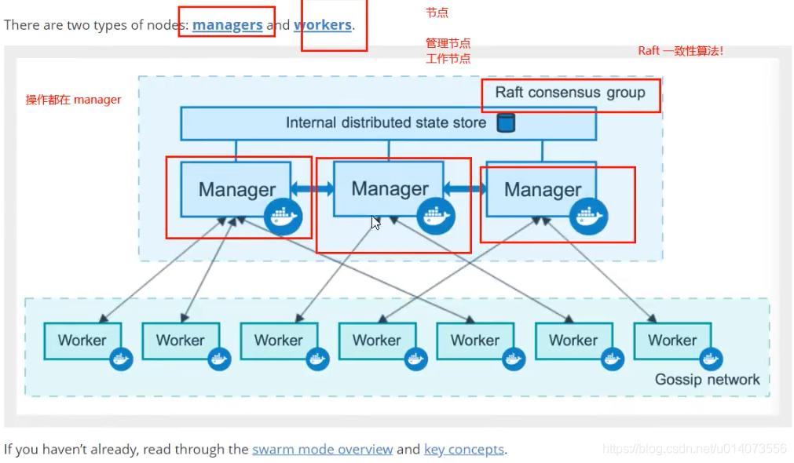

# Docker 进阶

>   https://blog.csdn.net/u014073556/article/details/109624184

## Docker Compose

> https://www.jianshu.com/p/658911a8cff3

原先dockerfile build run，需要手动操作，单个容器
Docker Compose 可以高效管理容器，定义运行多个容器。

使用步骤：

1. `dockerfile`保证项目在任何地方都可以运行
2. 在`docker-compose.yml`中定义项目中所用到的服务，保证他们可以相互隔离的运行
3. 运行命令`docker-compose up`启动项目

作用：批量容器编排

Compose是Docker官方的开源项目。需要安装！
web服务，redis，mysql，nginx……多个容器，通过compose可以快速启动。

```yaml
version: '2.0'
services:
	web:
		build: .
		ports:
		- "5000:5000"
		volumes:
		- .:/code
		- logvolume01:/var/log
		links:
		- redis
	redis:
		image: redis
volumes:
	logvolume01: {}
```

安装：


使用：官网计数器样例 https://docs.docker.com/compose/gettingstarted/


Compose重要概念：

-   服务services，容器应用。(web,redis,mysql…)
-   项目project。一组关联的容器。 博客，web,mysql wp

## Docker Swarm

Docker Compose 是一个在单个服务器或主机上创建多个容器的工具，而 Docker Swarm 则可以在多个服务器或主机上创建容器集群服务，对于微服务的部署，显然 Docker Swarm 会更加适合

> https://www.cnblogs.com/zhujingzhi/p/9792432.html



1. 初始化节点`docker swarm init`
2. `docker swarm join` 加入一个节点

Raft协议

双主双从：假如一个节点挂了，其他节点是否可以用

Raft协议：保证大多数节点存活才可以用，只要>1，集群至少大于3台

命令只能在manager上执行

## Docker Stack

> https://blog.csdn.net/huangjun0210/article/details/86502021


## Docker Secret

用于安全配置（密码、证书）

> https://www.cnblogs.com/shenjianping/p/12272847.html

## Docker Config

> https://www.linuxea.com/2308.html

