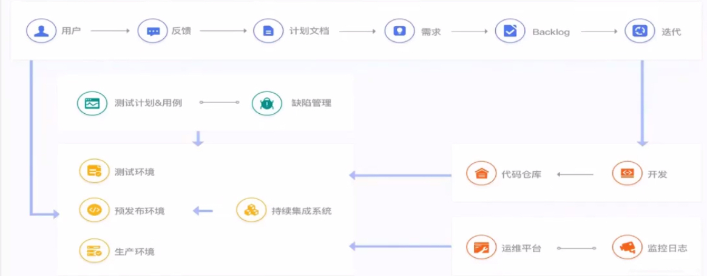
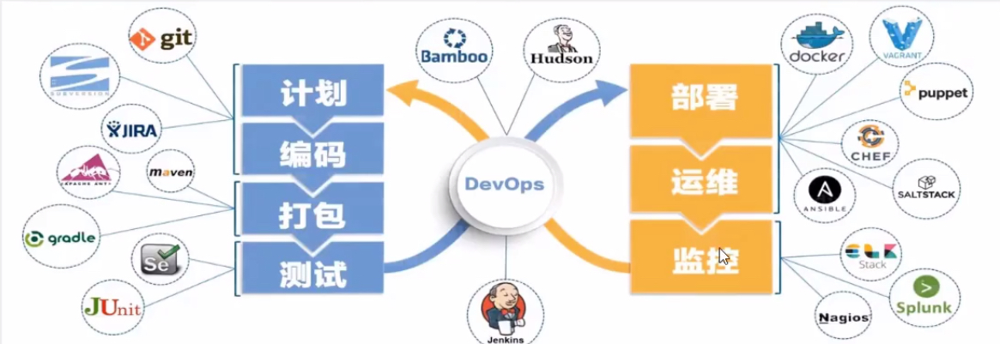
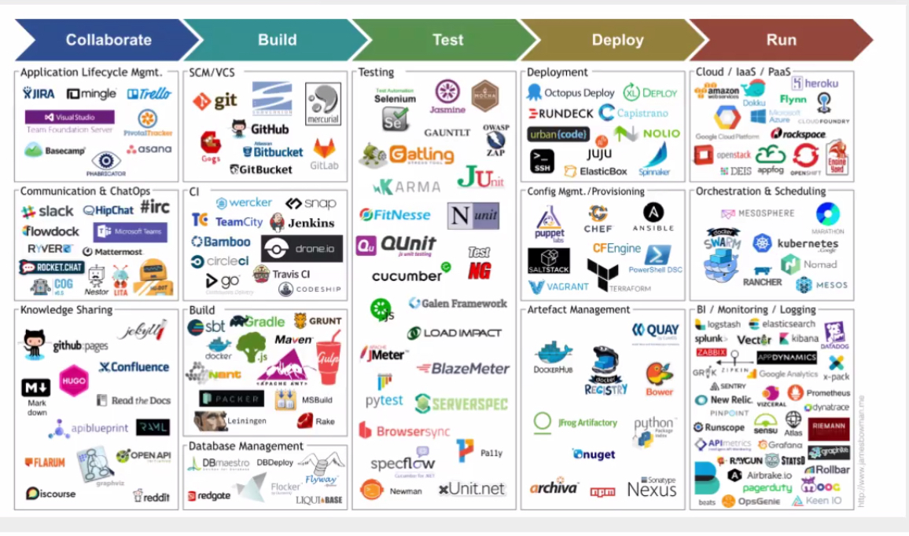
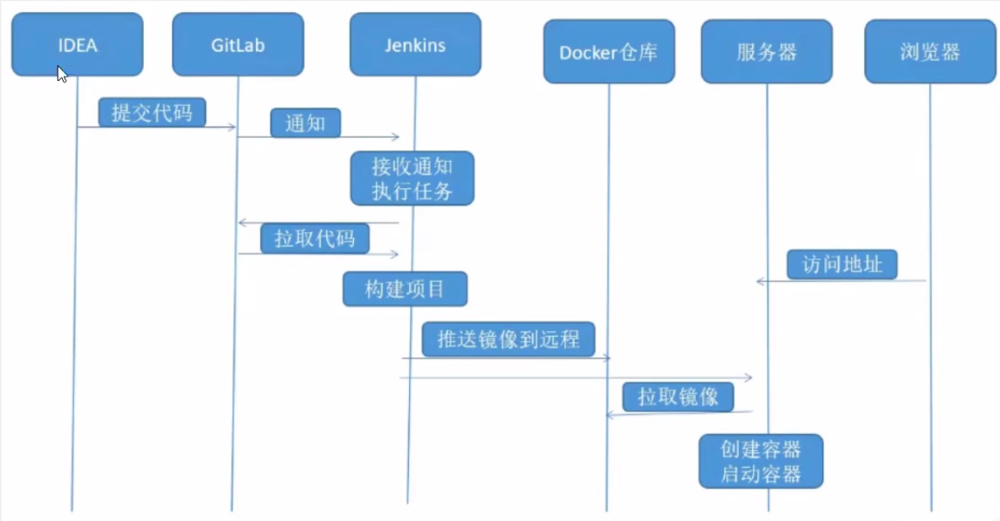
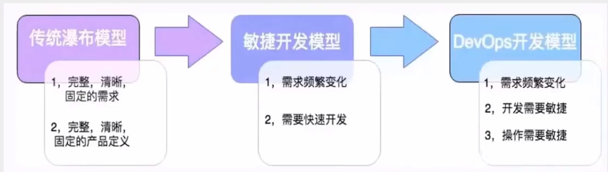

# DevOps

## 概念

DevOps是一种思想或方法论，它涵盖开发、测试、运维的整个过程。

DevOps强调软件开发人员与软件测试、软件运维、质量保障部门之间的沟通与协作；

强调通过自动化的方法管理软件变更、软件集成，使软件从构建到测试、发布更加快捷、可靠，最终按时交付软件。

项目开发的大概流程：

## 落地实现

DevOps兴起于2009年，近年来由于云计算、互联网的发展，促进了DevOps的基础设施及工具链的发展，涌现了一大批优秀的工具，这些工具包括开发、测试、运维的各个领域，如下图：

## 实践

传统上在软件开发中，都由开发团队来构建软件。

开发团队需要与运维团队进行大规模的交接，运维团队负责执行一系列的部署活动，将软件代码移至生产仓库，并负责维护后续的系统稳定运行。

DevOps这种软件开发方法，涉及到软件整个开发生命周期，是在较短的开发周期内开发高质量软件的首选方法，同时可以提高客户满意度。