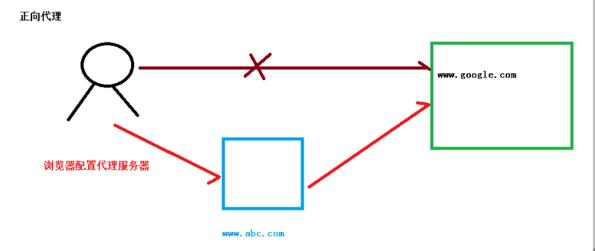
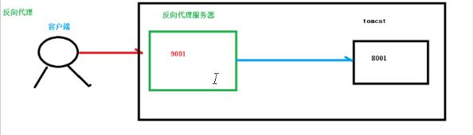
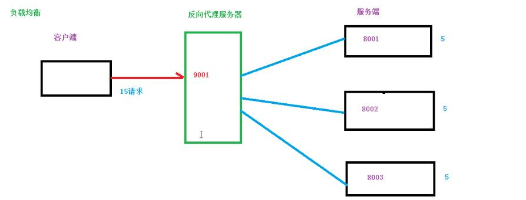
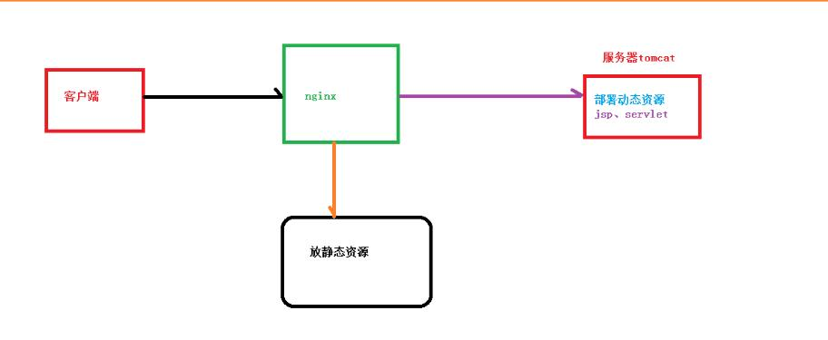
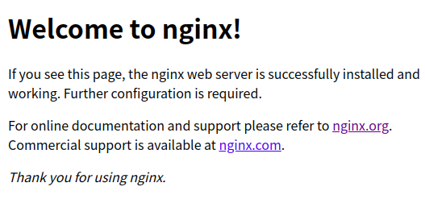

# Nginx简介

## 什么是Nginx

Nginx是一个高性能的HTTP和反向代理服务器，特点是占有内存小，并发能力强，Nginx的并发能力在同类型的网页服务器中表现良好；

Nginx专为性能优化而开发，性能是最重要的考量，实现上非常注意效率，能经受高负载的考验，支持高达50000个连接数。

## 反向代理

正向代理：代理客户端的就称之为正向代理

反向代理：代理服务器的就称之为反向代理 ==》 也就是客户端并不知道真实的服务器，而是直接访问代理服务器，代理服务器根据域名等将请求转发给真实的服务器

## 负载均衡

服务器的性能是处理并发请求的上限，如果单个服务器解决不了，那么我们就可以增加服务器的数量，然后将请求分发到各个服务器上，将原先请求集中到单个服务器的情况改为分发到多个服务器上。

将负载分发到不同的服务器，就是我们所说的负载均衡。

## 动静分离

为了加快网站的解析速度，可以把动态页面和静态页面交由不同的服务器来解析，加快解析速度，降低原来单个服务器的压力。

## 安装Nginx

Nginx安装路径：`/usr/local/nginx/sbin`

启动Nginx：`sudo ./nginx`

访问Nginx：浏览器访问80端口

