# Nginx使用

## Nginx常用命令

1.  使用nginx命令的前提条件: 进入nginx目录`cd /usr/local/nginx/sbin`

2.  查看nginx的版本号

    `./nginx -v`

    ```bash
     sbin$ ./nginx -v
    nginx version: nginx/1.18.0
    ```

3.  启动Nginx

    `/nginx `

    ```bash
     sbin$ sudo ./nginx 
    ```

4.  停止Nginx

    `./nginx -s stop`

    ```bash
     sbin$ sudo ./nginx -s stop
    ```

5.  重新加载Nginx

    `./nginx -s reload`

    ```bash
     sbin$ sudo ./nginx -s reload
    ```

## Nginx配置文件

1.  nginx 配置文件的位置`/usr/local/nginx/conf/nginx.conf`

2.  配置文件的组成

    -   第一部分 全局块

        从配置文件开始到 events块之间的内容，主要设置一些影响nginx服务器整体运行的配置指令

        ```bash
        #user  nobody;
        worker_processes  1;
        #error_log  logs/error.log;
        #error_log  logs/error.log  notice;
        #error_log  logs/error.log  info;
        #pid        logs/nginx.pid;
        ```

        worker_processes  1;  值越大，可以支持的并发处理量就越多

    -   第二部分 events块

        events块涉及的指令主要是 ：用户与nginx服务器之间的网络连接

        ```bash
        events {
            worker_connections  1024;
        }
        ```

        worker_connections  1024; 支持的最大连接数

    -   第三部分 http块

        1.  http 全局块

            文件引入、MIME-TYPE定义、日志自定义、连接超时时间、单链接请求数上限等

            ```bash
            	include       mime.types;
                default_type  application/octet-stream;
                #log_format  main  '$remote_addr - $remote_user [$time_local] "$request" '
                #                  '$status $body_bytes_sent "$http_referer" '
                #                  '"$http_user_agent" "$http_x_forwarded_for"';
                #access_log  logs/access.log  main;
                sendfile        on;
                #tcp_nopush     on;
                #keepalive_timeout  0;
                keepalive_timeout  65;
                #gzip  on;
            ```

        2.  server块

            与虚拟主机有密切关系

            每个http块可以包含多个server块，而每个server块相当于一个虚拟主机

            每个server块可以分为全局server块，以及可以同时包含多个location块

            -   全局server块

                虚拟主机的监听配置、名称或IP配置

            -   location块

                一个server块可以配置多个location块

                基于Nginx服务器接收到的请求字符串，对虚拟主机名称之外的字符串进行匹配，对特定的请求进行处理。地址定向、数据缓存和应答控制等功能，还有很多第三方模块的配置也在这里进行。

            ```bash
              server {
                    listen       80;
                    server_name  localhost;
                    #charset koi8-r;
                    #access_log  logs/host.access.log  main;
                    location / {
                        root   html;
                        index  index.html index.htm;
                    }
                    #error_page  404              /404.html;
                    # redirect server error pages to the static page /50x.html
                    #
                    error_page   500 502 503 504  /50x.html;
                    location = /50x.html {
                        root   html;
                    }
                    # proxy the PHP scripts to Apache listening on 127.0.0.1:80
                    #
                    #location ~ \.php$ {
                    #    proxy_pass   http://127.0.0.1;
                    #}
                    # pass the PHP scripts to FastCGI server listening on 127.0.0.1:9000
                    #
                    #location ~ \.php$ {
                    #    root           html;
                    #    fastcgi_pass   127.0.0.1:9000;
                    #    fastcgi_index  index.php;
                    #    fastcgi_param  SCRIPT_FILENAME  /scripts$fastcgi_script_name;
                    #    include        fastcgi_params;
                    #}
                    # deny access to .htaccess files, if Apache's document root
                    # concurs with nginx's one
                    #
                    #location ~ /\.ht {
                    #    deny  all;
                    #}
                }
                # another virtual host using mix of IP-, name-, and port-based configuration
                #
                #server {
                #    listen       8000;
                #    listen       somename:8080;
                #    server_name  somename  alias  another.alias;
                #    location / {
                #        root   html;
                #        index  index.html index.htm;
                #    }
                #}
                # HTTPS server
                #
                #server {
                #    listen       443 ssl;
                #    server_name  localhost;
                #    ssl_certificate      cert.pem;
                #    ssl_certificate_key  cert.key;
                #    ssl_session_cache    shared:SSL:1m;
                #    ssl_session_timeout  5m;
                #    ssl_ciphers  HIGH:!aNULL:!MD5;
                #    ssl_prefer_server_ciphers  on;
                #    location / {
                #        root   html;
                #        index  index.html index.htm;
                #    }
                #}
            ```

        

## Nginx应用

### Nginx实现反向代理

**1、反向代理实例1**

实现效果，在浏览器地址栏上输入地址 `www.123.com`,跳转到linux tomcat主页面中

**准备工作**

​    1）在linux中安装tomcat,在8080端口启动

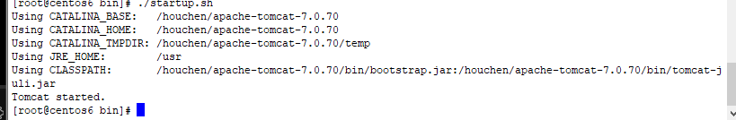

​    2）关闭防火墙

​    `service iptables stop`  (centos6)

​    3) 在windows系统中通过浏览器访问tomcat服务器

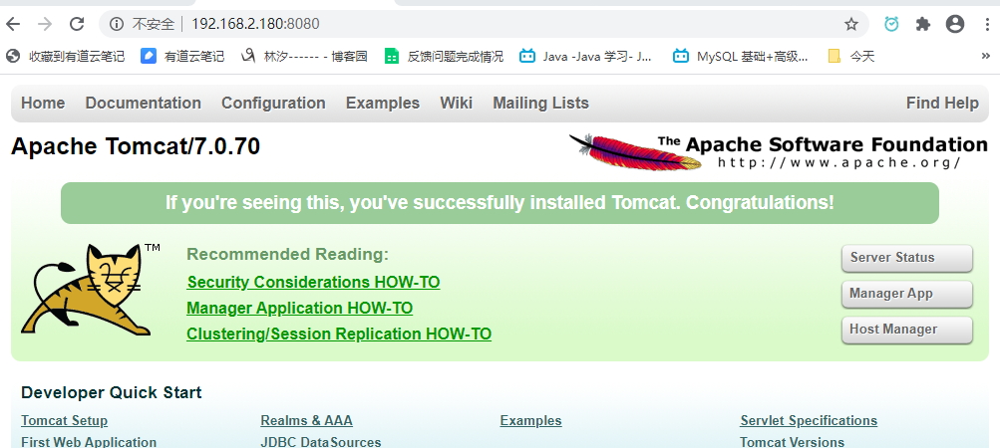

​    4) 访问过程

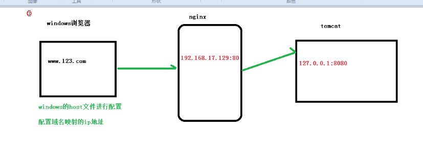

**具体配置**

​    1）本地host文件编辑域名和ip的映射

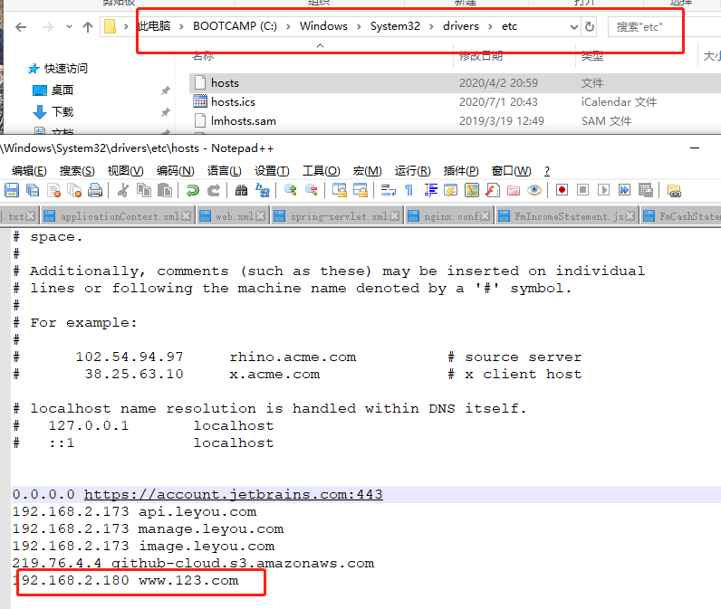

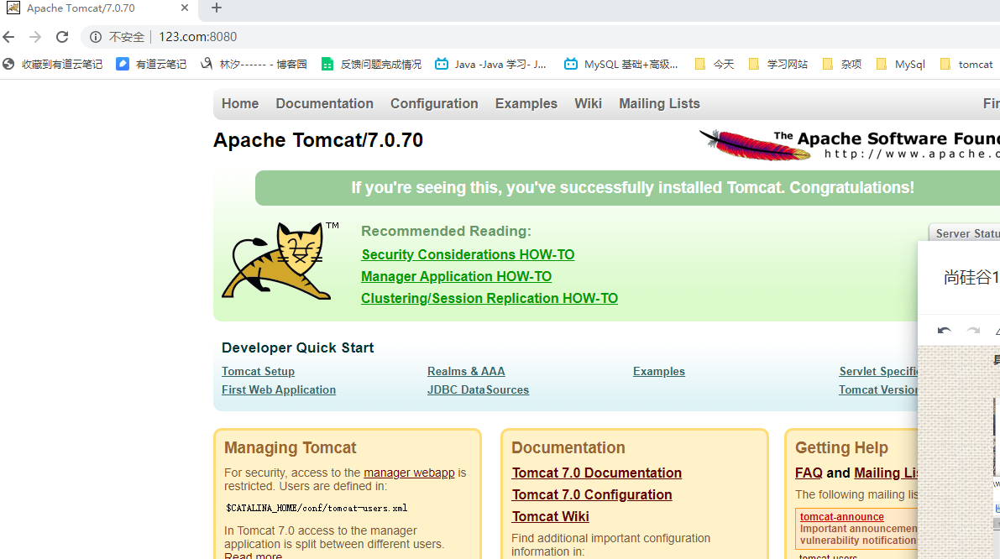

​    2) 配置反向的代理，将发送到192.168.2.180:80的请求转到到本地的127.0.0.1:8080

```bash
 server {
        listen       80;
        server_name  192.168.2.180;


        location / {
            proxy_pass http://127.0.0.1:8080;
        }
    }
```


**2、反向代理实例2**

使用nginx反向代理，根据访问的路径，跳转到不同的端口服务中

nginx监听端口为9001

访问 127.0.0.1:9001/edu/    直接跳转到127.0.1:8080

访问 127.0.0.1:9001/vod/    直接跳转到127.0.1:8081

**准备工作**

1)在虚拟机的8081 和 8081启动两个tomcat


2)  在tomcat中创建文件夹和测试页面


3）配置nginx

```bash
	
	 server {
        listen       9001;
        server_name  192.168.2.180;


        location /edu/ {
            proxy_pass http://127.0.0.1:8080;
        }
		location /vod/ {
            proxy_pass http://127.0.0.1:8081;
        }
    }

```


===>  配置成功

### Nginx实现负载均衡

1、实现效果

在浏览器地址栏中输入地址 ：`192.168.2.180/edu/a.html`,使请求平均到8080 和 8081端口中

2、准备工作

1）准备2台tomcat服务器：8080  8081

2）在2台tomcat的webapps目录中，创建名称是edu的文件夹，在edu文件夹中创建页面 a.html,用于测试。 启动两台 tomcat，准备成功，示例如下


3）对nginx.conf 进行配置

```bash
 #负载均衡
	upstream myserver{
		server 192.168.2.180:8080;
		server 192.168.2.180:8081;
	}
	#监听 192.168.2.180：80,并对请求进行分流
    server {
        listen       80;
        server_name  192.168.2.180;


        location / {
            proxy_pass http://myserver;
        }
    }
	
```

4） 效果如下


刷新后


**nginx 负载均衡的策略：**

1.  轮询（默认）

每个请求按时间逐一分配到不同的后端服务器，如果后端服务器down了，则能自动剔除

2.  weight 

weight代表权重，默认为1，权重越高，被分配的客户端就越多

```bash
 #负载均衡
	upstream myserver{
		server 192.168.2.180:8080 weight=1;
		server 192.168.2.180:8081 weight=2;
	}
```

3.  ip_hash

每个请求按照ip的hash结果分配，那么只要用户的ip不变，访问的服务器就不变，可以解决

session的问题

```bash
	upstream myserver{
            ip_hash;
		server 192.168.2.180:8080 weight=1;
		server 192.168.2.180:8081 weight=2;
	}
```

4.  fair

根据后端服务器的响应时间来分配，响应时间短的优先分配

```bash
upstream myserver{
		server 192.168.2.180:8080 weight=1;
		server 192.168.2.180:8081 weight=2; 
            fair; 
	}
```

### Nginx实现动静分离

**1、概念**

nginx动静分离简单来说就是将动态和静态请求分开，不能单纯的理解成 把动态页面和静态页面

物理分离。严格意义上来说应该是动态请求和静态请求分开。动静分离从目前实现角度来说大致分为两种：

​    1. 将静态文件放在静态资源服务器上，也是目前主流的方案

​    2. 将静态资源和动态资源在一起发布，通过nginx来进行区分

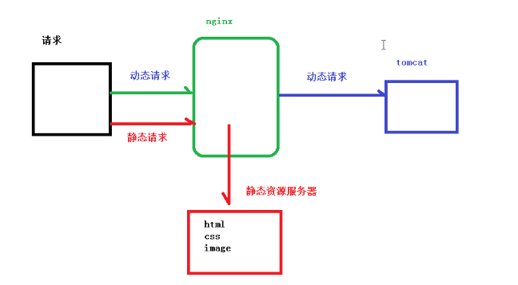

**2、准备工作**

创建静态资源


**3、具体配置**

```bash
 server {
        listen       80;
        server_name  192.168.2.180;


        location /www/ {
            root /data/;
			index  index.html index.htm;
        }
		
		location /image/ {
            root /data/;
			autoindex  on;
        }
    }
```

### Nginx配置高可用集群

**1、什么是nginx的高可用？**

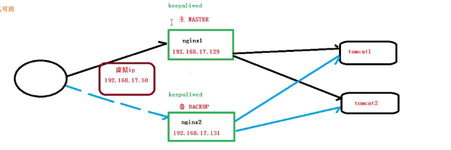

1）需要两台nginx服务器

2）keepalived

3）虚拟ip

**2、准备环境**

1）需要两台linux 服务器  192.168.2.173 和 192.168.2.180

2）在两天服务器上安装nginx

3）在两台服务器上安装 keepalived

​    安装 ：`yum install keepalived -y`

​    检查是否安装以及安装的版本：`rpm -q -a keepalived`

​    安装后，在etc会生成目录 keepalived ,有文件 keepalived.conf

192.168.2.180:

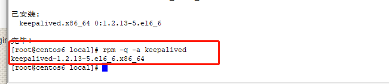

192.168.2.173

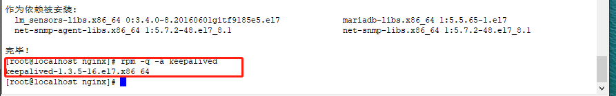

**3、完成高可用配置 （主从配置）**

修改`keepalived.conf`配置文件`/etc/keepalived/keepalived.conf`

-   两台机器的 keepalived 配置文件的修改

192.168.25.101

```shell
! Configuration File for keepalived

global_defs {
   notification_email {
     acassen@firewall.loc
     failover@firewall.loc
     sysadmin@firewall.loc
   }   
   notification_email_from Alexandre.Cassen@firewall.loc
   smtp_server 192.168.25.101
   smtp_connect_timeout 30
   router_id LVS_DEVEL
}

vrrp_script chk_http_port {
    
    script "/usr/local/nginx/nginx_check.sh"

    interval 2              # 检测脚本执行的间隔

    weight 2

}

vrrp_instance VI_1 {
    state MASTER            # 备份服务器上将 MASTER 改为 BACKUP
    interface eth0          # 网卡
    virtual_router_id 51    # 主、备机的 virtual_router_id 须相同
    priority 100            # 主、备机取不同的优先级，主机值较大，备机值较小
    advert_int 1
    authentication {
        auth_type PASS
        auth_pass 1111
    }   
    virtual_ipaddress {
        192.168.25.110      # VRRP H 虚拟地址
    }   
}

```

192.168.25.102

```shell
! Configuration File for keepalived

global_defs {
   notification_email {
     acassen@firewall.loc
     failover@firewall.loc
     sysadmin@firewall.loc
   }   
   notification_email_from Alexandre.Cassen@firewall.loc
   smtp_server 192.168.25.102
   smtp_connect_timeout 30
   router_id LVS_DEVEL
}

vrrp_script chk_http_port {
    
        script "/usr/local/nginx/nginx_check.sh"

        interval 2                              # 检测脚本执行的间隔

        weight 2

}

vrrp_instance VI_1 {
    state BACKUP                        # 备份服务器上将 MASTER 改为 BACKUP
    interface eth0                      # 网卡
    virtual_router_id 51        # 主、备机的 virtual_router_id 须相同
    priority 90                 # 主、备机取不同的优先级，主机值较大，备机值较小
    advert_int 1
    authentication {
        auth_type PASS
        auth_pass 1111
    }   
    virtual_ipaddress {
        192.168.25.110          # VRRP H 虚拟地址
    }   
}

```

nginx_check.sh

```shell
#!/bin/bash
A=`ps -C nginx ¨Cno-header |wc -l`
if [ $A -eq 0 ];then
    /usr/local/nginx/sbin/nginx
    sleep 2
    if [ `ps -C nginx --no-header |wc -l` -eq 0 ];then
        killall keepalived
    fi
fi

```

-   启动两个机器的 nginx 和 keepalived

```shell
# 启动 keepalived
systemctl start keepalived.service

```

-   主备验证
    1.  测试 keepalived 中虚拟 IP 的绑定

浏览器访问 keepalived 中配置的虚拟 IP：192.168.25.110
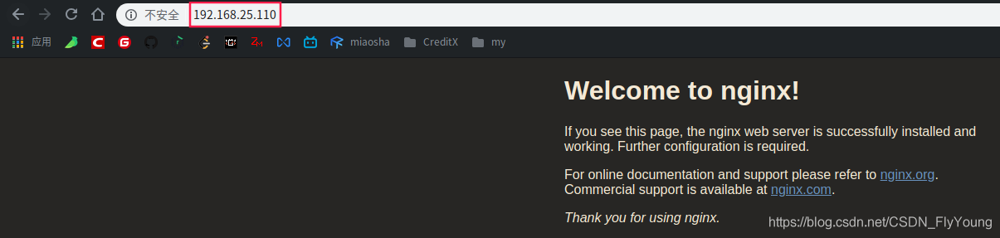
使用 ip 命令查看，发现当前 101 主机的网卡 eth0 已绑定 110 的虚拟 IP
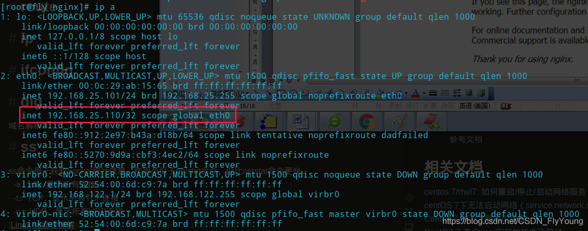

​		2. 测试停止主服务器时的情况

停止 192.168.25.101 主服务器的 nginx 和 keepalived

```shell
# 停止 keepalived
systemctl stop keepalived.service

# 停止 nginx
```

浏览器再次访问 192.168.25.110，效果如下：
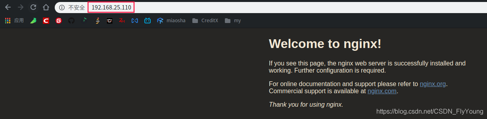
使用 ip 命令查看，发现当前 102 主机的网卡 eth0 已绑定 110 的虚拟 IP
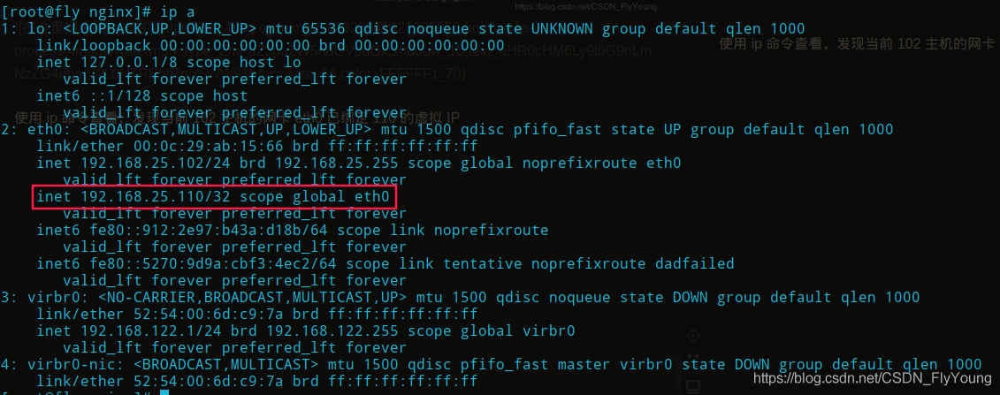

## Nginx原理

**1. master & worker**

**2. worker如何进行工作的**

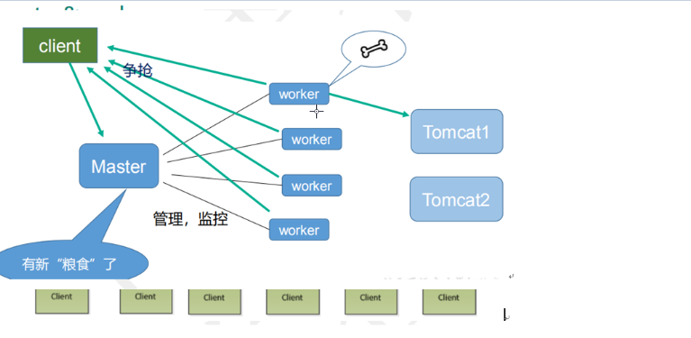

**3. 一个master和多个worker的好处**

1）可以使用 `nginx -s reload`热部署

2）每个worker是一个独立的过程，如果其中一个worker出现问题，其他独立的worker继续进行争抢，不会造成服务中断

**4. 设置多少个worker才是最合适的？**

worker数和服务器的cpu数相等是最为适宜的

**5. 连接数 work_connection**

这个数是每个worker进程所能建立连接的最大值，所以，一个nginx能建立的最大连接数，应该是`work_connections * worker_processes`.

**1）发送一个请求，占用了worker的几个连接数？**

2个或者4个

**2）nginx 有一个 master，有四个 woker，每个 woker 支持最大的连接数 1024，支持的 最大并发数是多少？** 

 普通的静态访问最大并发数是： `worker_connections * worker_processes /2`， 而如果是 HTTP 作 为反向代理来说，最大并发数量应该是 `worker_connections*worker_processes/4`

​        