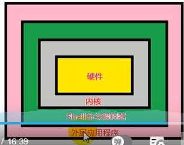

# Shell编程

## Shell概述

Shell 是一个命令行解释器，它为用户提供了一个向 Linux 内核发送请求以便运行程序的界面系统级程序，用户可以用 Shell 来启动、挂起、停止甚至是编写一些程序。



## Shell入门

脚本以`#!/bin/bash`开头，指定解析器

```shell
#!/bin/bash
echo "abc"
```

### 执行方式

1.  直接执行`./shell脚本名.sh`(需要有执行权限)
2.  sh `./shell脚本名.sh`
3.  bash `./shell脚本名.sh`

### 多命令处理

```shell
#!/bin/bash
cd /home/linux/
touch abc.txt
echo "abc" >> abc.txt
```