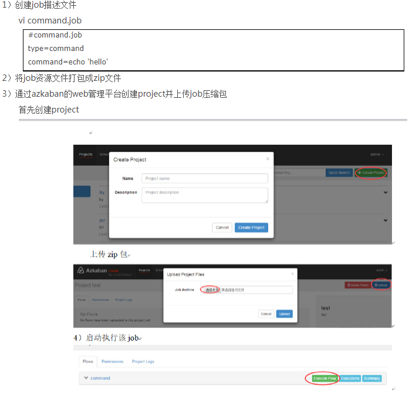
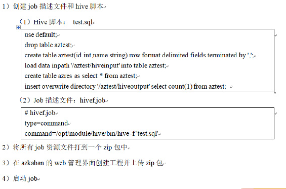

# Azkaban

> http://blog.sina.com.cn/s/blog_c30a9e680102z2l6.html

## 概述

- 为什么需要完整的工作流调度系统

1）一个完整的数据分析系统通常都是由大量任务单元组成：

shell脚本程序，java程序，mapreduce程序、hive脚本等

2）各任务单元之间存在时间先后及前后依赖关系

3）为了很好地组织起这样的复杂执行计划，需要一个工作流调度系统来调度执行；

例如，我们可能有这样一个需求，某个业务系统每天产生20G原始数据，我们每天都要对其进行处理，处理步骤如下所示：

（1）通过Hadoop先将原始数据同步到HDFS上；

（2）借助MapReduce计算框架对原始数据进行计算，生成的数据以分区表的形式存储到多张Hive表中；

（3）需要对Hive中多个表的数据进行JOIN处理，得到一个明细数据Hive大表；

（4）将明细数据进行复杂的统计分析，得到结果报表信息；

（5）需要将统计分析得到的结果数据同步到业务系统中，供业务调用使用。


- Azkaban与Oozie对比

  对市面上最流行的两种调度器，给出以下详细对比，以供技术选型参考。总体来说，ooize相比azkaban是一个重量级的任务调度系统，功能全面，但配置使用也更复杂。如果可以不在意某些功能的缺失，轻量级调度器azkaban是很不错的候选对象。

  详情如下：

  1）功能

  两者均可以调度mapreduce，pig，java，脚本工作流任务

  两者均可以定时执行工作流任务

  2）工作流定义

  Azkaban使用Properties文件定义工作流

  Oozie使用XML文件定义工作流

  3）工作流传参

  Azkaban支持直接传参，例如${input}

  Oozie支持参数和EL表达式，例如${fs:dirSize(myInputDir)}

  4）定时执行

  Azkaban的定时执行任务是基于时间的

  Oozie的定时执行任务基于时间和输入数据

  5）资源管理

  Azkaban有较严格的权限控制，如用户对工作流进行读/写/执行等操作

  Oozie暂无严格的权限控制

  6）工作流执行

  Azkaban有两种运行模式，分别是solo server mode(executor server和web server部署在同一台节点)和multi server mode(executor server和web server可以部署在不同节点)

  Oozie作为工作流服务器运行，支持多用户和多工作流

  7）工作流管理

  Azkaban支持浏览器以及ajax方式操作工作流

  Oozie支持命令行、HTTP REST、Java API、浏览器操作工作流

- Azkaban特点

  Azkaban是由Linkedin开源的一个批量工作流任务调度器。用于在一个工作流内以一个特定的顺序运行一组工作和流程。Azkaban定义了一种KV文件格式来建立任务之间的依赖关系，并提供一个易于使用的web用户界面维护和跟踪你的工作流。

  它有如下功能特点：

  1）Web用户界面

  2）方便上传工作流

  3）方便设置任务之间的关系

  4）调度工作流

  5）认证/授权(权限的工作)

  6）能够杀死并重新启动工作流

  7）模块化和可插拔的插件机制

  8）项目工作区

  9）工作流和任务的日志记录和审计

## 安装部署

### 准备

1）将Azkaban Web服务器、Azkaban执行服务器和MySQL拷贝到hadoop102虚拟机/opt/software目录下

```
azkaban-web-server-2.5.0.tar.gz

azkaban-executor-server-2.5.0.tar.gz

azkaban-sql-script-2.5.0.tar.gz

mysql-libs.zip
```

2）目前azkaban只支持 mysql，需安装mysql服务器，本文档中默认已安装好mysql服务器，并建立了 root用户，密码 root。

### 安装


4）azkaban脚本导入

   进入mysql，创建azkaban数据库，并将解压的脚本导入到azkaban数据库。

```bash
[atguigu@hadoop102 azkaban]$ mysql -uroot -p000000

mysql> create database azkaban;

mysql> use azkaban;

mysql> source /opt/module/azkaban/azkaban-2.5.0/create-all-sql-2.5.0.sql
```

### 创建SSL配置

1）生成 keystore的密码及相应信息


2）将keystore 考贝到 azkaban web服务器根目录中

```bash
[atguigu@hadoop102 hadoop-2.7.2]$ mv keystore /opt/module/azkaban/server/
```

### 时间同步设置

先配置好服务器节点上的时区

1）如果在/usr/share/zoneinfo/这个目录下不存在时区配置文件Asia/Shanghai，就要用 tzselect 生成。


2）拷贝该时区文件，覆盖系统本地时区配置

```bash
cp /usr/share/zoneinfo/Asia/Shanghai /etc/localtime 
```

3）集群时间同步

```bas
sudo date -s ‘2017-06-14 09:23:45’

hwclock -w
```

### 配置文件

- web服务器配置

  

- 执行服务器配置

  

### 启动服务器

- 启动web服务器

  在azkaban web服务器目录下执行启动命令

  ```bash
  [atguigu@hadoop102 server]$ pwd
  
  /opt/module/azkaban/server
  
  [atguigu@hadoop102 server]$ bin/azkaban-web-start.sh
  
  bin/azkaban-web-start.sh
  ```

- 启动执行服务器

  在执行服务器目录下执行启动命令

  ```bash
  [atguigu@hadoop102 executor]$ pwd
  
  /opt/module/azkaban/executor
  
  [atguigu@hadoop102 executor]$ bin/azkaban-executor-start.sh
  ```

  启动完成后，在浏览器(建议使用谷歌浏览器)中输入https://服务器IP地址:8443，即可访问azkaban服务了。在登录中输入刚才新的户用名及密码，点击 login。

## Azkaban实战

Azkaba内置的任务类型支持command、java

### Command类型之单一job案例



### Command类型之多job工作流案例


### HDFS操作任务


### MR任务


### Hive脚本任务



