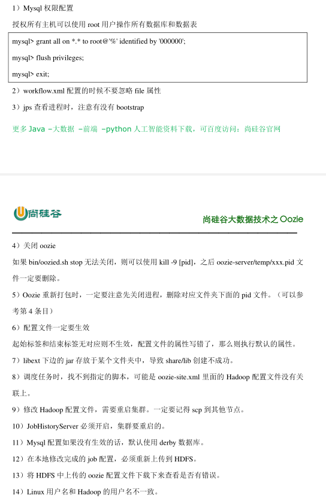

# Oozie

## 概述

Oozie 英文翻译为：驯象人。一个基于工作流引擎的开源框架，由 Cloudera 公司贡献给
Apache，提供对 Hadoop MapReduce、Pig Jobs 的任务调度与协调。Oozie 需要部署到 Java
Servlet 容器中运行。主要用于定时调度任务，多任务可以按照执行的逻辑顺序调度

## 功能模块

- 模块

1. Workflow
    顺序执行流程节点，支持 fork（分支多个节点），join（合并多个节点为一个）

2. Coordinator
    定时触发 workflow

3. Bundle Job
    绑定多个 Coordinator

- 常用节点

1. 控制流节点（Control Flow Nodes）
     控制流节点一般都是定义在工作流开始或者结束的位置，比如 start,end,kill 等。以及提供工
     作流的执行路径机制，如 decision，fork，join 等。
2. 动作节点（Action Nodes）
     负责执行具体动作的节点，比如：拷贝文件，执行某个 Shell 脚本等等

## 部署

### 部署 Hadoop（CDH 版本）

core-site.xml

```xml
<!-- Oozie Server 的 Hostname -->
<property>
<name>hadoop.proxyuser.atguigu.hosts</name>
<value>*</value>
</property>
<!-- 允许被 Oozie 代理的用户组 -->
<property>
<name>hadoop.proxyuser.atguigu.groups</name>
<value>*</value>
</property>
```

mapred-site.xml

```xml
<!-- 配置 MapReduce JobHistory Server 地址 ，默认端口 10020 -->
<property>
<name>mapreduce.jobhistory.address</name>
<value>hadoop102:10020</value>
</property>
<!-- 配置 MapReduce JobHistory Server web ui 地址， 默认端口 19888 -->
<property>
<name>mapreduce.jobhistory.webapp.address</name>
<value>hadoop102:19888</value>
</property>
```

yarn-site.xml

```xml
<!-- 任务历史服务 -->
<property>
<name>yarn.log.server.url</name>
<value>http://hadoop102:19888/jobhistory/logs/</value>
</property>
```

重启hadoop集群

```bash
[atguigu@hadoop102 hadoop-2.7.2]$ sbin/start-dfs.sh
[atguigu@hadoop103 hadoop-2.7.2]$ sbin/start-yarn.sh
[atguigu@hadoop102 hadoop-2.7.2]$ sbin/mr-jobhistory-daemon.sh start historyserver
```

### 部署Oozie

oozie-site.xml

```xml
属性：oozie.service.JPAService.jdbc.driver
属性值：com.mysql.jdbc.Driver
解释：JDBC 的驱动
属性：oozie.service.JPAService.jdbc.url
属性值：jdbc:mysql://hadoop102:3306/oozie
解释：oozie 所需的数据库地址
属性：oozie.service.JPAService.jdbc.username
属性值：root
解释：数据库用户名
属性：oozie.service.JPAService.jdbc.password
属性值：000000
解释：数据库密码
属性：oozie.service.HadoopAccessorService.hadoop.configurations
属性值：*=/opt/module/cdh/hadoop-2.5.0-cdh5.3.6/etc/hadoop
解释：让 Oozie 引用 Hadoop 的配置文件
```

数据库配置

```bash
$ mysql -uroot -p000000
mysql> create database oozie
```


## 使用

**案例一：Oozie 调度 shell 脚本**
目标：使用 Oozie 调度 Shell 脚本
分步实现：
1）解压官方案例模板
`[atguigu@hadoop102 oozie-4.0.0-cdh5.3.6]$ tar -zxvf oozie-examples.tar.gz`
2）创建工作目录
`[atguigu@hadoop102 oozie-4.0.0-cdh5.3.6]$ mkdir oozie-apps/`
3）拷贝任务模板到 oozie-apps/目录
`[atguigu@hadoop102 oozie-4.0.0-cdh5.3.6]$ cp -r examples/apps/shell/ oozie-apps`
4）编写脚本 p1.sh
`[atguigu@hadoop102 oozie-4.0.0-cdh5.3.6]$ vi oozie-apps/shell/p1.sh`
内容如下：

```bash
#!/bin/bash
/sbin/ifconfig > /opt/module/p1.log
```

5）修改 job.properties 和 workflow.xml 文件
job.properties

```properties
#HDFS 地址
nameNode=hdfs://hadoop102:8020
#ResourceManager 地址
jobTracker=hadoop103:8032
#队列名称
queueName=default
examplesRoot=oozie-apps
oozie.wf.application.path=${nameNode}/user/${user.name}/${examplesRoot}/shell
EXEC=p1.sh
```

workflow.xml

```xml
<workflow-app xmlns="uri:oozie:workflow:0.4" name="shell-wf">
<start to="shell-node"/>
<action name="shell-node">
<shell xmlns="uri:oozie:shell-action:0.2">
<job-tracker>${jobTracker}</job-tracker>
<name-node>${nameNode}</name-node>
<configuration>
<property>
<name>mapred.job.queue.name</name>
<value>${queueName}</value>
</property>
</configuration>
<exec>${EXEC}</exec>
<!-- <argument>my_output=Hello Oozie</argument> -->
<file>/user/atguigu/oozie-apps/shell/${EXEC}#${EXEC}</file>
<capture-output/>
</shell>
<ok to="end"/>
<error to="fail"/>
</action>
<decision name="check-output">
<switch>
<case to="end">
${wf:actionData('shell-node')['my_output'] eq 'Hello Oozie'}
</case>
<default to="fail-output"/>
</switch>
</decision>
<kill name="fail">
<message>Shell action failed, error
message[${wf:errorMessage(wf:lastErrorNode())}]</message>
</kill>
<kill name="fail-output">
<message>Incorrect output, expected [Hello Oozie] but was
[${wf:actionData('shell-node')['my_output']}]</message>
</kill>
<end name="end"/>
</workflow-app>
```

6）上传任务配置

```bash
[atguigu@hadoop102 oozie-4.0.0-cdh5.3.6]$ /opt/module/cdh/hadoop-2.5.0-cdh5.3.6/bin/hadoop
fs -put oozie-apps/ /user/atguigu
```

7）执行任务

```bash
[atguigu@hadoop102 oozie-4.0.0-cdh5.3.6]$ bin/oozie job -oozie http://hadoop101:11000/oozie
-config oozie-apps/shell/job.properties -run
```

8）杀死某个任务

```bash
[atguigu@hadoop102 oozie-4.0.0-cdh5.3.6]$ bin/oozie job -oozie http://hadoop101:11000/oozie
-kill 0000004-170425105153692-oozie-z-W
```

**案例二：Oozie 逻辑调度执行多个 Job**
目标：使用 Oozie 执行多个 Job 调度
分步执行：
1） 解压官方案例模板
`[atguigu@hadoop102 oozie-4.0.0-cdh5.3.6]$ tar -zxf oozie-examples.tar.gz`
2） 编写脚本
`[atguigu@hadoop102 oozie-4.0.0-cdh5.3.6]$ vi oozie-apps/shell/p2.sh`
内容如下：

```bash
#!/bin/bash
/bin/date > /opp2.log
```

3）修改 job.properties 和 workflow.xml 文件
job.properties

```properties
nameNode=hdfs://hadoop102:8020
jobTracker=hadoop103:8032
queueName=default
examplesRoot=oozie-apps
oozie.wf.application.path=${nameNode}/user/${user.name}/${examplesRoot}/shell
EXEC1=p1.sh
EXEC2=p2.sh
```

workflow.xml

```xml
<workflow-app xmlns="uri:oozie:workflow:0.4" name="shell-wf">
<start to="p1-shell-node"/>
<action name="p1-shell-node">
<shell xmlns="uri:oozie:shell-action:0.2">
<job-tracker>${jobTracker}</job-tracker>
<name-node>${nameNode}</name-node>
<configuration>
<property>
<name>mapred.job.queue.name</name>
<value>${queueName}</value>
</property>
</configuration>
<exec>${EXEC1}</exec>
<file>/user/atguigu/oozie-apps/shell/${EXEC1}#${EXEC1}</file>
<!-- <argument>my_output=Hello Oozie</argument>-->
<capture-output/>
</shell>
<ok to="p2-shell-node"/>
<error to="fail"/>
</action>
<action name="p2-shell-node">
<shell xmlns="uri:oozie:shell-action:0.2">
<job-tracker>${jobTracker}</job-tracker>
<name-node>${nameNode}</name-node>
<configuration>
<property>
<name>mapred.job.queue.name</name>
<value>${queueName}</value>
</property>
</configuration>
<exec>${EXEC2}</exec>
<file>/user/admin/oozie-apps/shell/${EXEC2}#${EXEC2}</file>
<!-- <argument>my_output=Hello Oozie</argument>-->
<capture-output/>
</shell>
<ok to="end"/>
<error to="fail"/>
</action>
<decision name="check-output">
<switch>
<case to="end">
${wf:actionData('shell-node')['my_output'] eq 'Hello Oozie'}
</case>
<default to="fail-output"/>
</switch>
</decision>
<kill name="fail">
<message>Shell action failed, error
message[${wf:errorMessage(wf:lastErrorNode())}]</message>
</kill>
<kill name="fail-output">
<message>Incorrect output, expected [Hello Oozie] but was
[${wf:actionData('shell-node')['my_output']}]</message>
</kill>
<end name="end"/>
</workflow-app>
```

3） 上传任务配置
`$ bin/hadoop fs -rmr /user/atguigu/oozie-apps/`
`$ bin/hadoop fs -put oozie-apps/ /user/atguigu/`
4） 执行任务
`[atguigu@hadoop102 oozie-4.0.0-cdh5.3.6]$ bin/oozie job -oozie http://hadoop101:11000/oozie
-config oozie-apps/shell/job.properties -run`

**案例三：Oozie 调度 MapReduce 任务**
目标：使用 Oozie 调度 MapReduce 任务
分步执行：
1）找到一个可以运行的 mapreduce 任务的 jar 包（可以用官方的，也可以是自己写的）
2）拷贝官方模板到 oozie-apps
`[atguigu@hadoop102oozie-4.0.0-cdh5.3.6]$cp -r /opt/module/cdh/oozie-4.0.0-cdh5.3.6/examples/apps/map-reduce/ oozie-apps/`

3）测试一下 wordcount 在 yarn 中的运行
`[atguigu@hadoop102 oozie-4.0.0-cdh5.3.6]$ /opt/module/cdh/hadoop-2.5.0-cdh5.3.6/bin/yarn jar
/opt/module/cdh/hadoop-2.5.0-cdh5.3.6/share/hadoop/mapreduce/hadoop-mapreduce-examples-2.
5.0-cdh5.3.6.jar wordcount /input/ /output/`

4）配置 map-reduce 任务的 job.properties 以及 workflow.xml
job.properties

```properties
nameNode=hdfs://hadoop102:8020
jobTracker=hadoop103:8032
queueName=default
examplesRoot=oozie-apps
#hdfs://hadoop102:8020/user/admin/oozie-apps/map-reduce/workflow.xml
oozie.wf.application.path=${nameNode}/user/${user.name}/${examplesRoot}/map-reduce/workf
low.xml
outputDir=map-reduce
```

workflow.xml

```xml
<workflow-app xmlns="uri:oozie:workflow:0.2" name="map-reduce-wf">
<start to="mr-node"/>
<action name="mr-node">
<map-reduce>
<job-tracker>${jobTracker}</job-tracker>
<name-node>${nameNode}</name-node>
<prepare>
<delete path="${nameNode}/output/"/>
</prepare>
<configuration>
<property>
<name>mapred.job.queue.name</name>
<value>${queueName}</value>
</property>
<!-- 配置调度 MR 任务时，使用新的 API -->
<property>
<name>mapred.mapper.new-api</name>
<value>true</value>
</property>
<property>
<name>mapred.reducer.new-api</name>
<value>true</value>
</property>
<!-- 指定 Job Key 输出类型 -->
<property>
<name>mapreduce.job.output.key.class</name>
<value>org.apache.hadoop.io.Text</value>
</property>
<!-- 指定 Job Value 输出类型 -->
<property>
<name>mapreduce.job.output.value.class</name>
<value>org.apache.hadoop.io.IntWritable</value>
</property>
<!-- 指定输入路径 -->
<property>
<name>mapred.input.dir</name>
<value>/input/</value>
</property>
<!-- 指定输出路径 -->
<property>
<name>mapred.output.dir</name>
<value>/output/</value>
</property>
<!-- 指定 Map 类 -->
<property>
<name>mapreduce.job.map.class</name>
<value>org.apache.hadoop.examples.WordCount$TokenizerMapper</value>
</property>
<!-- 指定 Reduce 类 -->
<property>
<name>mapreduce.job.reduce.class</name>
<value>org.apache.hadoop.examples.WordCount$IntSumReducer</value>
</property>
<property>
<name>mapred.map.tasks</name>
<value>1</value>
</property>
</configuration>
</map-reduce>
<ok to="end"/>
<error to="fail"/>
</action>
<kill name="fail">
<message>Map/Reduce failed, error
message[${wf:errorMessage(wf:lastErrorNode())}]</message>
</kill>
<end name="end"/>
</workflow-app>
```

5）拷贝待执行的 jar 包到 map-reduce 的 lib 目录下
`[atguigu@hadoop102oozie-4.0.0-cdh5.3.6]$cp -a /opt /module/cdh/hadoop-2.5.0-cdh5.3.6/share/hadoop/mapreduce/hadoop-mapreduce-examples-2.5.0-cdh5.3.6.jar oozie-apps/map-reduce/lib`
6）上传配置好的 app 文件夹到 HDFS
`[atguigu@hadoop102 oozie-4.0.0-cdh5.3.6]$ /opt/module/cdh/hadoop-2.5.0-cdh5.3.6/bin/hdfs dfs -put oozie-apps/map-reduce/ /user/admin/oozie-apps`
7）执行任务
`[atguigu@hadoop102 oozie-4.0.0-cdh5.3.6]$ bin/oozie job -oozie http://hadoop102:11000/oozie -config oozie-apps/map-reduce/job.properties -run`

**案例四：Oozie 定时任务/循环任务**
目标：Coordinator 周期性调度任务
分步实现：
1） 配置 Linux 时区以及时间服务器
2） 检查系统当前时区：

> date -R

注意：如果显示的时区不是+0800，删除 localtime 文件夹后，再关联一个正确时区的链
接过去，命令如下：

> rm -rf /etc/localtime

> ln -s /usr/share/zoneinfo/Asia/Shanghai /etc/localtime

同步时间：

> ntpdate pool.ntp.org

修改 NTP 配置文件：

> vi /etc/ntp.conf

去掉下面这行前面的# ,并把网段修改成自己的网段：
restrict 192.168.122.0 mask 255.255.255.0 nomodify notrap
注释掉以下几行：
#server 0.centos.pool.ntp.org
#server 1.centos.pool.ntp.org
#server 2.centos.pool.ntp.org
把下面两行前面的#号去掉,如果没有这两行内容,需要手动添加
server 127.127.1.0 # local clock
fudge 127.127.1.0 stratum 10
重启 NTP 服务：

> systemctl start ntpd.service，

注意，如果是 centOS7 以下的版本，使用命令：service ntpd start

> systemctl enable ntpd.service，

注意，如果是 centOS7 以下的版本，使用命令：chkconfig ntpd on
集群其他节点去同步这台时间服务器时间：
首先需要关闭这两台计算机的 ntp 服务

> systemctl stop ntpd.service，

centOS7 以下，则：service ntpd stop

> systemctl disable ntpd.service，

centOS7 以下，则：chkconfig ntpd off

> systemctl status ntpd，查看 ntp 服务状态

> pgrep ntpd，查看 ntp 服务进程 id

同步第一台服务器 linux01 的时间：

> ntpdate linux01

使用 root 用户制定计划任务,周期性同步时间：

> crontab -e

*/10 * * * * /usr/sbin/ntpdate hadoop102
重启定时任务：

> systemctl restart crond.service，

centOS7 以下使用：service crond restart，
其他台机器的配置同理。
3）配置 oozie-site.xml 文件
属性：oozie.processing.timezone
属性值：GMT+0800
解释：修改时区为东八区区时
注：该属性去 oozie-default.xml 中找到即可
4）修改 js 框架中的关于时间设置的代码
$ vi /opt/module/cdh/oozie-4.0.0-cdh5.3.6/oozie-server/webapps/oozie/oozie-console.js
修改如下：

```js
function getTimeZone() {
Ext.state.Manager.setProvider(new Ext.state.CookieProvider());
return Ext.state.Manager.get("TimezoneId","GMT+0800");
}
```

5）重启 oozie 服务，并重启浏览器（一定要注意清除缓存）
`[atguigu@hadoop102 oozie-4.0.0-cdh5.3.6]$ bin/oozied.sh stop`
`[atguigu@hadoop102 oozie-4.0.0-cdh5.3.6]$ bin/oozied.sh start`
6）拷贝官方模板配置定时任务\
`$ cp -r examples/apps/cron/ oozie-apps/`
7）修改模板 job.properties 和 coordinator.xml 以及 workflow.xml
job.properties

```properties
nameNode=hdfs://hadoop102:8020
jobTracker=hadoop103:8032
queueName=default
examplesRoot=oozie-apps
oozie.coord.application.path=${nameNode}/user/${user.name}/${examplesRoot}/cron
#start：必须设置为未来时间，否则任务失败
start=2017-07-29T17:00+0800
end=2017-07-30T17:00+0800
workflowAppUri=${nameNode}/user/${user.name}/${examplesRoot}/cron
EXEC3=p3.sh
```

coordinator.xml

```xml
<coordinator-app name="cron-coord" frequency="${coord:minutes(5)}" start="${start}"
end="${end}" timezone="GMT+0800" xmlns="uri:oozie:coordinator:0.2">
<action>
<workflow>
<app-path>${workflowAppUri}</app-path>
<configuration>
<property>
<name>jobTracker</name>
<value>${jobTracker}</value>
</property>
<property>
<name>nameNode</name>
<value>${nameNode}</value>
</property>
<property>
<name>queueName</name>
<value>${queueName}</value>
</property>
</configuration>
</workflow>
</action>
</coordinator-app>
```

workflow.xml

```xml
<workflow-app xmlns="uri:oozie:workflow:0.5" name="one-op-wf">
<start to="p3-shell-node"/>
<action name="p3-shell-node">
<shell xmlns="uri:oozie:shell-action:0.2">
<job-tracker>${jobTracker}</job-tracker>
<name-node>${nameNode}</name-node>
<configuration>
<property>
<name>mapred.job.queue.name</name>
<value>${queueName}</value>
</property>
</configuration>
<exec>${EXEC3}</exec>
<file>/user/atguigu/oozie-apps/cron/${EXEC3}#${EXEC3}</file>
<!-- <argument>my_output=Hello Oozie</argument>-->
<capture-output/>
</shell>
<ok to="end"/>
<error to="fail"/>
</action>
<kill name="fail">
<message>Shell action failed, error
message[${wf:errorMessage(wf:lastErrorNode())}]</message>
</kill>
<kill name="fail-output">
<message>Incorrect output, expected [Hello Oozie] but was
[${wf:actionData('shell-node')['my_output']}]</message>
</kill>
<end name="end"/>
</workflow-app>
```

8）上传配置
`[atguigu@hadoop102 oozie-4.0.0-cdh5.3.6]$ /opt/module/cdh/hadoop-2.5.0-cdh5.3.6/bin/hdfs dfs
-put oozie-apps/cron/ /user/admin/oozie-apps`
9）启动任务
`[atguigu@hadoop102 oozie-4.0.0-cdh5.3.6]$ bin/oozie job -oozie http://hadoop102:11000/oozie
-config oozie-apps/cron/job.properties -run`
注意：oozie 允许的最小执行任务的频率是 5 分钟

## 常见问题



